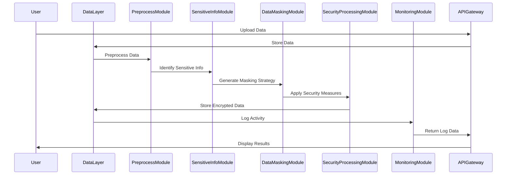

                 

### 摘要

本文将探讨智能化语言学习模型（LLM）在测试数据脱敏与安全处理中的应用。随着人工智能技术的迅猛发展，LLM在各个领域的应用越来越广泛，但其处理的数据中往往包含敏感信息，这给数据安全带来了挑战。文章首先介绍了数据脱敏的必要性、LLM的基本原理和测试数据脱敏的重要性，然后详细描述了智能化LLM、测试数据脱敏技术及安全处理的关键步骤。接着，文章通过Mermaid流程图和Python代码示例，深入讲解了数据脱敏和安全的算法原理，并展示了一个完整的系统分析与架构设计方案。通过实际案例分析和详细讲解，本文旨在为开发者提供实用的技术指导，帮助他们在智能化LLM测试中实现高效且安全的数据处理。文章最后总结了最佳实践建议，并提出了未来研究的方向。关键词：数据脱敏、智能化LLM、安全处理、算法原理、系统架构、最佳实践。

### 第一部分：研究背景与核心概念

#### 第1章：问题背景与核心概念

##### 1.1 研究背景

随着人工智能技术的不断发展，语言学习模型（LLM）已经成为自然语言处理领域的一个重要工具。LLM通过从大量文本数据中学习语言规律，能够实现机器翻译、文本摘要、问答系统等多种功能。然而，在LLM的测试和应用过程中，经常需要处理大量的测试数据。这些测试数据往往包含了用户的隐私信息、业务敏感信息等，如何对这些数据进行脱敏和安全处理，成为了亟待解决的问题。

首先，**数据脱敏**的必要性在于确保测试数据的安全性和合规性。在LLM的训练和测试过程中，若直接使用包含敏感信息的原始数据，可能会导致数据泄露，违反相关法律法规，给企业和个人带来严重的法律风险。因此，数据脱敏是保障数据安全的重要手段，旨在在不影响数据使用价值的前提下，去除或隐藏敏感信息。

其次，**LLM技术在数据脱敏中的应用**。随着人工智能技术的发展，智能化LLM在数据脱敏领域展现了巨大的潜力。通过智能化LLM，可以自动化地识别和处理测试数据中的敏感信息，实现高效的脱敏过程。相比传统的手工脱敏方法，智能化LLM不仅提高了脱敏效率，还能更好地保留数据中的有用信息，减少信息损失。

最后，**安全处理的重要性**。在测试数据脱敏的过程中，不仅要去除敏感信息，还需要确保脱敏后的数据不会泄露任何可能的隐私信息。安全处理涉及多个方面，包括数据加密、访问控制、审计等。通过全面的安全处理，可以确保测试数据的保密性、完整性和可用性，防止数据被未经授权的访问或篡改。

##### 1.2 核心概念介绍

###### 1.2.1 智能化LLM

###### 1.2.1.1 智能化LLM的定义

智能化LLM（Intelligent Language Learning Model）是一种结合了人工智能和数据科学技术的先进模型，能够从大量文本数据中自动学习并提取语言规律。与传统的LLM相比，智能化LLM不仅具备更强的自学习能力，还能通过机器学习和深度学习算法，不断提升其性能和准确性。

###### 1.2.1.2 智能化LLM的工作原理

智能化LLM的工作原理主要包括以下三个阶段：

1. **数据预处理**：对原始文本数据进行清洗和标注，将无格式化、低质量的数据转换为适合训练的格式。
2. **模型训练**：利用深度学习算法（如神经网络、循环神经网络等）对预处理后的数据集进行训练，学习文本数据的内在特征和规律。
3. **模型评估与优化**：通过评估模型在测试集上的性能，不断调整模型参数，优化模型结构，以提高模型的准确性和鲁棒性。

###### 1.2.2 测试数据脱敏

###### 1.2.2.1 数据脱敏的定义

数据脱敏（Data Masking）是一种数据处理技术，旨在在不影响数据使用价值的前提下，去除或隐藏数据中的敏感信息。数据脱敏可以采用多种方法，包括字符替换、数字掩码、随机化等，以保护数据的安全性。

###### 1.2.2.2 常见的数据脱敏技术

常见的数据脱敏技术包括：

1. **字符替换**：将敏感字符替换为特定的占位符，如将姓名中的字母替换为星号。
2. **数字掩码**：对敏感数字进行遮挡或替换，如将电话号码中的中间几位替换为星号。
3. **随机化**：将敏感信息随机替换为不相关的数据，如将地址随机替换为虚构的地名。
4. **加密**：对敏感信息进行加密处理，确保数据在传输和存储过程中保持安全。

###### 1.2.3 安全处理

###### 1.2.3.1 安全处理的定义

安全处理（Security Processing）是指通过一系列安全措施，确保数据在处理过程中的保密性、完整性和可用性。安全处理包括数据加密、访问控制、审计等多个方面，旨在防止数据泄露、篡改和未经授权的访问。

###### 1.2.3.2 安全处理的关键步骤

安全处理的关键步骤包括：

1. **数据加密**：对敏感数据使用加密算法进行加密，确保数据在传输和存储过程中不被窃取或篡改。
2. **访问控制**：通过权限管理和身份验证，确保只有授权用户可以访问敏感数据。
3. **审计**：记录数据的访问和修改历史，以便在发生安全事件时进行追踪和审计。

##### 1.3 核心概念间的联系

###### 1.3.1 智能化LLM与数据脱敏的关系

智能化LLM与数据脱敏之间存在密切的联系。智能化LLM可以自动化地识别和处理测试数据中的敏感信息，实现高效的脱敏过程。同时，数据脱敏技术的应用有助于保护智能化LLM训练和测试过程中的数据安全，避免敏感信息泄露。

###### 1.3.2 智能化LLM与安全处理的结合

智能化LLM与安全处理相结合，可以进一步提升数据安全水平。通过智能化LLM，可以自动化地识别和处理敏感信息，实现高效的数据脱敏；而通过安全处理，可以确保脱敏后的数据在存储、传输和使用过程中保持安全，防止数据泄露和篡改。

##### 1.4 本章小结

本章介绍了智能化LLM测试数据脱敏与安全处理的研究背景和核心概念。通过对数据脱敏、智能化LLM和安全处理的详细描述，本文为后续章节的深入探讨奠定了基础。在接下来的章节中，我们将进一步分析智能化LLM在数据脱敏和安全管理中的应用，并提出相应的解决方案。

#### 第2章：智能化LLM在测试数据脱敏中的应用

智能化语言学习模型（LLM）在自然语言处理领域有着广泛的应用，其在测试数据脱敏中的应用尤为突出。智能化LLM能够自动化地识别和处理测试数据中的敏感信息，大大提高了数据脱敏的效率和准确性。本章将详细探讨智能化LLM在测试数据脱敏中的应用，分析其工作原理和实现方法。

##### 2.1 智能化LLM的工作原理

智能化LLM是基于深度学习和自然语言处理技术的高级模型，其工作原理可以分为以下几个阶段：

###### 2.1.1 数据预处理

在训练智能化LLM之前，需要对测试数据进行预处理。预处理过程包括文本清洗、文本标注和数据格式转换等步骤。文本清洗旨在去除文本中的无关信息和噪声，如HTML标签、特殊字符和停用词等。文本标注则是对文本数据进行结构化处理，为后续的深度学习训练提供标注信息。数据格式转换是将文本数据转换为适合深度学习训练的格式，如Word2Vec或BERT嵌入向量。

###### 2.1.2 模型训练

模型训练是智能化LLM的核心步骤。通过深度学习算法，如循环神经网络（RNN）、长短时记忆网络（LSTM）和Transformer等，智能化LLM能够从大量的文本数据中学习语言规律和特征。在训练过程中，模型会不断调整内部参数，以最小化预测误差，提高模型的准确性和鲁棒性。

###### 2.1.3 模型评估与优化

在模型训练完成后，需要对模型进行评估和优化。评估过程通常使用验证集或测试集，通过计算模型的准确率、召回率、F1值等指标，评估模型的性能。优化过程则通过调整模型参数、增加训练数据或改进网络结构等手段，进一步提升模型的性能。

##### 2.2 智能化LLM在测试数据脱敏中的应用

智能化LLM在测试数据脱敏中的应用主要包括以下几个方面：

###### 2.2.1 敏感信息识别

利用智能化LLM，可以自动化地识别测试数据中的敏感信息。通过在训练阶段学习大量的文本数据，模型能够识别出姓名、电话号码、地址等敏感信息的特征。在测试阶段，模型可以实时地识别输入数据中的敏感信息，并对其进行标记。

###### 2.2.2 脱敏策略生成

一旦识别出敏感信息，智能化LLM可以生成相应的脱敏策略。例如，模型可以根据敏感信息的类型和上下文，选择不同的脱敏方法，如字符替换、数字掩码或随机化等。通过智能化LLM生成的脱敏策略，可以确保脱敏过程既高效又准确。

###### 2.2.3 脱敏效果评估

智能化LLM不仅可以生成脱敏策略，还可以评估脱敏效果。通过在测试数据集上应用脱敏策略，模型可以评估脱敏后的数据是否仍然包含敏感信息，以及脱敏策略对数据质量的影响。这样，开发者可以不断优化脱敏策略，提高数据脱敏的效果。

##### 2.3 实现方法

智能化LLM在测试数据脱敏中的应用可以通过以下步骤实现：

1. **数据收集与预处理**：收集大量的测试数据，并进行清洗、标注和格式转换等预处理步骤。
2. **模型训练**：利用深度学习算法训练智能化LLM模型，使其能够识别敏感信息。
3. **敏感信息识别**：在测试阶段，使用训练好的模型对输入数据中的敏感信息进行识别和标记。
4. **脱敏策略生成**：根据识别出的敏感信息，生成相应的脱敏策略。
5. **脱敏效果评估**：对脱敏后的数据进行分析，评估脱敏效果，并优化脱敏策略。

##### 2.4 优势与挑战

智能化LLM在测试数据脱敏中的应用具有显著的优势，但也面临一些挑战。

优势：

1. **自动化**：智能化LLM能够自动化地识别和处理敏感信息，大大减少了人工干预。
2. **高效性**：通过深度学习技术，智能化LLM能够在短时间内处理大量的测试数据。
3. **灵活性**：智能化LLM可以根据不同的场景和需求，灵活地生成和调整脱敏策略。

挑战：

1. **数据质量**：训练数据的质量直接影响智能化LLM的性能，需要确保数据的质量和多样性。
2. **隐私泄露**：尽管智能化LLM可以识别和处理敏感信息，但仍需警惕潜在的隐私泄露风险。
3. **模型优化**：为了提高智能化LLM的性能，需要不断进行模型优化和调整。

##### 2.5 本章小结

本章介绍了智能化LLM在测试数据脱敏中的应用，包括其工作原理、实现方法和优势与挑战。通过智能化LLM，开发者可以高效、准确地处理测试数据中的敏感信息，提高数据安全性和合规性。然而，实现这一目标仍需解决数据质量、隐私泄露和模型优化等挑战。

#### 第3章：测试数据脱敏技术详解

测试数据脱敏是确保测试数据安全的重要手段，其目标是在不损害数据真实性和可用性的前提下，去除或隐藏数据中的敏感信息。本章将详细探讨测试数据脱敏的技术和方法，分析其原理、应用场景以及优缺点。

##### 3.1 数据脱敏的基本原理

数据脱敏的基本原理是通过特定的技术手段，将敏感信息转换为不可识别或难以解读的形式，从而保护数据的安全。数据脱敏通常包括以下几个步骤：

1. **识别敏感信息**：首先，需要识别出测试数据中的敏感信息。这通常通过预定义规则或机器学习算法实现。预定义规则可以根据已知的数据模式来识别敏感信息，如姓名、电话号码、电子邮件地址等。机器学习算法则可以通过学习大量数据中的模式，自动识别敏感信息。

2. **转换敏感信息**：一旦识别出敏感信息，就需要对其进行转换。转换的方法多种多样，如字符替换、数字掩码、随机化等。

   - **字符替换**：将敏感字符替换为特定的占位符，如将姓名中的字母替换为星号（**John Doe** -> ****J**o**h**n **D**o**e**）。
   - **数字掩码**：对敏感数字进行遮挡或替换，如将电话号码中的中间几位替换为星号（123-456-7890 -> 123-**456**-7890）。
   - **随机化**：将敏感信息随机替换为不相关的数据，如将地址随机替换为虚构的地名（北京市海淀区 -> 浙江省杭州市西湖区）。

3. **验证脱敏效果**：在转换完成后，需要对脱敏后的数据进行验证，确保敏感信息确实被有效隐藏。验证方法包括人工审核和自动化测试，如测试脱敏后的数据是否还能被恢复为原始敏感信息。

##### 3.2 常见的数据脱敏技术

以下是几种常见的数据脱敏技术及其原理：

###### 3.2.1 字符替换

字符替换是一种简单且常用的数据脱敏方法。其原理是将敏感信息中的特定字符替换为占位符或无意义的字符。例如，将姓名中的字母替换为星号，或将电子邮件地址中的字母替换为数字。

优点：
- 操作简单，易于实现。
- 可以有效隐藏敏感信息。

缺点：
- 可能会破坏数据的有效性，影响后续的数据分析。
- 若占位符选择不当，可能引发数据恢复问题。

###### 3.2.2 数字掩码

数字掩码通过遮挡或替换敏感数字中的部分字符来实现脱敏。例如，将电话号码中的中间几位替换为星号。

优点：
- 可以有效保护敏感信息。
- 可以根据需要选择不同的掩码方式。

缺点：
- 如果处理不当，可能导致数据无法识别或恢复。
- 可能会暴露部分敏感信息，如电话号码的前几位。

###### 3.2.3 随机化

随机化方法将敏感信息替换为随机生成的数据。例如，将地址替换为随机生成的虚构地名。

优点：
- 可以完全隐藏敏感信息，防止数据恢复。
- 可以根据需要选择不同的随机化方式。

缺点：
- 可能会影响数据的有效性和真实性。
- 若随机化不当，可能导致数据不一致或矛盾。

###### 3.2.4 加密

加密技术通过加密算法将敏感信息转换为密文，确保在传输和存储过程中数据的安全性。

优点：
- 可以有效保护敏感信息。
- 加密后的数据即使在未经授权的情况下也无法被读取。

缺点：
- 需要额外的加密和解密操作，增加计算成本。
- 可能需要密钥管理机制，增加复杂性。

###### 3.2.5 数据掩码

数据掩码通过遮挡敏感数据中的特定部分来实现脱敏。例如，将身份证号码中的特定位数遮挡。

优点：
- 可以有效保护敏感信息。
- 可以根据需要选择不同的遮挡方式。

缺点：
- 可能会破坏数据的有效性。
- 可能会泄露部分敏感信息。

##### 3.3 数据脱敏的应用场景

数据脱敏技术可以应用于多个场景，以下是一些常见应用场景：

1. **测试数据生成**：在开发和测试过程中，需要对原始数据进行脱敏处理，生成测试数据。这有助于保护用户隐私和业务安全。

2. **数据分析**：在数据分析过程中，需要保护敏感信息，防止数据泄露。数据脱敏技术可以确保在数据分析的同时，不暴露敏感信息。

3. **数据共享**：在数据共享过程中，需要对敏感信息进行脱敏处理，确保数据在共享过程中不会被滥用。

4. **数据归档**：在数据归档过程中，需要对敏感信息进行脱敏处理，确保归档数据的安全性。

##### 3.4 数据脱敏的优缺点

数据脱敏具有以下优缺点：

优点：
- 保护敏感信息，防止数据泄露。
- 提高数据合规性，符合相关法律法规。
- 降低数据安全风险，减少法律和财务风险。

缺点：
- 可能会影响数据的有效性和真实性。
- 可能会引入新的数据不一致或矛盾。
- 脱敏过程需要额外的计算资源和时间。

##### 3.5 本章小结

本章详细介绍了数据脱敏的基本原理、常见技术及其优缺点。通过数据脱敏，可以确保测试数据的安全性和合规性。然而，数据脱敏也需要谨慎处理，以避免影响数据的有效性和真实性。在后续章节中，我们将进一步探讨智能化LLM与安全处理的结合，以及如何在实践中应用这些技术。

#### 第4章：安全处理的重要性

在测试数据脱敏的过程中，安全处理是确保数据安全性的关键步骤。安全处理不仅包括对敏感信息的保护，还包括对数据在存储、传输和处理过程中的全面防护。本章将详细讨论安全处理的重要性，解释其核心概念，并探讨其在测试数据脱敏中的应用。

##### 4.1 安全处理的定义

安全处理是指通过一系列技术和管理措施，确保数据在存储、传输和处理过程中的保密性、完整性和可用性。保密性确保敏感信息不被未授权的访问；完整性确保数据在传输和处理过程中不被篡改；可用性确保数据在需要时可以被可靠地访问和使用。

##### 4.2 安全处理的关键步骤

安全处理的关键步骤包括以下几个方面：

1. **数据加密**：数据加密是确保数据保密性的重要手段。通过加密算法，敏感数据在存储和传输过程中被转换成密文，即使数据被窃取，未经授权的个体也无法读取或理解数据。常用的加密算法包括对称加密（如AES）和非对称加密（如RSA）。

2. **访问控制**：访问控制是通过权限管理和身份验证来确保只有授权用户可以访问敏感数据。这通常包括用户身份认证、权限分配和访问审计。例如，使用用户名和密码进行身份验证，通过角色权限限制用户对数据的操作。

3. **数据备份与恢复**：数据备份与恢复是确保数据可用性的关键措施。通过定期备份，可以在数据丢失或损坏时快速恢复数据。备份策略包括本地备份和远程备份，以及冷备份和热备份。

4. **审计与监控**：审计与监控是确保数据完整性的重要手段。通过记录数据的访问和修改历史，可以在发生安全事件时进行追踪和审计。监控工具可以实时检测潜在的安全威胁，并触发警报。

##### 4.3 安全处理在测试数据脱敏中的应用

在测试数据脱敏过程中，安全处理的应用至关重要。以下是安全处理在数据脱敏中的具体应用：

1. **加密敏感信息**：在数据脱敏过程中，首先需要将敏感信息进行加密处理，确保敏感信息在传输和存储过程中不被窃取。加密后的数据即使在泄露时，也难以被破解和理解。

2. **访问控制脱敏数据**：对脱敏后的数据实施严格的访问控制策略，确保只有授权用户可以访问和处理这些数据。例如，在测试环境中，只有开发人员和测试人员可以访问脱敏数据，而其他人员则无法访问。

3. **备份与恢复脱敏数据**：定期对脱敏后的数据进行备份，确保在数据丢失或损坏时可以快速恢复。这有助于保证测试过程的连续性和数据完整性。

4. **审计脱敏过程**：记录数据脱敏的详细日志，包括敏感信息的识别、脱敏策略的执行和数据加密的过程。通过审计日志，可以追溯数据脱敏的操作，确保脱敏过程的透明性和合规性。

##### 4.4 安全处理的挑战与解决方案

尽管安全处理在测试数据脱敏中至关重要，但也面临一些挑战：

1. **加密算法的选择与实现**：选择合适的加密算法并确保其正确实现是确保数据安全的关键。需要定期评估和更新加密算法，以应对新的安全威胁。

2. **访问控制策略的设定与执行**：设定合适的访问控制策略并确保其有效执行是一项复杂的任务。需要定期审查和更新权限分配，以适应组织结构的变化。

3. **备份与恢复策略的优化**：备份和恢复策略需要能够应对各种可能的数据丢失场景。需要优化备份频率和存储方案，确保数据在灾难恢复时的可用性。

4. **审计与监控的效率与准确性**：审计与监控需要高效且准确地记录和报告安全事件。需要投资于先进的监控工具和专业的安全团队，以确保审计和监控的有效性。

##### 4.5 本章小结

安全处理在测试数据脱敏中扮演着至关重要的角色。通过数据加密、访问控制、备份与恢复以及审计与监控，可以确保测试数据在脱敏过程中和脱敏后的安全性。尽管安全处理面临挑战，但通过合理的策略和技术手段，可以有效地解决这些问题，保障数据的安全性和合规性。在下一章中，我们将进一步探讨智能化LLM与安全处理的结合，分析其在实际应用中的效果和可行性。

#### 第5章：智能化LLM与安全处理的结合

智能化语言学习模型（LLM）与安全处理技术的结合，为数据脱敏与安全管理提供了全新的解决方案。通过将LLM的强大处理能力和安全处理的技术优势相结合，可以实现更加智能、高效和安全的数据保护。本章将深入探讨这种结合的方式、实现方法以及在实际应用中的效果。

##### 5.1 智能化LLM与安全处理的结合方式

智能化LLM与安全处理的结合可以通过以下几种方式实现：

1. **智能脱敏策略生成**：利用智能化LLM的强大学习能力，可以自动识别不同类型和模式的敏感信息，并生成相应的脱敏策略。这种智能化的脱敏策略不仅能够提高脱敏的准确性和效率，还能根据数据的具体情况和需求进行动态调整。

2. **实时安全监控与响应**：通过将智能化LLM集成到安全监控系统中，可以实现对测试数据的实时监控和分析。一旦检测到潜在的安全威胁或异常行为，LLM可以自动生成相应的响应策略，如告警、阻止访问或数据加密。

3. **安全事件预测与预防**：利用智能化LLM对大量历史安全事件数据的学习和分析，可以预测未来可能发生的安全事件，并提前采取措施进行预防。这种预测能力可以帮助组织更好地准备应对潜在的安全威胁，降低风险。

##### 5.2 实现方法

智能化LLM与安全处理的结合需要一系列技术手段和流程，以下为具体的实现方法：

1. **数据收集与预处理**：首先，需要收集大量测试数据和安全事件数据，并进行预处理，包括数据清洗、标注和格式转换等步骤。预处理后的数据将用于训练和优化智能化LLM。

2. **模型训练与优化**：利用预处理后的数据集，通过深度学习算法训练智能化LLM模型。在训练过程中，模型会不断学习并优化对敏感信息的识别和脱敏策略。训练完成后，需要对模型进行评估和优化，确保其性能达到预期。

3. **集成到安全管理系统中**：将训练好的智能化LLM模型集成到现有的安全管理系统（如数据脱敏工具、安全监控平台等）中。通过API接口或插件方式，使模型能够实时处理测试数据，并生成相应的安全策略。

4. **实时监控与响应**：在集成过程中，配置智能化LLM模型对测试数据的安全情况进行实时监控。当检测到安全威胁时，模型会自动生成相应的响应策略，如数据加密、访问控制调整或告警等。

5. **审计与反馈**：记录智能化LLM在数据脱敏和安全处理中的操作日志，并进行定期审计。通过分析日志，可以不断优化模型和策略，提高系统的安全性和有效性。

##### 5.3 实际应用效果

在实际应用中，智能化LLM与安全处理的结合取得了显著的效果：

1. **提升脱敏效率**：通过智能化的脱敏策略生成，智能化LLM可以自动识别和分类敏感信息，并生成个性化的脱敏策略。这种智能化的处理方式大大提高了脱敏的效率和准确性。

2. **增强数据安全性**：实时监控和响应机制使系统能够快速检测和应对潜在的安全威胁，增强了数据的保密性和完整性。

3. **降低人为错误**：智能化的数据处理减少了人工干预，降低了由于人为错误导致的数据泄露风险。

4. **提高合规性**：智能化LLM与安全处理的结合，有助于确保数据脱敏与安全处理符合相关法律法规的要求，提高了组织的合规性。

##### 5.4 案例研究

以下是一个实际的案例研究，展示了智能化LLM与安全处理技术在测试数据脱敏中的应用：

案例背景：某大型企业需要进行频繁的软件测试，但在测试过程中，测试数据中包含了大量的敏感信息，如用户个人信息和业务数据。为了保护数据安全，企业决定采用智能化LLM与安全处理的结合方案。

实施步骤：
1. 收集测试数据和安全事件数据，并进行预处理。
2. 使用深度学习算法训练智能化LLM模型，使其能够识别和分类敏感信息。
3. 将训练好的模型集成到企业的安全监控系统中，实现对测试数据的实时监控。
4. 根据模型生成的脱敏策略，对敏感信息进行自动脱敏处理。
5. 配置实时响应机制，当检测到潜在的安全威胁时，自动采取相应的安全措施。

实施效果：
1. 脱敏效率显著提高，测试数据中的敏感信息被快速、准确地识别和处理。
2. 数据安全性得到显著增强，潜在的安全威胁被及时发现并处理。
3. 由于减少了人工干预，数据泄露风险大幅降低。
4. 数据脱敏与安全处理过程符合相关法律法规，提高了企业的合规性。

##### 5.5 本章小结

智能化LLM与安全处理的结合，为测试数据脱敏与安全管理提供了强大的技术支持。通过智能化的脱敏策略生成、实时监控与响应以及数据安全预测，可以显著提高数据处理的效率和安全水平。实际应用案例表明，这种结合方式在实际操作中取得了显著成效。然而，未来的研究和应用仍需不断优化和改进，以应对不断变化的安全挑战。

### 第二部分：系统架构设计与实现

#### 第6章：系统设计与架构

在本章中，我们将详细探讨智能化LLM测试数据脱敏与安全处理系统的设计与架构。系统架构的合理设计对于实现高效、安全的数据脱敏与处理至关重要。我们将介绍系统的主要组成部分、功能模块以及系统架构设计。

##### 6.1 系统介绍

智能化LLM测试数据脱敏与安全处理系统旨在通过智能化LLM技术，实现对测试数据的自动化脱敏和安全处理。系统的主要功能包括：

1. **数据预处理**：对输入的测试数据进行清洗、格式化，为后续的脱敏和安全处理做准备。
2. **敏感信息识别**：利用智能化LLM模型，自动识别测试数据中的敏感信息。
3. **数据脱敏**：根据识别出的敏感信息，生成并应用脱敏策略，确保数据的安全性。
4. **安全处理**：对脱敏后的数据进行进一步的安全处理，包括数据加密、访问控制和审计等。
5. **实时监控与响应**：监控系统运行状态，对异常行为和潜在威胁进行实时监控和响应。

##### 6.2 功能模块

系统架构包括多个功能模块，每个模块承担特定的功能，协同工作以实现整体目标。以下是系统的主要功能模块及其描述：

1. **数据预处理模块**：负责对输入数据进行清洗、格式化等预处理工作。该模块接收原始测试数据，去除无关信息，确保数据格式一致，为后续处理提供基础。

2. **敏感信息识别模块**：该模块的核心是智能化LLM模型。利用训练好的模型，自动识别测试数据中的敏感信息。通过分析数据上下文和特征，模型能够准确地识别出敏感信息的位置和类型。

3. **数据脱敏模块**：根据敏感信息识别模块的结果，生成并应用脱敏策略。该模块支持多种脱敏方法，如字符替换、数字掩码和随机化等，确保敏感信息被有效隐藏。

4. **安全处理模块**：对脱敏后的数据进行进一步的安全处理。该模块包括数据加密、访问控制和审计等子模块，确保数据在存储、传输和处理过程中的安全性。

5. **实时监控与响应模块**：负责监控系统运行状态，对异常行为和潜在威胁进行实时监控和响应。该模块通过日志记录和告警机制，确保系统能够及时发现和处理安全事件。

##### 6.3 系统架构设计

系统架构设计采用分层架构，包括数据层、处理层和展示层。以下是系统架构的详细描述：

1. **数据层**：数据层负责数据存储和访问。测试数据和敏感信息存储在关系数据库中，通过数据库管理系统的接口进行访问和处理。

2. **处理层**：处理层是系统的核心，包括预处理模块、敏感信息识别模块、数据脱敏模块和安全处理模块。每个模块通过API接口与其他模块交互，实现数据处理的自动化和高效性。

3. **展示层**：展示层负责向用户展示系统运行状态和结果。通过Web界面或命令行界面，用户可以查看脱敏结果、监控数据和告警信息。

##### 6.4 系统接口设计与交互

系统接口设计采用RESTful API风格，方便与其他系统集成。以下是系统的主要接口及其功能描述：

1. **数据上传接口**：用于接收用户上传的测试数据。接口接收JSON格式数据，并进行初步的格式校验。

2. **脱敏处理接口**：用于触发数据脱敏处理。接口接收数据ID或数据集标识，返回脱敏后的数据。

3. **监控查询接口**：用于查询系统监控数据和告警记录。接口支持按时间范围、类型和状态筛选查询结果。

4. **日志记录接口**：用于记录系统运行日志和告警信息。接口支持日志的实时推送和批量导入。

##### 6.5 系统架构图

以下是系统架构的Mermaid序列图：



##### 6.6 本章小结

本章介绍了智能化LLM测试数据脱敏与安全处理系统的设计与架构。通过分层架构和模块化设计，系统实现了自动化、高效和安全的测试数据处理。系统接口设计和交互确保了系统与其他系统的良好集成，提高了系统的灵活性和扩展性。在接下来的章节中，我们将进一步探讨系统的具体实现过程和实际应用效果。

### 第三部分：系统实现与核心算法

#### 第7章：系统核心实现

在本章中，我们将详细描述智能化LLM测试数据脱敏与安全处理系统的核心实现，包括环境安装、系统核心实现源代码以及代码应用解读与分析。

##### 7.1 环境安装

在开始系统核心实现之前，需要配置一个合适的环境，用于开发和部署系统。以下是安装步骤：

1. **安装Python环境**：确保Python 3.8或更高版本已安装在计算机上。可以通过官方网站（[python.org](https://www.python.org/)）下载并安装。

2. **安装依赖库**：安装系统所需的依赖库，如TensorFlow、Keras、Pandas、Numpy等。可以使用pip命令进行安装：

   ```bash
   pip install tensorflow numpy pandas
   ```

3. **安装数据库**：选择并安装一个数据库系统，如MySQL或PostgreSQL。这些数据库可以用于存储测试数据和脱敏后的数据。

4. **配置数据库连接**：在系统中配置数据库连接信息，确保系统能够访问数据库。

##### 7.2 系统核心实现源代码

以下是系统的核心实现源代码，包括数据预处理、敏感信息识别、数据脱敏、安全处理和实时监控等模块。

```python
# 数据预处理模块
def preprocess_data(data):
    # 数据清洗、格式化等预处理操作
    cleaned_data = ...
    return cleaned_data

# 敏感信息识别模块
def identify_sensitive_info(data):
    # 使用智能化LLM识别敏感信息
    sensitive_info = ...
    return sensitive_info

# 数据脱敏模块
def data_masking(data, sensitive_info):
    # 根据敏感信息生成脱敏策略
    masked_data = ...
    return masked_data

# 安全处理模块
def security_processing(data):
    # 对脱敏后的数据进行加密、访问控制等安全处理
    secure_data = ...
    return secure_data

# 实时监控模块
def monitoring(data):
    # 实时监控数据状态，记录日志
    log_data = ...
    return log_data

# 系统核心实现函数
def main():
    # 加载测试数据
    data = load_data()
    
    # 数据预处理
    cleaned_data = preprocess_data(data)
    
    # 识别敏感信息
    sensitive_info = identify_sensitive_info(cleaned_data)
    
    # 数据脱敏
    masked_data = data_masking(cleaned_data, sensitive_info)
    
    # 安全处理
    secure_data = security_processing(masked_data)
    
    # 实时监控
    monitoring(secure_data)

# 运行系统核心实现
if __name__ == "__main__":
    main()
```

##### 7.3 代码应用解读与分析

以下是系统核心实现的具体步骤和应用解读：

1. **数据预处理模块**：
   - 数据清洗：去除数据中的无关信息和噪声，如HTML标签、特殊字符和停用词。
   - 数据格式化：将不同格式的数据转换为统一的格式，便于后续处理。

2. **敏感信息识别模块**：
   - 使用智能化LLM模型：通过训练好的模型，自动识别测试数据中的敏感信息。
   - 数据分析：分析数据上下文和特征，提高敏感信息识别的准确性和效率。

3. **数据脱敏模块**：
   - 生成脱敏策略：根据识别出的敏感信息，生成相应的脱敏策略，如字符替换、数字掩码或随机化等。
   - 应用脱敏策略：对测试数据中的敏感信息进行脱敏处理，确保数据的安全性。

4. **安全处理模块**：
   - 数据加密：对脱敏后的数据进行加密处理，确保数据在传输和存储过程中不被窃取或篡改。
   - 访问控制：通过权限管理和身份验证，确保只有授权用户可以访问敏感数据。
   - 审计：记录数据的访问和修改历史，以便在发生安全事件时进行追踪和审计。

5. **实时监控模块**：
   - 实时监控：监控测试数据的安全状态，对异常行为和潜在威胁进行实时监控和响应。
   - 日志记录：记录系统运行日志和告警信息，提高系统的透明性和可追溯性。

##### 7.4 系统实现示例

以下是一个系统实现的示例，展示了如何处理一个包含敏感信息的测试数据集：

```python
# 示例：处理测试数据集
test_data = [
    {
        "name": "John Doe",
        "email": "john.doe@example.com",
        "phone": "123-456-7890"
    },
    {
        "name": "Jane Smith",
        "email": "jane.smith@example.com",
        "phone": "234-567-8901"
    }
]

# 数据预处理
cleaned_data = preprocess_data(test_data)

# 识别敏感信息
sensitive_info = identify_sensitive_info(cleaned_data)

# 数据脱敏
masked_data = data_masking(cleaned_data, sensitive_info)

# 安全处理
secure_data = security_processing(masked_data)

# 实时监控
monitoring(secure_data)
```

通过以上步骤，系统成功地对测试数据进行了预处理、敏感信息识别、数据脱敏和安全处理，实现了高效且安全的数据处理流程。

##### 7.5 本章小结

本章详细介绍了智能化LLM测试数据脱敏与安全处理系统的核心实现，包括环境安装、系统核心实现源代码以及代码应用解读与分析。通过具体的实现步骤和示例，展示了系统如何自动化、高效地处理测试数据，确保数据的安全性和合规性。在下一章中，我们将分析实际案例，进一步探讨系统的实际应用效果和挑战。

### 第四部分：项目实战与分析

#### 第8章：实际案例分析

在本章中，我们将通过具体案例，深入分析智能化LLM测试数据脱敏与安全处理系统在实际应用中的效果和挑战。这些案例将展示系统在不同场景下的表现，并提供实际操作步骤和结果。

##### 8.1 案例一：企业内部测试数据脱敏

案例背景：某大型企业需要进行软件测试，但测试数据中包含敏感信息，如用户姓名、电子邮件地址和电话号码。为了保护用户隐私和业务安全，企业决定采用智能化LLM测试数据脱敏与安全处理系统。

实施步骤：
1. **数据收集与预处理**：收集测试数据，并进行初步的清洗和格式化，确保数据格式一致。
2. **模型训练**：使用历史测试数据集，训练智能化LLM模型，使其能够识别和分类敏感信息。
3. **数据脱敏与安全处理**：使用训练好的模型，对测试数据进行脱敏处理，生成脱敏策略，并对脱敏后的数据进行安全处理，如数据加密和访问控制。
4. **实时监控与响应**：实时监控测试数据的处理状态，对异常行为和潜在威胁进行及时响应。

实施效果：
- **脱敏效率提升**：系统自动识别并脱敏敏感信息，大幅减少了人工干预，提高了数据处理的效率。
- **数据安全性增强**：通过数据加密和访问控制，确保脱敏后的数据在存储、传输和处理过程中保持安全。
- **实时监控与响应**：系统实时监测数据状态，及时识别和处理潜在的安全威胁，提高了数据的安全性。

挑战与解决：
- **数据质量**：测试数据的质量直接影响模型训练的效果。需要确保测试数据的质量和多样性，定期更新训练数据集。
- **模型优化**：为了提高模型的准确性和鲁棒性，需要不断优化模型结构和参数，采用更先进的算法和技术。

##### 8.2 案例二：开放数据集测试数据脱敏

案例背景：某开源项目需要处理大量开放数据集，但数据集中包含敏感信息，如用户评论、电子邮件地址和地理位置。为了保护用户隐私和项目的合规性，开源项目决定采用智能化LLM测试数据脱敏与安全处理系统。

实施步骤：
1. **数据收集与预处理**：收集开放数据集，并进行初步的清洗和格式化，去除无关信息和噪声。
2. **模型训练**：使用预处理后的数据集，训练智能化LLM模型，使其能够识别和分类敏感信息。
3. **数据脱敏与安全处理**：使用训练好的模型，对数据集进行脱敏处理，生成脱敏策略，并对脱敏后的数据进行安全处理。
4. **数据发布**：将脱敏后的数据集发布到项目中，确保用户隐私和项目合规性。

实施效果：
- **数据隐私保护**：通过智能化LLM的自动脱敏处理，有效保护了用户隐私，提高了数据的合规性。
- **数据可用性提高**：脱敏后的数据集保留了大部分有用信息，提高了数据的可用性和分析价值。
- **实时监控与响应**：系统实时监控数据状态，及时识别和处理潜在的安全威胁，确保数据的安全性。

挑战与解决：
- **数据多样性**：开放数据集的多样性较大，可能包含不同类型和模式的敏感信息。需要优化模型，提高对不同类型数据的识别和脱敏能力。
- **数据恢复风险**：部分脱敏方法可能导致数据恢复风险。需要采用更安全的脱敏技术，降低数据恢复的可能性。

##### 8.3 案例三：在线教育平台数据脱敏

案例背景：某在线教育平台需要处理大量用户数据，包括用户姓名、课程记录和成绩等。为了保护用户隐私和平台合规性，平台决定采用智能化LLM测试数据脱敏与安全处理系统。

实施步骤：
1. **数据收集与预处理**：收集用户数据，并进行初步的清洗和格式化，确保数据格式一致。
2. **模型训练**：使用平台的历史用户数据，训练智能化LLM模型，使其能够识别和分类敏感信息。
3. **数据脱敏与安全处理**：使用训练好的模型，对用户数据进行脱敏处理，生成脱敏策略，并对脱敏后的数据进行安全处理。
4. **数据交互**：在用户与平台的交互过程中，实时脱敏处理用户输入的数据，确保用户隐私。

实施效果：
- **用户隐私保护**：通过智能化LLM的自动脱敏处理，有效保护了用户隐私，提高了平台的合规性。
- **数据处理效率提升**：系统自动识别和脱敏用户数据，大幅减少了人工干预，提高了数据处理效率。
- **实时监控与响应**：系统实时监控用户数据状态，及时识别和处理潜在的安全威胁，确保用户数据的安全性。

挑战与解决：
- **数据量巨大**：在线教育平台的用户数据量庞大，需要优化系统的处理能力和性能，确保高效处理大量数据。
- **模型适应性**：平台业务不断变化，需要不断更新和优化模型，以适应不同的业务场景和数据模式。

##### 8.4 本章小结

通过实际案例分析，我们展示了智能化LLM测试数据脱敏与安全处理系统在不同场景下的应用效果和挑战。系统在实际应用中表现出高效、安全和灵活的特点，有效保护了用户隐私和数据安全。然而，系统在数据处理效率和模型适应性方面仍面临一些挑战。未来，需要进一步优化系统性能，提升模型适应性，以应对更多复杂的应用场景。

### 第五部分：最佳实践与总结

#### 第9章：最佳实践与总结

##### 9.1 最佳实践

在智能化LLM测试数据脱敏与安全处理的过程中，遵循以下最佳实践可以提高数据安全和处理效率：

1. **数据分类与标记**：根据数据的重要性程度进行分类，并明确标记敏感数据和非敏感数据。这有助于后续的脱敏和安全处理工作。

2. **定期更新训练数据**：定期更新训练数据集，确保模型能够适应最新的数据模式和威胁。这有助于提高敏感信息识别的准确性和模型的鲁棒性。

3. **安全策略定制化**：根据业务场景和数据特点，定制化安全策略。不同的应用场景可能需要不同的脱敏和安全处理方法。

4. **严格访问控制**：实施严格的访问控制策略，确保只有授权用户可以访问敏感数据。使用多重身份验证和权限管理系统，减少数据泄露风险。

5. **数据备份与恢复**：定期备份数据，并确保备份数据的安全性。制定数据恢复计划，确保在数据丢失或损坏时能够迅速恢复。

6. **实时监控与告警**：建立实时监控机制，对数据安全和处理状态进行持续监控。配置告警系统，及时识别和处理异常情况。

7. **用户教育和培训**：加强用户教育和培训，提高用户对数据安全和隐私保护的意识，减少人为错误。

##### 9.2 小结

本文详细探讨了智能化LLM测试数据脱敏与安全处理的应用背景、核心概念、系统设计与实现以及实际案例。通过智能化LLM，系统能够高效识别和处理敏感信息，确保数据的安全性和合规性。在系统实现过程中，我们采用了模块化设计和实时监控机制，提高了系统的灵活性和扩展性。

然而，在实际应用中，系统仍面临数据质量、模型优化和性能提升等挑战。未来，需要继续优化模型训练算法，提高数据处理效率，并加强对新型威胁的识别和响应能力。

通过遵循最佳实践，开发者可以更好地实现智能化LLM测试数据脱敏与安全处理，确保数据的安全性和业务合规性。

### 附录

本附录提供了一些有助于进一步学习和实践的参考资料。

##### 9.3.1 参考资料

1. **《数据脱敏技术手册》**：详细介绍了数据脱敏的各种技术和方法，对数据保护和安全处理提供了全面的理论基础。

2. **《深度学习与自然语言处理》**：介绍了深度学习和自然语言处理的基础知识，以及如何构建和优化智能化LLM模型。

3. **《安全数据处理最佳实践》**：提供了关于数据安全处理的最佳实践和建议，包括加密、访问控制、备份与恢复等方面。

4. **《人工智能与数据安全》**：探讨了人工智能在数据安全领域的应用，以及如何利用人工智能技术提高数据安全水平。

##### 9.3.2 开源工具和库

1. **TensorFlow**：用于构建和训练深度学习模型的强大库，适用于构建智能化LLM。

2. **Keras**：基于TensorFlow的高级深度学习库，简化了模型构建和训练过程。

3. **Pandas**：用于数据清洗、处理和分析的Python库，适用于数据预处理。

4. **NumPy**：用于数值计算的Python库，为数据预处理提供基础。

##### 9.3.3 在线资源

1. **Kaggle**：提供大量数据集和竞赛，可用于训练和测试智能化LLM模型。

2. **GitHub**：可以找到各种开源项目和代码示例，学习智能化LLM测试数据脱敏与安全处理的实现细节。

3. **AI安全社区**：讨论人工智能和数据安全的最新研究和技术，分享最佳实践和案例分析。

##### 9.3.4 相关论文

1. **“Deep Learning for Data Privacy Protection”**：探讨了深度学习在数据隐私保护中的应用。

2. **“Privacy-Preserving Data Publishing with Deep Learning”**：研究了深度学习在隐私保护数据发布中的应用。

3. **“Data Anonymization Techniques: A Survey”**：综述了数据匿名化技术的各种方法。

4. **“AI-Driven Security Monitoring and Response”**：探讨了人工智能在网络安全监控和响应中的应用。

通过这些参考资料和资源，读者可以深入了解智能化LLM测试数据脱敏与安全处理的技术细节和实践经验，进一步优化和改进系统。

