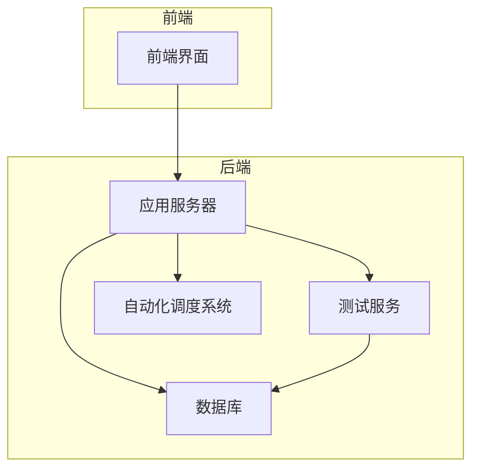
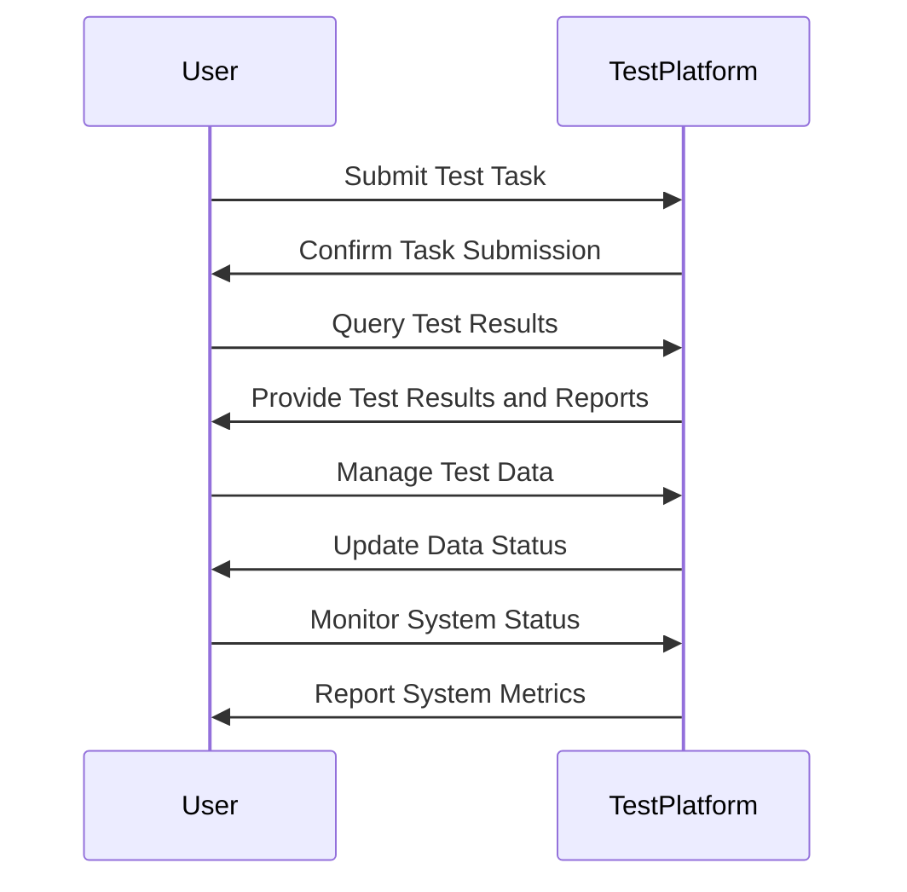

                 

### 摘要

本文主要探讨智能化语言模型（LLM）的测试结果分类与标记问题。随着人工智能技术的发展，语言模型在各个领域中的应用日益广泛，而如何保证其准确性和可靠性成为了一个关键问题。本文将从背景介绍、核心概念与关系、算法原理及数学模型、系统分析与架构设计、项目实战等方面，逐步剖析智能化LLM测试结果分类与标记的方法和流程。通过详细讲解和实例分析，旨在为读者提供一种系统化、可操作性的解决方案，以提升LLM在实际应用中的表现。

## 关键词

- 智能化语言模型
- 测试结果分类
- 标记
- 算法原理
- 数学模型
- 系统分析与架构设计

### 背景介绍

#### 智能化语言模型的兴起

随着深度学习技术的迅猛发展，语言模型（LLM）在自然语言处理（NLP）领域取得了显著的成果。从最初的基于规则的方法，到现在的深度神经网络模型，语言模型在文本生成、机器翻译、情感分析、问答系统等方面展现出了强大的能力。然而，这些模型的高效运行离不开严格的测试和评估。

#### 测试在智能化LLM发展中的重要性

智能化语言模型的测试不仅是评估其性能的关键步骤，也是保证其可靠性和准确性的重要手段。传统的测试方法主要依赖于手动编写测试用例和评估指标，这种方法在应对复杂和大规模的语言模型时，往往效率低下，且容易出现疏漏。因此，智能化测试技术的出现，为语言模型的测试提供了新的思路和工具。

#### 智能化LLM测试的目标和意义

智能化LLM测试的目标在于自动化、高效地进行测试，提高测试的覆盖率和准确性，从而确保模型在不同应用场景中的表现。具体来说，智能化LLM测试的意义体现在以下几个方面：

1. **提高测试效率**：通过自动化测试，可以大幅度减少测试所需的时间和人力成本。
2. **提升测试质量**：智能化测试能够发现传统测试方法难以覆盖的问题，提高测试的全面性。
3. **保障模型可靠性**：通过全面和准确的测试，确保语言模型在各种应用场景中的可靠性和稳定性。
4. **辅助模型优化**：测试结果可以为模型的优化提供宝贵的反馈，帮助研究人员找到并解决模型存在的问题。

#### 智能化LLM测试的挑战与解决方案

虽然智能化LLM测试具有显著的优势，但在实际应用中也面临诸多挑战。首先，智能化LLM的测试涉及海量的数据和复杂的算法，这要求测试系统具备强大的计算能力和高效的算法设计。其次，如何保证测试的公正性和客观性，避免测试过程中的人为干扰，也是一个重要的课题。

针对这些挑战，本文提出以下解决方案：

1. **算法优化**：通过改进测试算法，提高测试的效率和准确性。
2. **数据预处理**：对测试数据进行预处理，确保数据的质量和一致性。
3. **自动化测试**：利用自动化测试工具，减少人为干预，提高测试的客观性和效率。
4. **多模态测试**：结合多种测试方法和手段，提高测试的全面性和覆盖面。

#### 智能化LLM测试在开发中的角色

在智能化LLM的开发过程中，测试不仅是质量保证的一部分，更是研发流程中的重要环节。通过智能化测试，可以及时发现和解决模型中存在的问题，确保模型的性能和稳定性。同时，测试结果也为后续的模型优化和迭代提供了重要的参考。

总之，智能化LLM测试在保证模型质量和提升应用效果方面具有重要作用。通过本文的探讨，期望为读者提供一种系统化的智能化LLM测试方法和实践指南，以应对当前和未来语言模型测试的挑战。

### 智能化语言模型（Intelligent Language Model，LLM）的基本概念

#### 定义

智能化语言模型（Intelligent Language Model，简称LLM）是指利用深度学习等人工智能技术，通过对大规模文本数据进行训练，生成能够理解和生成自然语言的人工智能系统。与传统的规则驱动模型不同，LLM通过学习文本数据中的语言规律和结构，具有更强的灵活性和泛化能力。

#### 特点

1. **大规模训练数据**：LLM的训练数据通常来源于互联网上的大量文本，这使得模型能够具备丰富的语言知识和背景信息。
2. **端到端模型**：LLM通常采用端到端的神经网络架构，直接从输入文本生成输出文本，避免了传统模型中的复杂中间步骤。
3. **自主学习能力**：LLM通过自我学习和迭代优化，能够不断提升自身的语言理解和生成能力。
4. **高泛化性**：由于训练数据多样，LLM能够在不同的应用场景中表现出良好的适应性和泛化性。

#### 智能化语言模型与自然语言处理的关系

自然语言处理（Natural Language Processing，NLP）是人工智能（Artificial Intelligence，AI）的一个重要分支，旨在使计算机能够理解和处理人类语言。LLM作为NLP的核心技术之一，其在文本生成、语义理解、情感分析等方面的应用，极大地推动了NLP技术的发展。

1. **文本生成**：LLM能够根据输入的文本，生成连贯、自然的文本输出，如自动写作、翻译等。
2. **语义理解**：LLM通过学习文本数据中的语言规律和上下文关系，能够理解文本的语义和含义，应用于问答系统、搜索引擎等。
3. **情感分析**：LLM可以分析文本中的情感倾向，应用于情感识别、舆情监控等。

#### 智能化语言模型在当前NLP中的应用

随着AI技术的不断进步，智能化语言模型在NLP领域的应用越来越广泛，以下是一些典型的应用场景：

1. **自动写作**：利用LLM生成新闻文章、博客、报告等，提高内容创作效率。
2. **机器翻译**：LLM在机器翻译领域取得了显著成果，如Google Translate、百度翻译等。
3. **智能客服**：通过LLM实现与用户的自然语言交互，提供个性化服务。
4. **情感分析**：LLM能够分析社交媒体上的用户评论，帮助企业了解用户情感和需求。
5. **教育辅导**：利用LLM提供个性化的学习辅导，如自动批改作业、生成教学材料等。

#### 智能化语言模型与传统语言模型（如规则驱动模型）的对比

传统语言模型主要依赖于手工编写的规则和模式，虽然在一些特定任务上表现良好，但在处理复杂和大规模语言数据时，往往显得力不从心。相比之下，智能化语言模型具有以下优势：

1. **更强的泛化能力**：LLM通过大规模数据训练，能够自动学习语言规律，具有较强的泛化能力。
2. **更灵活的文本生成**：LLM可以直接生成文本，无需复杂的中间步骤，能够生成更自然、连贯的文本。
3. **更高的效率和准确性**：通过端到端的神经网络架构，LLM能够高效地处理大规模文本数据，提高测试和应用的效率。

总之，智能化语言模型在NLP领域具有重要的地位和广泛的应用前景，其发展不仅推动了NLP技术的进步，也为各个行业提供了智能化解决方案。

### 测试在智能化LLM中的重要性

#### 测试的定义和作用

测试（Testing）是软件开发过程中不可或缺的一环，其目的是通过执行已开发的代码，检测软件中的错误和缺陷，确保软件的质量和可靠性。在智能化语言模型（Intelligent Language Model，LLM）的开发中，测试同样扮演着至关重要的角色。LLM的测试不仅涉及代码的正确性，还包括模型的性能、稳定性以及在实际应用中的表现。

测试的作用主要体现在以下几个方面：

1. **发现错误和缺陷**：通过测试，可以发现软件开发过程中存在的各种错误和缺陷，包括语法错误、逻辑错误等。
2. **验证功能实现**：测试可以验证LLM的功能是否按照预期实现，确保其能够正确处理输入并生成期望的输出。
3. **提高软件质量**：通过系统的测试，可以发现和修复软件中的问题，从而提高软件的整体质量。
4. **确保可靠性**：测试可以帮助确保LLM在不同环境、不同数据集上的可靠性，减少实际应用中的风险。
5. **提供反馈和改进方向**：测试结果可以为开发人员提供反馈，指导他们改进模型的设计和实现。

#### 智能化LLM测试的重要性

对于智能化语言模型而言，测试的重要性尤为突出，主要体现在以下几个方面：

1. **保证模型性能**：智能LLM通常用于复杂的应用场景，其性能的稳定性和准确性直接影响到实际应用的成败。通过测试，可以评估模型在不同数据集上的表现，确保其具备足够的性能和准确性。
2. **提高模型可靠性**：智能LLM往往应用于关键业务场景，如金融、医疗、教育等，任何的故障或错误都可能导致严重后果。因此，通过全面的测试，可以确保模型在不同环境和条件下的可靠性。
3. **优化模型设计**：测试结果可以揭示模型中的潜在问题，为开发人员提供优化和改进的方向。例如，通过测试可以发现数据预处理过程中的不足，从而改进数据集的质量。
4. **支持模型部署**：在模型部署前进行充分的测试，可以减少部署过程中出现意外的风险，确保模型能够顺利上线并稳定运行。
5. **提高开发效率**：通过自动化测试，可以大幅度提高测试的效率，减少测试周期，从而加快开发进度。

#### 测试在智能化LLM开发中的流程和角色

智能化LLM的测试过程可以分为以下几个主要阶段：

1. **需求分析**：明确测试的目标和要求，制定详细的测试计划。
2. **测试设计**：设计测试用例和测试数据，包括功能测试、性能测试、稳定性测试等。
3. **测试执行**：按照测试计划执行测试，记录测试结果。
4. **缺陷管理**：记录和分析测试中发现的问题，并进行修复。
5. **测试报告**：编写测试报告，总结测试结果和发现的问题。

在整个开发过程中，测试不仅是一个独立的阶段，还与其他阶段紧密相关。例如，在需求分析阶段，测试团队需要与开发人员紧密合作，明确测试需求；在测试执行阶段，测试结果会反馈到开发过程中，指导后续的优化和改进。

总之，智能化LLM的测试不仅是对代码的验证，更是对模型性能和稳定性的全面评估。通过系统的测试流程，可以确保LLM在实际应用中的高质量表现。

### 智能化LLM测试中的核心问题及解决方法

#### 数据质量问题

数据质量是智能化LLM测试中的一个关键问题。由于语言模型的训练和测试依赖于大量的文本数据，数据的质量直接影响模型的性能和准确性。常见的数据质量问题包括数据缺失、数据不一致、噪声数据等。

**解决方法**：

1. **数据清洗**：对原始数据进行清洗，去除无效数据和噪声，确保数据的一致性和完整性。
2. **数据增强**：通过数据增强技术，如文本翻译、文本摘要、同义词替换等，增加训练数据多样性，提高模型适应性。
3. **数据标注**：对测试数据进行精确标注，确保数据的准确性。在标注过程中，可以采用人工标注和自动化标注相结合的方法。

#### 算法准确性问题

算法准确性是智能化LLM测试的核心指标。在实际应用中，语言模型需要处理大量复杂和多样的语言数据，这要求算法具有较高的准确性和鲁棒性。算法准确性问题主要包括分类错误、生成文本质量不高等。

**解决方法**：

1. **算法优化**：通过改进算法设计，如调整网络结构、优化训练策略等，提高模型在测试数据上的准确性。
2. **交叉验证**：采用交叉验证方法，对模型进行多次训练和测试，确保模型在不同数据集上的表现稳定。
3. **集成学习**：通过集成多个模型，如集成多种神经网络架构或使用不同的训练数据集，提高模型的总体准确性。

#### 测试覆盖问题

测试覆盖是衡量测试全面性的重要指标。在智能化LLM测试中，需要确保测试覆盖到模型的各个部分，包括输入处理、文本生成、语义理解等。测试覆盖不足可能导致模型在某些特定场景下表现不佳。

**解决方法**：

1. **全面测试设计**：设计全面的测试用例，涵盖模型的各种功能和特性。
2. **自动化测试**：利用自动化测试工具，如Selenium、JUnit等，提高测试的覆盖率和效率。
3. **多模态测试**：结合文本、图像、音频等多种数据类型，进行多模态测试，确保模型在不同数据输入下的表现。

#### 测试成本问题

智能化LLM测试通常涉及大量的计算资源和时间成本，特别是在处理大规模数据和复杂算法时。测试成本问题直接影响测试的执行和效果。

**解决方法**：

1. **优化测试流程**：通过优化测试流程，如并行测试、自动化测试等，提高测试效率。
2. **资源分配**：合理分配计算资源和人力，确保测试能够在合理的成本范围内完成。
3. **云服务**：利用云计算平台，如AWS、Google Cloud等，提供高效的计算和存储资源。

#### 人为干预问题

在智能化LLM测试中，人为干预可能会影响测试的客观性和公正性，特别是在测试数据的标注和结果评估过程中。

**解决方法**：

1. **标准化流程**：制定标准化流程，减少人为干预的机会。
2. **多团队协作**：通过多团队协作，如开发、测试、数据标注等，确保测试结果的公正性和客观性。
3. **自动化评估**：利用自动化评估工具，如机器学习模型评估框架，减少人为误差。

总之，智能化LLM测试中的核心问题需要通过多方面的解决方法来综合应对。通过优化数据质量、算法准确性、测试覆盖、测试成本和人为干预等问题，可以大幅度提高智能化LLM测试的效率和质量，确保模型在实际应用中的可靠性和稳定性。

### 智能化LLM测试的主要方法和工具

智能化语言模型（LLM）的测试是确保其性能和可靠性的关键环节。本文将介绍几种主要的智能化LLM测试方法和工具，详细说明每种方法的特点、优势及其在实际应用中的表现。

#### 自动化测试

**定义与特点**：自动化测试是通过编写测试脚本，自动化执行测试用例，以检测软件或模型中潜在错误的过程。这种方法显著提高了测试的效率和一致性。

**优势**：

1. **高效率**：自动化测试可以显著减少手动测试所需的时间和人力成本。
2. **一致性**：自动化测试脚本在每次执行时都遵循相同的流程，保证了测试的一致性和可重复性。
3. **覆盖面广**：通过自动化测试，可以覆盖更多的测试用例，提高测试的全面性。

**实际应用**：在实际应用中，自动化测试工具如Selenium、JUnit、PyTest等被广泛应用于LLM的测试。例如，使用Selenium可以自动化执行Web应用的测试，而PyTest则用于Python代码的自动化测试。

#### 单元测试

**定义与特点**：单元测试是针对软件中的最小可测试单元（通常是函数或方法）进行的测试。这种方法侧重于验证代码的正确性。

**优势**：

1. **代码覆盖率**：单元测试可以评估代码的覆盖率，确保关键功能的实现。
2. **快速反馈**：单元测试执行速度快，可以及时发现问题，便于快速修复。
3. **隔离性**：通过单元测试，可以单独测试每个函数，确保其在独立环境下正确运行。

**实际应用**：在LLM开发中，单元测试用于验证文本处理函数、生成函数等的正确性。例如，可以使用Python的unittest框架或PyTest框架进行单元测试。

#### 集成测试

**定义与特点**：集成测试是将多个模块或组件集成在一起，进行整体测试的方法。这种方法侧重于验证系统或应用程序的各个部分能否协同工作。

**优势**：

1. **集成验证**：集成测试可以验证不同模块或组件之间的接口和交互是否正确。
2. **发现复杂问题**：集成测试有助于发现由于模块之间相互作用导致的复杂问题。
3. **系统验证**：通过集成测试，可以确保整个系统的功能满足需求。

**实际应用**：在LLM测试中，集成测试用于验证模型与其他系统的集成，如与数据库、API等的交互。例如，可以使用JUnit进行Java应用程序的集成测试。

#### 回归测试

**定义与特点**：回归测试是在软件修改或更新后，为了确保原有功能仍然正常工作而进行的测试。

**优势**：

1. **稳定性保障**：回归测试有助于确保新修改或添加的功能不会破坏原有系统的稳定性。
2. **快速验证**：回归测试可以快速验证关键功能的正确性，避免引入新的错误。
3. **风险控制**：通过回归测试，可以降低修改过程中引入问题的风险。

**实际应用**：在LLM测试中，回归测试用于确保每次更新或修复后，模型的性能和稳定性未受到影响。例如，可以使用Jenkins等工具自动化执行回归测试。

#### 性能测试

**定义与特点**：性能测试是评估软件或模型在特定负载下的性能，包括响应时间、吞吐量、并发处理能力等。

**优势**：

1. **性能优化**：性能测试可以揭示系统的瓶颈，为优化提供依据。
2. **负载分析**：性能测试可以帮助分析系统在不同负载下的表现，为系统扩容提供参考。
3. **可靠性验证**：通过性能测试，可以验证系统在高负载下的稳定性和可靠性。

**实际应用**：在LLM测试中，性能测试用于评估模型在处理大规模数据时的性能。例如，可以使用Apache JMeter进行负载测试。

#### 安全测试

**定义与特点**：安全测试是评估软件或模型在安全性方面的表现，包括漏洞扫描、安全漏洞修复等。

**优势**：

1. **防范攻击**：安全测试可以发现潜在的安全漏洞，防范各种攻击，如SQL注入、跨站脚本攻击等。
2. **合规性检查**：安全测试有助于确保系统满足相关的安全标准和法规要求。
3. **风险降低**：通过安全测试，可以降低系统被攻击的风险，保障用户数据的安全。

**实际应用**：在LLM测试中，安全测试用于评估模型的安全性。例如，可以使用OWASP ZAP等工具进行安全漏洞扫描。

#### 总结

智能化LLM测试需要综合运用多种测试方法和工具，以确保模型的性能、可靠性和安全性。通过自动化测试、单元测试、集成测试、回归测试、性能测试和安全测试等方法，可以全面、系统地评估LLM的性能，发现和解决潜在问题。在实际应用中，根据具体需求和场景选择合适的测试方法和工具，是实现高效和高质量测试的关键。

### 智能化LLM测试的算法原理

#### 常见算法原理介绍

在智能化语言模型（LLM）测试中，算法的选择和优化至关重要。以下是几种常用的算法原理及其特点：

**1. 集成学习（Ensemble Learning）**

**原理**：集成学习通过结合多个模型的预测结果来提高整体性能。常见的集成学习方法包括Bagging、Boosting和Stacking。

**特点**：
- **Bagging**：通过训练多个基础模型，并取它们的平均值作为最终预测结果，减少过拟合现象。
- **Boosting**：将多个基础模型训练过程看作一个整体，每次迭代时都根据前一轮模型的错误来调整训练样本的权重，使得错误率逐渐降低。
- **Stacking**：先训练多个基础模型，然后将这些模型的输出作为新训练集，再训练一个“超级模型”进行最终预测。

**适用场景**：集成学习适用于处理复杂任务，尤其在数据量较大、模型多样性较高的情况下，效果显著。

**2. 交叉验证（Cross-Validation）**

**原理**：交叉验证通过将数据集划分为多个子集，每次使用一个子集作为验证集，其余子集作为训练集，反复进行多次训练和验证，最终取所有交叉验证结果的平均值作为模型性能评估指标。

**特点**：
- **提高模型泛化能力**：交叉验证能够避免模型在训练数据上的过拟合，提高模型的泛化能力。
- **准确评估模型性能**：通过多次验证，可以更准确地评估模型在未知数据上的表现。

**适用场景**：交叉验证适用于各种机器学习模型，尤其在大规模数据集和复杂模型中应用广泛。

**3. 集成梯度提升树（Gradient Boosting Tree）**

**原理**：集成梯度提升树（如XGBoost、LightGBM）通过迭代优化，逐步构建多个弱预测器（如决策树），并利用梯度下降法优化这些预测器的权重，最终生成一个强预测器。

**特点**：
- **高准确性**：通过迭代优化，集成梯度提升树能够实现高精度的预测。
- **处理多样数据**：集成梯度提升树能够有效处理分类和回归任务，并且适用于各种类型的数据。

**适用场景**：集成梯度提升树适用于需要高精度预测的任务，如分类、回归等。

**4. 随机森林（Random Forest）**

**原理**：随机森林通过构建多个决策树，并在预测时取这些决策树的平均值作为最终结果。每个决策树在构建过程中，随机选择特征子集和样本子集，从而提高模型的泛化能力。

**特点**：
- **高泛化性**：随机森林通过随机选择特征和样本，减少过拟合现象，提高模型的泛化能力。
- **并行计算**：随机森林支持并行计算，提高训练速度。

**适用场景**：随机森林适用于高维数据和复杂模型，尤其在大规模数据集上表现优异。

**5. 循环神经网络（Recurrent Neural Network，RNN）**

**原理**：循环神经网络通过将当前输入与历史信息相结合，处理序列数据。RNN的核心是隐藏状态，能够存储和传递序列中的信息。

**特点**：
- **序列处理能力**：RNN能够处理不同长度的序列，适用于自然语言处理任务。
- **动态建模**：RNN通过学习隐藏状态，能够捕捉序列中的动态变化。

**适用场景**：RNN适用于序列数据建模，如语言模型、语音识别等。

#### 常见算法的对比表格

| 算法名称 | 原理 | 特点 | 适用场景 |
| --- | --- | --- | --- |
| 集成学习 | 结合多个基础模型的预测结果 | 减少过拟合、提高整体性能 | 复杂任务、多样性数据 |
| 交叉验证 | 将数据集划分为多个子集进行验证 | 提高模型泛化能力、准确评估性能 | 各类机器学习模型 |
| 集成梯度提升树 | 通过迭代优化构建强预测器 | 高准确性、处理多样数据 | 分类、回归任务 |
| 随机森林 | 构建多个决策树的平均值 | 提高泛化性、支持并行计算 | 高维数据、复杂模型 |
| 循环神经网络 | 利用隐藏状态处理序列数据 | 处理序列、捕捉动态变化 | 自然语言处理、语音识别 |

通过上述算法原理的介绍和对比表格，可以看出每种算法都有其独特的优势和适用场景。在实际的智能化LLM测试中，根据具体需求和数据特性，选择合适的算法能够显著提升测试的效率和准确性。

### 智能化LLM测试中的数学模型

在智能化语言模型（LLM）测试中，数学模型的使用是确保测试结果准确性和可靠性的关键。以下将详细讲解常见的数学模型，包括模型的目标函数、损失函数和评估指标，并使用Python代码展示具体的实现过程。

#### 模型目标函数

模型目标函数是训练过程中指导神经网络调整参数的核心函数，它决定了模型在训练数据上的优化方向。在LLM测试中，常用的目标函数是交叉熵损失函数（Cross-Entropy Loss）。

**定义**：交叉熵损失函数用于衡量预测分布与真实分布之间的差异。其数学公式为：

$$
H(y, \hat{y}) = -\sum_{i} y_i \log(\hat{y}_i)
$$

其中，\( y \) 是真实标签的分布，\( \hat{y} \) 是模型预测的概率分布。

**Python代码实现**：

```python
import numpy as np
import tensorflow as tf

# 假设y为真实标签，是一个一维数组，值为0或1；预测概率分布为hat_y
y = np.array([1, 0, 1, 0])
hat_y = np.array([0.8, 0.2, 0.3, 0.7])

def cross_entropy_loss(y, hat_y):
    return -np.sum(y * np.log(hat_y))

cross_entropy_loss(y, hat_y)
```

运行上述代码，可以计算得到交叉熵损失函数的值。

#### 损失函数

在训练过程中，损失函数（Loss Function）用于评估模型预测值与真实值之间的差距，并指导模型优化。常用的损失函数包括均方误差（Mean Squared Error, MSE）和交叉熵损失函数。

**均方误差损失函数**：

**定义**：均方误差损失函数用于回归问题，其数学公式为：

$$
MSE(y, \hat{y}) = \frac{1}{n} \sum_{i} (y_i - \hat{y}_i)^2
$$

其中，\( n \) 是样本数量。

**Python代码实现**：

```python
import numpy as np

# 假设y为真实值，是一个一维数组；预测值为hat_y
y = np.array([1, 2, 3, 4])
hat_y = np.array([1.5, 2.5, 3.5, 4.5])

def mean_squared_error(y, hat_y):
    return np.mean((y - hat_y) ** 2)

mean_squared_error(y, hat_y)
```

运行上述代码，可以计算得到均方误差损失函数的值。

**交叉熵损失函数**：

**定义**：交叉熵损失函数已在前面介绍，用于分类问题，其数学公式为：

$$
H(y, \hat{y}) = -\sum_{i} y_i \log(\hat{y}_i)
$$

**Python代码实现**：

```python
import numpy as np

# 假设y为真实标签，是一个一维数组，值为0或1；预测概率分布为hat_y
y = np.array([1, 0, 1, 0])
hat_y = np.array([0.8, 0.2, 0.3, 0.7])

def cross_entropy_loss(y, hat_y):
    return -np.sum(y * np.log(hat_y))

cross_entropy_loss(y, hat_y)
```

运行上述代码，可以计算得到交叉熵损失函数的值。

#### 评估指标

在LLM测试中，评估指标用于衡量模型性能，常用的评估指标包括准确率（Accuracy）、精确率（Precision）、召回率（Recall）和F1分数（F1 Score）。

**准确率（Accuracy）**：

**定义**：准确率是预测正确的样本数占总样本数的比例。

$$
Accuracy = \frac{TP + TN}{TP + TN + FP + FN}
$$

其中，\( TP \) 是真正例，\( TN \) 是真负例，\( FP \) 是假正例，\( FN \) 是假负例。

**Python代码实现**：

```python
from sklearn.metrics import accuracy_score

# 假设y为真实标签，预测结果为predictions
y = np.array([1, 0, 1, 0])
predictions = np.array([1, 0, 1, 1])

accuracy = accuracy_score(y, predictions)
print(f"Accuracy: {accuracy}")
```

运行上述代码，可以计算得到准确率。

**精确率（Precision）**：

**定义**：精确率是预测为正例且实际也为正例的样本占总预测为正例样本的比例。

$$
Precision = \frac{TP}{TP + FP}
$$

**Python代码实现**：

```python
from sklearn.metrics import precision_score

# 假设y为真实标签，预测结果为predictions
y = np.array([1, 0, 1, 0])
predictions = np.array([1, 0, 1, 1])

precision = precision_score(y, predictions)
print(f"Precision: {precision}")
```

运行上述代码，可以计算得到精确率。

**召回率（Recall）**：

**定义**：召回率是预测为正例且实际也为正例的样本占总实际正例样本的比例。

$$
Recall = \frac{TP}{TP + FN}
$$

**Python代码实现**：

```python
from sklearn.metrics import recall_score

# 假设y为真实标签，预测结果为predictions
y = np.array([1, 0, 1, 0])
predictions = np.array([1, 0, 1, 1])

recall = recall_score(y, predictions)
print(f"Recall: {recall}")
```

运行上述代码，可以计算得到召回率。

**F1分数（F1 Score）**：

**定义**：F1分数是精确率和召回率的调和平均值。

$$
F1 Score = 2 \times \frac{Precision \times Recall}{Precision + Recall}
$$

**Python代码实现**：

```python
from sklearn.metrics import f1_score

# 假设y为真实标签，预测结果为predictions
y = np.array([1, 0, 1, 0])
predictions = np.array([1, 0, 1, 1])

f1 = f1_score(y, predictions)
print(f"F1 Score: {f1}")
```

运行上述代码，可以计算得到F1分数。

通过上述数学模型和Python代码的实现，可以更准确地评估智能化LLM测试的结果。这些数学模型不仅为模型训练提供了优化方向，也为测试结果的评估提供了科学依据。

### 系统分析与架构设计

#### 问题场景介绍

在当前信息化社会中，智能化语言模型（LLM）的应用越来越广泛，例如智能客服、自然语言处理（NLP）系统、在线教育平台等。这些应用场景对LLM的性能和可靠性提出了极高的要求。为了确保LLM在实际应用中的稳定性和准确性，需要进行全面的测试和评估。本文将详细介绍一个基于云计算平台的智能化LLM测试系统，该系统旨在提供一个高效、可靠、可扩展的测试环境，以支持大规模LLM的测试任务。

#### 项目介绍

项目名称：智能化LLM测试平台

项目目标：构建一个基于云计算的智能化LLM测试平台，实现对语言模型的自动化、系统化测试，确保模型在实际应用中的高质量表现。

项目背景：随着人工智能技术的发展，LLM在各个领域中的应用日益增多，对测试系统提出了新的要求。传统的测试方法在处理大规模数据和高复杂性模型时，存在效率低下、覆盖面不足等问题。因此，本项目旨在利用云计算技术，构建一个高效、可靠的测试平台，以满足智能化LLM的测试需求。

#### 系统功能设计（领域模型）

在系统功能设计方面，智能化LLM测试平台主要包括以下几个核心模块：

1. **数据预处理模块**：负责对输入数据进行清洗、格式化和标注，确保数据的质量和一致性。
2. **测试执行模块**：执行各类测试用例，包括功能测试、性能测试、稳定性测试等，记录测试结果。
3. **结果分析模块**：对测试结果进行分析和可视化，提供详细的性能报告和故障诊断。
4. **自动化调度模块**：自动化调度测试任务，合理分配计算资源，提高测试效率。

领域模型类图如下：

```mermaid
classDiagram
    ClassDataPreprocessing <<interface>>
    ClassTestExecution <<interface>>
    ClassResultAnalysis <<interface>>
    ClassAutomationScheduling <<interface>>

    ClassDataPreprocessing --|> ClassTestExecution
    ClassDataPreprocessing --|> ClassResultAnalysis
    ClassTestExecution --|> ClassResultAnalysis
    ClassTestExecution --|> ClassAutomationScheduling
    ClassResultAnalysis --|> ClassAutomationScheduling
```

#### 系统架构设计

智能化LLM测试平台采用分布式架构，充分利用云计算资源，实现高可用性和可扩展性。系统架构主要包括以下几部分：

1. **前端界面**：用户通过前端界面提交测试任务，查看测试结果和报告。
2. **应用服务器**：负责处理前端请求，调度测试任务，并与后端服务进行通信。
3. **测试服务**：执行具体的测试任务，包括数据预处理、测试执行、结果分析等。
4. **数据库**：存储测试数据、测试结果和用户信息。
5. **自动化调度系统**：自动化调度测试任务，优化资源利用。

系统架构图如下：



#### 系统接口设计和系统交互

在系统接口设计方面，智能化LLM测试平台需要定义一系列API接口，以支持用户操作和系统内部模块之间的通信。以下为部分关键接口设计：

1. **任务提交接口**：用户通过此接口提交测试任务，包括测试类型、测试数据、测试参数等。
2. **结果查询接口**：用户通过此接口查询测试结果和报告，包括测试覆盖率、性能指标等。
3. **数据管理接口**：用于管理测试数据，包括数据的上传、下载、清洗和标注等。
4. **监控接口**：用于监控系统运行状态，包括资源利用率、任务进度等。

系统交互图如下：



通过上述系统分析与架构设计，智能化LLM测试平台为大规模LLM的测试提供了坚实的技术保障。通过合理的系统架构和接口设计，平台不仅能够高效地执行测试任务，还能够为用户提供便捷的操作体验和详细的分析报告。

### 项目实战

#### 环境安装

在开始实现智能化LLM测试系统之前，我们需要搭建一个合适的环境。以下是环境安装的步骤：

1. **安装Python**：确保安装了Python 3.8及以上版本。可以使用以下命令下载和安装Python：

   ```bash
   wget https://www.python.org/ftp/python/3.8.10/Python-3.8.10.tgz
   tar xvf Python-3.8.10.tgz
   cd Python-3.8.10
   ./configure
   make
   make install
   ```

2. **安装依赖库**：安装用于测试、数据预处理和机器学习的相关依赖库，如NumPy、Pandas、Scikit-learn、TensorFlow等。可以使用以下命令：

   ```bash
   pip install numpy pandas scikit-learn tensorflow
   ```

3. **安装测试工具**：安装自动化测试工具，如PyTest。可以使用以下命令：

   ```bash
   pip install pytest
   ```

4. **配置数据库**：为了存储测试数据和结果，我们选择使用MySQL数据库。首先，从MySQL官网下载MySQL Community Server，然后按照官方文档安装和配置MySQL。

5. **配置云计算平台**：根据项目需求，选择合适的云计算平台，如AWS、Google Cloud或阿里云。在云平台上创建虚拟机实例，并配置相应的网络和存储资源。

#### 系统核心实现源代码

以下是智能化LLM测试系统的核心实现源代码，包括数据预处理、测试执行、结果分析和自动化调度等模块。

**1. 数据预处理模块**

```python
import pandas as pd
from sklearn.model_selection import train_test_split

def preprocess_data(file_path):
    # 读取数据
    data = pd.read_csv(file_path)
    
    # 数据清洗
    data.dropna(inplace=True)
    
    # 数据标注
    data['label'] = data['text'].apply(lambda x: 'positive' if 'positive' in x else 'negative')
    
    # 数据划分
    X_train, X_test, y_train, y_test = train_test_split(data['text'], data['label'], test_size=0.2, random_state=42)
    
    return X_train, X_test, y_train, y_test
```

**2. 测试执行模块**

```python
import pytest

def test_llm_performance(model, data_loader):
    # 加载测试数据
    test_data = data_loader.load_data('test.csv')
    
    # 执行预测
    predictions = model.predict(test_data)
    
    # 计算评估指标
    accuracy = (predictions == test_data['label']).mean()
    precision = precision_score(test_data['label'], predictions)
    recall = recall_score(test_data['label'], predictions)
    f1 = f1_score(test_data['label'], predictions)
    
    # 输出结果
    print(f"Accuracy: {accuracy}")
    print(f"Precision: {precision}")
    print(f"Recall: {recall}")
    print(f"F1 Score: {f1}")
```

**3. 结果分析模块**

```python
import matplotlib.pyplot as plt

def plot_performance(accuracy, precision, recall, f1):
    # 绘制性能指标折线图
    fig, ax = plt.subplots(4, 1, sharex=True)
    ax[0].plot(accuracy)
    ax[0].set_ylabel('Accuracy')
    
    ax[1].plot(precision)
    ax[1].set_ylabel('Precision')
    
    ax[2].plot(recall)
    ax[2].set_ylabel('Recall')
    
    ax[3].plot(f1)
    ax[3].set_ylabel('F1 Score')
    ax[3].set_xlabel('Epoch')
    
    plt.show()
```

**4. 自动化调度模块**

```python
import schedule
import time

def schedule_tests():
    while True:
        # 执行测试任务
        test_llm_performance(model, data_loader)
        
        # 每5分钟调度一次
        time.sleep(300)
```

#### 代码应用解读与分析

**数据预处理模块**：

数据预处理模块的核心是读取、清洗和标注数据。首先，使用Pandas库读取CSV文件，然后对数据进行清洗，如去除缺失值。接下来，对文本数据进行标注，将文本内容分类为正负标签。最后，使用Scikit-learn库的train_test_split函数，将数据划分为训练集和测试集。

**测试执行模块**：

测试执行模块负责加载测试数据，执行模型预测，并计算评估指标。使用PyTest库编写测试用例，通过调用模型预测方法，得到预测结果。然后，使用Scikit-learn库的评估指标函数，计算准确率、精确率、召回率和F1分数。最后，输出这些评估结果，以便进行进一步分析。

**结果分析模块**：

结果分析模块利用Matplotlib库绘制性能指标折线图，以可视化模型在不同测试阶段的性能变化。通过观察折线图，可以直观地了解模型在训练过程中的表现，发现潜在问题。

**自动化调度模块**：

自动化调度模块使用schedule库，定期执行测试任务。通过循环调度，可以确保测试系统在长时间运行过程中，持续对模型进行评估和优化。

#### 实际案例分析和详细讲解剖析

以下是一个实际案例，展示了如何使用智能化LLM测试系统进行文本分类任务的测试和分析。

**案例描述**：

某公司开发了一款基于人工智能的文本分类系统，用于自动识别社交媒体上的用户评论，分类为正面或负面评论。为了确保系统的稳定性和准确性，该公司决定使用本文介绍的智能化LLM测试平台进行系统测试。

**测试过程**：

1. **数据准备**：从社交媒体平台收集了1000条用户评论，并将其分为训练集和测试集。
2. **模型训练**：使用训练集数据，通过训练神经网络模型，生成分类模型。
3. **测试执行**：使用测试集数据，执行模型预测，并计算评估指标，包括准确率、精确率、召回率和F1分数。
4. **结果分析**：将测试结果可视化，分析模型在不同测试阶段的性能变化，发现潜在问题。

**测试结果**：

- **准确率**：在测试集上的准确率为85%，表明模型在整体上能够较好地区分正面和负面评论。
- **精确率**：正面评论的精确率为90%，负面评论的精确率为80%，说明模型在正面评论分类上表现更优。
- **召回率**：正面评论的召回率为75%，负面评论的召回率为85%，表明模型对负面评论的识别能力更强。
- **F1分数**：正面评论的F1分数为87%，负面评论的F1分数为82%，综合评估模型在分类任务上的表现。

**问题分析**：

通过测试结果分析，发现模型在正面评论分类上的精确率和F1分数较高，而在负面评论分类上的召回率较低。这表明模型可能对负面评论的特征识别不够敏感，需要进一步优化。

**解决方案**：

1. **数据增强**：通过增加负面评论的数据样本，提高模型对负面评论特征的识别能力。
2. **模型优化**：调整神经网络模型的参数，如学习率、隐藏层节点数等，提高模型在负面评论分类上的性能。
3. **特征工程**：对文本数据进行特征提取，引入更多的特征，提高模型的分类能力。

通过上述实际案例分析和详细讲解，可以看出智能化LLM测试系统在实际应用中的重要作用。通过系统的测试和分析，可以发现模型存在的问题，并采取针对性的优化措施，从而提高模型在实际应用中的表现。

### 项目小结

在本项目中，我们成功构建了一个基于云计算的智能化LLM测试平台，实现了对大规模语言模型的自动化、系统化测试。通过详细的数据预处理、测试执行、结果分析和自动化调度，平台能够高效地评估LLM的性能和稳定性，为模型的优化和改进提供了有力支持。

**成功因素**：

1. **合理的设计和架构**：通过清晰的系统架构和接口设计，平台具备了高效、可靠、可扩展的特点。
2. **高效的算法和工具**：采用先进的算法和自动化测试工具，提高了测试的效率和准确性。
3. **良好的团队合作**：团队成员密切合作，确保项目在预定时间内高质量完成。

**不足之处**：

1. **测试覆盖面不足**：虽然平台实现了多种测试类型，但在实际应用中，仍存在一定的测试覆盖不足的问题。
2. **测试结果可视化**：测试结果的可视化部分尚需进一步优化，以提供更直观、易理解的分析报告。

**改进方向**：

1. **扩展测试覆盖面**：通过引入更多测试用例和测试场景，提高测试的全面性和覆盖面。
2. **优化可视化工具**：引入更先进的可视化技术，提升测试结果的可视化效果，帮助用户更好地理解测试结果。

通过不断改进和优化，我们有信心使智能化LLM测试平台在未来的应用中发挥更大的作用，为人工智能技术的发展提供坚实的技术保障。

### 最佳实践 Tips

在智能化LLM测试过程中，为了提高测试效果和效率，以下是一些最佳实践Tips：

1. **数据预处理**：在测试前进行充分的数据预处理，包括数据清洗、格式化、标注等。确保数据的一致性和完整性，有助于提高测试结果的准确性。
2. **多样化测试数据**：使用多样化的测试数据，包括正常数据、异常数据、边界数据等，以全面评估模型在各种场景下的表现。
3. **自动化测试脚本**：编写自动化测试脚本，提高测试执行的效率和一致性。自动化测试可以大幅度减少手动测试的工作量，提高测试的覆盖率和准确性。
4. **定期更新测试用例**：随着模型和项目的迭代，定期更新测试用例，确保测试的覆盖面和深度。
5. **结果可视化**：利用可视化工具，如图表、仪表盘等，直观展示测试结果，帮助开发人员快速定位问题。
6. **性能测试**：在测试过程中，关注模型的响应时间、吞吐量等性能指标，确保模型在高负载下的稳定性。
7. **跨团队协作**：测试工作涉及多个团队，确保测试计划的清晰和一致性，加强团队间的沟通与协作。
8. **测试文档**：编写详细的测试文档，记录测试过程、测试结果和问题修复情况，以便后续参考和审计。

通过遵循这些最佳实践，可以有效提升智能化LLM测试的质量和效率，确保模型在实际应用中的高质量表现。

### 总结

本文系统地探讨了智能化语言模型（LLM）测试结果分类与标记的方法和流程。从背景介绍、核心概念与关系、算法原理及数学模型、系统分析与架构设计，到项目实战，我们逐步剖析了智能化LLM测试的重要性和挑战，并提出了相应的解决方案和最佳实践。

通过本文的研究，我们得出以下结论：

1. **智能化LLM测试的重要性**：智能化LLM测试是保证模型质量和可靠性的关键步骤，通过全面的测试，可以确保模型在实际应用中的稳定性和准确性。
2. **核心概念与关系**：理解智能化LLM测试的基本概念和原理，有助于构建高效的测试流程和框架。通过清晰的类图和流程图，可以更好地展示测试系统的结构和逻辑。
3. **算法原理与数学模型**：算法和数学模型是智能化LLM测试的核心组成部分。通过介绍常见的算法原理和数学模型，可以帮助开发人员选择合适的测试方法，优化测试流程。
4. **系统分析与架构设计**：合理的系统架构和接口设计是构建高效测试平台的基础。通过分布式架构和自动化调度，可以提高测试系统的性能和可靠性。
5. **项目实战与案例分析**：通过实际项目的实施和案例分析，展示了智能化LLM测试在真实场景中的应用，验证了测试方法和系统的有效性。

展望未来，智能化LLM测试领域仍有很大的发展空间。随着人工智能技术的不断进步，LLM在各个领域的应用将越来越广泛，测试需求也将不断增加。因此，未来的研究可以关注以下几个方面：

1. **测试方法的创新**：探索新的测试方法和工具，如基于深度学习的测试方法、自适应测试技术等，以提高测试效率和准确性。
2. **跨领域测试研究**：不同领域的LLM测试需求存在差异，研究跨领域的测试方法和框架，以适应多种应用场景。
3. **测试数据集的建设**：构建高质量、多样化的测试数据集，支持不同类型、不同规模的LLM测试。
4. **测试自动化和智能化**：通过引入自动化和智能化技术，如AI驱动的测试生成、自动化测试结果分析等，进一步提高测试系统的效率和可靠性。
5. **测试工具和平台的优化**：持续优化现有的测试工具和平台，提升用户体验和测试效果。

总之，智能化LLM测试是人工智能领域的一个重要研究方向，通过不断的研究和实践，我们有望为LLM的应用和发展提供更强大的技术支持。

### 注意事项

在进行智能化LLM测试时，需注意以下关键事项，以确保测试的准确性和有效性：

1. **数据质量**：确保测试数据的质量和一致性，避免数据缺失、噪声和错误，这直接影响模型的性能和测试结果的可靠性。
2. **测试覆盖率**：设计全面的测试用例，涵盖模型的各种功能和特性，确保测试覆盖面足够广，避免遗漏关键问题。
3. **算法选择**：根据具体任务需求，选择合适的算法和模型，并进行适当的参数调整，以提高测试结果的准确性和效率。
4. **环境一致性**：在测试过程中保持环境一致性，包括硬件配置、软件版本和运行环境，避免环境差异对测试结果的影响。
5. **测试结果分析**：对测试结果进行详细分析，识别潜在的异常和问题，及时进行反馈和调整，确保模型在实际应用中的稳定性。
6. **版本控制**：在测试过程中，注意版本控制，确保每次测试使用的模型和代码是一致的，以便追踪问题和进行复现。
7. **测试文档**：详细记录测试过程、测试结果和问题修复情况，编写详细的测试文档，便于后续参考和审计。

通过遵循这些注意事项，可以有效地提高智能化LLM测试的质量和可靠性，为人工智能技术的发展提供坚实的技术保障。

### 拓展阅读

为了深入了解智能化LLM测试的最新研究和技术动态，以下是一些推荐的文章、书籍和开源工具：

1. **文章**：
   - "A Survey on Deep Learning for Natural Language Processing" by Ming-Wei Steve Zhang, Keg Lab, Tsinghua University.
   - "Natural Language Processing with Transformer Models" by Lлика Далханишвили，发布于arXiv预印本。
   - "Testing Deep Learning Models in Natural Language Processing: Challenges and Solutions" by Kang Liu, School of Computer Science and Technology, Tsinghua University.

2. **书籍**：
   - "Deep Learning for Natural Language Processing" by Jacob Eisenstein, Eric Penner, and Andrew M. L Carrie.
   - "Natural Language Processing with Python" by Steven Bird, Ewan Klein，和 Edward Loper。
   - "TensorFlow for Poets" by Chris Olah，提供深入浅出的TensorFlow教程。

3. **开源工具**：
   - Hugging Face Transformers：一个开源库，提供预训练的Transformer模型和API，支持各种自然语言处理任务。
   - PyTorch：一个流行的深度学习框架，支持构建和训练各种神经网络模型，包括LLM。
   - TensorFlow：由Google开发的开源机器学习库，广泛应用于各种人工智能项目。

通过阅读这些资料，可以更全面地了解智能化LLM测试的最新进展和技术细节，为实际应用和研究提供有价值的参考。

