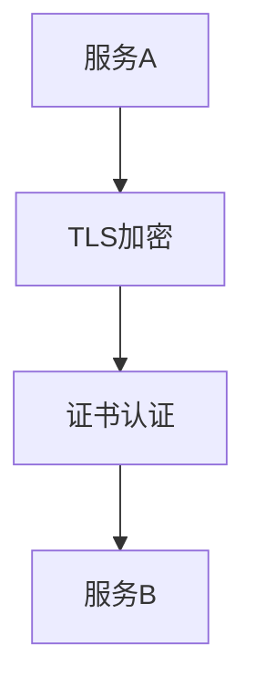
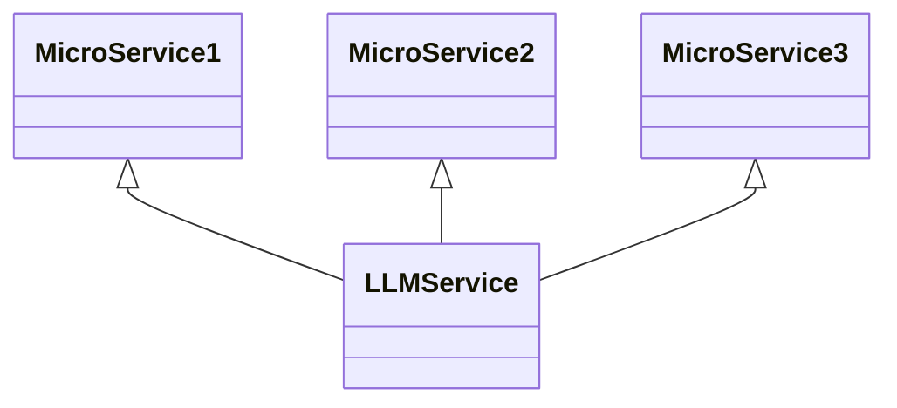
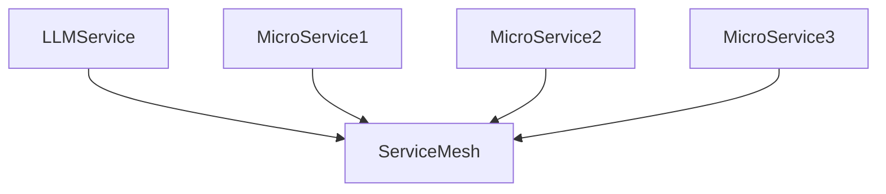
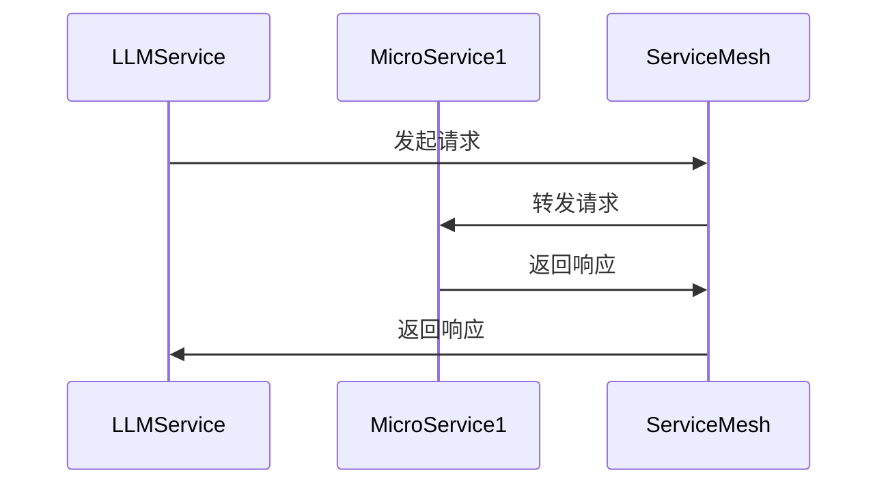

                 

### 让我们一步一步思考：服务网格安全策略：增强LLM微服务间通信的安全性

**关键词：** 服务网格，微服务，安全策略，LLM，加密，身份验证，流量监控

**摘要：** 本文将深入探讨服务网格在微服务架构中的应用，以及如何通过一系列安全策略来增强LLM（大型语言模型）微服务间的通信安全性。我们将从背景介绍、核心概念与联系、算法原理讲解、系统分析与架构设计方案、项目实战等方面进行详细分析。

#### Step 1: 背景介绍

在现代软件架构中，微服务架构越来越受到青睐，因为它们能够提高系统的可扩展性、可靠性和维护性。然而，微服务之间的通信安全问题也随之而来。服务网格作为一种基础设施层的服务抽象，能够有效地管理和优化微服务之间的通信。同时，LLM（大型语言模型）作为人工智能领域的重要工具，其在微服务架构中的安全性尤为重要。

#### Step 2: 核心概念与联系

**服务网格：** 服务网格是一种基础设施层的服务，用于管理和优化微服务之间的通信。它提供了一套统一的API和服务发现机制，从而简化了服务之间的交互。

**微服务：** 微服务是一种架构风格，它将应用程序划分为一组独立的、可复用的服务，每个服务负责完成特定的功能。

**LLM（大型语言模型）：** LLM是一种复杂的机器学习模型，能够处理大量的文本数据，并生成高质量的文本。

**安全策略：** 安全策略是一系列措施，用于保护服务网格和微服务之间的通信，防止未授权访问和数据泄露。

#### Step 3: 算法原理讲解

为了确保服务网格的安全，我们可以采用以下几种安全策略：

**1. 加密：** 使用TLS（传输层安全）协议对服务之间的通信进行加密，以防止数据在传输过程中被窃听。

**2. 身份验证：** 通过证书认证和基于Token的认证机制，确保只有授权的服务才能访问其他服务。

**3. 流量监控与日志分析：** 通过监控流量和日志分析，及时发现异常行为和潜在的安全威胁。

以下是一个简化的流程图，展示了加密和身份验证的流程：

#### Step 4: 系统分析与架构设计方案

**问题场景介绍：** 假设我们有一个包含多个微服务的应用，其中包含一个LLM服务，我们需要确保这些服务之间的通信是安全的。

**项目介绍：** 我们将使用Istio作为服务网格，它是一个流行的开源服务网格平台，能够提供丰富的安全特性。

**系统功能设计（领域模型）：** 使用Mermaid绘制领域模型类图，展示微服务和LLM服务之间的关系。

**系统架构设计：** 使用Mermaid绘制系统架构图，展示服务网格如何集成到微服务架构中。

**系统接口设计和系统交互：** 使用Mermaid绘制系统接口设计和系统交互序列图，展示服务之间的通信流程。

#### Step 5: 项目实战

**环境安装：** 安装Istio和Kubernetes集群，配置服务网格环境。

**系统核心实现源代码：** 提供LLM服务和微服务的代码，展示如何配置安全策略。

**代码应用解读与分析：** 详细解读代码，分析安全策略的实现和效果。

**实际案例分析和详细讲解剖析：** 通过实际案例，展示如何应对常见的安全威胁。

**项目小结：** 总结项目经验，提出改进建议。

#### Step 6: 最佳实践 tips、小结、注意事项、拓展阅读等内容

**最佳实践 tips：** 提供一些建议，帮助读者在实际项目中实现服务网格安全。

**小结：** 对本文的核心内容进行总结，强调服务网格安全的重要性。

**注意事项：** 提醒读者注意一些常见的安全问题。

**拓展阅读：** 推荐一些相关的书籍和文章，供读者进一步学习。

通过以上步骤，我们系统地分析了服务网格安全策略，为增强LLM微服务间通信的安全性提供了全面的解决方案。希望本文对您在技术领域的实践有所帮助。

**作者：** AI天才研究院/AI Genius Institute & 禅与计算机程序设计艺术 /Zen And The Art of Computer Programming

