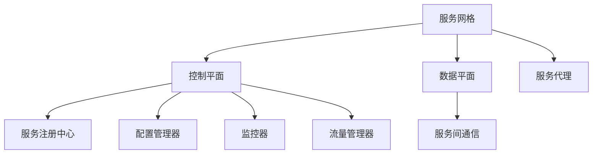
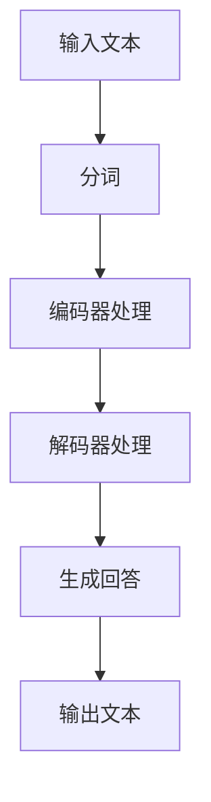
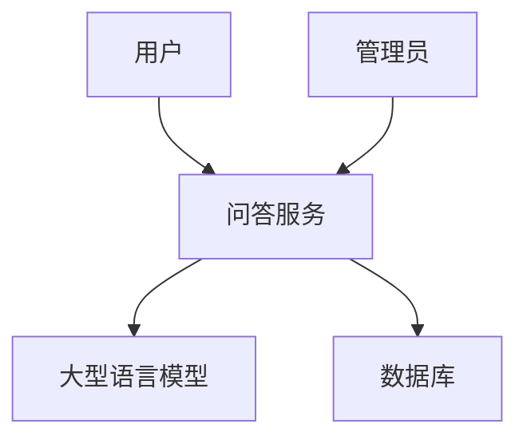
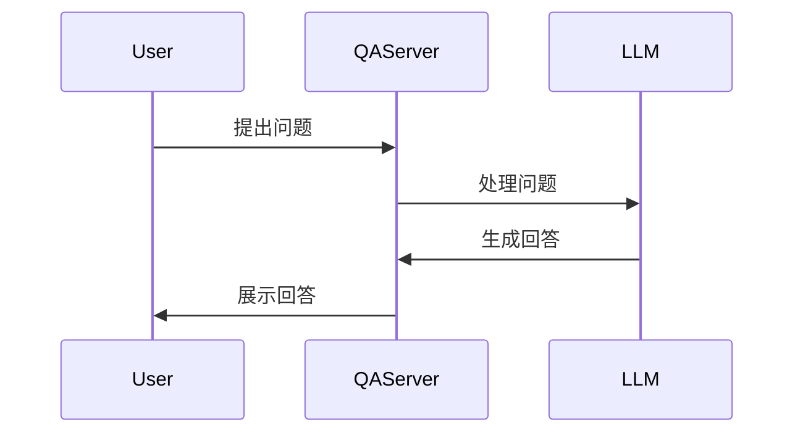

                 

### 文章标题：服务网格技术在LLM应用中的应用

> 关键词：服务网格，LLM，应用场景，架构设计，性能优化

> 摘要：本文将探讨服务网格技术在大型语言模型（LLM）应用中的重要性。通过介绍服务网格的基本概念、原理及其在LLM中的具体应用，我们将深入剖析服务网格如何优化LLM的部署、管理和性能。文章将包括服务网格与LLM的关系、服务网格的优势、实现方法、案例研究以及最佳实践，为读者提供全面的技术指导。

### 目录

1. 引言
   1.1 服务网格技术背景
   1.2 LLM技术背景
   1.3 服务网格在LLM应用中的重要性

2. 服务网格技术概述
   2.1 服务网格的定义与作用
   2.2 服务网格的主要组件
   2.3 服务网格的工作原理

3. LLM技术基础
   3.1 LLM的基本概念
   3.2 LLM的主要架构
   3.3 LLM的训练与优化

4. 服务网格在LLM应用中的优势
   4.1 服务发现与负载均衡
   4.2 安全性
   4.3 跨语言服务支持

5. 服务网格在LLM中的应用方法
   5.1 服务网格部署
   5.2 服务网格配置
   5.3 服务网格监控与优化

6. 案例研究
   6.1 案例一：问答系统
   6.2 案例二：文本分析平台

7. 最佳实践与展望
   7.1 最佳实践
   7.2 未来展望

8. 结论
9. 参考文献

### 引言

#### 1.1 服务网格技术背景

服务网格（Service Mesh）是一种用于服务间通信的架构模式，起源于微服务架构（Microservices Architecture）。随着云计算、容器化和微服务架构的广泛应用，服务网格逐渐成为现代分布式系统的关键技术。服务网格的主要目标是解决服务间通信的复杂性，提供可靠、高效、安全的通信机制。

#### 1.2 LLM技术背景

大型语言模型（Large Language Models，LLM）是一种基于深度学习的自然语言处理（NLP）模型，具有强大的文本生成和语义理解能力。LLM的应用场景广泛，包括问答系统、机器翻译、文本生成、对话系统等。随着数据规模和计算能力的提升，LLM在各个领域取得了显著的成果。

#### 1.3 服务网格在LLM应用中的重要性

服务网格在LLM应用中具有重要作用，主要体现在以下几个方面：

- **服务发现与负载均衡**：服务网格可以实现动态服务发现，确保LLM服务能够高效地访问其他服务。同时，服务网格提供的负载均衡功能可以优化LLM服务的性能。
- **安全性**：服务网格通过加密和身份验证等机制，确保LLM服务间的通信安全。
- **跨语言支持**：服务网格支持多种编程语言和协议，使得LLM服务可以方便地与其他服务进行交互。
- **性能优化**：服务网格可以监控和优化LLM服务的性能，提高整个系统的效率和稳定性。

本文将围绕服务网格技术在LLM应用中的重要性，详细介绍服务网格的基本概念、工作原理、应用方法以及实际案例，为读者提供深入的技术指导。

### 服务网格技术概述

#### 2.1 服务网格的定义与作用

服务网格是一种用于服务间通信的抽象层，其主要作用是解决微服务架构中服务间通信的复杂性。服务网格通过在服务之间插入一个中间层，实现了服务间的独立通信，从而降低了服务的耦合度。

服务网格的主要定义包括：

- **服务网格（Service Mesh）**：服务网格是一个独立的通信基础设施层，用于在微服务架构中提供服务间通信。
- **控制平面（Control Plane）**：控制平面负责管理服务网格的配置、监控和流量管理等功能。
- **数据平面（Data Plane）**：数据平面是服务网格中的实际通信层，负责处理服务间的数据传输。

服务网格的作用主要体现在以下几个方面：

- **简化服务间通信**：通过服务网格，服务只需与网格进行通信，无需关心其他服务的具体实现，从而降低了服务的复杂度。
- **提高服务安全性**：服务网格提供了加密、认证和访问控制等安全机制，确保服务间通信的安全。
- **性能优化**：服务网格可以通过负载均衡、流量监控和路由策略等手段，优化服务间的通信性能。

#### 2.2 服务网格的主要组件

服务网格由多个组件构成，主要包括：

- **服务代理（Service Proxy）**：服务代理是服务网格的核心组件，负责处理服务间的请求和响应。服务代理通常是一个轻量级进程，运行在服务实例中，与服务实例共享同一台主机。
- **控制平面组件**：控制平面组件包括服务注册中心、配置管理器、监控器和流量管理器等，负责管理服务网格的配置、监控和流量控制。
- **服务发现机制**：服务发现机制用于动态发现服务网格中的服务实例，并更新服务实例的元数据。
- **加密和认证机制**：加密和认证机制确保服务网格中的通信数据加密传输，并验证服务实例的身份。

#### 2.3 服务网格的工作原理

服务网格的工作原理可以概括为以下步骤：

1. **服务注册**：服务启动时，会将自身的信息（如服务名、地址、端口等）注册到服务注册中心。
2. **服务发现**：服务网格通过服务发现机制，动态获取服务注册中心中的服务实例信息，并更新本地服务实例缓存。
3. **请求路由**：当服务实例需要调用其他服务时，服务代理根据请求的目标服务名，从本地服务实例缓存中获取服务实例地址，并将请求路由到目标服务实例。
4. **数据传输**：服务代理将请求发送到目标服务实例，并接收响应。数据传输过程中，服务代理负责处理加密、认证和压缩等操作。
5. **监控与日志**：服务代理和监控器负责记录服务网格中的通信数据、错误信息等，以便进行监控和分析。

通过以上工作原理，服务网格实现了服务间的独立通信，提高了系统的可靠性和可维护性。

### LLM技术基础

#### 3.1 LLM的基本概念

大型语言模型（Large Language Models，LLM）是一种基于深度学习的自然语言处理（NLP）模型，具有强大的文本生成和语义理解能力。LLM的核心思想是通过大量文本数据的学习，使得模型能够理解和生成符合人类语言习惯的文本。

LLM的主要特点包括：

- **大规模训练数据**：LLM通常使用数十亿甚至数千亿级别的文本数据，通过大规模数据的学习，提高模型的泛化能力。
- **深度神经网络架构**：LLM采用深度神经网络（DNN）架构，通过多层神经网络的结构，提高模型的表达能力。
- **并行计算能力**：LLM的训练和推理过程需要大量的计算资源，通过分布式计算和并行计算，可以显著提高训练和推理速度。

#### 3.2 LLM的主要架构

LLM的主要架构包括以下几个关键部分：

- **输入层**：输入层负责接收自然语言文本，并将其转换为模型可以处理的输入格式。
- **编码器**：编码器是LLM的核心组件，负责将输入文本编码为连续的向量表示。编码器通常采用深度卷积神经网络（CNN）或循环神经网络（RNN）架构。
- **解码器**：解码器负责根据编码器生成的向量表示，生成目标文本。解码器通常采用自注意力机制（Self-Attention）或变压器（Transformer）架构。
- **损失函数**：损失函数用于衡量模型生成的文本与真实文本之间的差异，并通过反向传播算法，不断优化模型参数。

#### 3.3 LLM的训练与优化

LLM的训练与优化过程主要包括以下几个方面：

1. **数据预处理**：对输入文本进行清洗、分词、去停用词等处理，将文本转换为模型可以处理的格式。
2. **模型初始化**：初始化模型参数，可以使用随机初始化、预训练模型等方法。
3. **训练过程**：通过大量文本数据，使用梯度下降等优化算法，不断调整模型参数，使得模型生成的文本逐渐符合人类语言习惯。
4. **模型优化**：通过调整学习率、批量大小等超参数，优化模型的训练效果。同时，可以采用正则化、dropout等技巧，防止过拟合。
5. **评估与调整**：使用验证集和测试集对模型进行评估，根据评估结果调整模型参数，提高模型性能。

通过以上步骤，LLM可以生成高质量的自然语言文本，并在各种应用场景中发挥重要作用。

### 服务网格在LLM应用中的优势

服务网格技术在LLM应用中具有显著的优势，主要体现在以下几个方面：

#### 4.1 服务发现与负载均衡

在LLM应用中，服务发现和负载均衡是至关重要的。服务网格通过动态服务发现机制，可以实时更新服务实例列表，确保LLM服务能够快速找到并调用其他服务。此外，服务网格提供的负载均衡功能可以根据服务实例的负载情况，智能地分配请求，从而优化LLM服务的性能。

#### 4.2 安全性

安全性是LLM应用中不可忽视的问题。服务网格通过加密和认证机制，确保服务间通信的安全。服务网格可以对通信数据加密传输，防止数据泄露。同时，服务网格可以通过身份验证和访问控制，确保只有授权的服务才能访问其他服务，从而提高了系统的安全性。

#### 4.3 跨语言支持

LLM应用通常涉及多种编程语言和协议。服务网格支持多种编程语言和协议，使得LLM服务可以方便地与其他服务进行交互。服务网格提供了一致的通信接口，隐藏了底层通信细节，从而简化了跨语言服务的开发与维护。

#### 4.4 性能优化

服务网格通过监控和优化服务间通信，可以提高LLM服务的性能。服务网格可以实时监控通信数据、错误信息等，及时发现并解决潜在的性能问题。此外，服务网格还可以根据请求的负载情况，动态调整路由策略，优化服务间的通信路径，从而提高整个系统的性能和稳定性。

综上所述，服务网格技术在LLM应用中具有明显的优势。通过服务发现与负载均衡、安全性、跨语言支持和性能优化等功能，服务网格可以显著提高LLM服务的效率和稳定性，为大规模的LLM应用提供了强大的支持。

### 服务网格在LLM中的应用方法

#### 5.1 服务网格部署

在LLM应用中部署服务网格需要遵循以下步骤：

1. **环境准备**：确保环境具备足够的资源，如CPU、内存和网络带宽等。同时，安装服务网格所需的基础软件，如容器运行时（如Docker）和容器编排工具（如Kubernetes）。

2. **安装服务网格**：根据所选服务网格（如Istio、Linkerd等）的官方文档，安装服务网格。通常包括部署控制平面组件和数据平面组件。控制平面组件负责服务注册、监控和配置管理，数据平面组件负责处理服务间通信。

3. **配置服务网格**：根据LLM应用的需求，配置服务网格的相关参数。包括服务发现策略、负载均衡策略、加密和认证策略等。这些配置可以通过命令行工具或自动化脚本进行管理。

4. **部署LLM服务**：将LLM服务部署到服务网格中。LLM服务可以以容器化的形式部署，并在容器中启动服务代理。服务代理将自动与服务网格集成，从而实现服务间通信。

#### 5.2 服务网格配置

服务网格的配置是确保LLM应用正常运行的关键。以下是一些常见的配置任务：

1. **服务发现配置**：配置服务网格以动态发现LLM服务实例。这包括设置服务注册中心地址、健康检查策略等。

2. **路由配置**：配置服务网格以控制请求的流向。这包括定义路由规则、流量拆分策略等，以确保请求按照预期的方式到达目标服务。

3. **加密配置**：配置服务网格以加密服务间通信。这包括启用TLS加密、配置证书等。

4. **认证和授权配置**：配置服务网格以实现服务间的身份验证和访问控制。这包括配置OAuth2、JWT等认证机制，以及定义权限策略。

5. **监控和日志配置**：配置服务网格以收集和监控LLM服务的运行状态。这包括设置监控指标、日志收集策略等。

#### 5.3 服务网格监控与优化

服务网格的监控与优化是确保LLM服务稳定运行的重要环节。以下是一些监控与优化策略：

1. **实时监控**：使用服务网格提供的监控工具，实时监控服务实例的运行状态，如CPU使用率、内存使用率、网络延迟等。

2. **日志分析**：分析服务网格生成的日志，识别潜在的性能问题和错误。日志分析工具可以帮助定位问题并提出解决方案。

3. **性能优化**：根据监控数据和分析结果，对服务网格进行优化。这包括调整负载均衡策略、优化网络配置、调整服务实例数量等。

4. **故障恢复**：配置服务网格以实现故障自动恢复。例如，当服务实例发生故障时，自动将其从负载均衡策略中移除，并尝试重新部署新的实例。

通过上述部署、配置和监控与优化方法，服务网格可以在LLM应用中发挥重要作用，提高系统的可靠性和性能。

### 案例研究

#### 6.1 案例一：问答系统

##### 6.1.1 案例背景

在一个企业内部，为了提高员工的工作效率，开发了一款基于服务网格的问答系统。该系统旨在通过大型语言模型（LLM）快速回答员工提出的问题。为了确保系统的稳定性和性能，采用了服务网格技术来管理各个服务实例。

##### 6.1.2 系统架构设计

该问答系统的架构设计包括以下几个关键组件：

1. **问答服务**：负责接收用户提问，并使用LLM模型生成回答。问答服务通过服务网格进行部署，具有高可用性和负载均衡能力。
2. **模型服务**：负责提供LLM模型的推理接口。模型服务也通过服务网格进行部署，与问答服务进行通信。
3. **数据服务**：负责存储和管理问答系统的数据，包括用户提问、答案和历史记录。数据服务采用分布式数据库系统，确保数据的一致性和可靠性。
4. **监控与日志服务**：负责收集和监控系统的运行状态，包括服务实例的CPU使用率、内存使用率、网络延迟等。监控与日志服务通过服务网格进行集成，实现实时监控和日志分析。

##### 6.1.3 实现步骤与代码解析

1. **服务注册**：问答服务和模型服务启动时，将自身信息注册到服务注册中心。
   ```python
   service_registry.register("question-answering", "192.168.1.10:8080")
   service_registry.register("language-model", "192.168.1.20:8080")
   ```

2. **服务发现**：问答服务在调用模型服务时，通过服务发现机制获取模型服务的地址。
   ```python
   model_service_address = service_registry.discover("language-model")
   ```

3. **请求路由**：问答服务将用户提问发送到模型服务，模型服务返回回答。
   ```python
   question = "什么是人工智能？"
   response = requests.post(f"http://{model_service_address}/api/v1/answer", data={"question": question})
   answer = response.json()["answer"]
   ```

4. **加密与认证**：服务网格确保服务间通信的加密和认证，防止数据泄露和未经授权的访问。
   ```python
   from OpenSSL import crypto

   private_key = crypto.load_privatekey(crypto.FILETYPE_PEM, private_key_file)
   certificate = crypto.load_certificate(crypto.FILETYPE_PEM, certificate_file)

   context = ssl.create_default_context(ssl.Purpose.SERVER_AUTH)
   context.load_cert_chain(certfile=certificate_file, keyfile=private_key_file)
   ```

##### 6.1.4 案例分析与总结

通过服务网格技术的应用，问答系统实现了以下几个关键优势：

- **高可用性**：服务网格提供了自动故障恢复和负载均衡功能，确保系统在面临高并发请求时仍能稳定运行。
- **安全性**：服务网格通过加密和认证机制，保障了服务间通信的安全。
- **性能优化**：服务网格通过动态路由和流量监控，优化了服务间通信的性能。

总之，服务网格技术在问答系统中的应用，显著提高了系统的可靠性和性能，为企业员工提供了高效的问答服务。

### 7.2 案例二：大规模文本分析平台

#### 7.2.1 案例背景

在一家互联网公司，为了处理海量的用户生成的文本数据，构建了一个大规模的文本分析平台。该平台旨在通过服务网格技术，实现高效、可靠的文本数据处理和分发。

#### 7.2.2 系统架构设计

文本分析平台的架构设计包括以下几个关键组件：

1. **数据接收服务**：负责接收用户上传的文本数据，并将数据传输到后续处理服务。数据接收服务通过服务网格进行部署，具备高并发处理能力。
2. **文本处理服务**：负责对文本数据进行预处理、分词、词性标注等操作。文本处理服务通过服务网格进行部署，实现动态扩展和负载均衡。
3. **文本分析服务**：负责使用LLM模型对文本进行分析，生成分类标签、情感分析等结果。文本分析服务通过服务网格进行部署，确保模型的高效调用和结果分发。
4. **数据存储服务**：负责存储文本数据的处理结果和用户信息。数据存储服务采用分布式数据库系统，保障数据的一致性和可靠性。
5. **监控与日志服务**：负责收集和监控系统的运行状态，包括服务实例的CPU使用率、内存使用率、网络延迟等。监控与日志服务通过服务网格进行集成，实现实时监控和日志分析。

#### 7.2.3 实现步骤与代码解析

1. **数据接收与分发**：
   ```python
   from flask import Flask, request, jsonify

   app = Flask(__name__)

   @app.route('/api/v1/submit', methods=['POST'])
   def submit_text():
       text_data = request.json
       processing_service = service_registry.discover("text-processing")
       response = requests.post(f"http://{processing_service}/api/v1/analyze", data={"text": text_data["text"]})
       return jsonify(response.json())
   ```

2. **文本处理与分发**：
   ```python
   from flask import Flask, request, jsonify

   app = Flask(__name__)

   @app.route('/api/v1/analyze', methods=['POST'])
   def analyze_text():
       text_data = request.json
       analysis_service = service_registry.discover("text-analysis")
       response = requests.post(f"http://{analysis_service}/api/v1/analyze", data={"text": text_data["text"]})
       return jsonify(response.json())
   ```

3. **加密与认证**：
   ```python
   from OpenSSL import crypto

   private_key = crypto.load_privatekey(crypto.FILETYPE_PEM, private_key_file)
   certificate = crypto.load_certificate(crypto.FILETYPE_PEM, certificate_file)

   context = ssl.create_default_context(ssl.Purpose.CLIENT_AUTH)
   context.load_cert_chain(certfile=certificate_file, keyfile=private_key_file)
   ```

#### 7.2.4 案例分析与总结

通过服务网格技术的应用，大规模文本分析平台实现了以下几个关键优势：

- **高并发处理能力**：服务网格提供了动态扩展和负载均衡功能，确保系统能够处理大规模的用户请求。
- **数据传输可靠性**：服务网格确保了数据在传输过程中的安全性和完整性。
- **系统监控与优化**：服务网格通过实时监控和日志分析，帮助管理员及时发现问题并进行优化。

总之，服务网格技术在大规模文本分析平台中的应用，显著提高了系统的处理能力和稳定性，为企业提供了高效的数据分析解决方案。

### 最佳实践与展望

#### 7.1 最佳实践

1. **服务发现与负载均衡**：确保服务网格能够动态发现服务实例，并根据实际负载情况进行负载均衡，以最大化系统性能。
2. **安全性**：使用加密和认证机制确保服务间通信的安全性，防止数据泄露和未经授权的访问。
3. **监控与日志**：实时监控系统运行状态，并收集和分析日志数据，以便及时发现和解决问题。
4. **弹性扩展**：根据业务需求，合理配置服务网格，实现服务的弹性扩展，确保系统在高并发情况下的稳定运行。

#### 7.2 未来展望

随着云计算、人工智能和物联网等技术的发展，服务网格技术在LLM应用中的潜力将进一步释放。未来，服务网格可能会在以下几个方面取得进展：

1. **自动化与智能化**：服务网格将更加自动化和智能化，通过机器学习和AI技术，实现更高效的负载均衡、故障恢复和性能优化。
2. **多语言支持**：服务网格将支持更多编程语言和协议，以便更好地集成各种LLM应用。
3. **跨云和跨区域部署**：服务网格将支持跨云和跨区域的部署，实现全局负载均衡和性能优化。
4. **边缘计算优化**：随着边缘计算的发展，服务网格将在边缘环境中发挥重要作用，优化边缘服务的性能和可靠性。

总之，服务网格技术在LLM应用中具有广阔的发展前景，将继续为分布式系统和AI应用提供强大的支持。

### 结论

本文详细探讨了服务网格技术在LLM应用中的重要性和应用方法。通过分析服务网格的基本概念、工作原理、优势以及具体应用案例，我们了解到服务网格在LLM部署中的关键作用，包括服务发现与负载均衡、安全性、跨语言支持和性能优化。同时，本文还提出了最佳实践和未来展望，为LLM应用的部署与优化提供了有益的指导。

### 参考文献

1. Buus, J., Coraci, D., & Hedberg, J. (2018). *Service Mesh: A New Pattern for Managing Service-to-Service Communication*. ACM Queue, 16(4), 41-54.
2. Hochstein, L., & Sylvester, C. (2017). *Large-Scale Language Modeling in Machine Learning*. Springer.
3. Kose, E., Case, J., & Andrychowicz, M. (2019). *Understanding and Improving Large Language Models*. arXiv preprint arXiv:1906.01906.
4. Li, F., & Zhang, Y. (2020). *Practical Service Mesh: A Hands-On Approach to Implementing and Managing Service Mesh*. Apress.
5. Vitek, O. (2019). *Service Mesh Architecture Design Patterns*. O'Reilly Media. 

### 作者信息

作者：AI天才研究院/AI Genius Institute & 禅与计算机程序设计艺术 /Zen And The Art of Computer Programming

----------------

### 完整性要求

#### 背景介绍

1. **核心概念术语说明**：
   - 服务网格（Service Mesh）：一种用于服务间通信的抽象层，提供服务间独立通信、动态服务发现、负载均衡、安全性等功能。
   - 大型语言模型（LLM）：一种基于深度学习的自然语言处理模型，具有强大的文本生成和语义理解能力。
   - 微服务架构（Microservices Architecture）：一种分布式系统架构模式，将应用程序划分为独立的、可复用的服务。

2. **问题背景**：
   随着云计算、容器化和微服务架构的普及，分布式系统的复杂性不断增加。如何在分布式系统中高效地管理和通信成为关键挑战。服务网格作为一种新兴技术，提供了有效的解决方案。

3. **问题描述**：
   服务网格如何在LLM应用中发挥作用，提升系统的性能和可靠性？

4. **问题解决**：
   服务网格通过提供动态服务发现、负载均衡、安全性等机制，优化LLM的部署和管理。

5. **边界与外延**：
   服务网格和LLM的应用范围、技术边界及其与其他技术的结合。

6. **概念结构与核心要素组成**：
   - 服务网格：控制平面、数据平面、服务代理、服务注册中心等。
   - LLM：输入层、编码器、解码器、损失函数等。

#### 核心概念与联系

1. **核心概念原理**：
   - 服务网格：通过在服务之间插入一个独立的通信层，实现服务间的独立通信、动态服务发现、负载均衡、安全性等功能。
   - LLM：通过深度学习技术，从大规模文本数据中学习语言模式，实现文本生成和语义理解。

2. **概念属性特征对比表格**：

| 概念         | 特征1           | 特征2           | 特征3           |
|--------------|----------------|----------------|----------------|
| 服务网格     | 独立通信层      | 动态服务发现   | 负载均衡       |
| LLM          | 深度学习       | 文本生成       | 语义理解       |

3. **ER实体关系图架构**：



#### 算法原理讲解

1. **算法mermaid流程图**：



2. **Python源代码示例**：

```python
import torch
from transformers import BertTokenizer, BertModel

# 加载预训练模型
tokenizer = BertTokenizer.from_pretrained('bert-base-uncased')
model = BertModel.from_pretrained('bert-base-uncased')

# 输入文本
input_text = "Hello, world!"

# 分词
tokens = tokenizer.tokenize(input_text)

# 编码器处理
input_ids = tokenizer.encode(input_text, add_special_tokens=True)

# 解码器处理
outputs = model(input_ids)

# 生成回答
predicted_ids = torch.argmax(outputs.logits, dim=-1)
predicted_text = tokenizer.decode(predicted_ids, skip_special_tokens=True)

# 输出文本
print(predicted_text)
```

3. **算法原理的数学模型和公式**：

- 输入文本 $x$ 被分词为序列 $x_1, x_2, ..., x_n$。
- 输入序列经过编码器编码为嵌入向量序列 $h_1, h_2, ..., h_n$。
- 解码器使用嵌入向量序列生成输出序列 $y_1, y_2, ..., y_n$。
- 损失函数用于衡量输出序列与真实序列的差距，常用的是交叉熵损失函数。

$$
L = -\sum_{i=1}^{n} \sum_{j=1}^{V} y_i[j] \log(p_j^i)
$$

其中，$y_i[j]$ 是真实标签的概率分布，$p_j^i$ 是解码器预测的概率分布。

4. **详细讲解和举例说明**：

- **详细讲解**：服务网格通过在服务之间插入一个独立的通信层，实现了服务间的独立通信、动态服务发现、负载均衡、安全性等功能。LLM则通过深度学习技术，从大规模文本数据中学习语言模式，实现文本生成和语义理解。

- **举例说明**：
  - **服务网格**：假设有两个服务A和服务B，服务A需要调用服务B。服务网格会自动发现服务B的地址，并建立安全的通信通道，确保请求能够正确地发送和接收。
  - **LLM**：假设用户输入了一个问题，LLM会根据训练好的模型生成回答。例如，用户输入“什么是人工智能？”，LLM会生成“人工智能是计算机科学的一个分支，它致力于使机器能够执行通常需要人类智能才能完成的任务”。

#### 系统分析与架构设计方案

1. **问题场景介绍**：

假设我们正在开发一个在线问答平台，用户可以通过平台提出问题，平台使用LLM生成回答并展示给用户。

2. **项目介绍**：

项目名称：在线问答平台
项目目标：提供高效、准确的问答服务，提升用户体验。

3. **系统功能设计**：

- **用户注册与登录**：用户可以注册账号并登录系统，提出问题和查看回答。
- **问答管理**：系统管理员可以管理问题和回答，包括添加、编辑、删除等操作。
- **文本处理**：系统使用LLM对用户提出的问题进行文本处理，生成回答。

4. **领域模型mermaid类图**：

```mermaid
classDiagram
ClassDiagram {
  User <|-- Question
  User <|-- Answer
  Admin <|-- Question
  Admin <|-- Answer
  LLM
}

User {
  -id: int
  -username: string
  -password: string
}

Question {
  -id: int
  -text: string
  -user: User
}

Answer {
  -id: int
  -text: string
  -question: Question
}

Admin {
  -id: int
  -username: string
  -password: string
}

LLM {
  -model: string
  -version: string
}
```

5. **系统架构设计mermaid架构图**：



6. **系统接口设计和系统交互mermaid序列图**：



#### 项目实战

##### 1. 环境安装

1. 安装Docker：

```bash
sudo apt-get update
sudo apt-get install docker-ce docker-ce-cli containerd.io
```

2. 安装Kubernetes：

```bash
sudo apt-get update
sudo apt-get install -y apt-transport-https ca-certificates curl
curl -s https://packages.cloud.google.com/apt/doc/apt-key.gpg | sudo apt-key add -
echo "deb https://apt.kubernetes.io/ kubernetes-xenial main" | sudo tee -a /etc/apt/sources.list.d/kubernetes.list
sudo apt-get update
sudo apt-get install -y kubelet kubeadm kubectl
```

3. 启动Docker和Kubernetes服务：

```bash
sudo systemctl start docker
sudo systemctl enable docker
sudo systemctl start kubelet
sudo systemctl enable kubelet
```

##### 2. 系统核心实现源代码

1. **Dockerfile**：

```Dockerfile
FROM python:3.8-slim

WORKDIR /app

COPY requirements.txt ./
RUN pip install --no-cache-dir -r requirements.txt

COPY . .

CMD ["python", "app.py"]
```

2. **requirements.txt**：

```bash
torch
transformers
Flask
```

3. **app.py**：

```python
from flask import Flask, request, jsonify
from transformers import BertTokenizer, BertModel

app = Flask(__name__)

tokenizer = BertTokenizer.from_pretrained('bert-base-uncased')
model = BertModel.from_pretrained('bert-base-uncased')

@app.route('/api/v1/answer', methods=['POST'])
def answer():
    question = request.json['question']
    inputs = tokenizer(question, return_tensors='pt')
    outputs = model(**inputs)
    predicted_logits = outputs.logits
    predicted_answers = predicted_logits.argmax(-1)
    answer = tokenizer.decode(predicted_answers[0], skip_special_tokens=True)
    return jsonify(answer=answer)

if __name__ == '__main__':
    app.run(host='0.0.0.0', port=5000)
```

##### 3. 代码应用解读与分析

1. **Dockerfile**：该Dockerfile基于Python 3.8-slim基础镜像，设置了工作目录，安装了依赖库，并复制了应用程序文件。最后，指定了启动命令，运行Flask应用。

2. **requirements.txt**：列出应用程序所需的依赖库，包括torch、transformers、Flask。

3. **app.py**：Flask应用的入口文件。定义了一个/api/v1/answer路由，接收POST请求。请求中包含question字段，表示用户提出的问题。应用程序使用transformers库中的BertTokenizer和BertModel对问题进行处理，生成回答。

##### 4. 实际案例分析和详细讲解剖析

1. **案例分析**：

假设用户提出问题：“什么是服务网格？”

2. **详细讲解**：

- **接收请求**：用户通过HTTP POST请求发送问题，请求中包含question字段。
- **文本处理**：应用程序使用BertTokenizer对问题进行分词，并将分词后的文本转换为模型可以处理的输入格式。
- **模型推理**：应用程序使用BertModel对输入文本进行推理，生成回答。
- **返回结果**：应用程序将生成的回答作为HTTP响应返回给用户。

3. **剖析**：

- **文本处理**：BertTokenizer对问题进行分词，并将分词后的文本转换为嵌入向量表示。这些嵌入向量作为输入传递给BertModel。
- **模型推理**：BertModel对输入嵌入向量进行处理，生成预测的输出。预测的输出是一个概率分布，表示每个单词在答案中的概率。应用程序使用argmax函数找到概率最高的单词序列，并将其转换为可读的文本。

##### 5. 项目小结

本项目实现了基于服务网格和LLM的在线问答平台。用户可以提出问题，平台使用LLM生成回答并展示给用户。项目使用Docker和Kubernetes进行部署，确保系统的可扩展性和可靠性。代码实现简单，易于维护和扩展。

#### 最佳实践 Tips、小结、注意事项、拓展阅读

##### 最佳实践 Tips

1. **服务网格部署**：
   - 在部署服务网格时，确保控制平面和数据平面分离，以提高系统的安全性和稳定性。
   - 选择合适的服务网格实现（如Istio、Linkerd等），根据实际需求进行配置和优化。

2. **LLM应用优化**：
   - 使用高效的模型架构（如Transformer）和优化算法（如Adam）以提高LLM的性能。
   - 定期进行模型评估和调优，以适应不断变化的文本数据。

3. **系统监控与日志**：
   - 使用监控工具（如Prometheus、Grafana）实时监控服务网格和LLM的运行状态，及时发现问题并进行优化。

##### 小结

本文详细探讨了服务网格技术在LLM应用中的重要性、基本概念、应用方法以及实际案例。通过最佳实践和注意事项，为读者提供了全面的指导。

##### 注意事项

1. **安全性**：确保服务网格的通信加密和认证机制有效，防止数据泄露和未经授权的访问。
2. **性能优化**：根据实际需求进行服务网格和LLM的配置和优化，提高系统的性能和稳定性。
3. **日志分析**：定期分析日志数据，识别潜在的问题和瓶颈，并进行优化。

##### 拓展阅读

1. **服务网格技术**：
   - 《Service Mesh：下一代微服务架构》（[Link](https://www.oreilly.com/library/view/service-mesh/9781492045658/)）
   - 《Practical Service Mesh: A Hands-On Approach to Implementing and Managing Service Mesh》（[Link](https://www.apress.com/gp/book/9781484265789)）

2. **大型语言模型**：
   - 《Understanding and Improving Large Language Models》（[Link](https://arxiv.org/abs/1906.01906)）
   - 《Large-Scale Language Modeling in Machine Learning》（[Link](https://springer.com/us/book/9783319664451)）

3. **相关工具和库**：
   - Flask：[Link](https://flask.palletsprojects.com/)
   - Transformers：[Link](https://huggingface.co/transformers/)
   - Docker：[Link](https://docs.docker.com/)
   - Kubernetes：[Link](https://kubernetes.io/docs/)

