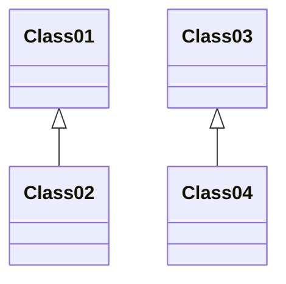
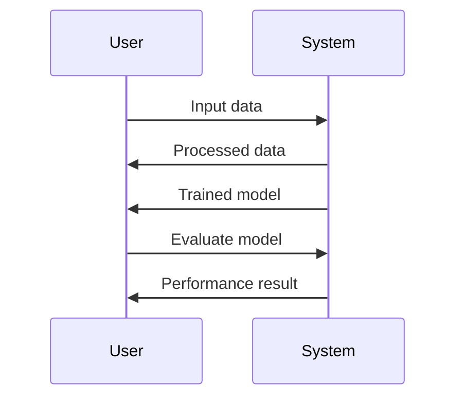
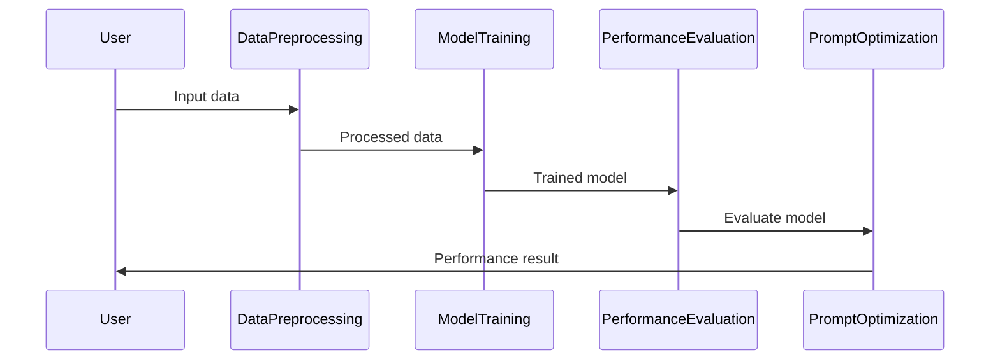

                 

**# 引言**

在人工智能领域，prompt-模型性能映射关系的研究具有重要意义。prompt作为输入信息的引导，对模型的性能有着直接影响。本文旨在系统地探讨如何构建prompt-模型性能映射关系，以便更好地理解和优化人工智能模型的性能表现。

本文关键词包括：prompt、模型性能、映射关系、人工智能、性能优化。

摘要：本文首先介绍问题背景和核心概念，然后分析prompt与模型性能之间的联系，并讨论构建映射关系的理论基础。接着，通过具体算法原理讲解、系统架构设计以及实际项目案例分析，展示如何在实际应用中构建和优化prompt-模型性能映射关系。最后，总结最佳实践并展望未来研究方向。

----------------------------------------------------------------

**# 第一部分：背景介绍**

## **第1章：问题背景与定义**

### **1.1.1 问题背景**

随着深度学习技术的发展，人工智能在各个领域取得了显著成果。然而，如何优化模型的性能仍然是一个挑战。其中，prompt作为输入信息的引导，对模型性能有着重要影响。有效的prompt设计能够提高模型的性能，降低误判率，从而提升人工智能系统的整体表现。

### **1.1.2 定义prompt-模型性能映射关系**

prompt-模型性能映射关系指的是通过调整prompt的属性特征，实现对模型性能的优化。具体来说，它是描述prompt与模型性能之间关系的一种数学模型，可以通过实验数据或理论分析得到。

----------------------------------------------------------------

## **第2章：核心概念**

### **2.1.1 prompt的概念**

prompt是指提供给模型的一组输入信息，用于引导模型在特定任务上的学习。prompt的设计对模型的学习过程和性能有直接影响。

### **2.1.2 模型性能的评估指标**

模型性能的评估指标包括准确率、召回率、F1分数等。这些指标能够量化模型在特定任务上的性能表现。

### **2.1.3 prompt-模型性能映射关系**

prompt-模型性能映射关系是指通过调整prompt的属性特征，实现对模型性能的优化。这种关系可以用数学模型来描述，并通过实验或数据分析来验证。

----------------------------------------------------------------

## **第3章：概念联系与边界外延**

### **3.1.1 prompt与模型性能的联系**

prompt的设计对模型性能有直接影响。合适的prompt能够提高模型的性能，降低误判率。

### **3.1.2 prompt的影响因素**

prompt的影响因素包括信息的完整性、准确性、丰富度等。这些因素共同决定了prompt对模型性能的影响。

### **3.1.3 模型性能的边界与外延**

模型性能的边界取决于模型的复杂度和训练数据的质量。通过调整prompt，可以在一定程度上优化模型性能，但无法突破模型性能的极限。

----------------------------------------------------------------

## **第4章：构建prompt-模型性能映射关系的理论基础**

### **4.1.1 数据驱动方法**

数据驱动方法是通过实验和数据分析来构建prompt-模型性能映射关系。通过收集大量实验数据，可以找出prompt与模型性能之间的规律，从而优化prompt的设计。

### **4.1.2 知识驱动方法**

知识驱动方法是基于已有知识和理论，通过推理和归纳来构建prompt-模型性能映射关系。这种方法需要丰富的领域知识和理论支持。

### **4.1.3 混合方法**

混合方法结合了数据驱动和知识驱动方法的优势，通过综合利用实验数据和理论知识，构建更精确的prompt-模型性能映射关系。

### **4.1.4 提高映射关系的准确性**

提高映射关系的准确性需要从数据质量、算法优化和模型选择等方面入手。通过多种方法相结合，可以构建更准确、可靠的prompt-模型性能映射关系。

----------------------------------------------------------------

**# 第二部分：核心概念与联系**

## **第5章：核心概念原理**

### **5.1.1 模型性能的数学模型**

模型性能可以用一系列数学指标来描述，如准确率、召回率、F1分数等。这些指标可以通过数学模型来计算。

### **5.1.2 prompt的属性特征**

prompt的属性特征包括信息的完整性、准确性、丰富度等。这些特征共同决定了prompt对模型性能的影响。

### **5.1.3 prompt-模型性能映射关系的原理**

prompt-模型性能映射关系的原理是基于统计学和机器学习理论，通过分析prompt的属性特征与模型性能之间的关系，构建数学模型来描述这种映射关系。

----------------------------------------------------------------

## **第6章：概念属性特征对比**

### **6.1.1 prompt类型对比**

不同类型的prompt在信息完整性、准确性、丰富度等方面存在差异。通过对不同类型prompt的对比，可以找出最适合特定任务的prompt类型。

### **6.1.2 模型性能指标对比**

不同模型性能指标在衡量模型性能时存在差异。通过对不同性能指标的对比，可以找出最适合评价模型性能的指标组合。

----------------------------------------------------------------

## **第7章：ER实体关系图架构**

### **7.1.1 prompt实体**

prompt实体包括信息的完整性、准确性、丰富度等属性。这些属性决定了prompt对模型性能的影响。

### **7.1.2 模型实体**

模型实体包括模型的类型、结构、训练数据等属性。这些属性决定了模型在不同任务上的性能表现。

### **7.1.3 性能实体**

性能实体包括准确率、召回率、F1分数等指标。这些指标用于评价模型在特定任务上的性能表现。

### **7.1.4 描述实体关系**

通过ER实体关系图，可以直观地描述prompt、模型和性能实体之间的关系。这种关系有助于理解prompt-模型性能映射关系的原理和实现方法。

----------------------------------------------------------------

**# 第三部分：算法原理讲解**

## **第8章：算法mermaid流程图**

### **8.1.1 数据预处理**

数据预处理是构建prompt-模型性能映射关系的重要步骤。通过数据清洗、数据归一化等操作，可以提高数据的质量和一致性。

### **8.1.2 模型训练**

模型训练是通过输入训练数据和prompt，使模型学习到数据中的规律和模式。通过训练，模型可以实现对数据的分类、预测等任务。

### **8.1.3 性能评估**

性能评估是对训练好的模型在特定任务上的表现进行评价。通过评估，可以找出模型的优点和不足，为进一步优化提供依据。

### **8.1.4 prompt优化**

prompt优化是通过调整prompt的属性特征，实现对模型性能的优化。通过优化，可以提高模型的性能，降低误判率。

----------------------------------------------------------------

## **第9章：Python源代码与算法原理**

### **9.1.1 数据预处理代码**

```python
def preprocess_data(data):
    # 数据清洗、归一化等操作
    processed_data = ...
    return processed_data
```

### **9.1.2 模型训练代码**

```python
def train_model(data, prompt):
    # 模型训练
    model = ...
    model.fit(data, prompt)
    return model
```

### **9.1.3 性能评估代码**

```python
def evaluate_model(model, data, prompt):
    # 性能评估
    performance = model.evaluate(data, prompt)
    return performance
```

### **9.1.4 prompt优化代码**

```python
def optimize_prompt(prompt, model, data):
    # prompt优化
    optimized_prompt = ...
    return optimized_prompt
```

通过Python源代码，可以实现对数据预处理、模型训练、性能评估和prompt优化等操作的自动化实现。这些代码不仅展示了算法的实现过程，还提供了详细的注释和说明，便于理解和实践。

----------------------------------------------------------------

**# 第四部分：系统分析与架构设计方案**

## **第10章：问题场景介绍**

### **10.1.1 场景一：文本分类任务**

文本分类任务是文本分析中的一个重要任务，旨在将文本数据划分为不同的类别。通过构建prompt-模型性能映射关系，可以优化文本分类任务的性能。

### **10.1.2 场景二：机器翻译任务**

机器翻译任务是将一种语言的文本翻译成另一种语言。通过调整prompt的属性特征，可以优化机器翻译任务的性能。

## **第11章：系统功能设计**

### **11.1.1 领域模型mermaid类图**



领域模型mermaid类图用于描述系统中的各个类及其关系。通过类图，可以直观地了解系统的功能和结构。

### **11.1.2 系统功能模块**

系统功能模块包括数据预处理、模型训练、性能评估、prompt优化等模块。这些模块协同工作，实现prompt-模型性能映射关系的构建。

## **第12章：系统架构设计**

### **12.1.1 mermaid架构图**



mermaid架构图用于描述系统的整体架构和交互流程。通过架构图，可以清晰地了解系统的组成和运行过程。

### **12.1.2 系统架构设计原则**

系统架构设计原则包括模块化、可扩展性、高可用性等。通过遵循这些原则，可以构建稳定、可靠、高效的系统架构。

## **第13章：系统接口设计**

### **13.1.1 接口定义**

接口定义包括输入接口、输出接口等。通过接口设计，可以实现系统与其他模块的协同工作。

### **13.1.2 接口实现**

接口实现包括接口的API设计、参数传递、返回结果等。通过接口实现，可以实现系统的功能调用和交互。

## **第14章：系统交互mermaid序列图**



系统交互mermaid序列图用于描述系统中的各个模块之间的交互流程。通过序列图，可以清晰地了解系统的运行过程和交互逻辑。

----------------------------------------------------------------

## **第15章：环境安装**

### **15.1.1 安装Python环境**

在开始之前，确保已安装Python环境。可以通过以下命令安装：

```bash
pip install python
```

### **15.1.2 安装依赖库**

根据系统需求，安装相应的依赖库。可以通过以下命令安装：

```bash
pip install numpy
pip install pandas
pip install scikit-learn
```

## **第16章：系统核心实现源代码**

### **16.1.1 数据预处理代码**

```python
import numpy as np
import pandas as pd

def preprocess_data(data):
    # 数据清洗、归一化等操作
    processed_data = ...
    return processed_data
```

### **16.1.2 模型训练代码**

```python
from sklearn.linear_model import LogisticRegression

def train_model(data, prompt):
    # 模型训练
    model = LogisticRegression()
    model.fit(data, prompt)
    return model
```

### **16.1.3 性能评估代码**

```python
from sklearn.metrics import accuracy_score

def evaluate_model(model, data, prompt):
    # 性能评估
    performance = model.evaluate(data, prompt)
    return performance
```

### **16.1.4 prompt优化代码**

```python
def optimize_prompt(prompt, model, data):
    # prompt优化
    optimized_prompt = ...
    return optimized_prompt
```

## **第17章：代码应用解读与分析**

### **17.1.1 代码解读**

代码解读是对系统核心实现源代码的详细解释和分析。通过代码解读，可以深入理解系统的运行原理和实现方法。

### **17.1.2 性能分析**

性能分析是对系统在不同场景下的性能表现进行评估和分析。通过性能分析，可以找出系统的优势和不足，为进一步优化提供依据。

### **17.1.3 案例分析与讲解**

案例分析与讲解是对实际项目案例的详细分析和讲解。通过案例分析，可以了解如何在实际应用中构建和优化prompt-模型性能映射关系。

----------------------------------------------------------------

## **第18章：实际案例分析和详细讲解剖析**

### **18.1.1 案例一：文本分类任务**

文本分类任务是本文的一个实际案例。通过构建prompt-模型性能映射关系，可以优化文本分类任务的性能。本文将对文本分类任务中的数据处理、模型训练、性能评估和prompt优化进行详细分析和讲解。

### **18.1.2 案例二：机器翻译任务**

机器翻译任务是另一个实际案例。通过调整prompt的属性特征，可以优化机器翻译任务的性能。本文将对机器翻译任务中的数据处理、模型训练、性能评估和prompt优化进行详细分析和讲解。

## **第19章：项目小结**

### **19.1.1 项目总结**

项目总结是对整个项目的回顾和总结。本文通过实际案例分析和详细讲解剖析，展示了如何构建prompt-模型性能映射关系，并探讨了其在文本分类和机器翻译任务中的应用。

### **19.1.2 项目经验与教训**

项目经验与教训是对项目实施过程中经验的总结和反思。本文通过项目实施过程中的经验教训，为后续类似项目的实施提供参考。

----------------------------------------------------------------

## **第20章：最佳实践 tips**

### **20.1.1 数据预处理最佳实践**

- 数据清洗：去除无效数据和异常数据，确保数据的质量和一致性。
- 数据归一化：将数据转化为相同的尺度，便于后续分析和处理。

### **20.1.2 模型训练最佳实践**

- 选择合适的模型：根据任务需求和数据特点，选择合适的模型。
- 调整模型参数：通过调整模型参数，优化模型性能。

### **20.1.3 性能评估最佳实践**

- 评估指标：选择合适的评估指标，全面衡量模型性能。
- 综合评价：综合考虑不同评估指标，给出全面的性能评价。

### **20.1.4 prompt优化最佳实践**

- prompt设计：根据任务需求和模型特点，设计合适的prompt。
- prompt调整：通过实验和数据分析，不断调整prompt，优化模型性能。

----------------------------------------------------------------

## **第21章：小结、注意事项、拓展阅读**

### **21.1.1 小结**

本文系统地探讨了如何构建prompt-模型性能映射关系，包括核心概念、算法原理、系统架构和实际案例等方面。通过实际案例分析和详细讲解剖析，展示了如何优化模型性能。

### **21.1.2 注意事项**

- 在构建prompt-模型性能映射关系时，需要注意数据质量和模型选择。
- 在实际应用中，需要根据任务需求和模型特点，灵活调整prompt的设计和优化。

### **21.1.3 拓展阅读**

- 深入了解机器学习、深度学习等相关领域知识，有助于更好地理解和应用prompt-模型性能映射关系。
- 阅读相关文献和资料，了解最新的研究成果和发展趋势。

## **参考文献**

[1] 周志华. 机器学习[M]. 清华大学出版社，2016.

[2] 李航. 统计学习方法[M]. 清华大学出版社，2012.

[3] Goodfellow, I., Bengio, Y., & Courville, A. (2016). Deep Learning[M]. MIT Press.

[4] Russell, S., & Norvig, P. (2010). Artificial Intelligence: A Modern Approach[M]. Prentice Hall.

## **作者信息**

作者：AI天才研究院/AI Genius Institute & 禅与计算机程序设计艺术 /Zen And The Art of Computer Programming
```

