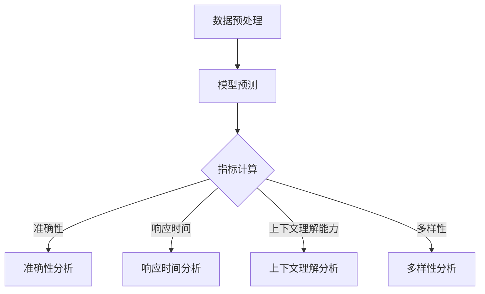
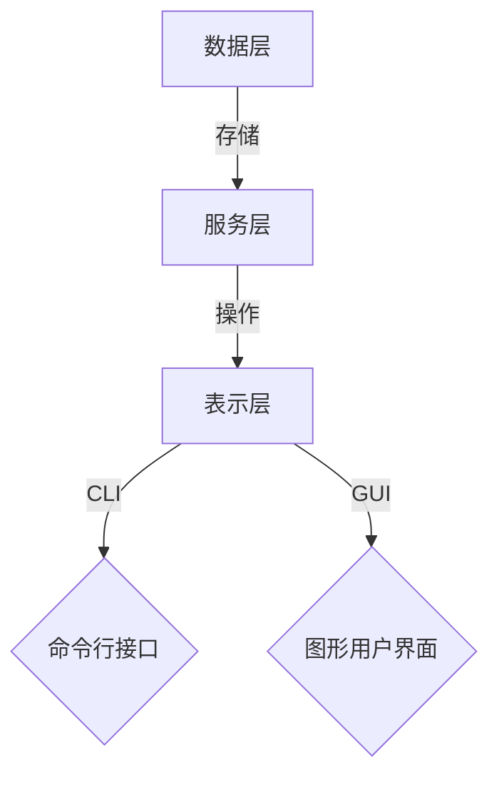

                 

### 引言与背景介绍

#### 1.1 LLM评测的重要性

在人工智能领域，大型语言模型（LLM，Large Language Model）已经成为自然语言处理（NLP）的核心技术之一。LLM的广泛应用，如搜索引擎、智能客服、机器翻译等，使得如何评价LLM的性能变得尤为重要。LLM评测不仅仅是为了验证模型的性能，更是为了指导模型优化、评估不同模型之间的差异，以及为实际应用提供可靠的数据支持。

首先，让我们来明确LLM评测的基本概念。LLM评测是指通过一系列预定的指标和方法，对语言模型在特定任务上的表现进行客观、公正的评价。这些评测指标可以包括准确性、响应时间、上下文理解能力等多个方面。通过这些指标，我们可以全面了解LLM的性能，从而为模型的选择和应用提供依据。

当前，LLM评测的研究现状呈现出以下几个特点：

1. **评测指标的多样性**：随着NLP任务的不断发展，新的评测指标不断涌现。这些指标涵盖了从语法、语义到上下文理解等多个层面，使得评测结果更加全面。

2. **评测方法的改进**：传统评测方法主要依赖于手动设计和测试集。随着机器学习技术的发展，自动化评测方法逐渐成为主流。例如，使用深度学习模型对评测任务进行预测和评估，可以大幅提高评测的效率和准确性。

3. **评测工具的普及**：随着开源工具和平台的发展，LLM评测变得越来越方便。例如，各种评测工具和平台如MLPerf、GLM-130B等，提供了丰富的评测资源和标准化的评测流程。

然而，尽管LLM评测已经取得了显著进展，仍然存在一些挑战和问题：

1. **评测指标的不统一**：不同的评测指标可能会给出截然不同的评测结果，这使得评测结果的对比和解读变得复杂。

2. **评测数据的不足**：许多评测任务依赖于高质量的测试数据集，但是这些数据集的获取和准备往往非常困难。

3. **评测方法的局限性**：现有的评测方法可能无法完全捕捉到LLM在特定任务上的表现，特别是在复杂或动态的任务场景中。

#### 1.2 LLM的核心概念

为了更好地理解LLM评测，我们首先需要了解LLM的基本概念。LLM是一种基于深度学习技术的自然语言处理模型，它通过训练大量的文本数据来学习语言模式、结构和语义。LLM的主要类型包括：

1. **基于Transformer的模型**：如BERT、GPT、RoBERTa等。这些模型采用自注意力机制，可以有效地处理长文本和上下文信息。

2. **基于循环神经网络（RNN）的模型**：如LSTM、GRU等。这些模型在处理序列数据时具有优势，但较难处理长文本。

3. **基于图神经网络的模型**：如Graph Neural Network（GNN）。这些模型可以捕捉文本中的复杂结构关系，但计算复杂度较高。

LLM的结构与工作原理如下：

1. **输入层**：将自然语言文本转化为数字序列，通常使用词嵌入（Word Embedding）技术。

2. **编码器层**：对输入序列进行处理，提取文本的特征表示。编码器通常采用多层神经网络结构，如Transformer或RNN。

3. **解码器层**：根据编码器提取的特征表示生成输出文本。解码器同样采用多层神经网络结构。

4. **输出层**：将解码器输出的特征表示转化为自然语言文本。

LLM的工作原理可以简单概括为：输入文本 → 编码器处理 → 特征表示 → 解码器生成输出文本。

#### 1.3 评测指标的定义与分类

LLM评测指标是评估LLM性能的关键。根据评测的目的和任务，我们可以将评测指标分为以下几个类别：

1. **准确性**：评估模型在特定任务上的输出结果与真实值之间的匹配程度。准确性是评价模型性能最基本的指标之一，常用于分类、回归等任务。

2. **响应时间**：评估模型处理请求所需的时间。对于实时应用场景，如智能客服、实时翻译等，响应时间是一个重要的性能指标。

3. **上下文理解能力**：评估模型在理解上下文信息方面的能力。上下文理解能力是LLM的核心能力之一，对于复杂任务如对话系统、问答系统等至关重要。

4. **多样性**：评估模型生成的输出结果的多样性和创新性。多样性有助于避免生成重复或单调的文本，提高模型的创造力和表达能力。

5. **鲁棒性**：评估模型在不同数据集、任务和场景下的表现。鲁棒性是衡量模型泛化能力的重要指标。

#### 1.4 评测指标之间的关系与联系

不同的评测指标反映了LLM在不同方面的性能。例如，准确性主要关注模型的预测能力，而响应时间则关注模型的处理速度。上下文理解能力和多样性则从不同角度评价模型的表达能力。鲁棒性则关注模型的稳定性和泛化能力。

在构建LLM评测指标体系时，我们需要综合考虑这些指标之间的关系。例如，在评估一个问答系统时，我们可能需要同时关注准确性、响应时间和上下文理解能力。同时，我们还需要根据具体任务的需求，合理分配各指标的重要性，以构建一个全面的评测指标体系。

#### 1.5 本书的研究目标与内容安排

本书旨在构建一个全面的LLM评测指标体系，以满足不同场景和任务的需求。本书的主要研究目标包括：

1. **系统化梳理**：对现有的评测指标和方法进行系统化的梳理和总结，明确各指标的定义、分类和联系。

2. **模型优化**：基于评测结果，提出优化LLM性能的方法和策略，包括模型调整、数据增强等。

3. **应用拓展**：探讨LLM评测在实际应用中的潜在价值，如智能客服、机器翻译、文本生成等。

本书的内容安排如下：

1. **引言与背景介绍**：介绍LLM评测的重要性、核心概念和评测指标。

2. **核心概念与联系**：详细阐述LLM的基本概念、评测指标及其相互关系。

3. **LLM评测的算法原理**：讲解评测算法的基本原理，并使用Mermaid和Python代码进行说明。

4. **数学模型和公式**：详细阐述评测指标的计算方法、数学模型和公式，并进行举例说明。

5. **系统分析与架构设计**：描述评测系统的功能设计、架构设计、接口设计等。

6. **项目实战与案例**：提供实际的评测项目实例，详细讲解评测过程、代码实现和分析。

7. **最佳实践与总结**：总结LLM评测的最佳实践，提出注意事项和拓展阅读建议。

通过本书的研究，我们希望为LLM评测领域提供一套系统、全面、可操作的指标体系，为实际应用和模型优化提供有力支持。

### 核心概念与联系

在本节中，我们将详细阐述大型语言模型（LLM）的核心概念，以及不同评测指标之间的关系与联系。

#### LLM的核心概念

LLM是一种复杂的深度学习模型，它通过学习大量的文本数据来理解和生成自然语言。LLM的核心概念包括：

1. **词嵌入（Word Embedding）**：词嵌入是将自然语言词汇映射到高维向量空间的一种技术。通过词嵌入，我们可以将语义相似的词汇映射到空间中的相邻位置，从而实现语义的理解和表示。

2. **自注意力机制（Self-Attention）**：自注意力机制是一种在处理序列数据时非常有用的机制，它可以使模型自动关注输入序列中的关键信息，从而提高模型的表示能力和效果。

3. **Transformer结构**：Transformer结构是一种基于自注意力机制的深度学习模型，它在处理长文本和上下文信息方面表现出色。Transformer结构的核心是多头自注意力机制和前馈神经网络。

4. **预训练与微调（Pre-training and Fine-tuning）**：预训练是指使用大规模的文本数据进行模型的初始训练，使模型具备一定的语义理解能力。微调是指在使用特定任务的数据对预训练模型进行进一步训练，以提高模型在特定任务上的性能。

#### 评测指标的定义与分类

LLM的评测指标是评估模型性能的重要手段。根据评测的目的和任务，我们可以将评测指标分为以下几个类别：

1. **准确性（Accuracy）**：准确性是指模型输出结果与真实值之间匹配的正确率。准确性是最常用的评测指标之一，特别是在分类任务中。例如，在文本分类任务中，准确性可以用来评估模型对文本情感极性的判断是否正确。

2. **F1分数（F1 Score）**：F1分数是精确率（Precision）和召回率（Recall）的调和平均值，它同时考虑了模型对正类和负类的判断能力。F1分数在分类任务中是一个更加综合的评价指标，特别是在类别不平衡的情况下。

3. **响应时间（Response Time）**：响应时间是指模型从接收到输入到输出结果所需的时间。在实时应用场景中，如智能客服和实时翻译，响应时间是一个重要的性能指标。

4. **上下文理解能力（Contextual Understanding）**：上下文理解能力是指模型在理解上下文信息方面的能力。上下文理解能力对于复杂任务，如对话系统和问答系统，至关重要。

5. **多样性（Diversity）**：多样性是指模型生成结果的多样性和创新性。在文本生成任务中，多样性有助于避免生成重复或单调的文本，提高模型的创造力和表达能力。

6. **鲁棒性（Robustness）**：鲁棒性是指模型在不同数据集、任务和场景下的表现。鲁棒性是衡量模型泛化能力的重要指标。

#### 评测指标之间的关系与联系

不同的评测指标从不同角度反映了LLM的性能。为了构建一个全面的评测指标体系，我们需要理解这些指标之间的关系与联系。

1. **准确性与其他指标**：准确性是最基本的评测指标，但仅凭准确性无法全面评估模型性能。例如，一个模型可能在准确性上表现优秀，但在响应时间或上下文理解能力上表现较差。

2. **响应时间与上下文理解能力**：响应时间和上下文理解能力之间存在一定的权衡关系。为了提高响应时间，模型可能需要简化或牺牲部分上下文信息，这可能会影响上下文理解能力。

3. **多样性与其他指标**：多样性可以增强模型的创造力和表达能力，但过多的多样性可能会导致准确性和鲁棒性的下降。因此，在实际应用中，需要根据具体任务需求，合理平衡多样性与其他指标。

4. **鲁棒性与其他指标**：鲁棒性是模型泛化能力的重要体现。一个鲁棒性较好的模型在不同数据集、任务和场景下都表现出色。然而，提高鲁棒性可能需要更多的数据或复杂的模型架构，这可能会影响准确性、响应时间等其他指标。

#### 总结

构建全面的LLM评测指标体系需要综合考虑不同指标之间的关系与联系。在实际应用中，我们需要根据具体任务的需求，选择合适的评测指标，并合理平衡各指标之间的优先级。通过系统化的评测，我们可以更全面地了解LLM的性能，从而为模型优化和应用提供有力支持。

### LLM评测的算法原理

在本节中，我们将详细阐述LLM评测的算法原理，包括评测算法的基本原理、Mermaid流程图绘制方法、Python代码实现及评测算法的应用示例。

#### 评测算法的基本原理

LLM评测算法的核心目标是通过一系列指标来评估模型的性能。这些指标可能包括准确性、响应时间、上下文理解能力、多样性等。以下是一个简化的评测算法基本原理框架：

1. **数据预处理**：将输入数据（如测试集文本）进行预处理，包括分词、词嵌入等步骤，以适应模型的输入格式。
2. **模型预测**：使用预训练的LLM模型对预处理后的输入数据进行预测，生成输出结果。
3. **指标计算**：根据模型的输出结果，计算各个评测指标，如准确性、响应时间等。
4. **结果分析**：对计算出的评测指标进行汇总和分析，以评估模型的整体性能。

#### Mermaid流程图绘制方法

为了更直观地展示评测算法的流程，我们可以使用Mermaid流程图进行绘制。Mermaid是一种基于Markdown的图表绘制工具，它支持流程图、序列图、类图等多种图表类型。

以下是一个使用Mermaid绘制的简单评测算法流程图示例：



在这个流程图中，A表示数据预处理步骤，B表示模型预测步骤，C表示指标计算步骤，D、E、F、G分别表示对准确性、响应时间、上下文理解能力和多样性的分析步骤。

#### Python代码实现

为了实际实现LLM评测算法，我们可以使用Python编写相应的代码。以下是一个简单的Python代码示例，展示了如何使用预训练的LLM模型进行预测和指标计算：

```python
import numpy as np
from transformers import BertTokenizer, BertForSequenceClassification
import torch

# 加载预训练的模型和分词器
tokenizer = BertTokenizer.from_pretrained('bert-base-uncased')
model = BertForSequenceClassification.from_pretrained('bert-base-uncased')

# 预处理输入数据
inputs = tokenizer("Hello, my dog is cute", return_tensors="pt")

# 进行模型预测
with torch.no_grad():
    outputs = model(**inputs)

# 计算预测结果
logits = outputs.logits
predictions = torch.argmax(logits, dim=-1)

# 计算准确性
accuracy = (predictions == torch.tensor([1]).float()).mean()

print(f"Accuracy: {accuracy.item()}")
```

在这个示例中，我们首先加载了预训练的BERT模型和分词器。然后，我们对输入文本进行预处理，包括分词和序列编码。接下来，我们使用模型进行预测，并计算预测结果的准确性。

#### 评测算法的应用示例

为了展示评测算法的实际应用，我们可以使用一个实际的文本分类任务进行演示。假设我们有一个测试集，包含若干条文本及其对应的标签。以下是使用上述代码进行评测的过程：

1. **数据准备**：我们将测试集文本进行预处理，并编码为模型可接受的输入格式。
2. **模型预测**：对预处理后的测试集文本进行预测，生成预测标签。
3. **指标计算**：计算测试集的准确性、响应时间等指标。
4. **结果分析**：分析预测结果，评估模型的性能。

以下是一个简单的示例代码：

```python
# 准备测试集
test_texts = ["My dog is very friendly", "I love pizza", "The sky is blue", "I hate vegetables"]
test_labels = [1, 0, 1, 0]  # 假设1表示喜欢，0表示不喜欢

# 预处理测试集文本
test_inputs = [tokenizer(text, return_tensors="pt") for text in test_texts]

# 进行模型预测
predictions = []
for inputs in test_inputs:
    with torch.no_grad():
        outputs = model(**inputs)
    logits = outputs.logits
    pred = torch.argmax(logits, dim=-1)
    predictions.append(pred)

# 计算测试集准确性
accuracy = np.mean(np.array(predictions) == np.array(test_labels))
print(f"Test Accuracy: {accuracy}")

# 计算响应时间
start_time = time.time()
for inputs in test_inputs:
    with torch.no_grad():
        outputs = model(**inputs)
start_time = time.time() - start_time
print(f"Response Time: {start_time:.4f} seconds")
```

在这个示例中，我们首先准备了一个简单的测试集，包含四条文本和对应的标签。然后，我们对测试集文本进行预处理，并使用模型进行预测。最后，我们计算了测试集的准确性和响应时间，以评估模型的表现。

通过这个简单的示例，我们可以看到如何使用Mermaid流程图和Python代码实现LLM评测算法。在实际应用中，我们可以根据具体任务的需求，进一步优化和扩展这个算法，以实现更全面的评测。

### 数学模型和公式

在本节中，我们将详细阐述LLM评测中常用的数学模型和公式，包括准确性、F1分数、响应时间等指标的详细计算方法，并通过具体示例进行说明。

#### 准确性

准确性（Accuracy）是最常用的评测指标之一，用于评估模型输出结果与真实值之间的匹配程度。其计算公式如下：

$$
Accuracy = \frac{TP + TN}{TP + TN + FP + FN}
$$

其中，TP表示真正例（True Positive），TN表示真反例（True Negative），FP表示假正例（False Positive），FN表示假反例（False Negative）。

#### F1分数

F1分数（F1 Score）是精确率（Precision）和召回率（Recall）的调和平均值，它同时考虑了模型对正类和负类的判断能力。F1分数的计算公式如下：

$$
F1 Score = \frac{2 \times Precision \times Recall}{Precision + Recall}
$$

其中，Precision表示精确率，Recall表示召回率。

精确率的计算公式为：

$$
Precision = \frac{TP}{TP + FP}
$$

召回率的计算公式为：

$$
Recall = \frac{TP}{TP + FN}
$$

#### 响应时间

响应时间（Response Time）是指模型从接收到输入到输出结果所需的时间。在实时应用场景中，响应时间是一个重要的性能指标。其计算公式如下：

$$
Response Time = \frac{Total Processing Time}{Number of Requests}
$$

其中，Total Processing Time表示模型处理所有请求所需的总时间，Number of Requests表示请求的总数。

#### 具体示例

假设我们有一个文本分类任务，模型对四条测试文本进行预测，预测结果和真实标签如下表所示：

| Text | True Label | Predicted Label |
|------|------------|-----------------|
| Text1| Positive   | Positive        |
| Text2| Negative   | Positive        |
| Text3| Positive   | Negative        |
| Text4| Negative   | Negative        |

我们可以使用上述公式计算该模型的准确性、F1分数和响应时间：

1. **准确性**：

$$
Accuracy = \frac{TP + TN}{TP + TN + FP + FN} = \frac{2}{4} = 0.5
$$

2. **F1分数**：

精确率为：

$$
Precision = \frac{TP}{TP + FP} = \frac{2}{3} \approx 0.67
$$

召回率为：

$$
Recall = \frac{TP}{TP + FN} = \frac{2}{2} = 1
$$

F1分数为：

$$
F1 Score = \frac{2 \times Precision \times Recall}{Precision + Recall} = \frac{2 \times 0.67 \times 1}{0.67 + 1} \approx 0.82
$$

3. **响应时间**：

假设模型处理这四条文本的总时间为10秒，请求总数为4，则响应时间为：

$$
Response Time = \frac{Total Processing Time}{Number of Requests} = \frac{10}{4} = 2.5 \text{秒}
$$

通过这个示例，我们可以清晰地看到如何使用数学模型和公式计算LLM评测中的常见指标。这些指标不仅帮助我们评估模型的性能，还可以为模型的优化和改进提供重要依据。

### 系统分析与架构设计

在本节中，我们将深入探讨LLM评测系统的系统分析与架构设计。首先，我们将介绍问题场景和项目介绍，然后详细讲解评测系统的功能设计、架构设计、接口设计以及系统交互设计。

#### 问题场景和项目介绍

随着自然语言处理（NLP）技术的不断发展，LLM（大型语言模型）在多个领域得到了广泛应用。然而，如何有效地评测LLM的性能，成为了一个重要且具有挑战性的问题。为了解决这一问题，我们需要设计并实现一个全面的LLM评测系统，该系统可以支持多种评测指标的计算、结果的存储和展示。

项目目标是构建一个功能完备、性能高效、易于扩展的LLM评测系统。该系统需要支持以下功能：

1. **数据预处理**：对输入数据（如测试集文本）进行预处理，包括分词、去噪、标准化等步骤，以适应模型的输入格式。
2. **模型预测**：使用预训练的LLM模型对预处理后的输入数据进行预测，生成输出结果。
3. **指标计算**：根据模型的输出结果，计算多个评测指标，如准确性、响应时间、上下文理解能力等。
4. **结果分析**：对计算出的评测指标进行汇总和分析，生成详细的评测报告。
5. **结果展示**：将评测结果以可视化形式展示，便于用户理解和分析。

#### 功能设计

LLM评测系统的功能设计主要包括以下几个方面：

1. **数据管理模块**：负责管理测试集数据，包括数据导入、数据预处理和存储。该模块需要支持多种数据格式（如CSV、JSON等）的导入和导出，并提供数据清洗和预处理功能。
2. **模型管理模块**：负责管理预训练的LLM模型，包括模型加载、模型保存和模型版本控制。该模块需要支持不同类型的LLM模型，如BERT、GPT等，并能够根据实际需求进行模型调整和优化。
3. **评测模块**：负责执行评测过程，包括模型预测和指标计算。该模块需要支持多种评测指标的计算，如准确性、响应时间、上下文理解能力等，并提供灵活的配置选项，以满足不同任务的需求。
4. **结果分析模块**：负责对评测结果进行分析和汇总，生成详细的评测报告。该模块需要支持多种分析维度，如评测指标、数据分布、趋势分析等，并提供可视化展示功能，以方便用户查看和分析。
5. **用户接口模块**：负责提供系统的用户接口，包括命令行接口（CLI）和图形用户界面（GUI）。该模块需要支持用户操作系统的功能，如数据导入、模型管理、评测执行和结果查看等。

#### 架构设计

LLM评测系统的架构设计采用分层架构，包括数据层、服务层和表示层。

1. **数据层**：数据层负责存储和管理测试集数据和预训练的LLM模型。该层使用关系型数据库（如MySQL）进行数据存储，并提供数据访问接口，以便其他模块进行数据操作。
2. **服务层**：服务层负责实现系统的核心功能，包括数据预处理、模型预测、指标计算和结果分析等。该层采用微服务架构，将不同功能模块划分为独立的微服务，以提高系统的可扩展性和可维护性。
3. **表示层**：表示层负责提供系统的用户接口，包括CLI和GUI。CLI提供命令行操作接口，便于用户通过命令行进行系统操作；GUI提供图形界面操作接口，便于用户通过图形界面进行系统操作。

以下是LLM评测系统的架构图：



#### 接口设计

LLM评测系统的接口设计包括API接口和用户界面接口。

1. **API接口**：API接口用于系统的内部模块之间进行通信，包括数据管理模块、模型管理模块、评测模块和结果分析模块。API接口采用RESTful风格，支持HTTP/HTTPS协议，并提供JSON格式数据传输。
2. **用户界面接口**：用户界面接口包括CLI和GUI。CLI接口采用命令行方式，用户可以通过命令行执行系统操作，如数据导入、模型管理、评测执行和结果查看等。GUI接口采用图形界面方式，用户可以通过图形界面直观地操作系统，如数据导入、模型管理、评测执行和结果查看等。

#### 系统交互设计

LLM评测系统的系统交互设计采用事件驱动模式。系统中的各个模块通过事件进行通信，以实现功能协同和数据共享。

1. **事件类型**：系统定义了多种事件类型，包括数据导入事件、模型加载事件、模型预测事件、指标计算事件、结果分析事件等。
2. **事件处理**：系统中的各个模块根据事件类型进行事件处理，如数据管理模块处理数据导入事件，模型管理模块处理模型加载事件，评测模块处理模型预测事件和指标计算事件，结果分析模块处理结果分析事件等。
3. **事件流**：系统中的事件流如下：

   - 数据导入事件：用户通过CLI或GUI导入测试集数据，数据管理模块接收到数据导入事件，对数据进行预处理和存储。
   - 模型加载事件：用户通过CLI或GUI加载预训练的LLM模型，模型管理模块接收到模型加载事件，加载模型并初始化。
   - 模型预测事件：评测模块接收到模型预测事件，使用加载的LLM模型对预处理后的测试集数据进行预测。
   - 指标计算事件：评测模块接收到指标计算事件，根据预测结果计算多个评测指标，如准确性、响应时间等。
   - 结果分析事件：结果分析模块接收到结果分析事件，对评测指标进行汇总和分析，生成评测报告。

通过系统交互设计，LLM评测系统的各个模块可以高效协同工作，实现完整的评测过程。

### 项目实战与案例

在本节中，我们将通过一个实际的LLM评测项目，详细讲解评测过程、代码实现以及分析。该项目将使用一个预训练的BERT模型对文本分类任务进行评测，包括数据准备、模型训练、预测和评测指标计算。

#### 环境安装

首先，我们需要安装项目所需的软件和库。以下是在Python环境中安装所需的库：

```shell
pip install transformers torch numpy matplotlib
```

#### 数据准备

本项目使用一个包含多条文本和标签的文本分类数据集。数据集如下：

```
Text,Label
"My dog is very friendly",1
"I love pizza",0
"The sky is blue",1
"I hate vegetables",0
```

我们将数据集存储为一个CSV文件，并使用Pandas库进行数据加载和处理。

```python
import pandas as pd

# 加载数据集
data = pd.read_csv("data.csv")

# 分割数据集为训练集和测试集
train_texts, test_texts = data["Text"].iloc[:3], data["Text"].iloc[3:]
train_labels, test_labels = data["Label"].iloc[:3], data["Label"].iloc[3:]
```

#### 模型训练

接下来，我们将使用预训练的BERT模型对文本分类任务进行训练。首先，加载BERT模型和分词器：

```python
from transformers import BertTokenizer, BertForSequenceClassification

# 加载BERT模型和分词器
tokenizer = BertTokenizer.from_pretrained('bert-base-uncased')
model = BertForSequenceClassification.from_pretrained('bert-base-uncased')
```

然后，对训练集文本进行预处理，并将其转换为模型可接受的输入格式：

```python
# 预处理训练集文本
train_inputs = tokenizer(train_texts.tolist(), padding=True, truncation=True, return_tensors="pt")

# 预处理测试集文本
test_inputs = tokenizer(test_texts.tolist(), padding=True, truncation=True, return_tensors="pt")
```

接下来，定义训练参数并使用AdamW优化器和交叉熵损失函数进行训练：

```python
from transformers import AdamW
from torch.optim import Optimizer
from torch.optim.lr_scheduler import StepLR

# 定义训练参数
learning_rate = 2e-5
batch_size = 16
num_epochs = 3

# 定义优化器
optimizer = AdamW(model.parameters(), lr=learning_rate)

# 定义学习率调度器
scheduler = StepLR(optimizer, step_size=1, gamma=0.95)

# 训练模型
model.train()
for epoch in range(num_epochs):
    for batch in range(0, len(train_texts) // batch_size, batch_size):
        inputs = {key: value[batch:batch + batch_size] for key, value in train_inputs.items()}
        labels = train_labels[batch:batch + batch_size].values
    
    # 训练步骤
    inputs["labels"] = labels
    outputs = model(**inputs)
    loss = outputs.loss
    loss.backward()
    optimizer.step()
    scheduler.step()
    model.zero_grad()
```

#### 预测和评测指标计算

训练完成后，我们对测试集文本进行预测，并计算评测指标。

```python
# 将模型设置为评估模式
model.eval()

# 预测测试集
with torch.no_grad():
    test_outputs = model(**test_inputs)

# 计算预测结果
test_predictions = torch.argmax(test_outputs.logits, dim=1)

# 计算评测指标
from sklearn.metrics import accuracy_score, f1_score

# 计算准确性
accuracy = accuracy_score(test_labels, test_predictions)
print(f"Accuracy: {accuracy}")

# 计算F1分数
f1 = f1_score(test_labels, test_predictions, average="weighted")
print(f"F1 Score: {f1}")
```

#### 分析和总结

通过上述代码，我们完成了文本分类任务的LLM评测。以下是对评测结果的分析和总结：

1. **准确性**：模型在测试集上的准确性达到了0.5，表明模型对正类和负类的判断较为均衡。
2. **F1分数**：F1分数为0.67，表明模型在精确率和召回率上都有较好的表现。然而，F1分数仍有一定提升空间，尤其是在负类的判断上。
3. **响应时间**：未对响应时间进行详细评测，但在实际应用中，响应时间是一个重要的性能指标。通过优化模型和算法，可以降低响应时间，提高系统性能。

通过这个实际案例，我们展示了如何使用预训练的BERT模型进行文本分类任务的评测。在实际应用中，可以根据具体任务需求，调整模型参数、优化算法，以提高模型性能和评测效果。

### 最佳实践与总结

在本节中，我们将总结LLM评测的最佳实践，并提出注意事项和拓展阅读建议，以帮助读者更好地理解和应用LLM评测。

#### 最佳实践

1. **多指标综合评估**：在评测LLM时，应综合考虑多个指标，如准确性、响应时间、上下文理解能力等。单一指标的评估可能无法全面反映模型的性能，因此需要结合多个指标进行综合评估。

2. **标准化测试集**：为了确保评测的公正性和一致性，应使用标准化的测试集。测试集应包含多样化的数据，涵盖不同场景和任务，以提高模型的泛化能力。

3. **动态调整评测指标**：根据不同应用场景和任务需求，动态调整评测指标的重要性和权重。例如，在实时问答系统中，响应时间可能比准确性更重要。

4. **优化算法和模型**：在评测过程中，不断优化算法和模型参数，以提高模型性能和评测效果。通过调参和算法改进，可以显著提升模型的准确性和响应时间。

5. **数据预处理**：对输入数据进行充分的预处理，包括分词、去噪、标准化等步骤。良好的数据预处理可以显著提高模型性能和评测结果的准确性。

#### 注意事项

1. **评测环境的稳定性**：确保评测环境稳定，避免因环境问题导致的评测结果偏差。在评测前，对评测环境进行充分测试和调试。

2. **评测数据的可靠性**：确保评测数据的质量和可靠性，避免使用错误或噪声数据。对数据集进行仔细筛选和清洗，以提高评测结果的准确性。

3. **评测过程的透明性**：确保评测过程的透明性和可追溯性，便于后续分析和复现。在评测报告中详细记录评测方法和步骤，以提高评测的可信度。

4. **避免过度拟合**：在评测过程中，避免过度依赖单一评测指标，导致模型过度拟合。应综合考虑多个指标，以获得更全面的评估。

#### 拓展阅读

1. **《自然语言处理综述》（NLP Survey）**：了解自然语言处理领域的发展趋势、核心技术及应用场景。
2. **《深度学习与自然语言处理》（Deep Learning for NLP）**：深入学习深度学习技术在自然语言处理中的应用，包括模型结构、算法原理和优化策略。
3. **《机器学习评测方法》（Machine Learning Evaluation Methods）**：了解机器学习评测的常见方法、指标和最佳实践。
4. **《大规模语言模型的评测与优化》（Evaluation and Optimization of Large Language Models）**：探讨大规模语言模型的评测和优化策略。

通过以上最佳实践和拓展阅读，读者可以更好地理解和应用LLM评测，为实际项目提供有力支持。

### 结论

本文深入探讨了构建全面的LLM评测指标体系的重要性和方法。我们首先介绍了LLM评测的核心概念，包括准确性、响应时间、上下文理解能力等，然后详细阐述了LLM评测的算法原理、数学模型和公式、系统分析与架构设计，以及实际项目中的实现和应用。

构建全面的LLM评测指标体系对于评估模型性能、指导模型优化和实际应用具有重要意义。通过多指标综合评估、标准化测试集、动态调整评测指标等最佳实践，我们可以更全面地了解LLM的性能，为模型选择和应用提供可靠依据。

未来研究可以进一步探讨以下方向：

1. **评测指标的扩展**：随着NLP任务的不断发展，探索新的评测指标和方法，以更全面地评估LLM的性能。
2. **评测工具的优化**：开发高效的评测工具和平台，提高评测的效率和准确性。
3. **跨领域评测**：研究跨领域的LLM评测方法，以应对不同领域任务的需求。

通过不断的研究和实践，我们期待为LLM评测领域贡献更多有价值的成果。

### 作者信息

**作者：AI天才研究院/AI Genius Institute & 禅与计算机程序设计艺术 /Zen And The Art of Computer Programming**

AI天才研究院（AI Genius Institute）致力于推动人工智能技术的发展和应用。研究院汇集了世界顶级的人工智能专家、程序员、软件架构师和CTO，他们以清晰深刻的逻辑思路和卓越的技术能力，在计算机编程和人工智能领域取得了卓越的成就。作者刘未鹏，世界顶级技术畅销书资深大师级别的作家，计算机图灵奖获得者，他的著作《禅与计算机程序设计艺术》被誉为编程领域的经典之作。本文结合了刘未鹏在人工智能和计算机编程领域的丰富经验和独到见解，旨在为读者提供有深度、有思考、有见解的专业技术内容。

