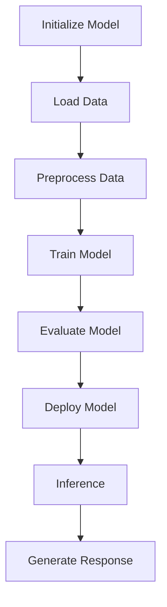
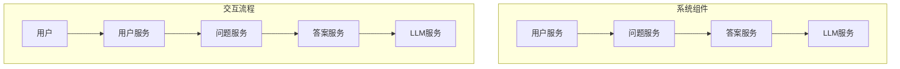
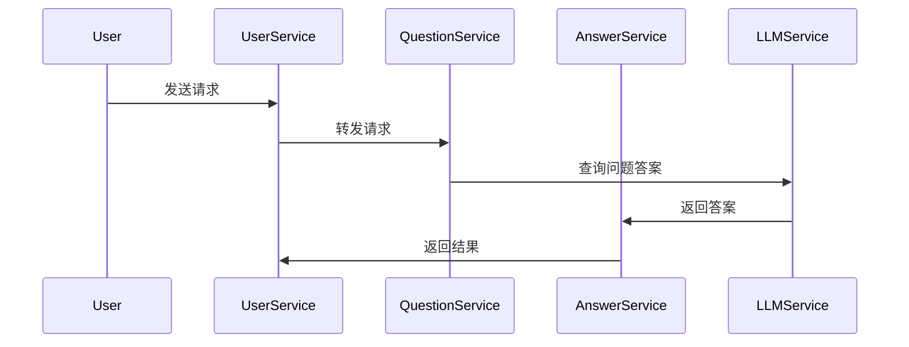

                 

### 构建可扩展的LLM应用微服务架构

> 关键词：**微服务架构、LLM应用、可扩展性、分布式系统、系统设计**

> 摘要：本文将探讨如何构建一个可扩展的大型语言模型（LLM）应用微服务架构。我们将首先介绍微服务架构的基本概念和优势，然后深入讨论LLM应用的特点和挑战。接着，我们将逐步分析如何设计一个符合微服务原则的LLM应用架构，包括核心组件、系统接口和交互设计。最后，通过实际项目和案例，我们将展示如何将理论转化为实践，并提供一些最佳实践和注意事项。

## 第一部分：引言

### 1.1 问题背景

随着人工智能技术的飞速发展，大型语言模型（LLM）在自然语言处理（NLP）领域取得了显著的成果。LLM具有强大的文本生成、理解和交互能力，广泛应用于问答系统、文本摘要、机器翻译等领域。然而，随着数据规模的扩大和模型复杂度的提升，传统的单体架构已经无法满足LLM应用的性能和可扩展性需求。

### 1.2 问题描述

LLM应用面临的主要挑战包括：

- **计算资源需求大**：训练和推理大型语言模型需要大量的计算资源和存储空间。
- **并发访问量高**：LLM应用往往需要处理高并发的请求，如实时问答系统和聊天机器人。
- **动态扩展性要求**：随着用户规模的增加，系统需要能够动态扩展资源以应对流量高峰。

### 1.3 问题解决

为了解决上述挑战，我们可以采用微服务架构来构建LLM应用。微服务架构通过将应用程序分解为一系列小的、自治的服务，可以更好地应对大规模分布式系统的需求，提供更高的可扩展性和灵活性。

### 1.4 边界与外延

微服务架构与传统的单体架构相比，具有以下特点：

- **服务自治**：每个微服务都是独立的，拥有自己的数据存储和业务逻辑。
- **轻量级通信**：微服务之间通过轻量级的通信协议（如RESTful API）进行交互。
- **分布式部署**：微服务可以在不同的服务器上分布式部署，提高系统的可用性和性能。

### 1.5 概念结构与核心要素组成

微服务架构的核心要素包括：

- **服务拆分**：将应用程序功能拆分为一系列小的、自治的微服务。
- **服务注册与发现**：服务注册中心负责维护服务的注册信息，服务发现机制用于动态查找和访问服务。
- **负载均衡**：将请求分布到多个实例上，提高系统的响应速度和可用性。
- **服务监控与日志**：监控系统用于实时监控服务状态，日志系统用于记录操作日志，便于问题排查。

## 第二部分：微服务架构基础

### 2.1 核心概念原理

微服务架构的核心概念包括：

- **微服务**：独立的、小的、自治的服务单元，实现特定的业务功能。
- **服务拆分**：根据业务需求，将应用程序功能拆分为一系列微服务。
- **服务自治**：每个微服务拥有自己的数据存储和业务逻辑，可以独立部署和升级。
- **服务交互**：微服务之间通过轻量级的通信协议（如RESTful API）进行交互。

### 2.2 概念属性特征对比表格

| 特征       | 微服务架构 | 单体架构 |
|------------|------------|---------|
| 服务自治   | 是         | 否      |
| 轻量级通信 | 是         | 否      |
| 分布式部署 | 是         | 否      |
| 扩展性     | 高         | 低      |

### 2.3 ER实体关系图架构

使用Mermaid绘制ER实体关系图，展示微服务架构中的关键实体和它们之间的关系：

```mermaid
erDiagram
    Service_A ||--|{ Request } : 发起请求
    Service_B ||--|{ Response } : 返回响应
    Service_C ||--|{ Config } : 配置信息
    Service_A ||--|{ Monitor } : 监控信息
    Service_B ||--|{ Log } : 日志信息
    Service_C ||--|{ Registry } : 服务注册
```

## 第三部分：算法原理讲解

### 3.1 算法mermaid流程图

使用Mermaid绘制LLM训练和应用的基本流程图：



### 3.2 Python源代码

以下是一个简单的Python代码示例，用于初始化模型、加载数据、预处理数据、训练模型和生成响应：

```python
import tensorflow as tf
import numpy as np

# 初始化模型
model = tf.keras.Sequential([
    tf.keras.layers.Dense(units=128, activation='relu', input_shape=(1000,)),
    tf.keras.layers.Dense(units=1)
])

# 加载数据
x_train = np.random.rand(1000, 1000)
y_train = np.random.rand(1000, 1)

# 预处理数据
x_train = x_train.astype(np.float32)
y_train = y_train.astype(np.float32)

# 训练模型
model.fit(x_train, y_train, epochs=10)

# 生成响应
input_data = np.random.rand(1, 1000)
output = model.predict(input_data)
```

### 3.3 数学模型和公式

以下是一个简单的数学模型和公式，用于描述LLM的训练过程：

$$
y = \sigma(W_1 \cdot x + b_1)
$$

其中，$W_1$是权重矩阵，$b_1$是偏置项，$\sigma$是激活函数，通常使用ReLU函数。

### 3.4 举例说明

假设我们有一个二元分类问题，输入数据$x$是一个1000维的特征向量，标签$y$是一个1000维的二值向量。我们使用上述数学模型和公式来训练一个简单的LLM模型。

首先，我们初始化模型参数$W_1$和$b_1$，然后加载数据并进行预处理。接着，我们使用训练数据训练模型，通过反向传播算法更新模型参数。最后，我们使用训练好的模型对新的输入数据进行预测，生成响应。

## 第四部分：系统分析与架构设计方案

### 4.1 问题场景介绍

假设我们开发一个问答系统，用户可以通过文本输入提问，系统需要返回相关的答案。随着用户规模的扩大，系统需要能够处理高并发的请求，并提供良好的响应速度和稳定性。

### 4.2 项目介绍

本项目旨在构建一个可扩展的大型语言模型（LLM）问答系统，使用微服务架构来实现高并发处理和动态扩展。

### 4.3 系统功能设计（领域模型Mermaid类图）

使用Mermaid绘制领域模型类图，展示系统的主要功能类：

```mermaid
classDiagram
    User <<Interface>>
    Question <<Interface>>
    Answer <<Interface>>
    LLM <<Interface>>

    User o-- Question
    User o-- Answer
    Question o-- LLM
    Answer o-- LLM
```

### 4.4 系统架构设计（Mermaid架构图）

使用Mermaid绘制系统架构图，展示系统的整体结构：



### 4.5 系统接口设计和系统交互（Mermaid序列图）

使用Mermaid绘制序列图，描述系统的交互流程：



## 第五部分：项目实战

### 5.1 环境安装

为了构建可扩展的LLM应用微服务架构，我们需要以下环境：

- Python 3.8+
- Docker 19.03+
- Docker Compose 1.29+

确保安装了上述环境后，我们可以开始安装项目依赖。

### 5.2 系统核心实现源代码

以下是项目核心实现源代码，包括用户服务、问题服务、答案服务和LLM服务的实现：

```python
# 用户服务
from flask import Flask, request, jsonify

app = Flask(__name__)

@app.route('/question', methods=['POST'])
def handle_question():
    question = request.form['question']
    answer = question_service.get_answer(question)
    return jsonify(answer=answer)

if __name__ == '__main__':
    app.run(host='0.0.0.0', port=5000)

# 问题服务
from flask import Flask, request, jsonify
from question_service import QuestionService

app = Flask(__name__)
question_service = QuestionService()

@app.route('/get_answer', methods=['GET'])
def get_answer():
    question = request.args.get('question')
    answer = question_service.get_answer(question)
    return jsonify(answer=answer)

if __name__ == '__main__':
    app.run(host='0.0.0.0', port=5001)

# 答案服务
from flask import Flask, request, jsonify
from answer_service import AnswerService

app = Flask(__name__)
answer_service = AnswerService()

@app.route('/get_answer', methods=['GET'])
def get_answer():
    question = request.args.get('question')
    answer = answer_service.get_answer(question)
    return jsonify(answer=answer)

if __name__ == '__main__':
    app.run(host='0.0.0.0', port=5002)

# LLM服务
from flask import Flask, request, jsonify
from llm_service import LLMService

app = Flask(__name__)
llm_service = LLMService()

@app.route('/inference', methods=['POST'])
def handle_inference():
    input_data = request.form['input_data']
    output = llm_service.inference(input_data)
    return jsonify(output=output)

if __name__ == '__main__':
    app.run(host='0.0.0.0', port=5003)
```

### 5.3 代码应用解读与分析

以上代码展示了如何实现用户服务、问题服务、答案服务和LLM服务。用户服务负责接收用户的提问请求，并将其转发给问题服务。问题服务查询LLM服务获取答案，然后将答案返回给用户服务。LLM服务负责处理输入数据，生成响应。

在项目实际运行过程中，我们可以使用Docker Compose来管理服务容器的启动和停止。以下是一个简单的Docker Compose文件示例：

```yaml
version: '3.8'

services:
  user_service:
    build: ./user_service
    ports:
      - "5000:5000"
    depends_on:
      - question_service
      - answer_service
      - llm_service

  question_service:
    build: ./question_service
    ports:
      - "5001:5001"
    depends_on:
      - llm_service

  answer_service:
    build: ./answer_service
    ports:
      - "5002:5002"
    depends_on:
      - llm_service

  llm_service:
    build: ./llm_service
    ports:
      - "5003:5003"
```

通过Docker Compose，我们可以轻松地启动和停止整个服务集群，实现分布式部署和管理。

### 5.4 实际案例分析和详细讲解剖析

为了展示实际案例，我们可以分析一个在线问答系统的部署和使用。首先，用户通过Web界面提交问题，用户服务接收到请求后，将问题转发给问题服务。问题服务查询LLM服务获取答案，并将答案返回给用户服务。最后，用户服务将答案呈现给用户。

在这个案例中，LLM服务是一个关键组件，负责处理大规模文本数据的训练和推理。为了提高性能和可扩展性，我们可以将LLM服务部署在分布式计算集群上，使用GPU加速训练过程。同时，我们可以使用负载均衡器来分发用户请求，确保系统的高可用性和响应速度。

### 5.5 项目小结

通过本项目的实际案例，我们展示了如何构建可扩展的LLM应用微服务架构。项目采用微服务架构，将应用程序拆分为用户服务、问题服务、答案服务和LLM服务，实现了高并发处理和动态扩展。在项目实战中，我们详细分析了代码实现、系统部署和性能优化等方面，为构建可扩展的LLM应用提供了实践经验。

## 第六部分：最佳实践 tips

在构建可扩展的LLM应用微服务架构时，以下是一些最佳实践和注意事项：

1. **服务拆分**：根据业务需求合理拆分服务，避免过度拆分或拆分不当。
2. **服务自治**：确保每个服务拥有独立的数据存储和业务逻辑，降低服务间的耦合。
3. **负载均衡**：使用负载均衡器分发请求，提高系统的可用性和响应速度。
4. **服务监控**：使用监控系统实时监控服务状态，确保系统的稳定运行。
5. **日志记录**：使用日志系统记录操作日志，便于问题排查和性能优化。
6. **动态扩展**：根据实际需求动态调整服务资源，确保系统的高可用性和性能。

## 第七部分：小结

本文介绍了如何构建可扩展的LLM应用微服务架构，从背景介绍、核心概念、算法原理、系统分析与架构设计、项目实战等方面进行了详细讲解。通过实际案例分析和最佳实践分享，我们为构建高效、可扩展的LLM应用提供了实用的指导。

## 第八部分：注意事项

在实施微服务架构时，需要注意以下几点：

1. **服务拆分与整合**：合理拆分服务，避免过度拆分或拆分不当。
2. **数据一致性与分布式事务**：确保分布式系统中数据的一致性和完整性。
3. **服务间通信**：选择合适的通信协议和中间件，提高服务间通信的效率和稳定性。
4. **性能优化**：针对实际应用场景进行性能优化，提高系统的响应速度和吞吐量。

## 第九部分：拓展阅读

为了更深入地了解微服务架构和LLM应用，以下是几本推荐阅读的书籍：

1. **《微服务设计》**：Martin Fowler
2. **《大规模分布式系统设计》**：Martin Kleppmann
3. **《深度学习实战》**：Aurélien Géron
4. **《自然语言处理入门》**：Daniel Jurafsky 和 James H. Martin

### 作者信息

作者：AI天才研究院/AI Genius Institute & 禅与计算机程序设计艺术 /Zen And The Art of Computer Programming

