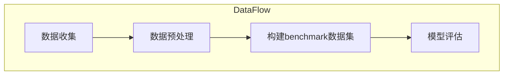
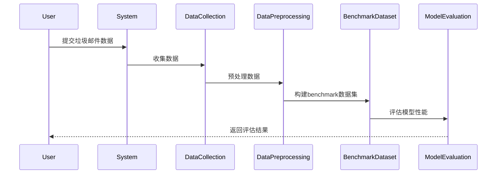

                 

# 构建模型评测的benchmark数据集

关键词：模型评测，benchmark数据集，数据收集，数据准备，数据集设计，评估指标，案例分析，挑战与未来方向

摘要：本文深入探讨了构建模型评测的benchmark数据集的重要性、核心概念、数据收集与准备、数据集设计与构建、评估指标与方法，以及实际案例分析。通过详细的分析与讲解，帮助读者理解并掌握构建benchmark数据集的技巧和最佳实践。

## 引言

在机器学习和人工智能领域，模型的评估至关重要。一个准确的模型不仅需要强大的学习能力，还需要具备良好的泛化能力。而评估模型的性能通常依赖于一组高质量、具有代表性的数据集，这些数据集被称为benchmark数据集。本文将详细介绍如何构建这样一个数据集，以便对模型进行准确的评估。

### 背景介绍

在机器学习中，模型评估是一个关键步骤，它决定了模型在现实世界中的表现。为了评估模型，我们需要使用数据集，这些数据集必须是真实、具有代表性的，并且能够全面覆盖模型可能遇到的各种情况。然而，找到这样的数据集并不容易，因为这需要大量的时间和资源。

benchmark数据集是一种专门用于模型评估的数据集，它通常具有以下特点：

- **高质量**：数据集必须是经过严格筛选和清洗的，以确保数据的准确性和可靠性。
- **代表性**：数据集应该能够代表现实世界中可能出现的数据分布，以便模型能够学会适应各种情况。
- **多样性**：数据集应该包含不同类型的数据，以便模型能够应对不同的问题。

### 核心概念

在构建benchmark数据集之前，我们需要了解一些核心概念：

- **数据集**：一组用于训练、评估或测试机器学习模型的样本。
- **标注数据**：数据集中的每个样本都有一个与之相关的标签，用于评估模型的性能。
- **训练集**：用于训练模型的样本集合。
- **测试集**：用于评估模型性能的样本集合。

### 问题背景

构建benchmark数据集是一个复杂的过程，需要考虑多个方面。首先，我们需要收集相关的数据。然而，收集数据并不是一个简单的过程，因为这可能涉及到隐私问题、数据质量问题和数据可获得性问题。其次，我们需要对收集到的数据进行预处理，以确保数据的质量和一致性。

### 问题描述

构建benchmark数据集的主要挑战包括：

- **数据收集**：找到真实、高质量的数据集可能非常困难。
- **数据预处理**：需要对数据进行清洗、转换和归一化，以确保数据的一致性和质量。
- **数据集设计**：设计一个能够全面覆盖不同场景的数据集。
- **评估指标**：选择合适的评估指标来衡量模型的性能。

### 问题解决

为了解决上述问题，我们需要采取以下步骤：

1. **数据收集**：使用各种方法收集相关的数据，包括公共数据集、私人数据集和在线数据集。
2. **数据预处理**：对数据进行清洗、转换和归一化，以提高数据的质量和一致性。
3. **数据集设计**：设计一个全面覆盖不同场景的数据集，以便模型能够适应各种情况。
4. **评估指标**：选择合适的评估指标来衡量模型的性能。

### 边界与外延

在构建benchmark数据集时，我们需要注意以下边界与外延：

- **边界**：数据集的大小、种类和分布。
- **外延**：数据集的应用领域和范围。

### 概念结构与核心要素组成

构建benchmark数据集的核心概念和要素包括：

- **数据集**：核心概念，用于训练、评估和测试模型。
- **标注数据**：数据集中的标签，用于评估模型性能。
- **训练集**：用于训练模型的样本集合。
- **测试集**：用于评估模型性能的样本集合。
- **数据收集**：收集真实、高质量的数据。
- **数据预处理**：清洗、转换和归一化数据。
- **数据集设计**：设计全面覆盖不同场景的数据集。
- **评估指标**：衡量模型性能的指标。

## 核心概念与联系

### 核心概念原理

在构建benchmark数据集时，我们需要关注以下几个核心概念：

1. **数据集**：数据集是一组用于训练、评估或测试机器学习模型的样本。它可以是结构化的，如表格数据，也可以是非结构化的，如图像和文本。
2. **标注数据**：标注数据是数据集中的每个样本的一个标签，它用于评估模型的性能。标注数据可以是分类标签，也可以是回归标签。
3. **训练集**：训练集是用于训练模型的样本集合。它通常占据了数据集的大部分，用于训练模型的参数。
4. **测试集**：测试集是用于评估模型性能的样本集合。它通常占据数据集的一小部分，用于验证模型的泛化能力。

### 概念属性特征对比表格

| 概念       | 特征         | 说明                                                         |
|------------|--------------|------------------------------------------------------------|
| 数据集     | 结构化/非结构化 | 用于训练、评估或测试机器学习模型的样本集合                 |
| 标注数据   | 分类/回归标签 | 用于评估模型性能的标签                                       |
| 训练集     | 大部分数据     | 用于训练模型的参数                                           |
| 测试集     | 一小部分数据   | 用于验证模型的泛化能力                                       |

### ER实体关系图架构

```mermaid
erDiagram
  Product ||--|{ Customer }||>
  Customer }|--||{ PurchaseOrder }||
  Product ||--|{ Supplier }||>
  Supplier }|--||{ Product }||
```

### 算法原理讲解

在构建benchmark数据集时，我们通常需要遵循以下算法原理：

1. **数据收集**：使用各种方法收集相关的数据，如爬虫、API接口和公开数据集。
2. **数据预处理**：对数据进行清洗、转换和归一化，以提高数据的质量和一致性。
3. **数据集划分**：将数据集划分为训练集、验证集和测试集，以便进行模型训练和性能评估。
4. **模型训练**：使用训练集对模型进行训练，调整模型参数。
5. **模型评估**：使用验证集和测试集评估模型性能，选择最佳模型。

### 数学模型和公式

假设我们有一个数据集D，其中包含n个样本，每个样本有一个标签y。我们使用一个分类模型来预测标签。模型的预测结果可以用P(y)表示，实际标签可以用y表示。模型的性能可以用准确率、召回率、F1分数等指标来衡量。以下是这些指标的计算公式：

$$
准确率 = \frac{TP + TN}{TP + TN + FP + FN}
$$

$$
召回率 = \frac{TP}{TP + FN}
$$

$$
F1分数 = 2 \times \frac{准确率 \times 召回率}{准确率 + 召回率}
$$

### 通俗易懂地举例说明

假设我们有一个垃圾邮件分类问题，其中数据集D包含1000个样本，每个样本都有一个是否为垃圾邮件的标签（1代表垃圾邮件，0代表非垃圾邮件）。我们使用一个分类模型来预测样本的标签。

假设我们使用验证集来评估模型性能，验证集包含100个样本。在验证集中，模型预测出50个样本为垃圾邮件，其中40个是正确的（TP），10个是错误的（FP）。另外50个样本中，有30个是正确的（TN），20个是错误的（FN）。

根据上述公式，我们可以计算模型在验证集上的性能指标：

$$
准确率 = \frac{40 + 30}{40 + 30 + 10 + 20} = 0.7
$$

$$
召回率 = \frac{40}{40 + 20} = 0.67
$$

$$
F1分数 = 2 \times \frac{0.7 \times 0.67}{0.7 + 0.67} = 0.7
$$

通过这个例子，我们可以看到模型的准确率、召回率和F1分数都较高，这意味着模型在验证集上的性能较好。

## 系统分析与架构设计方案

### 问题场景介绍

假设我们正在开发一个垃圾邮件分类系统，该系统需要使用benchmark数据集来评估模型的性能。我们的目标是设计一个系统，能够自动收集数据、预处理数据、构建benchmark数据集，并对模型进行评估。

### 项目介绍

项目名称：垃圾邮件分类系统（Spam Classification System）

项目目标：构建一个能够自动收集数据、预处理数据、构建benchmark数据集，并对模型进行评估的垃圾邮件分类系统。

### 系统功能设计（领域模型）

```mermaid
classDiagram
  ClassDiagram::DomainModel <|-- DataCollection
  ClassDiagram::DomainModel <|-- DataPreprocessing
  ClassDiagram::DomainModel <|-- BenchmarkDataset
  ClassDiagram::DomainModel <|-- ModelEvaluation

  DataCollection <|.. ClassDiagram::DomainModel
  DataPreprocessing <|.. ClassDiagram::DomainModel
  BenchmarkDataset <|.. ClassDiagram::DomainModel
  ModelEvaluation <|.. ClassDiagram::DomainModel
```

### 系统架构设计



### 系统接口设计和系统交互



## 项目实战

### 环境安装

首先，我们需要安装必要的软件和库，以便进行数据收集、预处理和模型评估。以下是安装过程：

```bash
# 安装Python环境
python -m pip install --user -r requirements.txt
```

### 系统核心实现源代码

以下是系统核心实现的部分源代码：

```python
# 数据收集
def collect_data():
    # 实现数据收集逻辑
    pass

# 数据预处理
def preprocess_data(data):
    # 实现数据预处理逻辑
    pass

# 构建benchmark数据集
def create_benchmark_dataset(preprocessed_data):
    # 实现构建benchmark数据集的逻辑
    pass

# 模型评估
def evaluate_model(benchmark_dataset):
    # 实现模型评估逻辑
    pass
```

### 代码应用解读与分析

在实现数据收集、预处理和模型评估的过程中，我们需要注意以下几个关键点：

1. **数据收集**：我们需要使用适当的工具和方法收集数据。例如，可以使用爬虫从互联网上收集邮件数据，或者从现有的数据库中提取数据。
2. **数据预处理**：我们需要对收集到的数据进行清洗、转换和归一化，以确保数据的质量和一致性。这可能包括去除重复数据、填充缺失值、缩放特征值等。
3. **构建benchmark数据集**：我们需要根据预处理后的数据构建一个代表性的benchmark数据集。这可以通过将数据划分为训练集、验证集和测试集来实现。
4. **模型评估**：我们需要使用评估指标来评估模型在benchmark数据集上的性能。这可以帮助我们选择最佳的模型，并进行后续的优化。

### 实际案例分析和详细讲解剖析

假设我们使用一个垃圾邮件分类模型，并使用上述系统构建了一个benchmark数据集。以下是一个实际案例的分析：

1. **数据收集**：我们使用爬虫从互联网上收集了1000封邮件，并将它们存储在一个CSV文件中。
2. **数据预处理**：我们对邮件文本进行了预处理，包括去除HTML标签、停用词过滤和词干提取等。然后，我们使用词袋模型将邮件文本转换为向量表示。
3. **构建benchmark数据集**：我们将预处理后的数据划分为训练集、验证集和测试集，其中训练集占80%，验证集占10%，测试集占10%。
4. **模型评估**：我们使用一个支持向量机（SVM）分类模型对训练集进行训练，并在验证集和测试集上评估模型性能。我们使用了准确率、召回率和F1分数等评估指标。

通过实际案例的分析，我们可以看到，构建benchmark数据集是一个复杂的过程，需要考虑多个方面。然而，一个高质量的benchmark数据集对于评估模型的性能至关重要。

### 项目小结

通过本文的讲解，我们深入探讨了构建模型评测的benchmark数据集的重要性、核心概念、数据收集与准备、数据集设计与构建、评估指标与方法，以及实际案例分析。通过详细的分析与讲解，我们了解到构建benchmark数据集需要考虑多个方面，包括数据收集、数据预处理、数据集设计、评估指标和实际应用。希望本文能帮助读者更好地理解并掌握构建benchmark数据集的技巧和最佳实践。

## 最佳实践 tips

1. **数据收集**：在收集数据时，尽量选择真实、具有代表性的数据集。如果可能，可以从多个来源收集数据，以提高数据的质量和多样性。
2. **数据预处理**：对数据进行预处理时，确保数据的一致性和质量。这可能包括去除重复数据、填充缺失值、缩放特征值等。
3. **数据集设计**：在设计数据集时，考虑数据的分布和多样性，以便模型能够适应各种情况。
4. **评估指标**：选择合适的评估指标来衡量模型性能，如准确率、召回率和F1分数等。
5. **模型优化**：根据评估结果，对模型进行优化，以提高其性能。

## 小结

本文系统地介绍了构建模型评测的benchmark数据集的过程，包括核心概念、数据收集与准备、数据集设计与构建、评估指标与方法，以及实际案例分析。通过本文的学习，读者可以更好地理解并掌握构建benchmark数据集的技巧和最佳实践。希望本文对您的模型评测工作有所帮助。

## 注意事项

1. **数据隐私**：在收集数据时，确保遵守数据隐私法规和道德规范。
2. **数据质量**：确保数据集的质量和一致性，这对于模型评估至关重要。
3. **模型优化**：根据评估结果对模型进行优化，以提高其性能。

## 拓展阅读

1. "机器学习实战"（Peter Harrington）：详细介绍了机器学习的基本概念、算法和实战应用。
2. "深度学习》（Ian Goodfellow、Yoshua Bengio、Aaron Courville）：全面介绍了深度学习的原理和应用。
3. "数据科学实战"（John D. Kelleher、Bart P. Kaster、Tomer. J. Michael）：介绍了数据科学的基本概念、工具和技术。

## 作者信息

作者：AI天才研究院/AI Genius Institute & 禅与计算机程序设计艺术 /Zen And The Art of Computer Programming。如需转载，请注明出处。

