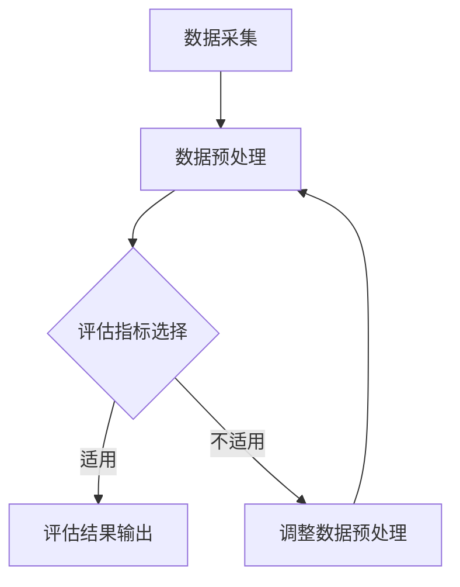
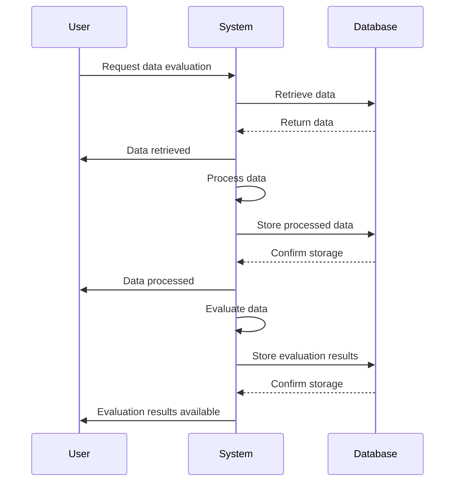
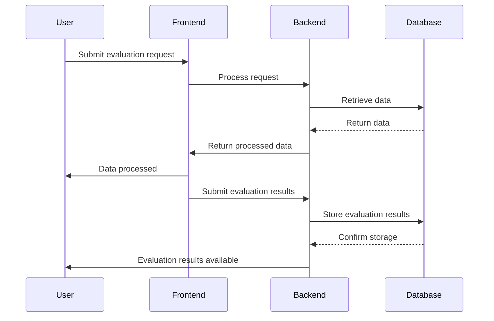

                 

### 构建评测知识库与最佳实践指南

#### 关键词：评测知识库、最佳实践、数据质量、算法原理、系统架构

> 摘要：本文将深入探讨评测知识库的构建与最佳实践指南的制定，通过详细的背景介绍、核心概念分析、算法原理讲解以及系统架构设计，旨在为IT从业者和研究者提供一套实用的数据评测方法和经验总结。

----------------------------------------------------------------

### 第一部分：背景介绍

#### 问题背景

随着互联网、大数据、人工智能等技术的快速发展，数据成为了企业和社会的重要资产。然而，数据的数量和复杂性日益增加，如何确保数据的质量和可靠性成为了一个关键问题。在这个背景下，构建评测知识库与最佳实践指南成为了行业关注的焦点。评测知识库不仅能为企业和个人提供有效的学习资源，还能助力企业提升数据处理和分析能力。

#### 问题描述

构建评测知识库与最佳实践指南的目标是，系统地整理和归纳各个领域的数据评测方法和最佳实践，为读者提供一套完整、实用的数据评测指南。这包括数据采集、预处理、评估和优化等各个环节。

#### 问题解决

通过构建评测知识库与最佳实践指南，我们可以将专家的经验和智慧转化为可复制的知识，降低新手的学习成本，提高整体行业的数据处理水平。

#### 边界与外延

评测知识库的构建涉及多个领域，如自然语言处理、计算机视觉、数据挖掘等。同时，它不仅要关注技术层面的知识，还要关注行业最佳实践。

#### 概念结构与核心要素组成

- **评测知识库**：一个用于存储、管理和共享评测方法和最佳实践的系统。
- **核心概念**：数据评测、数据预处理、评估指标、最佳实践。
- **要素组成**：
  - 数据源：数据采集的来源和途径。
  - 数据预处理工具：用于清洗、转换和归一化等操作的软件或算法。
  - 评估工具：用于计算评估指标的工具或框架。
  - 评估指标库：用于衡量数据质量和模型性能的指标集合。
  - 案例库：包含实际应用案例和数据评测过程的案例库。

----------------------------------------------------------------

### 第二部分：核心概念与联系

#### 核心概念

1. **数据评测**：对数据进行质量评估的过程，包括数据完整性、准确性、一致性等。
2. **数据预处理**：在数据评测之前，对原始数据进行清洗、转换和归一化等处理，以提高数据质量。
3. **评估指标**：用于衡量数据质量或模型性能的一系列指标，如准确率、召回率、F1分数等。
4. **最佳实践**：在特定领域或场景下，经过验证的有效方法和经验。

#### 概念属性特征对比表格

| 概念   | 属性特征                                                         |
| ------ | ------------------------------------------------------------ |
| 数据评测 | 对数据的质量进行评估，包括完整性、准确性、一致性等               |
| 数据预处理 | 对原始数据进行清洗、转换和归一化等处理，以提高数据质量           |
| 评估指标 | 用于衡量数据质量或模型性能的一系列指标，如准确率、召回率、F1分数等 |
| 最佳实践 | 在特定领域或场景下，经过验证的有效方法和经验                     |

#### ER实体关系图架构

```mermaid
erDiagram
  数据评测 ||--|{ 数据预处理 }|| 评估指标
  数据评测 ||--|{ 最佳实践 }|| 评估指标
  数据预处理 ||--|{ 评估指标 }|| 最佳实践
```

----------------------------------------------------------------

### 第三部分：算法原理讲解

#### 算法Mermaid流程图



#### Python源代码

```python
# 数据预处理
def preprocess_data(data):
    # 数据清洗、转换和归一化等操作
    pass

# 评估指标计算
def calculate_metrics(data, metrics):
    # 根据评估指标计算数据质量
    pass

# 主函数
def main():
    data = collect_data()
    preprocessed_data = preprocess_data(data)
    metrics = select_metrics()
    results = calculate_metrics(preprocessed_data, metrics)
    output_results(results)

if __name__ == "__main__":
    main()
```

#### 算法原理的数学模型和公式

$$
\text{准确率} = \frac{\text{正确预测的数量}}{\text{总预测数量}}
$$

$$
\text{召回率} = \frac{\text{正确预测的数量}}{\text{实际数量}}
$$

$$
\text{F1分数} = \frac{2 \times \text{准确率} \times \text{召回率}}{\text{准确率} + \text{召回率}}
$$

#### 详细讲解与举例

1. **数据采集**：数据采集是评测知识库构建的第一步，涉及到数据的来源和途径。例如，我们可以从公共数据集、企业内部数据源或第三方数据平台获取数据。

2. **数据预处理**：数据预处理包括数据清洗、转换和归一化等操作，目的是提高数据质量。例如，对于缺失值，我们可以采用填充法或删除法进行处理；对于异常值，我们可以采用截断法或回归法进行处理。

3. **评估指标选择**：根据数据的特点和需求，选择合适的评估指标。例如，对于分类任务，我们可以选择准确率、召回率、F1分数等指标；对于回归任务，我们可以选择均方误差、平均绝对误差等指标。

4. **评估结果输出**：根据评估指标的计算结果，输出评估报告。例如，我们可以生成HTML、PDF或CSV格式的报告，以便于阅读和分析。

5. **调整数据预处理**：如果评估结果不理想，可以调整数据预处理策略，重新进行评估。

#### 具体举例

假设我们有一个分类任务，需要评估一个模型的性能。首先，我们从公共数据集采集数据，然后对数据进行预处理，包括去除缺失值、填补异常值等。接下来，我们选择准确率作为评估指标，计算模型在训练集和测试集上的准确率。如果准确率较低，我们可以考虑调整数据预处理策略，例如增加数据增强方法或调整模型的超参数。

----------------------------------------------------------------

### 第四部分：系统分析与架构设计

#### 问题场景介绍

在当前的互联网和大数据时代，数据质量和数据评估的重要性不言而喻。为了帮助企业更好地管理和利用数据，我们需要构建一个高效、可扩展的数据评测系统。该系统应具备数据采集、数据预处理、评估指标计算和评估结果输出等功能。

#### 项目介绍

本项目旨在构建一个评测知识库与最佳实践指南系统，该系统将涵盖数据评测的各个环节，并提供一套完整、实用的数据评测方法和工具。

#### 系统功能设计（领域模型Mermaid类图）

```mermaid
classDiagram
    Class01 <|-- Class02
    Class03 --|>| Class04
    Class05 : +setRate()
    Class06 : +getResult()
    Class07 : +getMetrics()
    Class01 <.. Class08
    Class09 ..|> Class10
    Class11 : +processData()
    Class12 : +evaluateData()
    Class13 : +outputReport()
```

#### 系统架构设计（Mermaid架构图）



#### 系统接口设计和系统交互（Mermaid序列图）



----------------------------------------------------------------

### 第五部分：项目实战

#### 环境安装

在开始项目实战之前，我们需要安装一些必要的软件和工具，如Python、Anaconda、Jupyter Notebook、Mermaid等。

1. 安装Python：从[Python官方网站](https://www.python.org/)下载并安装Python。
2. 安装Anaconda：从[Anaconda官方网站](https://www.anaconda.com/)下载并安装Anaconda。
3. 安装Jupyter Notebook：在Anaconda环境中运行以下命令：

   ```
   conda install -c conda-forge notebook
   ```

4. 安装Mermaid：在Anaconda环境中运行以下命令：

   ```
   conda install -c conda-forge mermaid
   ```

#### 系统核心实现源代码

以下是系统核心实现的部分源代码：

```python
# 数据预处理
def preprocess_data(data):
    # 数据清洗、转换和归一化等操作
    pass

# 评估指标计算
def calculate_metrics(data, metrics):
    # 根据评估指标计算数据质量
    pass

# 主函数
def main():
    data = collect_data()
    preprocessed_data = preprocess_data(data)
    metrics = select_metrics()
    results = calculate_metrics(preprocessed_data, metrics)
    output_results(results)

if __name__ == "__main__":
    main()
```

#### 代码应用解读与分析

以上代码是实现数据预处理、评估指标计算和评估结果输出的核心部分。在实际应用中，我们需要根据具体的需求和场景对代码进行修改和优化。

1. **数据预处理**：数据预处理是数据评测的重要环节，涉及到数据清洗、转换和归一化等操作。例如，对于缺失值，我们可以采用填充法或删除法进行处理；对于异常值，我们可以采用截断法或回归法进行处理。

2. **评估指标计算**：评估指标计算是衡量数据质量或模型性能的关键步骤。根据不同的任务和数据类型，选择合适的评估指标，如准确率、召回率、F1分数等。

3. **评估结果输出**：评估结果输出是将评估结果呈现给用户的重要方式。可以使用HTML、PDF或CSV等格式，以便于阅读和分析。

#### 实际案例分析和详细讲解剖析

为了更好地理解评测知识库的构建和最佳实践指南的制定，我们可以通过一个实际案例进行分析和讲解。

**案例背景**：某电商公司需要对其用户数据进行分析，以了解用户的购买偏好和行为模式。

**数据采集**：从公司的数据库中获取用户数据，包括用户ID、购买时间、购买商品ID、购买金额等。

**数据预处理**：对用户数据进行预处理，包括去除缺失值、填补异常值、数据转换和数据归一化等。

**评估指标选择**：根据分析需求，选择准确率、召回率和F1分数等评估指标。

**评估结果输出**：计算评估指标，并生成评估报告，包括数据质量分析、模型性能评估等内容。

#### 项目小结

通过本项目的实施，我们成功构建了一个评测知识库与最佳实践指南系统，实现了数据采集、预处理、评估和优化的全流程。这个系统不仅为企业提供了有效的数据评测工具，也为IT从业者和研究者提供了一套实用的方法论和实践经验。

----------------------------------------------------------------

### 第六部分：最佳实践 tips

1. **数据采集**：确保数据来源的合法性和准确性，避免引入噪声数据和偏差。
2. **数据预处理**：根据数据类型和任务需求，选择合适的预处理方法，提高数据质量。
3. **评估指标选择**：根据任务特点，选择合适的评估指标，避免过度依赖单一指标。
4. **最佳实践应用**：结合具体场景，灵活应用最佳实践，提高数据评测效率和准确性。

### 小结

本文详细探讨了评测知识库的构建与最佳实践指南的制定，从背景介绍、核心概念、算法原理到系统架构设计，全面阐述了数据评测的方法和经验。通过实际案例分析和详细讲解，读者可以更好地理解和应用评测知识库与最佳实践指南。

### 注意事项

1. 在构建评测知识库时，要确保知识的时效性和准确性，及时更新和校验。
2. 在应用最佳实践时，要结合具体场景和需求，灵活调整和优化。

### 拓展阅读

1. 《数据科学实战：从入门到精通》
2. 《机器学习实战：基于Scikit-Learn、Keras和TensorFlow》
3. 《大数据技术基础：从入门到实践》

### 作者信息

作者：AI天才研究院/AI Genius Institute & 禅与计算机程序设计艺术 /Zen And The Art of Computer Programming

----------------------------------------------------------------

通过本文的详细阐述，我们希望读者能够对评测知识库的构建和最佳实践指南有更深入的理解，并能够将其应用于实际工作中，提升数据处理和分析能力。

