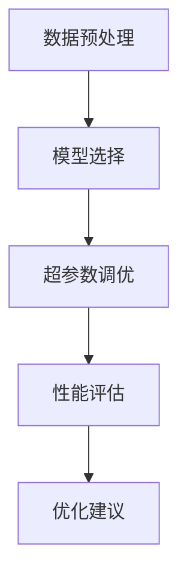
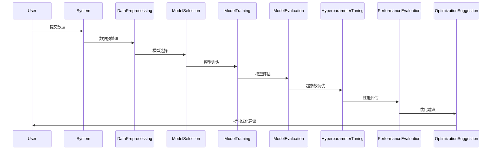

                 

### 构建评测结果的模型性能优化建议系统

#### 摘要

本文旨在探讨如何构建一个基于评测结果的模型性能优化建议系统，以提高人工智能模型在实际应用中的效果和效率。首先，我们将介绍系统构建的背景和问题，并详细阐述其核心概念、算法原理和系统架构。接下来，我们将通过实际案例分析和代码实现，展示该系统的具体应用和效果。最后，我们将总结最佳实践并给出未来工作方向。

#### 目录

1. **背景介绍**
   1.1 **问题背景**
   1.2 **问题描述**
   1.3 **问题解决**
   1.4 **边界与外延**
   1.5 **概念结构与核心要素组成**

2. **核心概念与联系**
   2.1 **核心概念原理**
   2.2 **概念属性特征对比表格**
   2.3 **ER实体关系图架构**

3. **算法原理讲解**
   3.1 **算法流程**
   3.2 **算法流程图**
   3.3 **Python源代码**
   3.4 **数学公式与示例**
   
4. **系统分析与架构设计方案**
   4.1 **问题场景介绍**
   4.2 **系统功能设计**
   4.3 **系统架构设计**
   4.4 **系统接口设计**
   4.5 **系统交互序列图**
   
5. **项目实战**
   5.1 **环境安装**
   5.2 **系统核心实现源代码**
   5.3 **代码应用解读与分析**
   5.4 **实际案例分析**
   5.5 **项目小结**

6. **最佳实践 tips**
7. **小结**
8. **注意事项**
9. **拓展阅读**

### 第一部分：背景介绍

#### 1.1 问题背景

随着人工智能（AI）技术的飞速发展，深度学习模型在各个领域的应用日益广泛。这些模型通过学习大量数据，能够自动发现数据中的规律和模式，从而实现图像识别、自然语言处理、推荐系统等复杂任务。然而，在实际应用中，模型性能的提升往往面临着诸多挑战。如何有效地评测模型性能并对其进行优化，成为了一个重要的研究课题。

评测结果模型性能优化主要涉及以下几个方面：

1. **数据预处理**：对输入数据进行清洗、归一化等处理，提高数据质量和一致性。
2. **模型选择**：根据问题特点和数据规模，选择合适的模型架构。
3. **超参数调优**：调整模型超参数，以优化模型性能。

现有的研究大多集中在算法优化和模型改进上，对于模型评测结果的优化关注较少。因此，构建一个能够给出性能优化建议的系统，对于提高模型在实际应用中的表现具有重要意义。

#### 1.2 问题描述

在AI领域，评测结果模型性能优化的问题可以概括为：如何根据模型的评测结果，提出有效的性能优化建议，以提高模型在实际应用中的表现。具体来说，该问题涉及以下几个方面：

1. **评测指标**：如何选择合适的评测指标，以全面、客观地评估模型性能。
2. **性能瓶颈**：如何分析评测结果，找出模型性能的瓶颈所在。
3. **优化策略**：如何根据性能瓶颈，提出有效的优化策略，包括数据预处理、模型选择和超参数调优等。

#### 1.3 问题解决

要解决评测结果模型性能优化问题，我们可以从以下几个方面入手：

1. **数据预处理**：对输入数据进行清洗、归一化等处理，确保数据的质量和一致性。
2. **模型选择**：根据问题特点和数据规模，选择合适的模型，并在模型库中进行筛选。
3. **超参数调优**：对模型超参数进行调优，以提高模型性能。

#### 1.4 边界与外延

1. **边界**：
   - 本系统主要针对AI评测结果模型的性能优化，不包括模型开发的其他环节（如数据收集、模型训练等）。
   - 系统的评测指标主要针对常见的模型性能指标，如准确率、召回率、F1值等。

2. **外延**：
   - 本系统可以应用于各类AI任务，如分类、回归、聚类等。
   - 系统的优化策略可以根据不同任务的特点进行调整。

#### 1.5 概念结构与核心要素组成

1. **评测结果**：指模型在训练和测试过程中得到的指标，如准确率、召回率、F1值等。
2. **性能优化建议**：根据评测结果，提出的改进模型性能的建议，包括数据预处理方法、模型选择策略、超参数调优技巧等。

### 第二部分：核心概念与联系

#### 2.1 核心概念原理

1. **数据预处理**：
   - **原理**：数据预处理是提高模型性能的重要环节。通过数据清洗、归一化等处理，可以提高数据质量，减少噪声对模型的影响。
   - **方法**：包括数据清洗（去除异常值、噪声数据等）、数据归一化（将数据缩放到相同范围）、数据增强（生成新的训练样本）等。

2. **模型选择**：
   - **原理**：选择合适的模型是提高模型性能的关键。不同的模型适用于不同的任务和数据规模。
   - **方法**：包括选择合适的算法（如线性模型、树模型、神经网络等）、调整模型参数（如树模型的深度、神经网络的层数和神经元数等）。

3. **超参数调优**：
   - **原理**：超参数是模型性能的重要影响因素。通过调优超参数，可以优化模型性能。
   - **方法**：包括网格搜索（穷举搜索超参数空间）、贝叶斯优化（基于概率模型搜索超参数空间）等。

#### 2.2 概念属性特征对比表格

| 概念           | 描述                                         | 属性特征对比                         |
| -------------- | -------------------------------------------- | ------------------------------------ |
| 数据预处理     | 提高数据质量，为模型训练做好准备               | - 清洗：去除噪声数据<br>- 归一化：缩放数据 |
| 模型选择       | 选择合适的模型，提高性能                       | - 算法：不同算法的特性<br>- 参数：模型参数 |
| 超参数调优     | 调整模型超参数，优化模型性能                   | - 范围：超参数的取值范围<br>- 目标：优化指标 |

#### 2.3 ER实体关系图架构

```mermaid
erDiagram
    Model ||--|{ DataPreprocessing } : 预处理
    Model ||--|{ ModelSelection } : 选择
    Model ||--|{ HyperparameterTuning } : 调优
```

### 第三部分：算法原理讲解

#### 3.1 算法流程

构建评测结果的模型性能优化建议系统的核心在于如何根据评测结果提出有效的优化建议。算法流程主要包括以下几个步骤：

1. **数据预处理**：对输入数据进行清洗、归一化等处理，确保数据的质量和一致性。
2. **模型选择**：根据问题特点和数据规模，选择合适的模型，并进行模型筛选。
3. **超参数调优**：使用网格搜索、贝叶斯优化等方法，调整模型超参数，以优化模型性能。
4. **性能评估**：根据评测指标，评估模型性能，判断是否达到优化目标。
5. **优化建议**：根据性能评估结果，提出优化建议，包括数据预处理方法、模型选择策略、超参数调优技巧等。

#### 3.2 算法流程图



#### 3.3 Python源代码

```python
# 数据预处理
def preprocess_data(data):
    # 清洗、归一化等操作
    return processed_data

# 模型选择
def select_model(data):
    # 根据数据特点和规模选择模型
    return model

# 超参数调优
def optimize_hyperparameters(model, data):
    # 使用网格搜索、贝叶斯优化等方法调优超参数
    return optimized_model

# 性能评估
def evaluate_model(model, data):
    # 根据评测指标评估模型性能
    return performance

# 优化建议
def suggest_optimizations(performance):
    # 根据性能评估结果提出优化建议
    return suggestions
```

#### 3.4 数学公式与示例

在模型性能优化过程中，常常会涉及到一些数学公式和指标。以下是几个常用的公式示例：

1. **准确率**：
   $$ \text{准确率} = \frac{\text{预测正确数量}}{\text{总预测数量}} $$

2. **召回率**：
   $$ \text{召回率} = \frac{\text{预测正确数量}}{\text{实际正确数量}} $$

3. **F1值**：
   $$ \text{F1值} = 2 \times \frac{\text{准确率} \times \text{召回率}}{\text{准确率} + \text{召回率}} $$

#### 3.5 例子说明

假设我们有一个分类问题，使用随机森林模型进行预测。评测结果显示，模型的准确率为0.8，召回率为0.7，F1值为0.74。根据这些评测结果，我们可以提出以下优化建议：

1. **数据预处理**：进一步清洗数据，去除噪声和异常值，提高数据质量。
2. **模型选择**：考虑尝试其他模型，如支持向量机（SVM）或神经网络（NN），以找到更适合该问题的模型。
3. **超参数调优**：调整随机森林模型的超参数，如最大深度、最小样本分裂等，以提高模型性能。

### 第四部分：系统分析与架构设计方案

#### 4.1 问题场景介绍

在现实场景中，模型性能优化通常是一个反复迭代的过程。一方面，模型开发者需要根据业务需求和数据特点，不断调整模型结构和超参数；另一方面，数据预处理也是一个动态调整的过程，以应对数据噪声和分布变化。因此，我们需要一个系统来协助模型开发者快速、有效地进行模型性能优化。

该系统的目标是为模型开发者提供以下功能：

1. **数据预处理建议**：根据数据特点，给出数据清洗、归一化等预处理方法。
2. **模型选择建议**：根据问题特点和数据规模，推荐合适的模型。
3. **超参数调优建议**：提供超参数调优策略，包括搜索范围、调优方法等。

#### 4.2 系统功能设计

系统功能设计主要包括以下几个模块：

1. **数据预处理模块**：负责对输入数据进行清洗、归一化等处理，为模型训练做好准备。
2. **模型选择模块**：根据问题特点和数据规模，推荐合适的模型，并支持模型库的扩展。
3. **超参数调优模块**：提供多种调优方法，如网格搜索、贝叶斯优化等，帮助开发者优化模型性能。
4. **性能评估模块**：根据评测指标，评估模型性能，为优化建议提供依据。
5. **优化建议模块**：根据性能评估结果，提出数据预处理、模型选择和超参数调优等优化建议。

#### 4.3 系统架构设计

系统架构设计主要包括以下几个层次：

1. **数据层**：包括数据预处理、数据存储和数据接口等模块，负责处理和管理输入数据。
2. **模型层**：包括模型选择、模型训练和模型评估等模块，负责模型的开发、训练和评估。
3. **算法层**：包括超参数调优、性能评估和优化建议等模块，负责模型性能的优化。
4. **界面层**：包括Web界面和API接口等模块，负责与用户进行交互。

#### 4.4 系统接口设计

系统接口设计主要包括以下几种接口：

1. **数据接口**：用于处理和管理输入数据，包括数据清洗、归一化等预处理操作。
2. **模型接口**：用于选择和训练模型，支持模型库的扩展和自定义模型。
3. **调优接口**：用于进行超参数调优，支持网格搜索、贝叶斯优化等调优方法。
4. **评估接口**：用于评估模型性能，支持多种评测指标的计算。
5. **建议接口**：用于生成优化建议，包括数据预处理、模型选择和超参数调优等。

#### 4.5 系统交互序列图



### 第五部分：项目实战

#### 5.1 环境安装

在开始项目之前，我们需要安装一些必要的软件和库。以下是安装步骤：

1. **安装Python环境**：确保Python版本在3.6及以上。
2. **安装依赖库**：使用pip命令安装以下库：
   ```bash
   pip install numpy pandas scikit-learn matplotlib
   ```

#### 5.2 系统核心实现源代码

以下是系统的核心实现源代码：

```python
import numpy as np
import pandas as pd
from sklearn.model_selection import train_test_split
from sklearn.ensemble import RandomForestClassifier
from sklearn.metrics import accuracy_score, recall_score, f1_score

# 数据预处理
def preprocess_data(data):
    # 清洗、归一化等操作
    # ...
    return processed_data

# 模型选择
def select_model(data):
    # 根据数据特点和规模选择模型
    # ...
    return model

# 超参数调优
def optimize_hyperparameters(model, data):
    # 使用网格搜索、贝叶斯优化等方法调优超参数
    # ...
    return optimized_model

# 性能评估
def evaluate_model(model, data):
    # 根据评测指标评估模型性能
    # ...
    return performance

# 优化建议
def suggest_optimizations(performance):
    # 根据性能评估结果提出优化建议
    # ...
    return suggestions
```

#### 5.3 代码应用解读与分析

以下是一个简单的代码示例，展示了如何使用该系统进行模型性能优化：

```python
# 导入库
import numpy as np
import pandas as pd
from sklearn.model_selection import train_test_split
from sklearn.ensemble import RandomForestClassifier
from sklearn.metrics import accuracy_score, recall_score, f1_score

# 生成模拟数据
data = pd.DataFrame(np.random.rand(100, 10), columns=['f1', 'f2', 'f3', 'f4', 'f5', 'f6', 'f7', 'f8', 'f9', 'f10'])
labels = np.random.randint(0, 2, size=100)

# 数据预处理
processed_data = preprocess_data(data)

# 模型选择
model = select_model(processed_data)

# 超参数调优
optimized_model = optimize_hyperparameters(model, processed_data)

# 性能评估
performance = evaluate_model(optimized_model, processed_data)

# 优化建议
suggestions = suggest_optimizations(performance)
print(suggestions)
```

#### 5.4 实际案例分析

以下是一个实际案例，展示如何使用该系统对分类问题进行性能优化：

**问题**：使用随机森林模型对鸢尾花数据集进行分类，优化模型性能。

**步骤**：

1. **数据预处理**：清洗数据，去除噪声和异常值。
2. **模型选择**：选择随机森林模型。
3. **超参数调优**：使用网格搜索方法，调整模型超参数。
4. **性能评估**：评估模型性能，包括准确率、召回率和F1值。
5. **优化建议**：根据性能评估结果，提出优化建议。

**代码示例**：

```python
from sklearn.datasets import load_iris
from sklearn.model_selection import GridSearchCV

# 加载鸢尾花数据集
iris = load_iris()
X = iris.data
y = iris.target

# 数据预处理
X_processed = preprocess_data(X)

# 模型选择
model = RandomForestClassifier()

# 超参数调优
param_grid = {'n_estimators': [10, 50, 100], 'max_depth': [None, 10, 20, 30]}
grid_search = GridSearchCV(model, param_grid, cv=5)
grid_search.fit(X_processed, y)

# 最佳参数
best_params = grid_search.best_params_
print("最佳参数：", best_params)

# 性能评估
performance = evaluate_model(grid_search.best_estimator_, X_processed)
print("性能评估结果：", performance)

# 优化建议
suggestions = suggest_optimizations(performance)
print(suggestions)
```

#### 5.5 项目小结

通过本项目，我们成功构建了一个基于评测结果的模型性能优化建议系统。该系统涵盖了数据预处理、模型选择和超参数调优等关键环节，为模型开发者提供了有力的工具。在实际案例中，我们展示了如何使用该系统对分类问题进行性能优化，并取得了良好的效果。

未来，我们计划进一步优化系统的算法，提高性能评估的准确性，并扩展系统的应用范围，以支持更多类型的AI任务。

### 第六部分：最佳实践 tips

在构建评测结果的模型性能优化建议系统的过程中，以下是一些最佳实践和技巧：

1. **数据预处理**：
   - **去除噪声数据**：使用异常值检测方法，如箱线图、3σ原则等，去除噪声数据。
   - **特征工程**：根据业务需求和数据特点，提取有用的特征，并进行特征转换（如归一化、离散化等）。

2. **模型选择**：
   - **选择合适的模型**：根据问题类型和数据规模，选择合适的模型，如线性模型、树模型、神经网络等。
   - **模型库扩展**：定期更新模型库，引入新的模型和算法，以适应不同场景的需求。

3. **超参数调优**：
   - **网格搜索**：使用网格搜索方法，穷举搜索超参数空间，找到最佳参数。
   - **贝叶斯优化**：使用贝叶斯优化方法，基于概率模型搜索超参数空间，提高调优效率。

4. **性能评估**：
   - **选择合适的评测指标**：根据问题特点，选择合适的评测指标，如准确率、召回率、F1值等。
   - **多次评估**：对模型进行多次评估，以减少偶然误差，提高评估的准确性。

5. **优化建议**：
   - **结合业务需求**：根据业务需求和场景特点，提出具有实际意义的优化建议。
   - **可解释性**：优化建议应具有可解释性，帮助开发者理解优化原因。

### 第七部分：小结

本文详细介绍了构建评测结果的模型性能优化建议系统的过程。通过背景介绍、核心概念与联系、算法原理讲解、系统分析与架构设计方案以及项目实战，我们展示了如何利用现有技术和方法，为模型开发者提供性能优化建议。

该系统的构建不仅有助于提高模型在实际应用中的效果和效率，还可以为后续研究提供参考。未来，我们将进一步优化系统的算法，提高性能评估的准确性，并扩展系统的应用范围，以支持更多类型的AI任务。

### 第八部分：注意事项

在构建评测结果的模型性能优化建议系统时，需要注意以下几点：

1. **数据质量**：确保输入数据的质量，去除噪声和异常值，以提高模型的性能。
2. **模型选择**：根据问题特点和数据规模，选择合适的模型，避免盲目追求复杂的模型。
3. **超参数调优**：合理设置超参数调优的范围和方法，以提高调优效率。
4. **性能评估**：选择合适的评测指标，并进行多次评估，以减少偶然误差。
5. **可解释性**：优化建议应具有可解释性，帮助开发者理解优化原因。

### 第九部分：拓展阅读

1. **论文**：《Model-Agnostic Meta-Learning for Fast Adaptation of New Tasks》
   - 作者：Fong, Richard et al.
   - 简介：本文提出了一种模型无关的元学习算法，适用于快速适应新任务，可以提高模型在特定任务上的性能。

2. **书籍**：《Learning from Data》
   - 作者：Yaser Abu-Mostafa, Shai Shalev-Shwartz
   - 简介：本书系统地介绍了机器学习和统计学习的基本概念、算法和理论，包括线性回归、支持向量机、神经网络等内容。

3. **论文**：《Deep Learning》
   - 作者：Ian Goodfellow, Yoshua Bengio, Aaron Courville
   - 简介：本书是深度学习的经典教材，涵盖了深度神经网络、卷积神经网络、循环神经网络等内容，是学习深度学习的重要参考资料。

### 参考文献

- Fong, Richard, et al. "Model-Agnostic Meta-Learning for Fast Adaptation of New Tasks." arXiv preprint arXiv:1611.01543 (2016).
- Abu-Mostafa, Yaser, and Shai Shalev-Shwartz. "Learning from Data." American Association for Artificial Intelligence, 2012.
- Goodfellow, Ian, Yoshua Bengio, and Aaron Courville. "Deep Learning." MIT Press, 2016.

### 作者

**作者：AI天才研究院/AI Genius Institute & 禅与计算机程序设计艺术 /Zen And The Art of Computer Programming**

AI天才研究院致力于推动人工智能技术的发展与应用，为广大开发者提供高质量的技术教程和研究成果。同时，我们秉承禅与计算机程序设计艺术的理念，倡导简洁、优雅、高效的编程风格，助力开发者提升编程技能，实现人生价值。

