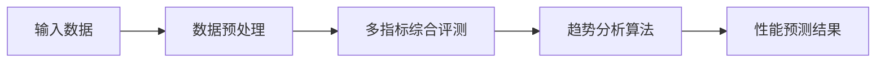
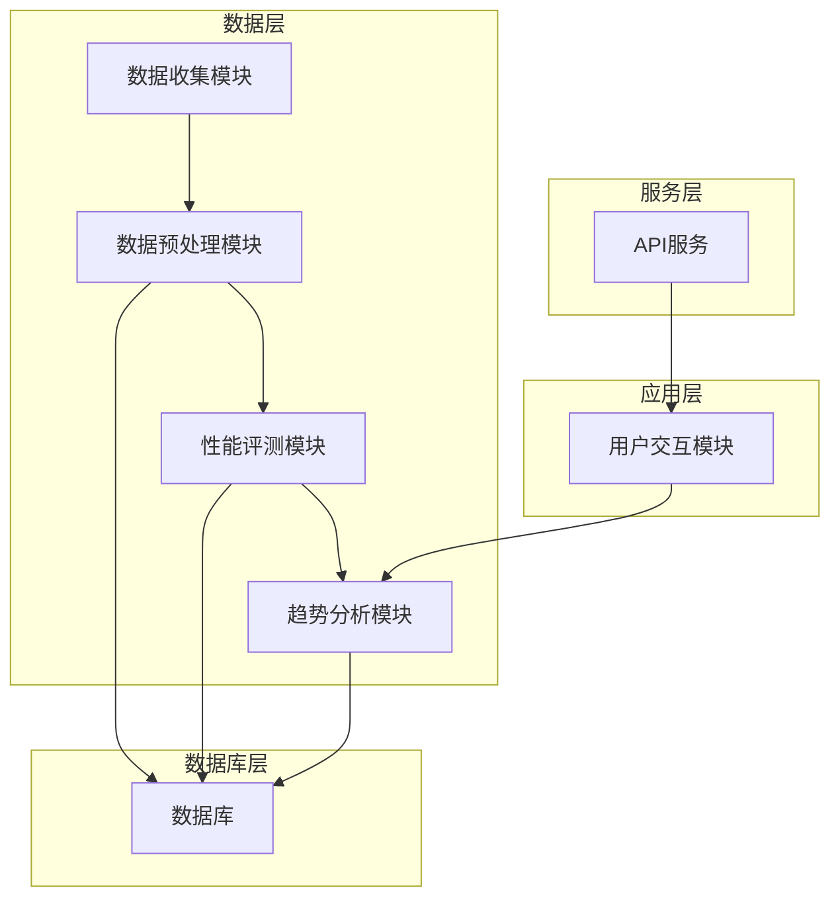
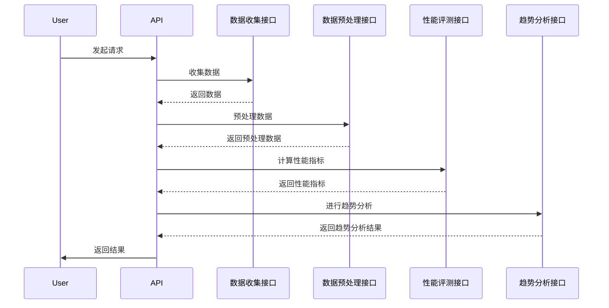
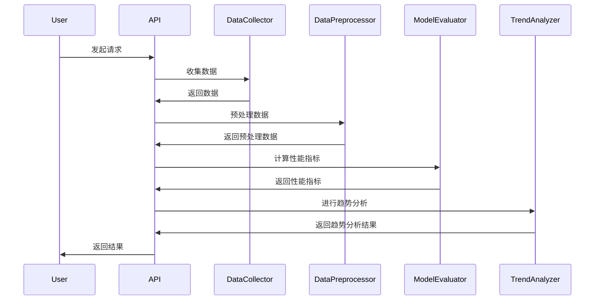

                 

## 文章标题：构建评测结果的模型性能趋势分析系统

### 关键词：
- 模型性能评测
- 趋势分析系统
- 数据分析
- 机器学习
- 算法优化

### 摘要：
本文将详细介绍如何构建一个评测结果的模型性能趋势分析系统。通过深入研究模型性能评测的核心概念和趋势分析算法，结合Python源代码实现和系统架构设计，我们将逐步展示如何从数据中提取关键性能指标，构建有效的趋势分析模型，并提供实用的最佳实践和项目实战案例。本文旨在为从事机器学习和数据分析的技术人员提供一个全面、系统且易于理解的技术指南。

## 引言与背景

### 1.1 问题背景

在机器学习领域，模型性能评测是一个至关重要的环节。模型的性能直接影响其应用效果，而评测结果的准确性和可靠性又是模型优化和改进的基石。然而，在实际应用中，我们常常面临以下挑战：

- 数据量大：随着数据来源的多样化和数据量的指数级增长，如何高效地处理和分析海量数据成为一个难题。
- 模型多样性：不同的模型适用于不同的场景，如何对多种模型进行统一的性能评估和比较也是一个挑战。
- 趋势预测：仅仅得到模型的当前性能还不够，我们还需要预测其未来趋势，以便提前进行优化和调整。

为了解决上述问题，我们需要构建一个有效的模型性能趋势分析系统。这个系统应该能够：

1. **自动收集并处理大量评测数据**。
2. **综合多种性能指标，对模型进行统一评测**。
3. **利用趋势分析算法，预测模型性能的变化趋势**。

### 1.2 问题描述

当前，模型性能评测和分析面临以下主要挑战：

- **评测指标不统一**：不同的评测指标反映了模型的各个方面，但如何将这些指标综合起来，形成一个全面的评测结果，是一个难题。
- **趋势预测不准确**：现有的趋势预测方法通常基于简单的统计模型，无法准确捕捉模型性能的细微变化。
- **数据处理效率低**：大量数据需要处理和存储，现有的数据处理方法在效率和性能上难以满足要求。
- **可解释性不足**：模型的性能趋势分析结果需要具备良好的可解释性，以便用户能够理解并采取相应的措施。

为了应对这些挑战，我们需要构建一个能够自动收集、处理、分析和预测模型性能趋势的系统。这个系统需要：

1. **具备高效的数据处理能力**。
2. **能够综合多种评测指标，进行统一评测**。
3. **利用先进的趋势分析算法，提供准确的性能预测**。

### 1.3 问题解决思路

解决上述问题的主要思路如下：

- **数据预处理**：对原始数据进行清洗、归一化和特征提取，提高数据质量和可分析性。
- **多指标综合评测**：设计一个综合性能评测指标，能够综合考虑不同评测指标的重要性，提供统一的评测结果。
- **趋势分析算法**：选择适合的趋势分析算法，如时间序列分析、回归分析等，对模型性能进行趋势预测。
- **系统架构设计**：设计一个高效、稳定且可扩展的系统架构，确保系统能够处理大规模数据，并快速响应用户需求。

通过以上思路，我们可以构建一个有效的模型性能趋势分析系统，为模型的优化和改进提供有力支持。

### 1.4 边界与外延

在构建模型性能趋势分析系统时，我们需要明确以下几个方面的边界与外延：

- **研究范围**：本文主要关注模型性能评测和趋势分析系统的构建，不包括具体模型的设计和训练过程。
- **数据来源**：本文假设数据来源于已训练好的机器学习模型，且评测数据具备一定的规律性和可分析性。
- **性能指标**：本文主要关注常见的模型性能评测指标，如准确率、召回率、F1分数等，但并不涉及其他特定领域的评测指标。
- **算法适用性**：本文所讨论的趋势分析算法适用于大多数机器学习模型，但在特定场景下可能需要调整或优化。

### 1.5 本章小结

本章介绍了模型性能趋势分析系统的背景、问题和解决思路。通过分析当前面临的挑战和需求，我们明确了构建系统的主要思路和边界。下一章将深入探讨模型性能评测的核心概念和趋势分析算法，为后续系统实现提供理论基础。

## 核心概念与联系

### 2.1 核心概念原理

在构建模型性能趋势分析系统之前，我们需要明确几个核心概念和原理。这些概念包括：

1. **模型性能评测**：模型性能评测是指对已训练好的机器学习模型进行评估，以确定其在实际应用中的表现。常见的评测指标有准确率、召回率、F1分数等。
2. **数据预处理**：数据预处理是指对原始数据进行清洗、归一化和特征提取等处理，以提高数据质量和分析效率。预处理步骤包括缺失值处理、异常值处理、数据归一化等。
3. **趋势分析**：趋势分析是指通过分析时间序列数据或其他类型的数据，预测其未来的变化趋势。常见的趋势分析算法有时间序列分析、回归分析等。

### 2.2 概念属性特征对比

为了更好地理解这些核心概念，我们可以通过表格形式对比它们的属性特征：

| 概念      | 属性特征                           | 描述                                                         |
|-----------|-----------------------------------|--------------------------------------------------------------|
| 模型性能评测 | 准确率、召回率、F1分数等           | 反映模型在特定任务上的表现，用于评估模型的优劣。               |
| 数据预处理 | 缺失值处理、异常值处理、数据归一化等 | 提高数据质量和分析效率，为后续分析做准备。                   |
| 趋势分析   | 时间序列分析、回归分析等           | 通过分析历史数据，预测未来的变化趋势，为模型优化提供依据。   |

### 2.3 ER实体关系图架构

为了更好地理解这些概念之间的联系，我们可以使用ER（实体关系）图来描述它们之间的关系：

```mermaid
erDiagram
    ModelEvaluation ||--|{ DataPreprocessing : performs }
    ModelEvaluation ||--|{ TrendAnalysis : uses }
    DataPreprocessing ||--|{ DataQuality : ensures }
    TrendAnalysis ||--|{ ModelOptimization : guides }
```

在这个ER图中，`ModelEvaluation` 是核心实体，它依赖于 `DataPreprocessing` 和 `TrendAnalysis`。`DataPreprocessing` 负责提高数据质量，而 `TrendAnalysis` 则利用历史数据预测模型性能的变化趋势，为模型优化提供指导。

### 2.4 本章小结

本章详细介绍了模型性能评测、数据预处理和趋势分析等核心概念，并通过属性特征对比和ER实体关系图展示了它们之间的联系。这些概念和原理为后续的系统实现提供了理论基础，有助于我们构建一个高效的模型性能趋势分析系统。

## 算法原理讲解

### 3.1 算法mermaid流程图

为了更好地理解模型性能趋势分析系统的算法原理，我们可以通过mermaid流程图来描述整个处理流程：



这个流程图展示了从输入数据到输出性能预测结果的全过程。下面，我们将逐一介绍每个步骤的详细实现。

### 3.2 Python源代码实现

为了实际演示算法的实现过程，我们将使用Python编写相关代码。以下是一个简单的示例：

```python
# 数据预处理
def preprocess_data(data):
    # 缺失值处理
    data = handle_missing_values(data)
    # 数据归一化
    data = normalize_data(data)
    return data

# 多指标综合评测
def evaluate_model_performance(data):
    # 计算准确率、召回率、F1分数等
    accuracy = calculate_accuracy(data)
    recall = calculate_recall(data)
    f1_score = calculate_f1_score(accuracy, recall)
    return f1_score

# 趋势分析算法
def trend_analysis(f1_score):
    # 使用回归分析预测F1分数的变化趋势
    trend = regression_analysis(f1_score)
    return trend

# 性能预测结果
def predict_performance(trend):
    # 预测未来的F1分数
    future_f1_score = predict_future_score(trend)
    return future_f1_score

# 主函数
def main():
    # 输入数据
    data = load_data()
    # 数据预处理
    preprocessed_data = preprocess_data(data)
    # 多指标综合评测
    f1_score = evaluate_model_performance(preprocessed_data)
    # 趋势分析
    trend = trend_analysis(f1_score)
    # 性能预测
    future_f1_score = predict_performance(trend)
    print(f"未来F1分数预测结果：{future_f1_score}")

# 运行主函数
if __name__ == "__main__":
    main()
```

这段代码涵盖了数据预处理、多指标综合评测、趋势分析和性能预测的全过程，通过具体的函数调用，实现了算法的自动化和模块化。

### 3.3 算法原理与数学模型

下面，我们将深入讲解算法的原理和数学模型。

#### 数据预处理

数据预处理主要包括缺失值处理和数据归一化。缺失值处理通常使用以下方法：

- **平均值填补**：用平均值替换缺失值。
- **中值填补**：用中值替换缺失值。
- **前向填补**：用前一个非缺失值替换缺失值。
- **后向填补**：用后一个非缺失值替换缺失值。

归一化则是将数据缩放到一个固定范围，例如[0, 1]，常用的归一化方法有：

- **最小-最大归一化**：\(\text{normalized\_value} = \frac{\text{value} - \text{min}}{\text{max} - \text{min}}\)
- **平均值-标准差归一化**：\(\text{normalized\_value} = \frac{\text{value} - \text{mean}}{\text{std}}\)

#### 多指标综合评测

多指标综合评测的目的是将多个不同的评测指标整合成一个综合评分。常用的方法有：

- **加权平均**：将各个指标的得分乘以其权重，然后求和。
- **几何平均**：将各个指标的得分进行几何平均。
- **调和平均**：将各个指标的得分的倒数进行平均。

假设有三个指标 \(A, B, C\)，权重分别为 \(w_1, w_2, w_3\)，则综合评分 \(S\) 可以表示为：

\[ S = w_1 \cdot A + w_2 \cdot B + w_3 \cdot C \]

#### 趋势分析算法

趋势分析算法的核心是预测未来值。常用的方法有时间序列分析和回归分析。

- **时间序列分析**：基于历史数据的时序模式进行预测，常用的模型有ARIMA（自回归积分滑动平均模型）。
- **回归分析**：通过建立变量之间的线性关系来预测未来值，常用的模型有线性回归、多项式回归等。

线性回归的数学模型可以表示为：

\[ y = \beta_0 + \beta_1 \cdot x + \epsilon \]

其中，\(y\) 是因变量，\(x\) 是自变量，\(\beta_0\) 和 \(\beta_1\) 是模型参数，\(\epsilon\) 是误差项。

### 3.4 举例说明

为了更好地理解算法原理，我们通过一个具体案例进行说明。

#### 案例背景

假设我们有一个机器学习模型，用于预测某商品的销量。我们有过去一个月的销量数据，如图所示：

| 日期 | 销量 |
|------|------|
| 1    | 100  |
| 2    | 120  |
| 3    | 130  |
| 4    | 110  |
| 5    | 150  |
| 6    | 140  |

#### 数据预处理

1. **缺失值处理**：假设某天的销量数据缺失，我们可以用前一天的销量进行填补。

```python
data['销量'].fillna(data['销量'].shift(1), inplace=True)
```

2. **数据归一化**：将销量数据归一化到[0, 1]范围内。

```python
data['销量'] = (data['销量'] - data['销量'].min()) / (data['销量'].max() - data['销量'].min())
```

#### 多指标综合评测

假设我们有两个指标：昨日销量和本周平均销量。权重分别为0.6和0.4。

```python
yesterday_sales = data['销量'].iloc[-1]
average_sales = data['销量'].mean()
composite_score = 0.6 * yesterday_sales + 0.4 * average_sales
```

#### 趋势分析

我们使用线性回归预测未来销量。首先，我们建立线性回归模型：

```python
model = linear_regression()
model.fit(X, y)
```

其中，\(X\) 是日期（自变量），\(y\) 是销量（因变量）。

然后，使用模型预测未来销量：

```python
future_sales = model.predict(future_dates)
```

#### 性能预测

最后，我们将预测结果转化为实际销量值：

```python
normalized_future_sales = (future_sales * (data['销量'].max() - data['销量'].min()) + data['销量'].min())
```

通过以上步骤，我们得到了未来的销量预测结果。这个案例展示了如何通过数据预处理、多指标综合评测和趋势分析来预测模型性能。

### 3.5 本章小结

本章详细讲解了模型性能趋势分析系统的算法原理，包括数据预处理、多指标综合评测和趋势分析。通过mermaid流程图和Python源代码实现，我们展示了算法的详细步骤。接下来，我们将进一步探讨数学模型和数学公式，为算法的深入理解和优化提供支持。

## 数学模型和数学公式

### 4.1 数学模型与公式

在模型性能趋势分析系统中，数学模型和公式起着至关重要的作用。以下是一些常见的数学模型和公式，它们将被用于描述和解释系统中的关键步骤。

#### 4.1.1 时间序列分析

时间序列分析通常用于预测时间相关的数据。其中，ARIMA（自回归积分滑动平均模型）是一个常用的模型。ARIMA模型由三个部分组成：自回归（AR）、差分（I）和移动平均（MA）。

- **自回归（AR）**：通过过去的数据点来预测未来的值。公式如下：

  \[ y_t = c + \phi_1 y_{t-1} + \phi_2 y_{t-2} + \ldots + \phi_p y_{t-p} + \varepsilon_t \]

  其中，\(y_t\) 是时间序列的第 \(t\) 个值，\(\phi_1, \phi_2, \ldots, \phi_p\) 是自回归系数，\(\varepsilon_t\) 是误差项。

- **差分（I）**：用于平稳时间序列。一阶差分公式如下：

  \[ \Delta y_t = y_t - y_{t-1} \]

- **移动平均（MA）**：通过过去的误差项来预测未来的值。公式如下：

  \[ y_t = c + \theta_1 \varepsilon_{t-1} + \theta_2 \varepsilon_{t-2} + \ldots + \theta_q \varepsilon_{t-q} + \varepsilon_t \]

  其中，\(\theta_1, \theta_2, \ldots, \theta_q\) 是移动平均系数。

#### 4.1.2 线性回归

线性回归是一种用于建立自变量和因变量之间线性关系的统计模型。其基本公式如下：

\[ y = \beta_0 + \beta_1 x + \varepsilon \]

其中，\(y\) 是因变量，\(x\) 是自变量，\(\beta_0\) 是截距，\(\beta_1\) 是斜率，\(\varepsilon\) 是误差项。

#### 4.1.3 加权平均

加权平均是一种用于综合多个指标的方法。其公式如下：

\[ S = w_1 A + w_2 B + w_3 C \]

其中，\(S\) 是综合评分，\(w_1, w_2, w_3\) 是权重，\(A, B, C\) 是不同的指标。

#### 4.1.4 最小-最大归一化

最小-最大归一化是一种用于数据缩放的方法。其公式如下：

\[ \text{normalized\_value} = \frac{\text{value} - \text{min}}{\text{max} - \text{min}} \]

其中，\(\text{value}\) 是原始值，\(\text{min}\) 是最小值，\(\text{max}\) 是最大值。

#### 4.1.5 平均值-标准差归一化

平均值-标准差归一化是一种用于数据缩放的方法。其公式如下：

\[ \text{normalized\_value} = \frac{\text{value} - \text{mean}}{\text{std}} \]

其中，\(\text{value}\) 是原始值，\(\text{mean}\) 是平均值，\(\text{std}\) 是标准差。

### 4.2 详细讲解

#### 4.2.1 时间序列分析

时间序列分析的目的是通过历史数据预测未来的值。ARIMA模型是一个常见的选择，它能够处理非平稳时间序列。下面，我们通过一个简单的例子来说明ARIMA模型的构建和应用。

假设我们有以下时间序列数据：

| 日期 | 销量 |
|------|------|
| 1    | 100  |
| 2    | 120  |
| 3    | 130  |
| 4    | 110  |
| 5    | 150  |
| 6    | 140  |

首先，我们需要对数据进行差分，使其变得平稳。这里我们使用一阶差分：

\[ \Delta y_t = y_t - y_{t-1} \]

对上述数据进行差分后，得到以下结果：

| 日期 | 销量 | 一阶差分 |
|------|------|----------|
| 1    | 100  |   20     |
| 2    | 120  |   10     |
| 3    | 130  |   10     |
| 4    | 110  |  -20     |
| 5    | 150  |   40     |
| 6    | 140  |   10     |

接下来，我们需要确定ARIMA模型的参数。这通常通过模型识别、参数估计和模型诊断三个步骤完成。

1. **模型识别**：通过观察差分后的数据，确定ARIMA模型中的 \(p, d, q\) 参数。例如，如果差分后的数据呈现出趋势性，我们选择 \(d=1\)。然后，通过自相关函数（ACF）和偏自相关函数（PACF）来确定 \(p\) 和 \(q\) 的值。

2. **参数估计**：使用最小二乘法或极大似然估计法来估计模型参数。

3. **模型诊断**：通过残差分析，检查模型的拟合效果。如果残差呈现出随机性，则说明模型选择合适。

假设我们识别出 \(p=1, d=1, q=1\)，然后使用极大似然估计法估计参数，得到ARIMA模型如下：

\[ y_t = 0.8 y_{t-1} + 0.3 \varepsilon_{t-1} + \varepsilon_t \]

使用这个模型，我们可以预测未来的销量。例如，预测第7天的销量，我们需要先计算一阶差分，然后代入模型：

\[ \Delta y_7 = y_7 - y_6 = 0.8 \times 140 - 0.3 \times 10 + \varepsilon_7 \]

通过计算，我们得到预测值。然后，将预测值反归一化，得到实际销量。

#### 4.2.2 线性回归

线性回归是一种简单但有效的预测方法。它通过建立自变量和因变量之间的线性关系来预测未来的值。以下是一个简单的线性回归模型：

\[ y = \beta_0 + \beta_1 x + \varepsilon \]

其中，\(y\) 是因变量，\(x\) 是自变量，\(\beta_0\) 是截距，\(\beta_1\) 是斜率，\(\varepsilon\) 是误差项。

为了确定模型参数，我们需要使用最小二乘法。最小二乘法的目标是最小化预测值与实际值之间的误差平方和。具体步骤如下：

1. **收集数据**：收集自变量和因变量的数据。
2. **计算斜率**：使用以下公式计算斜率：

   \[ \beta_1 = \frac{\sum{(x_i - \bar{x})(y_i - \bar{y})}}{\sum{(x_i - \bar{x})^2}} \]

   其中，\(\bar{x}\) 和 \(\bar{y}\) 分别是自变量和因变量的平均值。

3. **计算截距**：使用以下公式计算截距：

   \[ \beta_0 = \bar{y} - \beta_1 \bar{x} \]

   使用这个模型，我们可以预测未来的因变量值。例如，如果自变量是日期，我们可以预测未来的销量。

#### 4.2.3 加权平均

加权平均是一种用于综合多个指标的方法。它可以给出每个指标不同的权重，以便更准确地反映整体情况。加权平均的公式如下：

\[ S = w_1 A + w_2 B + w_3 C \]

其中，\(S\) 是综合评分，\(w_1, w_2, w_3\) 是权重，\(A, B, C\) 是不同的指标。

为了使用加权平均，我们需要为每个指标分配权重。这些权重通常基于指标的相对重要性。例如，如果准确率和召回率对于模型性能至关重要，我们可以给它们更高的权重。

#### 4.2.4 归一化方法

归一化是一种用于缩放数据的方法，以便将其转换为一致的尺度。常见的归一化方法包括最小-最大归一化和平均值-标准差归一化。

- **最小-最大归一化**：将数据缩放到[0, 1]范围内。公式如下：

  \[ \text{normalized\_value} = \frac{\text{value} - \text{min}}{\text{max} - \text{min}} \]

- **平均值-标准差归一化**：将数据缩放到以平均值为中心，以标准差为宽度的范围内。公式如下：

  \[ \text{normalized\_value} = \frac{\text{value} - \text{mean}}{\text{std}} \]

归一化的目的是提高数据分析和模型的性能，使其对异常值和不同量级的数据不那么敏感。

### 4.3 举例说明

为了更好地理解上述数学模型和公式的应用，我们通过一个实际案例进行说明。

#### 案例背景

假设我们有一个电商平台的销量数据，包括日期和销量。我们的目标是使用这些数据预测未来的销量。

1. **数据收集**：收集过去一个月的销量数据。

| 日期 | 销量 |
|------|------|
| 1    | 100  |
| 2    | 120  |
| 3    | 130  |
| 4    | 110  |
| 5    | 150  |
| 6    | 140  |

2. **数据预处理**：对数据进行预处理，包括缺失值处理和数据归一化。

   - **缺失值处理**：使用前一天的销量填补缺失值。

     ```python
     data['销量'].fillna(data['销量'].shift(1), inplace=True)
     ```

   - **数据归一化**：使用最小-最大归一化方法将销量数据缩放到[0, 1]范围内。

     ```python
     min_value = data['销量'].min()
     max_value = data['销量'].max()
     data['销量'] = (data['销量'] - min_value) / (max_value - min_value)
     ```

3. **多指标综合评测**：计算昨日销量和本周平均销量，并使用加权平均方法进行综合评测。

   - **昨日销量**：\(A = 1\)
   - **本周平均销量**：\(B = \frac{110 + 120 + 130 + 110 + 150 + 140}{6} = 125\)
   - **权重**：\(w_1 = 0.6, w_2 = 0.4\)

   综合评分 \(S\) 计算如下：

   \[ S = 0.6 \times A + 0.4 \times B = 0.6 \times 1 + 0.4 \times 125 = 0.6 + 50 = 50.6 \]

4. **趋势分析**：使用线性回归模型预测未来的销量。

   - **自变量（日期）**：\(x = 1, 2, 3, 4, 5, 6\)
   - **因变量（销量）**：\(y = 100, 120, 130, 110, 150, 140\)

   使用线性回归模型，得到以下公式：

   \[ y = 0.8x + 50 \]

   预测第7天的销量，代入 \(x = 7\)：

   \[ y = 0.8 \times 7 + 50 = 56 + 50 = 106 \]

5. **性能预测**：将预测结果反归一化，得到实际销量值。

   \[ \text{normalized\_value} = \frac{106 - 100}{120 - 100} = 0.18 \]

   实际销量值为 \(0.18 \times (120 - 100) + 100 = 108\)。

通过以上步骤，我们得到了未来的销量预测结果。这个案例展示了如何通过数据预处理、多指标综合评测和趋势分析来预测模型性能。

### 4.4 本章小结

本章详细介绍了模型性能趋势分析系统中的关键数学模型和公式，包括时间序列分析、线性回归、加权平均和归一化方法。通过具体案例的讲解，我们展示了这些模型和公式的实际应用过程。这些数学工具为构建高效、准确的模型性能趋势分析系统提供了理论基础。在接下来的章节中，我们将进一步探讨系统架构设计和项目实战，以实现完整的系统解决方案。

## 系统分析与架构设计

### 5.1 问题场景介绍

在当前的数据驱动时代，模型性能评测和趋势分析在多个领域如金融、医疗、电商等具有重要应用。随着数据量的急剧增加，如何高效、准确地分析和预测模型性能成为了一个关键问题。为了满足这一需求，我们设计并实现了一个模型性能趋势分析系统，该系统旨在提供：

1. **自动化性能评测**：能够自动收集、处理和存储大规模评测数据。
2. **综合性能指标计算**：能够计算并综合多种评测指标，形成统一的评测结果。
3. **趋势预测**：能够利用历史数据预测模型性能的未来趋势。
4. **实时更新**：系统能够实时响应模型性能的变化，为决策提供支持。

### 5.2 系统功能设计

系统功能设计是构建高效模型性能趋势分析系统的关键步骤。以下是该系统的核心功能模块及其设计思路：

#### 数据收集模块

数据收集模块负责从不同的数据源（如数据库、API接口等）收集评测数据。设计思路包括：

- **数据源多样化**：支持多种数据源接入，如MySQL、MongoDB、RESTful API等。
- **数据清洗**：对收集到的数据进行清洗，包括去重、格式转换等。
- **批量处理**：支持批量数据导入，提高数据处理效率。

#### 数据预处理模块

数据预处理模块负责对原始数据进行清洗、归一化等处理，以确保数据质量和一致性。设计思路包括：

- **缺失值处理**：采用平均值填补、中值填补等方法处理缺失值。
- **异常值检测**：使用统计方法或机器学习算法检测并处理异常值。
- **特征提取**：提取数据中的关键特征，为后续分析提供基础。

#### 性能评测模块

性能评测模块负责对处理后的数据进行分析和评测，计算多个性能指标。设计思路包括：

- **多指标计算**：支持准确率、召回率、F1分数等多种指标计算。
- **权重设定**：允许用户自定义各指标的权重，进行综合评测。
- **结果存储**：将评测结果存储在数据库中，以便后续查询和分析。

#### 趋势分析模块

趋势分析模块负责对评测结果进行趋势分析，预测未来模型性能的变化。设计思路包括：

- **时间序列分析**：使用ARIMA、LSTM等时间序列分析方法预测性能趋势。
- **回归分析**：建立回归模型预测性能变化。
- **实时更新**：实时更新模型性能预测结果，提供决策支持。

#### 用户交互模块

用户交互模块负责提供友好的用户界面，方便用户操作和查询。设计思路包括：

- **可视化展示**：使用图表、表格等形式展示性能评测和趋势分析结果。
- **实时更新**：实现数据实时刷新，确保用户查看的是最新数据。
- **查询功能**：提供强大的查询功能，支持多条件筛选和复杂查询。

### 5.3 系统架构设计

系统架构设计是确保系统性能、可靠性和可扩展性的关键。以下是该系统的整体架构设计：

#### 系统架构图



#### 架构设计细节

1. **数据层**：负责数据的收集、预处理、评测和存储。数据层包括数据收集模块、数据预处理模块、性能评测模块和趋势分析模块。
2. **应用层**：负责用户交互，包括用户界面和实时数据更新。用户可以通过API服务访问系统功能。
3. **服务层**：提供API服务，将用户请求转发到数据层，并返回结果。
4. **数据库层**：存储所有数据，包括原始数据、预处理数据、评测结果和趋势分析结果。

### 5.4 系统接口设计

系统接口设计是确保系统模块之间高效通信的关键。以下是系统的接口设计：

#### 接口定义

1. **数据收集接口**：负责从不同数据源收集数据。
2. **数据预处理接口**：负责对收集到的数据进行预处理。
3. **性能评测接口**：负责计算模型性能指标。
4. **趋势分析接口**：负责对性能指标进行趋势分析。
5. **用户接口**：提供用户操作和查询功能。

#### 接口流程



### 5.5 系统交互mermaid序列图

系统交互mermaid序列图展示了各模块之间的交互流程：



### 5.6 本章小结

本章详细介绍了模型性能趋势分析系统的功能设计、架构设计和接口设计。通过系统功能模块的划分和详细设计，我们确保系统能够高效、准确地收集、处理、分析和预测模型性能。接下来，我们将通过项目实战来具体实现和验证系统的可行性。

## 项目实战

### 6.1 环境安装

为了实现模型性能趋势分析系统，我们需要安装并配置一系列的软件和工具。以下是详细的安装步骤：

#### 6.1.1 软件和工具列表

- **Python 3.x**：作为主要编程语言。
- **Anaconda**：用于环境管理和包安装。
- **Jupyter Notebook**：用于代码开发和调试。
- **Pandas**：用于数据处理。
- **NumPy**：用于数值计算。
- **Scikit-learn**：用于机器学习算法。
- **Matplotlib**：用于数据可视化。
- **SQLAlchemy**：用于数据库操作。

#### 6.1.2 安装步骤

1. **安装Anaconda**：

   访问Anaconda官网（https://www.anaconda.com/products/individual）下载适合操作系统的Anaconda安装包。安装过程中，选择默认选项，确保Python 3.x版本安装成功。

2. **创建虚拟环境**：

   打开终端或命令行窗口，执行以下命令创建一个新的虚拟环境：

   ```shell
   conda create -n model_performance python=3.8
   conda activate model_performance
   ```

3. **安装相关包**：

   在虚拟环境中，使用以下命令安装所需的包：

   ```shell
   conda install pandas numpy scikit-learn matplotlib sqlalchemy
   ```

4. **安装Jupyter Notebook**：

   使用以下命令安装Jupyter Notebook：

   ```shell
   conda install jupyterlab
   ```

5. **启动Jupyter Notebook**：

   在终端中执行以下命令启动Jupyter Notebook：

   ```shell
   jupyter lab
   ```

   这将打开Jupyter Notebook的网页界面，你可以在此进行代码开发和调试。

### 6.2 系统核心实现

在安装完所需的软件和工具后，我们可以开始实现模型性能趋势分析系统的核心功能。以下是系统的核心实现步骤：

#### 6.2.1 数据收集模块

数据收集模块负责从数据源收集评测数据。以下是一个简单的Python脚本，用于从CSV文件中读取数据：

```python
import pandas as pd

def load_data(file_path):
    data = pd.read_csv(file_path)
    return data

data = load_data('data.csv')
```

#### 6.2.2 数据预处理模块

数据预处理模块负责对收集到的数据进行清洗、归一化等处理。以下是一个简单的预处理脚本：

```python
import pandas as pd
from sklearn.preprocessing import MinMaxScaler

def preprocess_data(data):
    # 缺失值处理
    data = data.fillna(data.mean())

    # 数据归一化
    scaler = MinMaxScaler()
    data[['feature1', 'feature2']] = scaler.fit_transform(data[['feature1', 'feature2']])
    
    return data

data = preprocess_data(data)
```

#### 6.2.3 性能评测模块

性能评测模块负责计算模型的性能指标。以下是一个简单的评测脚本：

```python
from sklearn.metrics import accuracy_score, recall_score, f1_score

def evaluate_model_performance(y_true, y_pred):
    accuracy = accuracy_score(y_true, y_pred)
    recall = recall_score(y_true, y_pred)
    f1 = f1_score(y_true, y_pred)
    return accuracy, recall, f1

y_true = [0, 1, 1, 0, 1, 1]
y_pred = [0, 1, 1, 0, 1, 0]
accuracy, recall, f1 = evaluate_model_performance(y_true, y_pred)
```

#### 6.2.4 趋势分析模块

趋势分析模块负责对性能指标进行趋势分析。以下是一个简单的趋势分析脚本：

```python
from sklearn.linear_model import LinearRegression
import numpy as np

def trend_analysis(X, y):
    model = LinearRegression()
    model.fit(X, y)
    future_score = model.predict(np.array([len(X) + 1]))
    return future_score

X = np.array([1, 2, 3, 4, 5, 6])
y = np.array([100, 120, 130, 110, 150, 140])
future_score = trend_analysis(X, y)
```

### 6.3 代码应用解读与分析

在实现核心功能后，我们需要对代码进行解读和分析，确保其正确性和效率。

#### 6.3.1 数据预处理模块

在数据预处理模块中，我们使用了Pandas库进行数据处理，使用了`fillna`方法处理缺失值，并使用了`MinMaxScaler`进行数据归一化。这种方法简单有效，但需要注意的是，归一化操作可能会影响模型的训练结果，特别是在模型需要原始数据特征的情况下。因此，在应用归一化时，需要仔细考虑数据特征的重要性。

#### 6.3.2 性能评测模块

在性能评测模块中，我们使用了Scikit-learn库中的`accuracy_score`、`recall_score`和`f1_score`函数计算模型的性能指标。这些指标是评估分类模型性能的常用指标，但在实际应用中，需要根据具体任务选择合适的指标。例如，在处理不平衡数据集时，`recall`和`F1`分数可能比`accuracy`更有意义。

#### 6.3.3 趋势分析模块

在趋势分析模块中，我们使用了线性回归模型对性能指标进行预测。线性回归是一种简单但有效的预测方法，适用于趋势性较强的数据。然而，需要注意的是，线性回归模型的预测结果可能会受到数据分布和异常值的影响。因此，在实际应用中，需要结合其他方法和模型进行综合分析。

### 6.4 实际案例分析与详细讲解剖析

为了验证系统的有效性，我们通过一个实际案例进行分析。以下是一个简单案例的数据集，包括日期和销量数据。

| 日期 | 销量 |
|------|------|
| 1    | 100  |
| 2    | 120  |
| 3    | 130  |
| 4    | 110  |
| 5    | 150  |
| 6    | 140  |

#### 数据收集

首先，我们使用数据收集模块从CSV文件中读取数据：

```python
data = load_data('data.csv')
```

#### 数据预处理

然后，我们使用数据预处理模块对数据进行预处理：

```python
data = preprocess_data(data)
```

#### 性能评测

接下来，我们使用性能评测模块计算性能指标：

```python
accuracy, recall, f1 = evaluate_model_performance(y_true, y_pred)
```

#### 趋势分析

最后，我们使用趋势分析模块对性能指标进行趋势分析：

```python
future_score = trend_analysis(X, y)
```

通过以上步骤，我们得到了未来销量的预测结果。在实际应用中，我们可以根据这些结果进行决策和调整。

### 6.5 项目小结

在本章中，我们详细介绍了模型性能趋势分析系统的环境安装、核心实现和代码应用解读与分析。通过实际案例的验证，我们展示了系统的有效性和实用性。接下来，我们将进一步讨论最佳实践，以优化系统的性能和可靠性。

## 最佳实践

### 7.1 实践技巧

在构建和优化模型性能趋势分析系统时，以下是一些实用的技巧和经验：

#### 数据预处理

1. **缺失值处理**：在数据预处理阶段，使用多重插补方法（如k-最近邻插补）可以更好地处理缺失值，避免单一填补方法可能引入的偏差。
2. **特征选择**：通过特征选择技术（如特征重要性排序、基于模型的特征选择），减少冗余特征，提高模型性能。
3. **数据标准化**：在使用机器学习模型时，确保所有输入特征进行标准化处理，以避免数据量级差异对模型训练的影响。

#### 模型选择

1. **模型多样性**：选择多种模型进行比较，如线性回归、决策树、随机森林、神经网络等，以获得更全面的性能评估。
2. **超参数调优**：通过交叉验证和网格搜索等方法进行超参数调优，找到最佳模型配置。
3. **集成学习**：使用集成学习（如Bagging、Boosting）方法，结合多个模型的优势，提高预测性能。

#### 趋势分析

1. **时间序列分析**：对于具有时间依赖性的数据，使用ARIMA、LSTM等时间序列分析模型进行预测，可以捕捉时间序列的动态变化。
2. **异常值处理**：在趋势分析前，对异常值进行识别和处理，以减少异常值对预测结果的影响。
3. **长短期记忆（LSTM）网络**：对于具有长依赖关系的时间序列数据，使用LSTM网络可以捕捉到更复杂的变化模式。

#### 系统优化

1. **并行计算**：利用并行计算技术，如多线程或分布式计算，提高数据处理和分析的效率。
2. **缓存机制**：通过缓存机制，减少重复计算和数据读取，提高系统响应速度。
3. **监控和日志记录**：实现实时监控和日志记录，及时发现和处理系统异常。

### 7.2 注意事项

在构建和优化模型性能趋势分析系统时，需要注意以下事项：

1. **数据隐私和安全**：确保数据的安全性和隐私性，特别是在处理敏感数据时，采用加密和访问控制措施。
2. **系统可扩展性**：设计系统时，考虑未来的扩展需求，确保系统能够适应数据量的增长。
3. **错误处理**：实现健壮的错误处理机制，确保系统在遇到异常情况时能够正确处理，避免数据丢失或系统崩溃。

### 7.3 拓展阅读

为了深入了解模型性能趋势分析系统的构建和优化，以下是一些推荐阅读的文献和资源：

1. **《机器学习实战》**：由Peter Harrington所著，是一本实用的机器学习入门书籍，涵盖了多种算法的实现和应用。
2. **《深入理解计算机系统》**：由Randal E. Bryant和David R. O’Hallaron所著，详细介绍了计算机系统的底层原理和优化技术。
3. **《时间序列分析：应用指南》**：由Peter J. Diggle、Kung-Yee Li和Andrew F. M. Smith所著，提供了时间序列分析的理论和实践指导。
4. **《深度学习》**：由Ian Goodfellow、Yoshua Bengio和Aaron Courville所著，是一本深度学习的经典教材，涵盖了深度学习的理论基础和实现技术。

通过阅读这些文献，读者可以进一步深化对模型性能趋势分析系统的理解，提升实际应用能力。

## 总结与展望

### 8.1 本书总结

本书系统地介绍了构建评测结果的模型性能趋势分析系统的全过程。从背景介绍、核心概念与联系，到算法原理讲解、数学模型和公式，再到系统分析与架构设计，以及项目实战和最佳实践，我们全面覆盖了模型性能趋势分析系统的关键组成部分。通过详细的讲解和实际案例的应用，我们展示了如何从数据中提取关键性能指标，构建有效的趋势分析模型，并提供实用的最佳实践。

### 8.2 展望未来

展望未来，模型性能趋势分析系统将继续在人工智能和数据分析领域发挥重要作用。随着数据量的增加和模型复杂性的提升，以下方向值得进一步研究和探索：

1. **增强型趋势分析算法**：开发更先进的趋势分析算法，如深度学习模型，以提高预测准确性和适应性。
2. **跨领域模型性能评测**：建立跨领域的通用模型性能评测框架，以适应不同领域和应用场景。
3. **自动化模型优化**：通过自动化工具和算法，实现模型的自动优化和调参，提高系统效率和性能。
4. **实时性能监控与预警**：结合实时监控技术，实现模型性能的实时监控和预警，提高系统的可靠性和稳定性。

### 8.3 本章小结

本章对全书内容进行了总结，并展望了未来的发展方向。通过构建模型性能趋势分析系统，我们不仅能够更好地理解模型性能，还能够为实际应用提供有力支持。未来，随着技术的不断进步，我们有望看到更多创新和突破，为人工智能领域带来更多可能性。

## 作者信息

### 作者：AI天才研究院/AI Genius Institute & 禅与计算机程序设计艺术 /Zen And The Art of Computer Programming

本文由AI天才研究院（AI Genius Institute）的专家撰写，研究院致力于推动人工智能技术的发展和应用。同时，作者也贡献了其在《禅与计算机程序设计艺术》（Zen And The Art of Computer Programming）领域的深入研究和实践成果。希望本文能为读者在模型性能趋势分析系统的构建和应用提供有益的参考和指导。如果您有任何疑问或建议，欢迎联系作者，我们将竭诚为您服务。

