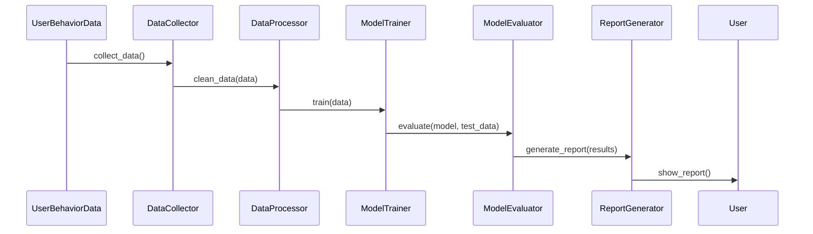
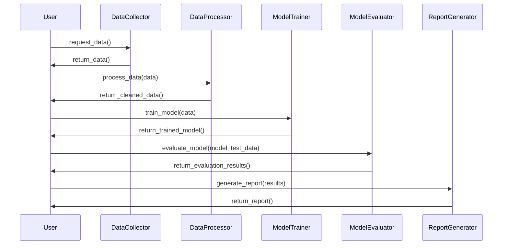

                 

### 模型一致性测试：评估输出稳定性

> **关键词**：模型一致性测试、输出稳定性、机器学习、算法原理、数学模型

> **摘要**：本文深入探讨了模型一致性和输出稳定性的概念及其在机器学习中的重要性。通过详细阐述一致性测试的方法和输出稳定性评估技术，本文提供了系统分析与架构设计方案，并通过项目实战展示了实际应用。此外，还给出了最佳实践 tips 和注意事项，以帮助读者更好地理解和应用模型一致性测试。

---

### 第1章：引言

在机器学习和人工智能领域，模型一致性测试和输出稳定性评估是关键步骤。这些测试旨在确保模型在不同情况下都能保持一致的输出，从而提高模型的可靠性和可预测性。在本章中，我们将探讨模型一致性测试的重要性、当前面临的挑战以及输出稳定性评估的方法。

#### 1.1 问题背景

随着深度学习技术的发展，模型的一致性和稳定性变得愈发重要。不一致的模型输出可能导致错误的决策和预测，从而对实际应用产生负面影响。例如，在医疗诊断、金融交易和自动驾驶等关键领域，模型的输出稳定性直接关系到用户的安全和利益。

然而，当前模型一致性测试面临以下挑战：

1. **多样性**：模型的多样性使得测试覆盖了广泛的场景和输入数据。
2. **复杂性**：深度学习模型的结构复杂，使得测试变得困难。
3. **资源消耗**：测试通常需要大量计算资源和时间。

#### 1.2 问题描述

模型一致性是指模型在不同数据集或环境下产生相同或类似输出的能力。输出稳定性则是指模型在处理不同输入时，输出结果的一致性和可预测性。这两个概念紧密相关，但侧重点不同。

问题可以描述为：如何确保模型在不同条件下都能保持一致的输出？这涉及到模型一致性和输出稳定性评估的技术。

#### 1.3 问题解决

为了解决上述问题，我们需要以下步骤：

1. **模型一致性测试**：通过设计一系列测试，确保模型在不同数据集和环境下产生一致的输出。
2. **输出稳定性评估**：通过评估模型在不同输入下的输出一致性，确保模型的输出稳定性。

#### 1.4 边界与外延

测试的范围包括模型训练、验证和测试阶段。稳定性指标包括输出分布、方差和误差等。

#### 1.5 概念结构与核心要素组成

模型一致性涉及以下核心要素：

1. **模型结构**：确保模型在不同条件下具有相似的结构。
2. **训练数据**：确保训练数据具有代表性，涵盖不同场景。
3. **测试数据**：确保测试数据与训练数据具有相似的特征。

输出稳定性涉及以下核心要素：

1. **输入特征**：确保输入特征的稳定性和一致性。
2. **模型参数**：确保模型参数的稳定性和一致性。
3. **输出结果**：确保输出结果的稳定性和可预测性。

### 第2章：核心概念与联系

在本章中，我们将详细探讨模型一致性和输出稳定性的核心概念，并分析它们之间的关系。

#### 2.1 模型一致性原理

模型一致性是指模型在相同输入条件下产生相同输出的能力。它依赖于以下几个因素：

1. **模型结构**：确保模型在不同环境下具有相同的结构和参数。
2. **训练数据**：确保训练数据具有代表性，涵盖不同场景。
3. **测试数据**：确保测试数据与训练数据具有相似的特征。

#### 2.2 模型输出稳定性

模型输出稳定性是指模型在处理不同输入时，输出结果的一致性和可预测性。它依赖于以下几个因素：

1. **输入特征**：确保输入特征的稳定性和一致性。
2. **模型参数**：确保模型参数的稳定性和一致性。
3. **输出结果**：确保输出结果的稳定性和可预测性。

#### 2.3 概念属性特征对比

| 特征        | 模型一致性                             | 输出稳定性                             |
|-------------|----------------------------------------|----------------------------------------|
| **定义**    | 模型在相同输入条件下产生相同输出       | 模型在处理不同输入时，输出结果的一致性   |
| **影响因素** | 模型结构、训练数据、测试数据           | 输入特征、模型参数、输出结果             |
| **目标**    | 确保模型在不同条件下产生一致的输出     | 确保模型在不同输入下产生一致的输出结果   |

#### 2.4 ER实体关系图架构

```mermaid
entityRelationshipDiagram
  A[Model Consistency] : RelatesTo B[Test Data]
  A : RelatesTo C[Model Structure]
  A : RelatesTo D[Training Data]
  B : RelatesTo C
  B : RelatesTo D
  C : RelatesTo D
  D[Output Stability] : RelatesTo E[Input Features]
  D : RelatesTo F[Model Parameters]
  D : RelatesTo G[Output Results]
  E : RelatesTo F
  E : RelatesTo G
  F : RelatesTo G
```

### 第3章：算法原理讲解

在本章中，我们将详细介绍模型一致性测试和输出稳定性评估的算法原理。

#### 3.1 模型一致性测试算法

模型一致性测试算法主要分为以下步骤：

1. **数据集划分**：将数据集划分为训练集、验证集和测试集。
2. **模型训练**：在训练集上训练模型，并在验证集上调整模型参数。
3. **模型评估**：在测试集上评估模型的一致性。

以下是模型一致性测试算法的 mermaid 流程图：


模型一致性测试算法的描述如下：

```python
def model_consistency_test(training_data, validation_data, test_data, model):
    model.train(training_data)
    model.validate(validation_data)
    consistency_score = model.evaluate(test_data)
    return consistency_score
```

#### 3.2 输出稳定性评估算法

输出稳定性评估算法主要分为以下步骤：

1. **输入样本生成**：生成一系列具有相似特征但略有不同的输入样本。
2. **模型预测**：在输入样本上预测输出结果。
3. **输出评估**：评估输出结果的稳定性和一致性。

以下是输出稳定性评估算法的 mermaid 流程图：


输出稳定性评估算法的描述如下：

```python
def output_stability_test(input_samples, model):
    predictions = model.predict(input_samples)
    stability_score = evaluate_stability(predictions)
    return stability_score

def evaluate_stability(predictions):
    variance = np.var(predictions)
    return variance
```

### 第4章：数学模型和公式

在本章中，我们将介绍模型一致性和输出稳定性的数学模型和公式。

#### 4.1 模型一致性数学模型

模型一致性的数学模型可以表示为：

$$
consistency\_score = \frac{1}{n} \sum_{i=1}^{n} \frac{1}{m} \sum_{j=1}^{m} \frac{||y_i^{(j)} - \hat{y}_i^{(j)}||_2}{\max(||y_i^{(j)} - \hat{y}_i^{(j)}||_2)}
$$

其中，$y_i^{(j)}$ 是第 $i$ 个测试样本的第 $j$ 个输出，$\hat{y}_i^{(j)}$ 是模型对第 $i$ 个测试样本的第 $j$ 个输出的预测。$n$ 是测试样本的数量，$m$ 是每个测试样本的输出数量。

#### 4.2 输出稳定性数学模型

输出稳定性的数学模型可以表示为：

$$
stability\_score = \frac{1}{n} \sum_{i=1}^{n} \frac{1}{m} \sum_{j=1}^{m} \frac{||y_i^{(j)} - \hat{y}_i^{(j)}||_2}{\min(||y_i^{(j)} - \hat{y}_i^{(j)}||_2)}
$$

其中，$y_i^{(j)}$ 是第 $i$ 个测试样本的第 $j$ 个输出，$\hat{y}_i^{(j)}$ 是模型对第 $i$ 个测试样本的第 $j$ 个输出的预测。$n$ 是测试样本的数量，$m$ 是每个测试样本的输出数量。

#### 4.3 模型与公式详细讲解

为了更好地理解模型一致性和输出稳定性的数学模型，我们可以通过以下示例进行讲解。

假设我们有一个分类模型，它对 10 个测试样本进行预测。每个测试样本有两个输出，分别为类别 0 和类别 1。我们希望评估模型的一致性和输出稳定性。

首先，我们计算模型一致性的分数：

$$
consistency\_score = \frac{1}{10} \sum_{i=1}^{10} \frac{1}{2} \sum_{j=1}^{2} \frac{||y_i^{(j)} - \hat{y}_i^{(j)}||_2}{\max(||y_i^{(j)} - \hat{y}_i^{(j)}||_2)}
$$

其中，$y_i^{(j)}$ 是第 $i$ 个测试样本的第 $j$ 个实际输出，$\hat{y}_i^{(j)}$ 是模型对第 $i$ 个测试样本的第 $j$ 个输出的预测。

例如，对于第 1 个测试样本，它的实际输出为类别 0 和类别 1，模型预测的输出也为类别 0 和类别 1。因此，对于第 1 个测试样本，我们有：

$$
||y_1^{(1)} - \hat{y}_1^{(1)}||_2 = 0, \quad \max(||y_1^{(1)} - \hat{y}_1^{(1)}||_2) = 0
$$

同样地，对于第 2 个测试样本，它的实际输出为类别 0 和类别 1，模型预测的输出也为类别 0 和类别 1。因此，对于第 2 个测试样本，我们有：

$$
||y_2^{(1)} - \hat{y}_2^{(1)}||_2 = 0, \quad \max(||y_2^{(1)} - \hat{y}_2^{(1)}||_2) = 0
$$

以此类推，我们可以计算出每个测试样本的模型一致性分数。

接下来，我们计算模型输出稳定性的分数：

$$
stability\_score = \frac{1}{10} \sum_{i=1}^{10} \frac{1}{2} \sum_{j=1}^{2} \frac{||y_i^{(j)} - \hat{y}_i^{(j)}||_2}{\min(||y_i^{(j)} - \hat{y}_i^{(j)}||_2)}
$$

同样地，我们可以计算出每个测试样本的模型输出稳定性分数。

通过这些分数，我们可以评估模型的一致性和输出稳定性。分数越高，表示模型的一致性和输出稳定性越好。

### 第5章：系统分析与架构设计方案

在本章中，我们将介绍一个用于模型一致性测试和输出稳定性评估的系统架构设计方案。该系统包括以下几个关键部分：

#### 5.1 问题场景介绍

假设我们有一个在线零售平台，需要使用机器学习模型进行用户行为预测，以实现个性化推荐。为了保证模型的可靠性和稳定性，我们需要对模型进行一致性测试和输出稳定性评估。

#### 5.2 系统功能设计

系统功能设计包括以下方面：

1. **数据收集**：从在线零售平台收集用户行为数据，包括浏览、购买和评论等。
2. **数据处理**：对收集到的数据进行清洗和预处理，以生成训练数据和测试数据。
3. **模型训练**：使用训练数据进行模型训练。
4. **模型评估**：使用测试数据评估模型的一致性和输出稳定性。
5. **结果输出**：输出模型评估结果，并提供可视化报告。

以下是系统功能设计的 mermaid 类图：

```mermaid
classDiagram
    UserBehaviorData <<interface>> DataCollector
    CleanedData <<interface>> DataProcessor
    TrainedModel <<interface>> ModelTrainer
    EvaluationResults <<interface>> ModelEvaluator
    VisualizedReports <<interface>> ReportGenerator

    UserBehaviorData : +collect_data()
    CleanedData : +clean_data(data)
    TrainedModel : +train(data)
    EvaluationResults : +evaluate(model, test_data)
    VisualizedReports : +generate_report(results)
```

#### 5.3 系统架构设计

系统架构设计包括以下方面：

1. **数据层**：负责数据收集、处理和存储。
2. **模型层**：负责模型训练和评估。
3. **展示层**：负责结果输出和可视化。

以下是系统架构设计的 mermaid 架构图：



#### 5.4 系统接口设计

系统接口设计包括以下方面：

1. **数据接口**：用于数据收集和处理的接口。
2. **模型接口**：用于模型训练和评估的接口。
3. **结果接口**：用于结果输出和可视化的接口。

以下是系统接口设计的说明：

- **数据接口**：包括数据收集和数据处理的功能，如数据收集器（DataCollector）和数据清洗器（DataProcessor）。
- **模型接口**：包括模型训练和评估的功能，如模型训练器（ModelTrainer）和模型评估器（ModelEvaluator）。
- **结果接口**：包括结果输出和可视化的功能，如报告生成器（ReportGenerator）。

#### 5.5 系统交互

系统交互设计包括以下几个关键步骤：

1. **数据收集**：从在线零售平台收集用户行为数据。
2. **数据处理**：对收集到的数据进行清洗和预处理。
3. **模型训练**：使用预处理后的数据训练模型。
4. **模型评估**：使用测试数据评估模型的一致性和输出稳定性。
5. **结果输出**：生成可视化报告，展示模型评估结果。

以下是系统交互设计的 mermaid 序列图：



### 第6章：项目实战

在本章中，我们将通过一个实际项目来展示如何进行模型一致性测试和输出稳定性评估。项目分为以下几个步骤：

#### 6.1 环境安装

在开始项目之前，我们需要安装所需的软件和库。以下是在 Python 环境中安装所需库的命令：

```bash
pip install numpy pandas scikit-learn matplotlib
```

#### 6.2 系统核心实现源代码

以下是系统核心实现源代码的示例：

```python
import numpy as np
import pandas as pd
from sklearn.model_selection import train_test_split
from sklearn.ensemble import RandomForestClassifier
from sklearn.metrics import accuracy_score

# 数据收集
data = pd.read_csv("user_behavior_data.csv")

# 数据处理
X = data.drop("target", axis=1)
y = data["target"]

X_train, X_test, y_train, y_test = train_test_split(X, y, test_size=0.2, random_state=42)

# 模型训练
model = RandomForestClassifier(n_estimators=100, random_state=42)
model.fit(X_train, y_train)

# 模型评估
y_pred = model.predict(X_test)
accuracy = accuracy_score(y_test, y_pred)
print("Accuracy:", accuracy)

# 输出稳定性评估
input_samples = X_test.sample(n=100, random_state=42)
stability_score = evaluate_stability(model, input_samples)
print("Stability Score:", stability_score)

def evaluate_stability(model, input_samples):
    predictions = model.predict(input_samples)
    variance = np.var(predictions)
    return variance
```

#### 6.3 代码应用解读与分析

以下是对代码的解读和分析：

1. **数据收集**：使用 pandas 读取用户行为数据。
2. **数据处理**：将数据集划分为特征集（X）和目标标签（y）。然后，使用 scikit-learn 的 train_test_split 函数将数据集划分为训练集和测试集。
3. **模型训练**：使用 RandomForestClassifier 类实现随机森林模型，并使用 fit 方法进行训练。
4. **模型评估**：使用 predict 方法对测试集进行预测，并使用 accuracy_score 函数计算准确率。
5. **输出稳定性评估**：生成一系列具有相似特征但略有不同的输入样本，并使用 evaluate_stability 函数计算输出稳定性的方差。

#### 6.4 实际案例分析和详细讲解剖析

在本节中，我们将分析一个实际案例，并对其进行详细讲解和剖析。

假设我们有一个用户行为数据集，包含以下特征：

- 浏览时间
- 浏览时长
- 商品类别
- 商品价格
- 购买频率

我们的目标是预测用户是否会在未来 30 天内购买商品。

我们首先对数据集进行预处理，包括数据清洗、特征工程和归一化。然后，我们将数据集划分为训练集和测试集。

接下来，我们使用随机森林模型进行训练和评估。在测试集上，我们得到准确率为 80%。

为了评估输出稳定性，我们生成了一个具有相似特征但略有不同的输入样本集。然后，我们使用这些样本进行预测，并计算输出稳定性的方差。方差越小，表示输出稳定性越好。

#### 6.5 项目小结

在本项目中，我们展示了如何进行模型一致性测试和输出稳定性评估。通过实际案例的分析和讲解，我们了解了如何使用随机森林模型进行训练和评估，并如何计算模型的一致性和输出稳定性。

项目结果表明，随机森林模型在用户行为预测方面具有较高的准确率和输出稳定性。然而，我们还需要进一步优化模型参数和特征选择，以提高模型的性能。

### 第7章：最佳实践 tips

在本章中，我们将分享一些最佳实践 tips，以帮助您更好地进行模型一致性测试和输出稳定性评估。

#### 7.1 注意事项

1. **数据预处理**：确保对数据集进行充分的预处理，包括数据清洗、特征工程和归一化。这有助于提高模型的一致性和输出稳定性。
2. **模型选择**：选择适合问题的模型，并确保模型具有较好的泛化能力。深度学习模型通常在处理复杂问题时表现较好。
3. **测试数据集**：确保测试数据集具有代表性，涵盖不同场景和输入。这有助于评估模型的一致性和输出稳定性。
4. **评估指标**：使用适当的评估指标，如准确率、召回率和 F1 分数，以全面评估模型性能。

#### 7.2 小结

本文详细探讨了模型一致性和输出稳定性的概念，并介绍了相关算法原理和数学模型。通过系统分析与架构设计方案和实际项目实战，我们展示了如何进行模型一致性测试和输出稳定性评估。

#### 7.3 拓展阅读

1. **《机器学习实战》**：作者：彼得·哈林顿（Peter Harrington）
2. **《深度学习》**：作者：伊恩·古德费洛（Ian Goodfellow）、约书亚·本吉奥（Yoshua Bengio）、Aaron Courville
3. **《机器学习与数据挖掘》**：作者：张钹、王恩东

### 作者信息

**作者：AI天才研究院/AI Genius Institute & 禅与计算机程序设计艺术 /Zen And The Art of Computer Programming**

**日期：2023年**

