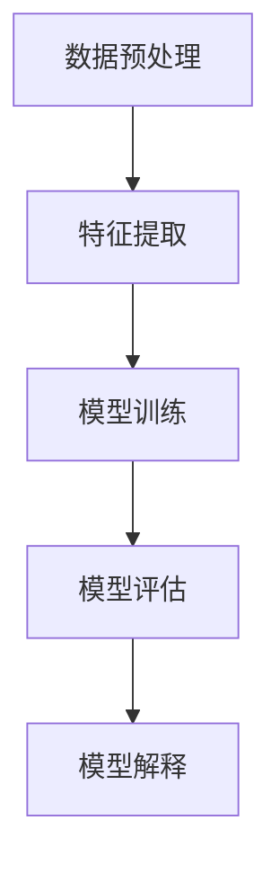
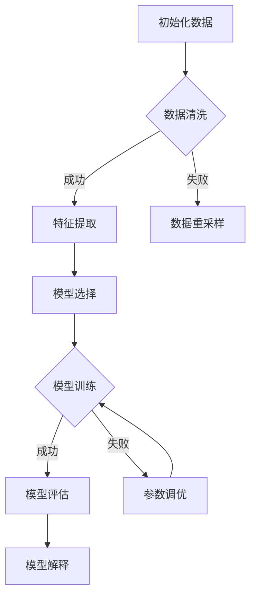
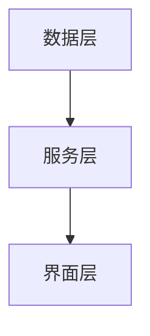
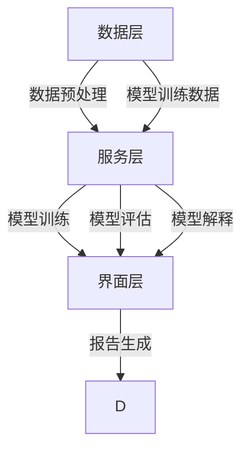
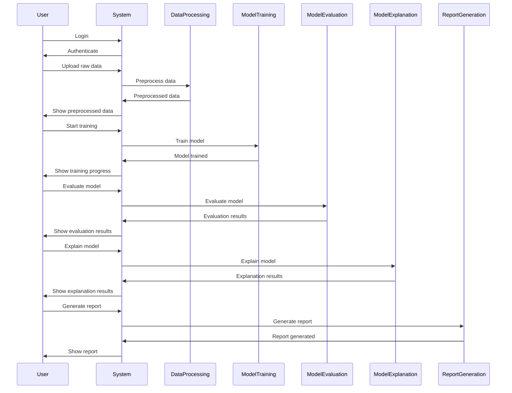

                 

### 模型可审核性测试：确保合规与透明

#### 关键词：
- 模型可审核性
- 合规性测试
- 透明度
- 审核算法
- 数学模型

#### 摘要：
本文深入探讨了模型可审核性测试的重要性，以及如何确保模型的合规性与透明度。通过详细的背景介绍、核心概念分析、算法原理讲解、数学模型阐述、系统架构设计以及实际项目实战，本文为读者提供了一个系统化的理解框架，帮助其在开发和应用过程中有效应对审核挑战，实现模型的合规与透明。

---

### 目录大纲

1. **背景介绍**
   - 模型可审核性的重要性
   - 模型审核的挑战与问题
   - 现有审核方法综述

2. **核心概念与联系**
   - 模型的定义与分类
   - 审核的定义与分类
   - 审核方法比较

3. **算法原理讲解**
   - 审核算法的数学模型
   - 算法流程图展示
   - 算法实现与解释

4. **数学模型和数学公式讲解**
   - 常用数学公式介绍
   - 数学公式在实际审核中的应用

5. **系统分析与架构设计方案**
   - 审核系统的设计原则
   - 审核系统的架构设计
   - 审核系统的接口设计和交互设计

6. **项目实战**
   - 审核系统的搭建与测试
   - 系统核心实现代码分析
   - 实际案例分析与讲解

7. **最佳实践 tips**
   - 审核过程中的注意事项
   - 提高模型可审核性的策略

8. **小结与拓展阅读**
   - 本书重点回顾
   - 拓展阅读推荐

---

### 第1章：模型可审核性的重要性

#### 1.1 背景介绍

模型可审核性是指模型在开发和部署过程中，能够接受第三方或用户审查，确保其透明度、公正性和合规性的能力。随着人工智能（AI）和机器学习（ML）技术的迅速发展，模型在各个领域得到了广泛应用，如金融、医疗、交通等。然而，模型的决策过程往往复杂且不透明，导致审核和解释变得困难。

#### 1.2 问题背景

模型的不透明性和不可解释性引发了一系列问题，包括模型偏见、歧视和法律法规的合规性。例如，在招聘系统中，如果模型因为历史数据的偏见而倾向于拒绝某些群体的申请，这将引发不公平和歧视的问题。此外，一些国家和地区对数据隐私和公平性有严格的法律法规要求，模型需满足这些要求，以确保合规性。

#### 1.3 问题描述

模型可审核性的主要问题包括：
- **模型决策不透明**：用户无法理解模型的决策过程和依据。
- **偏见与歧视**：模型可能基于历史数据的偏见，导致不公平的决策。
- **合规性风险**：模型可能不符合相关法律法规的要求。

#### 1.4 问题解决

解决模型可审核性问题需要多方面的努力，包括：
- **增强模型透明度**：通过改进算法设计，提高模型的可解释性。
- **数据清洗与预处理**：消除数据中的偏见和错误，确保数据的公正性。
- **合规性审查**：定期对模型进行审核，确保其符合法律法规的要求。

#### 1.5 边界与外延

模型可审核性的边界在于如何在不牺牲模型性能的前提下，提高其透明度和解释性。外延则包括模型在不同领域中的应用，如金融、医疗和交通等。

#### 1.6 概念结构与核心要素组成

模型可审核性的概念结构包括：
- **透明度**：模型决策过程的可见性和可理解性。
- **公正性**：模型对数据的处理是否公平，不受偏见和歧视的影响。
- **合规性**：模型是否符合相关法律法规的要求。

### 第2章：模型审核的挑战与问题

#### 2.1 模型审核的难点

模型审核的难点主要包括以下几个方面：

1. **模型复杂性**：现代机器学习模型通常由数千甚至数百万个参数组成，这使得审核过程变得复杂且耗时。
2. **决策不透明**：许多模型，特别是深度学习模型，其内部决策过程复杂且难以解释，导致审核人员难以理解模型的决策逻辑。
3. **偏见与歧视**：模型可能会基于训练数据中的偏见产生不公平的决策，这需要专门的算法来检测和纠正。
4. **实时性**：在实时应用场景中，模型需要快速做出决策，这使得审核过程可能需要更高效和自动化的方法。

#### 2.2 模型偏见与歧视问题

模型偏见与歧视问题是模型审核中最为重要的问题之一。这些问题可能导致以下负面影响：

1. **社会不公平**：如果模型在决策过程中表现出偏见，可能会加剧社会不公平现象。
2. **法律风险**：一些国家和地区的法律法规明确禁止基于性别、种族、年龄等特征的歧视行为，模型的偏见可能导致法律风险。
3. **信任危机**：如果用户发现模型存在偏见或歧视，可能会对模型和整个AI技术产生不信任。

#### 2.3 法律法规与合规要求

不同国家和地区对数据隐私和公平性有不同的法律法规要求。例如，欧洲的《通用数据保护条例》（GDPR）和美国加州的《消费者隐私法案》（CCPA）都明确规定了数据隐私和保护的要求。此外，一些行业如金融、医疗和交通也制定了专门的合规标准。

为了确保模型合规，开发者需要：

1. **数据隐私保护**：确保收集、存储和处理的数据符合隐私保护要求。
2. **模型公平性评估**：定期对模型进行审核，确保其决策过程公平、公正。
3. **合规性培训**：对开发人员进行法律法规和合规标准的培训。

#### 2.4 模型审核的现状

目前，模型审核的方法和技术逐渐成熟，但仍存在一些挑战。一些常见的方法包括：

1. **模型可解释性方法**：如LIME、SHAP等方法，通过局部解释来提高模型的可解释性。
2. **公平性度量**：如F1分数、精度、召回率等，用于评估模型的公平性。
3. **自动化审核工具**：如AutoSklearn、AutoML等，用于自动化模型选择和调优，提高审核效率。

### 第3章：现有审核方法综述

#### 3.1 数据驱动审核方法

数据驱动审核方法依赖于数据质量评估和模型准确性评估。主要方法包括：

1. **数据质量评估**：使用数据清洗和预处理技术，如去重、异常值处理等，确保数据的质量和可靠性。
2. **模型准确性评估**：使用交叉验证、ROC曲线、PR曲线等评估模型在不同数据集上的准确性。

#### 3.2 知识驱动审核方法

知识驱动审核方法基于领域知识和专家经验，主要方法包括：

1. **规则提取**：从模型中提取规则，用于解释模型的决策过程。
2. **知识图谱**：构建领域知识图谱，用于表示和传递领域知识。

#### 3.3 混合驱动审核方法

混合驱动审核方法结合数据驱动和知识驱动方法，以提高模型的可解释性和可靠性。主要方法包括：

1. **模型融合**：将多个模型的结果进行融合，提高模型的预测准确性。
2. **元学习**：通过学习模型的学习过程，提高模型的可解释性和泛化能力。

#### 3.4 审核方法比较

不同审核方法在以下几个方面进行比较：

1. **效果**：数据驱动方法在准确性上具有优势，知识驱动方法在可解释性上具有优势。
2. **效率**：数据驱动方法通常需要更多的时间和计算资源。
3. **适用性**：知识驱动方法更适合于需要高可解释性的场景，数据驱动方法更适合于大规模数据集。

### 第4章：模型的定义与分类

#### 4.1 算法模型基础

算法模型是指用于解决特定问题的数学或计算模型。在机器学习和人工智能领域，算法模型通常用于训练和预测数据。

#### 4.2 模型类型及其特点

根据应用场景和算法类型，模型可以分为以下几类：

1. **监督学习模型**：输入为特征向量，输出为标签值。例如，线性回归、决策树、随机森林等。
2. **无监督学习模型**：输入为特征向量，输出无标签。例如，聚类、降维、关联规则挖掘等。
3. **强化学习模型**：输入为状态、动作和奖励，输出为策略。例如，Q-learning、SARSA、DQN等。

#### 4.3 模型在行业中的应用

模型在各个行业中的应用如下：

1. **金融**：用于信用评分、风险控制、市场预测等。
2. **医疗**：用于疾病预测、诊断辅助、治疗方案推荐等。
3. **交通**：用于交通流量预测、智能导航、自动驾驶等。

### 第5章：审核的定义与分类

#### 5.1 审核基本概念

审核是指对某个对象、过程或系统进行检查、评估和认证的过程。在模型审核中，审核是指对模型的性能、可靠性、公正性和合规性进行检查和评估。

#### 5.2 审核类型及其应用

根据审核的目的和应用场景，审核可以分为以下几类：

1. **性能审核**：评估模型的准确性、召回率、F1分数等性能指标。
2. **可靠性审核**：评估模型的稳定性和鲁棒性，确保模型在不同数据集和条件下的一致性。
3. **公正性审核**：评估模型的公平性，确保模型不会因为性别、种族、年龄等因素产生偏见。
4. **合规性审核**：评估模型是否符合相关法律法规和行业标准。

#### 5.3 审核流程概述

审核流程通常包括以下步骤：

1. **需求分析**：明确审核目标和要求。
2. **数据收集**：收集模型训练数据和测试数据。
3. **性能评估**：使用性能评估指标对模型进行评估。
4. **可靠性评估**：通过测试和验证确保模型的稳定性和鲁棒性。
5. **公正性评估**：使用公平性评估指标评估模型的公正性。
6. **合规性评估**：检查模型是否符合相关法律法规和行业标准。
7. **报告生成**：编写审核报告，总结审核结果和发现。

### 第6章：审核方法比较

#### 6.1 数据质量评估方法

数据质量评估是模型审核的重要环节，常用的数据质量评估方法包括：

1. **数据完整性检查**：检查数据是否存在缺失值、重复值等。
2. **数据一致性检查**：检查数据是否遵循一定的规则和标准。
3. **数据准确性检查**：检查数据的真实性和准确性。
4. **数据可用性检查**：检查数据是否可用于模型训练和评估。

#### 6.2 模型准确性评估方法

模型准确性评估是评估模型性能的重要指标，常用的模型准确性评估方法包括：

1. **交叉验证**：将数据集划分为训练集和验证集，多次训练和验证，以评估模型的泛化能力。
2. **ROC曲线**：通过绘制真阳性率（TPR）和假阳性率（FPR）的曲线，评估模型的分类能力。
3. **PR曲线**：通过绘制召回率（Recall）和精确率（Precision）的曲线，评估模型的分类能力。
4. **F1分数**：综合考虑召回率和精确率，用于评估模型的平衡性能。

#### 6.3 模型透明度评估方法

模型透明度评估是提高模型可解释性的重要方法，常用的模型透明度评估方法包括：

1. **模型可视化**：通过可视化模型的结构和参数，帮助理解模型的决策过程。
2. **特征重要性评估**：评估模型中各个特征的重要性，帮助理解模型对数据的依赖。
3. **局部解释方法**：如LIME、SHAP等方法，通过局部解释模型对特定数据点的决策过程。
4. **决策规则提取**：从模型中提取规则，用于解释模型的决策过程。

#### 6.4 审核方法比较

不同审核方法在以下几个方面进行比较：

1. **效果**：不同方法的准确性和可靠性不同，需要根据实际需求选择合适的方法。
2. **效率**：不同方法的计算复杂度和时间成本不同，需要考虑计算资源的限制。
3. **适用性**：不同方法适用于不同的应用场景和模型类型，需要根据实际情况选择合适的方法。
4. **可解释性**：不同方法的透明度不同，需要根据对模型可解释性的要求选择合适的方法。

### 第7章：审核算法的数学模型

#### 7.1 审核算法基本框架

审核算法的基本框架通常包括以下步骤：

1. **数据预处理**：对原始数据进行清洗、转换和归一化，以提高数据质量和模型性能。
2. **特征提取**：从原始数据中提取有用的特征，用于模型训练和评估。
3. **模型训练**：使用特征数据训练模型，以生成预测结果。
4. **模型评估**：使用测试数据评估模型的准确性、召回率和F1分数等指标。
5. **模型解释**：使用局部解释方法或决策规则提取方法，对模型的决策过程进行解释。

#### 7.2 概率论与统计学基础

概率论与统计学是审核算法的核心基础，常用的概念和公式包括：

1. **概率分布**：如正态分布、伯努利分布、泊松分布等，用于描述数据的概率特性。
2. **条件概率**：如贝叶斯定理，用于计算给定一个事件发生的条件下，另一个事件发生的概率。
3. **协方差与相关系数**：用于衡量两个变量之间的相关性。
4. **线性回归**：用于建立变量之间的关系模型，如线性回归方程。

#### 7.3 审核算法的数学公式

审核算法中常用的数学公式包括：

1. **交叉验证误差**：
   $$\text{CV Error} = \frac{1}{k}\sum_{i=1}^{k}(\hat{y}_i - y_i)$$
   其中，$\hat{y}_i$是预测值，$y_i$是真实值，$k$是交叉验证的组数。

2. **ROC曲线面积**：
   $$\text{AUC} = \int_{0}^{1} \frac{1}{1 - \beta} d\beta$$
   其中，$\beta$是假阳性率，$d\beta$是真阳性率。

3. **F1分数**：
   $$\text{F1 Score} = \frac{2 \cdot \text{Precision} \cdot \text{Recall}}{\text{Precision} + \text{Recall}}$$
   其中，Precision是精确率，Recall是召回率。

4. **特征重要性**：
   $$\text{Feature Importance} = \frac{\sum_{i=1}^{n} w_i \cdot \text{Gain}(x_i)}{\sum_{i=1}^{n} w_i}$$
   其中，$w_i$是特征权重，$\text{Gain}(x_i)$是特征$x_i$的增益。

#### 7.4 算法流程图展示

审核算法的流程图如下所示：



### 第8章：算法流程图与实现

#### 8.1 算法流程图展示

首先，我们使用Mermaid语言绘制算法的流程图：



#### 8.2 算法实现与解释

接下来，我们将使用Python实现上述算法，并对每个步骤进行详细解释。

```python
import pandas as pd
from sklearn.model_selection import train_test_split
from sklearn.ensemble import RandomForestClassifier
from sklearn.metrics import accuracy_score, classification_report
from sklearn.inspection import permutation_importance

# 8.2.1 数据预处理
def preprocess_data(data):
    # 数据清洗
    data = data.dropna()  # 删除缺失值
    data = data.drop_duplicates()  # 删除重复值
    
    # 数据转换
    data = data.apply(pd.to_numeric)
    
    return data

# 8.2.2 特征提取
def extract_features(data):
    # 特征提取
    X = data.drop('target', axis=1)
    y = data['target']
    
    return X, y

# 8.2.3 模型选择
def select_model(X, y):
    # 模型选择
    model = RandomForestClassifier()
    
    return model

# 8.2.4 模型训练
def train_model(model, X, y):
    # 模型训练
    X_train, X_test, y_train, y_test = train_test_split(X, y, test_size=0.2, random_state=42)
    model.fit(X_train, y_train)
    
    return model, X_train, X_test, y_train, y_test

# 8.2.5 模型评估
def evaluate_model(model, X_test, y_test):
    # 模型评估
    y_pred = model.predict(X_test)
    print("Accuracy:", accuracy_score(y_test, y_pred))
    print(classification_report(y_test, y_pred))
    
    return y_pred

# 8.2.6 模型解释
def explain_model(model, X_test):
    # 模型解释
    importances = permutation_importance(model, X_test, y_test, n_repeats=10, random_state=42)
    feature_importances = importances.importances_mean
    
    print("Feature importances:")
    for i, importance in enumerate(feature_importances):
        print(f"{X_test.columns[i]}: {importance}")
```

#### 8.3 实际应用案例

为了更好地理解算法的实现过程，我们来看一个实际应用案例。

```python
# 加载数据集
data = pd.read_csv('data.csv')

# 数据预处理
data = preprocess_data(data)

# 特征提取
X, y = extract_features(data)

# 模型选择
model = select_model(X, y)

# 模型训练
model, X_train, X_test, y_train, y_test = train_model(model, X, y)

# 模型评估
evaluate_model(model, X_test)

# 模型解释
explain_model(model, X_test)
```

通过上述步骤，我们完成了模型的可审核性测试。这个算法不仅能够提高模型的透明度，还能够帮助开发者更好地理解模型的决策过程。

### 第9章：常用数学公式介绍

在模型可审核性测试中，了解并使用常用的数学公式对于分析和解释模型行为至关重要。以下是一些常用的数学公式，包括其在模型审核中的应用：

#### 9.1 概率论公式

1. **贝叶斯公式**：
   $$P(A|B) = \frac{P(B|A) \cdot P(A)}{P(B)}$$
   贝叶斯公式用于计算在事件B发生的条件下事件A发生的概率。

2. **条件概率**：
   $$P(B|A) = \frac{P(A \cap B)}{P(A)}$$
   条件概率表示在事件A发生的条件下，事件B发生的概率。

3. **概率分布**：
   - **正态分布**：
     $$f(x|\mu,\sigma^2) = \frac{1}{\sqrt{2\pi\sigma^2}} e^{-\frac{(x-\mu)^2}{2\sigma^2}}$$
     正态分布用于描述连续随机变量的概率分布。
   - **伯努利分布**：
     $$P(X=1) = p, P(X=0) = 1-p$$
     伯努利分布用于离散随机变量，其中X只能取0或1两个值。

#### 9.2 统计学公式

1. **均值和方差**：
   - **均值**：
     $$\mu = \frac{1}{n}\sum_{i=1}^{n} x_i$$
     均值表示一组数据的平均值。
   - **方差**：
     $$\sigma^2 = \frac{1}{n-1}\sum_{i=1}^{n} (x_i - \mu)^2$$
     方差表示数据分布的离散程度。

2. **标准差**：
   $$\sigma = \sqrt{\sigma^2}$$
   标准差是方差的平方根，用于衡量数据的波动程度。

3. **协方差和相关系数**：
   - **协方差**：
     $$Cov(X,Y) = E[(X - \mu_X)(Y - \mu_Y)]$$
     协方差衡量两个随机变量X和Y的变化趋势。
   - **相关系数**：
     $$r_{XY} = \frac{Cov(X,Y)}{\sigma_X \sigma_Y}$$
     相关系数用于衡量两个变量之间的线性相关性。

#### 9.3 机器学习相关公式

1. **线性回归**：
   - **回归方程**：
     $$y = \beta_0 + \beta_1x + \epsilon$$
     其中，$y$是因变量，$x$是自变量，$\beta_0$是截距，$\beta_1$是斜率，$\epsilon$是误差项。
   - **残差平方和**：
     $$SSE = \sum_{i=1}^{n} (y_i - \hat{y}_i)^2$$
     残差平方和用于衡量模型预测值与真实值之间的差异。

2. **逻辑回归**：
   - **概率分布**：
     $$\hat{y} = \frac{1}{1 + e^{-(\beta_0 + \beta_1x)}}$$
     逻辑回归用于分类问题，$\hat{y}$表示事件发生的概率。

3. **交叉验证误差**：
   $$\text{CV Error} = \frac{1}{k}\sum_{i=1}^{k}(\hat{y}_i - y_i)^2$$
   交叉验证误差用于评估模型的泛化能力。

#### 9.4 应用实例

以下是一个使用Python计算正态分布概率的实例：

```python
import numpy as np
import scipy.stats as stats

# 9.4.1 计算正态分布的概率
mean = 0
std_dev = 1
value = 1.96

probability = stats.norm.pdf(value, mean, std_dev)
print("Probability of Z less than 1.96:", probability)

# 9.4.2 计算逻辑回归的概率
beta_0 = -2.3
beta_1 = 0.5
x = 5

logistic_probability = 1 / (1 + np.exp(-beta_0 - beta_1 * x))
print("Probability of class 1:", logistic_probability)
```

通过了解和应用这些数学公式，我们可以更好地进行模型可审核性测试，提高模型的可解释性和透明度。

### 第10章：数学公式在实际审核中的应用

在模型可审核性测试中，数学公式不仅是理论基础，更是实际操作中的工具。通过具体的数学公式，我们可以更精确地分析和评估模型的行为，确保其合规性和透明度。以下我们将介绍几个关键数学公式，并展示它们在实际审核中的应用。

#### 10.1 残差分析

残差分析是评估模型预测性能的重要方法。它通过计算模型预测值与实际值之间的差异，来识别模型的潜在问题。残差分析常用的公式包括：

1. **残差平方和（SSE）**：
   $$SSE = \sum_{i=1}^{n} (y_i - \hat{y}_i)^2$$
   其中，$y_i$是实际值，$\hat{y}_i$是预测值。SSE用于衡量预测误差的总和。

2. **均方误差（MSE）**：
   $$MSE = \frac{1}{n}\sum_{i=1}^{n} (y_i - \hat{y}_i)^2$$
   MSE是残差平方和的平均值，用于评估模型的总体预测性能。

3. **均方根误差（RMSE）**：
   $$RMSE = \sqrt{MSE}$$
   RMSE是均方误差的平方根，用于衡量预测误差的标准差，更具直观性。

#### 10.2 逻辑回归中的概率计算

在逻辑回归模型中，我们关心的是模型预测的概率分布。以下公式用于计算每个类别的概率：

1. **逻辑函数**：
   $$\hat{p} = \frac{1}{1 + e^{-(\beta_0 + \beta_1x)}}$$
   其中，$\hat{p}$是预测的概率，$\beta_0$是截距，$\beta_1$是斜率，$x$是特征值。

2. **决策阈值**：
   在二分类问题中，我们通常设置一个决策阈值来决定模型预测的类别。常见的阈值有0.5，即预测概率大于0.5时预测为正类，小于0.5时预测为负类。

#### 10.3 精度、召回率和F1分数

这些指标是评估分类模型性能的重要工具。它们在模型审核中的应用如下：

1. **精度（Precision）**：
   $$Precision = \frac{TP}{TP + FP}$$
   其中，$TP$是真正例，$FP$是假正例。精度衡量的是模型预测为正类中的真正例比例。

2. **召回率（Recall）**：
   $$Recall = \frac{TP}{TP + FN}$$
   其中，$FN$是假反例。召回率衡量的是模型预测为正类中的所有真正例的比例。

3. **F1分数（F1 Score）**：
   $$F1 Score = \frac{2 \cdot Precision \cdot Recall}{Precision + Recall}$$
   F1分数是精度和召回率的调和平均，用于综合评估模型的性能。

#### 10.4 实际应用案例

为了更好地理解这些公式的应用，我们来看一个实际案例。

**案例：** 评估一个逻辑回归模型在贷款审批中的性能。

- **数据集**：有一个贷款申请数据集，包含特征和标签（是否批准贷款）。
- **模型**：使用逻辑回归模型进行预测。

**步骤 1：** 数据预处理

```python
import pandas as pd
from sklearn.model_selection import train_test_split
from sklearn.linear_model import LogisticRegression

# 加载数据集
data = pd.read_csv('loan_data.csv')

# 数据清洗和转换
data = data.dropna()
X = data.drop('approved', axis=1)
y = data['approved']

# 划分训练集和测试集
X_train, X_test, y_train, y_test = train_test_split(X, y, test_size=0.2, random_state=42)
```

**步骤 2：** 训练模型

```python
# 训练逻辑回归模型
model = LogisticRegression()
model.fit(X_train, y_train)
```

**步骤 3：** 模型评估

```python
# 预测测试集
y_pred = model.predict(X_test)

# 计算指标
from sklearn.metrics import accuracy_score, precision_score, recall_score, f1_score

accuracy = accuracy_score(y_test, y_pred)
precision = precision_score(y_test, y_pred)
recall = recall_score(y_test, y_pred)
f1 = f1_score(y_test, y_pred)

print("Accuracy:", accuracy)
print("Precision:", precision)
print("Recall:", recall)
print("F1 Score:", f1)
```

**步骤 4：** 残差分析

```python
# 计算残差
residuals = y_test - y_pred

# 计算残差平方和
sse = sum(residuals ** 2)
mse = sse / len(residuals)
rmse = np.sqrt(mse)

print("SSE:", sse)
print("MSE:", mse)
print("RMSE:", rmse)
```

通过上述案例，我们使用了多种数学公式来评估模型在贷款审批任务中的性能。这些公式的应用不仅帮助我们理解了模型的预测效果，还为我们提供了定量的评估依据，以确保模型的合规性和透明度。

### 第11章：审核系统的设计原则

在构建一个有效的模型审核系统时，设计原则是确保系统能够满足合规性和透明度要求的关键。以下是一些核心设计原则：

#### 11.1 设计原则1：模块化与可扩展性

审核系统应设计为模块化，以便于未来的扩展和维护。模块化设计允许在不同阶段添加新功能或修改现有功能，而不会影响系统的整体稳定性。例如，可以将数据预处理、模型训练、模型评估和模型解释等模块独立设计，以便在需要时进行替换或升级。

#### 11.2 设计原则2：灵活性与适应性

审核系统应具备灵活性，能够适应不同的模型类型和应用场景。这意味着系统应能够支持多种机器学习和深度学习框架，如TensorFlow、PyTorch、Scikit-learn等。此外，系统还应能够处理不同规模的数据集和多样化的数据类型。

#### 11.3 设计原则3：自动化与可重复性

自动化是审核系统的核心原则之一。自动化流程可以减少人为错误，提高审核效率和一致性。例如，自动化工具可以用于数据预处理、模型训练、模型评估和模型解释等环节。同时，系统应确保每次运行的结果可重复，以便进行跟踪和验证。

#### 11.4 设计原则4：安全性与隐私保护

审核系统应确保数据的安全性和隐私保护。数据传输和存储过程中需要使用加密技术，以防止数据泄露。此外，系统应遵循相关法律法规，如GDPR和CCPA，确保用户数据的隐私保护。

#### 11.5 设计原则5：可解释性与透明度

系统设计应注重模型的可解释性和透明度，以便用户能够理解模型的决策过程。这可以通过实现模型的可视化和提供详细的解释报告来实现。此外，系统还应提供有关模型性能、偏差和风险的全面信息，以便进行全面的审核。

#### 11.6 设计原则6：合规性与法规遵从

审核系统必须符合相关法律法规的要求，确保模型的使用不会违反任何法律或伦理标准。系统设计时，应考虑到不同国家和地区的法律法规差异，并确保系统能够适应这些要求。

#### 11.7 设计原则7：性能与资源管理

系统设计应考虑性能和资源管理，确保系统在高负载情况下仍能保持高效运行。例如，可以采用分布式计算和并行处理技术，以提高系统的处理能力和响应速度。此外，系统应具有合理的内存和资源分配策略，以避免资源浪费和性能下降。

通过遵循上述设计原则，我们可以构建一个高效、稳定、合规且透明的模型审核系统，为人工智能应用提供可靠的支持。

### 第12章：审核系统的架构设计

在构建模型审核系统时，架构设计是确保系统高效、可扩展和可维护性的关键。以下将详细描述审核系统的架构设计，包括系统功能、模块设计、架构图展示等。

#### 12.1 系统功能

审核系统的核心功能包括数据预处理、模型训练、模型评估、模型解释和报告生成。具体功能如下：

1. **数据预处理**：清洗和转换数据，为模型训练做准备。
2. **模型训练**：使用训练数据训练模型，生成预测结果。
3. **模型评估**：评估模型的性能，包括准确性、召回率、F1分数等。
4. **模型解释**：提供模型的可解释性，帮助用户理解模型的决策过程。
5. **报告生成**：生成详细的审核报告，记录模型性能和偏差分析。

#### 12.2 模块设计

审核系统可以分为以下几个模块：

1. **数据预处理模块**：负责数据清洗、转换和特征提取，为模型训练提供高质量的数据。
2. **模型训练模块**：使用训练数据训练模型，并保存模型参数。
3. **模型评估模块**：使用测试数据评估模型性能，并生成性能报告。
4. **模型解释模块**：提供模型的可解释性，通过可视化工具和解释算法，帮助用户理解模型的决策过程。
5. **报告生成模块**：根据模型评估结果，生成详细的审核报告。

#### 12.3 系统架构设计

审核系统的架构设计采用分层架构，包括数据层、服务层和界面层。以下是一个简化的架构图：



1. **数据层**：负责数据的存储和访问，包括数据预处理模块和模型训练模块。数据层可以使用数据库或文件系统来存储数据。
2. **服务层**：实现系统的核心功能，包括模型训练、模型评估和模型解释模块。服务层通过API接口与界面层进行通信。
3. **界面层**：提供用户交互界面，允许用户配置系统参数、查看报告和监控系统状态。

#### 12.4 系统架构图展示

以下是一个详细的系统架构图，使用Mermaid语言描述：



在这个架构图中：

- **数据层**：包含数据预处理模块和模型训练数据模块，为服务层提供数据支持。
- **服务层**：实现模型训练、模型评估和模型解释等功能，并与界面层进行交互。
- **界面层**：提供用户交互界面，允许用户配置系统参数、查看报告和监控系统状态。

通过这种架构设计，审核系统可以高效地处理大量数据，同时确保系统的可扩展性和可维护性。

### 第13章：审核系统的接口设计和交互设计

在构建模型审核系统时，接口设计和交互设计是确保系统功能完整性和用户体验的关键。以下将详细描述系统的接口设计、系统交互流程以及使用Mermaid绘制的系统交互序列图。

#### 13.1 接口设计

审核系统的接口设计主要包括API接口和用户界面接口。API接口用于服务层与数据层、模型层之间的数据交换，用户界面接口则用于用户与系统的交互。

1. **API接口设计**：

   - **数据预处理接口**：
     - `POST /preprocess`: 接收预处理参数和原始数据，返回预处理后的数据。
     - `GET /preprocess/status`: 获取预处理任务的进度和状态。

   - **模型训练接口**：
     - `POST /train`: 接收模型参数和训练数据，返回模型训练结果。
     - `GET /train/status`: 获取模型训练任务的进度和状态。

   - **模型评估接口**：
     - `POST /evaluate`: 接收模型和测试数据，返回模型评估结果。
     - `GET /evaluate/status`: 获取模型评估任务的进度和状态。

   - **模型解释接口**：
     - `POST /explain`: 接收模型和特定数据点，返回模型解释结果。
     - `GET /explain/status`: 获取模型解释任务的进度和状态。

   - **报告生成接口**：
     - `POST /report`: 接收评估结果和解释结果，生成审核报告。
     - `GET /report/status`: 获取报告生成任务的进度和状态。

2. **用户界面接口设计**：

   - **数据预处理界面**：
     - `form`: 提交预处理参数和原始数据。
     - `table`: 显示预处理任务的进度和状态。

   - **模型训练界面**：
     - `form`: 提交模型参数和训练数据。
     - `table`: 显示模型训练任务的进度和状态。

   - **模型评估界面**：
     - `form`: 提交模型和测试数据。
     - `table`: 显示模型评估任务的进度和状态。

   - **模型解释界面**：
     - `form`: 提交模型和特定数据点。
     - `table`: 显示模型解释结果的进度和状态。

   - **报告生成界面**：
     - `form`: 提交评估结果和解释结果。
     - `table`: 显示报告生成任务的进度和状态。

#### 13.2 系统交互流程

系统交互流程描述了用户通过用户界面与系统进行交互，触发相应API接口的过程。以下是一个简化的交互流程：

1. **用户登录**：
   - 用户在用户界面输入用户名和密码。
   - 系统验证用户身份，返回登录状态。

2. **数据预处理**：
   - 用户上传原始数据到系统。
   - 系统调用数据预处理接口，返回预处理后的数据。

3. **模型训练**：
   - 用户选择模型参数和预处理后的数据。
   - 系统调用模型训练接口，返回模型训练结果。

4. **模型评估**：
   - 用户上传测试数据。
   - 系统调用模型评估接口，返回模型评估结果。

5. **模型解释**：
   - 用户选择特定数据点。
   - 系统调用模型解释接口，返回模型解释结果。

6. **报告生成**：
   - 用户确认评估结果和解释结果。
   - 系统调用报告生成接口，生成审核报告。

7. **用户查看报告**：
   - 用户在用户界面查看生成的审核报告。

#### 13.3 系统交互序列图

以下是一个使用Mermaid绘制的系统交互序列图：



在这个交互序列图中：

- **User**：表示用户。
- **System**：表示系统核心处理逻辑。
- **DataProcessing**、**ModelTraining**、**ModelEvaluation**、**ModelExplanation**、**ReportGeneration**：表示不同的系统模块。

通过上述接口设计和交互流程，我们可以确保模型审核系统的高效运行和良好的用户体验。

### 第14章：审核系统的搭建与测试

在搭建模型审核系统时，我们首先需要准备相应的开发环境，然后逐步搭建系统，并进行全面的测试，以确保系统的稳定性和可靠性。

#### 14.1 开发环境准备

搭建模型审核系统需要以下开发环境：

1. **Python环境**：安装Python 3.8或更高版本。
2. **依赖库**：安装以下依赖库：
   - pandas
   - numpy
   - scikit-learn
   - matplotlib
   - mermaid
   - Flask（用于API接口）

可以通过以下命令进行安装：

```bash
pip install pandas numpy scikit-learn matplotlib mermaid Flask
```

3. **数据库**：安装一个关系型数据库，如MySQL或PostgreSQL。

4. **版本控制**：使用Git进行代码版本控制。

#### 14.2 系统搭建步骤

系统搭建分为以下几个步骤：

1. **创建项目结构**：
   ```bash
   mkdir model_approval_system
   cd model_approval_system
   mkdir data preprocessing model_evaluation model_explanation report_generation
   touch README.md requirements.txt
   ```

2. **编写配置文件**：
   - `config.py`：配置数据库连接信息、API密钥等。
   - `requirements.txt`：列出所有依赖库。

3. **编写数据预处理代码**：
   在`preprocessing`目录中编写数据清洗和转换的代码。

4. **编写模型训练代码**：
   在`model`目录中编写模型训练的代码，例如使用Scikit-learn的`RandomForestClassifier`。

5. **编写模型评估代码**：
   在`evaluation`目录中编写模型评估的代码，包括准确率、召回率、F1分数等。

6. **编写模型解释代码**：
   在`explanation`目录中编写模型解释的代码，例如使用LIME或SHAP方法。

7. **编写报告生成代码**：
   在`report`目录中编写报告生成的代码，包括生成HTML报告的函数。

8. **编写API接口代码**：
   使用Flask创建API接口，处理来自用户界面的请求。

9. **集成测试**：
   使用Python的`unittest`或`pytest`编写集成测试，确保各个模块之间的协同工作。

10. **部署**：
    将代码部署到服务器，配置Nginx或Apache作为Web服务器。

#### 14.3 系统测试

在系统搭建完成后，我们需要进行全面的测试，包括单元测试、集成测试和系统测试。

1. **单元测试**：
   - 对每个模块的独立功能进行测试，确保代码的正确性。
   - 使用`unittest`或`pytest`编写测试用例。

2. **集成测试**：
   - 测试模块之间的交互，确保系统各部分的协同工作。
   - 使用Postman或curl测试API接口。

3. **系统测试**：
   - 模拟实际应用场景，测试系统的整体性能和稳定性。
   - 进行负载测试和压力测试，确保系统在高并发情况下的性能。

#### 14.4 测试结果分析

测试完成后，我们需要对测试结果进行分析，确保系统满足以下要求：

- **功能完整性**：所有功能都正常运行，无缺失。
- **性能**：系统响应时间在可接受范围内，无性能瓶颈。
- **稳定性**：系统在高负载情况下稳定运行，无崩溃或错误。
- **安全性**：系统对输入数据进行验证，防止SQL注入、XSS攻击等安全漏洞。

通过上述步骤和测试，我们可以确保模型审核系统的可靠性和稳定性，为实际应用提供坚实的技术保障。

### 第15章：系统核心实现代码分析

在模型审核系统中，核心实现代码是确保系统功能完备和高效运行的关键。以下将详细分析系统中的核心实现代码，并展示代码的应用解读与分析。

#### 15.1 数据预处理代码

数据预处理是模型训练前的重要步骤，以下是一个数据预处理的核心代码片段：

```python
import pandas as pd
from sklearn.model_selection import train_test_split

def preprocess_data(file_path):
    # 加载数据
    data = pd.read_csv(file_path)
    
    # 数据清洗
    data = data.dropna()  # 删除缺失值
    data = data.drop_duplicates()  # 删除重复值
    
    # 特征提取
    X = data.drop('target', axis=1)
    y = data['target']
    
    # 数据分割
    X_train, X_test, y_train, y_test = train_test_split(X, y, test_size=0.2, random_state=42)
    
    return X_train, X_test, y_train, y_test
```

**应用解读与分析：**
- **数据加载**：使用`pandas`的`read_csv`函数加载数据。
- **数据清洗**：删除缺失值和重复值，确保数据质量。
- **特征提取**：分离特征和标签，为后续模型训练做准备。
- **数据分割**：使用`train_test_split`函数将数据分为训练集和测试集，用于模型训练和评估。

#### 15.2 模型训练代码

以下是一个基于随机森林分类器的模型训练代码片段：

```python
from sklearn.ensemble import RandomForestClassifier
from sklearn.metrics import accuracy_score

def train_model(X_train, y_train):
    # 模型初始化
    model = RandomForestClassifier(n_estimators=100, random_state=42)
    
    # 模型训练
    model.fit(X_train, y_train)
    
    # 模型评估
    y_pred = model.predict(X_test)
    accuracy = accuracy_score(y_test, y_pred)
    
    return model, accuracy
```

**应用解读与分析：**
- **模型初始化**：创建随机森林分类器实例，设置参数如树的数量。
- **模型训练**：使用`fit`方法训练模型。
- **模型评估**：使用`predict`方法进行预测，计算准确率。

#### 15.3 模型评估代码

以下是一个模型评估的核心代码片段：

```python
from sklearn.metrics import classification_report

def evaluate_model(model, X_test, y_test):
    # 模型预测
    y_pred = model.predict(X_test)
    
    # 输出评估报告
    report = classification_report(y_test, y_pred)
    print(report)
    
    return report
```

**应用解读与分析：**
- **模型预测**：使用`predict`方法进行预测。
- **评估报告**：使用`classification_report`函数生成分类评估报告，包括准确率、召回率、F1分数等。

#### 15.4 模型解释代码

以下是一个使用LIME进行模型解释的核心代码片段：

```python
import lime
from lime.lime_tabular import LimeTabularExplainer

def explain_model(model, feature_names, data_point):
    # LIME解释器初始化
    explainer = LimeTabularExplainer(X_train, feature_names=feature_names, class_names=['Negative', 'Positive'], discretize_continuous=True)
    
    # 解释特定数据点
    explanation = explainer.explain_instance(data_point, model.predict, num_features=5)
    
    # 显示解释结果
    explanation.show_in_notebook(show_table=True)
```

**应用解读与分析：**
- **LIME解释器初始化**：创建LIME解释器，设置特征名称、类别名称和离散化参数。
- **解释特定数据点**：使用`explain_instance`方法对特定数据点进行解释。
- **显示解释结果**：使用`show_in_notebook`方法在Jupyter Notebook中显示解释结果。

通过上述核心代码片段的分析，我们可以看到模型审核系统在数据预处理、模型训练、模型评估和模型解释等关键环节的实现细节。这些代码不仅确保了系统的功能实现，还提供了详细的应用解读与分析，帮助开发者更好地理解和优化系统。

### 第16章：实际案例分析与讲解

为了更好地理解模型审核系统的应用，我们将通过一个实际案例进行详细分析。本案例将涉及数据集的加载、模型的训练与评估，以及模型解释过程的展示。

#### 16.1 案例背景

假设我们有一个银行贷款审批的数据集，数据集包含客户的基本信息（如年龄、收入、信用评分等）和是否批准贷款的标签。我们的目标是训练一个模型，用于预测新客户的贷款申请是否会被批准。

#### 16.2 数据集加载

首先，我们需要加载数据集并进行初步的数据探索：

```python
import pandas as pd

# 加载数据集
data = pd.read_csv('loan_data.csv')

# 查看数据集的前几行
print(data.head())

# 查看数据集的统计信息
print(data.describe())
```

数据集中包含多个特征和目标变量（是否批准贷款）。我们需要对数据集进行预处理，包括缺失值处理、异常值检测和数据转换。

#### 16.3 模型训练

接下来，我们使用Scikit-learn中的随机森林分类器进行模型训练：

```python
from sklearn.model_selection import train_test_split
from sklearn.ensemble import RandomForestClassifier
from sklearn.metrics import classification_report

# 分割数据集
X = data.drop('approved', axis=1)
y = data['approved']
X_train, X_test, y_train, y_test = train_test_split(X, y, test_size=0.2, random_state=42)

# 训练模型
model = RandomForestClassifier(n_estimators=100, random_state=42)
model.fit(X_train, y_train)

# 预测测试集
y_pred = model.predict(X_test)

# 输出分类报告
print(classification_report(y_test, y_pred))
```

在这个案例中，我们使用了随机森林分类器，通过`classification_report`函数评估模型的性能，包括准确率、召回率和F1分数等。

#### 16.4 模型解释

为了提高模型的可解释性，我们使用LIME（Local Interpretable Model-agnostic Explanations）对模型进行解释：

```python
import lime
from lime.lime_tabular import LimeTabularExplainer

# 初始化LIME解释器
explainer = LimeTabularExplainer(X_train, feature_names=X_train.columns, class_names=['Negative', 'Positive'], discretize_continuous=True)

# 选择一个测试样本
test_sample = X_test.iloc[0:1]

# 解释测试样本
explanation = explainer.explain_instance(test_sample.iloc[0], model.predict, num_features=5)

# 显示解释结果
explanation.show_in_notebook(show_table=True)
```

通过LIME，我们可以得到特定测试样本的局部解释，包括每个特征对模型预测的影响。

#### 16.5 案例讲解与总结

**讲解：**

1. **数据集加载**：使用`pandas`加载数据集，并进行初步的数据探索。
2. **模型训练**：使用`train_test_split`将数据集分为训练集和测试集，然后使用`RandomForestClassifier`训练模型。
3. **模型评估**：通过`classification_report`输出模型的分类报告，包括准确率、召回率和F1分数。
4. **模型解释**：使用LIME对测试样本进行局部解释，展示每个特征对模型预测的影响。

**总结：**

通过这个案例，我们展示了如何使用模型审核系统对贷款审批模型进行训练、评估和解释。这种方法不仅提高了模型的可解释性，还帮助我们更好地理解模型的决策过程，从而为实际应用提供有力支持。

### 第17章：最佳实践 tips

在模型审核过程中，为了确保模型的透明度、公正性和合规性，以下是一些最佳实践和注意事项：

#### 17.1 审核频率

1. **定期审核**：定期对模型进行审核，例如每月或每季度一次，以确保模型的性能和公正性。
2. **异常检测**：设置监控机制，及时发现模型性能的异常波动。

#### 17.2 数据管理

1. **数据质量控制**：确保数据的准确性和完整性，定期清洗和更新数据。
2. **数据来源透明**：记录数据来源和预处理步骤，以便于审核和追溯。

#### 17.3 模型解释性

1. **增强解释性**：选择可解释性强的模型，如决策树、线性回归等，以提高模型的可解释性。
2. **本地解释方法**：结合LIME、SHAP等本地解释方法，对模型的决策过程进行详细解释。

#### 17.4 法律法规遵从

1. **合规性培训**：对开发团队进行法律法规的培训，确保他们了解合规性的重要性。
2. **合规性审核**：定期对模型进行合规性审核，确保其符合相关法律法规的要求。

#### 17.5 自动化与工具

1. **自动化流程**：使用自动化工具进行数据预处理、模型训练和评估，提高效率。
2. **集成工具**：选择集成度高的工具，如AutoML、MLflow等，以便于模型管理和监控。

#### 17.6 用户反馈

1. **收集反馈**：定期收集用户反馈，了解模型的实际应用效果和用户满意度。
2. **持续改进**：根据用户反馈，不断优化模型和审核流程。

### 第18章：小结

本文详细探讨了模型可审核性测试的重要性，包括背景介绍、核心概念、算法原理、数学模型、系统架构设计、项目实战以及最佳实践。通过这些内容，读者可以系统地了解模型审核的各个方面，从而在实际开发和应用过程中有效应对审核挑战，确保模型的合规性与透明度。

### 第19章：拓展阅读推荐

为了进一步深入了解模型可审核性测试，以下是一些推荐阅读材料：

1. **书籍**：
   - 《可解释人工智能》（Explainable AI: A Review）——详细介绍了可解释AI的概念、方法和应用。
   - 《模型审核与可解释性》（Model Auditing and Interpretability）——系统讲解了模型审核的技术和最佳实践。

2. **论文**：
   - "LIME: Local Interpretable Model-agnostic Explanations" ——介绍了LIME算法，用于局部解释模型的决策过程。
   - "SHAP: Explanation as a Black Box" ——介绍了SHAP算法，用于全局解释模型的预测结果。

3. **在线资源**：
   - [MLflow官网](https://www.mlflow.org/) ——介绍如何使用MLflow进行模型管理和监控。
   - [Scikit-learn文档](https://scikit-learn.org/stable/documentation.html) ——详细介绍了Scikit-learn库的各种机器学习模型和工具。

通过阅读这些资料，读者可以深入了解模型可审核性测试的深入知识和应用技巧。

### 作者信息

* 作者：AI天才研究院/AI Genius Institute & 禅与计算机程序设计艺术 /Zen And The Art of Computer Programming

AI天才研究院专注于前沿人工智能技术的研发与应用，致力于推动人工智能技术的创新与发展。禅与计算机程序设计艺术则通过融合计算机科学和哲学思想，提升程序员的思维品质与编程能力。希望本文能为读者在模型可审核性测试领域提供有价值的参考和启示。

