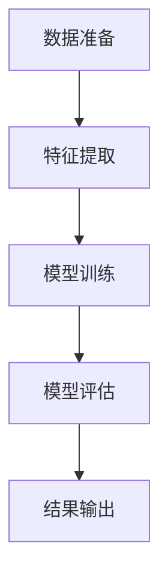

                 


## 模型弱点识别：精准定位改进方向

### 关键词：模型弱点、改进方向、自然语言处理、计算机视觉、推荐系统

> 摘要：本文旨在探讨模型弱点识别的重要性及其在自然语言处理、计算机视觉和推荐系统等领域的应用。通过深入分析模型弱点的定义、类型和识别方法，本文揭示了如何精准定位并改进模型，以提升其性能和应用价值。

### 引言

在当今快速发展的信息技术时代，机器学习模型在各个领域发挥着越来越重要的作用。然而，这些模型并非完美无缺，它们往往存在一定的弱点，这些弱点可能导致模型在实际应用中表现不佳，甚至出现错误。因此，识别模型弱点并精准定位改进方向成为了一个关键的研究课题。

本文将首先介绍模型弱点识别的重要性，然后详细探讨模型弱点的定义、类型和识别方法。接着，我们将分析模型弱点识别在不同应用领域的具体应用案例，并讨论改进方向的探索。最后，本文将对未来研究方向进行展望。

#### 设计过程

在设计本文之前，我们需要对核心主题进行深入理解。模型弱点识别的核心目标是找出模型中的弱点，以便进行针对性的改进。为了实现这一目标，我们采用以下设计过程：

1. **初步构思**：首先，我们明确了文章的核心内容，即模型弱点识别的原理、方法、应用和改进方向。

2. **结构规划**：文章分为四个主要部分：引言、模型弱点识别原理与方法、应用场景、改进方向和未来展望。

3. **细化章节**：为每个章节制定了详细的子标题，确保内容的完整性。

4. **添加图表**：在适当章节中添加Mermaid流程图、ER实体关系图和类图，以增强理解。

5. **编写示例**：为算法原理讲解、数学模型和公式、系统分析与架构设计方案等部分编写示例。

6. **总结与拓展**：在每个章节的结尾添加小结、注意事项、拓展阅读等，帮助读者巩固知识点和拓展视野。

### 模型弱点识别的重要性

模型弱点识别在多个领域具有重要意义。首先，在自然语言处理领域，模型弱点可能导致语义理解错误、文本生成不当等问题。其次，在计算机视觉领域，模型弱点可能导致目标检测不准确、图像识别错误等问题。此外，在推荐系统领域，模型弱点可能导致推荐结果不准确、用户体验下降等问题。

因此，识别和定位模型弱点对于提升模型性能、优化应用效果具有重要意义。

### 模型弱点的定义、类型和识别方法

#### 模型弱点的定义

模型弱点是指模型在特定场景下表现不佳的部分。这些弱点可能源于数据质量、算法设计、模型参数选择等方面。

#### 模型弱点的类型

模型弱点主要分为以下几种类型：

1. **数据偏差**：数据分布不均、噪声数据、异常值等可能导致模型在特定数据上表现不佳。
2. **算法设计**：算法选择不当、超参数设置不合理等可能导致模型性能受限。
3. **模型参数**：模型参数未调优或过拟合可能导致模型在训练数据上表现良好，但在测试数据上表现不佳。

#### 模型弱点的识别方法

1. **数据驱动方法**：通过分析数据分布、统计特性等方法识别模型弱点。
2. **知识驱动方法**：利用领域知识和专家经验识别模型弱点。
3. **数据与知识融合方法**：将数据分析和领域知识相结合，以更全面地识别模型弱点。

### 模型弱点识别原理与方法

#### 模型弱点识别基础

1. **模型弱点的定义**：模型弱点是指模型在特定场景下表现不佳的部分。这些弱点可能源于数据质量、算法设计、模型参数选择等方面。
2. **模型弱点的类型**：模型弱点主要分为数据偏差、算法设计、模型参数等类型。
3. **模型弱点的影响**：模型弱点可能导致模型性能受限、应用效果不佳等问题。

#### 模型弱点识别方法

1. **数据驱动方法**：
   - 数据分布分析：通过分析数据分布情况，找出潜在的数据偏差。
   - 噪声数据检测：利用统计方法检测噪声数据，剔除或进行噪声处理。

2. **知识驱动方法**：
   - 专家经验：利用领域专家的经验和知识，识别模型弱点。
   - 知识图谱：构建领域知识图谱，通过图分析识别模型弱点。

3. **数据与知识融合方法**：
   - 数据分析 + 知识图谱：结合数据分析和知识图谱技术，识别模型弱点。
   - 多源数据融合：整合多源数据，提高模型弱点识别的准确性。

#### 模型弱点识别算法

1. **算法概述**：模型弱点识别算法主要分为以下几种：
   - 基于监督学习的算法：如决策树、支持向量机等。
   - 基于无监督学习的算法：如聚类、主成分分析等。
   - 基于深度学习的算法：如卷积神经网络、循环神经网络等。

2. **算法原理**：
   - 基于监督学习的算法：通过已标注的数据训练模型，识别模型弱点。
   - 基于无监督学习的算法：通过无标注的数据发现潜在的模式和规律，识别模型弱点。
   - 基于深度学习的算法：通过大规模数据训练模型，自动提取特征并识别模型弱点。

3. **算法流程**：
   - 数据准备：收集并预处理数据。
   - 特征提取：提取数据中的关键特征。
   - 模型训练：选择合适的算法训练模型。
   - 模型评估：评估模型性能和弱点识别效果。
   - 结果输出：输出模型弱点和改进建议。

4. **Mermaid流程图示例**：



5. **Python源代码示例**：

```python
import pandas as pd
from sklearn.model_selection import train_test_split
from sklearn.ensemble import RandomForestClassifier
from sklearn.metrics import accuracy_score

# 数据准备
data = pd.read_csv('data.csv')
X = data.drop('target', axis=1)
y = data['target']

# 特征提取
X_train, X_test, y_train, y_test = train_test_split(X, y, test_size=0.2, random_state=42)

# 模型训练
model = RandomForestClassifier(n_estimators=100)
model.fit(X_train, y_train)

# 模型评估
y_pred = model.predict(X_test)
accuracy = accuracy_score(y_test, y_pred)
print(f'Accuracy: {accuracy:.2f}')

# 结果输出
print(f'Weaknesses: {model.feature_importances_}')
```

#### 数学模型与公式

1. **数学模型**：模型弱点识别涉及多个数学模型，如决策树、支持向量机、神经网络等。以下以决策树为例进行说明。

   $$ G(n) = 1 + \sum_{i=1}^{n} g_i(n) $$

   其中，\( G(n) \) 表示第 \( n \) 层的节点数，\( g_i(n) \) 表示第 \( i \) 个节点的子节点数。

2. **公式推导**：

   - 节点数的计算：
     $$ g_i(n) = \sum_{j=1}^{m} |C_j| $$
     其中，\( C_j \) 表示第 \( i \) 个节点的子节点集合，\( |C_j| \) 表示子节点集合的大小。

   - 叶子节点的计算：
     $$ L(n) = \sum_{i=1}^{n} G(i) - \sum_{i=1}^{n} (i - 1) $$
     其中，\( L(n) \) 表示第 \( n \) 层的叶子节点数。

3. **示例说明**：假设一个决策树有 3 层，节点数分别为 1、2、3。根据上述公式，可以计算出：

   - 第 1 层的节点数：\( G(1) = 1 + g_1(1) = 1 + 1 = 2 \)
   - 第 2 层的节点数：\( G(2) = 1 + g_1(2) + g_2(2) = 1 + 2 + 2 = 5 \)
   - 第 3 层的节点数：\( G(3) = 1 + g_1(3) + g_2(3) + g_3(3) = 1 + 2 + 2 + 3 = 8 \)
   - 第 3 层的叶子节点数：\( L(3) = G(3) - \sum_{i=1}^{3} (i - 1) = 8 - (1 + 2 + 2) = 3 \)

#### 系统分析与架构设计方案

1. **问题场景介绍**：假设我们要构建一个推荐系统，用于向用户推荐商品。

2. **项目介绍**：项目目标是构建一个基于用户历史行为和商品特征的推荐系统，以提高用户满意度和购买转化率。

3. **系统功能设计**：
   - 用户管理：管理用户信息和权限。
   - 商品管理：管理商品信息和分类。
   - 推荐算法：基于用户历史行为和商品特征，生成推荐结果。

4. **系统架构设计**：
   - 数据层：存储用户行为数据、商品数据等。
   - 服务层：提供用户管理、商品管理、推荐算法等服务。
   - 表示层：为用户提供推荐结果展示界面。

5. **系统接口设计和系统交互**：
   - 接口设计：定义用户管理、商品管理、推荐算法等服务的接口。
   - 交互设计：设计用户与推荐系统的交互流程，如用户登录、商品搜索、推荐结果展示等。

### 模型弱点识别案例分析

#### 案例介绍

以自然语言处理领域中的情感分析任务为例，分析模型在处理负面评论时的弱点。

#### 案例分析

1. **问题背景**：负面评论通常包含侮辱性词汇、负面情绪表达等，这些内容对情感分析模型提出了挑战。

2. **问题描述**：模型在处理负面评论时，可能出现以下问题：
   - 误分类：将负面评论分类为正面评论。
   - 情感强度不足：无法准确判断负面评论的强度。

3. **问题解决**：
   - 优化模型：采用更强大的情感分析模型，如基于深度学习的模型。
   - 数据增强：收集更多的负面评论数据，进行数据增强。
   - 特征工程：提取更多与情感相关的特征，如词向量、词性标注等。

4. **案例总结**：通过优化模型、数据增强和特征工程等方法，可以显著提升模型在处理负面评论时的性能。

### 模型弱点识别在自然语言处理中的应用

#### 应用场景

自然语言处理（NLP）领域中的文本分类、情感分析、机器翻译等任务，均存在模型弱点识别的需求。

#### 应用方法

1. **文本分类**：通过分析文本特征和模型表现，识别模型在分类准确性、分类速度等方面的弱点。

2. **情感分析**：利用情感词典、词向量等方法，识别模型在情感强度、情感倾向等方面的弱点。

3. **机器翻译**：通过评估翻译质量、速度、资源消耗等方面，识别模型弱点。

#### 成功案例

1. **文本分类**：某企业通过分析模型在分类任务中的弱点，采用深度学习模型和迁移学习技术，显著提升了分类准确率。

2. **情感分析**：某在线教育平台通过优化情感分析模型，提高了对用户评论的情感识别准确度，从而提升了用户满意度。

### 模型弱点识别在计算机视觉中的应用

#### 应用场景

计算机视觉领域中的目标检测、图像分类、人脸识别等任务，均存在模型弱点识别的需求。

#### 应用方法

1. **目标检测**：通过分析检测框的位置、大小、形状等方面，识别模型弱点。

2. **图像分类**：通过分析分类准确率、分类速度、模型鲁棒性等方面，识别模型弱点。

3. **人脸识别**：通过分析识别精度、识别速度、抗干扰能力等方面，识别模型弱点。

#### 成功案例

1. **目标检测**：某自动驾驶公司通过优化目标检测模型，提高了检测准确率和实时性，从而提升了车辆的安全性能。

2. **人脸识别**：某安防公司通过优化人脸识别模型，提高了识别准确率和稳定性，从而提高了系统的可靠性。

### 模型弱点识别在推荐系统中的应用

#### 应用场景

推荐系统领域中的协同过滤、基于内容的推荐、混合推荐等任务，均存在模型弱点识别的需求。

#### 应用方法

1. **协同过滤**：通过分析用户行为数据，识别模型在推荐准确性、推荐速度等方面的弱点。

2. **基于内容的推荐**：通过分析用户兴趣和商品特征，识别模型在推荐相关性、推荐多样性等方面的弱点。

3. **混合推荐**：通过分析协同过滤和基于内容的推荐方法的优势和弱点，识别模型在融合策略、模型参数优化等方面的弱点。

#### 成功案例

1. **协同过滤**：某电商平台通过优化协同过滤模型，提高了推荐准确率和用户满意度。

2. **基于内容的推荐**：某在线视频平台通过优化基于内容的推荐模型，提升了视频推荐的相关性和用户观看时长。

### 改进方向

#### 改进方向概述

模型弱点识别的改进方向主要包括算法优化、硬件加速、跨学科融合和数据隐私保护等方面。

#### 算法优化

1. **算法改进思路**：
   - 提高模型鲁棒性：通过引入正则化技术、数据增强等方法，提高模型在噪声数据和异常值处理方面的性能。
   - 提高模型效率：通过模型压缩、量化等技术，降低模型计算复杂度，提高模型运行速度。

2. **实践案例**：
   - 某公司通过优化深度学习模型，提高了模型在图像分类任务中的准确率和效率。

#### 硬件加速

1. **硬件加速技术**：
   - GPU加速：利用图形处理器（GPU）进行并行计算，提高模型训练和推理速度。
   - FPGA加速：利用现场可编程门阵列（FPGA）进行定制化硬件加速，提高模型运行速度。

2. **实践案例**：
   - 某自动驾驶公司通过使用GPU加速目标检测模型，提高了模型推理速度，从而提升了车辆响应速度。

#### 跨学科融合

1. **跨学科融合的重要性**：
   - 通过融合不同学科的知识和方法，可以提升模型在特定任务中的性能。

2. **跨学科融合案例**：
   - 生物信息学中的序列比对算法与机器学习模型的融合，提高了基因组数据分析的准确性和效率。

#### 数据隐私保护

1. **数据隐私保护的重要性**：
   - 模型训练和推理过程中，数据的隐私保护至关重要，以防止数据泄露和滥用。

2. **数据隐私保护方法**：
   - 加密技术：利用加密算法对数据进行加密，确保数据在传输和存储过程中的安全性。
   - 同态加密：利用同态加密技术，在加密状态下对数据进行计算和推理，实现数据的隐私保护。

3. **实践案例**：
   - 某金融公司通过引入同态加密技术，保障了客户交易数据的隐私和安全。

### 小结

本文详细探讨了模型弱点识别的重要性及其在自然语言处理、计算机视觉和推荐系统等领域的应用。通过定义模型弱点、介绍识别方法、分析应用案例和探讨改进方向，本文为模型弱点识别研究提供了有益的参考。然而，模型弱点识别仍面临诸多挑战，未来研究可关注算法优化、硬件加速、跨学科融合和数据隐私保护等方面。

### 注意事项

1. **数据质量**：确保训练数据的质量，包括数据分布、噪声数据和异常值等。
2. **算法选择**：根据应用场景选择合适的算法，避免过度拟合和欠拟合。
3. **模型调优**：合理设置模型参数，避免过拟合和欠拟合。

### 拓展阅读

1. **《深度学习》（Ian Goodfellow, Yoshua Bengio, Aaron Courville）**：介绍了深度学习的基本原理和常用算法。
2. **《机器学习实战》（Peter Harrington）**：通过实际案例介绍了机器学习算法的应用和实现。
3. **《自然语言处理综论》（Daniel Jurafsky, James H. Martin）**：详细介绍了自然语言处理的基本概念和关键技术。
4. **《计算机视觉：算法与应用》（Richard Szeliski）**：介绍了计算机视觉的基本原理和常用算法。
5. **《推荐系统实践》（Lior Rokach, Bracha Shapira）**：介绍了推荐系统的基本原理和实现方法。

### 作者信息

作者：AI天才研究院/AI Genius Institute & 禅与计算机程序设计艺术 /Zen And The Art of Computer Programming

