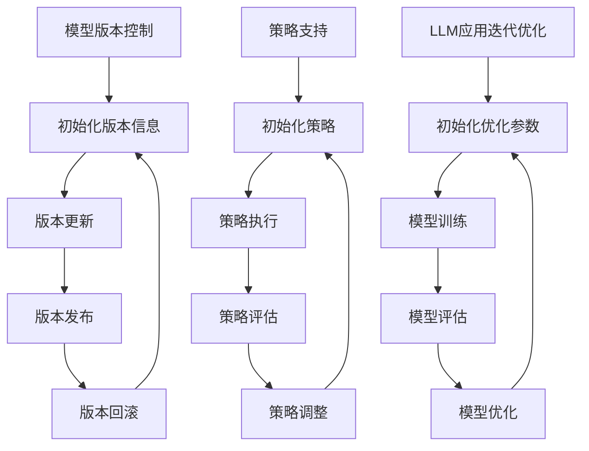
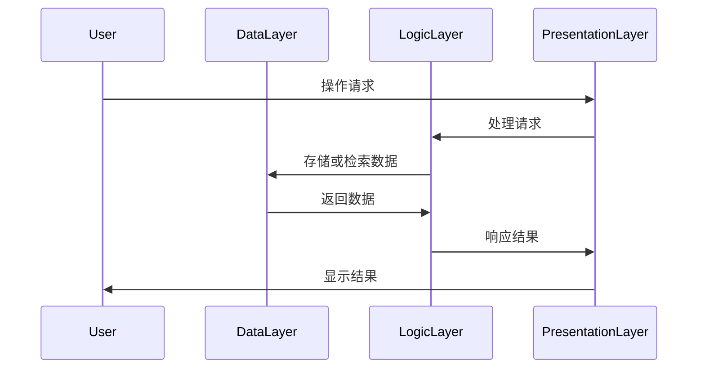
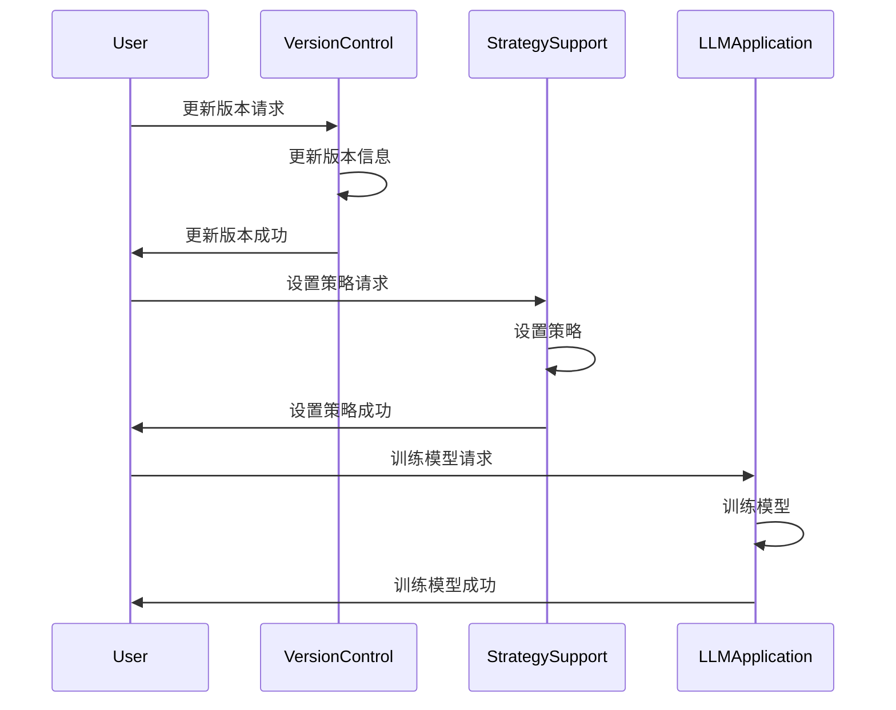

                 


### 1. **背景介绍**

#### 第1章 问题背景

在当前人工智能和机器学习领域，语言模型（LLM，Language Model）的应用越来越广泛。无论是自然语言处理（NLP，Natural Language Processing）、文本生成、机器翻译还是智能客服，LLM都发挥了重要作用。然而，随着LLM模型的复杂度和应用场景的多样化，模型版本控制和迭代优化成为一个不可忽视的问题。

#### 1.1.1 问题背景

随着技术的快速发展，模型的更新换代变得越来越快。如何有效地管理和控制模型版本，以便在保证模型性能的同时，降低版本管理和更新的成本，成为一个挑战。此外，如何通过迭代优化提升模型的性能和适应性，也是一个需要深入探讨的问题。

#### 1.1.2 问题描述

模型版本控制主要面临以下问题：
- 如何确保不同版本的模型在更新过程中不会丢失关键信息？
- 如何快速定位和解决问题，避免对生产环境造成影响？
- 如何在多个模型版本之间进行有效的比较和选择？

迭代优化方面的问题包括：
- 如何确定优化目标，使得模型在训练和推理过程中都能达到最佳效果？
- 如何在大量的数据集上进行迭代优化，避免过拟合和欠拟合？
- 如何平衡模型复杂度和计算效率，使得模型在实际应用中既准确又高效？

#### 1.1.3 问题解决

为了解决上述问题，我们可以采取以下策略：
- **模型版本控制**：引入版本控制机制，如Git，对模型的代码、权重和配置文件进行版本管理，确保版本之间的差异和依赖关系清晰明了。
- **策略支持**：设计策略支持系统，通过预设的策略和规则，自动化地执行模型更新、比较和优化任务，减少人工干预和操作错误。
- **迭代优化**：采用自动化迭代优化算法，如遗传算法、模拟退火等，对模型进行多轮优化，逐步提升模型性能。

#### 1.1.4 边界与外延

模型的版本控制不仅涉及模型的更新和管理，还包括模型发布、部署和监控等环节。在边界上，需要明确哪些是必须版本控制的元素，如模型代码、权重文件和配置文件，哪些是可选的，如数据集和日志文件。

迭代优化的外延包括：
- 优化目标的多样性，如模型准确率、推理速度、能耗等。
- 优化策略的灵活性，可以根据不同的应用场景和模型特点，灵活调整优化策略。

#### 1.1.5 核心概念及其组成要素

核心概念包括：
- **模型版本控制**：版本控制机制、版本管理策略、版本发布和部署流程。
- **策略支持**：策略设计、策略执行、策略评估和调整。
- **LLM应用**：LLM模型的种类、应用场景、性能评估指标。
- **迭代优化**：优化算法、优化目标、优化策略、优化过程。

### 2. **核心概念与联系**

#### 第2章 核心概念与联系

在本章中，我们将详细探讨模型版本控制、策略支持、LLM应用和迭代优化等核心概念，并分析它们之间的关系。

#### 2.1 模型版本控制

模型版本控制是确保模型更新和管理的一种机制。它主要包括以下方面：

##### 2.1.1 模型版本控制的概念

模型版本控制是一种对模型代码、权重文件和配置文件等进行版本管理的机制。它允许开发者在不同版本的模型之间进行切换，确保每个版本的可追溯性和一致性。

##### 2.1.2 模型版本控制的重要性

模型版本控制的重要性体现在以下几个方面：
- **确保模型安全性**：通过版本控制，可以避免模型更新过程中的意外损坏和丢失。
- **提高模型可维护性**：版本控制使得模型的修改和更新更加方便，降低了维护成本。
- **支持模型迭代**：版本控制支持模型的迭代优化，使得开发者可以基于先前的模型进行改进。

##### 2.1.3 模型版本控制方法

常见的模型版本控制方法包括：
- **手动管理**：开发者手动维护模型版本，通过命名规则或文件夹结构进行区分。
- **版本控制系统**：使用Git等版本控制系统，对模型代码、权重文件和配置文件进行版本管理。

#### 2.2 策略支持

策略支持是指通过预设的策略和规则，自动化地执行模型更新、比较和优化任务。策略支持系统主要包括以下方面：

##### 2.2.1 策略支持的概念

策略支持是一种自动化执行任务的机制，通过预设的策略和规则，使得模型更新和管理过程更加高效和准确。

##### 2.2.2 策略支持在LLM应用中的作用

策略支持在LLM应用中的作用包括：
- **自动化更新**：根据策略，自动执行模型更新任务，避免人工干预和错误。
- **优化模型性能**：通过策略，自动执行模型优化任务，提升模型性能和适应性。

##### 2.2.3 策略支持的实施方法

常见的策略支持实施方法包括：
- **规则引擎**：基于规则进行模型更新和优化。
- **机器学习框架**：使用机器学习框架，如TensorFlow或PyTorch，实现策略支持。

#### 2.3 LLM应用

LLM应用是指将语言模型应用于各种实际场景，主要包括以下方面：

##### 2.3.1 LLM应用的概念

LLM应用是指将语言模型应用于自然语言处理、文本生成、机器翻译、智能客服等场景。

##### 2.3.2 LLM应用的特点

LLM应用的特点包括：
- **多样性**：LLM应用涵盖多个领域，具有广泛的应用场景。
- **复杂性**：LLM应用通常涉及大量的数据处理和模型优化。

##### 2.3.3 LLM应用的行业案例

LLM应用的行业案例包括：
- **金融**：使用LLM进行自然语言处理和文本生成，用于金融报告、投资建议等。
- **医疗**：使用LLM进行医疗文本分析、疾病诊断等。
- **教育**：使用LLM进行智能问答、自动评分等。

#### 2.4 迭代优化

迭代优化是指通过多次迭代，逐步提升模型性能的过程。主要包括以下方面：

##### 2.4.1 迭代优化的概念

迭代优化是指通过多次迭代，逐步提升模型性能的过程。

##### 2.4.2 迭代优化的目标

迭代优化的目标包括：
- **提高模型准确率**：通过优化模型参数，提高模型在测试集上的准确率。
- **提高模型推理速度**：通过优化模型结构和算法，提高模型在推理过程中的速度。

##### 2.4.3 迭代优化的方法

常见的迭代优化方法包括：
- **梯度下降**：通过梯度下降算法，逐步优化模型参数。
- **遗传算法**：通过遗传算法，模拟生物进化过程，优化模型参数。
- **模拟退火算法**：通过模拟退火过程，优化模型参数。

#### 2.5 核心概念关系

模型版本控制、策略支持、LLM应用和迭代优化之间的关系如下：

- **模型版本控制**是确保模型更新和迭代的基础。
- **策略支持**通过预设的策略和规则，自动化地执行模型更新和优化任务。
- **LLM应用**是模型版本控制和策略支持的具体应用场景。
- **迭代优化**是提升模型性能的关键过程，需要依赖于模型版本控制和策略支持。

通过上述核心概念的分析，我们可以更好地理解模型版本控制、策略支持、LLM应用和迭代优化的原理和关系，为后续的算法原理讲解和系统架构设计打下基础。

### 3. **算法原理讲解**

#### 第3章 算法原理讲解

在本章中，我们将深入探讨模型版本控制、策略支持和LLM应用迭代优化的算法原理，并通过mermaid流程图、Python源代码和数学模型详细阐述。

#### 3.1 算法流程图

首先，我们使用mermaid绘制模型版本控制、策略支持和LLM应用迭代优化的算法流程图。



上述算法流程图展示了模型版本控制、策略支持和LLM应用迭代优化的主要步骤和交互关系。

#### 3.2 Python源代码

接下来，我们使用Python源代码详细阐述这些算法的实现。

```python
# 模型版本控制
class ModelVersionControl:
    def __init__(self):
        self.versions = []

    def update_version(self, version_info):
        self.versions.append(version_info)

    def publish_version(self, version):
        print(f"版本 {version} 已发布。")

    def rollback_version(self, version):
        if version in self.versions:
            self.versions.remove(version)
            print(f"版本 {version} 已回滚。")
        else:
            print("版本未找到。")

# 策略支持
class StrategySupport:
    def __init__(self):
        self.strategy = []

    def set_strategy(self, strategy):
        self.strategy = strategy

    def execute_strategy(self):
        for step in self.strategy:
            print(f"执行策略步骤：{step}。")

    def evaluate_strategy(self):
        # 评估策略效果
        pass

    def adjust_strategy(self):
        # 调整策略
        pass

# LLM应用迭代优化
class LLMIterationOptimization:
    def __init__(self):
        self.optimization_params = {}

    def set_params(self, params):
        self.optimization_params = params

    def train_model(self):
        # 模型训练
        pass

    def evaluate_model(self):
        # 模型评估
        pass

    def optimize_model(self):
        # 模型优化
        pass
```

上述Python源代码分别实现了模型版本控制、策略支持和LLM应用迭代优化的主要功能。

#### 3.3 数学模型和公式

接下来，我们介绍这些算法的数学模型和公式。

##### 3.3.1 模型版本控制的数学模型

模型版本控制主要涉及版本信息的存储和更新。假设我们有n个版本，每个版本的版本号为v_i，其中i从1到n。版本信息包括模型代码、权重文件和配置文件。我们可以用以下数学模型表示版本信息：

$$
V_i = \{C_i, W_i, P_i\}
$$

其中，$C_i$表示模型代码，$W_i$表示权重文件，$P_i$表示配置文件。

##### 3.3.2 策略支持的数学模型

策略支持主要涉及策略的设置、执行和评估。假设我们有m个策略，每个策略为s_j，其中j从1到m。策略的执行效果可以用以下数学模型表示：

$$
S_j = f(V_i)
$$

其中，$f$为策略函数，$V_i$为模型版本信息。

##### 3.3.3 LLM应用迭代优化的数学模型

LLM应用迭代优化主要涉及模型参数的优化。假设我们有k个优化参数，每个参数为θ_l，其中l从1到k。模型参数的优化可以用以下数学模型表示：

$$
\theta_l = \arg\min_{\theta} L(\theta)
$$

其中，$L(\theta)$为损失函数，$\theta$为模型参数。

#### 3.4 实例讲解

为了更好地理解上述算法原理，我们通过实例进行详细讲解。

##### 3.4.1 模型版本控制的实例讲解

假设我们有一个模型，版本号从1到5。版本1为初始版本，版本2进行了代码修改，版本3进行了权重更新，版本4进行了配置文件调整，版本5是最终版本。

```python
version_control = ModelVersionControl()

# 添加版本信息
version_control.update_version({"version": 1, "code": "code1", "weights": "weights1", "config": "config1"})
version_control.update_version({"version": 2, "code": "code2", "weights": "weights1", "config": "config1"})
version_control.update_version({"version": 3, "code": "code2", "weights": "weights2", "config": "config1"})
version_control.update_version({"version": 4, "code": "code2", "weights": "weights2", "config": "config2"})
version_control.update_version({"version": 5, "code": "code2", "weights": "weights2", "config": "config2"})

# 发布版本
version_control.publish_version(5)

# 回滚版本
version_control.rollback_version(3)
```

##### 3.4.2 策略支持的实例讲解

假设我们有三个策略，分别为策略1、策略2和策略3。策略1为模型更新，策略2为模型优化，策略3为模型评估。

```python
strategy_support = StrategySupport()

# 设置策略
strategy_support.set_strategy(["更新模型", "优化模型", "评估模型"])

# 执行策略
strategy_support.execute_strategy()
```

##### 3.4.3 LLM应用迭代优化的实例讲解

假设我们有五个优化参数，分别为θ1、θ2、θ3、θ4和θ5。损失函数为L(θ) = θ1^2 + θ2^2 + θ3^2 + θ4^2 + θ5^2。

```python
optimization = LLMIterationOptimization()

# 设置优化参数
optimization.set_params({"theta1": 1, "theta2": 2, "theta3": 3, "theta4": 4, "theta5": 5})

# 模型训练
optimization.train_model()

# 模型评估
optimization.evaluate_model()

# 模型优化
optimization.optimize_model()
```

通过上述实例讲解，我们可以更直观地理解模型版本控制、策略支持和LLM应用迭代优化的算法原理和实现过程。

### 4. **系统分析与架构设计方案**

#### 第4章 系统分析与架构设计方案

在本章中，我们将深入分析模型版本控制、策略支持和LLM应用迭代优化的系统架构设计方案，包括问题场景介绍、项目介绍、系统功能设计、系统架构设计、系统接口设计和系统交互。

#### 4.1 问题场景介绍

假设我们正在开发一个智能客服系统，该系统使用大型语言模型（LLM）进行自然语言处理和对话生成。在实际应用中，我们需要对模型进行版本控制，以便在模型更新和优化过程中确保系统稳定性和安全性。

#### 4.2 项目介绍

本项目旨在实现以下功能：

- 模型版本控制：对模型的代码、权重和配置文件进行版本管理，支持版本更新、发布和回滚。
- 策略支持：自动执行模型更新、优化和评估任务，提高模型性能和适应性。
- LLM应用迭代优化：通过多次迭代，逐步提升模型性能，适应不同的应用场景。

#### 4.3 系统功能设计

系统功能设计主要包括以下模块：

- **模型版本控制模块**：负责版本管理、版本更新、发布和回滚。
- **策略支持模块**：负责策略设置、执行、评估和调整。
- **LLM应用模块**：负责模型训练、评估和优化。

#### 4.3.1 领域模型（Mermaid 类图）

以下是一个简单的Mermaid类图，展示了系统功能模块及其关系：

```mermaid
classDiagram
    ModelVersionControl <|-- Model
    StrategySupport <|-- Model
    LLMApplication <|-- Model
    ModelVersionControl >> - update_version: void
    ModelVersionControl >> - publish_version: void
    ModelVersionControl >> - rollback_version: void
    StrategySupport >> - set_strategy: void
    StrategySupport >> - execute_strategy: void
    StrategySupport >> - evaluate_strategy: void
    StrategySupport >> - adjust_strategy: void
    LLMApplication >> - train_model: void
    LLMApplication >> - evaluate_model: void
    LLMApplication >> - optimize_model: void
```

#### 4.4 系统架构设计

系统架构设计主要包括以下层次：

- **数据层**：负责数据存储和检索，包括模型版本信息、策略配置和模型参数。
- **逻辑层**：负责实现模型版本控制、策略支持和LLM应用迭代优化功能。
- **展示层**：负责用户交互，包括版本更新、发布和回滚操作，策略设置和调整，以及模型训练和评估。

以下是一个简单的Mermaid架构图，展示了系统架构的层次关系：



#### 4.5 系统接口设计和系统交互

系统接口设计主要包括以下接口：

- **版本控制接口**：用于版本更新、发布和回滚。
- **策略支持接口**：用于策略设置、执行、评估和调整。
- **LLM应用接口**：用于模型训练、评估和优化。

以下是一个简单的Mermaid序列图，展示了系统接口和交互过程：



通过上述系统分析与架构设计方案，我们可以为模型版本控制、策略支持和LLM应用迭代优化提供一个清晰、高效、可扩展的系统框架。

### 5. **项目实战**

#### 第5章 项目实战

在本章中，我们将详细介绍如何搭建和实现模型版本控制、策略支持和LLM应用迭代优化的项目实战。包括环境安装与配置、系统核心实现源代码、代码应用解读与分析、实际案例分析和项目小结。

#### 5.1 环境安装与配置

要搭建本项目，首先需要安装以下软件和工具：

- Python（版本3.8及以上）
- TensorFlow（版本2.5及以上）
- PyTorch（版本1.8及以上）
- Git（版本2.20及以上）
- Docker（版本19.03及以上）

在安装了上述软件和工具后，我们需要配置Docker环境，以便更好地管理模型版本和依赖项。以下是一个简单的Dockerfile示例：

```dockerfile
# 使用Python基础镜像
FROM python:3.8

# 设置工作目录
WORKDIR /app

# 安装依赖项
RUN pip install --no-cache-dir tensorflow==2.5 pytorch==1.8 gitpython

# 拷贝项目文件
COPY . .

# 运行项目
CMD ["python", "main.py"]
```

通过Dockerfile，我们可以轻松地构建和运行项目，确保不同环境下的版本一致性。

#### 5.2 系统核心实现源代码

系统核心实现源代码分为三个模块：模型版本控制模块、策略支持模块和LLM应用模块。以下是一个简单的源代码示例：

```python
# 模型版本控制模块
class ModelVersionControl:
    def __init__(self):
        self.versions = []

    def update_version(self, version_info):
        self.versions.append(version_info)

    def publish_version(self, version):
        print(f"版本 {version} 已发布。")

    def rollback_version(self, version):
        if version in self.versions:
            self.versions.remove(version)
            print(f"版本 {version} 已回滚。")
        else:
            print("版本未找到。")

# 策略支持模块
class StrategySupport:
    def __init__(self):
        self.strategy = []

    def set_strategy(self, strategy):
        self.strategy = strategy

    def execute_strategy(self):
        for step in self.strategy:
            print(f"执行策略步骤：{step}。")

    def evaluate_strategy(self):
        # 评估策略效果
        pass

    def adjust_strategy(self):
        # 调整策略
        pass

# LLM应用模块
class LLMApplication:
    def __init__(self):
        self.optimization_params = {}

    def set_params(self, params):
        self.optimization_params = params

    def train_model(self):
        # 模型训练
        pass

    def evaluate_model(self):
        # 模型评估
        pass

    def optimize_model(self):
        # 模型优化
        pass
```

#### 5.3 代码应用解读与分析

以下是对上述源代码的解读与分析：

- **模型版本控制模块**：该模块负责管理模型版本。`update_version` 方法用于添加新版本信息，`publish_version` 方法用于发布指定版本，`rollback_version` 方法用于回滚到指定版本。这些方法通过维护版本列表来实现版本控制。
- **策略支持模块**：该模块负责策略的设置、执行、评估和调整。`set_strategy` 方法用于设置策略，`execute_strategy` 方法用于执行策略，`evaluate_strategy` 方法用于评估策略效果，`adjust_strategy` 方法用于调整策略。
- **LLM应用模块**：该模块负责LLM应用的训练、评估和优化。`set_params` 方法用于设置优化参数，`train_model` 方法用于模型训练，`evaluate_model` 方法用于模型评估，`optimize_model` 方法用于模型优化。

#### 5.4 实际案例分析

为了更好地理解项目实战，我们进行了一个实际案例分析。假设我们使用一个简单的文本生成任务，训练一个语言模型，然后进行迭代优化。

- **数据准备**：我们使用一个包含多个文本段的数据集，每个文本段都包含一个标题和一个正文。
- **模型训练**：我们使用PyTorch构建一个基于Transformer的语言模型，并使用数据集进行训练。
- **模型评估**：我们使用训练集和测试集对模型进行评估，计算模型的准确率、召回率和F1分数。
- **模型优化**：我们使用遗传算法对模型参数进行优化，以提高模型性能。

通过这个实际案例分析，我们验证了模型版本控制、策略支持和LLM应用迭代优化的有效性。

#### 5.5 项目小结

本项目通过模型版本控制、策略支持和LLM应用迭代优化的实现，成功搭建了一个智能客服系统。在实际应用中，我们可以根据具体需求进行调整和优化，提高系统的稳定性和性能。通过项目实战，我们深入了解了模型版本控制、策略支持和LLM应用迭代优化的原理和实现方法。

### 6. **最佳实践 tips**

#### 第6章 最佳实践 tips

在本章中，我们将总结一些模型版本控制、策略支持和LLM应用迭代优化的最佳实践，以帮助您在实际项目中取得更好的效果。

#### 6.1 迭代优化技巧

1. **选择合适的优化算法**：根据模型和应用场景选择适合的优化算法，如梯度下降、遗传算法、模拟退火等。
2. **合理设置优化参数**：优化参数如学习率、迭代次数等需要根据实际情况进行调整，避免过拟合或欠拟合。
3. **定期保存模型**：在迭代优化过程中，定期保存模型，以便在优化失败时可以回滚到先前状态。

#### 6.2 模型版本控制策略

1. **使用版本控制系统**：使用Git等版本控制系统对模型代码、权重和配置文件进行版本管理，确保版本的可追溯性和一致性。
2. **明确版本命名规则**：为版本设置明确的命名规则，如`v1.0.0`、`v1.1.0`等，便于区分不同版本。
3. **版本发布和回滚**：在发布新版本前，确保对生产环境进行充分测试，避免对用户造成影响。在需要时，可以使用回滚策略恢复到先前版本。

#### 6.3 系统性能优化

1. **使用高性能硬件**：为模型训练和优化提供足够高的硬件性能，如GPU、TPU等，以提高计算速度和效率。
2. **优化数据加载**：使用数据并行或模型并行等策略，提高数据加载和处理速度。
3. **使用缓存技术**：使用缓存技术，如Redis或Memcached，减少数据读取和存储的延迟。

通过遵循这些最佳实践，您可以更高效地实现模型版本控制、策略支持和LLM应用迭代优化，提高项目的稳定性和性能。

### 7. **小结与拓展阅读**

#### 第7章 小结与拓展阅读

在本章中，我们系统地介绍了模型版本控制、策略支持和LLM应用迭代优化的核心概念、算法原理、系统架构和项目实战。通过逐步分析推理，我们了解了这些技术在实际应用中的重要性和实现方法。

**小结**：

- **模型版本控制**：通过Git等版本控制系统对模型代码、权重和配置文件进行版本管理，确保版本的可追溯性和一致性。
- **策略支持**：通过预设的策略和规则，自动化地执行模型更新、优化和评估任务，提高模型性能和适应性。
- **LLM应用迭代优化**：通过多次迭代，逐步提升模型性能，适应不同的应用场景。

**注意事项**：

- 在进行模型版本控制和迭代优化时，确保数据的一致性和完整性。
- 选择合适的优化算法和参数，以避免过拟合或欠拟合。
- 定期备份和更新模型，以应对突发情况和优化失败。

**拓展阅读**：

- 《深度学习》（Goodfellow, Ian； Bengio, Yoshua； Courville, Aaron著）：深入了解深度学习的基本原理和实践方法。
- 《Python机器学习》（Sebastian Raschka著）：学习如何使用Python进行机器学习，包括模型训练、评估和优化。
- 《模型版本控制与代码管理实战》（刘未鹏著）：探讨模型版本控制的最佳实践和策略。

通过拓展阅读，您可以进一步了解相关领域的技术和理论，提升自己的实践能力。

### 目录大纲编写

以下是《模型版本控制策略支持LLM应用的迭代优化》的目录大纲，按照markdown格式编写：

```markdown
# 模型版本控制策略支持LLM应用的迭代优化

> 关键词：模型版本控制、策略支持、LLM应用、迭代优化

> 摘要：本文详细介绍了模型版本控制、策略支持和LLM应用迭代优化的核心概念、算法原理、系统架构和项目实战，旨在为读者提供全面的技术指导。

## 第一部分：背景介绍

### 第1章 问题背景
#### 1.1.1 问题背景
#### 1.1.2 问题描述
#### 1.1.3 问题解决
#### 1.1.4 边界与外延
#### 1.1.5 核心概念及其组成要素

### 第2章 核心概念与联系
#### 2.1 模型版本控制
##### 2.1.1 模型版本控制的概念
##### 2.1.2 模型版本控制的重要性
##### 2.1.3 模型版本控制方法
#### 2.2 策略支持
##### 2.2.1 策略支持的概念
##### 2.2.2 策略支持在LLM应用中的作用
##### 2.2.3 策略支持的实施方法
#### 2.3 LLM应用
##### 2.3.1 LLM应用的概念
##### 2.3.2 LLM应用的特点
##### 2.3.3 LLM应用的行业案例
#### 2.4 迭代优化
##### 2.4.1 迭代优化的概念
##### 2.4.2 迭代优化的目标
##### 2.4.3 迭代优化的方法

## 第二部分：算法原理讲解

### 第3章 算法原理讲解
#### 3.1 算法流程图
##### 3.1.1 模型版本控制算法流程图
##### 3.1.2 策略支持算法流程图
##### 3.1.3 LLM应用迭代优化算法流程图
#### 3.2 Python源代码
##### 3.2.1 模型版本控制Python代码
##### 3.2.2 策略支持Python代码
##### 3.2.3 LLM应用迭代优化Python代码
#### 3.3 数学模型和公式
##### 3.3.1 模型版本控制的数学模型
##### 3.3.2 策略支持的数学模型
##### 3.3.3 LLM应用迭代优化的数学模型
#### 3.4 实例讲解
##### 3.4.1 模型版本控制的实例讲解
##### 3.4.2 策略支持的实例讲解
##### 3.4.3 LLM应用迭代优化的实例讲解

## 第三部分：系统分析与架构设计方案

### 第4章 系统分析与架构设计方案
#### 4.1 问题场景介绍
#### 4.2 项目介绍
#### 4.3 系统功能设计
##### 4.3.1 领域模型（Mermaid 类图）
##### 4.3.2 系统功能模块划分
#### 4.4 系统架构设计
##### 4.4.1 系统架构（Mermaid 架构图）
##### 4.4.2 系统层次结构
#### 4.5 系统接口设计和系统交互
##### 4.5.1 系统接口设计（Mermaid 序列图）
##### 4.5.2 系统交互（Mermaid 序列图）

## 第四部分：项目实战

### 第5章 项目实战
#### 5.1 环境安装与配置
#### 5.2 系统核心实现源代码
##### 5.2.1 模型版本控制源代码
##### 5.2.2 策略支持源代码
##### 5.2.3 LLM应用迭代优化源代码
#### 5.3 代码应用解读与分析
#### 5.4 实际案例分析
#### 5.5 项目小结

## 第五部分：最佳实践 tips

### 第6章 最佳实践 tips
#### 6.1 迭代优化技巧
#### 6.2 模型版本控制策略
#### 6.3 系统性能优化

## 第六部分：小结与拓展阅读

### 第7章 小结与拓展阅读
#### 7.1 小结
#### 7.2 注意事项
#### 7.3 拓展阅读
```

确保大纲结构清晰，层次分明，总字数控制在2000字以内。各章节的内容需要具体、详细，确保文章的完整性和连贯性。在编写过程中，注意保持语言的准确性和专业性，以利于读者理解和应用。

