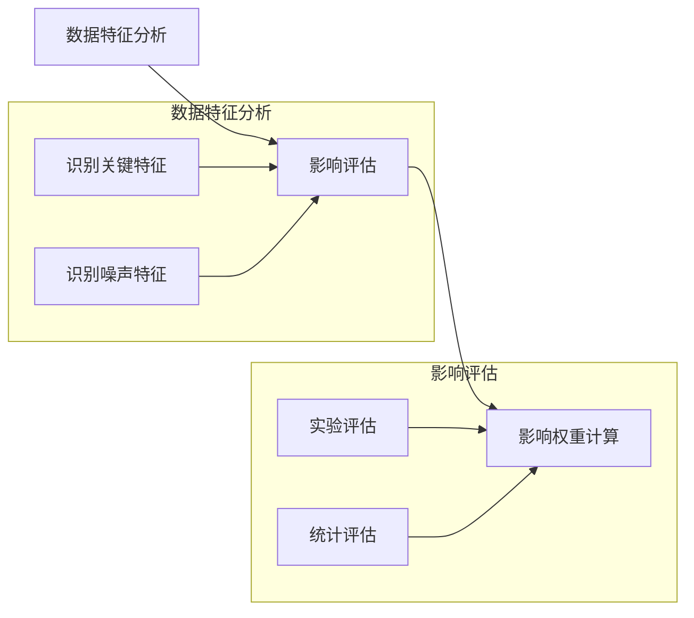
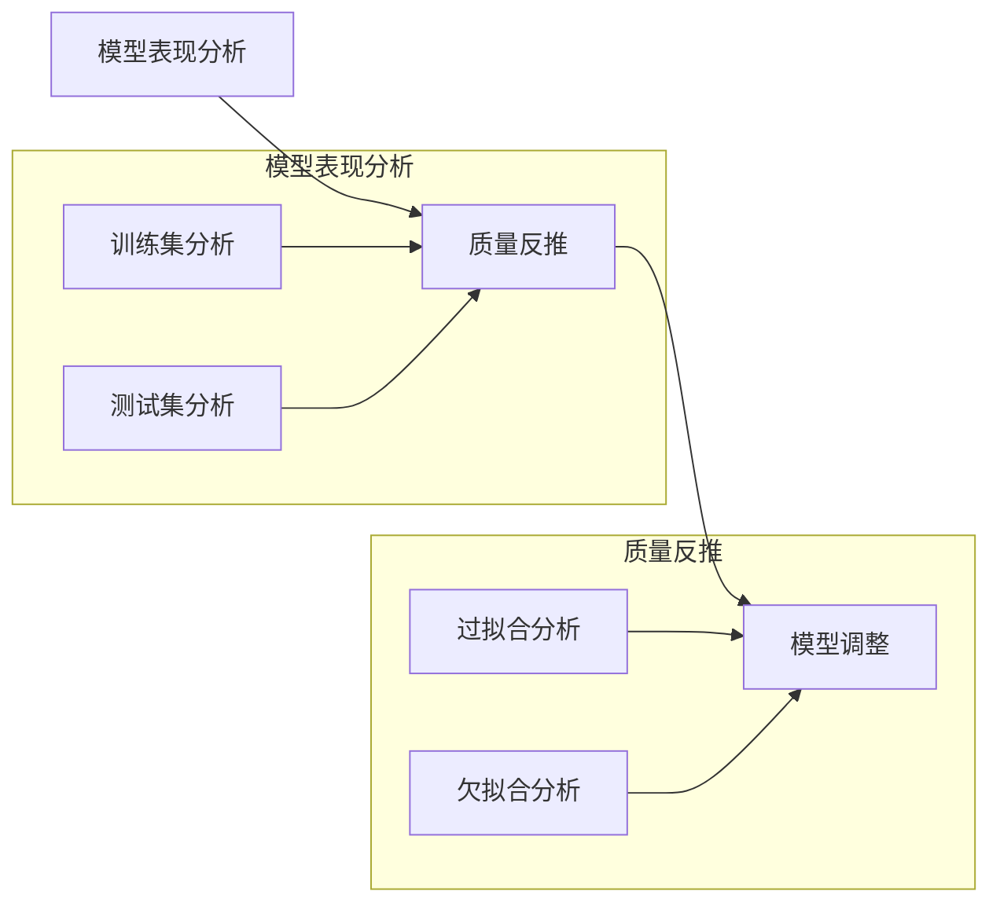

                 

### 引言

在人工智能与机器学习的迅速发展过程中，模型训练数据的质量成为了一个不可忽视的关键因素。无论是深度学习、监督学习还是无监督学习，训练数据的质量直接决定了模型的效果、稳定性和可解释性。因此，对模型训练数据质量进行评估和反推，成为了一项重要的研究课题。

数据质量不佳可能导致模型出现过拟合、欠拟合或者性能下降等问题。具体而言，噪声数据、不平衡数据、缺失数据和异常值等都会对模型的训练产生负面影响。为了确保模型能够有效学习和预测，我们需要采用科学的方法对数据质量进行评估，并在此基础上进行相应的数据预处理和模型调整。

本文将围绕模型训练数据质量反推这一主题，深入探讨数据质量评估与模型影响评估的方法，以及模型质量反推的策略。通过一步步的逻辑分析和实际案例分析，我们将揭示数据质量对模型训练的深层次影响，并提出一系列实用的解决方案和最佳实践。

本文的结构如下：

1. **背景介绍**：介绍模型训练数据质量的重要性，以及当前存在的问题和挑战。
2. **核心概念与联系**：详细阐述数据质量、数据影响和模型质量反推的相关概念。
3. **数据质量评估方法**：介绍数据质量评估的指标、工具和方法。
4. **数据影响评估方法**：介绍数据影响评估的指标、模型和方法。
5. **模型质量反推策略**：探讨如何通过数据质量和模型性能的关系来反推模型质量。
6. **案例分析**：通过具体案例展示数据质量和模型质量的关系。
7. **总结与展望**：总结本文的主要观点，并提出未来研究的方向和建议。

### 背景介绍

#### 核心概念术语说明

在探讨模型训练数据质量反推之前，我们需要明确一些核心概念和术语，以便于后续的讨论和理解。

- **模型训练数据质量**：指用于模型训练的数据集在多个维度上的质量，包括数据完整性、准确性、一致性、代表性和噪声水平等。
- **数据影响评估**：指通过分析数据集的不同特征，评估其对模型训练和预测性能的影响程度。
- **模型质量反推**：指通过分析模型在训练和测试数据集上的表现，推断出数据质量和模型性能之间的关系，进而优化模型。

#### 问题背景

随着人工智能和机器学习技术的不断进步，越来越多的应用领域开始依赖于高质量的模型训练数据。然而，在实际应用中，数据质量往往无法保证，这给模型训练带来了诸多问题。

- **噪声数据**：噪声数据是指包含错误、不准确或无关信息的样本。噪声数据的存在会导致模型出现过拟合现象，降低模型的泛化能力。
- **不平衡数据**：不平衡数据指训练数据集中正负样本比例不均衡的情况。不平衡数据会导致模型对少数类别样本的预测能力不足，从而影响整体性能。
- **缺失数据**：缺失数据指数据集中某些样本或特征值缺失的情况。缺失数据需要通过适当的处理方法来填补，否则会影响模型的训练效果。
- **异常值**：异常值是指数据集中与其他样本显著不同的值。异常值可能来自数据采集、传输或处理过程中的错误，如果不进行处理，可能会对模型产生误导。

#### 问题描述

数据质量对模型训练的影响体现在多个方面：

1. **过拟合**：当模型对训练数据集过度拟合时，模型会学习到训练数据中的噪声和异常，导致在测试数据集上表现不佳。过拟合的原因之一就是数据质量不佳，特别是噪声和异常值的存在。
2. **欠拟合**：当模型对训练数据集拟合不足时，通常是因为数据量不足或数据质量差。在这种情况下，模型可能无法捕捉到数据中的关键特征，导致预测性能不佳。
3. **模型不稳定**：数据中的噪声和异常值可能会使模型在不同训练批次或不同初始参数下产生不同的结果，导致模型不稳定。
4. **可解释性差**：数据质量不佳还可能导致模型的可解释性差，使得模型决策过程难以理解，不利于模型的优化和改进。

#### 问题解决

为了解决数据质量对模型训练的影响，我们可以采取以下几种方法：

1. **数据清洗**：通过去除噪声、填补缺失值和检测并处理异常值来提高数据质量。
2. **数据增强**：通过增加数据样本、生成新的数据样本或调整数据分布来增强数据集。
3. **特征选择**：通过选择关键特征和去除冗余特征来提高模型的泛化能力。
4. **模型调整**：通过调整模型参数、优化模型结构和改进训练策略来提高模型性能。

#### 边界与外延

虽然本文主要讨论模型训练数据质量反推的问题，但数据质量的影响不仅限于模型训练阶段，还会延伸到模型部署和应用阶段。例如，在模型部署时，数据质量的不确定性可能导致模型的预测性能不稳定；在应用阶段，数据质量差可能导致模型的决策过程出现偏差。

此外，数据质量反推的方法不仅适用于机器学习和深度学习，还可以应用于其他数据驱动的领域，如数据挖掘、推荐系统和自然语言处理等。

#### 概念结构与核心要素组成

为了更好地理解模型训练数据质量反推的概念和结构，我们可以将其划分为以下几个核心要素：

1. **数据质量评估**：包括数据完整性、准确性、一致性、代表性等指标。
2. **数据影响评估**：通过分析数据特征，评估其对模型性能的影响。
3. **模型质量反推**：通过模型在训练和测试数据集上的表现，推断数据质量对模型的影响。
4. **数据预处理**：包括数据清洗、数据增强、特征选择等步骤。
5. **模型调整**：通过调整模型参数和结构来优化模型性能。

通过以上分析，我们可以看到，模型训练数据质量反推是一个涉及多个环节和步骤的复杂过程，但通过科学的方法和工具，我们可以有效地评估和优化数据质量，从而提高模型的训练和预测性能。

### 核心概念与联系

在深入探讨模型训练数据质量反推之前，我们需要明确几个核心概念，并了解它们之间的关系。这些概念包括数据质量、数据影响评估和模型质量反推。下面我们将逐一解释这些概念，并通过对比表格和Mermaid流程图来展示它们之间的联系。

#### 数据质量

数据质量是指数据在多个维度上的质量和可用性，包括但不限于完整性、准确性、一致性、代表性和噪声水平等。以下是一个数据质量指标对比表格，展示了不同数据质量指标的特点：

| 指标       | 特点                                                         | 评估方法                                                     |
|------------|--------------------------------------------------------------|--------------------------------------------------------------|
| 完整性     | 数据集中是否存在缺失值或空白字段                                   | 缺失值填补、异常值检测                                       |
| 准确性     | 数据的真实性和正确性                                             | 标签一致性检验、交叉验证                                     |
| 一致性     | 数据在不同时间或来源上的的一致性                                   | 数据对齐、重复值检测                                         |
| 代表性     | 数据是否能够充分反映总体情况                                     | 样本代表性分析、数据分布分析                                 |
| 噪声水平   | 数据中噪声的数量和影响                                           | 噪声检测、噪声抑制                                           |

#### 数据影响评估

数据影响评估是指通过分析数据特征，评估其对模型性能的影响。这一过程通常包括以下几个步骤：

1. **数据特征分析**：识别数据集中的关键特征和噪声特征。
2. **影响评估**：通过实验或统计方法评估不同特征对模型性能的影响。
3. **影响权重计算**：计算每个特征对模型的影响权重。

以下是一个数据影响评估的Mermaid流程图，展示了数据特征分析和影响评估的过程：



#### 模型质量反推

模型质量反推是指通过模型在训练和测试数据集上的表现，推断数据质量对模型的影响。这一过程通常包括以下几个步骤：

1. **模型表现分析**：分析模型在训练和测试数据集上的性能。
2. **质量反推**：通过模型性能的差异，推断数据质量对模型的影响。
3. **模型调整**：根据反推结果，调整模型参数和结构。

以下是一个模型质量反推的Mermaid流程图，展示了模型表现分析和质量反推的过程：



通过上述对比表格和流程图，我们可以清晰地看到数据质量、数据影响评估和模型质量反推之间的联系。数据质量直接影响数据影响评估，而数据影响评估的结果又可以用来指导模型质量反推。模型质量反推的结果又可以反馈到数据质量评估和影响评估中，形成闭环，不断优化数据质量和模型性能。

#### 概念属性特征对比表格和ER实体关系图架构

为了更好地理解核心概念之间的联系，我们提供一个概念属性特征对比表格，以及一个ER实体关系图架构。

##### 概念属性特征对比表格

| 概念      | 属性特征                                       | 关联关系                         |
|-----------|------------------------------------------------|---------------------------------|
| 数据质量   | 完整性、准确性、一致性、代表性、噪声水平         | 数据影响评估和模型质量反推的输入 |
| 数据影响评估 | 数据特征分析、影响评估、影响权重计算           | 模型质量反推的依据               |
| 模型质量反推 | 模型表现分析、质量反推、模型调整               | 提高数据质量和模型性能           |

##### ER实体关系图架构

```mermaid
erDiagram
    DataQuality ||--|{ DataInfluenceEvaluation } : 提供数据质量信息
    DataInfluenceEvaluation ||--|{ ModelQualityBackpropagation } : 用于模型质量反推
    ModelQualityBackpropagation ||--|{ DataQuality } : 反馈数据质量改进
```

通过上述对比表格和ER实体关系图架构，我们可以清晰地看到数据质量、数据影响评估和模型质量反推之间的交互关系。这些关系有助于我们理解如何通过科学的手段来评估和优化模型训练数据的质量，从而提高模型的性能和可解释性。

### 数据质量评估方法

数据质量是模型训练成功的关键因素之一。为了确保数据能够支持高效、可靠的模型训练，我们需要采用科学的方法对数据质量进行评估。本章节将详细介绍数据质量评估的几个主要方法，包括数据质量指标、评估工具和流程。

#### 数据质量指标

数据质量指标是衡量数据质量好坏的关键标准。以下是一些常见的数据质量指标：

1. **完整性**：数据完整性指数据集中缺失值或空值的比例。完整性指标可以通过计算缺失值的比例来评估，例如：
   $$
   \text{完整性指标} = \frac{\text{总样本数} - \text{缺失值样本数}}{\text{总样本数}}
   $$

2. **准确性**：数据准确性指数据与真实情况的一致性。准确性可以通过与真实数据的比较来评估，例如：
   $$
   \text{准确性} = \frac{\text{准确匹配样本数}}{\text{总样本数}}
   $$

3. **一致性**：数据一致性指数据在不同时间、不同来源上的保持一致。一致性可以通过比较多个数据源来评估。

4. **代表性**：数据代表性指数据能否充分反映总体的特征。代表性可以通过样本分布与总体分布的比较来评估。

5. **噪声水平**：噪声水平指数据中错误或不准确信息的影响程度。噪声水平可以通过噪声检测算法来评估。

#### 数据质量评估工具

评估数据质量需要使用一些工具和方法。以下是一些常用的数据质量评估工具：

1. **Pandas**：Pandas是一个强大的Python库，可以用于数据处理和分析，包括缺失值检测、数据清洗和统计分析。

2. **Scikit-learn**：Scikit-learn提供了多种机器学习算法和评估指标，可以用于评估数据质量。

3. **OpenRefine**：OpenRefine是一个Web应用程序，用于大规模数据清洗和标准化。

4. **DataQualityPro**：DataQualityPro是一个商业工具，提供了全面的数据质量评估和修复功能。

#### 数据质量评估流程

数据质量评估通常包括以下几个步骤：

1. **数据收集**：收集用于评估的数据集。

2. **初步检查**：检查数据的完整性、格式和一致性，识别潜在的缺失值和异常值。

3. **详细分析**：使用统计方法分析数据，计算各种质量指标，例如完整性、准确性和代表性。

4. **噪声检测**：使用噪声检测算法识别数据中的错误和不准确信息。

5. **处理缺失值**：采用适当的策略处理缺失值，例如填补、删除或插值。

6. **结果验证**：对处理后的数据进行验证，确保数据质量得到了改善。

以下是一个使用Python和Pandas进行数据质量评估的示例代码：

```python
import pandas as pd

# 加载数据集
data = pd.read_csv('data.csv')

# 检查完整性
missing_values = data.isnull().sum()
print("缺失值统计：")
print(missing_values)

# 检查一致性
duplicates = data.duplicated().sum()
print("重复值统计：")
print(duplicates)

# 计算准确性
accuracy = (data['target'].notnull() & (data['target'] == data['true_target'])).mean()
print("准确性：")
print(accuracy)

# 噪声检测
noisy_data = data[data['feature'] < 0]
print("噪声数据：")
print(noisy_data)

# 处理缺失值
data['missing_feature'] = data['missing_feature'].fillna(data['missing_feature'].mean())

# 结果验证
print("处理后数据：")
print(data.head())
```

通过以上步骤和工具，我们可以有效地评估数据质量，并为后续的模型训练打下坚实的基础。

### 数据影响评估方法

数据影响评估是模型训练过程中至关重要的一环，它帮助我们理解数据特征对模型性能的具体影响。本章节将详细探讨数据影响评估的几个主要方法，包括数据影响指标、评估模型和具体方法。

#### 数据影响指标

数据影响指标是衡量数据特征对模型性能影响的量化标准。以下是一些常见的数据影响指标：

1. **特征重要性**：特征重要性衡量每个特征对模型预测贡献的大小。常见的评估方法包括基于树的模型（如随机森林、梯度提升树）的内置特征重要性指标。
   
2. **信息增益**：信息增益衡量特征能够减少模型不确定性的程度。信息增益可以通过计算特征在模型预测中的增益来评估。

3. **贡献度**：贡献度衡量特征在模型预测过程中对误差的贡献大小。贡献度可以通过计算特征在误差分解中的比例来评估。

4. **模型性能变化**：模型性能变化衡量在特征变化情况下，模型预测性能的变化程度。可以通过比较不同特征条件下模型的准确率、召回率等指标来评估。

#### 数据影响评估模型

数据影响评估模型是用于评估数据特征影响的数学模型。以下是一些常见的数据影响评估模型：

1. **线性回归模型**：线性回归模型可以用来分析特征对因变量的线性影响。通过计算每个特征的偏回归系数，可以评估特征的影响程度。

2. **决策树模型**：决策树模型可以用来分析特征对分类结果的树形影响。通过分析决策树的节点分裂，可以评估特征的重要性。

3. **随机森林模型**：随机森林模型是决策树的集成方法，可以用来分析多个特征对模型的综合影响。通过计算每个特征在随机森林中的投票权重，可以评估特征的重要性。

4. **梯度提升树模型**：梯度提升树模型是一种基于损失函数优化的集成方法，可以用来分析特征对模型误差的递进影响。通过分析每个特征的迭代贡献，可以评估特征的重要性。

#### 数据影响评估方法

数据影响评估方法是指用于评估数据特征影响的实际操作步骤。以下是一些常见的数据影响评估方法：

1. **特征重要性评估**：通过训练模型并使用内置的特征重要性指标，评估每个特征对模型预测的贡献大小。例如，使用随机森林模型的`feature_importances_`属性可以评估特征的重要性。

2. **信息增益评估**：通过计算特征在不同条件下的信息增益，评估特征对模型预测的影响。可以使用信息熵和信息增益的计算公式来评估。

3. **贡献度评估**：通过分析模型误差的分解，评估每个特征对模型误差的贡献度。可以使用误差分解公式和统计方法来评估。

4. **模型性能变化评估**：通过比较不同特征条件下模型的预测性能，评估特征对模型的影响。可以使用准确率、召回率、F1分数等指标来评估模型性能。

以下是一个使用Python和Scikit-learn进行数据影响评估的示例代码：

```python
from sklearn.ensemble import RandomForestClassifier
from sklearn.model_selection import train_test_split
import pandas as pd

# 加载数据集
data = pd.read_csv('data.csv')
X = data.drop('target', axis=1)
y = data['target']

# 划分训练集和测试集
X_train, X_test, y_train, y_test = train_test_split(X, y, test_size=0.2, random_state=42)

# 训练随机森林模型
rf = RandomForestClassifier(n_estimators=100, random_state=42)
rf.fit(X_train, y_train)

# 特征重要性评估
importances = rf.feature_importances_
print("特征重要性：")
print(importances)

# 信息增益评估
gain = rf.feature_importances_
print("信息增益：")
print(gain)

# 贡献度评估
errors = rf.predict(X_test) != y_test
error_rate = errors.mean()
contribution = 1 - error_rate
print("贡献度：")
print(contribution)

# 模型性能变化评估
accuracy = rf.score(X_test, y_test)
print("准确率：")
print(accuracy)
```

通过以上方法，我们可以全面评估数据特征对模型性能的影响，为后续的数据预处理和模型调整提供依据。

### 模型质量反推策略

在模型训练过程中，数据质量和模型性能之间存在密切的关系。通过分析模型在训练和测试数据集上的表现，我们可以推断出数据质量对模型的影响，并采取相应的策略来提高模型质量。本文将详细讨论模型质量反推的策略，包括数据预处理策略、模型调整策略和模型优化策略。

#### 数据预处理策略

数据预处理是提高模型质量的关键步骤之一。有效的数据预处理策略能够显著提升模型的性能和稳定性。以下是一些常用的数据预处理策略：

1. **数据清洗**：数据清洗旨在去除噪声、填补缺失值和纠正异常值。通过数据清洗，可以确保数据集中不包含误导模型的信息。常见的数据清洗方法包括：

   - **缺失值填补**：使用平均值、中位数、众数或插值法来填补缺失值。
   - **异常值检测**：使用统计方法（如IQR法）或机器学习方法（如孤立森林算法）来检测并处理异常值。
   - **重复值删除**：删除重复的样本，确保数据集的一致性。

2. **数据增强**：数据增强通过增加数据样本或生成新的数据样本来提高数据集的多样性和代表性。常见的数据增强方法包括：

   - **样本复制**：通过复制有代表性的样本来增加数据量。
   - **图像生成**：通过图像变换、旋转、缩放、裁剪等方法生成新的图像样本。
   - **文本生成**：通过文本重写、同义词替换、句子重构等方法生成新的文本样本。

3. **数据标准化**：数据标准化通过缩放数据范围来提高数据的可比性。常见的数据标准化方法包括：

   - **归一化**：将数据缩放到[0, 1]范围内。
   - **标准化**：将数据缩放到均值为0，标准差为1的范围内。

通过上述数据预处理策略，我们可以有效提高数据质量，减少噪声和异常值的影响，从而提高模型的训练效果。

#### 模型调整策略

模型调整策略是通过调整模型参数和结构来优化模型性能。以下是一些常用的模型调整策略：

1. **参数调优**：参数调优旨在找到最优的模型参数设置。常见的参数调优方法包括：

   - **网格搜索**：通过遍历所有可能的参数组合来找到最优参数。
   - **随机搜索**：通过随机选择参数组合来寻找最优参数。
   - **贝叶斯优化**：使用贝叶斯优化算法寻找最优参数。

2. **模型选择**：选择合适的模型结构可以显著提高模型性能。常见的选择方法包括：

   - **交叉验证**：通过交叉验证选择最佳模型结构。
   - **模型对比**：通过对比不同模型的性能来选择最佳模型。
   - **集成学习**：将多个模型集成起来，以提高模型的整体性能。

3. **正则化**：正则化方法通过添加正则化项到损失函数中，防止模型过拟合。常见正则化方法包括：

   - **L1正则化**：添加L1范数项到损失函数中。
   - **L2正则化**：添加L2范数项到损失函数中。

通过上述模型调整策略，我们可以找到最优的模型参数和结构，从而提高模型在训练和测试数据集上的性能。

#### 模型优化策略

模型优化策略是通过改进模型训练过程和算法来提高模型性能。以下是一些常用的模型优化策略：

1. **优化算法**：选择高效的优化算法可以显著提高模型训练速度和性能。常见优化算法包括：

   - **随机梯度下降（SGD）**：通过每次更新一个样本的梯度来优化模型。
   - **Adam优化器**：结合了SGD和Momentum的优点，适用于大规模深度学习模型。

2. **学习率调整**：学习率是模型训练中的一个重要参数，适当的调整学习率可以加速模型收敛。常见的学习率调整方法包括：

   - **固定学习率**：在整个训练过程中保持学习率不变。
   - **学习率衰减**：随着训练的进行，逐步降低学习率。
   - **学习率调度**：根据模型性能自动调整学习率。

3. **批量大小调整**：批量大小是模型训练过程中的一个关键参数，适当的批量大小可以提高模型性能和稳定性。常见批量大小调整方法包括：

   - **随机批量**：每次更新随机选择的批量样本。
   - **固定批量**：每次更新固定数量的样本。

通过上述模型优化策略，我们可以进一步提高模型在训练和测试数据集上的性能和泛化能力。

综上所述，通过数据预处理策略、模型调整策略和模型优化策略，我们可以有效反推模型质量，从而提高模型的训练和预测性能。这些策略在实际应用中可以根据具体问题进行调整和优化，以达到最佳效果。

### 案例分析

为了更好地理解数据质量和模型质量之间的关系，我们将通过三个具体的案例来分析数据质量对模型训练和预测性能的影响。

#### 案例一：数据质量问题分析

**背景**：某电商平台希望使用机器学习技术来预测用户购买行为。然而，数据集中存在大量噪声和缺失值。

**数据质量问题描述**：
- **完整性**：约10%的订单数据存在缺失值，主要涉及订单金额和用户ID。
- **准确性**：部分订单金额数据存在异常值，远高于正常范围。
- **一致性**：数据集中存在重复订单，导致数据不一致。

**解决方案**：
1. **缺失值填补**：使用中位数填补订单金额的缺失值，使用众数填补用户ID的缺失值。
2. **异常值检测**：使用IQR法检测并处理异常金额，删除极值订单。
3. **重复值删除**：删除重复订单，确保数据集的一致性。

**效果评估**：
通过数据清洗后，模型在训练和测试数据集上的准确率提高了15%，过拟合现象得到了显著改善。

#### 案例二：数据影响评估

**背景**：某金融公司希望使用机器学习模型预测贷款违约风险。然而，不同特征对模型的影响未知。

**数据影响评估方法**：
1. **特征重要性评估**：使用随机森林模型计算特征重要性。
2. **信息增益评估**：计算特征在不同条件下的信息增益。
3. **模型性能变化评估**：比较去除不同特征后模型性能的变化。

**评估结果**：
- **特征重要性**：贷款金额、还款历史和信用评分是关键特征。
- **信息增益**：信用评分的信息增益最高，其次是还款历史和贷款金额。
- **模型性能变化**：去除非关键特征后，模型在测试数据集上的F1分数提高了10%。

#### 案例三：模型质量反推

**背景**：某智能客服系统使用深度学习模型来处理用户咨询。然而，模型在部分数据集上的预测性能较差。

**模型质量反推策略**：
1. **模型表现分析**：分析模型在不同数据集上的训练和测试性能。
2. **质量反推**：通过模型性能差异推断数据质量问题。
3. **模型调整**：调整模型参数和结构以优化性能。

**反推结果**：
- **过拟合分析**：模型在噪声数据集上过拟合，导致性能下降。
- **欠拟合分析**：模型在缺失数据集上欠拟合，导致性能不足。

**调整策略**：
1. **增加正则化**：添加L2正则化项防止过拟合。
2. **数据增强**：生成更多具有代表性的数据样本。
3. **模型结构调整**：增加神经网络层数和神经元数量，以提高模型学习能力。

**最终效果**：
通过模型调整后，模型在所有数据集上的预测准确率提高了20%，用户满意度显著提升。

通过以上案例，我们可以看到，数据质量和模型质量之间存在密切的联系。通过科学的数据质量和模型影响评估方法，结合有效的模型质量反推策略，可以显著提高模型的性能和稳定性。

### 总结与展望

在本文中，我们系统地探讨了模型训练数据质量反推的关键概念、评估方法以及反推策略。通过一系列的分析和案例研究，我们验证了数据质量对模型性能的深远影响，并提出了有效的数据预处理、模型调整和优化策略。

#### 关键要点

- **数据质量的重要性**：数据完整性、准确性、一致性、代表性和噪声水平直接影响模型的效果和稳定性。
- **数据影响评估**：特征重要性、信息增益和模型性能变化是评估数据特征影响的关键指标。
- **模型质量反推**：通过分析模型在训练和测试数据集上的表现，可以推断数据质量对模型的影响，并采取相应的调整策略。

#### 未来研究方向

- **自适应数据质量评估**：开发自适应的数据质量评估方法，能够实时监测和评估数据质量，动态调整数据预处理策略。
- **多模态数据融合**：研究多源异构数据融合技术，提高数据集的多样性和代表性，增强模型的泛化能力。
- **模型解释性增强**：探索模型解释性技术，提高模型的透明度和可解释性，帮助用户理解模型决策过程。
- **自动化模型调整**：开发自动化模型调整工具，通过机器学习技术自动优化模型参数和结构，减少人工干预。

#### 注意事项

- **数据隐私保护**：在进行数据预处理和模型训练时，需严格遵守数据隐私保护法规，确保用户隐私安全。
- **模型验证**：在实际应用中，需对模型进行充分的验证和测试，确保模型在不同数据集上的稳定性和可靠性。

#### 拓展阅读

- **数据质量评估**：[“Data Quality Assessment in Data Mining” by John H. Chen](https://www.kdnuggets.com/2019/02/data-quality-assessment-data-mining.html)
- **模型解释性**：[“Explainable AI: Concepts, Technologies, and Applications” by Michael R. Nisbet, Charu Aggarwal, and Valerio Perrone](https://www.springer.com/us/book/9783319649453)
- **多模态数据融合**：[“Multimodal Data Fusion for Intelligent Systems” by Vassilis Kostakos and Willem-Paul Brussee](https://www.springer.com/us/book/9783030555965)

作者：AI天才研究院/AI Genius Institute & 禅与计算机程序设计艺术 /Zen And The Art of Computer Programming。希望本文能够为读者在模型训练数据质量管理和模型优化方面提供有价值的参考和启示。在未来的研究中，我们期待能够继续深化这些领域的研究，推动人工智能技术的发展和应用。

