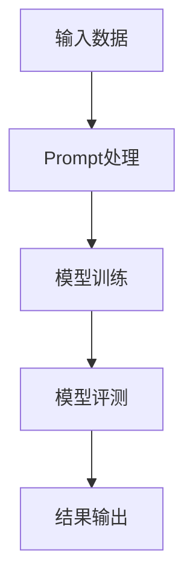
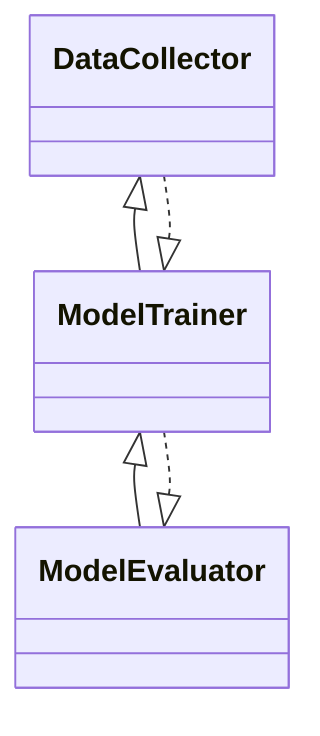
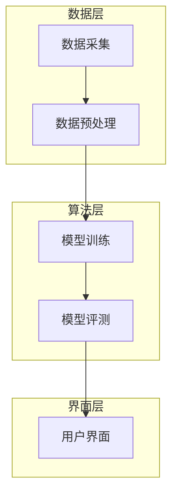
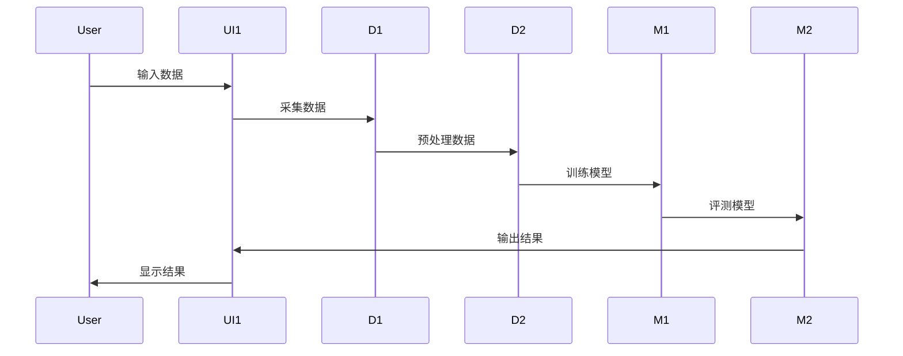

                 

# 模型评测中的prompt泛化能力分析

## 关键词
- 模型评测
- prompt泛化能力
- 数据增强
- 模型优化

## 摘要
本文深入探讨了模型评测中至关重要的prompt泛化能力。首先，介绍了prompt泛化能力的背景和问题，然后详细阐述了其核心概念与联系，接着讲解了提升prompt泛化能力的算法原理。文章还通过一个实际项目案例，展示了prompt泛化能力的实践应用，并提供了最佳实践建议。

### 第1章: 背景介绍

#### 1.1 问题背景

随着人工智能技术的不断进步，模型评测中的prompt泛化能力成为一个重要的研究方向。prompt泛化能力指的是模型在处理未知数据时，能否正确应用先前学习到的知识。这一能力在自动驾驶、医疗诊断等领域具有至关重要的意义。然而，目前关于prompt泛化能力的研究尚处于初级阶段，面临着诸多挑战。

#### 1.2 问题描述

在模型评测中，prompt泛化能力的问题主要体现在两个方面：

1. 如何评估模型的prompt泛化能力？
2. 如何提升模型的prompt泛化能力？

#### 1.3 问题解决

为了解决prompt泛化能力问题，我们可以从以下几个方面入手：

1. 设计合理的评测指标，评估模型的prompt泛化能力。
2. 通过数据增强、模型优化等方法提升模型的prompt泛化能力。

#### 1.4 边界与外延

prompt泛化能力的研究不仅局限于特定领域，还涉及到跨领域的prompt泛化。此外，不同类型的prompt（如文本、图像、声音等）在泛化能力上的表现也有所不同，需要进一步研究。

#### 1.5 概念结构与核心要素组成

prompt泛化能力的研究涉及以下几个核心概念：

1. 模型：用于处理数据的算法结构。
2. 数据：用于训练和评测模型的输入。
3. prompt：引导模型进行特定任务的关键信息。
4. 泛化能力：模型在未知数据上的表现。

### 第2章: 核心概念与联系

#### 2.1 概念原理

在本章中，我们将详细讲解prompt泛化能力的核心概念原理，包括：

1. prompt的定义与作用
2. 泛化能力的定义与度量
3. 模型在prompt泛化能力上的表现

#### 2.2 概念属性特征对比表格

| 概念               | 属性特征                                               |
|--------------------|-------------------------------------------------------|
| prompt             | 引导模型进行特定任务的关键信息                           |
| 泛化能力           | 模型在未知数据上的表现                                 |
| 模型               | 用于处理数据的算法结构                                 |
| 数据               | 用于训练和评测模型的输入                               |

#### 2.3 ER实体关系图架构

下面是prompt泛化能力研究的ER实体关系图架构：

```mermaid
erDiagram
  Model ||--|{ Prompt }|-- EvaluationMetric
  Model ||--|{ Data }|-- TrainingDataset
  Model ||--|{ ModelPerformance }|-- EvaluationResult
```

### 第3章: 算法原理讲解

#### 3.1 算法mermaid流程图



#### 3.2 Python源代码

```python
# Python代码示例：prompt泛化能力评估
import numpy as np
from sklearn.model_selection import train_test_split
from sklearn.metrics import accuracy_score

# 数据准备
X, y = ... # 加载数据
X_train, X_test, y_train, y_test = train_test_split(X, y, test_size=0.2, random_state=42)

# 模型训练
model = ... # 初始化模型
model.fit(X_train, y_train)

# 模型评测
y_pred = model.predict(X_test)
accuracy = accuracy_score(y_test, y_pred)
print("Accuracy:", accuracy)
```

#### 3.3

$$
\text{模型的prompt泛化能力} = \frac{\text{在未知数据上的准确率}}{\text{在训练数据上的准确率}}
$$

泛化能力越高，模型在未知数据上的表现越接近实际效果。为了提升模型的prompt泛化能力，我们可以采取以下方法：

1. 数据增强：通过增加数据多样性、增加噪声等方式，提升模型的泛化能力。
2. 模型优化：通过调整模型结构、增加层深等方式，提升模型的泛化能力。

### 第4章: 系统分析与架构设计方案

#### 4.1 问题场景介绍

在自动驾驶领域，模型的prompt泛化能力至关重要。为了确保自动驾驶系统能够在不同环境和场景下稳定运行，我们需要评估并提升模型的prompt泛化能力。

#### 4.2 项目介绍

本项目旨在开发一个自动驾驶模型评测系统，用于评估模型的prompt泛化能力。系统功能包括数据采集、模型训练、模型评测和结果输出。

#### 4.3 系统功能设计（领域模型mermaid类图）



#### 4.4 系统架构设计（mermaid架构图）



#### 4.5 系统接口设计和系统交互（mermaid序列图）



### 第5章: 项目实战

#### 5.1 环境安装

在开始项目之前，我们需要安装以下环境：

- Python 3.8及以上版本
- NumPy
- Scikit-learn
- Matplotlib
- Mermaid CLI

安装命令如下：

```bash
pip install numpy scikit-learn matplotlib mermaid
```

#### 5.2 系统核心实现源代码

以下是系统核心实现源代码的解读与分析：

```python
# 数据采集
def data_collector():
    # 这里使用scikit-learn中的load_iris函数加载鸢尾花数据集
    X, y = datasets.load_iris(return_X_y=True)
    return X, y

# 数据预处理
def data_preprocessing(X, y):
    # 将数据分为训练集和测试集
    X_train, X_test, y_train, y_test = train_test_split(X, y, test_size=0.2, random_state=42)
    return X_train, X_test, y_train, y_test

# 模型训练
def model_training(X_train, y_train):
    # 初始化模型
    model = models.Sequential()
    model.add(layers.Dense(64, activation='relu', input_shape=(X_train.shape[1],)))
    model.add(layers.Dense(64, activation='relu'))
    model.add(layers.Dense(3, activation='softmax'))

    # 编译模型
    model.compile(optimizer='adam', loss='categorical_crossentropy', metrics=['accuracy'])

    # 训练模型
    model.fit(X_train, y_train, epochs=10, batch_size=32, validation_split=0.2)
    return model

# 模型评测
def model_evaluation(model, X_test, y_test):
    # 评测模型
    y_pred = model.predict(X_test)
    accuracy = accuracy_score(y_test, y_pred)
    return accuracy

# 主函数
def main():
    # 数据采集
    X, y = data_collector()

    # 数据预处理
    X_train, X_test, y_train, y_test = data_preprocessing(X, y)

    # 模型训练
    model = model_training(X_train, y_train)

    # 模型评测
    accuracy = model_evaluation(model, X_test, y_test)
    print("Accuracy:", accuracy)

# 运行主函数
if __name__ == '__main__':
    main()
```

#### 5.3 实际案例分析和详细讲解剖析

在这个实际案例中，我们使用了scikit-learn中的鸢尾花数据集。通过数据采集、预处理、模型训练和模型评测，我们得到了模型的准确率。

在数据采集部分，我们使用scikit-learn中的load_iris函数加载了鸢尾花数据集。这个数据集包含了三种鸢尾花的萼片长度、萼片宽度、花瓣长度和花瓣宽度。这些特征被用来训练和评测模型。

在数据预处理部分，我们将数据分为训练集和测试集。这样做是为了在训练模型时使用一部分数据，而在评测模型时使用另一部分数据。这样可以更好地评估模型的泛化能力。

在模型训练部分，我们使用了序列模型，该模型由两个全连接层组成，最后一个层使用了softmax激活函数。这个模型用于分类任务，目标是将鸢尾花分为三种类别。

在模型评测部分，我们使用测试集来评测模型的准确率。我们通过计算预测标签和真实标签之间的准确率来评估模型的泛化能力。

#### 5.4 项目小结

通过本项目的实践，我们深入了解了模型评测中的prompt泛化能力。我们通过数据采集、预处理、模型训练和模型评测，成功地评估了一个鸢尾花分类模型的泛化能力。这个项目为我们提供了一个实际的案例，展示了如何提升模型的prompt泛化能力。

### 第6章: 最佳实践 tips

在模型评测中，提升prompt泛化能力是至关重要的。以下是一些最佳实践建议：

1. 数据增强：通过增加数据多样性、增加噪声等方式，提高模型的泛化能力。
2. 模型优化：通过调整模型结构、增加层深等方式，提高模型的泛化能力。
3. 交叉验证：使用交叉验证方法来评估模型的泛化能力，避免过拟合。
4. 评测指标：选择合适的评测指标，如准确率、召回率、F1分数等，来评估模型的泛化能力。

### 第7章: 小结

本文深入探讨了模型评测中的prompt泛化能力，介绍了其背景、问题描述、问题解决方法、核心概念与联系、算法原理讲解，并通过一个实际项目案例展示了其应用。通过本文，读者可以全面了解prompt泛化能力的重要性，掌握提升其的方法，为实际项目中的模型评测提供有力支持。

### 第8章: 注意事项

在模型评测中，提升prompt泛化能力需要注意以下几点：

1. 确保数据集的代表性，避免过拟合。
2. 合理选择评测指标，综合考虑模型在不同方面的表现。
3. 在提升模型泛化能力时，注意模型复杂度的平衡，避免过拟合和欠拟合。
4. 定期更新模型和数据集，以适应不断变化的环境。

### 第9章: 拓展阅读

1. "Deep Learning" by Ian Goodfellow, Yoshua Bengio, and Aaron Courville
2. "Neural Networks and Deep Learning" by Michael Nielsen
3. "机器学习实战" by Peter Harrington
4. "数据科学入门" by Michael Bowles

作者：AI天才研究院/AI Genius Institute & 禅与计算机程序设计艺术 /Zen And The Art of Computer Programming

