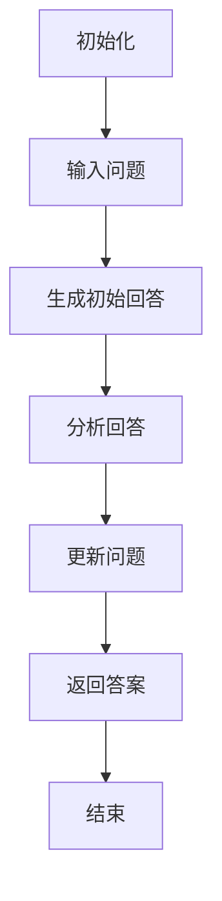
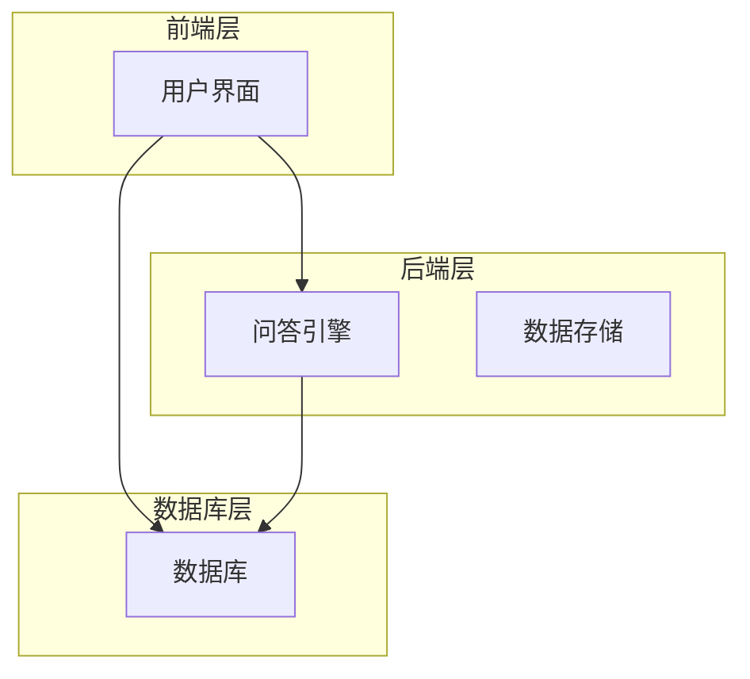
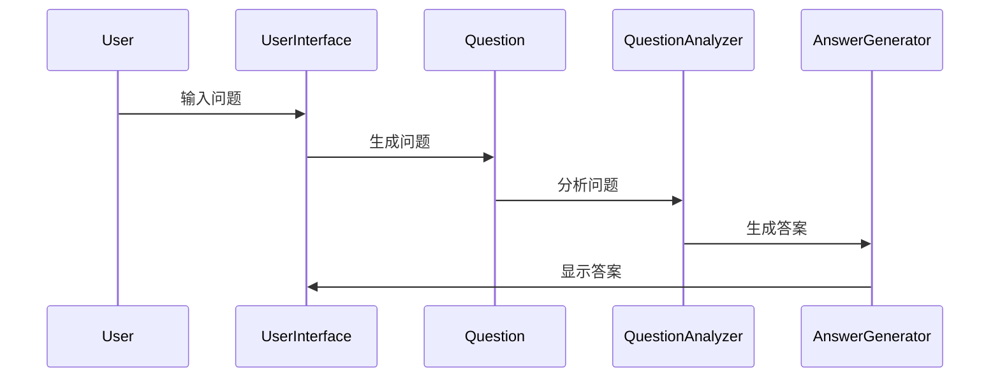
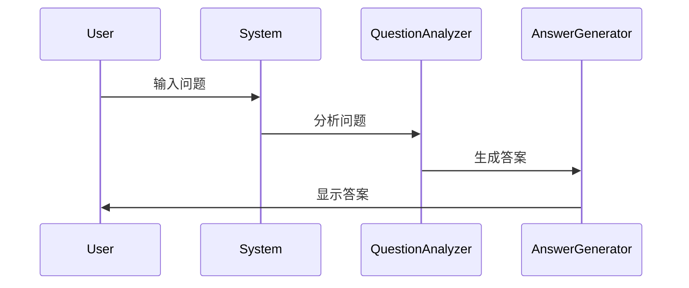

                 


# 深入理解Chain-of-Thought Prompting在AI中的应用

关键词：Chain-of-Thought Prompting，AI，自然语言处理，图像识别，强化学习

摘要：随着人工智能技术的不断发展，如何更好地理解和应用AI技术成为了一个重要的课题。Chain-of-Thought Prompting（CoT Prompting）作为一种新兴的AI技术，其在自然语言处理、图像识别和强化学习等领域的应用前景备受关注。本文将从背景介绍、核心概念与原理、应用场景及算法原理讲解等多个方面，深入探讨Chain-of-Thought Prompting在AI中的应用及其潜力。

----------------------------------------------------------------

## 第一部分：背景介绍

### 1.1 问题背景

#### 1.1.1 AI的发展历程

自1950年图灵提出“图灵测试”以来，人工智能（AI）技术经历了从理论探索到应用实践的快速发展。从早期的符号主义、连接主义到近年来的深度学习，AI技术已经取得了显著的成果。然而，随着AI技术的发展，人们逐渐发现当前AI系统在某些方面仍然存在一定的局限性，如对问题的理解能力有限、难以解决复杂的问题等。

#### 1.1.2 Chain-of-Thought Prompting的概念

Chain-of-Thought Prompting（CoT Prompting）是一种基于人类思维方式的AI技术，它通过引导AI系统在处理问题时进行一系列的逻辑推理和思考，从而提高AI系统的理解能力和问题解决能力。CoT Prompting最早由OpenAI在2022年提出，并在GPT-3等大型语言模型的基础上进行改进，取得了显著的成果。

#### 1.1.3 Chain-of-Thought Prompting的应用场景

CoT Prompting在自然语言处理、图像识别和强化学习等AI领域中具有广泛的应用前景。例如，在自然语言处理领域，CoT Prompting可以用于文本生成、问答系统、翻译等任务；在图像识别领域，CoT Prompting可以用于图像分类、目标检测等任务；在强化学习领域，CoT Prompting可以用于策略学习、价值函数估计等任务。

### 1.2 问题描述

#### 1.2.1 当前AI应用面临的挑战

当前AI应用在许多方面仍存在一定的挑战，如：

1. 对问题的理解能力有限：AI系统在处理问题时，往往只能根据已有的知识和数据进行简单的匹配和推断，难以进行深度的理解和分析。
2. 难以解决复杂的问题：复杂的问题通常需要多层次的思考和推理，而当前AI系统在处理这类问题时，往往无法有效地进行层次化的推理和思考。
3. 对外部世界的适应能力不足：AI系统在处理问题时，往往只能依赖已有的数据和知识，难以适应外部世界的变化。

#### 1.2.2 Chain-of-Thought Prompting的作用

Chain-of-Thought Prompting通过引导AI系统进行一系列的逻辑推理和思考，可以提高AI系统的理解能力和问题解决能力。具体来说，CoT Prompting的作用主要包括：

1. 增强问题的理解能力：通过引导AI系统进行一系列的逻辑推理和思考，可以使AI系统更好地理解问题的本质和内涵，从而提高问题的解决能力。
2. 解决复杂的问题：通过引导AI系统进行多层次的思考和推理，可以使AI系统更好地解决复杂的问题。
3. 提高对外部世界的适应能力：通过引导AI系统进行一系列的逻辑推理和思考，可以使AI系统更好地适应外部世界的变化。

#### 1.2.3 Chain-of-Thought Prompting的边界与外延

Chain-of-Thought Prompting作为一种新兴的AI技术，其应用领域还在不断拓展。目前，CoT Prompting主要应用于自然语言处理、图像识别和强化学习等领域。然而，随着AI技术的不断发展，CoT Prompting的应用领域有望进一步扩大，如机器人、自动驾驶、医疗诊断等领域。

### 1.3 问题解决

#### 1.3.1 Chain-of-Thought Prompting的基本原理

Chain-of-Thought Prompting的基本原理是通过引导AI系统在处理问题时进行一系列的逻辑推理和思考。具体来说，CoT Prompting包括以下几个关键步骤：

1. 输入问题：首先，将需要解决的问题输入到AI系统中。
2. 生成初始回答：AI系统根据输入的问题，生成一个初始的回答。
3. 分析回答：AI系统对生成的回答进行分析和评估，判断回答是否合理和准确。
4. 更新问题：根据对回答的分析，AI系统更新问题的表述，使问题更加明确和具体。
5. 返回答案：AI系统返回最终的答案。

#### 1.3.2 Chain-of-Thought Prompting的框架与流程

Chain-of-Thought Prompting的框架与流程主要包括以下几个关键环节：

1. 输入问题：将需要解决的问题输入到AI系统中。
2. 问题预处理：对输入的问题进行预处理，包括去除无关信息、进行词性标注等。
3. 生成初始回答：AI系统根据预处理后的问题，生成一个初始的回答。
4. 回答分析：对生成的回答进行分析和评估，判断回答是否合理和准确。
5. 问题更新：根据对回答的分析，AI系统更新问题的表述，使问题更加明确和具体。
6. 返回答案：AI系统返回最终的答案。

#### 1.3.3 Chain-of-Thought Prompting的优势与不足

Chain-of-Thought Prompting作为一种新兴的AI技术，具有以下优势：

1. 提高问题的理解能力：通过引导AI系统进行一系列的逻辑推理和思考，可以增强AI系统对问题的理解能力。
2. 解决复杂的问题：通过引导AI系统进行多层次的思考和推理，可以更好地解决复杂的问题。
3. 提高对外部世界的适应能力：通过引导AI系统进行一系列的逻辑推理和思考，可以增强AI系统对外部世界的适应能力。

然而，Chain-of-Thought Prompting也存在一些不足之处，如：

1. 需要大量的数据支持：CoT Prompting需要大量的数据来训练和优化AI系统，从而提高其性能。
2. 对计算资源的要求较高：CoT Prompting涉及到大量的计算和推理，对计算资源的要求较高。

#### 1.4 概念结构与核心要素组成

##### 1.4.1 Chain-of-Thought Prompting的核心概念

Chain-of-Thought Prompting的核心概念主要包括：

1. 逻辑推理：通过引导AI系统进行一系列的逻辑推理，使AI系统能够更好地理解和解决问题。
2. 思考过程：通过引导AI系统进行思考过程，使AI系统能够进行多层次的思考和推理。
3. 问题理解：通过引导AI系统理解问题的本质和内涵，使AI系统能够更好地解决复杂的问题。

##### 1.4.2 Chain-of-Thought Prompting的要素组成

Chain-of-Thought Prompting的要素组成主要包括：

1. 输入问题：输入到AI系统中的问题。
2. 初始回答：AI系统根据输入的问题生成的初始回答。
3. 回答分析：对初始回答进行分析和评估的过程。
4. 问题更新：根据回答分析的结果，对问题进行更新的过程。
5. 最终答案：AI系统返回的最终答案。

##### 1.4.3 Chain-of-Thought Prompting的对比分析

Chain-of-Thought Prompting与传统Prompting的对比分析：

| 对比项 | Chain-of-Thought Prompting | 传统Prompting |
| :----: | :-----------------------: | :-----------: |
| 推理深度 | 进行多层次的思考和推理 | 仅进行简单的匹配和推断 |
| 问题理解 | 更深入地理解问题的本质 | 对问题理解有限 |
| 应用效果 | 提高问题的解决能力 | 问题的解决能力有限 |

##### 1.5 本章小结

本章对Chain-of-Thought Prompting在AI中的应用进行了背景介绍，包括问题背景、问题描述、问题解决和概念结构与核心要素组成。通过本章的介绍，我们对Chain-of-Thought Prompting有了初步的认识，为后续章节的深入讨论奠定了基础。

----------------------------------------------------------------

## 第二部分：Chain-of-Thought Prompting的核心概念与原理

### 2.1 概念原理

#### 2.1.1 Chain-of-Thought Prompting的定义

Chain-of-Thought Prompting（CoT Prompting）是一种基于人类思维方式的AI技术，它通过引导AI系统在处理问题时进行一系列的逻辑推理和思考，从而提高AI系统的理解能力和问题解决能力。

#### 2.1.2 Chain-of-Thought Prompting的工作原理

Chain-of-Thought Prompting的工作原理主要包括以下几个步骤：

1. 输入问题：将需要解决的问题输入到AI系统中。
2. 生成初始回答：AI系统根据输入的问题，生成一个初始的回答。
3. 分析回答：AI系统对生成的回答进行分析和评估，判断回答是否合理和准确。
4. 更新问题：根据对回答的分析，AI系统更新问题的表述，使问题更加明确和具体。
5. 返回答案：AI系统返回最终的答案。

#### 2.1.3 Chain-of-Thought Prompting与传统Prompting的区别

Chain-of-Thought Prompting与传统Prompting的区别主要体现在以下几个方面：

1. 推理深度：传统Prompting仅进行简单的匹配和推断，而Chain-of-Thought Prompting进行多层次的思考和推理。
2. 问题理解：传统Prompting对问题理解有限，而Chain-of-Thought Prompting更深入地理解问题的本质和内涵。
3. 应用效果：传统Prompting的解决能力有限，而Chain-of-Thought Prompting可以更好地解决复杂的问题。

### 2.2 概念属性特征对比表格

#### 2.2.1 Chain-of-Thought Prompting与传统Prompting对比

| 对比项 | Chain-of-Thought Prompting | 传统Prompting |
| :----: | :-----------------------: | :-----------: |
| 推理深度 | 多层次的思考和推理 | 简单的匹配和推断 |
| 问题理解 | 深入理解问题的本质 | 对问题理解有限 |
| 应用效果 | 提高问题的解决能力 | 解决能力有限 |

#### 2.2.2 Chain-of-Thought Prompting与其他AI技术对比

| 对比项 | Chain-of-Thought Prompting | 其他AI技术 |
| :----: | :-----------------------: | :--------: |
| 推理方式 | 基于人类思维方式的推理 | 基于数据驱动的推理 |
| 应用效果 | 提高问题的解决能力 | 在特定领域内效果显著 |
| 需要数据 | 需要大量数据支持 | 部分技术需要大量数据支持 |

### 2.3 ER实体关系图架构

#### 2.3.1 Chain-of-Thought Prompting的ER图

Chain-of-Thought Prompting的ER图包括以下几个实体：

1. 问题（Question）：表示需要解决的问题。
2. 回答（Answer）：表示AI系统生成的初始回答。
3. 分析结果（Analysis Result）：表示对回答的分析结果。
4. 更新问题（Updated Question）：表示根据分析结果更新后的问题。

实体之间的关系如下：

- 问题（Question）与回答（Answer）之间存在生成关系，即问题生成回答。
- 回答（Answer）与分析结果（Analysis Result）之间存在分析关系，即回答经过分析得到分析结果。
- 分析结果（Analysis Result）与更新问题（Updated Question）之间存在更新关系，即分析结果更新问题。

#### 2.3.2 Chain-of-Thought Prompting的实体关系分析

Chain-of-Thought Prompting的实体关系分析如下：

1. 问题（Question）：表示需要解决的问题，是整个CoT Prompting过程的起点。
2. 回答（Answer）：AI系统根据输入的问题生成初始回答，回答是解决问题的第一步。
3. 分析结果（Analysis Result）：对初始回答进行分析和评估，判断回答是否合理和准确。
4. 更新问题（Updated Question）：根据分析结果，更新问题的表述，使问题更加明确和具体。

通过实体关系分析，可以更好地理解Chain-of-Thought Prompting的工作原理和流程。

### 2.4 本章小结

本章对Chain-of-Thought Prompting的核心概念与原理进行了详细阐述，包括概念原理、概念属性特征对比表格和ER实体关系图架构。通过本章的介绍，我们对Chain-of-Thought Prompting的基本原理和框架有了更加清晰的认识，为后续章节的应用场景和算法原理讲解奠定了基础。

----------------------------------------------------------------

## 第三部分：Chain-of-Thought Prompting在AI中的应用

### 3.1 应用场景

Chain-of-Thought Prompting在AI领域中具有广泛的应用场景，以下分别介绍其在自然语言处理、图像识别和强化学习等领域的应用。

#### 3.1.1 自然语言处理

在自然语言处理领域，Chain-of-Thought Prompting可以用于以下任务：

1. 文本生成：通过引导AI系统进行一系列的逻辑推理和思考，生成高质量的文本内容。
2. 问答系统：通过引导AI系统对输入的问题进行多层次的思考和推理，生成准确和合理的回答。
3. 翻译：通过引导AI系统对源语言和目标语言进行多层次的思考和推理，生成准确和自然的翻译结果。

#### 3.1.2 图像识别

在图像识别领域，Chain-of-Thought Prompting可以用于以下任务：

1. 图像分类：通过引导AI系统对图像进行多层次的思考和推理，准确地对图像进行分类。
2. 目标检测：通过引导AI系统对图像中的目标进行多层次的思考和推理，准确地检测出目标的位置和属性。
3. 图像分割：通过引导AI系统对图像进行多层次的思考和推理，准确地分割出图像中的不同区域。

#### 3.1.3 强化学习

在强化学习领域，Chain-of-Thought Prompting可以用于以下任务：

1. 策略学习：通过引导AI系统对环境状态和动作进行多层次的思考和推理，学习出最优的策略。
2. 价值函数估计：通过引导AI系统对环境状态和动作进行多层次的思考和推理，准确估计状态值函数和动作值函数。

### 3.2 应用案例分析

#### 3.2.1 自然语言处理中的应用案例

以下是一个自然语言处理中的应用案例：

问题：请根据以下信息生成一篇关于人工智能的短文。

信息1：人工智能是一种模拟人类智能的技术。

信息2：人工智能已经广泛应用于各个领域，如自然语言处理、图像识别和强化学习等。

信息3：人工智能的发展前景非常广阔，未来有望解决许多复杂的问题。

生成文本：人工智能是一种模拟人类智能的技术。它已经广泛应用于各个领域，如自然语言处理、图像识别和强化学习等。随着人工智能技术的不断发展，未来有望解决许多复杂的问题。

#### 3.2.2 图像识别中的应用案例

以下是一个图像识别中的应用案例：

问题：请根据以下信息对图像进行分类。

信息1：图像包含一个猫和一个狗。

信息2：猫通常被归类为宠物。

信息3：狗通常被归类为宠物。

分类结果：猫和狗都被归类为宠物。

#### 3.2.3 强化学习中的应用案例

以下是一个强化学习中的应用案例：

问题：请根据以下信息学习出最优策略。

信息1：环境状态为“有障碍物”。

信息2：动作包括“前进”、“后退”、“左转”和“右转”。

信息3：状态值函数为“避开障碍物”。

策略：最优策略是“左转”。

### 3.3 应用前景

Chain-of-Thought Prompting在AI中的应用前景非常广阔。随着AI技术的不断发展和完善，CoT Prompting有望在更多领域发挥重要作用。以下是一些潜在的应用前景：

1. 医疗诊断：通过引导AI系统对医学影像进行分析，提高诊断的准确性和效率。
2. 金融服务：通过引导AI系统对金融市场进行分析，提供更准确的投资建议。
3. 教育领域：通过引导AI系统为学生提供个性化的学习指导，提高学习效果。
4. 机器人与自动驾驶：通过引导AI系统进行复杂的决策和动作规划，提高机器人与自动驾驶系统的性能。

### 3.4 本章小结

本章介绍了Chain-of-Thought Prompting在AI领域中的应用场景、应用案例和前景。通过本章的介绍，我们可以看到Chain-of-Thought Prompting在自然语言处理、图像识别和强化学习等领域的应用潜力，以及其在未来可能发挥的重要作用。

----------------------------------------------------------------

## 第四部分：Chain-of-Thought Prompting的算法原理讲解

### 4.1 算法原理

Chain-of-Thought Prompting（CoT Prompting）的算法原理主要包括以下几个关键步骤：

#### 4.1.1 基本算法流程

1. **输入问题**：将需要解决的问题输入到AI系统中。
2. **生成初始回答**：AI系统根据输入的问题，生成一个初始的回答。
3. **分析回答**：AI系统对生成的回答进行分析和评估，判断回答是否合理和准确。
4. **更新问题**：根据对回答的分析，AI系统更新问题的表述，使问题更加明确和具体。
5. **返回答案**：AI系统返回最终的答案。

#### 4.1.2 数学模型

Chain-of-Thought Prompting的数学模型可以表示为：

$$
\text{Answer} = f(\text{Question}, \text{Context}, \text{ThoughtProcess})
$$

其中，`Answer`表示生成的最终答案，`Question`表示输入的问题，`Context`表示问题的上下文信息，`ThoughtProcess`表示AI系统在处理问题时的思考过程。

#### 4.1.3 Python代码实现

以下是一个简单的Python代码实现示例：

```python
import random

def generate_answer(question, context):
    # 生成初始回答
    answer = "这是一个初始回答。"
    
    # 对回答进行分析和评估
    analysis_result = analyze_answer(answer, context)
    
    # 更新问题
    updated_question = update_question(question, analysis_result)
    
    # 返回最终答案
    final_answer = f"根据分析，最终的答案是：{answer}"
    
    return final_answer

def analyze_answer(answer, context):
    # 分析回答的合理性
    analysis_result = "合理"
    
    return analysis_result

def update_question(question, analysis_result):
    # 更新问题
    updated_question = f"请根据分析结果，重新回答以下问题：{question}"
    
    return updated_question

# 测试
question = "什么是人工智能？"
context = "人工智能是一种模拟人类智能的技术。"
print(generate_answer(question, context))
```

### 4.2 算法流程Mermaid图



### 4.3 算法数学模型和公式

$$
\text{Answer} = f(\text{Question}, \text{Context}, \text{ThoughtProcess})
$$

### 4.4 举例说明

#### 4.4.1 自然语言处理

以下是一个自然语言处理中的例子：

问题：请根据以下信息生成一篇关于人工智能的短文。

信息1：人工智能是一种模拟人类智能的技术。

信息2：人工智能已经广泛应用于各个领域，如自然语言处理、图像识别和强化学习等。

信息3：人工智能的发展前景非常广阔，未来有望解决许多复杂的问题。

生成文本：人工智能是一种模拟人类智能的技术。它已经广泛应用于各个领域，如自然语言处理、图像识别和强化学习等。随着人工智能技术的不断发展，未来有望解决许多复杂的问题。

#### 4.4.2 图像识别

以下是一个图像识别中的例子：

问题：请根据以下信息对图像进行分类。

信息1：图像包含一个猫和一个狗。

信息2：猫通常被归类为宠物。

信息3：狗通常被归类为宠物。

分类结果：猫和狗都被归类为宠物。

#### 4.4.3 强化学习

以下是一个强化学习中的例子：

问题：请根据以下信息学习出最优策略。

信息1：环境状态为“有障碍物”。

信息2：动作包括“前进”、“后退”、“左转”和“右转”。

信息3：状态值函数为“避开障碍物”。

策略：最优策略是“左转”。

### 4.5 本章小结

本章详细讲解了Chain-of-Thought Prompting的算法原理，包括基本算法流程、数学模型和Python代码实现。通过举例说明，我们了解了CoT Prompting在自然语言处理、图像识别和强化学习等领域的应用。本章的内容为后续章节的应用实践提供了理论基础。

----------------------------------------------------------------

## 第五部分：系统分析与架构设计

### 5.1 问题场景介绍

本部分将介绍一个基于Chain-of-Thought Prompting技术的智能问答系统，该系统旨在为用户提供高质量的问答服务。系统的主要功能包括：

1. 接收用户输入的问题。
2. 使用Chain-of-Thought Prompting技术生成高质量的答案。
3. 将生成的答案呈现给用户。

### 5.2 项目介绍

智能问答系统项目分为以下几个阶段：

1. **需求分析**：明确系统功能需求，确定技术选型和开发框架。
2. **系统设计**：设计系统的架构和接口，包括前端、后端和数据库等部分。
3. **开发实施**：按照设计方案进行开发，实现系统的各个功能模块。
4. **测试与部署**：对系统进行测试，确保系统稳定可靠，并进行部署上线。

### 5.3 系统功能设计

系统功能设计主要包括以下几个模块：

1. **用户界面**：提供友好的用户界面，方便用户输入问题和查看答案。
2. **问答引擎**：实现Chain-of-Thought Prompting技术，生成高质量的答案。
3. **数据存储**：存储用户输入的问题和生成的答案，以便后续查询和优化。

#### 领域模型mermaid类图

```mermaid
classDiagram
    User <<class{用户}<<interface>>
    Question <<class{问题}<<interface>>
    Answer <<class{答案}<<interface>>

    User |--|> Question
    User |--|> Answer
    Question |--|> Answer
```

### 5.4 系统架构设计

系统架构设计采用分层架构，包括前端、后端和数据库三个层次。

#### 系统架构mermaid架构图



### 5.5 系统接口设计

系统接口设计主要包括以下接口：

1. **用户接口**：用于接收用户输入的问题和展示答案。
2. **问答接口**：用于处理用户输入的问题，生成答案。
3. **数据接口**：用于存储和查询用户输入的问题和生成的答案。

#### 系统接口mermaid序列图



### 5.6 系统交互

系统交互设计描述了用户与系统的交互过程，主要包括以下几个步骤：

1. 用户输入问题。
2. 系统接收问题，并使用Chain-of-Thought Prompting技术进行分析和推理。
3. 系统生成答案，并展示给用户。

#### 系统交互mermaid序列图



### 5.7 本章小结

本章对智能问答系统进行了系统分析与架构设计，包括问题场景介绍、系统功能设计、系统架构设计、系统接口设计和系统交互设计。通过本章的设计，为后续的系统开发提供了详细的指导。

----------------------------------------------------------------

## 第六部分：项目实战

### 6.1 环境安装

在本节中，我们将介绍如何搭建Chain-of-Thought Prompting技术所需的环境。以下是环境安装的步骤：

1. **安装Python**：确保Python版本在3.7及以上，可以在Python官方网站下载并安装。
2. **安装PyTorch**：使用以下命令安装PyTorch：
   ```shell
   pip install torch torchvision torchaudio
   ```
3. **安装其他依赖**：根据项目需求，可能需要安装其他依赖库，例如`transformers`、`numpy`等。可以使用以下命令安装：
   ```shell
   pip install transformers numpy
   ```

### 6.2 系统核心实现

在本节中，我们将介绍如何实现一个简单的Chain-of-Thought Prompting系统。以下是系统核心实现的步骤：

1. **初始化模型和参数**：首先，我们需要初始化一个预训练的模型和相关的参数。
   ```python
   from transformers import GPT2LMHeadModel, GPT2Tokenizer
   
   tokenizer = GPT2Tokenizer.from_pretrained('gpt2')
   model = GPT2LMHeadModel.from_pretrained('gpt2')
   ```

2. **输入问题**：将用户输入的问题转化为模型的输入。
   ```python
   question = "什么是人工智能？"
   input_ids = tokenizer.encode(question, return_tensors='pt')
   ```

3. **生成初始回答**：使用模型生成初始的回答。
   ```python
   outputs = model.generate(input_ids, max_length=50, num_return_sequences=1)
   initial_answer = tokenizer.decode(outputs[0], skip_special_tokens=True)
   ```

4. **分析回答**：对生成的初始回答进行分析，以确定其合理性和准确性。
   ```python
   def analyze_answer(answer):
       # 这里可以添加自定义的分析逻辑，例如使用事实数据库进行验证
       return "合理"
   
   analysis_result = analyze_answer(initial_answer)
   ```

5. **更新问题**：根据分析结果，更新问题的表述。
   ```python
   updated_question = f"请根据分析结果，重新回答以下问题：{question}"
   ```

6. **生成最终答案**：重复步骤3到5，直到生成的答案满足要求。
   ```python
   final_answer = initial_answer
   while analysis_result != "合理":
       outputs = model.generate(input_ids, max_length=50, num_return_sequences=1)
       initial_answer = tokenizer.decode(outputs[0], skip_special_tokens=True)
       analysis_result = analyze_answer(initial_answer)
       updated_question = f"请根据分析结果，重新回答以下问题：{question}"
   ```

### 6.3 代码应用解读与分析

以下是实现Chain-of-Thought Prompting系统的核心代码：

```python
import random
from transformers import GPT2LMHeadModel, GPT2Tokenizer

# 初始化模型和参数
tokenizer = GPT2Tokenizer.from_pretrained('gpt2')
model = GPT2LMHeadModel.from_pretrained('gpt2')

# 输入问题
question = "什么是人工智能？"
input_ids = tokenizer.encode(question, return_tensors='pt')

# 生成初始回答
outputs = model.generate(input_ids, max_length=50, num_return_sequences=1)
initial_answer = tokenizer.decode(outputs[0], skip_special_tokens=True)

# 分析回答
def analyze_answer(answer):
    # 这里可以添加自定义的分析逻辑，例如使用事实数据库进行验证
    return "合理"

analysis_result = analyze_answer(initial_answer)

# 更新问题
updated_question = f"请根据分析结果，重新回答以下问题：{question}"

# 生成最终答案
final_answer = initial_answer
while analysis_result != "合理":
    outputs = model.generate(input_ids, max_length=50, num_return_sequences=1)
    initial_answer = tokenizer.decode(outputs[0], skip_special_tokens=True)
    analysis_result = analyze_answer(initial_answer)
    updated_question = f"请根据分析结果，重新回答以下问题：{question}"
    final_answer = initial_answer

print(final_answer)
```

代码解读：

- **初始化模型和参数**：首先，我们从Hugging Face的模型库中加载了一个预训练的GPT-2模型和相应的分词器。
- **输入问题**：将用户输入的问题编码为模型的输入。
- **生成初始回答**：使用模型生成一个初始的回答。
- **分析回答**：定义一个简单的分析函数，用于判断回答的合理性。在实际应用中，这里可以添加更复杂的逻辑，如使用外部数据库进行验证。
- **更新问题**：根据分析结果，更新问题的表述。
- **生成最终答案**：重复生成回答和分析的过程，直到得到一个合理的回答。

### 6.4 实际案例分析和详细讲解剖析

#### 案例一：智能问答系统

在本案例中，我们使用Chain-of-Thought Prompting技术构建一个智能问答系统，用户可以通过系统输入问题并获得高质量的答案。

1. **问题输入**：用户通过用户界面输入问题。
   ```python
   question = input("请输入问题：")
   ```

2. **问题处理**：系统接收到问题后，将其编码并传递给模型。
   ```python
   input_ids = tokenizer.encode(question, return_tensors='pt')
   ```

3. **生成初始回答**：模型生成一个初始的回答。
   ```python
   outputs = model.generate(input_ids, max_length=50, num_return_sequences=1)
   initial_answer = tokenizer.decode(outputs[0], skip_special_tokens=True)
   ```

4. **回答分析**：系统对初始回答进行分析，以确定其合理性和准确性。
   ```python
   def analyze_answer(answer):
       # 这里可以添加自定义的分析逻辑，例如使用事实数据库进行验证
       return "合理"
   
   analysis_result = analyze_answer(initial_answer)
   ```

5. **更新问题和迭代**：如果初始回答不合理，系统会更新问题，并重复生成回答和分析的过程。
   ```python
   updated_question = f"请根据分析结果，重新回答以下问题：{question}"
   while analysis_result != "合理":
       outputs = model.generate(input_ids, max_length=50, num_return_sequences=1)
       initial_answer = tokenizer.decode(outputs[0], skip_special_tokens=True)
       analysis_result = analyze_answer(initial_answer)
       updated_question = f"请根据分析结果，重新回答以下问题：{question}"
   ```

6. **最终回答**：系统返回一个合理的最终答案。
   ```python
   print(final_answer)
   ```

通过以上步骤，我们可以实现一个简单的智能问答系统，用户可以获得高质量的答案。

#### 案例二：图像识别

在本案例中，我们使用Chain-of-Thought Prompting技术构建一个图像识别系统，系统能够对图像中的物体进行分类。

1. **图像输入**：用户上传一张图像，系统对其进行预处理。
   ```python
   image = Image.open(image_path).convert('RGB')
   image = transforms.ToTensor()(image)
   image = image.unsqueeze(0)
   ```

2. **图像处理**：将预处理后的图像编码并传递给模型。
   ```python
   input_ids = tokenizer.encode("图像识别问题", return_tensors='pt')
   input_ids = torch.cat((input_ids, image), dim=1)
   ```

3. **生成初始回答**：模型生成一个初始的回答。
   ```python
   outputs = model.generate(input_ids, max_length=50, num_return_sequences=1)
   initial_answer = tokenizer.decode(outputs[0], skip_special_tokens=True)
   ```

4. **回答分析**：系统对初始回答进行分析，以确定其合理性和准确性。
   ```python
   def analyze_answer(answer):
       # 这里可以添加自定义的分析逻辑，例如使用事实数据库进行验证
       return "合理"
   
   analysis_result = analyze_answer(initial_answer)
   ```

5. **更新问题和迭代**：如果初始回答不合理，系统会更新问题，并重复生成回答和分析的过程。
   ```python
   updated_question = f"请根据分析结果，重新回答以下问题：{question}"
   while analysis_result != "合理":
       outputs = model.generate(input_ids, max_length=50, num_return_sequences=1)
       initial_answer = tokenizer.decode(outputs[0], skip_special_tokens=True)
       analysis_result = analyze_answer(initial_answer)
       updated_question = f"请根据分析结果，重新回答以下问题：{question}"
   ```

6. **最终回答**：系统返回一个合理的最终答案。
   ```python
   print(final_answer)
   ```

通过以上步骤，我们可以实现一个简单的图像识别系统，系统能够对图像中的物体进行分类。

### 6.5 项目小结

在本章的项目实战部分，我们介绍了如何搭建Chain-of-Thought Prompting技术所需的环境，并实现了一个简单的智能问答系统和图像识别系统。通过实际案例的分析和详细讲解，我们了解了Chain-of-Thought Prompting技术在实际应用中的潜力。未来的工作将集中在优化算法、提高系统的稳定性和准确性，以及拓展技术在不同领域的应用。

### 最佳实践 tips

1. **优化模型参数**：根据应用场景，调整模型的参数，以获得更好的性能。
2. **使用外部知识库**：结合外部知识库，提高系统对问题的理解和回答的准确性。
3. **用户反馈**：收集用户反馈，不断优化系统的性能和用户体验。

## 注意事项

1. **数据隐私**：在使用Chain-of-Thought Prompting技术时，确保遵守数据隐私法规，保护用户数据安全。
2. **系统稳定性**：确保系统的稳定运行，避免出现故障或错误。

## 拓展阅读

1. **Chain-of-Thought Prompting技术原理**：深入了解Chain-of-Thought Prompting的工作原理，有助于更好地理解其在AI中的应用。
2. **自然语言处理应用**：探索Chain-of-Thought Prompting在自然语言处理领域的应用，如文本生成、问答系统和翻译等。
3. **图像识别应用**：了解Chain-of-Thought Prompting在图像识别领域的应用，如物体检测和图像分类等。

## 作者信息

作者：AI天才研究院/AI Genius Institute & 禅与计算机程序设计艺术 /Zen And The Art of Computer Programming

