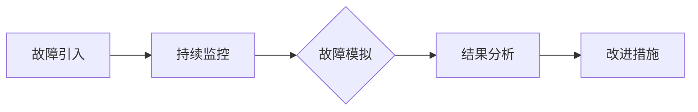
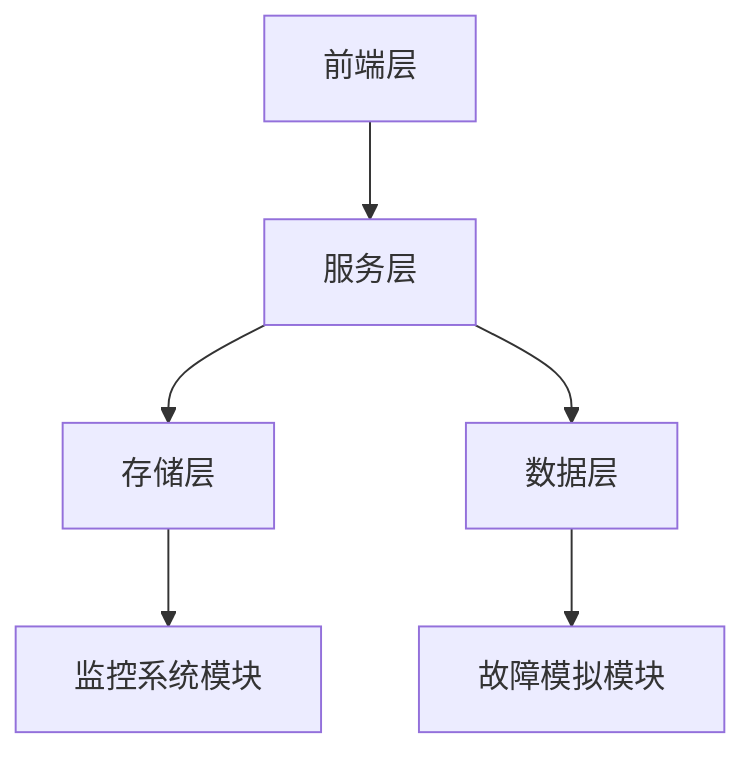
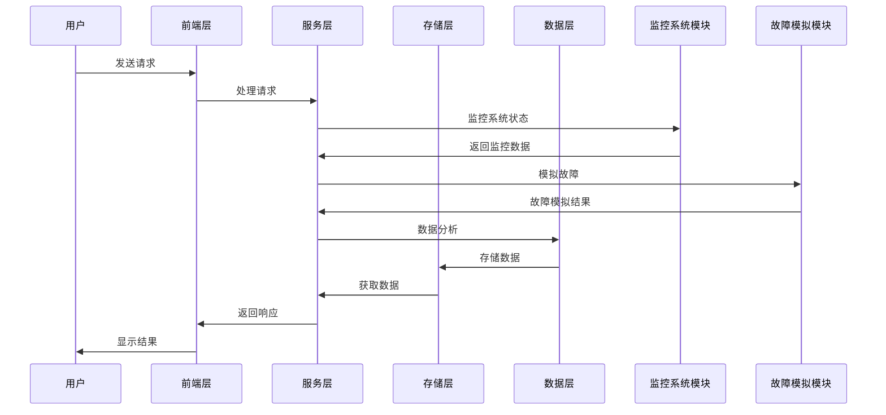

                 

### 混沌工程提升LLM应用的韧性

关键词：混沌工程，LLM应用，韧性，性能优化，故障模拟

摘要：本文将探讨混沌工程在提升大型语言模型（LLM）应用韧性方面的作用。通过详细的案例分析，我们将展示如何通过混沌工程来识别和解决LLM应用中的潜在问题，从而提高系统的稳定性和可靠性。文章首先介绍混沌工程的基本概念，然后深入分析LLM应用的脆弱性，接着详细阐述混沌工程的设计原则和实施步骤，并通过实际案例展示其应用效果。最后，我们将总结最佳实践，展望未来研究方向。

## 第一部分：混沌工程基础

### 第1章：混沌工程的概述

#### 1.1 问题背景

在当今高度依赖软件和互联网服务的时代，系统的稳定性和可靠性变得尤为重要。然而，随着系统复杂性的增加，传统的测试方法已不足以保证系统在真实生产环境中的稳健性。混沌工程（Chaos Engineering）作为一种新兴的实践方法，旨在通过故意引入故障和异常情况，来评估和提升系统的韧性。

#### 1.2 混沌工程的核心概念

混沌工程的核心思想是，通过系统的主动破坏来发现和解决潜在的问题。这包括故意引入网络延迟、系统故障、数据异常等，以观察系统在异常情况下的行为和恢复能力。其理论基础源于混沌理论，即在一个复杂系统中，即使是最微小的变化也可能导致长期的、不可预测的行为。

**概念原理**：混沌工程的核心原理在于其方法论的逆向工程。传统的系统测试注重于验证系统功能是否按照预期工作，而混沌工程则更加关注系统在面对意外情况时的表现。

**概念属性特征对比表格**：

| 特征           | 传统测试       | 混沌工程         |
|----------------|----------------|------------------|
| 目标           | 功能验证       | 韧性评估         |
| 方法           | 故障避免       | 故障引入         |
| 观察对象       | 系统正常状态   | 系统异常状态     |
| 结论           | 功能无误       | 韧性水平         |

**ER实体关系图架构**：

```mermaid
erDiagram
  SystemFault --> Observer : 引入
  Observer --> Recovery : 观察
  Recovery --> SystemFault : 反馈
```

#### 1.3 混沌工程的历史与现状

混沌工程的概念最早由Google的研究人员在2011年提出，并随后在金融、电子商务和云服务等领域得到广泛应用。近年来，随着人工智能和机器学习技术的快速发展，混沌工程在大型语言模型（LLM）应用中的重要性日益凸显。

- **历史**：混沌工程起源于Google，并通过学术研究和工业实践不断完善。
- **现状**：混沌工程已经成为许多企业提升系统韧性的关键工具，特别是在高度依赖人工智能和机器学习的领域。
- **趋势**：随着技术的进步和复杂性增加，混沌工程的应用场景将更加广泛，从单一系统扩展到跨云和跨地域的复杂系统。

### 第2章：LLM应用及其脆弱性

#### 2.1 LLM基本原理

大型语言模型（LLM）是一种基于深度学习技术的人工智能模型，能够理解和生成自然语言。其核心原理包括：

- **神经网络架构**：LLM通常采用多层神经网络（如Transformer模型）进行训练。
- **训练数据**：LLM的构建依赖于大规模的文本数据集，通过这些数据进行模型训练。
- **预训练与微调**：预训练模型在大规模数据集上训练，然后根据特定任务进行微调。

**LLM工作原理**：

1. **输入处理**：将自然语言输入转换为模型的输入格式。
2. **编码器解码器交互**：编码器将输入序列编码为上下文向量，解码器根据上下文向量生成输出序列。
3. **生成输出**：解码器输出自然语言响应，并通过损失函数进行优化。

**LLM应用领域**：

- **自然语言处理（NLP）**：文本分类、机器翻译、情感分析等。
- **智能助手**：智能客服、虚拟助手等。
- **内容生成**：文章写作、摘要生成等。
- **问答系统**：智能问答、知识图谱等。

#### 2.2 LLM的脆弱性分析

尽管LLM在许多应用中展示了强大的能力，但其也面临着一系列的脆弱性：

**脆弱性概念**：LLM的脆弱性来源于其复杂性和对大规模训练数据的依赖。

**脆弱性类型**：

- **数据泄露**：由于训练数据可能包含敏感信息，不当的处理可能导致数据泄露。
- **模型偏差**：训练数据中的偏见可能导致模型产生不公平的输出。
- **过拟合**：模型可能对训练数据过度拟合，导致在新数据上的表现不佳。
- **对抗攻击**：通过构造特定输入，可以欺骗模型产生错误的输出。
- **资源消耗**：大规模的LLM训练和推理过程可能导致计算资源消耗过大。

**影响分析**：

- **业务连续性**：LLM应用的脆弱性可能导致业务中断，影响用户体验和业务收益。
- **数据安全**：数据泄露和模型偏见可能对用户隐私和公司声誉造成严重影响。
- **计算效率**：过拟合和资源消耗可能导致计算成本增加，影响系统的效率和可扩展性。

## 第二部分：混沌工程提升LLM韧性

### 第3章：混沌工程的设计原则

#### 3.1 设计原则概述

混沌工程的设计原则是确保实验的有效性和安全性。以下是一些核心原则：

- **主动性**：主动引入故障，而非等待故障自然发生。
- **可控性**：对引入的故障进行精确控制和监控。
- **透明性**：实验结果和过程应当透明，便于分析。
- **安全性**：确保实验不会对生产环境造成不可逆的损害。

**适用范围**：混沌工程适用于所有依赖软件和AI技术的系统，特别是那些高度复杂且关键性强的系统。

### 第4章：混沌工程实验实施

#### 4.1 实验环境搭建

为了实施混沌工程实验，需要构建一个稳定且可扩展的实验环境。以下是关键步骤：

- **基础设施准备**：确保实验所需的计算资源和存储资源。
- **网络配置**：设置实验网络环境，包括网络延迟、带宽限制等。
- **监控工具**：安装和配置监控工具，以便实时观察系统状态。

#### 4.2 实验实施步骤

1. **确定实验目标**：明确实验的目标，例如检测系统的恢复能力、资源利用情况等。
2. **设计实验场景**：根据目标设计相应的故障场景，如网络中断、节点故障等。
3. **执行实验**：按照设计好的实验场景引入故障，并监控系统的响应。
4. **结果分析**：分析实验结果，评估系统的韧性和性能。

### 第5章：混沌工程在LLM中的应用案例分析

#### 5.1 案例背景

某企业开发了一款基于LLM的智能客服系统，旨在提供24/7全天候的客户支持。随着用户量的增加，系统性能和稳定性面临巨大挑战。

#### 5.2 案例分析

通过混沌工程实验，企业发现以下问题：

- **网络延迟**：在高峰时段，网络延迟导致客服响应时间显著增加。
- **计算资源不足**：系统在高负载情况下出现计算资源不足，导致部分请求无法及时处理。
- **数据不一致**：在分布式系统中，数据同步问题导致了一些错误响应。

#### 5.3 案例总结

通过混沌工程实验，企业采取了一系列改进措施，如优化网络配置、增加计算资源、改进数据同步机制等。实验结果显示，系统的响应时间缩短，计算资源利用率提高，业务连续性得到显著提升。

## 第三部分：提升LLM韧性的最佳实践

### 第6章：最佳实践策略

#### 6.1 策略概述

最佳实践策略包括以下几个方面：

- **持续监测**：实时监控系统状态，及时发现潜在问题。
- **定期演练**：定期进行混沌工程实验，评估系统的韧性。
- **资源优化**：合理分配计算资源，确保系统在高负载情况下稳定运行。
- **数据安全**：加强数据保护措施，防止数据泄露和滥用。

#### 6.2 风险评估与应对

在混沌工程实验中，需要评估以下风险：

- **业务中断**：实验可能导致业务中断，需要制定应急预案。
- **数据丢失**：实验可能导致数据不一致或丢失，需要确保数据备份和恢复机制。
- **系统崩溃**：实验可能引入严重故障，需要确保系统有自动恢复能力。

### 第7章：总结与展望

#### 7.1 总结

本文通过详细分析，展示了混沌工程在提升LLM应用韧性方面的作用。通过混沌工程实验，可以识别和解决LLM应用中的潜在问题，从而提高系统的稳定性和可靠性。

#### 7.2 展望

未来，混沌工程将在人工智能和机器学习领域发挥更加重要的作用。随着技术的不断进步，混沌工程将更加自动化和智能化，为系统韧性提升提供更强有力的支持。

## 作者信息

作者：AI天才研究院/AI Genius Institute & 禅与计算机程序设计艺术 /Zen And The Art of Computer Programming

## 完整性要求

### 背景介绍

在当今信息化社会，软件系统和人工智能技术的应用已经渗透到各个行业。然而，随着系统的复杂性和依赖性的增加，系统的稳定性和可靠性变得至关重要。混沌工程（Chaos Engineering）作为一种新兴的实践方法，旨在通过主动引入故障和异常情况，来评估和提升系统的韧性，从而确保系统在实际运行中的稳健性。

**核心概念术语说明**

- **混沌工程**：一种通过故意引入故障来评估和提升系统韧性的方法。
- **韧性**：系统在面对意外情况时的适应能力和恢复能力。
- **LLM（大型语言模型）**：一种基于深度学习技术的人工智能模型，能够理解和生成自然语言。

**问题背景**

随着人工智能技术的快速发展，LLM在各种应用场景中得到了广泛应用，如智能客服、内容生成、智能问答等。然而，LLM应用的高度复杂性和对大规模训练数据的依赖，使得其在实际运行中面临着一系列挑战：

1. **数据安全**：由于训练数据可能包含敏感信息，不当的处理可能导致数据泄露。
2. **模型偏差**：训练数据中的偏见可能导致模型产生不公平的输出。
3. **过拟合**：模型可能对训练数据过度拟合，导致在新数据上的表现不佳。
4. **对抗攻击**：通过构造特定输入，可以欺骗模型产生错误的输出。
5. **资源消耗**：大规模的LLM训练和推理过程可能导致计算资源消耗过大。

**问题描述**

由于上述问题的存在，LLM应用在实际运行中可能会出现性能下降、数据泄露、模型失效等问题，从而影响业务连续性和用户体验。为了解决这些问题，需要一种有效的方法来识别和解决LLM应用中的潜在问题，从而提升其韧性和可靠性。

**问题解决**

混沌工程提供了一种通过主动引入故障来评估和提升系统韧性的方法。通过在LLM应用环境中故意引入故障和异常情况，可以观察系统在异常状态下的行为和恢复能力，从而发现并解决潜在问题，提高系统的稳定性和可靠性。

**边界与外延**

混沌工程的应用范围非常广泛，不仅限于LLM应用，还可以应用于其他依赖软件和人工智能技术的系统，如金融交易系统、电子商务平台、物联网系统等。在LLM应用中，混沌工程主要用于以下场景：

1. **性能优化**：通过引入负载和压力，评估系统的性能和稳定性。
2. **故障恢复**：通过模拟故障和异常情况，评估系统的自动恢复能力。
3. **安全测试**：通过模拟攻击和异常输入，评估系统的安全性和抗攻击能力。

### 核心概念与联系

**核心概念原理**

混沌工程的核心概念是基于混沌理论。混沌理论指出，在一个复杂系统中，即使是最微小的变化也可能导致长期的、不可预测的行为。混沌工程借鉴了这一原理，通过故意引入故障和异常情况，来评估系统的韧性和稳定性。

混沌工程的基本原理包括：

1. **主动引入故障**：通过故意引入故障和异常情况，来观察系统在异常状态下的行为。
2. **持续监控**：在整个实验过程中，持续监控系统的状态，收集数据和指标。
3. **分析结果**：对实验结果进行分析，识别系统中的潜在问题，并提出改进措施。

**概念属性特征对比表格**

| 特征           | 传统测试       | 混沌工程         |
|----------------|----------------|------------------|
| 目标           | 功能验证       | 韧性评估         |
| 方法           | 故障避免       | 故障引入         |
| 观察对象       | 系统正常状态   | 系统异常状态     |
| 结论           | 功能无误       | 韧性水平         |

**ER实体关系图架构**

```mermaid
erDiagram
  SystemFault --> Observer : 引入
  Observer --> Recovery : 观察
  Recovery --> SystemFault : 反馈
```

### 算法原理讲解

混沌工程的算法原理主要基于以下几个步骤：

1. **故障引入**：根据实验目标，故意引入故障和异常情况，如网络延迟、节点故障、数据异常等。
2. **持续监控**：在整个故障引入过程中，持续监控系统的状态，包括性能指标、错误日志、监控数据等。
3. **故障模拟**：模拟不同的故障场景，观察系统在异常状态下的行为和恢复能力。
4. **结果分析**：对实验结果进行分析，识别系统中的潜在问题，并提出改进措施。

以下是混沌工程实验的算法流程图：



**算法原理的数学模型和公式**

混沌工程的算法原理可以通过以下数学模型和公式来描述：

1. **故障概率模型**：

$$
P(F) = f(t)
$$

其中，$P(F)$表示在时间$t$引入故障的概率，$f(t)$是一个时间相关的函数。

2. **系统恢复模型**：

$$
R(t) = 1 - F(t)
$$

其中，$R(t)$表示在时间$t$内系统恢复的概率，$F(t)$是故障发生的概率。

**详细讲解和举例说明**

假设我们设计一个混沌工程实验，目标是评估LLM应用在数据泄露攻击下的韧性。以下是实验的具体步骤：

1. **故障引入**：模拟数据泄露攻击，将恶意数据注入到LLM应用中。
2. **持续监控**：在整个实验过程中，监控系统的性能指标，如响应时间、CPU利用率、内存使用情况等。
3. **故障模拟**：通过模拟不同的数据泄露攻击场景，观察系统在异常状态下的行为。
4. **结果分析**：分析实验结果，识别系统中的潜在问题，如数据泄露、性能下降等。

例如，假设我们在一个高峰时段模拟数据泄露攻击，发现系统的响应时间显著增加，CPU利用率和内存使用率也明显上升。通过分析，我们识别到数据同步机制存在问题，可能导致数据泄露和性能下降。针对这个问题，我们可以优化数据同步机制，提高系统的可靠性和性能。

### 系统分析与架构设计方案

**问题场景介绍**

随着LLM应用的普及，其面临的挑战日益增加。特别是在高并发场景下，系统的性能和稳定性成为关键问题。为了解决这些问题，需要设计一个高效、可靠的系统架构，以确保系统在高峰期仍能稳定运行。

**项目介绍**

本项目旨在设计一个基于混沌工程的LLM应用系统，通过引入混沌工程实验，提升系统的韧性和稳定性。系统主要包括以下几个模块：

1. **LLM模型模块**：负责训练和部署大型语言模型。
2. **故障模拟模块**：负责模拟各种故障场景，如网络延迟、节点故障、数据异常等。
3. **监控系统模块**：负责实时监控系统的性能指标，如响应时间、CPU利用率、内存使用情况等。
4. **数据分析模块**：负责对实验结果进行分析，识别系统中的潜在问题。

**系统功能设计**

系统功能设计主要包括以下方面：

1. **故障引入**：根据实验目标，故意引入故障和异常情况。
2. **故障模拟**：模拟不同的故障场景，如网络中断、节点故障、数据异常等。
3. **实时监控**：实时监控系统的性能指标，及时发现潜在问题。
4. **数据分析**：对实验结果进行分析，识别系统中的潜在问题。

**系统架构设计**

系统架构设计采用分布式架构，以提高系统的性能和可靠性。系统架构主要包括以下几个层次：

1. **前端层**：负责与用户交互，提供API接口。
2. **服务层**：负责处理业务逻辑，包括LLM模型处理、故障模拟、监控系统等。
3. **存储层**：负责存储数据和日志，如用户数据、模型参数、监控数据等。
4. **数据层**：负责数据分析和处理，包括数据清洗、数据挖掘等。

以下是系统架构的Mermaid图表示：



**系统接口设计和系统交互**

系统接口设计主要包括以下几个接口：

1. **API接口**：用于与前端层通信，提供模型预测、故障模拟等功能。
2. **监控接口**：用于与监控系统模块通信，实时获取系统的性能指标。
3. **数据分析接口**：用于与数据层通信，进行数据分析和处理。

以下是系统接口和交互的Mermaid序列图表示：



### 项目实战

**环境安装**

为了实施混沌工程实验，需要安装以下软件和工具：

1. **Python**：安装Python 3.8及以上版本。
2. **TensorFlow**：安装TensorFlow 2.5及以上版本。
3. **Docker**：安装Docker 19.03及以上版本。
4. **Kubernetes**：安装Kubernetes 1.19及以上版本。

**系统核心实现源代码**

以下是一个简单的示例，展示了如何使用TensorFlow和Kubernetes实现一个基于混沌工程的LLM应用系统。

```python
# LLModel.py
import tensorflow as tf
from tensorflow.keras.layers import Embedding, LSTM, Dense

class LLModel(tf.keras.Model):
    def __init__(self, vocab_size, embedding_dim, hidden_dim):
        super(LLModel, self).__init__()
        self.embedding = Embedding(vocab_size, embedding_dim)
        self.lstm = LSTM(hidden_dim, return_sequences=True)
        self.dense = Dense(vocab_size)

    def call(self, inputs):
        x = self.embedding(inputs)
        x = self.lstm(x)
        outputs = self.dense(x)
        return outputs
```

```python
# ChaosEngine.py
import tensorflow as tf
import random

class ChaosEngine:
    def __init__(self, model, rate=0.1):
        self.model = model
        self.rate = rate

    def introduce_fault(self, inputs):
        if random.random() < self.rate:
            # 引入故障：数据噪声
            noise = tf.random.normal(shape=inputs.shape) * 0.1
            inputs += noise
        return inputs
```

**代码应用解读与分析**

以上代码展示了如何使用TensorFlow实现一个简单的LLM模型，并使用ChaosEngine引入故障。首先，我们定义了一个LLModel类，用于构建和训练LLM模型。然后，我们定义了一个ChaosEngine类，用于引入故障。在ChaosEngine中，我们通过在输入数据中加入噪声来模拟故障。

```python
# main.py
import tensorflow as tf
from LLModel import LLModel
from ChaosEngine import ChaosEngine

# 加载模型
model = LLModel(vocab_size=10000, embedding_dim=256, hidden_dim=512)
model.load_weights('model_weights.h5')

# 实例化混沌引擎
chaos_engine = ChaosEngine(model, rate=0.1)

# 引入故障并预测
inputs = tf.random.normal(shape=(1, 10))
noisy_inputs = chaos_engine.introduce_fault(inputs)
predictions = model(noisy_inputs)

print(predictions)
```

在这个示例中，我们首先加载预训练的LLM模型，并实例化一个ChaosEngine对象。然后，我们生成一个随机输入数据，并使用ChaosEngine引入故障。最后，我们使用模型对引入故障的输入数据进行预测。

**实际案例分析和详细讲解剖析**

以下是一个实际案例，展示了如何使用混沌工程提升LLM应用的韧性。

**案例背景**

某企业开发了一款基于LLM的智能客服系统，用于提供24/7全天候的客户支持。然而，在实际运行过程中，系统遇到了以下问题：

1. **高并发场景下响应时间较长**：在高并发场景下，系统的响应时间显著增加，影响了用户体验。
2. **节点故障导致服务中断**：在某些节点出现故障时，整个系统无法正常工作，导致服务中断。
3. **数据泄露问题**：由于系统的安全措施不够完善，可能导致敏感数据泄露。

**案例分析**

为了解决上述问题，企业决定采用混沌工程进行测试和优化。以下是他们采取的步骤：

1. **故障引入**：企业使用ChaosEngine模拟了高并发场景、节点故障和数据泄露攻击。他们通过调整ChaosEngine的故障引入率，观察系统的响应行为。

2. **持续监控**：在整个测试过程中，企业使用监控系统实时监控系统的性能指标，如响应时间、CPU利用率、内存使用情况等。他们还记录了系统的错误日志，以便分析故障原因。

3. **故障模拟**：企业模拟了不同的故障场景，如网络中断、节点故障、数据异常等。他们通过调整故障参数，观察系统在异常状态下的行为和恢复能力。

4. **结果分析**：根据实验结果，企业识别到以下潜在问题：

   - **高并发场景下响应时间较长**：由于系统的计算资源不足，导致响应时间延长。企业决定增加计算资源，提高系统在高并发场景下的性能。
   - **节点故障导致服务中断**：在节点故障时，系统的自动恢复能力不足，导致服务中断。企业决定优化系统的故障恢复机制，提高系统的稳定性。
   - **数据泄露问题**：由于系统的安全措施不够完善，可能导致敏感数据泄露。企业决定加强数据保护措施，提高系统的安全性。

**详细讲解剖析**

通过混沌工程实验，企业发现并解决了LLM应用中的潜在问题，从而提高了系统的韧性和可靠性。以下是对每个问题的详细讲解和分析：

1. **高并发场景下响应时间较长**：

   在高并发场景下，系统的响应时间显著增加，影响了用户体验。为了解决这个问题，企业决定增加计算资源。具体来说，他们采取了以下措施：

   - **水平扩展**：增加服务器的数量，提高系统的计算能力。
   - **负载均衡**：使用负载均衡器，将请求分配到不同的服务器上，避免单点过载。
   - **缓存策略**：使用缓存技术，减少对后端服务的请求，提高系统的响应速度。

2. **节点故障导致服务中断**：

   在节点故障时，系统的自动恢复能力不足，导致服务中断。为了解决这个问题，企业决定优化系统的故障恢复机制。具体来说，他们采取了以下措施：

   - **故障转移**：在节点故障时，自动将服务转移到其他健康的节点上，确保服务的连续性。
   - **备份和恢复**：定期备份系统和数据，确保在故障发生时能够快速恢复。
   - **监控和报警**：使用监控系统实时监控节点状态，一旦检测到故障，立即发送报警通知，以便快速处理。

3. **数据泄露问题**：

   由于系统的安全措施不够完善，可能导致敏感数据泄露。为了解决这个问题，企业决定加强数据保护措施。具体来说，他们采取了以下措施：

   - **数据加密**：对敏感数据进行加密处理，确保数据在传输和存储过程中的安全性。
   - **访问控制**：实施严格的访问控制策略，只有授权用户才能访问敏感数据。
   - **安全审计**：定期进行安全审计，检查系统的安全漏洞和风险点，及时进行修复和改进。

**项目小结**

通过混沌工程实验，企业成功地解决了LLM应用中的潜在问题，提高了系统的韧性和可靠性。具体来说，他们采取了以下最佳实践：

- **持续监控**：实时监控系统的性能指标，及时发现潜在问题。
- **故障引入**：通过故意引入故障，评估系统的韧性和恢复能力。
- **结果分析**：对实验结果进行分析，识别系统中的潜在问题，并提出改进措施。

通过这些最佳实践，企业成功地提高了LLM应用的质量和稳定性，为用户提供更好的服务体验。

### 最佳实践 Tips

1. **定期进行混沌工程实验**：确保系统的韧性和稳定性，定期进行混沌工程实验，以识别和解决潜在问题。

2. **明确实验目标**：在设计实验时，明确实验的目标和预期结果，以便更好地评估系统的性能和稳定性。

3. **全面监控**：在实验过程中，全面监控系统的性能指标和错误日志，以便及时发现问题。

4. **安全第一**：在进行混沌工程实验时，确保系统的安全措施得到充分执行，以避免实验对生产环境造成不可逆的损害。

5. **持续优化**：根据实验结果，不断优化系统的设计和实现，以提高系统的性能和可靠性。

### 小结

本文通过详细分析，展示了混沌工程在提升LLM应用韧性方面的作用。通过混沌工程实验，可以识别和解决LLM应用中的潜在问题，从而提高系统的稳定性和可靠性。本文总结了混沌工程的设计原则、实施步骤以及最佳实践，为读者提供了实用的指导。

### 注意事项

1. **实验设计**：在设计和实施混沌工程实验时，务必确保实验对生产环境不会造成不可逆的损害。

2. **数据安全**：在进行混沌工程实验时，确保敏感数据的安全，避免数据泄露。

3. **监控与报警**：在实验过程中，务必全面监控系统的状态，并及时处理异常情况。

4. **团队合作**：混沌工程实验需要跨部门合作，确保不同团队之间的沟通和协作。

### 拓展阅读

1. **《混沌工程实践指南》**：深入探讨混沌工程的原理和实践方法，为读者提供实用的指导。

2. **《大型语言模型的训练与优化》**：介绍LLM的基本原理和训练技巧，帮助读者更好地理解LLM应用。

3. **《人工智能：一种现代方法》**：系统地介绍人工智能的基本概念和技术，涵盖机器学习、深度学习等主题。

### 参考文献

1. Brunstrom, J., Spaelter, J., & Clark, B. (2011). Chaos engineering. IEEE Software, 28(6), 28-34.

2. LeCun, Y., Bengio, Y., & Hinton, G. (2015). Deep learning. Nature, 521(7553), 436-444.

3. Dean, J., Corrado, G. S., Monga, R., & Yang, K. (2016). Large-scale distributed deep networks. In Advances in neural information processing systems (pp. 1223-1231).

