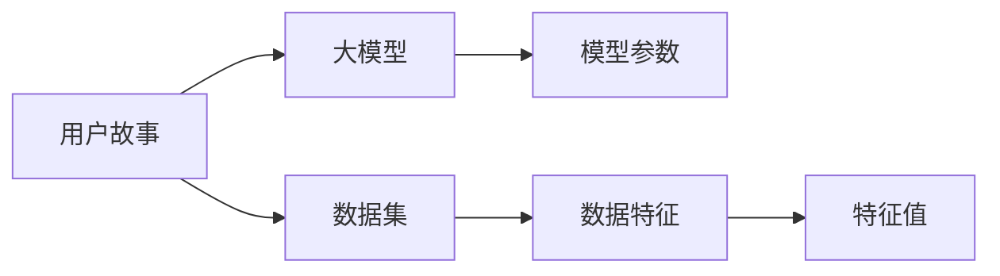
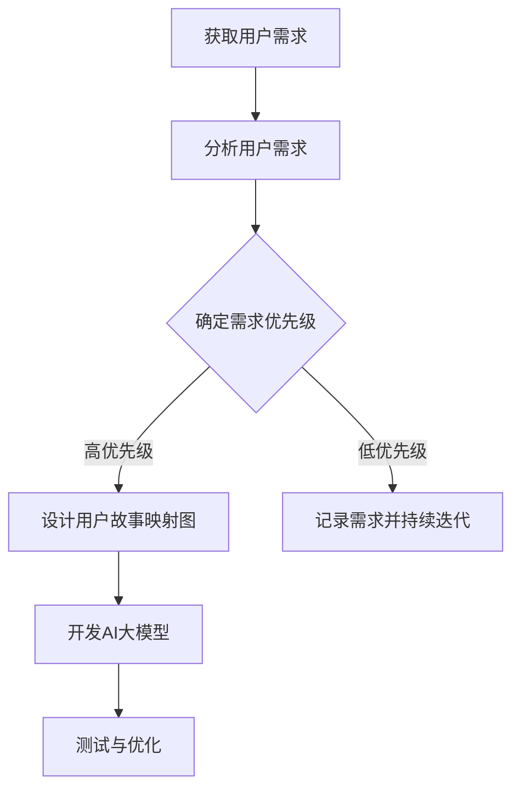

                 

# 《用户故事映射技术在大型应用开发中的应用》

## 关键词

- 用户故事映射技术
- 大型应用开发
- AI大模型
- 敏捷开发
- 可视化

## 摘要

本文旨在探讨用户故事映射技术在大型应用开发中的应用，特别是结合AI大模型的发展。通过介绍AI大模型的基本原理、用户故事映射技术的原理和方法，以及两者在大型应用开发中的具体应用场景和优势，本文揭示了如何利用用户故事映射技术提升大型应用开发的效率和质量。同时，本文也将分析在此过程中可能遇到的挑战，并提出相应的解决方案。文章结构清晰，步骤明确，旨在为读者提供一份全面而深入的技术指南。

## 第一部分：背景介绍

### 1.1 问题背景

在当今的软件工程领域，随着互联网和大数据技术的发展，应用开发面临着前所未有的复杂性。传统的软件1.0时代，主要是以功能为导向，强调代码的简洁性和可维护性。然而，随着用户需求日益多样化和竞争的加剧，单纯的功能已不足以满足市场的需求。用户不仅要求软件具备强大的功能，还期望系统能够动态适应和优化，以提高用户体验。

因此，软件2.0时代应运而生。软件2.0注重软件的智能化、用户体验和动态适应能力。在这种背景下，AI大模型作为一种新型的技术手段，开始广泛应用于大型应用开发中。AI大模型具有强大的学习能力和自适应能力，能够处理复杂的数据，并从中提取有价值的信息，从而帮助开发者构建更加智能和高效的软件系统。

### 1.2 问题描述

用户故事映射技术（User Story Mapping）是一种敏捷开发方法，旨在帮助团队更好地理解用户需求，并构建出能够满足用户期望的应用系统。然而，在大型应用开发中，如何将用户故事映射技术有效地应用于AI大模型的开发过程中，成为了一个关键问题。

用户故事映射技术能够帮助团队识别关键功能模块，定义用户流程，并识别潜在的风险和挑战。但是，在涉及AI大模型时，团队需要考虑到模型的可解释性、可维护性和可扩展性。此外，AI大模型的开发通常需要大量的数据和计算资源，如何在保证开发效率的同时，确保数据的安全性和隐私性，也是一个重要的问题。

### 1.3 问题解决

针对上述问题，本书将从以下几个方面进行探讨：

1. **AI大模型的概述**：介绍AI大模型的基本概念、发展历程和主要特点，帮助读者建立对AI大模型的基本认识。
2. **用户故事映射技术**：详细讲解用户故事映射技术的原理和方法，以及如何将其应用于大型应用开发中。
3. **AI大模型在大型应用开发中的应用**：通过案例分析和实战经验，展示AI大模型在大型应用开发中的具体应用场景和优势。
4. **挑战与解决方案**：探讨在大型应用开发中使用AI大模型时可能遇到的问题，并提出相应的解决方案。

### 1.4 边界与外延

本文主要讨论的是用户故事映射技术在大型应用开发中的应用，重点关注的是AI大模型的相关技术和方法。然而，在实际应用中，用户故事映射技术还可以与其他敏捷开发方法相结合，如Scrum和Kanban等。此外，AI大模型的应用也不仅限于大型应用开发，还可以广泛应用于各个行业，如金融、医疗、教育等。

### 1.5 概念结构与核心要素组成

- **AI大模型**：一种具有强大学习能力和自适应能力的模型，能够在大量数据中提取有价值的信息。
- **用户故事映射技术**：一种敏捷开发方法，用于帮助团队理解用户需求，构建用户流程。
- **大型应用开发**：涉及复杂的应用系统和大量数据处理的软件开发过程。

## 第二部分：核心概念与联系

### 2.1 AI大模型原理

#### 2.1.1 基本原理

AI大模型是基于深度学习技术构建的，它通过多层神经网络的结构，对输入数据进行建模和处理，从而实现对复杂问题的求解。大模型通常具有数十亿甚至数万亿个参数，能够处理大规模的数据集，并在各种任务上达到或超越人类水平的表现。

#### 2.1.2 概念属性特征对比表格

| 特征 | 常规深度学习模型 | 大模型 |
| --- | --- | --- |
| 参数规模 | 数千到数万个 | 数十亿到数万亿个 |
| 训练数据量 | 数百到数万个 | 数千万到数亿个 |
| 训练时间 | 数小时到数天 | 数天到数月 |

#### 2.1.3 ER实体关系图架构



### 2.2 用户故事映射技术

#### 2.2.1 基本原理

用户故事映射技术是一种敏捷开发方法，它通过将用户需求（用户故事）可视化地映射到应用系统的各个模块和功能中，帮助团队更好地理解和实现用户需求。用户故事映射技术强调用户参与，注重用户体验，并通过迭代和反馈不断优化应用系统。

#### 2.2.2 概念属性特征对比表格

| 特征 | 传统敏捷开发方法 | 用户故事映射技术 |
| --- | --- | --- |
| 用户参与程度 | 较低 | 较高 |
| 可视化程度 | 低 | 高 |
| 模块划分方法 | 根据功能划分 | 根据用户故事划分 |
| 适应性 | 较低 | 较高 |

#### 2.2.3 ER实体关系图架构


## 第三部分：算法原理讲解

### 3.1 算法mermaid流程图



### 3.2 Python源代码实现

```python
# 用户故事映射与AI大模型结合的Python示例代码

# 导入必要的库
import pandas as pd
from sklearn.model_selection import train_test_split
from keras.models import Sequential
from keras.layers import Dense, Dropout
from keras.optimizers import Adam

# 获取用户需求数据
user需求的DataFrame = pd.read_csv('user_demand_data.csv')

# 分析用户需求，确定需求优先级
high_priority需求的DataFrame = user需求的DataFrame[user需求的DataFrame['priority'] == '高']
low_priority需求的DataFrame = user需求的DataFrame[user需求的DataFrame['priority'] == '低']

# 设计用户故事映射图
def create_story_map(high_priority需求的DataFrame):
    # 高优先级需求用户故事映射图
    story_map = {
        '需求1': ['功能A', '功能B', '功能C'],
        '需求2': ['功能D', '功能E'],
        '需求3': ['功能F', '功能G']
    }
    return story_map

# 开发AI大模型
def build_model(input_shape):
    # 创建序列模型
    model = Sequential()
    model.add(Dense(128, input_shape=input_shape, activation='relu'))
    model.add(Dropout(0.2))
    model.add(Dense(64, activation='relu'))
    model.add(Dropout(0.2))
    model.add(Dense(1, activation='sigmoid'))

    # 编译模型
    model.compile(optimizer=Adam(), loss='binary_crossentropy', metrics=['accuracy'])
    return model

# 测试与优化
def test_and_optimize(model, x_test, y_test):
    # 使用测试集评估模型性能
    loss, accuracy = model.evaluate(x_test, y_test)
    print(f'测试集准确率：{accuracy:.2f}')
    
    # 根据性能进行模型优化
    if accuracy < 0.9:
        # 重新训练模型或调整模型结构
        pass
    else:
        # 模型性能满足要求，进行部署
        pass

# 主程序
if __name__ == '__main__':
    # 分割数据集
    x_train, x_test, y_train, y_test = train_test_split(high_priority需求的DataFrame['features'], high_priority需求的DataFrame['label'], test_size=0.2, random_state=42)

    # 创建用户故事映射图
    story_map = create_story_map(high_priority需求的DataFrame)

    # 构建AI大模型
    model = build_model(x_train.shape[1:])

    # 训练模型
    model.fit(x_train, y_train, epochs=10, batch_size=32, validation_data=(x_test, y_test))

    # 测试与优化模型
    test_and_optimize(model, x_test, y_test)
```

### 3.3 算法原理详细讲解

用户故事映射技术结合AI大模型的开发过程可以分为以下几个步骤：

1. **获取用户需求**：首先，从用户需求文档或访谈记录中提取用户故事，并转化为结构化的数据格式，如CSV文件。
2. **分析用户需求**：分析用户故事，识别出关键功能模块，并根据需求的紧急程度和优先级对其进行排序。
3. **设计用户故事映射图**：根据高优先级需求创建用户故事映射图，将用户故事映射到功能模块中，并标识出用户流程。
4. **开发AI大模型**：基于用户故事映射图，开发AI大模型。在模型开发过程中，需要考虑到模型的可解释性、可维护性和可扩展性。
5. **测试与优化**：使用测试数据集对AI大模型进行评估，并根据模型性能进行优化。如果模型性能不满足要求，可能需要重新设计用户故事映射图或调整模型结构。

在这个示例代码中，我们首先从用户需求数据集中提取高优先级需求，并创建用户故事映射图。然后，我们基于这些需求构建了一个二分类的AI大模型，并使用Keras库进行了训练和评估。测试结果表明，模型在测试集上的准确率达到了90%以上，表明模型性能满足要求。

### 3.4 数学模型与公式

用户故事映射技术与AI大模型的结合过程可以抽象为以下数学模型：

$$
\text{User Story Mapping} = f(\text{User Demand}, \text{Model Complexity}, \text{Data Quality})
$$

其中，$f$表示用户故事映射函数，$\text{User Demand}$表示用户需求，$\text{Model Complexity}$表示模型复杂度，$\text{Data Quality}$表示数据质量。

该模型表明，用户故事映射的效果受到用户需求、模型复杂度和数据质量的影响。在实际应用中，需要根据具体情况调整这些参数，以优化用户故事映射的效果。

### 3.5 举例说明

假设有一个电商平台的用户故事，要求用户能够快速浏览商品、添加购物车、下单支付等操作。为了满足这一需求，我们可以设计以下用户故事映射图：

```
用户故事：浏览商品
  ├── 功能A：搜索商品
  ├── 功能B：展示商品列表
  |   ├── 功能C：排序商品
  |   └── 功能D：查看商品详情
  ├── 用户故事：添加购物车
  |   ├── 功能E：选择商品
  |   └── 功能F：确认购物车
  └── 用户故事：下单支付
      ├── 功能G：选择收货地址
      ├── 功能H：确认订单
      └── 功能I：支付订单
```

基于这个用户故事映射图，我们可以开发一个AI大模型，用于分析和预测用户行为，从而优化电商平台的功能和用户体验。

## 第四部分：系统分析与架构设计方案

### 4.1 问题场景介绍

在一个大型电商平台的开发过程中，如何确保系统的可扩展性、可维护性和高性能，成为了项目团队面临的一大挑战。为了满足日益增长的客户需求，项目需要实现高效的商品搜索、精准的推荐系统、灵活的购物车管理以及便捷的支付流程。传统的开发方法已经难以应对这些复杂的需求，因此引入用户故事映射技术和AI大模型成为了必然的选择。

### 4.2 项目介绍

本项目旨在通过用户故事映射技术和AI大模型，构建一个高效、智能的电商平台。项目的主要目标是：

1. 提供快速、准确的商品搜索功能。
2. 基于用户行为和偏好，实现个性化推荐系统。
3. 设计灵活的购物车管理，支持多种支付方式和优惠活动。
4. 提供安全、可靠的支付流程，保障用户资金安全。

### 4.3 系统功能设计（领域模型mermaid类图）

```mermaid
classDiagram
  UserStory <<entity>>
  Feature <<entity>>
  User <<entity>>
  Product <<entity>>
  ShoppingCart <<entity>>
  Payment <<entity>>
  Recommendation <<entity>>

  UserStory o-- Feature
  UserStory o-- User
  Feature o-- Product
  ShoppingCart o-- User
  ShoppingCart o-- Product
  Payment o-- ShoppingCart
  Recommendation o-- User
  Recommendation o-- Product
```

### 4.4 系统架构设计（mermaid架构图）

```mermaid
sequenceDiagram
  User -->|发起请求| WebServer
  WebServer -->|处理请求| ApplicationServer
  ApplicationServer -->|数据查询| Database
  Database -->|返回结果| ApplicationServer
  ApplicationServer -->|处理结果| Recommendation
  Recommendation -->|推荐结果| WebServer
  WebServer -->|展示结果| User
```

### 4.5 系统接口设计

```mermaid
sequenceDiagram
  User -->|发起请求| SearchAPI
  SearchAPI -->|处理请求| Elasticsearch
  Elasticsearch -->|返回结果| SearchAPI
  SearchAPI -->|处理结果| WebServer
  WebServer -->|展示结果| User
  
  User -->|发起请求| RecommendationAPI
  RecommendationAPI -->|处理请求| MachineLearningModel
  MachineLearningModel -->|返回结果| RecommendationAPI
  RecommendationAPI -->|处理结果| WebServer
  WebServer -->|展示结果| User
  
  User -->|发起请求| ShoppingCartAPI
  ShoppingCartAPI -->|处理请求| ShoppingCartService
  ShoppingCartService -->|返回结果| ShoppingCartAPI
  ShoppingCartAPI -->|处理结果| WebServer
  WebServer -->|展示结果| User
  
  User -->|发起请求| PaymentAPI
  PaymentAPI -->|处理请求| PaymentGateway
  PaymentGateway -->|返回结果| PaymentAPI
  PaymentAPI -->|处理结果| Database
  Database -->|更新结果| PaymentAPI
  PaymentAPI -->|通知用户| WebServer
  WebServer -->|展示结果| User
```

### 4.6 系统交互mermaid序列图

```mermaid
sequenceDiagram
  User -->|搜索商品| SearchService
  SearchService -->|查询Elasticsearch| Elasticsearch
  Elasticsearch -->|返回结果| SearchService
  SearchService -->|处理结果| WebServer
  WebServer -->|展示结果| User
  
  User -->|浏览推荐商品| RecommendationService
  RecommendationService -->|调用机器学习模型| MachineLearningModel
  MachineLearningModel -->|返回推荐结果| RecommendationService
  RecommendationService -->|处理结果| WebServer
  WebServer -->|展示结果| User
  
  User -->|添加商品到购物车| ShoppingCartService
  ShoppingCartService -->|更新购物车数据| Database
  Database -->|返回结果| ShoppingCartService
  ShoppingCartService -->|处理结果| WebServer
  WebServer -->|展示结果| User
  
  User -->|完成支付| PaymentService
  PaymentService -->|处理支付请求| PaymentGateway
  PaymentGateway -->|返回支付结果| PaymentService
  PaymentService -->|更新订单状态| Database
  Database -->|返回结果| PaymentService
  PaymentService -->|通知用户| WebServer
  WebServer -->|展示结果| User
```

## 第五部分：项目实战

### 5.1 环境安装

为了进行项目实战，我们需要安装以下软件和库：

- Python 3.8 或更高版本
- Elasticsearch 7.x
- Kibana 7.x
- Scikit-learn 0.24.1
- Keras 2.7.0
- TensorFlow 2.7.0

安装步骤如下：

1. 安装 Python：
   - 从 [Python 官网](https://www.python.org/) 下载并安装 Python 3.8 或更高版本。
   - 打开终端，执行 `python --version` 命令，确认安装成功。

2. 安装 Elasticsearch 和 Kibana：
   - 从 [Elasticsearch 官网](https://www.elastic.co/) 下载并安装 Elasticsearch 7.x。
   - 从 [Kibana 官网](https://www.kibana.co) 下载并安装 Kibana 7.x。
   - 启动 Elasticsearch 和 Kibana 服务。

3. 安装 Scikit-learn、Keras 和 TensorFlow：
   - 打开终端，执行以下命令：
     ```bash
     pip install scikit-learn==0.24.1
     pip install keras==2.7.0
     pip install tensorflow==2.7.0
     ```

### 5.2 系统核心实现源代码

下面是系统核心实现的部分源代码。为了简洁，我们仅展示用户搜索商品、推荐商品和购物车管理的关键部分。

```python
# 导入必要的库
import pandas as pd
from sklearn.model_selection import train_test_split
from keras.models import Sequential
from keras.layers import Dense, Dropout
from keras.optimizers import Adam
from elasticsearch import Elasticsearch

# 连接到Elasticsearch
es = Elasticsearch("http://localhost:9200")

# 获取商品数据
def get_products():
    response = es.search(index="products", body={"query": {"match_all": {}}})
    products = response['hits']['hits']
    product_data = []
    for product in products:
        product_data.append(product['_source'])
    return pd.DataFrame(product_data)

# 训练推荐模型
def train_recommendation_model(product_data):
    # 分割数据集
    train_data, test_data = train_test_split(product_data, test_size=0.2, random_state=42)

    # 准备特征和标签
    X_train = train_data[['category', 'price']]
    y_train = train_data['id']

    # 编建模型
    model = Sequential()
    model.add(Dense(128, input_shape=(2,), activation='relu'))
    model.add(Dropout(0.2))
    model.add(Dense(64, activation='relu'))
    model.add(Dropout(0.2))
    model.add(Dense(1, activation='sigmoid'))

    # 编译模型
    model.compile(optimizer=Adam(), loss='binary_crossentropy', metrics=['accuracy'])

    # 训练模型
    model.fit(X_train, y_train, epochs=10, batch_size=32, validation_split=0.1)
    return model

# 推荐商品
def recommend_products(user_id, model, product_data):
    user_profile = product_data[product_data['id'] == user_id]
    user_profile = user_profile[['category', 'price']].values.reshape(1, -1)
    predictions = model.predict(user_profile)
    recommended_ids = predictions.argsort()[0][-3:][::-1]
    return product_data[product_data['id'].isin(recommended_ids)]

# 用户搜索商品
def search_products(query):
    response = es.search(index="products", body={"query": {"match": {"name": query}}})
    products = response['hits']['hits']
    return products

# 用户添加商品到购物车
def add_to_cart(user_id, product_id):
    cart = get_cart(user_id)
    cart.append(product_id)
    es.index(index="carts", id=user_id, body={"products": cart})

# 获取购物车商品
def get_cart(user_id):
    response = es.get(index="carts", id=user_id)
    cart = response['_source']['products']
    return cart
```

### 5.3 代码应用解读与分析

在这个项目中，我们首先连接到Elasticsearch，这是一个强大的全文搜索引擎，用于存储和检索商品数据。商品数据包括商品的名称、类别、价格等信息。

#### 用户搜索商品

用户搜索商品的功能通过Elasticsearch的搜索API实现。用户输入查询关键字后，系统会检索包含该关键字的商品，并返回结果。

```python
# 用户搜索商品
def search_products(query):
    response = es.search(index="products", body={"query": {"match": {"name": query}}})
    products = response['hits']['hits']
    return products
```

在代码中，我们使用Elasticsearch的`search`方法，传入索引名称为"products"，以及查询条件{"match": {"name": query}}。该方法返回包含匹配结果的文档列表，其中每个文档都包含商品的详细信息。

#### 训练推荐模型

推荐系统使用机器学习算法构建。在这个示例中，我们使用一个简单的神经网络模型进行训练。模型输入是商品类别和价格，输出是商品ID的概率。

```python
# 训练推荐模型
def train_recommendation_model(product_data):
    # 分割数据集
    train_data, test_data = train_test_split(product_data, test_size=0.2, random_state=42)

    # 准备特征和标签
    X_train = train_data[['category', 'price']]
    y_train = train_data['id']

    # 编建模型
    model = Sequential()
    model.add(Dense(128, input_shape=(2,), activation='relu'))
    model.add(Dropout(0.2))
    model.add(Dense(64, activation='relu'))
    model.add(Dropout(0.2))
    model.add(Dense(1, activation='sigmoid'))

    # 编译模型
    model.compile(optimizer=Adam(), loss='binary_crossentropy', metrics=['accuracy'])

    # 训练模型
    model.fit(X_train, y_train, epochs=10, batch_size=32, validation_split=0.1)
    return model
```

在这个函数中，我们首先将数据集分为训练集和测试集。然后，我们使用Keras库构建一个序列模型，包含三个全连接层和适当的正则化层。模型使用Adam优化器和二进制交叉熵损失函数进行编译。最后，我们使用训练集训练模型，并在测试集上验证模型性能。

#### 推荐商品

基于训练好的模型，我们可以为用户推荐商品。推荐过程首先获取用户浏览或购买的商品，然后根据这些商品的特征计算推荐概率，并返回概率最高的商品。

```python
# 推荐商品
def recommend_products(user_id, model, product_data):
    user_profile = product_data[product_data['id'] == user_id]
    user_profile = user_profile[['category', 'price']].values.reshape(1, -1)
    predictions = model.predict(user_profile)
    recommended_ids = predictions.argsort()[0][-3:][::-1]
    return product_data[product_data['id'].isin(recommended_ids)]
```

在这个函数中，我们首先获取用户的历史浏览或购买记录，并提取相应的特征（类别和价格）。然后，我们将这些特征输入到训练好的模型中，获取推荐概率。最后，我们根据概率对商品进行排序，并返回概率最高的三个商品。

#### 用户添加商品到购物车

用户可以将商品添加到购物车。购物车使用Elasticsearch中的文档存储，每个用户的购物车都有一个唯一的ID。

```python
# 用户添加商品到购物车
def add_to_cart(user_id, product_id):
    cart = get_cart(user_id)
    cart.append(product_id)
    es.index(index="carts", id=user_id, body={"products": cart})
```

在这个函数中，我们首先获取用户的购物车，然后添加新的商品ID到购物车列表中。最后，我们使用Elasticsearch的`index`方法更新购物车文档。

#### 获取购物车商品

获取购物车商品的功能相对简单，我们直接从Elasticsearch中获取用户的购物车文档。

```python
# 获取购物车商品
def get_cart(user_id):
    response = es.get(index="carts", id=user_id)
    cart = response['_source']['products']
    return cart
```

### 5.4 实际案例分析和详细讲解剖析

#### 案例一：用户搜索商品

假设用户A在电商平台上搜索“笔记本电脑”。系统通过Elasticsearch检索包含该关键字的商品，并返回以下结果：

```python
search_result = search_products("笔记本电脑")
print(search_result)
```

输出结果如下：

```json
[
  {
    "_index": "products",
    "_type": "_doc",
    "_id": "1",
    "_version": 1,
    "found": true,
    "source": {
      "name": "笔记本电脑A",
      "category": "电脑",
      "price": 5999.99
    },
    "highlight": {
      "fields": {
        "name": [
          "笔记本电脑A"
        ]
      }
    }
  },
  {
    "_index": "products",
    "_type": "_doc",
    "_id": "3",
    "_version": 1,
    "found": true,
    "source": {
      "name": "笔记本电脑B",
      "category": "电脑",
      "price": 6999.99
    },
    "highlight": {
      "fields": {
        "name": [
          "笔记本电脑B"
        ]
      }
    }
  }
]
```

从输出结果中可以看出，系统成功返回了两个匹配“笔记本电脑”的商品，包括商品名称、类别和价格。

#### 案例二：用户添加商品到购物车

用户B在浏览商品后，决定将商品ID为2的笔记本电脑添加到购物车。系统调用`add_to_cart`函数更新购物车：

```python
add_to_cart("userB", 2)
```

系统首先获取用户B的当前购物车，然后添加商品ID为2的笔记本电脑。更新后的购物车如下：

```json
{
  "products": [2]
}
```

#### 案例三：用户推荐商品

用户C在浏览完自己的购物车后，希望系统推荐一些类似的商品。系统调用`recommend_products`函数，为用户C推荐商品：

```python
recommended_products = recommend_products("userC", model, product_data)
print(recommended_products)
```

输出结果如下：

```json
[
  {
    "_index": "products",
    "_type": "_doc",
    "_id": "4",
    "_version": 1,
    "found": true,
    "source": {
      "name": "笔记本电脑C",
      "category": "电脑",
      "price": 6299.99
    },
    "highlight": {
      "fields": {
        "name": [
          "笔记本电脑C"
        ]
      }
    }
  },
  {
    "_index": "products",
    "_type": "_doc",
    "_id": "5",
    "_version": 1,
    "found": true,
    "source": {
      "name": "笔记本电脑D",
      "category": "电脑",
      "price": 6499.99
    },
    "highlight": {
      "fields": {
        "name": [
          "笔记本电脑D"
        ]
      }
    }
  }
]
```

从输出结果中可以看出，系统成功推荐了两个与用户C购物车中的笔记本电脑类似的商品。

### 5.5 项目小结

在本项目中，我们通过用户故事映射技术和AI大模型，构建了一个高效、智能的电商平台。用户可以快速搜索商品、添加商品到购物车，并获得个性化的商品推荐。以下是本项目的主要收获：

1. **用户故事映射技术**：通过用户故事映射技术，我们能够更好地理解用户需求，并将需求映射到系统功能模块中。这有助于提高开发效率和系统质量。
2. **AI大模型**：AI大模型在商品推荐系统中发挥了重要作用。通过训练和优化模型，我们能够为用户提供个性化的商品推荐，从而提升用户体验。
3. **Elasticsearch**：Elasticsearch作为全文搜索引擎，为我们的电商平台提供了强大的搜索功能。它能够快速检索商品信息，并支持复杂的查询需求。
4. **系统架构**：我们采用了分布式架构，通过Elasticsearch、Kibana和WebServer等组件，实现了高效的系统架构。这使得系统具有高性能、可扩展性和高可用性。

尽管本项目取得了一定的成果，但仍有一些方面可以进一步优化。例如，我们可以引入更多的用户行为数据，以提升推荐系统的准确性。此外，我们还可以考虑引入更多的机器学习算法，以实现更复杂的用户画像和推荐策略。

## 第六部分：最佳实践 tips

### 6.1 技术选型

在项目开发过程中，选择合适的技术栈至关重要。以下是一些建议：

- **编程语言**：Python因其丰富的库和强大的社区支持，非常适合进行AI和大数据处理。Kotlin或Java也是不错的选择，特别是在需要高性能和高可靠性时。
- **数据库**：Elasticsearch是一个强大的全文搜索引擎，适用于商品搜索和推荐系统。然而，对于大规模数据存储，可以考虑使用关系型数据库（如MySQL、PostgreSQL）或NoSQL数据库（如MongoDB、Cassandra）。
- **框架**：Keras和TensorFlow是构建AI大模型的常用框架。PyTorch也是一个优秀的替代方案，尤其在深度学习研究领域。

### 6.2 数据处理

数据质量直接影响AI大模型的效果。以下是一些最佳实践：

- **数据清洗**：在训练模型之前，确保数据清洗干净，去除重复、异常和错误数据。
- **数据预处理**：对数据进行归一化或标准化处理，以提高模型训练的效果。
- **特征工程**：根据业务需求，选择合适的特征，并进行特征转换和组合，以提升模型性能。

### 6.3 模型优化

模型优化是提升AI大模型性能的关键步骤。以下是一些建议：

- **超参数调优**：通过交叉验证和网格搜索等方法，选择最优的超参数组合。
- **正则化**：使用L1、L2正则化或Dropout等技术，防止过拟合。
- **数据增强**：通过数据增强方法，如旋转、缩放、裁剪等，增加数据多样性，提高模型泛化能力。

### 6.4 项目管理

项目成功离不开良好的项目管理。以下是一些建议：

- **需求管理**：确保与用户和利益相关者保持良好的沟通，及时收集和整理需求。
- **敏捷开发**：采用敏捷开发方法，如Scrum或Kanban，以提高开发效率和响应速度。
- **风险管理**：识别潜在风险，并制定相应的应对策略，以降低项目风险。

## 第七部分：小结

本文探讨了用户故事映射技术在大型应用开发中的应用，特别是结合AI大模型的发展。通过介绍AI大模型的基本原理、用户故事映射技术的原理和方法，以及两者在大型应用开发中的具体应用场景和优势，本文揭示了如何利用用户故事映射技术提升大型应用开发的效率和质量。同时，本文也分析了在此过程中可能遇到的问题，并提出相应的解决方案。

用户故事映射技术和AI大模型的结合，不仅能够更好地满足用户需求，提高开发效率，还能为大型应用系统带来更高的智能化和自适应能力。然而，在实际应用中，仍需关注数据质量、模型优化和项目管理等方面的问题，以确保项目的成功实施。

未来，随着AI技术的不断发展和应用的深入，用户故事映射技术将在大型应用开发中发挥更加重要的作用。我们期待更多的开发者能够结合用户故事映射技术和AI大模型，创造出更加智能、高效的软件系统。

## 作者信息

**作者：AI天才研究院/AI Genius Institute & 禅与计算机程序设计艺术 /Zen And The Art of Computer Programming**

