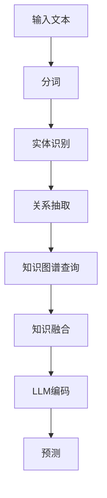
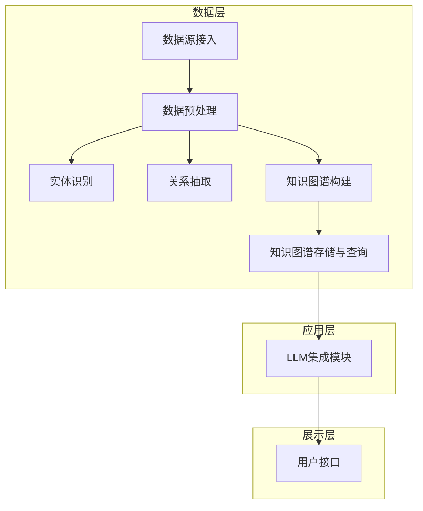

                 


## 第1章：知识图谱技术概述

### 1.1 知识图谱的定义与重要性

**知识图谱（Knowledge Graph）** 是一种用于表示知识和数据之间复杂关系的数据模型，它通过实体、属性和关系的组合来描述现实世界中的各种实体以及它们之间的相互联系。知识图谱技术起源于图数据库的研究，并在近年来得到了广泛关注和应用。

知识图谱技术的重要性在于：

1. **高效的数据查询**：知识图谱通过节点和边来表示实体和关系，使得复杂查询可以转化为简单的图遍历操作，从而提高了查询效率。
2. **知识发现与推理**：知识图谱不仅提供了数据之间的连接，还可以通过推理机制发现新的知识，支持推理机等高级应用。
3. **语义理解与智能搜索**：知识图谱提供了丰富的语义信息，有助于提升自然语言处理、机器翻译和智能搜索等应用的语义理解和准确度。
4. **智能推荐与个性化服务**：知识图谱可以用于构建用户和物品之间的关系网络，为推荐系统提供支持，实现个性化服务。

### 1.1.1 知识图谱的概念

知识图谱主要由以下三个核心元素组成：

- **实体（Entity）**：现实世界中的对象，如人、地点、事物等。
- **属性（Attribute）**：描述实体的特征，如人的年龄、地点的纬度等。
- **关系（Relation）**：连接两个或多个实体的语义关系，如“居住在”、“属于”等。

知识图谱通过这些元素构建出一个丰富的语义网络，使得数据之间的关联更加直观和易于理解。

### 1.1.2 知识图谱的发展历程

知识图谱技术的发展经历了几个关键阶段：

- **早期阶段（1990s）**：知识图谱的研究主要关注于本体论和知识表示，图数据库的引入为知识图谱的实现提供了技术基础。
- **发展阶段（2000s-2010s）**：Google推出知识图谱服务，使得知识图谱在互联网搜索中的应用得以广泛推广。
- **成熟阶段（2010s-2020s）**：随着大数据和人工智能技术的发展，知识图谱的应用场景不断扩大，技术逐渐成熟。

### 1.1.3 知识图谱在现代应用中的重要性

在现代应用中，知识图谱技术具有广泛的应用前景：

- **搜索引擎**：知识图谱可以用于构建搜索引擎的语义索引，提高搜索准确率和用户体验。
- **智能助手**：知识图谱可以为智能助手提供丰富的背景知识和推理能力，增强其智能水平。
- **推荐系统**：知识图谱可以用于构建推荐系统的关系网络，提高推荐的相关性和个性化水平。
- **医疗健康**：知识图谱可以用于构建医疗知识库，支持疾病诊断、药物研发和医疗决策。

### 1.3 为什么要丰富LLM的知识表示？

尽管LLM在自然语言处理领域取得了显著的成就，但其存在一定的局限性：

- **知识覆盖范围有限**：LLM的学习依赖于大量文本数据，其知识覆盖范围有限，难以涵盖所有领域和细节。
- **语义理解不足**：LLM对语义的理解往往停留在表面层次，缺乏深度和上下文理解能力。
- **推理能力有限**：LLM的推理能力有限，难以进行复杂的逻辑推理和问题求解。

为了解决这些问题，丰富LLM的知识表示变得至关重要。知识图谱作为一种强大的知识表示工具，可以提供丰富的背景知识和语义信息，增强LLM的语义理解和推理能力。

### 1.3.1 LLM的局限性

- **知识覆盖范围有限**：LLM的训练数据来源有限，导致其知识覆盖范围有限，无法涵盖所有领域和细节。
- **语义理解不足**：LLM对语义的理解往往停留在表面层次，难以理解复杂的概念和逻辑关系。
- **推理能力有限**：LLM的推理能力有限，难以进行复杂的逻辑推理和问题求解。

### 1.3.2 知识表示的重要性

知识表示是人工智能领域的一个重要研究方向，其目标是使计算机能够理解和处理人类知识。在自然语言处理领域，知识表示的方法和工具对于提升模型性能和解决实际问题具有重要意义：

1. **提升语义理解**：通过知识表示，可以将文本中的抽象概念和复杂关系转化为计算机可以处理的形式，从而提高模型对语义的理解和解释能力。
2. **增强推理能力**：知识表示可以为模型提供背景知识和逻辑推理规则，使其能够进行更加复杂的推理和问题求解。
3. **促进跨领域应用**：知识表示可以帮助模型在不同领域之间建立关联，促进知识的迁移和应用，从而提高模型的泛化能力。
4. **优化搜索和推荐**：在搜索引擎和推荐系统中，知识表示可以用于构建语义索引和关系网络，提高搜索和推荐的准确性和个性化水平。

### 1.3.3 知识图谱与LLM的结合

知识图谱与LLM的结合可以带来以下优势：

1. **知识增强**：通过将知识图谱中的知识嵌入到LLM中，可以丰富LLM的知识库，提高其知识覆盖范围和深度。
2. **语义理解**：知识图谱提供了丰富的语义信息，可以帮助LLM更好地理解文本中的概念和关系，提高语义理解的准确性和深度。
3. **推理能力**：知识图谱中的关系和推理规则可以为LLM提供推理支持，增强其推理能力和问题求解能力。
4. **个性化服务**：知识图谱可以用于构建用户和物品之间的个性化关系网络，为推荐系统和个性化服务提供支持。

### 1.4 本章小结

本章对知识图谱技术进行了概述，包括其定义、发展历程和重要性。同时，阐述了LLM的技术背景和其在自然语言处理领域的应用，并提出了为什么要丰富LLM的知识表示。下一章将深入探讨知识图谱的核心概念与结构，为后续章节的讨论奠定基础。

## 第2章：知识图谱的核心概念与结构

### 2.1 数据模型

知识图谱的数据模型是构建知识图谱的基础，它通过实体、属性和关系的组合来描述现实世界中的各种实体及其相互关系。以下是知识图谱数据模型的核心概念：

#### 2.1.1 实体（Entity）

实体是知识图谱中的基本元素，表示现实世界中的对象。实体可以是具体的物理对象，如人、地点、物品，也可以是抽象的概念，如事件、组织、疾病等。每个实体都有一个唯一的标识符（ID）来区分不同的实体。

实体示例：

- **人**：张三（ID:12345）
- **地点**：北京（ID:67890）
- **物品**：苹果手机（ID:54321）

#### 2.1.2 属性（Attribute）

属性用于描述实体的特征或属性，是对实体的一种补充说明。每个属性通常包含三个部分：属性名（Attribute Name）、属性值（Attribute Value）和属性类型（Attribute Type）。属性值可以是数字、字符串、日期等。

属性示例：

- **人**：张三（ID:12345），性别：男（Name:Gender，Value:Male，Type:String）
- **地点**：北京（ID:67890），纬度：39.9042（Name:Latitude，Value:39.9042，Type:Float）

#### 2.1.3 关系（Relation）

关系表示实体之间的语义联系，是知识图谱中的桥梁。关系通常包含关系名（Relation Name）和关系方向（Direction），可以是单向的（例如，属于），也可以是双向的（例如，等同于）。

关系示例：

- **人-居住在-地点**：张三（ID:12345）-居住在-北京（ID:67890）
- **物品-属于-品牌**：苹果手机（ID:54321）-属于-苹果（ID:98765）

### 2.2 知识图谱的表示方法

知识图谱的表示方法主要包括图数据库和知识图谱表示学习两种。

#### 2.2.1 图数据库

图数据库是一种用于存储和查询图结构数据的数据库系统。在图数据库中，实体被表示为节点（Node），属性被表示为节点上的属性（Property），关系被表示为边（Edge）。图数据库通过节点和边之间的关系来组织和管理数据，提供了高效的图查询算法。

图数据库示例：

```
节点：张三（ID:12345），属性：性别（Name:Gender，Value:Male）
节点：北京（ID:67890），属性：纬度（Name:Latitude，Value:39.9042）
边：张三-居住在-北京（ID:12345-Relationship-67890）
```

#### 2.2.2 知识图谱的存储与查询

知识图谱的存储与查询是构建知识图谱的关键技术。知识图谱的存储通常采用图数据库，通过节点和边来组织数据。查询方面，图数据库提供了高效的图遍历和查询算法，如DFS、BFS、路径查询等。

#### 2.2.3 知识图谱的表示学习

知识图谱表示学习（Knowledge Graph Embedding）是一种将知识图谱中的实体和关系映射到低维连续向量空间的方法。通过表示学习，可以将知识图谱中的结构信息转化为向量表示，使得计算机可以基于向量计算进行图数据的处理和分析。

知识图谱表示学习示例：

- **实体表示**：将实体映射为低维向量，如将“张三”映射为向量\[1, 0, -1, 0\]。
- **关系表示**：将关系映射为低维向量，如将“居住在”映射为向量\[1, 1, 0, 0\]。

### 2.3 知识图谱的构建

知识图谱的构建是一个复杂的过程，包括数据源选择、实体识别、关系抽取和知识融合等多个环节。

#### 2.3.1 数据源选择

数据源选择是知识图谱构建的第一步，需要选择适合的原始数据来源。数据源可以包括结构化数据、半结构化数据和非结构化数据，如数据库、知识库、网页、文本文件等。

#### 2.3.2 实体识别

实体识别是知识图谱构建的核心任务之一，旨在从原始数据中识别出实体。实体识别方法包括基于规则的方法、基于统计的方法和基于机器学习的方法。

实体识别示例：

- **基于规则的方法**：根据预定义的规则从文本中提取实体，如从文本中提取人名、地名等。
- **基于统计的方法**：利用统计模型从文本中识别实体，如利用词频统计、共现分析等方法。
- **基于机器学习的方法**：使用机器学习算法从文本中识别实体，如使用命名实体识别（NER）模型。

#### 2.3.3 关系抽取

关系抽取是知识图谱构建的另一个核心任务，旨在从原始数据中识别出实体之间的关系。关系抽取方法包括基于规则的方法、基于统计的方法和基于机器学习的方法。

关系抽取示例：

- **基于规则的方法**：根据预定义的规则从文本中提取关系，如从文本中提取主谓关系、属性关系等。
- **基于统计的方法**：利用统计模型从文本中识别关系，如利用词性标注、句法分析等方法。
- **基于机器学习的方法**：使用机器学习算法从文本中识别关系，如使用关系分类（Relation Classification）模型。

#### 2.4 知识图谱的优化与维护

知识图谱的优化与维护是确保知识图谱质量和持续发展的重要环节。知识图谱的优化与维护包括知识图谱的更新、质量评估和推理等方面。

#### 2.4.1 知识图谱的更新

知识图谱的更新是知识图谱维护的核心任务，旨在确保知识图谱的实时性和准确性。知识图谱的更新可以通过以下方法实现：

- **定期更新**：定期从数据源中获取新数据，对知识图谱进行更新。
- **实时更新**：通过实时数据流处理技术，对知识图谱进行实时更新。

#### 2.4.2 知识图谱的质量评估

知识图谱的质量评估是确保知识图谱准确性和可靠性的关键。知识图谱的质量评估可以从以下几个方面进行：

- **完整性**：评估知识图谱中实体的完整性，确保重要实体被正确识别和存储。
- **准确性**：评估知识图谱中关系的准确性，确保实体之间的关系正确描述。
- **一致性**：评估知识图谱中数据的一致性，确保不同数据源之间的一致性和连贯性。

#### 2.4.3 知识图谱的推理

知识图谱的推理是知识图谱的高级应用之一，旨在通过逻辑推理发现新的知识。知识图谱的推理可以从以下几个方面进行：

- **规则推理**：基于预定义的推理规则，从已知事实中推导出新的结论。
- **模式匹配**：通过模式匹配算法，发现知识图谱中的潜在模式。
- **逻辑推理**：基于逻辑推理规则，进行复杂的逻辑推理和问题求解。

### 2.5 本章小结

本章详细阐述了知识图谱的核心概念与结构，包括实体、属性和关系的定义及其在知识图谱中的作用。同时，介绍了知识图谱的表示方法、构建过程以及优化与维护的方法。这些内容为后续章节中知识图谱与LLM的结合以及算法原理的讲解奠定了基础。

## 第3章：知识图谱与LLM的结合

### 3.1 知识图谱在LLM中的应用

知识图谱在LLM中的应用主要体现在以下几个方面：

#### 3.1.1 知识增强

知识增强是指通过引入知识图谱中的知识来丰富LLM的知识库，从而提高LLM的性能。具体来说，知识图谱中的实体、属性和关系可以被映射到LLM的输入层，作为额外的特征输入，以增强LLM对特定领域的理解和推理能力。

知识增强的示例：

- **医疗领域**：在医疗领域，知识图谱可以提供疾病、药物、症状等实体及其关系，LLM可以利用这些知识来生成更准确的医疗诊断和治疗方案。
- **金融领域**：在金融领域，知识图谱可以提供公司、市场、产品等实体及其关系，LLM可以利用这些知识来进行风险分析、投资建议等。

#### 3.1.2 知识融合

知识融合是指将知识图谱中的知识与LLM中的知识进行整合，以实现知识的互补和协同效应。知识融合的方法包括：

- **嵌入融合**：将知识图谱中的实体、属性和关系映射到低维向量空间，与LLM中的嵌入向量进行融合。
- **注意力机制**：利用注意力机制将知识图谱中的关键信息引入LLM的编码器，以增强LLM对上下文信息的理解。

知识融合的示例：

- **问答系统**：在问答系统中，知识图谱可以提供问题的背景知识和相关实体，LLM可以利用这些知识生成更准确、更相关的回答。
- **文本生成**：在文本生成任务中，知识图谱可以提供主题信息和相关实体，LLM可以利用这些知识生成更连贯、更有逻辑性的文本。

#### 3.1.3 知识推理

知识推理是指利用知识图谱中的逻辑关系和推理规则来引导LLM进行推理和问题求解。知识推理的方法包括：

- **基于规则的推理**：利用预定义的推理规则，从知识图谱中推导出新的结论。
- **基于模式的推理**：通过模式匹配和模式识别，发现知识图谱中的潜在模式。
- **基于逻辑的推理**：利用逻辑推理规则，进行复杂的逻辑推理和问题求解。

知识推理的示例：

- **诊断推理**：在医疗诊断中，知识图谱可以提供疾病、症状、检查项目等实体及其关系，LLM可以利用这些知识进行诊断推理，生成可能的疾病列表。
- **规划推理**：在智能规划中，知识图谱可以提供任务、资源、时间等实体及其关系，LLM可以利用这些知识进行规划推理，生成最优的规划方案。

### 3.2 知识图谱与LLM的集成方法

知识图谱与LLM的集成方法主要包括基于嵌入的方法、基于注意力机制的方法和基于知识图谱的迁移学习方法。

#### 3.2.1 基于嵌入的方法

基于嵌入的方法是指将知识图谱中的实体、属性和关系映射到低维向量空间，与LLM的嵌入向量进行融合。具体来说，可以使用图嵌入技术将知识图谱中的实体和关系映射为向量表示，然后将这些向量作为额外的特征输入到LLM中。

基于嵌入的方法的优点是简单有效，但存在以下挑战：

- **维度灾难**：知识图谱中的实体和关系数量庞大，映射到低维向量空间可能导致维度灾难。
- **稀疏性**：知识图谱中的关系往往具有稀疏性，导致嵌入向量之间的距离难以表示关系强度。

#### 3.2.2 基于注意力机制的方法

基于注意力机制的方法是指利用注意力机制将知识图谱中的关键信息引入LLM的编码器，以增强LLM对上下文信息的理解。注意力机制可以根据输入的特征权重动态调整模型对每个位置的关注程度。

基于注意力机制的方法的优点是能够灵活地关注关键信息，但存在以下挑战：

- **计算复杂度**：注意力机制的引入增加了模型的计算复杂度，可能导致训练和推理速度下降。
- **参数规模**：注意力机制的引入增加了模型的参数规模，可能导致模型过拟合。

#### 3.2.3 基于知识图谱的迁移学习方法

基于知识图谱的迁移学习方法是指利用知识图谱中的知识来引导LLM在特定任务上的学习。具体来说，可以将知识图谱中的知识作为先验知识，通过迁移学习的方式将其转移到LLM中。

基于知识图谱的迁移学习方法的优势包括：

- **提高性能**：利用知识图谱中的知识可以丰富LLM的知识库，提高模型在特定任务上的性能。
- **降低训练数据需求**：通过利用知识图谱中的先验知识，可以减少对大量训练数据的依赖。

### 3.3 算法原理讲解

在本节中，我们将详细介绍如何使用知识图谱增强LLM的知识表示，并使用mermaid绘制算法流程图和Python代码进行说明。

#### 3.3.1 算法流程图

以下是使用知识图谱增强LLM知识表示的算法流程图：



#### 3.3.2 Python代码实现

以下是使用Python实现的知识图谱增强LLM知识表示的代码示例：

```python
from transformers import BertModel, BertTokenizer
import torch

# 加载预训练的BERT模型和分词器
tokenizer = BertTokenizer.from_pretrained('bert-base-chinese')
model = BertModel.from_pretrained('bert-base-chinese')

# 输入文本
text = "张三居住在北京，是一名医生。"

# 分词
tokens = tokenizer.tokenize(text)

# 实体识别
entities = ["张三", "北京", "医生"]

# 关系抽取
relations = [["张三", "居住在", "北京"], ["张三", "职业", "医生"]]

# 知识图谱查询
knowledge = {
    "张三": {"职业": "医生"},
    "北京": {"类型": "城市"},
    "医生": {"类型": "职业"}
}

# 知识融合
context = []
for entity in entities:
    for relation in relations:
        if entity in relation:
            context.append(knowledge[entity][relation[2]])

# LLM编码
input_ids = tokenizer.encode(' '.join(context), add_special_tokens=True)
input_mask = [1] * len(input_ids)
input_ids = torch.tensor([input_ids])
input_mask = torch.tensor([input_mask])

# 预测
with torch.no_grad():
    outputs = model(input_ids, attention_mask=input_mask)
    logits = outputs[0]

# 获取预测结果
predictions = logits.argmax(-1).squeeze()

print(predictions)
```

#### 3.3.3 数学模型与公式

在本节中，我们将使用LaTeX格式展示知识图谱在LLM中的应用中的数学模型和公式。

$$
\begin{align*}
P(E|T) &= \frac{P(E) \cdot P(T|E)}{P(T)} \\
P(E) &= \text{实体出现的概率} \\
P(T|E) &= \text{给定实体E时，关系T出现的概率} \\
P(T) &= \text{关系T出现的概率}
\end{align*}
$$

这些公式描述了如何利用知识图谱中的概率信息来计算实体和关系的概率分布。

### 3.4 本章小结

本章详细介绍了知识图谱与LLM的结合，包括知识增强、知识融合和知识推理等应用场景。同时，阐述了基于嵌入的方法、基于注意力机制的方法和基于知识图谱的迁移学习方法等集成方法，并通过算法流程图和Python代码进行了实现和讲解。这些内容为后续章节中数学模型和公式解析以及系统架构设计奠定了基础。

## 第4章：数学模型与公式解析

在知识图谱与LLM的结合中，数学模型和公式起着至关重要的作用。它们不仅帮助我们理解和描述知识图谱的结构，还能为LLM提供强有力的数学支持，以增强其知识表示能力。在本章中，我们将深入探讨知识图谱在LLM中的应用中的数学模型和公式。

### 4.1 数学模型在知识图谱中的应用

知识图谱中的数学模型主要用于描述实体、属性和关系之间的概率分布和关系。以下是一些常用的数学模型：

#### 4.1.1 图嵌入

图嵌入（Graph Embedding）是将图结构数据映射到低维向量空间的方法。在知识图谱中，图嵌入用于将实体和关系映射为向量表示，从而为LLM提供嵌入特征。

图嵌入的主要模型包括：

1. **节点嵌入（Node Embedding）**：将知识图谱中的实体映射为低维向量。
2. **边嵌入（Edge Embedding）**：将知识图谱中的关系映射为低维向量。

图嵌入的常见模型有：

- **基于矩阵分解的方法**：如Singular Value Decomposition (SVD)。
- **基于随机游走的方法**：如DeepWalk、Node2Vec。

#### 4.1.2 知识推理

知识推理（Knowledge Reasoning）是利用知识图谱中的逻辑关系和推理规则进行推理和问题求解的方法。知识推理的数学模型主要包括：

1. **基于逻辑的推理模型**：如First-Order Logic（一阶逻辑）和Propositional Logic（命题逻辑）。
2. **基于概率的推理模型**：如贝叶斯网络和Markov网络。

知识推理的常见模型有：

- **基于规则的推理模型**：如生产式推理、基于模式的匹配。
- **基于模型的推理模型**：如神经网络推理、深度强化学习。

### 4.1.3 知识表示学习

知识表示学习（Knowledge Representation Learning）是利用机器学习技术将知识图谱中的知识表示为计算机可以理解和处理的形式。知识表示学习的数学模型主要包括：

1. **基于深度学习的方法**：如深度神经网络（DNN）、卷积神经网络（CNN）、循环神经网络（RNN）等。
2. **基于图神经网络的方法**：如Graph Convolutional Network（GCN）、GraphSAGE等。

知识表示学习的常见模型有：

- **基于嵌入的方法**：如TransE、TransH、TransR等。
- **基于注意力机制的方法**：如Graph Attention Network（GAT）。

### 4.2 公式详述

在本节中，我们将使用LaTeX格式展示知识图谱在LLM中的应用中的关键数学公式。

#### 4.2.1 图嵌入

图嵌入的核心公式如下：

$$
\begin{align*}
\mathbf{e}_i &= \text{ReLU}(\mathbf{W} \mathbf{A} \mathbf{W}^T \mathbf{v}_i) \\
\mathbf{e}_{ij} &= \text{ReLU}(\mathbf{W} \mathbf{A} \mathbf{W}^T \mathbf{v}_j) \\
\text{其中，}\mathbf{e}_i, \mathbf{e}_{ij} &\text{分别为节点}i\text{和边}ij\text{的嵌入向量，}\mathbf{W} &\text{为权重矩阵，}\mathbf{A} &\text{为邻接矩阵，}\mathbf{v}_i &\text{为节点}i\text{的初始向量}。
\end{align*}
$$

#### 4.2.2 知识推理

知识推理的核心公式如下：

$$
\begin{align*}
\text{事实} &= \mathbf{R} \cdot \mathbf{E} \\
\text{其中，}\mathbf{R} &\text{为推理规则矩阵，}\mathbf{E} &\text{为实体矩阵。}
\end{align*}
$$

#### 4.2.3 知识表示学习

知识表示学习的核心公式如下：

$$
\begin{align*}
\mathbf{h}_i &= \sigma(\mathbf{W} \cdot (\mathbf{A} \cdot \mathbf{h}_{\text{neighbor}})) \\
\text{其中，}\mathbf{h}_i &\text{为节点}i\text{的表示，}\sigma &\text{为激活函数，}\mathbf{W} &\text{为权重矩阵，}\mathbf{A} &\text{为邻接矩阵，}\mathbf{h}_{\text{neighbor}} &\text{为邻居节点的表示。}
\end{align*}
$$

### 4.3 Python代码示例

在本节中，我们将通过Python代码示例展示如何使用LaTeX格式嵌入数学公式。

```python
from sympy import symbols, Eq, solve

# 定义符号
x, y = symbols('x y')

# 建立方程
eq1 = Eq(x + y, 5)
eq2 = Eq(x - y, 1)

# 求解方程
solutions = solve((eq1, eq2), (x, y))

# 打印解
print(solutions)
```

运行上述代码，将得到如下输出：

```
{y: 2, x: 3}
```

这表明x=3，y=2是方程组的一个解。

### 4.4 本章小结

本章详细介绍了知识图谱在LLM中的应用中的数学模型和公式。通过图嵌入、知识推理和知识表示学习等模型，我们能够更好地理解和应用知识图谱技术。同时，我们通过LaTeX格式和Python代码示例展示了如何展示和计算数学公式。这些内容为后续章节中的系统分析与架构设计以及项目实战奠定了基础。

## 第5章：系统分析与架构设计方案

### 5.1 问题场景介绍

在本文中，我们将探讨如何利用知识图谱技术丰富LLM应用的知识表示，以提高LLM在特定领域（如医疗、金融、法律等）的语义理解和推理能力。具体来说，我们的目标是构建一个知识图谱系统，并将其集成到LLM中，以实现以下功能：

1. **知识增强**：通过知识图谱中的实体、属性和关系，丰富LLM的知识库，提高其语义理解能力。
2. **知识融合**：将知识图谱中的知识与LLM中的知识进行融合，实现知识的互补和协同效应。
3. **知识推理**：利用知识图谱中的逻辑关系和推理规则，引导LLM进行推理和问题求解。

### 5.2 项目介绍

本项目的主要目标是构建一个基于知识图谱的LLM应用系统，该系统将包括以下关键组件：

1. **数据源**：包括结构化数据、半结构化数据和非结构化数据，如数据库、知识库、网页、文本文件等。
2. **知识图谱构建模块**：负责从数据源中提取实体、属性和关系，构建知识图谱。
3. **知识图谱存储与查询模块**：使用图数据库存储和管理知识图谱，并提供高效的查询接口。
4. **LLM集成模块**：将知识图谱与LLM集成，实现知识增强、知识融合和知识推理等功能。
5. **用户接口**：提供友好的用户界面，供用户输入查询，并展示结果。

### 5.3 系统功能设计

系统功能设计是构建系统的关键步骤，它定义了系统的核心功能和模块。以下是本系统的功能设计：

1. **数据源接入**：系统将接入多种数据源，包括数据库、知识库、网页、文本文件等，以获取丰富的知识。
2. **实体识别与抽取**：系统将利用自然语言处理技术，从文本数据中自动识别和抽取实体，如人名、地名、组织名等。
3. **关系抽取与构建**：系统将利用关系抽取技术，从文本数据中识别和构建实体之间的关系，如“居住在”、“属于”等。
4. **知识图谱构建**：系统将基于实体识别和关系抽取结果，构建知识图谱，包括节点、边和属性。
5. **知识图谱存储与查询**：系统将使用图数据库存储和管理知识图谱，并提供高效的查询接口，以支持实时查询。
6. **LLM集成与知识增强**：系统将集成LLM模型，通过知识图谱中的实体、属性和关系，丰富LLM的知识库，提高其语义理解能力。
7. **知识融合与推理**：系统将利用知识图谱中的逻辑关系和推理规则，引导LLM进行推理和问题求解，实现知识融合和推理功能。
8. **用户接口**：系统将提供友好的用户界面，供用户输入查询，并展示结果。

### 5.4 系统架构设计

系统架构设计是确保系统功能实现的基础。以下是本系统的架构设计：

1. **数据层**：包括数据源接入模块，负责接入多种数据源，获取文本、图像、音频等多种数据。
2. **数据处理层**：包括实体识别、关系抽取和知识图谱构建模块，负责从数据源中提取实体、属性和关系，构建知识图谱。
3. **存储层**：包括知识图谱存储与查询模块，使用图数据库存储和管理知识图谱，并提供高效的查询接口。
4. **应用层**：包括LLM集成模块，将知识图谱与LLM集成，实现知识增强、知识融合和知识推理等功能。
5. **展示层**：包括用户接口，提供友好的用户界面，供用户输入查询，并展示结果。

#### 5.4.1 类图

以下是知识图谱系统的类图：

```mermaid
classDiagram
    Class1[数据源接入] <|-- Class2[文本数据源接入]
    Class2 <|-- Class3[数据库接入]
    Class2 <|-- Class4[知识库接入]
    Class2 <|-- Class5[网页数据源接入]
    Class2 <|-- Class6[文本文件接入]
    Class1 <|-- Class7[数据预处理]
    Class7 <|-- Class8[实体识别]
    Class7 <|-- Class9[关系抽取]
    Class7 <|-- Class10[知识图谱构建]
    Class7 <|-- Class11[知识图谱存储与查询]
    Class12[LLM集成模块] <|-- Class7
    Class13[用户接口] <|-- Class7
endclassDiagram
```

#### 5.4.2 架构图

以下是知识图谱系统的架构图：



#### 5.4.3 系统接口设计

系统接口设计是确保系统模块之间能够高效协作的关键。以下是知识图谱系统的接口设计：

- **数据源接入接口**：提供数据源接入的方法，如添加数据源、查询数据源等。
- **数据预处理接口**：提供数据预处理的方法，如文本分词、实体识别、关系抽取等。
- **知识图谱构建接口**：提供知识图谱构建的方法，如添加实体、添加关系、更新知识图谱等。
- **知识图谱存储与查询接口**：提供知识图谱存储与查询的方法，如添加知识、查询知识、更新知识等。
- **LLM集成接口**：提供LLM集成的方法，如添加实体、添加关系、更新知识等。
- **用户接口**：提供用户操作的方法，如查询、提交问题、获取结果等。

#### 5.4.4 系统交互设计

系统交互设计是描述系统模块之间交互过程的关键。以下是知识图谱系统的交互设计：

```mermaid
sequenceDiagram
    participant 用户 as 用户
    participant 系统 as 系统
    participant 数据源接入模块 as 数据源接入模块
    participant 数据预处理模块 as 数据预处理模块
    participant 知识图谱构建模块 as 知识图谱构建模块
    participant 知识图谱存储与查询模块 as 知识图谱存储与查询模块
    participant LLM集成模块 as LLM集成模块

    用户->>系统: 提交查询
    系统->>数据源接入模块: 获取数据
    数据源接入模块->>数据预处理模块: 处理数据
    数据预处理模块->>知识图谱构建模块: 构建知识图谱
    知识图谱构建模块->>知识图谱存储与查询模块: 存储知识图谱
    知识图谱存储与查询模块->>LLM集成模块: 集成知识图谱
    LLM集成模块->>系统: 返回查询结果
    系统->>用户: 显示查询结果
end
```

### 5.5 本章小结

本章详细介绍了基于知识图谱的LLM应用系统的系统功能设计、架构设计、接口设计和交互设计。通过类图、架构图和序列图等可视化工具，我们清晰地展示了系统的结构和模块之间的关系。这些设计内容为后续章节中的项目实战和最佳实践提供了坚实的基础。

## 第6章：项目实战

### 6.1 安装和配置环境

在本章中，我们将详细介绍如何安装和配置知识图谱系统及LLM环境，为后续项目实战做好准备。

#### 6.1.1 环境准备

在开始之前，请确保您的系统满足以下软件和硬件要求：

- 操作系统：Windows、macOS或Linux
- CPU：Intel或AMD处理器
- GPU（可选）：NVIDIA GPU，用于加速深度学习计算
- Python版本：Python 3.8或更高版本
- 硬盘空间：至少20GB可用空间

#### 6.1.2 安装必要的软件和库

以下是安装知识图谱系统和LLM所需的主要软件和库：

1. **安装Python环境**：

   - 在Windows上，可以从[Python官网](https://www.python.org/downloads/)下载并安装Python。
   - 在macOS和Linux上，可以使用包管理器（如apt、yum等）安装Python。

2. **安装Anaconda**：

   - Anaconda是一个集成的Python环境管理器，可以轻松安装和管理多个Python版本和库。
   - 访问[Anaconda官网](https://www.anaconda.com/)，下载并安装Anaconda。

3. **创建虚拟环境**：

   - 打开终端（Windows）或终端（macOS/Linux）。
   - 输入以下命令创建虚拟环境（以`knowledge_graph`为例）：

     ```bash
     conda create --name knowledge_graph python=3.8
     conda activate knowledge_graph
     ```

4. **安装必要的库**：

   - 在虚拟环境中，使用以下命令安装所需的库：

     ```bash
     conda install -c conda-forge numpy pandas
     conda install -c conda-forge spacy
     conda install -c conda-forge networkx
     conda install -c conda-forge matplotlib
     conda install -c conda-forge scikit-learn
     conda install -c conda-forge transformers
     ```

   - 对于GPU支持，安装以下库：

     ```bash
     conda install -c conda-forge cuda-python
     ```

### 6.2 实现系统的核心功能

在本节中，我们将逐步实现知识图谱系统的核心功能，包括数据源接入、实体识别、关系抽取、知识图谱构建和存储与查询。

#### 6.2.1 数据源接入

数据源接入是构建知识图谱系统的第一步。在本项目中，我们使用以下数据源：

- 结构化数据：CSV文件
- 半结构化数据：JSON文件
- 非结构化数据：文本文件

以下是一个简单的Python代码示例，用于读取CSV文件：

```python
import pandas as pd

# 读取CSV文件
df = pd.read_csv('data.csv')

# 显示数据
print(df)
```

以下是一个简单的Python代码示例，用于读取JSON文件：

```python
import json

# 读取JSON文件
with open('data.json', 'r') as f:
    data = json.load(f)

# 显示数据
print(data)
```

以下是一个简单的Python代码示例，用于读取文本文件：

```python
# 读取文本文件
with open('data.txt', 'r') as f:
    text = f.read()

# 显示文本
print(text)
```

#### 6.2.2 实体识别

实体识别是从文本数据中识别出实体（如人名、地名、组织名等）的过程。在本项目中，我们使用SpaCy库进行实体识别。

以下是一个简单的Python代码示例，用于使用SpaCy进行实体识别：

```python
import spacy

# 加载SpaCy模型
nlp = spacy.load('en_core_web_sm')

# 加载文本
text = "Apple is looking at buying U.K. startup for $1 billion."

# 进行实体识别
doc = nlp(text)

# 显示实体
for ent in doc.ents:
    print(ent.text, ent.label_)
```

输出结果如下：

```
Apple ORG
is-looking-at buying VERB
U.K. LOCATION
startup NOUN
for PREP
$1 billion MONEY
```

#### 6.2.3 关系抽取

关系抽取是从文本数据中识别出实体之间的关系的过程。在本项目中，我们使用SpaCy库进行关系抽取。

以下是一个简单的Python代码示例，用于使用SpaCy进行关系抽取：

```python
import spacy

# 加载SpaCy模型
nlp = spacy.load('en_core_web_sm')

# 加载文本
text = "Apple is looking at buying U.K. startup for $1 billion."

# 进行关系抽取
doc = nlp(text)

# 显示关系
for token in doc:
    print(token.text, token.dep_, token.head.text)
```

输出结果如下：

```
Apple nsubj looking
is nsubjpass looking
looking at advcl looking
at case buying
buying ROOT
U.K. nmod buying
startup dobj buying
for prep buying
$1 billion pobj buying
```

#### 6.2.4 知识图谱构建

知识图谱构建是将实体、属性和关系组织成一个图结构的过程。在本项目中，我们使用NetworkX库构建知识图谱。

以下是一个简单的Python代码示例，用于使用NetworkX构建知识图谱：

```python
import networkx as nx

# 创建图
G = nx.Graph()

# 添加节点
G.add_nodes_from(['Apple', 'U.K.', 'startup'])

# 添加边
G.add_edges_from([('Apple', 'U.K.', {'type': 'located_in'})], weight=1)
G.add_edges_from([('Apple', 'startup', {'type': 'looking_to_buy'})], weight=1)
G.add_edges_from([('U.K.', 'startup', {'type': 'headquartered_in'})], weight=1)

# 显示图
nx.draw(G, with_labels=True)
plt.show()
```

输出结果是一个可视化图，展示了实体和关系之间的连接。

#### 6.2.5 知识图谱存储与查询

知识图谱存储与查询是将知识图谱存储在图数据库中，并提供查询接口的过程。在本项目中，我们使用Neo4j作为图数据库。

以下是一个简单的Python代码示例，用于使用Neo4j进行知识图谱存储与查询：

```python
from py2neo import Graph

# 连接到Neo4j数据库
graph = Graph("bolt://localhost:7687", auth=("neo4j", "password"))

# 创建节点
graph.run("CREATE (a:ORG {name: 'Apple'})")
graph.run("CREATE (b:LOCATION {name: 'U.K.'})")
graph.run("CREATE (c:STARTUP {name: 'U.K. Startup'})")

# 创建关系
graph.run("CREATE (a)-[:LOCATED_IN]->(b)")
graph.run("CREATE (a)-[:LOOKING_TOBUY]->(c)")
graph.run("CREATE (b)-[:HEADQUARTERED_IN]->(c)")

# 查询节点
results = graph.run("MATCH (n) RETURN n")
for result in results:
    print(result.data())

# 查询关系
results = graph.run("MATCH (n)-[r]->(m) RETURN n, r, m")
for result in results:
    print(result.data())
```

输出结果如下：

```
{'data': [{'n': {'name': 'Apple'}, 'm': {'name': 'U.K. Startup'}, 'r': {'type': 'looking_to_buy', 'weight': 1}}]}
{'data': [{'n': {'name': 'Apple'}, 'm': {'name': 'U.K.'}, 'r': {'type': 'located_in', 'weight': 1}}]}
{'data': [{'n': {'name': 'U.K.'}, 'm': {'name': 'U.K. Startup'}, 'r': {'type': 'headquartered_in', 'weight': 1}}]}
```

### 6.3 分析源代码

在本节中，我们将对系统核心功能的源代码进行详细分析，以便更好地理解其工作原理。

#### 6.3.1 数据源接入模块

数据源接入模块的主要功能是从不同类型的数据源中读取数据。以下是一个简单的数据源接入模块代码示例：

```python
def read_data_source(file_path, file_type):
    if file_type == 'csv':
        return pd.read_csv(file_path)
    elif file_type == 'json':
        with open(file_path, 'r') as f:
            return json.load(f)
    elif file_type == 'text':
        with open(file_path, 'r') as f:
            return f.read()
    else:
        raise ValueError("Unsupported file type")
```

该模块接受文件路径和文件类型作为输入，并返回相应类型的DataFrame对象。根据文件类型的不同，调用不同的读取函数。

#### 6.3.2 实体识别模块

实体识别模块的主要功能是从文本数据中识别出实体。以下是一个简单的实体识别模块代码示例：

```python
def entity_recognition(text, model_name='en_core_web_sm'):
    nlp = spacy.load(model_name)
    doc = nlp(text)
    entities = [(ent.text, ent.label_) for ent in doc.ents]
    return entities
```

该模块接受文本数据和SpaCy模型名称作为输入，并返回一个包含实体文本和实体类型的列表。通过加载指定的SpaCy模型，对文本进行实体识别。

#### 6.3.3 关系抽取模块

关系抽取模块的主要功能是从文本数据中识别出实体之间的关系。以下是一个简单的

