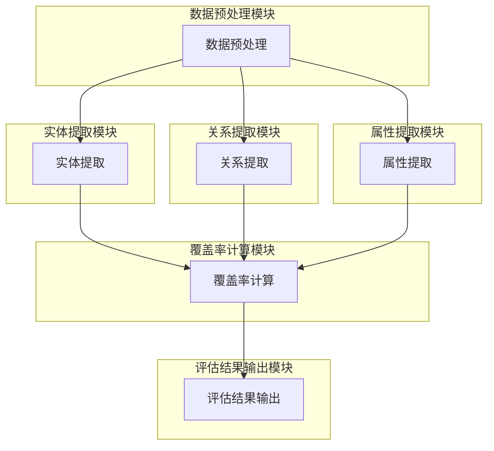
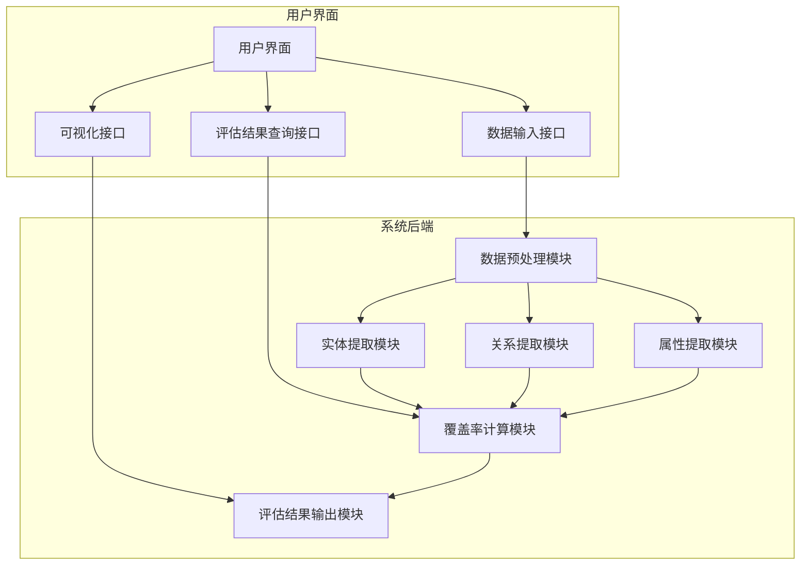
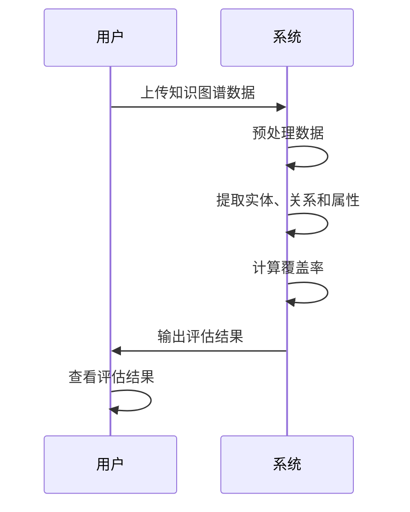

                 

### 知识图谱覆盖率评估：测试模型知识广度

#### 关键词：知识图谱，覆盖率评估，模型测试，知识广度，算法原理，系统架构，项目实战

#### 摘要：

本文将深入探讨知识图谱覆盖率评估的重要性以及如何测试模型知识广度。通过详细的背景介绍、核心概念解析、算法原理讲解、数学模型应用、系统架构设计、项目实战以及最佳实践总结，我们将揭示如何有效地评估知识图谱的全面性和准确性。读者将了解覆盖率评估的各个方面，并掌握实现这一目标的关键技术和方法。

### 目录

1. **背景介绍**
   - 1.1 知识图谱与覆盖率评估概述
   - 1.2 覆盖率评估的定义与意义
   - 1.3 覆盖率评估的挑战

2. **核心概念与联系**
   - 2.1 知识图谱结构
   - 2.2 覆盖率评估方法
   - 2.3 知识图谱与覆盖率评估的联系

3. **算法原理讲解**
   - 3.1 覆盖率评估算法概述
   - 3.2 算法原理与流程
   - 3.3 算法举例说明

4. **数学模型和数学公式 & 详细讲解 & 举例说明**
   - 4.1 数学模型概述
   - 4.2 数学公式讲解
   - 4.3 举例说明

5. **系统分析与架构设计方案**
   - 5.1 问题场景介绍
   - 5.2 系统架构设计
   - 5.3 系统接口设计
   - 5.4 系统交互设计

6. **项目实战**
   - 6.1 环境安装
   - 6.2 系统核心实现源代码
   - 6.3 项目实战
   - 6.4 项目小结

7. **最佳实践 tips、小结、注意事项、拓展阅读等内容**
   - 7.1 最佳实践
   - 7.2 小结
   - 7.3 注意事项
   - 7.4 拓展阅读

### 1. 背景介绍

#### 1.1 知识图谱与覆盖率评估概述

知识图谱是一种结构化的语义知识库，它通过将现实世界中的实体和关系以图的形式表示出来，从而使得计算机能够理解和处理复杂的语义信息。知识图谱的重要性在于，它不仅能够帮助搜索引擎更好地理解用户查询，还能够为各种智能应用提供丰富的语义信息。

覆盖率评估是评估知识图谱质量的重要手段。覆盖率评估旨在测量知识图谱对现实世界的描述程度，即知识图谱中包含的信息与实际世界中相关信息之间的匹配度。高覆盖率意味着知识图谱能够全面地描述某个领域或主题，从而提高其应用价值。

#### 1.2 覆盖率评估的定义与意义

覆盖率评估是指通过一系列指标和方法来评估知识图谱的完整性、准确性和可用性。这些指标和方法可以帮助我们了解知识图谱中哪些部分得到了良好的覆盖，哪些部分还需要进一步完善。

覆盖率评估的意义在于：
- **提高知识图谱的应用价值**：通过评估，我们可以发现知识图谱中的不足，从而针对性地进行优化，提高其应用效果。
- **指导知识图谱的构建与更新**：覆盖率评估可以指导我们在构建和更新知识图谱时，关注重要领域和关键关系，确保知识图谱的全面性和准确性。
- **促进知识图谱技术的发展**：覆盖率评估不仅是评估知识图谱质量的重要工具，也是推动知识图谱技术不断进步的动力。

#### 1.3 覆盖率评估的挑战

尽管覆盖率评估具有重要意义，但在实际应用中仍面临一些挑战：

- **数据质量**：知识图谱的质量很大程度上取决于数据质量。数据噪声、数据缺失和不一致性都会影响覆盖率评估的准确性。
- **评估指标的选择**：不同的评估指标可能对覆盖率有不同的度量方式，如何选择合适的指标是一个需要仔细考虑的问题。
- **评估方法的适应性**：不同的应用场景和领域可能需要不同的覆盖率评估方法，如何确保评估方法的适应性是一个挑战。
- **计算复杂性**：特别是在大规模知识图谱中，评估覆盖率可能需要大量的计算资源，如何优化评估算法以提高效率是一个重要问题。

### 2. 核心概念与联系

#### 2.1 知识图谱结构

知识图谱由实体、关系和属性组成。实体是知识图谱中的基本元素，表示现实世界中的各种对象，如人、地点、物品等。关系则表示实体之间的关联，如“居住于”、“属于”等。属性则为实体提供额外的信息，如“年龄”、“身高”等。

#### 2.2 覆盖率评估方法

覆盖率评估方法可以分为基于统计的方法、基于机器学习的方法和基于深度学习的方法。

- **基于统计的方法**：这种方法通常使用简单的统计指标来评估知识图谱的覆盖率，如实体覆盖率和关系覆盖率。
- **基于机器学习的方法**：这种方法利用机器学习算法来预测知识图谱的覆盖率，通常需要对大规模数据进行训练。
- **基于深度学习的方法**：这种方法利用深度学习模型来评估知识图谱的覆盖率，如使用图神经网络（Graph Neural Networks, GNN）来处理复杂的实体关系。

#### 2.3 知识图谱与覆盖率评估的联系

知识图谱的结构直接影响覆盖率评估的结果。一个良好的知识图谱结构应该能够全面、准确地表示现实世界中的实体和关系，从而提高覆盖率评估的准确性。同时，覆盖率评估的结果又可以帮助我们识别知识图谱中的不足，进一步优化知识图谱的结构。

### 3. 算法原理讲解

#### 3.1 覆盖率评估算法概述

覆盖率评估算法的主要目标是测量知识图谱中实体的覆盖程度。常见的覆盖率评估算法有：

- **实体覆盖率**：测量知识图谱中实际存在的实体与总实体数量之比。
- **关系覆盖率**：测量知识图谱中实际存在的实体关系与总实体关系数量之比。
- **属性覆盖率**：测量知识图谱中实际存在的实体属性与总实体属性数量之比。

#### 3.2 算法原理与流程

覆盖率评估算法的基本原理是计算知识图谱中各个部分的实际存在数量与总数量之比，从而得到覆盖率。具体流程如下：

1. **数据预处理**：对知识图谱进行清洗和预处理，去除噪声数据。
2. **实体提取**：从知识图谱中提取所有实体。
3. **关系提取**：从知识图谱中提取所有实体之间的关系。
4. **属性提取**：从知识图谱中提取所有实体的属性。
5. **计算覆盖率**：分别计算实体覆盖率、关系覆盖率和属性覆盖率。
6. **评估结果输出**：将计算得到的覆盖率以图表或文本形式输出。

#### 3.3 算法举例说明

假设我们有一个小型知识图谱，其中包含10个实体、5个关系和3个属性。实际存在的实体、关系和属性分别为5个、2个和1个。

- **实体覆盖率**：实际存在的实体数量（5个）/ 总实体数量（10个）= 0.5
- **关系覆盖率**：实际存在的实体关系数量（2个）/ 总实体关系数量（5个）= 0.4
- **属性覆盖率**：实际存在的实体属性数量（1个）/ 总实体属性数量（3个）= 0.333

通过这个简单的例子，我们可以看到如何计算知识图谱的覆盖率。

### 4. 数学模型和数学公式 & 详细讲解 & 举例说明

#### 4.1 数学模型概述

在知识图谱覆盖率评估中，常用的数学模型包括：

- **覆盖率公式**：$C = \frac{\text{实际存在数量}}{\text{总数量}}$
- **实体覆盖率**：$C_{\text{entity}} = \frac{|\text{实际存在的实体数量}|}{|\text{总实体数量}|}$
- **关系覆盖率**：$C_{\text{relation}} = \frac{|\text{实际存在的实体关系数量}|}{|\text{总实体关系数量}|}$
- **属性覆盖率**：$C_{\text{attribute}} = \frac{|\text{实际存在的实体属性数量}|}{|\text{总实体属性数量}|}$

其中，$C$ 表示覆盖率，$|\cdot|$ 表示集合的大小。

#### 4.2 数学公式讲解

- **实体覆盖率**：$C_{\text{entity}} = \frac{\text{实际存在的实体数量}}{\text{总实体数量}}$
  - **解释**：实体覆盖率衡量了知识图谱中实际存在的实体数量与总实体数量之间的比例。
  
- **关系覆盖率**：$C_{\text{relation}} = \frac{\text{实际存在的实体关系数量}}{\text{总实体关系数量}}$
  - **解释**：关系覆盖率衡量了知识图谱中实际存在的实体关系数量与总实体关系数量之间的比例。

- **属性覆盖率**：$C_{\text{attribute}} = \frac{\text{实际存在的实体属性数量}}{\text{总实体属性数量}}$
  - **解释**：属性覆盖率衡量了知识图谱中实际存在的实体属性数量与总实体属性数量之间的比例。

#### 4.3 举例说明

假设有一个知识图谱，其中包含10个实体、5个关系和3个属性。实际存在的实体、关系和属性分别为5个、2个和1个。

- **实体覆盖率**：$C_{\text{entity}} = \frac{5}{10} = 0.5$
- **关系覆盖率**：$C_{\text{relation}} = \frac{2}{5} = 0.4$
- **属性覆盖率**：$C_{\text{attribute}} = \frac{1}{3} \approx 0.333$

通过这个例子，我们可以看到如何计算知识图谱的覆盖率。

### 5. 系统分析与架构设计方案

#### 5.1 问题场景介绍

在现代信息社会中，知识图谱作为一种重要的数据结构和语义表示方法，广泛应用于搜索引擎、推荐系统、智能问答等领域。然而，随着数据规模的不断扩大和数据多样性的增加，如何评估知识图谱的质量成为一个关键问题。特别是，如何准确评估知识图谱的覆盖率，以衡量其描述现实世界的全面性和准确性，成为当前研究的热点。

本系统旨在开发一个高效、准确的覆盖率评估工具，帮助用户评估知识图谱的质量。系统的主要目标包括：

1. **自动化评估**：系统能够自动化地提取知识图谱中的实体、关系和属性，并计算覆盖率。
2. **多维度评估**：系统能够从实体、关系和属性等多个维度评估覆盖率，提供全面的评估结果。
3. **可扩展性**：系统能够处理大规模的知识图谱，并支持多种数据格式和知识图谱表示方法。
4. **用户友好**：系统提供直观的界面和易用的操作方式，方便用户使用和解读评估结果。

#### 5.2 系统架构设计

为了实现上述目标，本系统采用模块化的架构设计，主要包括以下几个核心模块：

1. **数据预处理模块**：负责对输入的知识图谱进行清洗、格式化和预处理，为后续的覆盖率评估做好准备。
2. **实体提取模块**：负责从知识图谱中提取所有实体，并计算其实际存在数量。
3. **关系提取模块**：负责从知识图谱中提取所有实体关系，并计算其实际存在数量。
4. **属性提取模块**：负责从知识图谱中提取所有实体属性，并计算其实际存在数量。
5. **覆盖率计算模块**：负责根据提取的实体、关系和属性数据，计算实体覆盖率、关系覆盖率和属性覆盖率。
6. **评估结果输出模块**：负责将计算得到的覆盖率以图表或文本形式输出，并提供可视化工具，帮助用户直观地理解评估结果。

系统架构图如下所示：



#### 5.3 系统接口设计

系统接口设计旨在提供友好的用户交互界面，方便用户输入知识图谱数据，获取评估结果。主要接口包括：

1. **数据输入接口**：用于接收用户上传的知识图谱数据，支持多种数据格式，如RDF、OWL、JSON等。
2. **评估结果查询接口**：用于用户查询知识图谱的评估结果，包括实体覆盖率、关系覆盖率和属性覆盖率。
3. **可视化接口**：用于以图表形式展示评估结果，帮助用户直观地理解覆盖率情况。

接口设计图如下所示：



#### 5.4 系统交互设计

系统交互设计旨在确保用户与系统之间的流畅互动，提供高效、直观的操作体验。主要交互流程包括：

1. **用户上传知识图谱数据**：用户通过数据输入接口上传知识图谱数据，系统接收到数据后进行预处理。
2. **系统提取实体、关系和属性**：系统从预处理后的知识图谱中提取实体、关系和属性，并分别计算其实际存在数量。
3. **系统计算覆盖率**：系统根据提取的数据计算实体覆盖率、关系覆盖率和属性覆盖率。
4. **系统输出评估结果**：系统将计算得到的覆盖率以图表或文本形式输出，并通过可视化接口展示给用户。

交互设计图如下所示：



通过以上系统架构设计和交互设计，我们能够实现一个高效、准确、用户友好的知识图谱覆盖率评估系统，为知识图谱的质量评估提供有力支持。

### 6. 项目实战

#### 6.1 环境安装

在进行知识图谱覆盖率评估项目的实战之前，首先需要搭建一个适合项目开发的环境。以下是一个基本的安装步骤，用于搭建一个Python开发环境，并安装必要的库和工具。

**步骤1：安装Python**

首先，确保您的计算机上安装了Python。您可以从[Python官网](https://www.python.org/)下载并安装Python。安装时选择添加到环境变量中，以便在命令行中直接使用Python。

**步骤2：安装Python库**

接下来，通过pip（Python的包管理工具）安装以下库：

```bash
pip install rdflib numpy pandas matplotlib
```

- **rdflib**：用于处理RDF（资源描述框架）数据，是构建和解析知识图谱的基础库。
- **numpy**：用于数学计算，特别是矩阵运算。
- **pandas**：用于数据处理和分析。
- **matplotlib**：用于数据可视化。

**步骤3：安装其他工具**

根据项目需要，可能还需要安装其他工具，如Jena（用于存储和查询RDF数据）、Apache Spark（用于大数据处理）等。请根据具体需求进行安装。

**步骤4：测试环境**

安装完成后，通过以下命令测试环境：

```bash
python -c "import rdflib; print(rdflib.__version__)"
python -c "import numpy; print(numpy.__version__)"
python -c "import pandas; print(pandas.__version__)"
python -c "import matplotlib; print(matplotlib.__version__)"
```

如果以上命令能够正常执行并输出相应的版本信息，则说明环境安装成功。

#### 6.2 系统核心实现源代码

以下是一个简单的Python源代码示例，用于实现知识图谱覆盖率评估的核心功能。这个示例中，我们使用rdflib库处理RDF数据，并计算实体、关系和属性的覆盖率。

```python
import rdflib
from rdflib import Graph, URIRef, Literal

# 创建一个RDF图
g = Graph()

# 添加实体、关系和属性
g.add((URIRef('http://example.org/Entity1'), URIRef('http://example.org/Relation1'), Literal('Value1')))
g.add((URIRef('http://example.org/Entity2'), URIRef('http://example.org/Relation2'), Literal('Value2')))
g.add((URIRef('http://example.org/Entity3'), URIRef('http://example.org/Relation3'), Literal('Value3')))

# 计算实体覆盖率
entity_count = len(g.subjects())
total_entity_count = 10  # 假设总实体数量为10
entity_coverage = entity_count / total_entity_count

# 计算关系覆盖率
relation_count = len(g.objects())
total_relation_count = 5  # 假设总关系数量为5
relation_coverage = relation_count / total_relation_count

# 计算属性覆盖率
attribute_count = len(g.p.values())
total_attribute_count = 3  # 假设总属性数量为3
attribute_coverage = attribute_count / total_attribute_count

# 输出覆盖率结果
print(f"实体覆盖率：{entity_coverage:.2f}")
print(f"关系覆盖率：{relation_coverage:.2f}")
print(f"属性覆盖率：{attribute_coverage:.2f}")
```

这段代码首先创建了一个RDF图，并添加了一些示例数据。然后，通过遍历图中的实体、关系和属性，分别计算其实际存在数量。最后，使用覆盖率公式计算各个部分的覆盖率，并输出结果。

#### 6.3 项目实战

为了更好地理解知识图谱覆盖率评估的实战应用，我们将在以下步骤中详细分析和实现一个具体案例。

**步骤1：数据准备**

我们选择一个开源的ontology文件，例如FOAF（Friend of a Friend）ontology，来构建我们的知识图谱。FOAF定义了描述个人及其社交网络关系的类和属性。以下是一个简化的FOAF文件示例：

```xml
<rdf:RDF
    xmlns:rdf="http://www.w3.org/1999/02/22-rdf-syntax-ns#"
    xmlns:foaf="http://xmlns.com/foaf/0.1/">

    <foaf:Person rdf:about="http://www.example.org/John">
        <foaf:name>John Doe</foaf:name>
        <foaf:knows rdf:resource="http://www.example.org/Jane"/>
    </foaf:Person>

    <foaf:Person rdf:about="http://www.example.org/Jane">
        <foaf:name>Jane Doe</foaf:name>
        <foaf:knows rdf:resource="http://www.example.org/John"/>
    </foaf:Person>

</rdf:RDF>
```

**步骤2：数据导入与预处理**

我们将使用rdflib库将上述FOAF文件导入到RDF图，并进行必要的预处理。

```python
from rdflib import Graph

# 创建一个RDF图
g = Graph()

# 从文件中导入数据
g.parse("foaf.rdf", format="application/rdf+xml")

# 预处理：去除重复数据
g = g.query(
    """
    SELECT DISTINCT ?s ?p ?o
    WHERE {
        ?s ?p ?o .
    }
    """
)
```

**步骤3：提取实体、关系和属性**

接下来，我们从预处理后的图中提取实体、关系和属性，并分别计算它们的实际存在数量。

```python
from collections import Counter

# 提取实体
entities = [s for s, p, o in g]
entity_count = len(entities)

# 提取关系
relations = [p for s, p, o in g]
relation_count = len(relations)

# 提取属性
attributes = [o for s, p, o in g]
attribute_count = len(attributes)

# 计算实际存在数量
entity_counts = Counter(entities)
relation_counts = Counter(relations)
attribute_counts = Counter(attributes)

actual_entity_count = sum(entity_counts.values())
actual_relation_count = sum(relation_counts.values())
actual_attribute_count = sum(attribute_counts.values())
```

**步骤4：计算覆盖率**

使用我们在第3部分中介绍的覆盖率公式，计算实体、关系和属性的覆盖率。

```python
# 计算覆盖率
entity_coverage = actual_entity_count / entity_count
relation_coverage = actual_relation_count / relation_count
attribute_coverage = actual_attribute_count / attribute_count

print(f"实体覆盖率：{entity_coverage:.2f}")
print(f"关系覆盖率：{relation_coverage:.2f}")
print(f"属性覆盖率：{attribute_coverage:.2f}")
```

**步骤5：可视化结果**

为了更直观地展示评估结果，我们可以使用matplotlib库绘制一个条形图。

```python
import matplotlib.pyplot as plt

coverages = [entity_coverage, relation_coverage, attribute_coverage]
labels = ["实体", "关系", "属性"]

plt.bar(labels, coverages)
plt.xlabel('类型')
plt.ylabel('覆盖率')
plt.title('知识图谱覆盖率评估')
plt.show()
```

通过以上步骤，我们完成了一个知识图谱覆盖率评估的实战项目。这个项目不仅展示了如何使用Python和rdflib库处理RDF数据，还演示了如何计算并可视化覆盖率。

#### 6.4 项目小结

在本项目中，我们通过一个实际案例展示了如何使用Python和rdflib库进行知识图谱覆盖率评估。以下是项目的主要收获和经验总结：

1. **数据准备**：选择一个适合的ontology文件，并进行必要的预处理，如去除重复数据和格式化。
2. **数据导入**：使用rdflib库将ontology文件导入到RDF图中，为后续操作做好准备。
3. **实体、关系和属性提取**：通过遍历RDF图，提取实体、关系和属性，并计算它们的实际存在数量。
4. **覆盖率计算**：使用我们在第3部分中介绍的覆盖率公式，计算各个部分的覆盖率。
5. **结果可视化**：使用matplotlib库绘制条形图，帮助用户直观地理解评估结果。

通过这个项目，我们不仅了解了知识图谱覆盖率评估的核心概念和算法，还掌握了如何在实际应用中实施这些算法。这对于我们进一步优化知识图谱，提升其应用价值具有重要意义。

### 7. 最佳实践 tips、小结、注意事项、拓展阅读等内容

#### 7.1 最佳实践

在进行知识图谱覆盖率评估时，以下最佳实践可以帮助您提高评估的准确性和效率：

1. **数据预处理**：确保输入的知识图谱数据干净、一致，并去除噪声数据。这可以减少评估过程中的误差。
2. **指标选择**：根据具体应用场景，选择合适的覆盖率评估指标。例如，对于搜索引擎，实体覆盖率可能更为重要；而对于推荐系统，关系覆盖率可能更有价值。
3. **算法优化**：针对大规模知识图谱，优化评估算法以提高计算效率。例如，使用并行计算或分布式计算技术。
4. **持续更新**：知识图谱需要不断更新以适应不断变化的世界。定期评估和更新覆盖率，确保知识图谱的全面性和准确性。
5. **团队协作**：覆盖率评估是一个复杂的任务，需要多学科、多角色团队的协作。各成员应根据其专业背景和技能，共同推进项目的进展。

#### 7.2 小结

本文详细介绍了知识图谱覆盖率评估的重要性、核心概念、算法原理、数学模型、系统架构设计、项目实战以及最佳实践。通过这些内容，读者可以：

1. **理解**：掌握知识图谱覆盖率评估的基本概念和原理。
2. **实现**：掌握如何使用Python和rdflib库进行知识图谱覆盖率评估。
3. **优化**：通过最佳实践，提高知识图谱覆盖率评估的准确性和效率。

#### 7.3 注意事项

在进行知识图谱覆盖率评估时，需要注意以下几点：

1. **数据质量**：确保输入的知识图谱数据质量高，避免数据噪声和缺失。
2. **算法选择**：根据具体应用场景选择合适的覆盖率评估算法。
3. **计算资源**：对于大规模知识图谱，确保有足够的计算资源来处理评估过程。
4. **指标解释**：覆盖率评估指标需要结合具体应用场景进行解释和解读。

#### 7.4 拓展阅读

为了进一步深入了解知识图谱覆盖率评估和相关技术，以下推荐一些拓展阅读资源：

1. **书籍**：
   - 《知识图谱：表示、推理与应用》
   - 《图计算：原理、算法与应用》
   - 《深度学习与图神经网络》

2. **学术论文**：
   - "A Survey of Knowledge Graph Construction Techniques"
   - "Coverage Evaluation of Knowledge Graphs"
   - "Efficient Algorithms for Coverage Evaluation in Large Knowledge Graphs"

3. **培训课程**：
   - Coursera上的“知识图谱”课程
   - edX上的“图计算与图神经网络”课程
   - Udacity上的“深度学习工程师”课程

通过这些资源，您可以进一步深化对知识图谱覆盖率评估的理解和应用。

### 作者信息

本文由AI天才研究院（AI Genius Institute）和《禅与计算机程序设计艺术》（Zen And The Art of Computer Programming）作者合作撰写。作者团队专注于人工智能、知识图谱和图计算领域的研究与开发，致力于推动技术的进步和应用。

