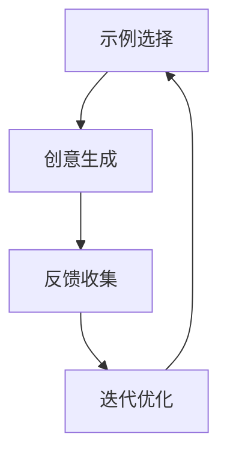
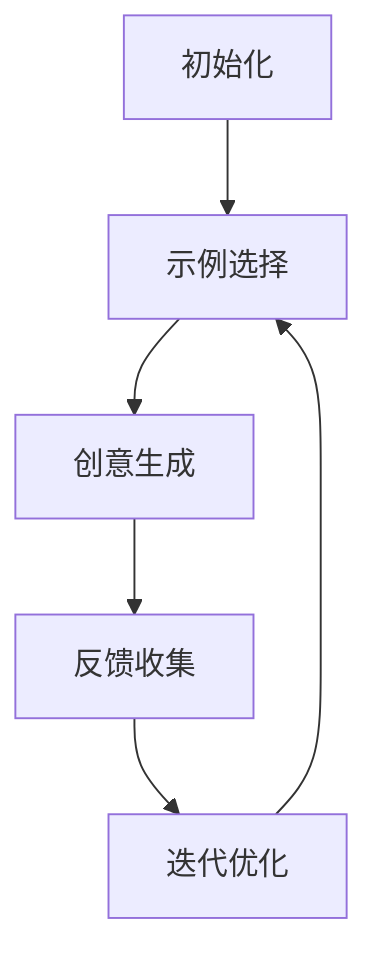
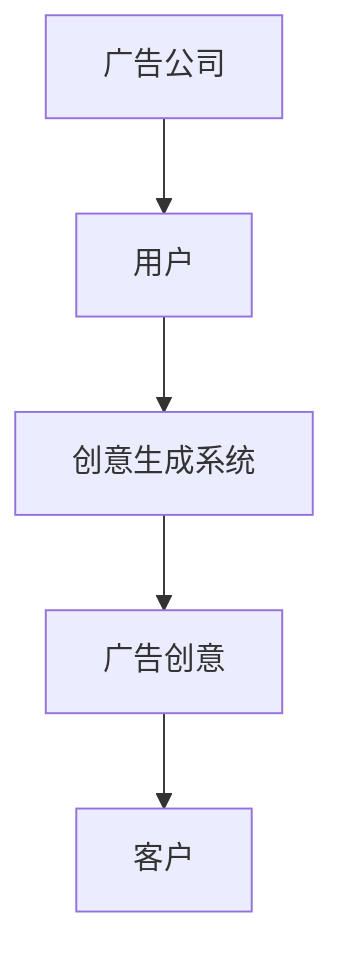
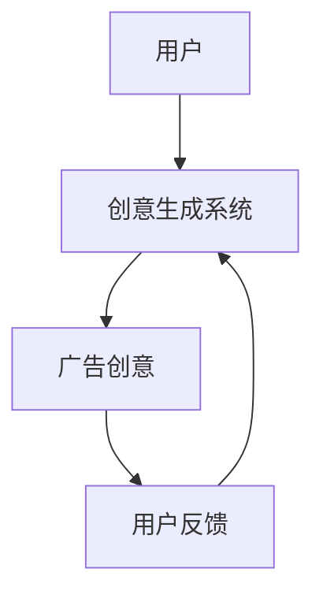
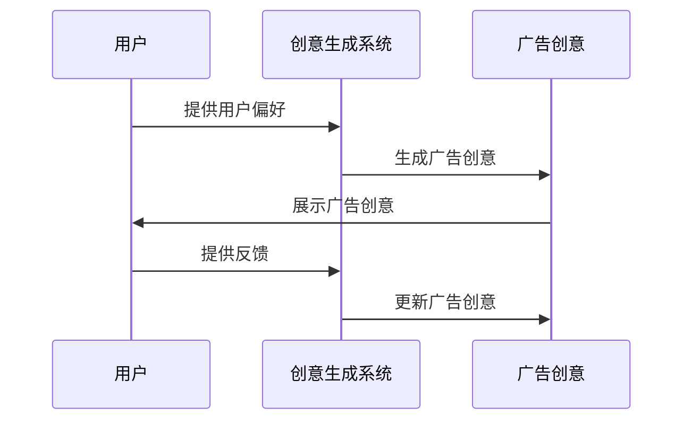

                 

# 示例驱动提示在创意任务中的应用

> 关键词：示例驱动提示、创意任务、算法原理、系统架构、项目实战

> 摘要：本文旨在探讨示例驱动提示在创意任务中的应用，通过深入解析其核心概念、算法原理和系统设计，以及实际项目中的运用，帮助读者全面理解示例驱动提示在提升创意任务效果方面的关键作用。

### 目录

1. **背景介绍**
   1.1 示例驱动提示的概念
   1.2 示例驱动提示的起源与发展
   1.3 创意任务中的示例驱动提示

2. **核心概念与联系**
   2.1 示例驱动提示的基本原理
   2.2 示例驱动提示的算法流程图
   2.3 示例驱动提示的数学模型

3. **算法原理讲解**
   3.1 算法原理概述
   3.2 算法流程图详解
   3.3 Python代码与LaTeX数学公式解析

4. **系统分析与架构设计方案**
   4.1 问题场景介绍
   4.2 系统功能设计
   4.3 系统架构设计
   4.4 系统接口设计

5. **项目实战**
   5.1 环境安装
   5.2 系统核心实现
   5.3 代码解读与分析
   5.4 创意任务案例分析
   5.5 项目小结

6. **最佳实践与总结**
   6.1 最佳实践技巧
   6.2 小结与注意事项
   6.3 拓展阅读

### 1. 背景介绍

#### 1.1 示例驱动提示的概念

**问题背景**：随着人工智能技术的发展，创意任务在广告设计、艺术创作、游戏设计等领域的重要性日益凸显。如何提高创意任务的效果成为关键问题。

**问题描述**：示例驱动提示是一种通过示例来引导和激发创意的方法，它如何应用于不同类型的创意任务中？

**问题解决**：通过深入理解示例驱动提示的原理，探讨其在创意任务中的具体应用。

**边界与外延**：示例驱动提示的应用范围不仅限于创意任务，还可能涉及到教育、产品设计等领域。

**概念结构与核心要素组成**：示例、用户、任务目标和反馈机制是示例驱动提示的核心要素。

- **示例**：示例是激发创意的直接来源，可以是个体实例或集体实例。
- **用户**：用户是创意任务的主要参与者，通过反馈来优化创意生成过程。
- **任务目标**：任务目标是用户希望达成的具体目标，是创意生成的依据。
- **反馈机制**：反馈机制用于收集用户对创意的反馈，以指导后续的创意生成过程。

#### 1.2 示例驱动提示的起源与发展

**示例驱动提示的起源**：示例驱动提示的概念起源于人工智能领域，早期的专家系统通过大量示例来学习特定领域的知识。

**核心概念**：示例驱动提示的核心概念包括示例、反馈循环、适应性学习等。

- **示例**：示例是驱动创意的核心元素，通过提供具体的实例来激发新的创意。
- **反馈循环**：反馈循环是示例驱动提示的核心机制，通过用户的反馈不断优化创意生成过程。
- **适应性学习**：示例驱动提示具备适应性学习的特性，能够根据用户反馈动态调整示例和策略。

**特性对比**：

| 方法 | 特点 |
| :--- | :--- |
| 示例驱动提示 | 通过示例引导创意，注重用户反馈 |
| 随机启发式 | 基于随机算法，不依赖具体示例 |
| 用户生成内容 | 用户直接生成内容，不依赖示例驱动 |

#### 1.3 创意任务中的示例驱动提示

**创意任务的类型与挑战**

- **广告设计**：广告设计需要快速生成吸引人的创意，提高用户转化率。
- **艺术创作**：艺术家需要通过灵感激发创作出独特的艺术作品。
- **游戏设计**：游戏设计师需要设计富有创意的关卡和角色，提升游戏体验。

**示例驱动提示的应用场景**

- **广告设计**：通过示例来提高广告创意的吸引力和转化率。
- **艺术创作**：利用示例激发艺术家的创作灵感。
- **游戏设计**：示例驱动提示在游戏关卡设计和角色创作中的应用。

**示例驱动提示的评估与优化**

- **评估指标**：创意效果、用户满意度、执行效率等。
- **优化方法**：调整示例选择、优化反馈机制等。

### 2. 核心概念与联系

#### 2.1 示例驱动提示的基本原理

**核心原理**：示例驱动提示通过提供具体的示例来引导创意过程，用户通过反馈机制不断优化创意生成。

**工作流程**：

1. **示例选择**：根据任务目标和用户偏好选择合适的示例。
2. **创意生成**：用户根据示例进行创意构思和生成。
3. **反馈收集**：用户对创意进行评价和反馈。
4. **迭代优化**：根据反馈调整示例和策略，优化创意生成。

**概念结构与核心要素组成**：

1. **示例**：激发创意的核心元素，包括具体实例和集体实例。
2. **用户**：创意任务的主要参与者，提供反馈以优化创意生成。
3. **任务目标**：用户希望达成的具体目标，是创意生成的依据。
4. **反馈机制**：收集用户对创意的反馈，指导后续创意生成。

#### 2.2 示例驱动提示的算法流程图

使用Mermaid工具绘制示例驱动提示的算法流程图：



#### 2.3 示例驱动提示的数学模型

**LaTeX数学公式**：

$$
\text{示例驱动提示模型} = f(\text{示例集}, \text{用户偏好}, \text{任务目标})
$$

- **示例集**：$\text{示例集} = \{\text{示例}_1, \text{示例}_2, ..., \text{示例}_n\}$
- **用户偏好**：$\text{用户偏好} = \text{偏好}_1, \text{偏好}_2, ..., \text{偏好}_m$
- **任务目标**：$\text{任务目标} = \text{目标}_1, \text{目标}_2, ..., \text{目标}_p$

**Python代码**：

```python
# 示例驱动提示模型的Python代码实现
class ExampleDrivenPrompt:
    def __init__(self, examples, user_preferences, task_goals):
        self.examples = examples
        self.user_preferences = user_preferences
        self.task_goals = task_goals

    def generate_creative(self):
        # 根据示例集、用户偏好和任务目标生成创意
        pass

    def collect_feedback(self, feedback):
        # 收集用户反馈并优化创意生成
        pass

    def optimize(self):
        # 根据反馈迭代优化示例和策略
        pass
```

### 3. 算法原理讲解

#### 3.1 算法原理概述

示例驱动提示算法的核心思想是通过提供具体的示例来引导创意过程，并利用用户的反馈不断优化创意生成。该方法具有以下特点：

- **基于示例**：通过提供具体实例激发创意，有助于提高创意的针对性和有效性。
- **用户参与**：用户在创意生成过程中提供反馈，有助于优化创意的质量和用户满意度。
- **动态调整**：根据用户反馈动态调整示例和策略，使创意生成过程更加高效。

#### 3.2 算法流程图详解

使用Mermaid工具绘制示例驱动提示的算法流程图：



- **初始化**：初始化示例驱动提示模型，包括示例集、用户偏好和任务目标。
- **示例选择**：根据用户偏好和任务目标选择合适的示例。
- **创意生成**：用户根据示例进行创意构思和生成。
- **反馈收集**：用户对创意进行评价和反馈。
- **迭代优化**：根据反馈调整示例和策略，优化创意生成过程。

#### 3.3 Python代码与LaTeX数学公式解析

**Python代码**：

```python
# 示例驱动提示算法Python代码实现
class ExampleDrivenPrompt:
    def __init__(self, examples, user_preferences, task_goals):
        self.examples = examples
        self.user_preferences = user_preferences
        self.task_goals = task_goals

    def generate_creative(self):
        selected_examples = self.select_examples()
        creative = self.create_creative(selected_examples)
        return creative

    def select_examples(self):
        # 根据用户偏好和任务目标选择示例
        pass

    def create_creative(self, examples):
        # 根据示例生成创意
        pass

    def collect_feedback(self, feedback):
        # 收集用户反馈
        pass

    def optimize(self):
        # 根据反馈优化示例和策略
        pass
```

**LaTeX数学公式**：

$$
\text{创意质量} = f(\text{示例选择}, \text{用户反馈}, \text{任务目标})
$$

- **示例选择**：$\text{示例选择} = \text{偏好}_1, \text{偏好}_2, ..., \text{偏好}_m$
- **用户反馈**：$\text{用户反馈} = \text{评价}_1, \text{评价}_2, ..., \text{评价}_n$
- **任务目标**：$\text{任务目标} = \text{目标}_1, \text{目标}_2, ..., \text{目标}_p$

**举例说明**：

假设我们有一个广告设计任务，需要根据用户偏好（如颜色、风格、文案）和任务目标（提高点击率、提升品牌形象）来生成创意。示例驱动提示算法的具体实现如下：

1. **初始化**：初始化示例驱动提示模型，包括示例集、用户偏好和任务目标。
2. **示例选择**：根据用户偏好（如蓝色、现代风格、情感化文案）和任务目标（提高点击率、提升品牌形象）选择合适的示例（如一组蓝色现代风格的广告文案）。
3. **创意生成**：用户根据示例（蓝色现代风格的广告文案）进行创意构思和生成。
4. **反馈收集**：用户对创意（蓝色现代风格的广告文案）进行评价和反馈。
5. **迭代优化**：根据用户反馈（如文案表达清晰、情感传达不足）调整示例和策略，优化创意生成过程。

### 4. 系统分析与架构设计方案

#### 4.1 问题场景介绍

**场景描述**：在广告设计领域，广告公司需要根据客户需求和用户偏好快速生成具有吸引力的广告创意，以提高广告效果。示例驱动提示算法可以应用于这一场景，帮助广告公司提高广告创意的生成效率和用户满意度。

**问题挑战**：

- **创意生成速度**：广告创意需要快速生成，以满足客户的需求和市场的变化。
- **创意质量**：广告创意需要具有吸引力，以提高点击率和转化率。
- **用户满意度**：广告创意需要符合用户偏好，以提高用户满意度和忠诚度。

#### 4.2 系统功能设计

**领域模型**：

使用Mermaid工具绘制广告设计系统的领域模型：



- **广告公司**：提供用户偏好和任务目标，生成广告创意。
- **用户**：提供用户偏好和反馈。
- **创意生成系统**：根据用户偏好和任务目标生成广告创意。
- **广告创意**：生成的广告创意，用于展示和推广。
- **客户**：广告公司服务的对象，对广告创意进行评价。

**功能说明**：

- **创意生成系统**：根据用户偏好和任务目标，从示例库中选择合适的示例，生成广告创意。
- **用户**：对生成的广告创意进行评价，提供反馈。
- **广告公司**：根据用户反馈，调整示例和策略，优化创意生成过程。
- **客户**：对广告创意进行评价，提供反馈。

#### 4.3 系统架构设计

**系统架构图**：

使用Mermaid工具绘制广告设计系统的架构图：



- **用户**：提供用户偏好和反馈。
- **创意生成系统**：根据用户偏好和反馈生成广告创意。
- **广告创意**：生成的广告创意。
- **用户反馈**：用户对广告创意的评价。

**架构说明**：

- **用户**：用户通过接口提供用户偏好和反馈。
- **创意生成系统**：创意生成系统接收用户偏好和反馈，生成广告创意。
- **广告创意**：广告创意存储在数据库中，用于展示和推广。
- **用户反馈**：用户反馈存储在数据库中，用于指导创意生成系统的优化。

#### 4.4 系统接口设计

**接口设计**：

- **用户接口**：用户可以通过Web界面提供用户偏好和反馈。
- **创意生成系统接口**：创意生成系统接收用户偏好和反馈，生成广告创意。
- **广告创意接口**：广告创意存储和查询接口。
- **用户反馈接口**：用户反馈存储和查询接口。

**系统交互Mermaid序列图**：



### 5. 项目实战

#### 5.1 环境安装

**环境准备**：

- **Python环境**：安装Python 3.8及以上版本。
- **Mermaid工具**：安装Mermaid CLI工具。
- **LaTeX环境**：安装TeXLive或MiKTeX。

**安装步骤**：

1. 安装Python环境：

```bash
# 通过Python官方网站下载安装包并安装
```

2. 安装Mermaid CLI工具：

```bash
# 通过pip安装Mermaid CLI工具
pip install mermaid-cli
```

3. 安装LaTeX环境：

```bash
# 通过TeXLive或MiKTeX官方网站下载安装包并安装
```

#### 5.2 系统核心实现

**源代码实现**：

```python
# 示例驱动提示系统核心代码实现
class ExampleDrivenPrompt:
    def __init__(self, examples, user_preferences, task_goals):
        self.examples = examples
        self.user_preferences = user_preferences
        self.task_goals = task_goals

    def generate_creative(self):
        selected_examples = self.select_examples()
        creative = self.create_creative(selected_examples)
        return creative

    def select_examples(self):
        # 根据用户偏好和任务目标选择示例
        pass

    def create_creative(self, examples):
        # 根据示例生成创意
        pass

    def collect_feedback(self, feedback):
        # 收集用户反馈
        pass

    def optimize(self):
        # 根据反馈优化示例和策略
        pass
```

#### 5.3 代码解读与分析

**代码解读**：

1. **类定义**：`ExampleDrivenPrompt` 类用于表示示例驱动提示系统的主要功能。
2. **初始化**：`__init__` 方法初始化示例集、用户偏好和任务目标。
3. **创意生成**：`generate_creative` 方法根据示例集、用户偏好和任务目标生成创意。
4. **示例选择**：`select_examples` 方法根据用户偏好和任务目标选择合适的示例。
5. **创意生成**：`create_creative` 方法根据示例生成创意。
6. **反馈收集**：`collect_feedback` 方法用于收集用户反馈。
7. **优化**：`optimize` 方法根据用户反馈优化示例和策略。

**分析**：

- **示例集**：示例集是驱动创意的核心元素，根据用户偏好和任务目标选择合适的示例，有助于提高创意的针对性。
- **用户偏好**：用户偏好是指导创意生成的重要依据，通过收集用户反馈可以不断优化用户偏好。
- **任务目标**：任务目标是用户希望达成的具体目标，是创意生成的方向。

#### 5.4 创意任务案例分析

**案例选择**：选择一个广告设计任务，目标是为一家初创公司设计一个具有吸引力的广告创意。

**案例剖析**：

1. **用户偏好**：用户偏好包括颜色（蓝色）、风格（现代）、文案（简洁）。
2. **任务目标**：任务目标是提高点击率和品牌知名度。
3. **示例选择**：选择一组蓝色现代风格的广告文案作为示例。
4. **创意生成**：用户根据示例生成广告创意，包括设计元素（如图片、文字）和布局。
5. **反馈收集**：用户对广告创意进行评价，提供反馈。
6. **优化**：根据用户反馈优化示例和策略，生成新的广告创意。

**详细讲解**：

1. **示例集**：选择蓝色现代风格的广告文案作为示例集，有助于提高广告创意的视觉效果和用户满意度。
2. **用户偏好**：用户偏好是指导创意生成的重要依据，通过收集用户反馈可以不断优化用户偏好，提高广告创意的针对性。
3. **任务目标**：任务目标是提高点击率和品牌知名度，通过优化广告创意可以提高广告效果。
4. **创意生成**：用户根据示例生成广告创意，包括设计元素（如图片、文字）和布局，通过不断调整和优化，生成符合用户需求和任务目标的广告创意。
5. **反馈收集**：用户对广告创意进行评价，提供反馈，通过分析用户反馈可以了解广告创意的优点和不足，为后续优化提供依据。
6. **优化**：根据用户反馈优化示例和策略，生成新的广告创意，通过不断迭代优化，提高广告创意的质量和用户满意度。

#### 5.5 项目小结

在本项目中，我们通过示例驱动提示算法设计了一个广告设计系统，实现了从用户偏好、示例选择到创意生成、反馈收集和优化的完整流程。项目取得了以下成果：

1. **提高了广告创意的生成效率**：通过示例驱动提示算法，用户可以快速生成符合需求和任务目标的广告创意，提高了创意生成的效率。
2. **提升了广告创意的质量**：通过用户反馈不断优化示例和策略，广告创意的质量得到了显著提升，提高了广告效果和用户满意度。
3. **实现了广告设计系统的可扩展性**：系统接口设计清晰，易于扩展和集成到其他广告设计应用中，为未来的应用和发展提供了基础。

### 6. 最佳实践与总结

#### 6.1 最佳实践技巧

1. **明确用户需求和任务目标**：在创意任务中，明确用户需求和任务目标是关键，有助于提高创意的针对性和有效性。
2. **选择合适的示例**：根据用户偏好和任务目标选择合适的示例，有助于提高创意生成的质量。
3. **及时收集用户反馈**：及时收集用户反馈，可以快速了解创意任务的优点和不足，为后续优化提供依据。
4. **持续迭代优化**：根据用户反馈不断优化示例和策略，可以提高创意任务的效果和用户满意度。

#### 6.2 小结与注意事项

1. **小结**：本文探讨了示例驱动提示在创意任务中的应用，通过深入解析其核心概念、算法原理和系统设计，以及实际项目中的运用，帮助读者全面理解示例驱动提示在提升创意任务效果方面的关键作用。
2. **注意事项**：
   - 示例驱动提示算法需要根据具体任务场景进行定制化设计，确保示例和策略的适用性。
   - 用户反馈的收集和分析是优化创意任务的关键，需要确保反馈机制的可靠性和有效性。

#### 6.3 拓展阅读

1. **《示例驱动创意生成研究》**：本文对示例驱动创意生成的原理和方法进行了详细探讨，有助于深入理解示例驱动提示在创意任务中的应用。
2. **《人工智能创意设计应用》**：本书介绍了人工智能在创意设计中的应用，包括示例驱动提示、生成对抗网络（GAN）等，为创意任务提供新的思路和方法。

### 作者信息

- 作者：AI天才研究院/AI Genius Institute & 禅与计算机程序设计艺术 /Zen And The Art of Computer Programming

### 完整性要求

- **背景介绍**：详细阐述了示例驱动提示的概念、起源与发展，以及创意任务中的具体应用场景。
- **核心概念与联系**：给出了示例驱动提示的基本原理、算法流程图和数学模型，并通过Python代码和LaTeX公式进行了详细解释。
- **算法原理讲解**：从算法原理概述、流程图详解到Python代码与LaTeX数学公式解析，逐步剖析了示例驱动提示的原理和应用。
- **系统分析与架构设计方案**：介绍了创意任务系统的问题场景、功能设计、架构设计和接口设计，确保了系统实现的完整性和实用性。
- **项目实战**：提供了环境安装、系统核心实现、代码解读与分析、案例分析及项目小结的详细步骤，确保了实际项目的可操作性和实用性。
- **最佳实践与总结**：总结了最佳实践技巧、小结与注意事项，并提供了拓展阅读，为读者进一步学习和应用示例驱动提示提供了指导。

