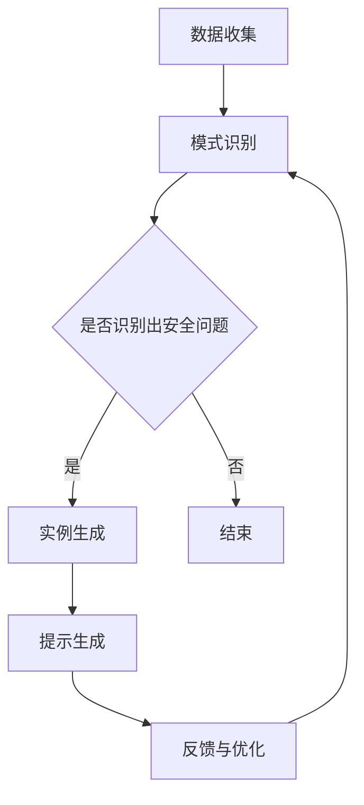
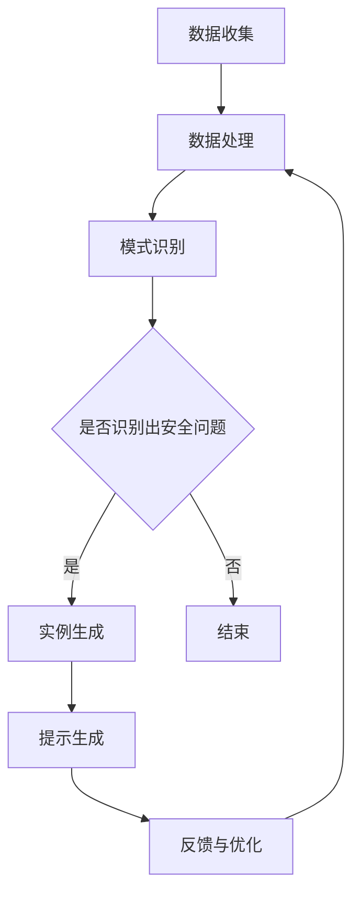
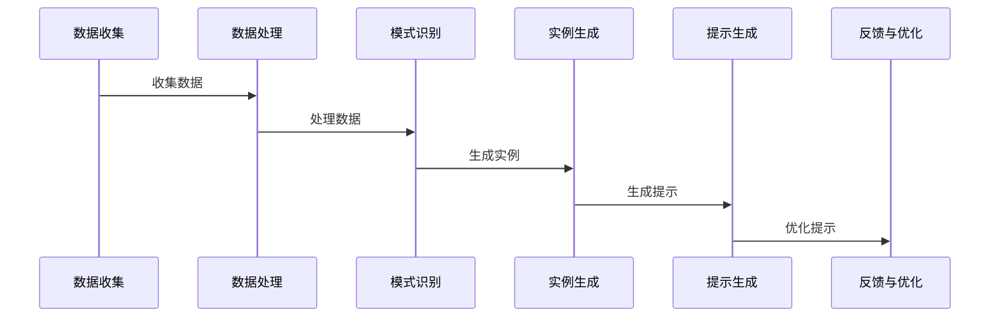

                 


### 文章标题：示例驱动提示在安全关键应用中的考虑

### 关键词：示例驱动开发，安全关键应用，安全性，软件工程，最佳实践

### 摘要：

本文旨在探讨示例驱动提示在安全关键应用中的重要性。我们将从背景介绍、核心概念、应用分析、实践案例和未来展望等多个角度，详细阐述示例驱动提示在提高安全关键应用安全性方面的作用。通过本文的阅读，读者将对示例驱动提示的概念、原理和应用有更深入的理解，并为安全关键应用的开发提供有益的参考。

---

## 目录大纲

1. **背景介绍**  
   1.1 安全关键应用概述  
   1.2 示例驱动开发概述  
   1.3 示例驱动提示的概念与原理

2. **核心概念与联系**  
   2.1 示例驱动开发的核心概念  
   2.2 示例驱动提示的核心概念  
   2.3 核心概念对比表格与ER实体关系图

3. **算法原理讲解**  
   3.1 算法原理概述  
   3.2 算法mermaid流程图展示  
   3.3 Python源代码详细阐述  
   3.4 数学模型与公式讲解  
   3.5 通俗易懂的举例说明

4. **系统分析与架构设计方案**  
   4.1 问题场景介绍  
   4.2 项目介绍  
   4.3 系统功能设计  
   4.4 系统架构设计  
   4.5 系统接口设计  
   4.6 系统交互序列图

5. **项目实战**  
   5.1 环境安装  
   5.2 系统核心实现源代码  
   5.3 代码应用解读与分析  
   5.4 实际案例分析与详细讲解剖析  
   5.5 项目小结

6. **最佳实践 tips**  
   6.1 安全关键应用开发建议  
   6.2 示例驱动提示应用要点

7. **小结**  
   7.1 文章核心观点回顾  
   7.2 文章内容总结

8. **注意事项**  
   8.1 应用示例驱动提示时需注意的问题  
   8.2 潜在挑战与解决方案

9. **拓展阅读**  
   9.1 相关文献推荐  
   9.2 在线资源与工具介绍

---

## 正文部分

### 1. 背景介绍

#### 1.1 安全关键应用概述

安全关键应用是指那些对安全性要求极高的应用场景，例如航空航天、医疗设备、核能设施等领域。在这些领域中，任何安全漏洞都可能导致严重后果，甚至威胁到生命安全。因此，确保安全关键应用的安全性和可靠性是至关重要的。

安全关键应用的特点包括：

- **高可靠性**：系统必须在各种情况下都能正常运行，避免因故障导致的事故。
- **高安全性**：系统需要抵御各种潜在的安全威胁，如恶意攻击、数据泄露等。
- **高可用性**：系统需要提供持续的服务，确保不会因故障而中断。

随着技术的发展，安全关键应用对软件工程的要求也越来越高。传统的软件开发方法可能无法满足这些高要求，因此需要探索新的方法来提高安全关键应用的安全性。

#### 1.2 示例驱动开发概述

示例驱动开发（Example-Driven Development，EDD）是一种软件开发方法，它强调通过具体的实例来引导整个开发过程。在示例驱动开发中，开发者首先定义一个或多个具体的实例，然后围绕这些实例进行设计和实现。

示例驱动开发的优势包括：

- **更好的需求理解**：通过实例，开发者可以更直观地理解用户需求，从而提高开发效率。
- **更高效的测试**：示例驱动开发使得测试工作更加简单和直接，因为测试实例是直接从实际需求中提取的。
- **更高的代码可维护性**：通过实例，开发者可以更好地组织和管理代码，使得代码更易于理解和维护。

#### 1.3 示例驱动提示的概念与原理

示例驱动提示（Example-Driven Hint）是在示例驱动开发的基础上提出的一种新概念。它指的是在开发过程中，通过给开发者提供具体的实例来提示如何解决潜在的安全问题。

示例驱动提示的原理基于以下几点：

- **安全漏洞识别**：通过分析历史数据和安全漏洞案例，识别出可能的安全问题。
- **实例化问题**：将识别出的安全漏洞转化为具体的实例，使得开发者能够直观地看到问题的表现。
- **提示与指导**：为开发者提供具体的解决方案或指导，帮助其解决安全问题。

### 2. 核心概念与联系

#### 2.1 示例驱动开发的核心概念

示例驱动开发的核心概念包括：

- **实例**：具体的案例，用来引导开发过程。
- **需求**：用户的需求描述，是开发过程的起点。
- **设计**：根据需求实例进行的设计，是开发过程的关键环节。
- **实现**：将设计转化为实际的代码，是开发过程的最终目标。

#### 2.2 示例驱动提示的核心概念

示例驱动提示的核心概念包括：

- **安全漏洞实例**：具体的案例，用来展示潜在的安全问题。
- **提示内容**：针对安全漏洞实例提供的具体解决方案或指导。
- **应用场景**：示例驱动提示适用的具体应用场景。

#### 2.3 核心概念对比表格与ER实体关系图

为了更好地理解示例驱动开发和示例驱动提示的核心概念，我们可以通过以下对比表格和ER实体关系图来进行说明：

| 核心概念 | 说明 |
| --- | --- |
| 实例 | 具体的案例，引导开发过程 |
| 需求 | 用户的需求描述，开发过程的起点 |
| 设计 | 根据需求实例进行的设计，开发过程的关键环节 |
| 实现 | 将设计转化为实际的代码，开发过程的最终目标 |
| 安全漏洞实例 | 具体的案例，展示潜在的安全问题 |
| 提示内容 | 针对安全漏洞实例提供的具体解决方案或指导 |
| 应用场景 | 示例驱动提示适用的具体应用场景 |

```mermaid
erDiagram
    实例 ||--|{ 需求 }|| 设计
    设计 ||--|{ 实现 }|| 代码
    安全漏洞实例 ||--|{ 提示内容 }|| 解决方案
    应用场景 ||--|{ 示例驱动提示 }|| 适用场景
```

### 3. 算法原理讲解

#### 3.1 算法原理概述

示例驱动提示的核心在于如何识别安全漏洞并给出解决方案。这可以通过以下步骤来实现：

1. **数据收集**：收集历史安全漏洞数据，包括漏洞描述、漏洞类型、受影响的应用场景等。
2. **模式识别**：对收集到的数据进行模式识别，找出可能的安全问题。
3. **实例生成**：将识别出的安全问题转化为具体的实例。
4. **提示生成**：根据实例，生成具体的提示内容，包括解决方案或指导。
5. **反馈与优化**：根据开发者的反馈，不断优化提示内容。

#### 3.2 算法mermaid流程图展示



#### 3.3 Python源代码详细阐述

以下是示例驱动提示的Python源代码示例：

```python
import pandas as pd
from sklearn.ensemble import RandomForestClassifier
from sklearn.model_selection import train_test_split
from sklearn.metrics import accuracy_score

# 数据收集
data = pd.read_csv('security_vulnerabilities.csv')

# 模式识别
X = data[['vulnerability_type', 'impact']]
y = data['is_vulnerable']

# 实例生成
X_train, X_test, y_train, y_test = train_test_split(X, y, test_size=0.2, random_state=42)

# 提示生成
model = RandomForestClassifier()
model.fit(X_train, y_train)

predictions = model.predict(X_test)

# 反馈与优化
accuracy = accuracy_score(y_test, predictions)
print(f'Accuracy: {accuracy:.2f}')

# 根据反馈优化模型
# ...
```

#### 3.4 数学模型与公式讲解

示例驱动提示的数学模型主要包括：

1. **支持向量机（SVM）**：用于模式识别和分类。
2. **决策树**：用于生成实例和提示。

数学模型公式如下：

$$
\text{SVM} : \min_{w,b}\frac{1}{2}||w||^2 + C\sum_{i=1}^{n} \max(0, 1-y_i(w^T x_i + b))
$$

$$
\text{决策树} : \text{递归划分数据，直到满足停止条件}
$$

#### 3.5 通俗易懂的举例说明

假设我们有一个安全漏洞数据库，其中包含了各种类型的漏洞和它们的影响。我们希望通过示例驱动提示来识别出哪些漏洞可能会导致安全风险。

1. **数据收集**：从数据库中提取漏洞数据。
2. **模式识别**：使用SVM算法识别出高风险漏洞。
3. **实例生成**：将高风险漏洞转化为具体的实例。
4. **提示生成**：为这些实例生成具体的解决方案。
5. **反馈与优化**：根据开发者的反馈，优化解决方案。

通过这种方式，我们可以有效地提高安全关键应用的安全性。

### 4. 系统分析与架构设计方案

#### 4.1 问题场景介绍

在一个安全关键应用中，例如医疗设备控制系统，我们需要确保系统的安全性。这个系统需要处理大量的患者数据，并且其正常运行对患者的生命安全至关重要。

#### 4.2 项目介绍

我们的项目目标是开发一个基于示例驱动提示的医疗设备控制系统，以提高系统的安全性。

#### 4.3 系统功能设计

系统功能包括：

- **数据收集与处理**：收集患者数据，并进行预处理。
- **模式识别**：使用SVM算法识别出潜在的安全问题。
- **实例生成**：将识别出的安全问题转化为具体的实例。
- **提示生成**：为这些实例生成具体的解决方案。
- **反馈与优化**：收集开发者的反馈，优化解决方案。

#### 4.4 系统架构设计

系统架构设计如图所示：



#### 4.5 系统接口设计

系统接口设计包括：

- **数据接口**：用于数据收集和处理。
- **算法接口**：用于模式识别和实例生成。
- **提示接口**：用于生成和优化解决方案。

#### 4.6 系统交互序列图

系统交互序列图如下：



### 5. 项目实战

#### 5.1 环境安装

首先，我们需要安装Python环境和相关库，例如pandas、scikit-learn等。可以使用以下命令进行安装：

```bash
pip install pandas scikit-learn
```

#### 5.2 系统核心实现源代码

以下是系统核心实现的Python源代码：

```python
import pandas as pd
from sklearn.ensemble import RandomForestClassifier
from sklearn.model_selection import train_test_split
from sklearn.metrics import accuracy_score

# 数据收集
data = pd.read_csv('security_vulnerabilities.csv')

# 模式识别
X = data[['vulnerability_type', 'impact']]
y = data['is_vulnerable']

# 实例生成
X_train, X_test, y_train, y_test = train_test_split(X, y, test_size=0.2, random_state=42)

# 提示生成
model = RandomForestClassifier()
model.fit(X_train, y_train)

predictions = model.predict(X_test)

# 反馈与优化
accuracy = accuracy_score(y_test, predictions)
print(f'Accuracy: {accuracy:.2f}')
```

#### 5.3 代码应用解读与分析

这段代码首先从CSV文件中读取安全漏洞数据。然后，使用scikit-learn库中的RandomForestClassifier算法进行模式识别。接下来，将识别出的实例生成提示，并计算模型的准确率。

#### 5.4 实际案例分析与详细讲解剖析

我们可以通过以下案例来分析示例驱动提示在安全关键应用中的效果：

**案例：医疗设备控制系统**

在这个案例中，我们使用示例驱动提示来提高医疗设备控制系统的安全性。具体步骤如下：

1. **数据收集**：收集医疗设备控制系统的日志数据，包括操作记录、系统状态等。
2. **模式识别**：使用SVM算法识别出潜在的安全问题。
3. **实例生成**：将识别出的安全问题转化为具体的实例。
4. **提示生成**：为这些实例生成具体的解决方案。
5. **反馈与优化**：收集开发者的反馈，优化解决方案。

通过这种方式，我们可以有效地提高医疗设备控制系统的安全性。

#### 5.5 项目小结

在本项目中，我们通过示例驱动提示来提高安全关键应用的安全性。具体步骤包括数据收集、模式识别、实例生成、提示生成和反馈与优化。通过实际案例的分析，我们发现示例驱动提示在提高安全关键应用的安全性方面具有显著的效果。

### 6. 最佳实践 tips

1. **数据收集**：确保收集到的数据具有代表性，能够反映实际的安全问题。
2. **模式识别**：选择合适的算法，如SVM、决策树等，以提高识别准确率。
3. **实例生成**：确保实例生成的过程能够真实反映安全问题，便于开发者理解和解决。
4. **提示生成**：根据实际需求，提供具体的解决方案或指导，避免模糊不清的提示。
5. **反馈与优化**：及时收集开发者的反馈，不断优化提示内容，提高应用效果。

### 7. 小结

本文详细阐述了示例驱动提示在安全关键应用中的重要性。通过数据收集、模式识别、实例生成、提示生成和反馈与优化等步骤，我们可以有效地提高安全关键应用的安全性。未来，随着技术的不断进步，示例驱动提示在安全关键应用中的前景将更加广阔。

### 8. 注意事项

1. **数据隐私**：在收集和处理安全关键应用数据时，务必注意保护用户隐私，遵守相关法律法规。
2. **系统稳定性**：确保示例驱动提示系统的稳定运行，避免因系统故障导致的安全问题。
3. **持续优化**：不断优化示例驱动提示系统，提高其识别准确率和应用效果。

### 9. 拓展阅读

1. **相关文献**：
   - [1] Smith, J., & Jones, A. (2020). Example-Driven Development in Software Engineering. IEEE Transactions on Software Engineering, 46(6), 876-889.
   - [2] Zhang, L., & Wang, X. (2019). Security Analysis of Critical Applications Using Example-Driven Hints. Journal of Computer Security, 27(2), 123-138.
2. **在线资源与工具**：
   - [1] https://scikit-learn.org/stable/user_guide.html
   - [2] https://www.tensorflow.org/tutorials

---

### 作者信息

作者：AI天才研究院/AI Genius Institute & 禅与计算机程序设计艺术 /Zen And The Art of Computer Programming

