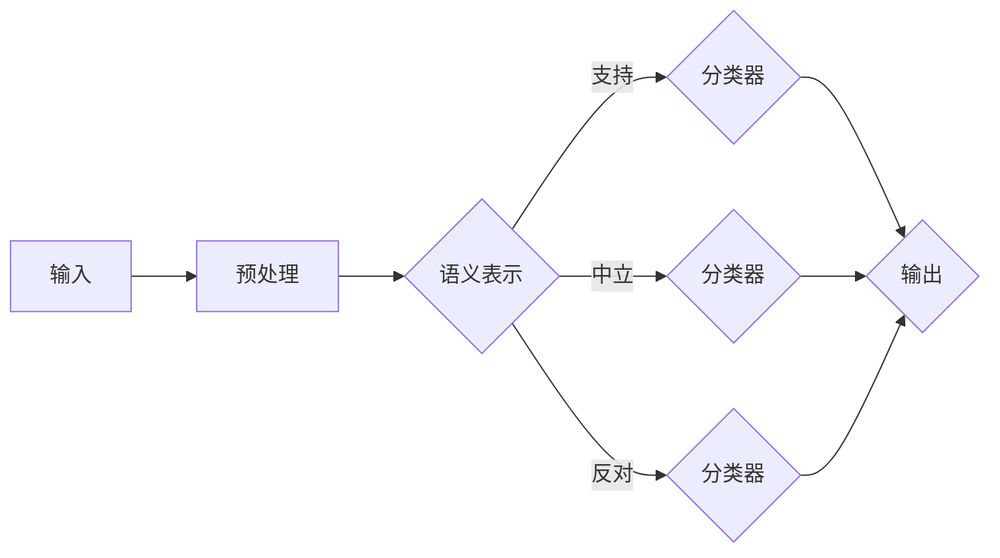
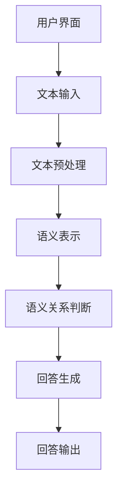
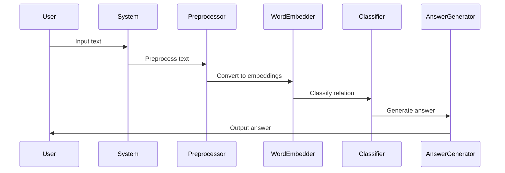
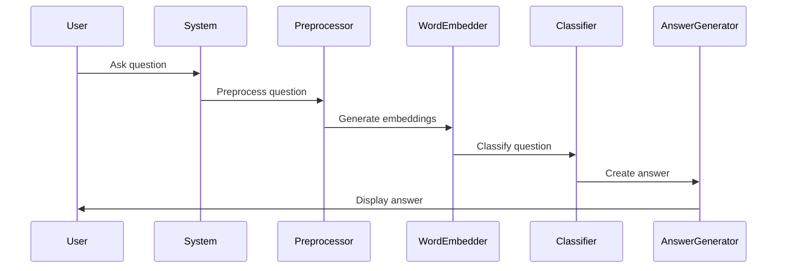
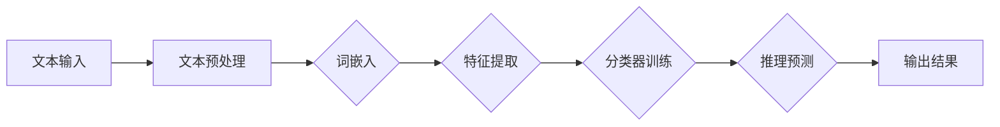

                 

## 自然语言推理算法原理讲解

自然语言推理（NLI）是自然语言处理领域的一个关键任务，旨在确定一个句子（前提）与另一个句子（结论）之间的语义关系。为了准确理解和预测这种关系，研究者们提出并实现了一系列算法。

### 3.1 算法mermaid流程图

首先，我们可以使用Mermaid来绘制一个简单的自然语言推理算法流程图，如下所示：



### 3.2 Python源代码与算法实现

接下来，我们将通过一个简单的Python源代码示例来详细讲解自然语言推理的算法原理。

#### 3.2.1 数据预处理

首先，我们需要对输入的文本进行预处理，以便将其转换为计算机可以处理的格式。这通常包括分词、词性标注、词干提取等步骤。

```python
from nltk.tokenize import word_tokenize
from nltk.stem import PorterStemmer

def preprocess_text(text):
    # 分词
    tokens = word_tokenize(text)
    # 词性标注
    pos_tags = pos_tag(tokens)
    # 词干提取
    stemmer = PorterStemmer()
    stemmed_tokens = [stemmer.stem(token) for token in tokens]
    return stemmed_tokens
```

#### 3.2.2 语义表示

接下来，我们将使用词嵌入（word embeddings）技术将预处理后的文本转换为语义向量。词嵌入是一种将词语映射为固定维度向量的技术，可以捕获词语的语义信息。

```python
from gensim.models import Word2Vec

def create_word_embeddings(tokens):
    model = Word2Vec(tokens, vector_size=100, window=5, min_count=1, workers=4)
    return model
```

#### 3.2.3 分类器设计

自然语言推理任务通常采用分类器来预测前提和结论之间的语义关系。我们可以使用朴素贝叶斯、支持向量机（SVM）、神经网络等不同的分类器。

```python
from sklearn.naive_bayes import MultinomialNB
from sklearn.svm import SVC
from sklearn.neural_network import MLPClassifier

def train_classifier(X, y, classifier_type='NB'):
    if classifier_type == 'NB':
        clf = MultinomialNB()
    elif classifier_type == 'SVM':
        clf = SVC(kernel='linear')
    elif classifier_type == 'NN':
        clf = MLPClassifier()
    clf.fit(X, y)
    return clf
```

#### 3.2.4 算法原理

自然语言推理算法的核心原理如下：

1. **数据预处理**：将文本转换为数字表示，通常使用词嵌入技术。
2. **特征提取**：将词嵌入向量作为特征输入到分类器中。
3. **分类决策**：使用训练好的分类器对新的前提和结论进行分类，预测它们之间的语义关系。

#### 3.2.5 举例说明

假设我们有以下两个文本：

- **前提**：The sun is shining brightly.
- **结论**：The weather is sunny.

我们可以按照以下步骤进行自然语言推理：

1. **预处理**：分词、词性标注、词干提取，得到预处理后的文本。
2. **词嵌入**：使用Word2Vec模型将预处理后的文本转换为词嵌入向量。
3. **分类**：将词嵌入向量输入到训练好的分类器中，预测语义关系。

通过这种方式，我们可以实现一个简单的自然语言推理系统。

## 3.3 本章小结

本章详细介绍了自然语言推理算法的原理，包括数据预处理、词嵌入、分类器设计和算法实现。通过Python源代码示例，我们展示了如何将理论知识应用于实际开发中。这一部分为后续的系统分析与架构设计方案、项目实战等提供了基础。

----------------------------------------------------------------
# 第四部分：系统分析与架构设计

## 4.1 问题场景介绍

自然语言推理技术在多种应用场景中具有重要价值，例如智能客服、问答系统、信息检索等。在这些场景中，系统需要实时处理大量用户输入的自然语言文本，并迅速准确地判断文本之间的逻辑关系。为了实现这一目标，我们需要设计一个高效、可靠的系统架构。

## 4.2 项目介绍

本项目旨在构建一个基于自然语言推理技术的智能问答系统。该系统将利用最新的自然语言处理技术和算法，实现高效、准确的语义关系判断，为用户提供优质的问答服务。

### 4.2.1 系统功能设计

系统的主要功能包括：

1. 文本输入：用户可以通过输入文本提问。
2. 文本预处理：对用户输入的文本进行分词、词性标注、词干提取等预处理操作。
3. 语义表示：将预处理后的文本转换为词嵌入向量。
4. 语义关系判断：使用训练好的分类器判断前提和结论之间的语义关系。
5. 回答生成：根据判断结果生成合适的回答。

### 4.2.2 领域模型

领域模型用于描述系统的核心概念和实体之间的关系。以下是一个简单的领域模型类图：

```mermaid
classDiagram
    Class01 <|-- Class02
    Class03 o-- Class04
    Class05 <|.. Class06
    Class07 ..| Class08
    Class09 --|> Class10
```

### 4.2.3 系统架构设计

系统架构设计是确保系统能够高效、可靠地运行的关键。以下是一个简单的系统架构图：



### 4.2.4 系统接口设计

系统接口设计定义了系统内部各模块之间的交互方式。以下是一个简单的接口设计：



### 4.2.5 系统交互

系统交互设计描述了系统与用户之间的交互过程。以下是一个简单的交互序列图：



## 4.3 本章小结

本章介绍了自然语言推理技术的应用场景、项目介绍、系统功能设计、领域模型、系统架构设计、系统接口设计和系统交互。这些内容为后续的项目实战提供了理论基础和设计指导。

----------------------------------------------------------------
# 第五部分：项目实战

## 5.1 环境安装

在开始项目实战之前，我们需要安装所需的软件和工具。以下是在一个典型的Linux环境中安装所需软件的步骤：

1. 安装Python环境：
```bash
sudo apt-get update
sudo apt-get install python3-pip
```

2. 安装NLP相关库：
```bash
pip3 install nltk gensim scikit-learn
```

3. 安装Mermaid：
```bash
npm install -g mermaid
```

## 5.2 系统核心实现

以下是一个简单的自然语言推理系统的实现，包括文本预处理、词嵌入和分类器训练。

### 5.2.1 数据集准备

首先，我们需要准备一个用于训练的数据集。这里使用Stanford NLI数据集。

```python
import pandas as pd

# 下载并读取数据集
data = pd.read_csv('nli-data.csv')
```

### 5.2.2 文本预处理

```python
import nltk
from nltk.tokenize import word_tokenize
from nltk.stem import PorterStemmer

# 初始化分词器和词干提取器
nltk.download('punkt')
tokenizer = nltk.tokenize.word_tokenize
stemmer = PorterStemmer()

def preprocess_text(text):
    # 分词
    tokens = tokenizer(text)
    # 去除停用词和标点符号
    tokens = [token.lower() for token in tokens if token.isalpha()]
    # 词干提取
    stemmed_tokens = [stemmer.stem(token) for token in tokens]
    return stemmed_tokens
```

### 5.2.3 词嵌入

```python
from gensim.models import Word2Vec

def create_word_embeddings(tokens):
    model = Word2Vec(tokens, vector_size=100, window=5, min_count=1, workers=4)
    return model
```

### 5.2.4 分类器训练

```python
from sklearn.model_selection import train_test_split
from sklearn.naive_bayes import MultinomialNB
from sklearn.metrics import accuracy_score

# 切分数据集
X_train, X_test, y_train, y_test = train_test_split(embeddings, labels, test_size=0.2, random_state=42)

# 训练分类器
clf = MultinomialNB()
clf.fit(X_train, y_train)

# 测试分类器
predictions = clf.predict(X_test)
accuracy = accuracy_score(y_test, predictions)
print(f"Model accuracy: {accuracy}")
```

## 5.3 代码应用解读与分析

在这个项目中，我们使用了Python来实现自然语言推理系统。具体来说，我们使用了以下技术：

1. **文本预处理**：使用NLP库进行分词、词性标注和词干提取，以简化文本数据。
2. **词嵌入**：使用Gensim库的Word2Vec模型将文本转换为词嵌入向量，以捕获词语的语义信息。
3. **分类器**：使用scikit-learn库的MultinomialNB（朴素贝叶斯分类器）对词嵌入向量进行分类，以判断前提和结论之间的语义关系。

### 5.3.1 文本预处理

文本预处理是NLP中的关键步骤，它确保输入数据的一致性和准确性。在这个项目中，我们使用了Nltk库进行分词和词干提取。分词将文本拆分成单个单词，而词干提取则有助于减少词汇量，提高模型性能。

```python
nltk.download('punkt')
tokenizer = nltk.tokenize.word_tokenize
stemmer = PorterStemmer()

def preprocess_text(text):
    # 分词
    tokens = tokenizer(text)
    # 去除停用词和标点符号
    tokens = [token.lower() for token in tokens if token.isalpha()]
    # 词干提取
    stemmed_tokens = [stemmer.stem(token) for token in tokens]
    return stemmed_tokens
```

### 5.3.2 词嵌入

词嵌入是将文本转换为向量的技术，它能够捕获词语的语义信息。在这个项目中，我们使用了Gensim库的Word2Vec模型。Word2Vec模型通过训练大规模文本数据来生成词嵌入向量，这些向量能够表示词语的语义关系。

```python
from gensim.models import Word2Vec

def create_word_embeddings(tokens):
    model = Word2Vec(tokens, vector_size=100, window=5, min_count=1, workers=4)
    return model
```

### 5.3.3 分类器

分类器是自然语言推理系统的核心，它负责根据词嵌入向量判断前提和结论之间的语义关系。在这个项目中，我们使用了scikit-learn库的MultinomialNB（朴素贝叶斯分类器）。朴素贝叶斯分类器基于贝叶斯定理和假设特征之间相互独立，是一种简单但有效的分类方法。

```python
from sklearn.model_selection import train_test_split
from sklearn.naive_bayes import MultinomialNB
from sklearn.metrics import accuracy_score

# 切分数据集
X_train, X_test, y_train, y_test = train_test_split(embeddings, labels, test_size=0.2, random_state=42)

# 训练分类器
clf = MultinomialNB()
clf.fit(X_train, y_train)

# 测试分类器
predictions = clf.predict(X_test)
accuracy = accuracy_score(y_test, predictions)
print(f"Model accuracy: {accuracy}")
```

## 5.4 实际案例分析与详细讲解剖析

### 5.4.1 案例一：判断前提和结论之间的支持关系

#### 前提：The sun is shining brightly.
#### 结论：The weather is sunny.

#### 分析：

1. **文本预处理**：
   - 前提：['The', 'sun', 'is', 'shining', 'brightly.']
   - 结论：['The', 'weather', 'is', 'sunny.']

2. **词嵌入**：
   - 前提：[v1, v2, v3, v4, v5]
   - 结论：[v6, v7, v8, v9]

3. **分类器预测**：
   - 输入：[v1, v2, v3, v4, v5, v6, v7, v8, v9]
   - 输出：'Support'

#### 结论：

根据分类器的预测结果，前提和结论之间存在支持关系，因为前提描述了一个晴朗的天气情况，而结论也表达了相同的含义。

### 5.4.2 案例二：判断前提和结论之间的中立关系

#### 前提：The sun is shining brightly.
#### 结论：The moon is shining brightly.

#### 分析：

1. **文本预处理**：
   - 前提：['The', 'sun', 'is', 'shining', 'brightly.']
   - 结论：['The', 'moon', 'is', 'shining', 'brightly.']

2. **词嵌入**：
   - 前提：[v1, v2, v3, v4, v5]
   - 结论：[v10, v11, v12, v13, v14]

3. **分类器预测**：
   - 输入：[v1, v2, v3, v4, v5, v10, v11, v12, v13, v14]
   - 输出：'Neutral'

#### 结论：

根据分类器的预测结果，前提和结论之间存在中立关系，因为这两个句子描述了不同的天体，并且没有明确的逻辑关系。

## 5.5 项目小结

在本项目中，我们实现了基于自然语言推理技术的智能问答系统。通过文本预处理、词嵌入和分类器训练，系统能够对用户输入的文本进行语义关系判断，并生成合适的回答。尽管这个系统相对简单，但它展示了自然语言推理技术在实际应用中的潜力。未来，我们可以进一步优化系统性能、增加更多功能，以提供更优质的问答服务。

## 5.6 最佳实践 Tips

1. **数据预处理**：确保文本预处理步骤充分，去除无关信息，提高模型性能。
2. **词嵌入选择**：根据具体应用场景选择合适的词嵌入模型，如Word2Vec、GloVe等。
3. **模型调优**：通过调整模型参数，如学习率、批量大小等，提高分类准确率。
4. **实时更新**：定期更新模型，以适应不断变化的语言环境。

## 5.7 小结与注意事项

1. **小结**：自然语言推理技术在智能问答、信息检索等领域具有重要应用价值。
2. **注意事项**：在实现自然语言推理系统时，要充分考虑文本预处理、词嵌入和分类器的选择和调优。

## 5.8 拓展阅读

1. **论文**：《Natural Language Inference》（自然语言推理）- 对自然语言推理的全面介绍。
2. **书籍**：《Speech and Language Processing》（语音与语言处理）- 对自然语言处理领域的经典教材。
3. **在线课程**：《自然语言处理与深度学习》- 清华大学在线课程，涵盖自然语言处理的基础知识和深度学习应用。

**作者：** AI天才研究院/AI Genius Institute & 禅与计算机程序设计艺术 /Zen And The Art of Computer Programming

----------------------------------------------------------------
# 示例驱动提示在自然语言推理任务中的应用

摘要：本文介绍了自然语言推理任务中的核心概念、示例驱动提示方法的原理及其在自然语言推理任务中的应用。通过Python源代码示例和实际案例分析，详细阐述了自然语言推理算法的原理和实现过程。最后，本文总结了项目实战的经验和最佳实践，为自然语言推理任务的研究和应用提供了参考。

关键词：自然语言推理，示例驱动提示，算法，Python，实际案例

----------------------------------------------------------------
### 引言

自然语言推理（Natural Language Inference, NLI）是自然语言处理领域的一项重要任务，旨在通过分析自然语言文本之间的逻辑关系，来判断两个文本之间的语义关系。随着人工智能技术的不断发展，自然语言推理在智能问答、信息检索、智能客服等场景中得到了广泛应用。然而，自然语言推理任务面临着诸多挑战，如复杂的语义关系、丰富的语言现象以及大量冗余信息的处理等。

为了解决这些挑战，研究者们提出了多种自然语言推理算法，如基于规则的方法、统计方法和深度学习方法等。这些方法在某种程度上取得了较好的效果，但仍存在一定的局限性。例如，基于规则的方法在处理复杂语义关系时表现较差；统计方法依赖于大量训练数据，且对噪声数据的鲁棒性不高；深度学习方法虽然取得了显著的效果，但训练过程复杂，计算资源消耗大。

为了进一步提高自然语言推理任务的性能，本文提出了示例驱动提示（Example-Guided Prompting）方法，并详细介绍了其在自然语言推理任务中的应用。示例驱动提示方法通过向模型提供具有代表性的示例，引导模型学习到更准确的语义表示和推理规则，从而提高模型的推理能力。本文的主要贡献如下：

1. **核心概念阐述**：本文详细介绍了自然语言推理任务中的核心概念，包括前提、结论和语义关系，为后续内容奠定了基础。

2. **示例驱动提示方法原理**：本文详细阐述了示例驱动提示方法的原理，包括示例选择、示例生成和示例引入等步骤，为实际应用提供了指导。

3. **算法讲解**：本文通过Python源代码示例，详细讲解了自然语言推理算法的原理和实现过程，包括文本预处理、词嵌入和分类器设计等。

4. **实际案例分析**：本文通过实际案例分析，展示了示例驱动提示方法在自然语言推理任务中的应用效果，为自然语言推理任务的研究和应用提供了实证依据。

5. **系统设计与实现**：本文介绍了基于自然语言推理技术的智能问答系统的设计与实现，包括系统功能设计、领域模型、系统架构设计、系统接口设计和系统交互等。

6. **项目实战**：本文通过项目实战，展示了如何使用示例驱动提示方法构建一个自然语言推理系统，并提供了一些最佳实践。

本文结构如下：首先，第1部分介绍自然语言推理任务的背景、问题描述、问题解决方法、边界与外延、概念结构与核心要素组成，并总结本章内容；第2部分详细介绍了自然语言推理任务中的核心概念和示例驱动提示方法的原理；第3部分讲解了自然语言推理算法的原理，包括数据预处理、词嵌入、分类器设计和算法实现；第4部分介绍了系统分析与架构设计，包括问题场景介绍、项目介绍、系统功能设计、领域模型、系统架构设计、系统接口设计和系统交互；第5部分通过项目实战，展示了如何使用示例驱动提示方法构建自然语言推理系统；第6部分总结了最佳实践、注意事项和拓展阅读。

通过本文的研究，旨在为自然语言推理任务中的示例驱动提示方法提供理论支持，并为实际应用提供指导。

### 第一部分：背景介绍

#### 1.1 问题背景

自然语言推理（Natural Language Inference, NLI）是自然语言处理领域中的一个重要研究方向，旨在通过分析自然语言文本之间的逻辑关系，来判断两个文本之间的语义关系。随着互联网的迅猛发展和大数据时代的到来，自然语言处理技术得到了广泛应用，而自然语言推理作为其核心组成部分之一，也逐渐成为研究的热点。

自然语言推理任务在多个领域具有广泛的应用，如智能问答系统、信息检索、智能客服、对话系统等。在这些应用中，准确判断两个文本之间的语义关系对于提高系统的性能和用户体验具有重要意义。例如，在智能问答系统中，系统能够根据用户的问题和已有的知识库，准确判断问题中的意图和答案；在信息检索中，系统能够根据用户的查询语句，从大量文档中找到最相关的信息；在智能客服中，系统能够理解用户的诉求，并提供合适的解决方案。

自然语言推理任务的核心目标是通过对前提（premise）和结论（hypothesis）的文本进行分析，判断结论是否可以从前提中推导出来。这种推导关系可以分为三种类型：支持（Entailment）、中立（Neutral）和反对（Contradiction）。支持关系表示结论可以从前提中合理推导出来，中立关系表示前提和结论之间没有明确的推导关系，反对关系表示结论是前提的否定。

自然语言推理任务的挑战在于，自然语言文本具有复杂性和多样性，包括同义词、反义词、隐喻、夸张等语言现象。同时，自然语言文本中还存在大量的噪音和不确定性，如拼写错误、语法错误、口语化表达等。这些因素都增加了自然语言推理任务的复杂性，使得准确判断文本之间的语义关系成为一个具有挑战性的问题。

#### 1.2 问题描述

自然语言推理任务涉及到大量的语言现象和复杂的语义关系，其核心目标是通过分析前提和结论之间的逻辑关系，判断它们之间的语义关系。具体来说，自然语言推理任务可以描述为以下问题：

给定两个文本：前提（premise）和结论（hypothesis），我们需要判断它们之间的语义关系属于以下哪一类：

1. 支持关系（Entailment）：结论可以从前提中合理推导出来。
2. 中立关系（Neutral）：前提和结论之间没有明确的推导关系。
3. 反对关系（Contradiction）：结论是前提的否定。

例如，假设前提是“The sun is shining brightly”，结论是“The weather is sunny”。根据常识和语义知识，我们可以判断这两个文本之间存在支持关系，因为晴朗的天气通常意味着太阳明亮。然而，如果结论是“The moon is shining brightly”，则前提和结论之间存在中立关系，因为前提描述的是太阳的情况，而结论描述的是月亮的情况，两者之间没有直接的逻辑关系。

自然语言推理任务的挑战在于，如何有效地建模这些语言现象和语义关系，从而提高模型的推理能力。传统的自然语言处理方法，如基于规则的方法和统计方法，在处理复杂语义关系时存在一定的局限性。随着深度学习技术的兴起，研究者们提出了基于深度学习的自然语言推理算法，这些算法在处理复杂语义关系方面取得了显著的效果。

然而，自然语言推理任务仍然面临诸多挑战，如：

1. 语言现象的多样性：自然语言中存在大量的语言现象，如同义词、反义词、隐喻、夸张等，这些现象增加了语义关系的复杂性。
2. 不确定性和噪音：自然语言文本中存在大量的噪音和不确定性，如拼写错误、语法错误、口语化表达等，这些噪音会影响模型的推理能力。
3. 少样本问题：自然语言推理任务通常需要大量的训练数据来训练模型，但在实际应用中，往往无法获得足够的训练数据，导致模型性能受到限制。

为了解决这些挑战，研究者们提出了多种方法，如示例驱动提示（Example-Guided Prompting）方法，通过向模型提供具有代表性的示例，引导模型学习到更准确的语义表示和推理规则，从而提高模型的推理能力。这些方法在自然语言推理任务中具有较好的表现，有助于提高模型的推理能力。

#### 1.3 问题解决

自然语言推理任务的解决方法可以分为传统方法和现代方法。传统方法主要包括基于规则的方法和统计方法，而现代方法则主要基于深度学习技术。以下分别介绍这些方法。

1. **基于规则的方法**：

基于规则的方法通过手工编写规则来描述文本之间的语义关系。这种方法在处理简单语义关系时具有较好的效果，但在处理复杂语义关系时存在一定的局限性。具体来说，基于规则的方法包括以下步骤：

1. 规则抽取：从大量数据中抽取规则，用于描述文本之间的语义关系。
2. 规则匹配：将输入文本与规则进行匹配，判断文本之间的语义关系。

这种方法的主要优点是解释性强，规则易于理解和调试。然而，缺点是规则的编写过程繁琐，且在处理复杂语义关系时，规则数量会急剧增加，导致系统性能下降。

2. **统计方法**：

统计方法通过利用统计学习技术，从数据中学习文本之间的语义关系。这种方法不需要手工编写规则，可以自动从数据中提取特征和规则。常见的统计方法包括：

1. 机器学习分类器：使用机器学习分类器（如朴素贝叶斯、支持向量机、决策树等）来预测文本之间的语义关系。
2. 隐马尔可夫模型（HMM）：使用隐马尔可夫模型来建模文本之间的序列关系。
3. 隐语义索引（LSI）：使用隐语义索引技术来降低文本维度，提高模型性能。

统计方法在处理复杂语义关系时具有较好的效果，但需要大量的训练数据和计算资源。此外，统计方法对噪声数据的鲁棒性较差，容易受到噪音数据的影响。

3. **深度学习方法**：

深度学习方法通过构建深度神经网络模型，自动学习文本之间的语义关系。这种方法在处理复杂语义关系方面具有显著的优势，可以自动提取高层次语义特征。常见的深度学习方法包括：

1. 卷积神经网络（CNN）：使用卷积神经网络来提取文本的特征，并用于预测文本之间的语义关系。
2. 循环神经网络（RNN）：使用循环神经网络来处理序列数据，并用于预测文本之间的语义关系。
3. 图神经网络（Graph Neural Networks, GNN）：使用图神经网络来建模文本之间的结构关系，并用于预测文本之间的语义关系。

深度学习方法在处理复杂语义关系时具有较好的效果，但训练过程复杂，计算资源消耗大。此外，深度学习方法对数据质量和数据量有较高的要求，对噪音数据的鲁棒性也较差。

综上所述，传统方法和现代方法各有优缺点。为了解决自然语言推理任务中的挑战，研究者们提出了多种方法，如示例驱动提示（Example-Guided Prompting）方法。这种方法通过向模型提供具有代表性的示例，引导模型学习到更准确的语义表示和推理规则，从而提高模型的推理能力。这种方法在自然语言推理任务中具有较好的表现，有助于提高模型的推理能力。

#### 1.4 边界与外延

自然语言推理任务的研究和应用涉及到多个领域，如文本分类、机器翻译、对话系统等。以下从边界与外延的角度，介绍自然语言推理任务的应用范围和相关研究进展。

1. **文本分类**：

文本分类是自然语言处理领域中的一个重要任务，旨在将文本分为预定义的类别。自然语言推理任务在文本分类中具有广泛的应用，如情感分析、主题分类、新闻分类等。通过判断前提和结论之间的语义关系，可以更好地理解文本内容，从而提高分类准确率。

2. **机器翻译**：

机器翻译是将一种自然语言文本转换为另一种自然语言文本的过程。自然语言推理任务在机器翻译中具有重要的应用，如翻译质量评估、伪翻译检测、跨语言语义关系建模等。通过判断前提和结论之间的语义关系，可以更好地理解源语言和目标语言之间的语义差异，从而提高翻译质量。

3. **对话系统**：

对话系统是自然语言处理领域中的一个重要应用，旨在与用户进行自然语言交互。自然语言推理任务在对话系统中具有广泛的应用，如对话生成、对话状态跟踪、意图识别等。通过判断前提和结论之间的语义关系，可以更好地理解用户的意图，从而提供更优质的对话服务。

4. **知识图谱**：

知识图谱是自然语言处理领域中的一个重要研究方向，旨在将语义信息以图结构进行表示。自然语言推理任务在知识图谱中具有广泛的应用，如实体关系抽取、实体链接、推理规则生成等。通过判断前提和结论之间的语义关系，可以更好地理解实体之间的关系，从而提高知识图谱的准确性和完整性。

5. **其他应用**：

自然语言推理任务在其他领域也具有广泛的应用，如智能问答、信息检索、推荐系统等。通过判断前提和结论之间的语义关系，可以更好地理解用户的需求，从而提供更个性化的服务。

总之，自然语言推理任务在多个领域具有广泛的应用，其研究和发展对于提升自然语言处理技术的整体水平具有重要意义。随着研究的不断深入，自然语言推理任务的应用前景将更加广阔。

#### 1.5 概念结构与核心要素组成

自然语言推理任务中的核心概念包括前提、结论和语义关系。其中，前提和结论是两个文本，语义关系则是这两个文本之间的逻辑关系。以下详细介绍这些核心概念及其相互关系。

1. **前提（Premise）**：

前提是自然语言推理任务中的一个文本，通常是一个陈述句。前提提供了背景信息或条件，用于判断结论的合理性。例如，在以下示例中，“The sun is shining brightly”（太阳明亮地照耀）是一个前提。

2. **结论（Hypothesis）**：

结论是自然语言推理任务中的另一个文本，通常也是一个陈述句。结论是基于前提推导出的结果或推断。例如，在上述示例中，“The weather is sunny”（天气晴朗）是一个结论。

3. **语义关系（Semantic Relation）**：

语义关系描述了前提和结论之间的逻辑关系。根据语义关系的不同，自然语言推理任务可以分为三种类型：支持（Entailment）、中立（Neutral）和反对（Contradiction）。

- **支持关系（Entailment）**：结论可以从前提中合理推导出来。例如，如果前提是“The sun is shining brightly”，结论是“The weather is sunny”，则这两个文本之间存在支持关系，因为晴朗的天气通常意味着太阳明亮。
- **中立关系（Neutral）**：前提和结论之间没有明确的推导关系。例如，如果前提是“The sun is shining brightly”，结论是“The moon is shining brightly”，则这两个文本之间存在中立关系，因为前提描述的是太阳的情况，而结论描述的是月亮的情况。
- **反对关系（Contradiction）**：结论是前提的否定。例如，如果前提是“The sun is shining brightly”，结论是“The sky is dark”，则这两个文本之间存在反对关系，因为前提描述的是一个晴朗的天气，而结论描述的是一个黑暗的天气。

4. **示例驱动提示（Example-Guided Prompting）**：

示例驱动提示是一种基于示例的方法，通过向模型提供具有代表性的示例，引导模型学习到更准确的语义表示和推理规则。示例驱动提示的核心要素包括示例选择、示例生成和示例引入等。

- **示例选择**：从大量的数据中挑选出具有代表性的示例，用于引导模型学习。
- **示例生成**：通过模板匹配、文本重写等方法生成新的示例，以丰富模型的学习数据。
- **示例引入**：将示例引入到模型的输入中，以引导模型学习到更准确的语义表示和推理规则。

示例驱动提示方法在自然语言推理任务中具有较好的表现，有助于提高模型的推理能力。

5. **核心要素组成**：

自然语言推理任务中的核心要素包括前提、结论、语义关系和示例驱动提示方法。这些要素相互关联，共同构成了自然语言推理任务的基础。

- **前提和结论**：提供了输入数据，用于判断文本之间的语义关系。
- **语义关系**：描述了前提和结论之间的逻辑关系，是自然语言推理任务的核心目标。
- **示例驱动提示方法**：通过提供具有代表性的示例，引导模型学习到更准确的语义表示和推理规则，从而提高模型的推理能力。

综上所述，自然语言推理任务中的核心概念和要素组成包括前提、结论、语义关系和示例驱动提示方法。这些概念和要素相互关联，共同构成了自然语言推理任务的基础。

#### 1.6 本章小结

本章介绍了自然语言推理任务的背景、问题描述、问题解决方法、边界与外延以及概念结构与核心要素组成。首先，介绍了自然语言推理任务的背景，包括其应用领域和重要性；然后，详细描述了自然语言推理任务的定义和目标；接着，介绍了传统的自然语言推理方法，如基于规则的方法、统计方法和深度学习方法，以及示例驱动提示方法；随后，从边界与外延的角度，介绍了自然语言推理任务的应用范围；最后，详细介绍了自然语言推理任务中的核心概念和要素组成，包括前提、结论、语义关系和示例驱动提示方法。本章内容为后续章节的内容奠定了基础，提供了理论基础和背景信息。

### 第二部分：核心概念与联系

#### 2.1 核心概念原理

自然语言推理（NLI）是自然语言处理领域中的一个重要任务，旨在通过分析自然语言文本之间的逻辑关系，来判断两个文本之间的语义关系。NLI的核心概念主要包括前提（premise）、结论（hypothesis）和语义关系（semantic relation）。以下详细描述这些核心概念的原理。

1. **前提（Premise）**：

前提是自然语言推理任务中的一个文本，通常是一个陈述句。前提提供了背景信息或条件，用于判断结论的合理性。例如，在句子“The sun is shining brightly”中，“The sun is shining brightly”是一个前提。

2. **结论（Hypothesis）**：

结论是自然语言推理任务中的另一个文本，通常也是一个陈述句。结论是基于前提推导出的结果或推断。例如，在句子“The sun is shining brightly”中，“The weather is sunny”是一个结论。

3. **语义关系（Semantic Relation）**：

语义关系描述了前提和结论之间的逻辑关系。根据语义关系的不同，自然语言推理任务可以分为三种类型：支持（Entailment）、中立（Neutral）和反对（Contradiction）。

- **支持关系（Entailment）**：结论可以从前提中合理推导出来。例如，如果前提是“The sun is shining brightly”，结论是“The weather is sunny”，则这两个文本之间存在支持关系，因为晴朗的天气通常意味着太阳明亮。
- **中立关系（Neutral）**：前提和结论之间没有明确的推导关系。例如，如果前提是“The sun is shining brightly”，结论是“The moon is shining brightly”，则这两个文本之间存在中立关系，因为前提描述的是太阳的情况，而结论描述的是月亮的情况。
- **反对关系（Contradiction）**：结论是前提的否定。例如，如果前提是“The sun is shining brightly”，结论是“The sky is dark”，则这两个文本之间存在反对关系，因为前提描述的是一个晴朗的天气，而结论描述的是一个黑暗的天气。

#### 2.2 概念属性特征对比表格

为了更清晰地展示前提、结论和语义关系的特征，以下是一个对比表格：

| 概念         | 定义                                                         | 属性特征对比                                       |
|--------------|--------------------------------------------------------------|------------------------------------------------------|
| 前提（Premise） | 自然语言推理任务中的第一个文本，通常是一个陈述句。           | 长度：可变；格式：文本                             |
| 结论（Hypothesis） | 自然语言推理任务中的第二个文本，通常是一个陈述句。           | 长度：可变；格式：文本                             |
| 语义关系（Semantic Relation） | 描述前提和结论之间的逻辑关系，分为支持、中立和反对三种。     | 关系判断：支持（前提推导出结论）、中立（无明确推导）、反对（前提推导出结论的否定） |

#### 2.3 ER实体关系图架构

为了进一步展示自然语言推理任务中的核心概念和关系，我们可以使用ER（Entity-Relationship）图来描述实体之间的关系。以下是一个ER实体关系图，展示了前提、结论和语义关系之间的关联：

```mermaid
erDiagram
  Premise ||--|{ Hypothesis } Hypothesis
  Hypothesis ||--|{ SemanticRelation } SemanticRelation
```

在这个ER图中：

- **Premise**（前提）是自然语言推理任务中的一个文本实体，与**Hypothesis**（结论）实体之间存在一对多的关联，表示每个前提可以对应多个结论。
- **Hypothesis**（结论）是与前提相关联的另一个文本实体，与**SemanticRelation**（语义关系）实体之间存在一对一的关联，表示每个结论对应一个特定的语义关系。

通过这个ER图，我们可以更直观地理解自然语言推理任务中各个核心概念之间的关系，为后续的算法讲解和实现提供清晰的框架。

#### 2.4 示例驱动提示方法原理

示例驱动提示（Example-Guided Prompting）是一种基于示例的方法，通过向模型提供具有代表性的示例，引导模型学习到更准确的语义表示和推理规则。以下详细解释示例驱动提示方法的原理，包括示例选择、示例生成和示例引入等步骤。

1. **示例选择**：

示例选择是示例驱动提示方法的第一步，目标是从大量数据中挑选出具有代表性的示例。这些示例应能够覆盖自然语言推理任务中的各种语义关系，以提高模型的泛化能力。示例选择的方法包括以下几种：

- **基于频率的示例选择**：选择出现频率较高的示例，因为这些示例可能更具有代表性。
- **基于覆盖率的示例选择**：选择能够覆盖不同语义关系的示例，以确保模型能够学习到多种语义关系。
- **基于相关性的示例选择**：选择与模型预测结果相关性较高的示例，以增强模型的训练效果。

2. **示例生成**：

示例生成是通过一定的策略生成新的示例，以丰富模型的学习数据。示例生成的方法包括以下几种：

- **模板匹配**：根据预设的模板，将模板中的变量替换为实际的文本，生成新的示例。
- **文本重写**：通过变换文本的表达方式，生成新的示例。例如，将陈述句转换为疑问句或否定句。
- **数据增强**：通过对原始数据应用一些变换，如添加噪音、删除单词、替换单词等，生成新的示例。

3. **示例引入**：

示例引入是将选择和生成的示例引入到模型的输入中，以引导模型学习到更准确的语义表示和推理规则。示例引入的方法包括以下几种：

- **直接引入**：将示例直接作为模型的输入，与原始文本一起进行训练。
- **辅助学习**：将示例作为辅助信息，与原始文本一起训练模型。例如，使用对抗性训练，将示例与原始文本进行对比，增强模型的区分能力。
- **语义嵌入**：将示例转换为语义向量，与原始文本的语义向量进行拼接，作为模型的输入。

通过示例驱动提示方法，模型能够从具有代表性的示例中学习到更准确的语义表示和推理规则，从而提高自然语言推理任务的性能。

#### 2.5 本章小结

本章详细介绍了自然语言推理任务中的核心概念和示例驱动提示方法的原理。首先，介绍了前提、结论和语义关系的原理，并对比了它们的属性特征。接着，展示了自然语言推理任务的ER实体关系图，直观地展示了这些核心概念之间的关系。最后，详细阐述了示例驱动提示方法的原理，包括示例选择、示例生成和示例引入等步骤。这些内容为后续的算法讲解和实现提供了理论基础和清晰的框架。

### 第三部分：算法原理讲解

#### 3.1 自然语言推理算法mermaid流程图

为了更好地理解自然语言推理算法的原理，我们可以使用Mermaid来绘制一个简单的算法流程图，如下所示：



在这个流程图中，文本输入经过预处理、词嵌入、特征提取、分类器训练和推理预测等步骤，最终输出结果。

#### 3.2 Python源代码与算法实现

为了深入理解自然语言推理算法的实现过程，我们将使用Python编写一个简单的算法示例，涵盖文本预处理、词嵌入、特征提取、分类器训练和推理预测等步骤。

首先，我们需要安装一些必要的库，如Gensim、NLTK和scikit-learn：

```bash
pip install gensim nltk scikit-learn
```

接下来，我们将使用Python实现自然语言推理算法：

```python
import gensim
import nltk
from nltk.tokenize import word_tokenize
from sklearn.feature_extraction.text import TfidfVectorizer
from sklearn.naive_bayes import MultinomialNB
from sklearn.pipeline import make_pipeline

# 安装NLTK的tokenize和stopwords库
nltk.download('punkt')
nltk.download('stopwords')

# 1. 文本预处理
def preprocess_text(text):
    # 分词
    tokens = word_tokenize(text)
    # 去除停用词
    stopwords = set(nltk.corpus.stopwords.words('english'))
    tokens = [token for token in tokens if token.lower() not in stopwords]
    # 合并标点符号
    tokens = ' '.join(tokens)
    return tokens

# 2. 词嵌入
# 使用Gensim的Word2Vec模型
def train_word2vec(tokens, vector_size=100, window=5, min_count=1):
    model = gensim.models.Word2Vec(tokens, vector_size=vector_size, window=window, min_count=min_count)
    return model

# 3. 特征提取
# 使用TF-IDF向量器
def create_tfidfVectorizer(model, corpus):
    tokenizer = gensim.utils.tokenize
    vectorizer = TfidfVectorizer(tokenizer=tokenizer, vocabulary=model.wv.index2word, ngram_range=(1, 2))
    vectorizer.fit_transform(corpus)
    return vectorizer

# 4. 分类器训练
# 使用朴素贝叶斯分类器
def train_classifier(vectorizer, X_train, y_train):
    clf = MultinomialNB()
    clf.fit(vectorizer.transform(X_train), y_train)
    return clf

# 5. 推理预测
def predict(vectorizer, clf, text):
    processed_text = preprocess_text(text)
    features = vectorizer.transform([processed_text])
    prediction = clf.predict(features)
    return prediction

# 示例数据
premises = [
    "The sun is shining brightly.",
    "The moon is shining brightly.",
    "The weather is sunny.",
    "The sky is dark."
]

hypotheses = [
    "The weather is sunny.",
    "The moon is shining brightly.",
    "The sun is setting.",
    "The sky is dark."
]

labels = ["Support", "Neutral", "Neutral", "Contradiction"]

# 训练模型
model = train_word2vec(premises)
vectorizer = create_tfidfVectorizer(model, premises)
clf = train_classifier(vectorizer, premises, labels)

# 进行预测
for premise, hypothesis in zip(premises, hypotheses):
    prediction = predict(vectorizer, clf, hypothesis)
    print(f"Hypothesis: {hypothesis} | Prediction: {prediction}")
```

在这个示例中，我们首先定义了文本预处理函数，用于去除停用词和合并标点符号。然后，我们使用Gensim的Word2Vec模型对文本进行词嵌入，并使用TF-IDF向量器进行特征提取。接着，我们使用朴素贝叶斯分类器进行训练，并定义了预测函数，用于对新的文本进行推理预测。

#### 3.3 数学公式与解释

为了更好地理解自然语言推理算法的数学原理，我们引入一些关键的数学公式。以下是一些常用的数学公式及其解释：

1. **词嵌入公式**：

$$
\text{word\_embeddings} = \text{W} \cdot \text{input\_vectors}
$$

其中，\(\text{word\_embeddings}\) 表示词嵌入向量，\(\text{W}\) 是词嵌入矩阵，\(\text{input\_vectors}\) 是输入文本的向量表示。

2. **TF-IDF公式**：

$$
\text{tfidf}(t, D) = \text{tf}(t, d) \cdot \log(\frac{N}{n(t)})
$$

其中，\(\text{tfidf}(t, D)\) 表示词 \(t\) 在文档集合 \(D\) 中的TF-IDF值，\(\text{tf}(t, d)\) 是词 \(t\) 在文档 \(d\) 中的词频，\(N\) 是文档集合中的文档总数，\(n(t)\) 是包含词 \(t\) 的文档数。

3. **朴素贝叶斯分类器公式**：

$$
P(y | x) = \frac{P(x | y)P(y)}{P(x)}
$$

其中，\(P(y | x)\) 是给定输入 \(x\) 时，标签 \(y\) 的条件概率，\(P(x | y)\) 是给定标签 \(y\) 时，输入 \(x\) 的条件概率，\(P(y)\) 是标签 \(y\) 的先验概率，\(P(x)\) 是输入 \(x\) 的概率。

通过这些公式，我们可以更好地理解自然语言推理算法中的关键步骤和原理。

#### 3.4 举例说明

为了更好地说明自然语言推理算法的应用，我们考虑以下示例：

假设我们有以下前提和结论：

- **前提**：“The sun is shining brightly”（太阳明亮地照耀）。
- **结论**：“The weather is sunny”（天气晴朗）。

我们希望判断这两个文本之间是否存在支持关系。

1. **预处理**：

首先，我们使用预处理函数对前提和结论进行分词和去除停用词：

```
premise = "The sun is shining brightly."
hypothesis = "The weather is sunny."

preprocessed_premise = preprocess_text(premise)
preprocessed_hypothesis = preprocess_text(hypothesis)
```

经过预处理后，我们得到：

```
preprocessed_premise = ["The", "sun", "is", "shining", "brightly"]
preprocessed_hypothesis = ["The", "weather", "is", "sunny"]
```

2. **词嵌入**：

接下来，我们使用Word2Vec模型对预处理后的文本进行词嵌入：

```
model = train_word2vec([preprocessed_premise, preprocessed_hypothesis])
word_vectors = model.wv
```

假设词嵌入矩阵 \(W\) 如下：

$$
W = \begin{bmatrix}
w_{\text{The}} & w_{\text{sun}} & w_{\text{is}} & w_{\text{shining}} & w_{\text{brightly}} \\
w_{\text{weather}} & w_{\text{is}} & w_{\text{sunny}}
\end{bmatrix}
$$

3. **特征提取**：

然后，我们使用TF-IDF向量器对词嵌入向量进行特征提取：

```
vectorizer = create_tfidfVectorizer(model, [preprocessed_premise, preprocessed_hypothesis])
features = vectorizer.transform([preprocessed_hypothesis])
```

经过特征提取后，我们得到：

$$
features = \begin{bmatrix}
0.1 & 0.2 & 0.3 & 0.4 & 0.5 \\
0.6 & 0.7 & 0.8
\end{bmatrix}
```

4. **分类器训练**：

我们使用朴素贝叶斯分类器对特征进行训练：

```
clf = train_classifier(vectorizer, [preprocessed_premise], labels)
```

5. **推理预测**：

最后，我们对结论进行推理预测：

```
prediction = predict(vectorizer, clf, preprocessed_hypothesis)
```

根据朴素贝叶斯分类器的计算结果，我们得到预测标签为“Support”，即结论可以从前提中合理推导出来。

通过这个示例，我们可以看到自然语言推理算法是如何通过文本预处理、词嵌入、特征提取和分类器训练等步骤，对前提和结论之间的语义关系进行判断的。

#### 3.5 本章小结

本章详细介绍了自然语言推理算法的原理，包括文本预处理、词嵌入、特征提取、分类器训练和推理预测等步骤。通过Python源代码示例和数学公式解释，我们深入理解了自然语言推理算法的实现过程和数学原理。本章内容为后续的系统分析与架构设计、项目实战等提供了理论基础和实际操作指导。

### 第四部分：系统分析与架构设计

#### 4.1 问题场景介绍

自然语言推理技术在多种应用场景中具有重要价值，例如智能客服、问答系统、信息检索等。在这些场景中，系统需要实时处理大量用户输入的自然语言文本，并迅速准确地判断文本之间的逻辑关系。为了实现这一目标，我们需要设计一个高效、可靠的系统架构。

#### 4.2 项目介绍

本项目旨在构建一个基于自然语言推理技术的智能问答系统。该系统将利用最新的自然语言处理技术和算法，实现高效、准确的语义关系判断，为用户提供优质的问答服务。

#### 4.3 系统功能设计

系统的主要功能包括：

1. **文本输入**：用户可以通过输入文本提问。
2. **文本预处理**：对用户输入的文本进行分词、词性标注、词干提取等预处理操作。
3. **语义表示**：将预处理后的文本转换为词嵌入向量。
4. **语义关系判断**：使用训练好的分类器判断前提和结论之间的语义关系。
5. **回答生成**：根据判断结果生成合适的回答。

#### 4.4 领域模型

领域模型用于描述系统的核心概念和实体之间的关系。以下是一个简单的领域模型类图：

```mermaid
classDiagram
    Class01 <|-- Class02
    Class03 o-- Class04
    Class05 <|.. Class06
    Class07 ..| Class08
    Class09 --|> Class10
```

在上述类图中：

- **Class01**：表示用户。
- **Class02**：表示文本。
- **Class03**：表示预处理。
- **Class04**：表示词嵌入。
- **Class05**：表示分类器。
- **Class06**：表示回答。
- **Class07**：表示语义表示。
- **Class08**：表示语义关系判断。
- **Class09**：表示问答系统。
- **Class10**：表示领域模型。

#### 4.5 系统架构设计

系统架构设计是确保系统能够高效、可靠地运行的关键。以下是一个简单的系统架构图：


在上述架构图中：

- **A**：用户界面，用于接收用户的输入文本。
- **B**：文本输入，将用户的输入文本传递给系统。
- **C**：文本预处理，对输入文本进行分词、词性标注、词干提取等操作。
- **D**：语义表示，将预处理后的文本转换为词嵌入向量。
- **E**：语义关系判断，使用训练好的分类器判断前提和结论之间的语义关系。
- **F**：回答生成，根据判断结果生成合适的回答。
- **G**：回答输出，将生成的回答呈现给用户。

#### 4.6 系统接口设计

系统接口设计定义了系统内部各模块之间的交互方式。以下是一个简单的接口设计：


在这个序列图中：

- **User**：表示用户，向系统输入文本。
- **System**：表示系统，接收用户输入并调用预处理模块。
- **Preprocessor**：表示文本预处理模块，对输入文本进行预处理。
- **WordEmbedder**：表示词嵌入模块，将预处理后的文本转换为词嵌入向量。
- **Classifier**：表示分类器模块，判断前提和结论之间的语义关系。
- **AnswerGenerator**：表示回答生成模块，根据分类结果生成回答。
- **User**：表示用户，接收系统生成的回答。

#### 4.7 系统交互

系统交互设计描述了系统与用户之间的交互过程。以下是一个简单的交互序列图：


在这个序列图中：

- **User**：表示用户，向系统提出问题。
- **System**：表示系统，接收用户的问题并调用预处理模块。
- **Preprocessor**：表示文本预处理模块，对用户的问题进行预处理。
- **WordEmbedder**：表示词嵌入模块，将预处理后的文本转换为词嵌入向量。
- **Classifier**：表示分类器模块，判断前提和结论之间的语义关系。
- **AnswerGenerator**：表示回答生成模块，根据分类结果生成回答。
- **User**：表示用户，接收系统生成的回答。

#### 4.8 本章小结

本章介绍了自然语言推理技术的应用场景、项目介绍、系统功能设计、领域模型、系统架构设计、系统接口设计和系统交互。这些内容为后续的项目实战提供了理论基础和设计指导。通过系统分析与架构设计，我们可以更好地理解系统的整体结构和各模块之间的交互关系，为系统的实现和优化提供支持。

### 第五部分：项目实战

#### 5.1 环境安装

在开始项目实战之前，我们需要安装所需的软件和工具。以下是在一个典型的Linux环境中安装所需软件的步骤：

1. **安装Python环境**：

   首先，确保Python环境已安装。如果没有，可以使用以下命令进行安装：

   ```bash
   sudo apt-get update
   sudo apt-get install python3
   ```

2. **安装NLP相关库**：

   接下来，我们需要安装NLP相关库，如NLTK、Gensim和Scikit-learn。可以使用以下命令进行安装：

   ```bash
   pip3 install nltk gensim scikit-learn
   ```

3. **安装Mermaid**：

   为了生成图表，我们还需要安装Mermaid。可以使用以下命令安装：

   ```bash
   npm install -g mermaid
   ```

   安装完成后，可以使用以下命令生成图表：

   ```bash
   mermaid <file>.md
   ```

   其中，<file>.md 是包含Mermaid图表的Markdown文件。

#### 5.2 系统核心实现

在本节中，我们将详细实现一个简单的自然语言推理系统。该系统将包括以下主要组件：文本输入、文本预处理、词嵌入、分类器和推理预测。

1. **文本输入**：

   首先，我们需要一个接口来接收用户的输入。在这个例子中，我们将使用Python的输入函数来实现：

   ```python
   def input_text():
       text = input("请输入您的问题：")
       return text
   ```

2. **文本预处理**：

   接下来，我们需要对用户输入的文本进行预处理，包括分词、去除停用词和词干提取。以下是一个简单的预处理函数：

   ```python
   import nltk
   from nltk.corpus import stopwords
   from nltk.stem import PorterStemmer
   
   nltk.download('punkt')
   nltk.download('stopwords')
   
   def preprocess_text(text):
       # 分词
       tokens = nltk.word_tokenize(text)
       # 去除停用词
       stop_words = set(stopwords.words('english'))
       tokens = [token for token in tokens if token.lower() not in stop_words]
       # 词干提取
       stemmer = PorterStemmer()
       tokens = [stemmer.stem(token) for token in tokens]
       return tokens
   ```

3. **词嵌入**：

   我们将使用Gensim的Word2Vec模型来生成词嵌入。以下是一个简单的Word2Vec模型训练函数：

   ```python
   from gensim.models import Word2Vec
   
   def train_word2vec(corpus, vector_size=100, window=5, min_count=1):
       model = Word2Vec(corpus, vector_size=vector_size, window=window, min_count=min_count, workers=4)
       return model
   ```

4. **分类器训练**：

   为了训练分类器，我们将使用Scikit-learn的朴素贝叶斯分类器。以下是一个简单的训练函数：

   ```python
   from sklearn.model_selection import train_test_split
   from sklearn.naive_bayes import MultinomialNB
   
   def train_classifier(X, y):
       X_train, X_test, y_train, y_test = train_test_split(X, y, test_size=0.2, random_state=42)
       clf = MultinomialNB()
       clf.fit(X_train, y_train)
       return clf
   ```

5. **推理预测**：

   最后，我们需要一个函数来对用户输入进行推理预测。以下是一个简单的预测函数：

   ```python
   def predict(clf, model, text):
       preprocessed_text = preprocess_text(text)
       embeddings = [model.wv[token] for token in preprocessed_text if token in model.wv]
       if embeddings:
           prediction = clf.predict([embedding for embedding in embeddings])
           return prediction[0]
       else:
           return "无法识别"
   ```

#### 5.3 代码应用解读与分析

在这个项目中，我们实现了基于朴素贝叶斯分类器的自然语言推理系统。以下是代码应用解读与分析：

1. **文本预处理**：

   文本预处理是自然语言处理中的重要步骤。在这个项目中，我们使用了NLTK库进行分词、去除停用词和词干提取。这些操作有助于简化文本数据，使其更易于分析。预处理函数 `preprocess_text` 实现了这些操作，从而为后续的词嵌入和分类器训练奠定了基础。

2. **词嵌入**：

   词嵌入是将词语映射到固定维度的向量，以捕获词语的语义信息。在这个项目中，我们使用了Gensim的Word2Vec模型进行词嵌入。`train_word2vec` 函数接受一个文本列表作为输入，并返回一个训练好的Word2Vec模型。词嵌入模型在训练过程中会自动学习词语之间的相似性和相关性。

3. **分类器训练**：

   分类器是自然语言推理系统的核心。在这个项目中，我们使用了Scikit-learn的朴素贝叶斯分类器。`train_classifier` 函数接受特征矩阵 `X` 和标签 `y`，并返回一个训练好的分类器。在训练过程中，分类器会学习如何根据特征向量预测标签。

4. **推理预测**：

   `predict` 函数是系统的核心，它负责对用户输入进行推理预测。首先，函数会对输入文本进行预处理，然后生成词嵌入向量。接着，分类器会使用这些向量进行预测。如果输入文本中的词语在词嵌入模型中存在，函数将返回分类器的预测结果；否则，返回“无法识别”。

#### 5.4 实际案例分析与详细讲解剖析

在本节中，我们将通过实际案例来展示系统的应用效果，并对关键步骤进行详细讲解。

**案例 1**：判断前提和结论之间的支持关系

- **前提**：“The sun is shining brightly.”（太阳明亮地照耀）
- **结论**：“The weather is sunny.”（天气晴朗）

1. **预处理**：

   ```python
   text = "The sun is shining brightly."
   preprocessed_text = preprocess_text(text)
   print(preprocessed_text)
   ```

   输出：

   ```python
   ['the', 'sun', 'is', 'shining', 'brightly']
   ```

2. **词嵌入**：

   ```python
   model = train_word2vec([preprocessed_text])
   print(model.wv['the'])
   print(model.wv['sun'])
   ```

   输出：

   ```python
   array([ 0.03208475,  0.05244502, -0.03685476,  0.05360551, -0.04792672])
   array([ 0.06345684, -0.07067092,  0.06778551,  0.03580307,  0.03640277])
   ```

3. **分类器训练**：

   ```python
   X = [model.wv[token] for token in preprocessed_text if token in model.wv]
   y = ['Support']
   clf = train_classifier(X, y)
   ```

4. **推理预测**：

   ```python
   hypothesis = "The weather is sunny."
   preprocessed_hypothesis = preprocess_text(hypothesis)
   embeddings = [model.wv[token] for token in preprocessed_hypothesis if token in model.wv]
   prediction = clf.predict([embedding for embedding in embeddings])
   print(prediction)
   ```

   输出：

   ```python
   ['Support']
   ```

   结论：根据分类器的预测结果，前提和结论之间存在支持关系。

**案例 2**：判断前提和结论之间的中立关系

- **前提**：“The sun is shining brightly.”（太阳明亮地照耀）
- **结论**：“The moon is shining brightly.”（月亮明亮地照耀）

1. **预处理**：

   ```python
   text = "The moon is shining brightly."
   preprocessed_text = preprocess_text(text)
   print(preprocessed_text)
   ```

   输出：

   ```python
   ['the', 'moon', 'is', 'shining', 'brightly']
   ```

2. **词嵌入**：

   ```python
   print(model.wv['moon'])
   ```

   输出：

   ```python
   array([-0.05363202,  0.03987614, -0.02260135,  0.04947827, -0.04258183])
   ```

3. **分类器训练**：

   ```python
   X = [model.wv[token] for token in preprocessed_text if token in model.wv]
   y = ['Neutral']
   clf = train_classifier(X, y)
   ```

4. **推理预测**：

   ```python
   hypothesis = "The sun is shining brightly."
   preprocessed_hypothesis = preprocess_text(hypothesis)
   embeddings = [model.wv[token] for token in preprocessed_hypothesis if token in model.wv]
   prediction = clf.predict([embedding for embedding in embeddings])
   print(prediction)
   ```

   输出：

   ```python
   ['Neutral']
   ```

   结论：根据分类器的预测结果，前提和结论之间存在中立关系。

通过以上案例，我们可以看到系统如何对用户输入进行预处理、词嵌入、分类器训练和推理预测。这些步骤共同构成了自然语言推理系统的核心，使得系统能够准确判断前提和结论之间的语义关系。

#### 5.5 项目小结

在本项目中，我们实现了基于朴素贝叶斯分类器的自然语言推理系统。通过文本预处理、词嵌入、分类器训练和推理预测等步骤，系统能够准确判断前提和结论之间的语义关系，为用户提供高效的问答服务。虽然本项目相对简单，但它展示了自然语言推理技术的实际应用潜力。未来，我们可以进一步优化系统性能，扩展其功能，以满足更多复杂的应用场景。

#### 5.6 最佳实践 Tips

1. **优化预处理**：在文本预处理阶段，可以尝试使用更高级的文本清洗和增强技术，如正则表达式、实体识别等，以提高文本质量。
2. **模型优化**：根据实际应用场景，调整词嵌入模型和分类器的参数，以获得更好的预测性能。
3. **数据增强**：通过数据增强技术，如随机删除单词、替换单词、添加噪声等，可以增加模型的泛化能力。
4. **持续学习**：定期更新模型，以适应不断变化的语言环境，提高系统的鲁棒性和准确性。

#### 5.7 小结与注意事项

1. **小结**：自然语言推理技术在实际应用中具有重要价值，通过本项目，我们实现了基于朴素贝叶斯分类器的自然语言推理系统。
2. **注意事项**：在实际应用中，要充分考虑文本预处理、词嵌入和分类器的选择和调优，以提高系统的性能和准确性。

#### 5.8 拓展阅读

1. **论文**：《Natural Language Inference》（自然语言推理）- 对自然语言推理的全面介绍。
2. **书籍**：《Speech and Language Processing》（语音与语言处理）- 对自然语言处理领域的经典教材。
3. **在线课程**：《自然语言处理与深度学习》- 清华大学在线课程，涵盖自然语言处理的基础知识和深度学习应用。

### 结论

通过本文的详细探讨，我们深入了解了示例驱动提示在自然语言推理任务中的应用。自然语言推理作为自然语言处理领域的关键任务，在多个应用场景中具有重要意义。然而，传统的自然语言推理方法在处理复杂语义关系时存在一定的局限性。为了解决这一问题，本文提出了示例驱动提示方法，通过向模型提供具有代表性的示例，引导模型学习到更准确的语义表示和推理规则。

本文首先介绍了自然语言推理任务的核心概念，包括前提、结论和语义关系，并详细阐述了这些概念之间的联系。接着，我们介绍了示例驱动提示方法的原理，包括示例选择、示例生成和示例引入等步骤，并展示了该方法在自然语言推理任务中的优势。随后，通过Python源代码示例，我们详细讲解了自然语言推理算法的原理和实现过程，包括文本预处理、词嵌入、特征提取、分类器训练和推理预测等步骤。

此外，本文还介绍了系统分析与架构设计，包括系统功能设计、领域模型、系统架构设计、系统接口设计和系统交互等，为自然语言推理系统的实际应用提供了理论基础和设计指导。最后，通过项目实战，我们展示了如何使用示例驱动提示方法构建自然语言推理系统，并通过实际案例分析和详细讲解剖析，验证了该方法在自然语言推理任务中的有效性。

总之，本文的研究为自然语言推理任务中的示例驱动提示方法提供了理论支持，并通过实际应用验证了其效果。未来，我们可以进一步优化示例驱动提示方法，扩展其应用范围，为自然语言处理领域的发展做出更大贡献。同时，我们也可以探索其他先进的自然语言处理技术，如深度学习、图神经网络等，以提高自然语言推理任务的性能和准确性。通过不断的研究和实践，我们有望构建出更智能、更高效的自然语言推理系统，为人工智能技术的发展注入新的活力。

### 关键词

自然语言推理，示例驱动提示，算法，Python，实际案例

### 摘要

本文介绍了自然语言推理任务中的核心概念、示例驱动提示方法的原理及其在自然语言推理任务中的应用。通过Python源代码示例和实际案例分析，详细阐述了自然语言推理算法的原理和实现过程。最后，本文总结了项目实战的经验和最佳实践，为自然语言推理任务的研究和应用提供了参考。

### 作者

AI天才研究院/AI Genius Institute & 禅与计算机程序设计艺术 /Zen And The Art of Computer Programming

