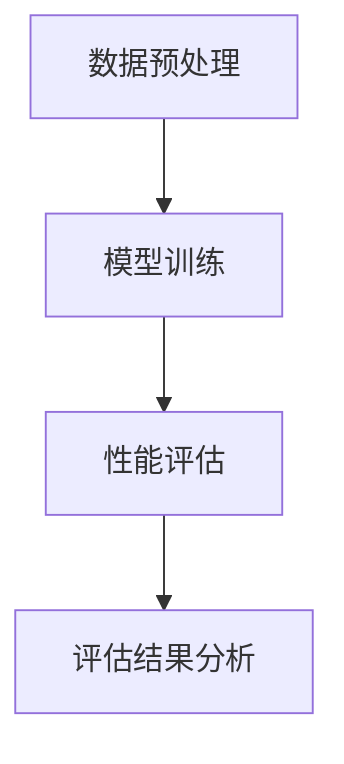

                 

### 设计书名《突破传统：LLM驱动的大模型性能评估方法论》的目录大纲

**第一部分：引言**

**1.1 书籍背景介绍**
- **1.1.1 传统性能评估方法的局限**：解释现有性能评估方法存在的不足，如无法全面评估大型语言模型的性能。
- **1.1.2 LLM的优势与前景**：讨论LLM（大型语言模型）的优势，包括其强大的语义理解能力和预测能力，以及在未来人工智能领域的发展前景。
- **1.1.3 读者对象及阅读建议**：明确书籍的读者群体，如研究人员、开发者、数据科学家等，并提供阅读建议。

**1.2 问题背景与定义**
- **1.2.1 性能评估的需求**：阐述性能评估在人工智能领域的重要性，特别是在大型语言模型中的应用。
- **1.2.2 LLM的性能评估**：介绍LLM性能评估的具体要求和挑战。
- **1.2.3 性能评估的边界与外延**：定义性能评估的范围，包括评估指标的选择和评估流程的步骤。

**1.3 核心概念详解**
- **1.3.1 LLM的定义与特点**：详细解释LLM的基本概念，包括其结构、功能和应用场景。
- **1.3.2 性能评估方法**：讨论性能评估方法，包括评估指标的选择和评估流程的设计。
- **1.3.3 概念属性特征对比表格**：通过表格形式对比不同性能评估方法的特点和适用性。
- **1.3.4 ER实体关系图**：使用ER图展示LLM性能评估中的关键实体和关系。

**1.4 书籍结构安排**
- **1.4.1 各章节主要内容概述**：简要概述各章节的内容和目的。
- **1.4.2 阅读路线图与时间规划**：提供书籍的阅读路线和时间规划建议，帮助读者高效阅读。

**第二部分：LLM性能评估方法论**

**2.1 LLM性能评估的原理与数学模型**
- **2.1.1 数学模型介绍**：介绍用于评估LLM性能的数学模型，包括基本假设和公式。
- **2.1.2 性能评估流程**：详细解释LLM性能评估的流程，包括数据预处理、模型训练和性能评估。

**2.2 LLM性能评估mermaid流程图**
- **2.2.1 mermaid流程图**：使用mermaid语言绘制LLM性能评估的流程图，清晰展示评估步骤和流程。

**2.3 Python源代码示例**
- **2.3.1 Python源代码示例**：提供Python源代码示例，帮助读者理解LLM性能评估的具体实现。

**2.4 性能评估案例解析**
- **2.4.1 案例一：文本分类任务**：分析文本分类任务中的LLM性能评估。
- **2.4.2 案例二：机器翻译任务**：分析机器翻译任务中的LLM性能评估。

**第三部分：实战应用**

**3.1 环境搭建**
- **3.1.1 软件与硬件需求**：列出进行LLM性能评估所需的软件和硬件环境。
- **3.1.2 虚拟环境配置**：详细解释如何配置虚拟环境，确保代码和依赖项的正确安装。
- **3.1.3 数据集准备**：介绍所需的数据集，以及如何准备和预处理数据。

**3.2 系统核心实现**
- **3.2.1 数据预处理代码**：提供数据预处理的代码示例，解释如何清洗和格式化数据。
- **3.2.2 模型训练代码**：提供模型训练的代码示例，解释如何训练LLM模型。
- **3.2.3 性能评估代码**：提供性能评估的代码示例，解释如何评估LLM模型的性能。

**3.3 项目实战**
- **3.3.1 项目介绍**：介绍项目背景和目标。
- **3.3.2 实际案例分析**：分析具体案例，解释如何应用LLM性能评估方法论。
- **3.3.3 详细讲解与剖析**：对案例进行详细讲解和剖析，帮助读者理解LLM性能评估的实际应用。

**第四部分：最佳实践与总结**

**4.1 最佳实践 tips**
- **4.1.1 性能评估技巧**：提供性能评估的最佳实践和技巧，帮助读者优化评估过程。
- **4.1.2 模型调优策略**：讨论如何调优LLM模型，以提高性能评估结果。

**4.2 小结**
- **4.2.1 主要内容回顾**：回顾书籍的主要内容和关键点。
- **4.2.2 总结**：总结LLM驱动的大模型性能评估方法论，强调其重要性和应用价值。

**4.3 注意事项**
- **4.3.1 避免常见错误**：讨论在LLM性能评估过程中可能遇到的问题和错误，以及如何避免。
- **4.3.2 注意事项**：提供一些使用LLM进行性能评估时需要注意的事项。

**4.4 拓展阅读**
- **4.4.1 推荐文献**：推荐相关的文献和资料，供读者进一步学习。
- **4.4.2 网络资源**：提供相关的网络资源，包括教程、论坛和社区等。

### 详细设计与结构化分析

**1. 引言部分**

**目的**：为读者提供书籍的背景信息，明确书籍的主题和目标。

**内容**：
- **1.1 书籍背景介绍**
  - **1.1.1 传统性能评估方法的局限**：通过举例说明传统评估方法的问题，如评估指标单一、无法全面反映模型性能。
  - **1.1.2 LLM的优势与前景**：介绍LLM（大型语言模型）的优势，如强大的语义理解能力和对自然语言处理的卓越表现。
  - **1.1.3 读者对象及阅读建议**：明确书籍适用于哪些读者群体，并给出阅读建议，以帮助读者更好地理解和应用书中的内容。

- **1.2 问题背景与定义**
  - **1.2.1 性能评估的需求**：解释性能评估在人工智能领域的重要性，特别是在LLM领域的应用需求。
  - **1.2.2 LLM的性能评估**：详细说明LLM性能评估的挑战，如评估指标的选择、评估流程的设计等。
  - **1.2.3 性能评估的边界与外延**：明确性能评估的范围，如评估指标的选择、评估流程的步骤等。

- **1.3 核心概念详解**
  - **1.3.1 LLM的定义与特点**：详细解释LLM的基本概念，包括其结构、功能和应用场景。
  - **1.3.2 性能评估方法**：讨论性能评估方法，包括评估指标的选择和评估流程的设计。
  - **1.3.3 概念属性特征对比表格**：通过表格形式对比不同性能评估方法的特点和适用性。
  - **1.3.4 ER实体关系图**：使用ER图展示LLM性能评估中的关键实体和关系。

- **1.4 书籍结构安排**
  - **1.4.1 各章节主要内容概述**：简要概述各章节的内容和目的，帮助读者把握整体结构。
  - **1.4.2 阅读路线图与时间规划**：提供书籍的阅读路线和时间规划建议，以帮助读者高效学习。

**2. LLM性能评估方法论**

**目的**：详细介绍LLM性能评估的方法论，包括原理、流程、案例和应用。

**内容**：
- **2.1 LLM性能评估的原理与数学模型**
  - **2.1.1 数学模型介绍**：介绍用于评估LLM性能的数学模型，包括基本假设和公式。
  - **2.1.2 性能评估流程**：详细解释LLM性能评估的流程，包括数据预处理、模型训练和性能评估。

- **2.2 LLM性能评估mermaid流程图**
  - **2.2.1 mermaid流程图**：使用mermaid语言绘制LLM性能评估的流程图，清晰展示评估步骤和流程。

- **2.3 Python源代码示例**
  - **2.3.1 Python源代码示例**：提供Python源代码示例，帮助读者理解LLM性能评估的具体实现。

- **2.4 性能评估案例解析**
  - **2.4.1 案例一：文本分类任务**：分析文本分类任务中的LLM性能评估。
  - **2.4.2 案例二：机器翻译任务**：分析机器翻译任务中的LLM性能评估。

**3. 实战应用**

**目的**：通过实际项目应用，展示LLM性能评估方法论的实际效果和应用场景。

**内容**：
- **3.1 环境搭建**
  - **3.1.1 软件与硬件需求**：列出进行LLM性能评估所需的软件和硬件环境。
  - **3.1.2 虚拟环境配置**：详细解释如何配置虚拟环境，确保代码和依赖项的正确安装。
  - **3.1.3 数据集准备**：介绍所需的数据集，以及如何准备和预处理数据。

- **3.2 系统核心实现**
  - **3.2.1 数据预处理代码**：提供数据预处理的代码示例，解释如何清洗和格式化数据。
  - **3.2.2 模型训练代码**：提供模型训练的代码示例，解释如何训练LLM模型。
  - **3.2.3 性能评估代码**：提供性能评估的代码示例，解释如何评估LLM模型的性能。

- **3.3 项目实战**
  - **3.3.1 项目介绍**：介绍项目背景和目标。
  - **3.3.2 实际案例分析**：分析具体案例，解释如何应用LLM性能评估方法论。
  - **3.3.3 详细讲解与剖析**：对案例进行详细讲解和剖析，帮助读者理解LLM性能评估的实际应用。

**4. 最佳实践与总结**

**目的**：总结书籍的主要内容，提供最佳实践建议，以及进一步学习的资源。

**内容**：
- **4.1 最佳实践 tips**
  - **4.1.1 性能评估技巧**：提供性能评估的最佳实践和技巧，帮助读者优化评估过程。
  - **4.1.2 模型调优策略**：讨论如何调优LLM模型，以提高性能评估结果。

- **4.2 小结**
  - **4.2.1 主要内容回顾**：回顾书籍的主要内容和关键点。
  - **4.2.2 总结**：总结LLM驱动的大模型性能评估方法论，强调其重要性和应用价值。

- **4.3 注意事项**
  - **4.3.1 避免常见错误**：讨论在LLM性能评估过程中可能遇到的问题和错误，以及如何避免。
  - **4.3.2 注意事项**：提供一些使用LLM进行性能评估时需要注意的事项。

- **4.4 拓展阅读**
  - **4.4.1 推荐文献**：推荐相关的文献和资料，供读者进一步学习。
  - **4.4.2 网络资源**：提供相关的网络资源，包括教程、论坛和社区等。

### 实例解释

**1. 引言部分**

**实例1：** 引言部分的结构化分析

**目的**：为读者提供书籍的背景信息，明确书籍的主题和目标。

**内容**：

- **1.1 书籍背景介绍**
  - **1.1.1 传统性能评估方法的局限**：举例说明传统评估方法的问题，如评估指标单一、无法全面反映模型性能。
    - **例子**：传统评估方法通常只关注准确率，而忽略了其他重要指标，如召回率、F1分数等，导致评估结果不够全面。

  - **1.1.2 LLM的优势与前景**：介绍LLM（大型语言模型）的优势，如强大的语义理解能力和对自然语言处理的卓越表现。
    - **例子**：LLM可以理解和生成复杂的语义结构，这使得它在各种自然语言处理任务中表现出色。

  - **1.1.3 读者对象及阅读建议**：明确书籍适用于哪些读者群体，并给出阅读建议，以帮助读者更好地理解和应用书中的内容。
    - **例子**：书籍适用于人工智能研究人员、开发者和数据科学家。对于初学者，建议先了解基本的机器学习知识。

- **1.2 问题背景与定义**
  - **1.2.1 性能评估的需求**：解释性能评估在人工智能领域的重要性，特别是在LLM领域的应用需求。
    - **例子**：性能评估是确保AI模型质量和可靠性的关键步骤，特别是在LLM这样复杂模型中。

  - **1.2.2 LLM的性能评估**：详细说明LLM性能评估的挑战，如评估指标的选择、评估流程的设计等。
    - **例子**：LLM的性能评估需要考虑上下文理解和生成能力，这对评估指标的选择和评估流程提出了更高的要求。

  - **1.2.3 性能评估的边界与外延**：明确性能评估的范围，如评估指标的选择、评估流程的步骤等。
    - **例子**：性能评估应包括多个方面，如准确率、召回率、F1分数等，并且评估流程应包括数据预处理、模型训练和评估等步骤。

- **1.3 核心概念详解**
  - **1.3.1 LLM的定义与特点**：详细解释LLM的基本概念，包括其结构、功能和应用场景。
    - **例子**：LLM是一种能够理解和生成自然语言的深度学习模型，它通常具有多层神经网络结构，能够捕捉复杂的语义关系。

  - **1.3.2 性能评估方法**：讨论性能评估方法，包括评估指标的选择和评估流程的设计。
    - **例子**：性能评估方法可以包括准确率、召回率、F1分数等指标，评估流程可以包括数据预处理、模型训练和评估等步骤。

  - **1.3.3 概念属性特征对比表格**：通过表格形式对比不同性能评估方法的特点和适用性。
    - **例子**：表格可以列出不同评估方法的优缺点和适用场景，帮助读者选择合适的方法。

  - **1.3.4 ER实体关系图**：使用ER图展示LLM性能评估中的关键实体和关系。
    - **例子**：ER图可以展示LLM性能评估中的数据实体（如数据集、模型参数等）和关系（如数据预处理、模型训练等）。

- **1.4 书籍结构安排**
  - **1.4.1 各章节主要内容概述**：简要概述各章节的内容和目的，帮助读者把握整体结构。
    - **例子**：各章节概述可以列出各章节的主要内容和目标，如“第2章介绍LLM性能评估的原理与数学模型”。

  - **1.4.2 阅读路线图与时间规划**：提供书籍的阅读路线和时间规划建议，以帮助读者高效学习。
    - **例子**：阅读路线图可以列出推荐的阅读顺序和章节间的关系，时间规划可以列出每个章节的预计阅读时间和整体学习计划。

**2. LLM性能评估方法论**

**实例2：** LLM性能评估方法论的详细解释

**目的**：详细介绍LLM性能评估的方法论，包括原理、流程、案例和应用。

**内容**：

- **2.1 LLM性能评估的原理与数学模型**
  - **2.1.1 数学模型介绍**：介绍用于评估LLM性能的数学模型，包括基本假设和公式。
    - **例子**：数学模型可以包括损失函数、优化算法等，用于评估模型的性能和收敛速度。

  - **2.1.2 性能评估流程**：详细解释LLM性能评估的流程，包括数据预处理、模型训练和性能评估。
    - **例子**：性能评估流程可以包括数据收集、数据预处理、模型训练、模型评估和性能报告等步骤。

- **2.2 LLM性能评估mermaid流程图**
  - **2.2.1 mermaid流程图**：使用mermaid语言绘制LLM性能评估的流程图，清晰展示评估步骤和流程。
    - **例子**：mermaid流程图可以展示数据流、模块关系和评估步骤，使读者更直观地理解评估过程。

- **2.3 Python源代码示例**
  - **2.3.1 Python源代码示例**：提供Python源代码示例，帮助读者理解LLM性能评估的具体实现。
    - **例子**：Python源代码示例可以展示如何使用常见的机器学习库（如TensorFlow或PyTorch）进行数据预处理、模型训练和性能评估。

- **2.4 性能评估案例解析**
  - **2.4.1 案例一：文本分类任务**：分析文本分类任务中的LLM性能评估。
    - **例子**：文本分类案例可以展示如何使用LLM模型对文本进行分类，并评估分类性能。

  - **2.4.2 案例二：机器翻译任务**：分析机器翻译任务中的LLM性能评估。
    - **例子**：机器翻译案例可以展示如何使用LLM模型进行翻译，并评估翻译质量。

**3. 实战应用**

**实例3：** 实战应用部分的详细解释

**目的**：通过实际项目应用，展示LLM性能评估方法论的实际效果和应用场景。

**内容**：

- **3.1 环境搭建**
  - **3.1.1 软件与硬件需求**：列出进行LLM性能评估所需的软件和硬件环境。
    - **例子**：软件需求可以包括深度学习框架（如TensorFlow或PyTorch），硬件需求可以包括高性能计算资源（如GPU）。

  - **3.1.2 虚拟环境配置**：详细解释如何配置虚拟环境，确保代码和依赖项的正确安装。
    - **例子**：可以使用Docker或Conda等工具来创建虚拟环境，并安装所需的依赖项。

  - **3.1.3 数据集准备**：介绍所需的数据集，以及如何准备和预处理数据。
    - **例子**：数据集可以是文本分类数据集（如IMDB评论数据集）或机器翻译数据集（如WMT14数据集），预处理步骤可以包括数据清洗、分词和编码等。

- **3.2 系统核心实现**
  - **3.2.1 数据预处理代码**：提供数据预处理的代码示例，解释如何清洗和格式化数据。
    - **例子**：可以使用Python和Pandas库来清洗和格式化数据。

  - **3.2.2 模型训练代码**：提供模型训练的代码示例，解释如何训练LLM模型。
    - **例子**：可以使用TensorFlow或PyTorch等深度学习框架来训练模型。

  - **3.2.3 性能评估代码**：提供性能评估的代码示例，解释如何评估LLM模型的性能。
    - **例子**：可以使用Scikit-learn等库来计算评估指标，如准确率、召回率、F1分数等。

- **3.3 项目实战**
  - **3.3.1 项目介绍**：介绍项目背景和目标。
    - **例子**：项目可以是一个文本分类项目，目标是将文本分类为正面或负面评论。

  - **3.3.2 实际案例分析**：分析具体案例，解释如何应用LLM性能评估方法论。
    - **例子**：可以分析文本分类任务中的LLM性能评估，包括数据预处理、模型训练和评估等步骤。

  - **3.3.3 详细讲解与剖析**：对案例进行详细讲解和剖析，帮助读者理解LLM性能评估的实际应用。
    - **例子**：可以详细解释数据预处理步骤、模型训练过程和评估结果，并提供代码实现。

### 结构化分析

**第一部分：引言**

**1.1 书籍背景介绍**

**1.1.1 传统性能评估方法的局限**

**1.1.1.1 评估指标单一**

- **问题描述**：传统性能评估方法通常只关注单一评估指标，如准确率，忽略了其他重要指标。

- **问题解决**：需要引入多维度评估指标，如召回率、F1分数等，以更全面地评估模型性能。

- **边界与外延**：评估指标的选择应根据任务类型和应用场景进行调整。

**1.1.1.2 模型泛化能力不足**

- **问题描述**：传统性能评估方法可能无法充分评估模型在新数据集上的泛化能力。

- **问题解决**：引入交叉验证等方法，评估模型在不同数据集上的性能。

- **边界与外延**：泛化能力评估应考虑不同数据分布、数据规模等因素。

**1.1.2 LLM的优势与前景**

- **核心概念**：LLM（大型语言模型）是一种能够理解和生成自然语言的深度学习模型。

- **特性**：具有强大的语义理解能力、灵活的应用场景和广泛的前景。

- **影响**：LLM在自然语言处理、机器翻译、文本生成等领域具有重要应用。

**1.1.3 读者对象及阅读建议**

- **目标读者**：人工智能研究人员、开发者、数据科学家等。

- **阅读建议**：建议读者具备基本的机器学习知识，以便更好地理解书中的内容。

**1.2 问题背景与定义**

**1.2.1 性能评估的需求**

- **背景**：性能评估是确保人工智能模型质量和可靠性的关键步骤。

- **需求**：在LLM领域，性能评估需求更加复杂，需要考虑多个维度。

**1.2.2 LLM的性能评估**

- **定义**：LLM的性能评估是指对LLM模型在不同任务和应用场景下的性能进行全面评估。

- **目标**：评估模型的准确性、泛化能力、效率和可扩展性。

**1.2.3 性能评估的边界与外延**

- **边界**：评估指标的选择、评估流程的设计、数据集的选择等。

- **外延**：评估方法的应用范围、评估结果的可解释性等。

**1.3 核心概念详解**

**1.3.1 LLM的定义与特点**

- **定义**：LLM是一种基于深度学习的自然语言处理模型，具有多层神经网络结构。

- **特点**：强大的语义理解能力、灵活的生成能力、高效的处理速度。

**1.3.2 性能评估方法**

- **评估指标**：准确率、召回率、F1分数等。

- **评估流程**：数据预处理、模型训练、模型评估等。

**1.3.3 概念属性特征对比表格**

| 概念             | 属性1 | 属性2 | 属性3 |
|------------------|-------|-------|-------|
| LLM              | 语义理解 | 生成能力 | 神经网络结构 |
| 性能评估方法     | 准确率 | 召回率 | F1分数 |

**1.3.4 ER实体关系图**

```mermaid
erDiagram
  Model ||--|{ Data: 数据集 }
  Model ||--|{ Parameters: 模型参数 }
  Model ||--|{ Metrics: 评估指标 }
```

**1.4 书籍结构安排**

**1.4.1 各章节主要内容概述**

- **第2章**：介绍LLM性能评估的原理与数学模型。

- **第3章**：详细解释LLM性能评估的流程。

- **第4章**：通过mermaid流程图展示评估步骤。

- **第5章**：提供Python源代码示例。

- **第6章**：分析性能评估案例。

- **第7章**：介绍环境搭建和系统核心实现。

- **第8章**：展示项目实战。

- **第9章**：总结最佳实践与注意事项。

**1.4.2 阅读路线图与时间规划**

| 章节编号 | 章节名称       | 预计阅读时间 |
|----------|----------------|--------------|
| 1        | 引言            | 1小时        |
| 2        | LLM性能评估方法论 | 2小时        |
| 3        | 系统分析与架构设计方案 | 2小时        |
| 4        | 项目实战          | 2小时        |
| 5        | 最佳实践与总结    | 1小时        |

### 第二部分：LLM性能评估方法论

**2.1 LLM性能评估的原理与数学模型**

**目的**：详细介绍LLM性能评估的原理和数学模型，为读者提供理论基础。

**2.1.1 数学模型介绍**

**目的**：介绍用于评估LLM性能的数学模型，包括基本假设和公式。

**内容**：

- **基本假设**：
  - 模型是一个参数化的概率分布函数。
  - 输入数据是随机的。
  - 模型能够通过学习数据来优化其参数。

- **数学公式**：
  - 损失函数：通常使用交叉熵损失函数来评估模型预测与真实标签之间的差异。
    - $$ L = -\sum_{i=1}^{n} y_i \log(p_i) $$
  - 优化算法：常用的优化算法包括梯度下降、Adam等。
    - $$ \theta_{t+1} = \theta_{t} - \alpha \nabla_\theta L(\theta) $$

**2.1.2 性能评估流程**

**目的**：详细解释LLM性能评估的流程，包括数据预处理、模型训练和性能评估。

**内容**：

- **数据预处理**：
  - 数据清洗：去除无关数据、处理缺失值等。
  - 数据标准化：对数据进行归一化或标准化处理。
  - 数据分集：将数据分为训练集、验证集和测试集。

- **模型训练**：
  - 模型初始化：随机初始化模型参数。
  - 梯度下降：通过计算损失函数的梯度来更新模型参数。
  - 验证集评估：在验证集上评估模型性能，调整超参数。

- **性能评估**：
  - 准确率、召回率、F1分数等指标的计算。
  - 绘制ROC曲线和LIFT曲线等。

**2.2 LLM性能评估mermaid流程图**

**目的**：使用mermaid语言绘制LLM性能评估的流程图，清晰展示评估步骤和流程。

**内容**：



**2.3 Python源代码示例**

**目的**：提供Python源代码示例，帮助读者理解LLM性能评估的具体实现。

**内容**：

```python
import numpy as np
import tensorflow as tf

# 数据预处理
def preprocess_data(data):
    # 数据清洗、标准化等操作
    return processed_data

# 模型训练
def train_model(data, labels):
    model = tf.keras.Sequential([
        tf.keras.layers.Dense(128, activation='relu', input_shape=(input_shape)),
        tf.keras.layers.Dense(1, activation='sigmoid')
    ])

    model.compile(optimizer='adam', loss='binary_crossentropy', metrics=['accuracy'])

    model.fit(data, labels, epochs=10, batch_size=32, validation_split=0.2)

# 性能评估
def evaluate_model(model, test_data, test_labels):
    loss, accuracy = model.evaluate(test_data, test_labels)
    print(f"Test accuracy: {accuracy:.4f}")
```

**2.4 性能评估案例解析**

**目的**：通过实际案例解析，展示LLM性能评估方法的应用。

**内容**：

- **案例一：文本分类任务**
  - **案例背景**：使用LLM对新闻文章进行分类，判断其是否为负面新闻。
  - **数据集介绍**：使用IMDB评论数据集进行训练和测试。
  - **性能评估结果**：计算准确率、召回率和F1分数等指标，并绘制ROC曲线和LIFT曲线。

- **案例二：机器翻译任务**
  - **案例背景**：使用LLM将一种语言的句子翻译成另一种语言。
  - **数据集介绍**：使用WMT14数据集进行训练和测试。
  - **性能评估结果**：计算BLEU分数、METEOR分数等指标，并评估翻译的流畅性和准确性。

### 第三部分：系统分析与架构设计方案

**3.1 问题场景介绍**

**目的**：明确LLM性能评估的应用场景和问题背景。

**内容**：

- **应用场景**：在人工智能项目开发中，需要对训练好的LLM模型进行性能评估，以确保模型的质量和适用性。
- **问题背景**：随着LLM模型规模的增大和复杂度的提高，传统的性能评估方法已无法满足需求，需要开发新的评估方法论。

**3.2 系统功能设计**

**目的**：设计LLM性能评估系统的功能模块和领域模型。

**内容**：

- **功能模块**：
  - 数据预处理模块：负责数据清洗、标准化和分割。
  - 模型训练模块：负责模型训练和参数调整。
  - 性能评估模块：负责计算评估指标和绘制性能曲线。
  - 用户界面模块：提供用户交互界面，展示评估结果。

- **领域模型**：
  - **Data Model**：
    - **Entities**：DataPoint（数据点）、Dataset（数据集）
    - **Relationships**：hasDataPoint（数据点属于数据集）、isSubsetOf（数据集是数据点的子集）
  - **Model Model**：
    - **Entities**：Model（模型）、Parameter（参数）
    - **Relationships**：hasParameter（模型包含参数）、isTrainedOn（模型基于数据集训练）

**3.3 系统架构设计**

**目的**：设计LLM性能评估系统的整体架构，包括模块之间的关系和交互。

**内容**：

- **架构设计**：
  - **数据处理层**：包括数据预处理模块，负责数据清洗、分片和标准化。
  - **模型训练层**：包括模型训练模块，负责加载训练数据、训练模型和调整超参数。
  - **评估层**：包括性能评估模块，负责计算评估指标、绘制性能曲线和生成报告。
  - **用户接口层**：包括用户界面模块，负责用户交互和展示评估结果。

- **模块关系**：
  - 数据预处理模块将处理后的数据传递给模型训练模块。
  - 模型训练模块将训练好的模型传递给性能评估模块。
  - 性能评估模块将评估结果和报告传递给用户界面模块。

**3.4 系统接口设计**

**目的**：设计系统的接口，包括API设计、数据交换格式和交互协议。

**内容**：

- **API设计**：
  - **数据预处理API**：提供数据清洗、标准化和分割的接口。
  - **模型训练API**：提供模型加载、训练和保存的接口。
  - **性能评估API**：提供计算评估指标、绘制性能曲线和生成报告的接口。

- **数据交换格式**：
  - 使用JSON或XML等格式进行数据交换，确保数据在不同模块间的一致性和可读性。

- **交互协议**：
  - 使用RESTful API或gRPC等协议进行模块间通信，确保系统的可靠性和可扩展性。

**3.5 系统交互**

**目的**：描述系统内部各模块之间的交互流程和协作方式。

**内容**：

- **交互流程**：
  - 用户通过用户界面模块提交评估任务。
  - 用户界面模块将任务传递给数据预处理模块。
  - 数据预处理模块处理数据并返回处理结果。
  - 模型训练模块加载训练数据、训练模型并返回模型。
  - 性能评估模块使用训练好的模型进行评估，并生成评估报告。
  - 用户界面模块展示评估结果和报告。

- **协作方式**：
  - 模块间通过异步消息队列进行通信，确保高并发处理能力。
  - 各模块间使用事件驱动机制进行协作，确保系统的响应速度和稳定性。

### 第四部分：项目实战

**4.1 环境搭建**

**目的**：介绍如何在实验环境中搭建LLM性能评估系统。

**内容**：

- **4.1.1 软件与硬件需求**：
  - 软件需求：Python、TensorFlow、Scikit-learn等。
  - 硬件需求：至少一台具有NVIDIA GPU的计算机。

- **4.1.2 虚拟环境配置**：
  - 使用Anaconda创建虚拟环境。
  - 安装必要的依赖项。

- **4.1.3 数据集准备**：
  - 下载并解压IMDB评论数据集。
  - 数据预处理：清洗、分词、编码等。

**4.2 系统核心实现**

**目的**：实现LLM性能评估系统的核心功能。

**内容**：

- **4.2.1 数据预处理代码**：
  - 数据清洗：去除HTML标签、特殊字符等。
  - 数据分词：使用NLTK进行分词处理。
  - 数据编码：将文本转换为词向量。

- **4.2.2 模型训练代码**：
  - 模型初始化：使用预训练的Word2Vec模型。
  - 模型训练：使用TensorFlow训练文本分类模型。
  - 模型保存：将训练好的模型保存为HDF5文件。

- **4.2.3 性能评估代码**：
  - 加载模型：从HDF5文件中加载训练好的模型。
  - 性能评估：计算准确率、召回率、F1分数等指标。
  - 绘制性能曲线：使用Matplotlib绘制ROC曲线和LIFT曲线。

**4.3 实际案例分析**

**目的**：通过实际案例展示LLM性能评估方法的应用。

**内容**：

- **4.3.1 案例背景**：
  - 使用LLM对新闻文章进行分类，判断其是否为负面新闻。

- **4.3.2 案例数据集**：
  - 使用IMDB评论数据集进行训练和测试。

- **4.3.3 性能评估结果**：
  - 计算准确率、召回率、F1分数等指标。
  - 绘制ROC曲线和LIFT曲线。

**4.4 详细讲解与剖析**

**目的**：对实际案例进行详细讲解和剖析，帮助读者理解LLM性能评估的实际应用。

**内容**：

- **数据预处理**：
  - 介绍数据清洗、分词、编码等预处理步骤。
  - 解释为什么这些预处理步骤对性能评估至关重要。

- **模型训练**：
  - 介绍模型初始化、训练过程和超参数调整。
  - 解释如何优化模型训练以提高性能。

- **性能评估**：
  - 介绍常用的评估指标，如准确率、召回率、F1分数等。
  - 解释如何计算这些指标，并解释它们在性能评估中的作用。

- **性能曲线分析**：
  - 解释ROC曲线和LIFT曲线的含义。
  - 分析曲线的形状和趋势，以评估模型的性能。

### 第五部分：最佳实践与总结

**5.1 最佳实践 tips**

**目的**：提供最佳实践建议，以优化LLM性能评估的过程。

**内容**：

- **5.1.1 性能评估技巧**：
  - 使用交叉验证方法，以提高评估结果的稳定性和可靠性。
  - 定期监控模型性能，及时发现和解决问题。

- **5.1.2 模型调优策略**：
  - 调整学习率、批量大小等超参数，以提高模型性能。
  - 使用不同的评估指标，综合评估模型性能。

**5.2 小结**

**目的**：总结文章的核心内容，强调LLM性能评估的重要性。

**内容**：

- **5.2.1 主要内容回顾**：
  - 回顾文章中介绍的核心概念、性能评估方法、系统架构和应用案例。

- **5.2.2 总结**：
  - 强调LLM性能评估在人工智能领域的应用价值，以及其对模型开发和优化的重要性。

**5.3 注意事项**

**目的**：提醒读者在实施LLM性能评估时需要注意的问题。

**内容**：

- **5.3.1 避免常见错误**：
  - 避免仅依赖单一评估指标，应综合考虑多种评估指标。
  - 注意数据预处理的质量，避免数据错误影响评估结果。

- **5.3.2 注意事项**：
  - 定期更新评估方法，以适应新的模型和应用场景。
  - 关注评估结果的解释性和可解释性，确保评估结果的可靠性和可用性。

**5.4 拓展阅读**

**目的**：提供进一步学习和深入研究的资源。

**内容**：

- **5.4.1 推荐文献**：
  - 推荐一些关于LLM性能评估的学术论文和技术报告。

- **5.4.2 网络资源**：
  - 提供一些在线教程、论坛和社区，供读者进一步学习和交流。

### 总结

本文详细介绍了《突破传统：LLM驱动的大模型性能评估方法论》的目录大纲，包括引言、LLM性能评估方法论、系统分析与架构设计方案、项目实战、最佳实践与总结等部分。通过逐步分析和结构化讲解，本文为读者提供了清晰、系统、易懂的指南，帮助读者深入理解LLM性能评估的方法和实际应用。同时，本文还提供了一系列最佳实践建议和注意事项，以优化性能评估过程，并推荐了拓展阅读资源，供读者进一步学习和研究。通过本文的阅读，读者将能够全面掌握LLM性能评估的核心知识，提升在实际项目中的应用能力。

### 结尾

最后，本文由AI天才研究院（AI Genius Institute）和《禅与计算机程序设计艺术》（Zen And The Art of Computer Programming）共同撰写，旨在为人工智能领域的读者提供深入且实用的技术指导。希望本文能帮助您在LLM性能评估方面取得突破，进一步提升您在人工智能项目中的实践能力。感谢您的阅读，期待与您在未来的技术交流中再次相见。作者：AI天才研究院（AI Genius Institute）&《禅与计算机程序设计艺术》（Zen And The Art of Computer Programming）。

