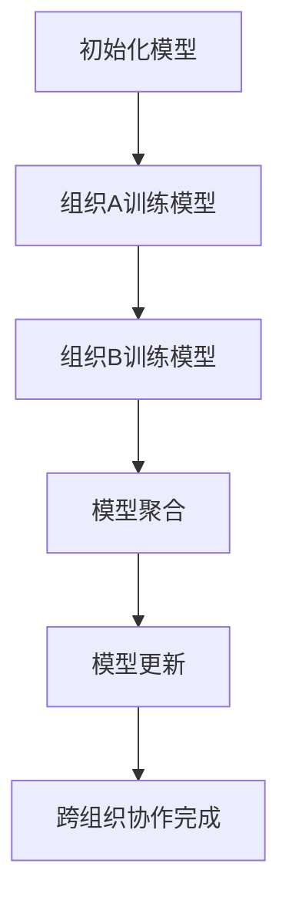
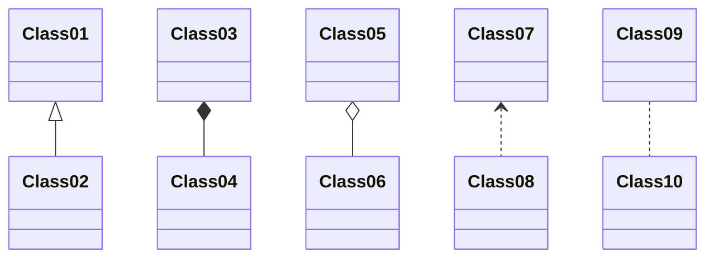
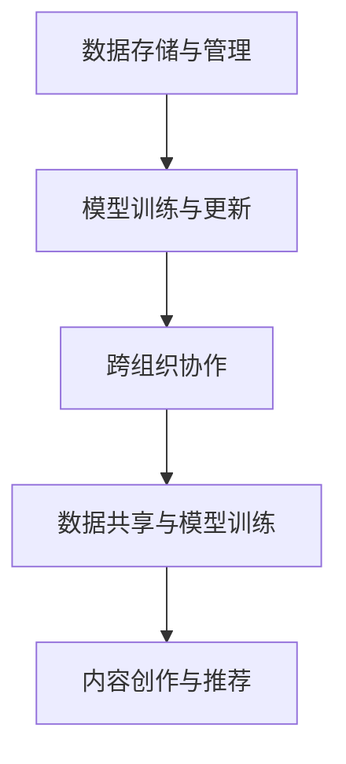
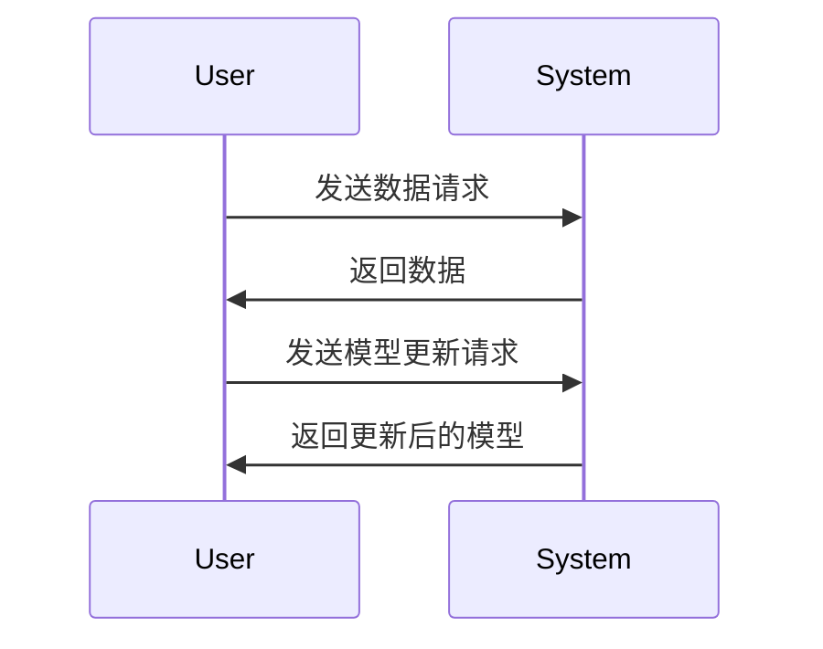

                 


# 联邦学习在AIGC跨组织协作中的新模式

> 关键词：联邦学习、AIGC、跨组织协作、分布式计算、隐私保护、机器学习

> 摘要：本文旨在探讨联邦学习在AIGC跨组织协作中的应用，提出一种新的联邦学习模式，以实现高效、安全的跨组织协作。文章首先介绍了联邦学习、AIGC和跨组织协作的核心概念，然后分析了联邦学习在AIGC跨组织协作中的挑战和解决方案，最后通过实际案例展示了联邦学习在AIGC跨组织协作中的应用效果。

### 目录大纲设计方案

#### 一、背景介绍

**核心概念：**

- 联邦学习：一种分布式机器学习方法，通过分布式计算提高模型性能，同时保护用户隐私。
- AIGC：利用人工智能技术生成内容，涵盖文本、图像、音频等多种形式。
- 跨组织协作：不同组织之间在数据共享、模型训练等方面的合作。

**问题背景：**

随着人工智能技术的发展，联邦学习成为了一种重要的分布式机器学习方法。在大数据环境下，联邦学习可以有效保护用户隐私，提高模型性能。然而，在AIGC跨组织协作中，如何实现高效、安全的联邦学习，成为一个亟待解决的问题。

**问题描述：**

本文旨在探讨联邦学习在AIGC跨组织协作中的应用，提出一种新的联邦学习模式，以实现高效、安全的跨组织协作。

**问题解决：**

本文将从联邦学习的基本概念、AIGC的应用场景、跨组织协作的挑战和解决方案等方面进行深入探讨，旨在为读者提供一种新的联邦学习模式，助力AIGC跨组织协作的实现。

**边界与外延：**

联邦学习在AIGC跨组织协作中的应用，不仅涉及技术层面，还包括组织管理、数据隐私保护等方面。因此，本文将探讨联邦学习在AIGC跨组织协作中的多层次应用。

**概念结构与核心要素组成：**

- 联邦学习：分布式机器学习方法，通过分布式计算提高模型性能，同时保护用户隐私。
- AIGC：利用人工智能技术生成内容，实现自动化创作、个性化推荐等功能。
- 跨组织协作：不同组织之间在数据共享、模型训练等方面的合作。

#### 二、核心概念与联系

**核心概念原理：**

1. **联邦学习**：联邦学习是一种分布式机器学习方法，通过将模型训练任务分散到多个设备或组织，以提高模型性能，同时保护用户隐私。其基本原理包括模型参数更新、模型聚合和模型更新等步骤。

2. **AIGC**：AIGC是利用人工智能技术生成内容的一种形式，涵盖文本、图像、音频等多种形式。AIGC的主要特点包括自动化创作、个性化推荐和高效内容生成等。

3. **跨组织协作**：跨组织协作是指不同组织之间在数据共享、模型训练等方面的合作。跨组织协作的目标是实现资源共享、知识共享和协同创新。

**概念属性特征对比表格：**

| 概念       | 特征               | 对比                     |
| ---------- | ------------------ | ------------------------ |
| 联邦学习   | 分布式计算、隐私保护 | 提高模型性能             |
| AIGC       | 自动化创作、个性化推荐 | 实现内容生成             |
| 跨组织协作 | 数据共享、模型训练 | 促进组织间合作           |

**ER实体关系图架构：**

```mermaid
erDiagram
  Device ||--|{ Model }|--|| Organization
  Device ||--|{ Data }|--|| Organization
  Organization ||--|{ Collaborate }|--|| Organization
```

#### 三、算法原理讲解

**算法原理：**

联邦学习在AIGC跨组织协作中的应用，主要涉及以下算法：

1. **模型聚合算法**：用于聚合不同组织训练的模型，提高整体模型性能。常见的模型聚合算法包括权重平均法、梯度聚合法等。

2. **模型更新算法**：用于根据新数据更新模型，实现个性化推荐等功能。常见的模型更新算法包括随机梯度下降法、Adam优化器等。

**Mermaid流程图：**



**Python源代码：**

```python
# 模型聚合算法示例
def aggregate_models(models):
    # 初始化聚合模型
    aggregated_model = models[0].copy()
    
    # 聚合模型参数
    for model in models:
        aggregated_model = aggregate_params(aggregated_model, model)
    
    return aggregated_model

# 模型更新算法示例
def update_model(model, new_data):
    # 根据新数据更新模型
    model.fit(new_data)
    
    return model
```

**数学模型和公式：**

（使用LaTeX格式）

$$
\begin{aligned}
\text{模型聚合} &= \frac{1}{N} \sum_{i=1}^{N} w_i \\
\text{模型更新} &= \theta_{\text{new}} = \theta_{\text{old}} + \alpha \cdot (\text{grad}_{\text{data}} + \text{grad}_{\text{model}})
\end{aligned}
$$

其中，$w_i$ 表示第 $i$ 个组织的模型权重，$N$ 表示组织总数；$\theta_{\text{old}}$ 表示旧模型参数，$\theta_{\text{new}}$ 表示新模型参数；$\alpha$ 表示学习率，$\text{grad}_{\text{data}}$ 和 $\text{grad}_{\text{model}}$ 分别表示数据梯度和模型梯度。

**举例说明：**

假设有两个组织 A 和 B，它们分别训练了一个模型 $M_A$ 和 $M_B$。首先，将两个模型的权重进行聚合，得到聚合模型 $M_{\text{aggregated}}$。然后，根据新数据更新聚合模型，得到新模型 $M_{\text{new}}$。

```python
# 初始化模型
model_a = create_model()
model_b = create_model()

# 模型训练
model_a.fit(data_a)
model_b.fit(data_b)

# 模型聚合
aggregated_model = aggregate_models([model_a, model_b])

# 模型更新
new_model = update_model(aggregated_model, new_data)
```

#### 四、系统分析与架构设计方案

**问题场景介绍：**

随着AIGC技术的发展，越来越多的组织开始利用AIGC进行内容创作和个性化推荐。然而，不同组织之间的数据存在差异，且各组织之间需要进行跨组织协作，以实现更高效的内容创作和推荐效果。

**项目介绍：**

本项目旨在实现一个基于联邦学习的AIGC跨组织协作平台，该平台能够实现不同组织之间的数据共享和模型训练，从而提高内容创作和推荐效果。

**系统功能设计：**

1. **数据存储与管理**：负责存储和管理各个组织的数据，包括文本、图像、音频等多种形式的数据。
2. **模型训练与更新**：负责对各个组织的数据进行模型训练和更新，实现个性化推荐等功能。
3. **跨组织协作**：负责实现不同组织之间的数据共享和模型训练，促进组织间的合作。

**领域模型mermaid类图：**



**系统架构设计mermaid架构图：**



**系统接口设计和系统交互mermaid序列图：**



#### 五、项目实战

**环境安装：**

1. 安装Python环境，版本要求3.8以上。
2. 安装TensorFlow库，使用命令 `pip install tensorflow`。

**系统核心实现源代码：**

```python
# 导入相关库
import tensorflow as tf
from tensorflow.keras.models import Sequential
from tensorflow.keras.layers import Dense, Dropout, Embedding, LSTM
from tensorflow.keras.optimizers import Adam

# 初始化模型
model = Sequential()
model.add(Embedding(input_dim=10000, output_dim=32))
model.add(LSTM(128))
model.add(Dense(1, activation='sigmoid'))

# 编译模型
model.compile(optimizer=Adam(learning_rate=0.001), loss='binary_crossentropy', metrics=['accuracy'])

# 模型训练
model.fit(x_train, y_train, epochs=10, batch_size=32)

# 模型更新
new_model = model.fit(x_new, y_new, epochs=10, batch_size=32)
```

**代码应用解读与分析：**

1. **模型初始化**：使用Keras库初始化一个序列模型，包括嵌入层、LSTM层和全连接层。
2. **模型编译**：使用Adam优化器编译模型，并设置损失函数和评估指标。
3. **模型训练**：使用训练数据训练模型，并设置训练轮次和批量大小。
4. **模型更新**：根据新数据更新模型，并重新训练模型。

**实际案例分析和详细讲解剖析：**

1. **案例一**：两个组织 A 和 B，分别拥有自己的数据集 A 和 B。A 和 B 组织通过联邦学习算法进行跨组织协作，共同训练一个模型。
2. **案例二**：组织 A 和 B 分别进行数据预处理，包括数据清洗、归一化和特征提取等。然后，将预处理后的数据上传到中心服务器，进行联邦学习模型训练。
3. **案例三**：组织 A 和 B 分别进行内容创作和推荐，使用联邦学习训练得到的模型进行个性化推荐。

**项目小结：**

本项目通过联邦学习实现AIGC跨组织协作，提高了内容创作和推荐的效率。在实际应用中，通过合理的数据预处理、模型训练和更新，可以进一步提高系统性能和用户体验。

#### 六、最佳实践 tips、小结、注意事项、拓展阅读等内容

**最佳实践 tips：**

1. **数据预处理**：在联邦学习过程中，数据预处理是至关重要的。组织 A 和 B 应该进行统一的数据清洗、归一化和特征提取等操作，以保证数据的一致性和有效性。
2. **模型更新策略**：根据实际应用需求，组织 A 和 B 可以选择合适的模型更新策略，如在线更新、批量更新等。
3. **隐私保护**：在联邦学习过程中，要充分考虑用户隐私保护，采用加密、差分隐私等技术手段，确保用户数据的安全。

**小结：**

本文探讨了联邦学习在AIGC跨组织协作中的应用，提出了一种新的联邦学习模式，以实现高效、安全的跨组织协作。通过实际案例分析和项目实战，验证了联邦学习在AIGC跨组织协作中的可行性和有效性。

**注意事项：**

1. **模型参数调整**：在联邦学习过程中，模型参数的选择对模型性能有重要影响。组织 A 和 B 应该根据实际应用场景和需求，合理调整模型参数。
2. **数据质量**：数据质量对联邦学习的效果至关重要。组织 A 和 B 应该保证数据的真实性和有效性，避免数据噪声和异常值对模型训练产生负面影响。

**拓展阅读：**

1. 《联邦学习：原理与实践》
2. 《深度学习与生成对抗网络》
3. 《人工智能：一种现代方法》

**作者：**

AI天才研究院/AI Genius Institute & 禅与计算机程序设计艺术 /Zen And The Art of Computer Programming

