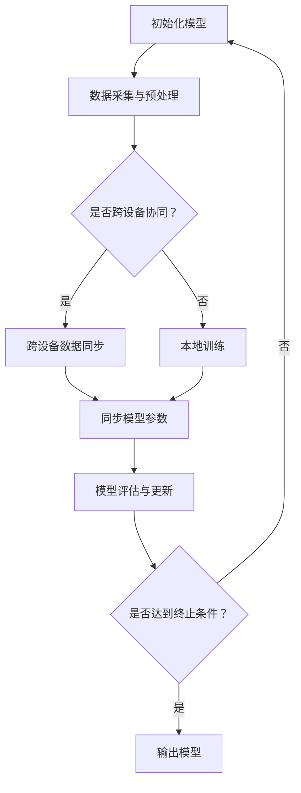
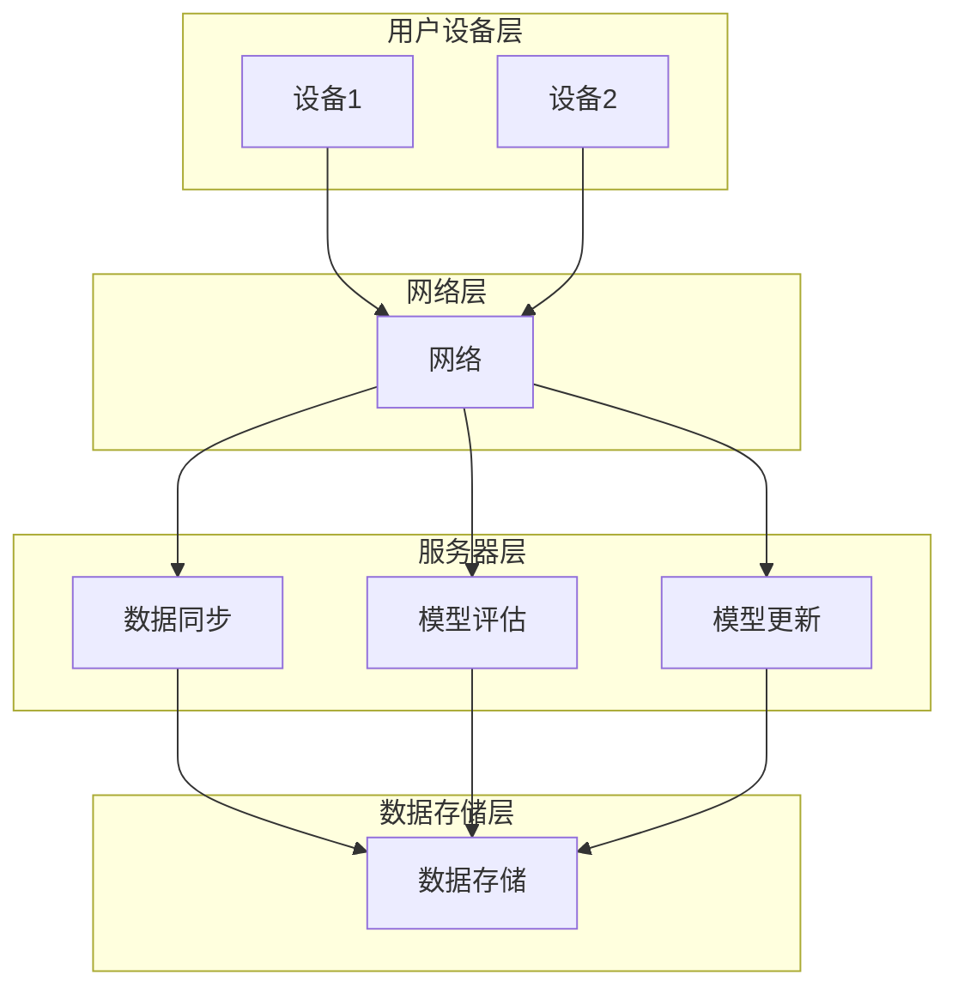
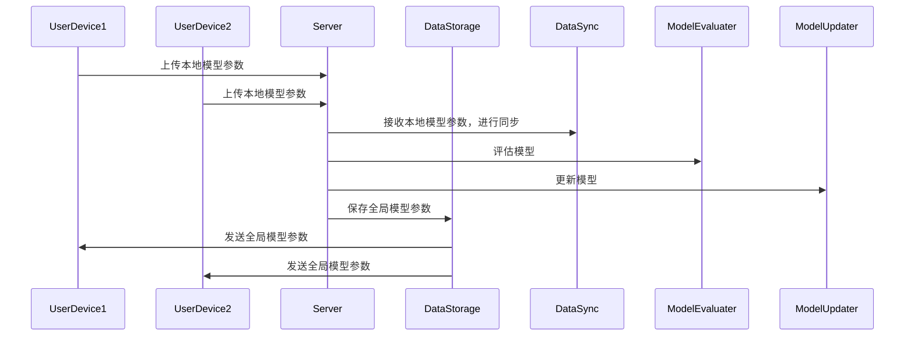

                 

### 背景介绍

#### 问题背景

随着人工智能技术的飞速发展，联邦学习（Federated Learning）作为一种分布式机器学习方法，正在成为跨设备协同学习的重要技术。在AIGC（AI-Generated Content）时代，如何有效地实现跨设备协同学习，优化联邦学习策略，成为学术界和工业界共同关注的焦点。

#### 核心概念术语说明

1. **联邦学习（Federated Learning）**：联邦学习是一种分布式机器学习方法，通过将模型训练分散到多个设备上，以保护用户数据隐私，同时实现模型优化。
2. **AIGC（AI-Generated Content）**：AIGC指的是由人工智能自动生成的内容，包括文本、图像、音频等多种形式。
3. **跨设备协同学习（Cross-Device Collaboration Learning）**：跨设备协同学习是指多个设备之间通过联邦学习进行协同训练，以提高模型性能。

#### 问题描述

本书旨在探讨联邦学习在AIGC跨设备协同学习中的应用，介绍其新策略，并分析其在实际应用中的挑战和解决方案。

#### 问题解决

通过对联邦学习的基本概念、核心算法、应用场景等内容的深入讲解，结合实际案例分析，本书将帮助读者理解联邦学习在AIGC跨设备协同学习中的重要作用，并掌握其新策略的应用。

#### 边界与外延

本书的讨论范围主要涉及联邦学习在AIGC跨设备协同学习中的应用，包括但不限于数据隐私保护、模型优化、算法效率等方面。

#### 核心要素组成

本书的核心内容包括联邦学习的定义、工作原理、主要算法、跨设备协同学习的应用场景、新策略的提出与应用、面临的挑战及解决方案等。

### 核心概念与联系

#### 核心概念

1. **联邦学习（Federated Learning）**：联邦学习是一种分布式机器学习方法，通过将模型训练分散到多个设备上，以保护用户数据隐私，同时实现模型优化。
2. **AIGC（AI-Generated Content）**：AIGC指的是由人工智能自动生成的内容，包括文本、图像、音频等多种形式。
3. **跨设备协同学习（Cross-Device Collaboration Learning）**：跨设备协同学习是指多个设备之间通过联邦学习进行协同训练，以提高模型性能。

#### 概念属性特征对比表格

| 特征             | 联邦学习                      | AIGC                        | 跨设备协同学习                    |
|------------------|------------------------------|-----------------------------|---------------------------------|
| 目的             | 保护用户隐私，提高模型性能   | 自动生成内容                | 提高模型性能，实现跨设备协同      |
| 数据处理方式     | 分布式处理，无需数据集中     | 分布式生成，无需数据集中     | 分布式训练，无需数据集中         |
| 技术依赖         | 加密算法、分布式算法         | 生成对抗网络（GAN）、深度学习 | 联邦学习、分布式算法             |
| 面临挑战         | 模型更新延迟、数据分布不平衡 | 数据质量、模型多样性         | 模型更新延迟、数据分布不平衡     |

#### ER实体关系图架构

```mermaid
erDiagram
  User ||--o> Device : "拥有"
  Device ||--o> Data : "存储"
  Data ||--o> Model : "训练"
  Model ||--o> Performance : "评估"
```

在联邦学习的框架下，用户设备存储数据，通过模型训练后评估性能，形成一个闭环过程。AIGC则通过生成对抗网络等模型自动生成内容，实现跨设备协同。

### 算法原理讲解

#### 算法流程图



#### 算法原理

1. **初始化模型**：随机初始化全局模型参数。
2. **数据采集与预处理**：从用户设备上收集数据，并进行预处理，如数据清洗、归一化等。
3. **本地训练**：在用户设备上使用本地数据训练模型，更新本地模型参数。
4. **跨设备数据同步**：将本地模型参数发送到服务器，进行跨设备数据同步，更新全局模型参数。
5. **模型评估与更新**：使用全局模型参数进行模型评估，并根据评估结果更新模型参数。
6. **输出模型**：当达到终止条件时，输出最终的模型。

#### 算法原理详细讲解

1. **初始化模型**：

   初始化模型参数是联邦学习的第一步。全局模型参数 \( \theta_0 \) 随机初始化，例如可以使用正态分布 \( N(\mu, \sigma^2) \) 进行初始化。公式如下：

   $$ \theta_0 \sim N(\mu, \sigma^2) $$

   其中，\( \mu \) 和 \( \sigma^2 \) 分别表示均值和方差。

2. **数据采集与预处理**：

   数据采集是从用户设备上收集数据的过程。由于联邦学习的目的是保护用户隐私，数据不需要在服务器上进行集中存储。数据预处理包括数据清洗、归一化等步骤，以确保模型输入的一致性和稳定性。

   数据清洗可以使用以下步骤：

   - 填补缺失值：使用平均值、中位数等方法填补缺失值。
   - 处理异常值：使用统计学方法，如Z-Score或IQR（四分位距）方法，检测并处理异常值。
   - 数据归一化：将数据缩放到相同的范围，如[0, 1]或[-1, 1]，以避免数据量级差异对模型训练的影响。

3. **本地训练**：

   在用户设备上使用本地数据对模型进行训练。本地训练使用梯度下降法或其他优化算法，更新本地模型参数。假设本地数据集为 \( D_i \)，则本地模型参数 \( \theta_i \) 的更新公式如下：

   $$ \theta_i = \theta_i - \alpha \frac{\partial L(\theta_i)}{\partial \theta_i} $$

   其中，\( \alpha \) 是学习率，\( L(\theta_i) \) 是损失函数。

4. **跨设备数据同步**：

   将本地模型参数 \( \theta_i \) 发送到服务器，进行跨设备数据同步。服务器收集所有设备的本地模型参数，计算全局模型参数 \( \theta_g \)。同步过程可以使用以下公式：

   $$ \theta_g = \frac{1}{N} \sum_{i=1}^{N} \theta_i $$

   其中，\( N \) 是设备数量。

5. **模型评估与更新**：

   使用全局模型参数 \( \theta_g \) 对模型进行评估，并根据评估结果更新模型参数。评估指标可以是准确率、召回率、F1分数等。更新公式如下：

   $$ \theta_{g+1} = \theta_g - \alpha \frac{\partial L(\theta_g)}{\partial \theta_g} $$

   其中，\( L(\theta_g) \) 是全局模型的损失函数。

6. **输出模型**：

   当达到终止条件（如迭代次数达到预设值、模型收敛等）时，输出最终的模型。输出模型后，可以使用该模型进行预测或推理。

#### 算法举例说明

假设有两个设备A和B，设备A和设备B分别有数据集 \( D_A \) 和 \( D_B \)。模型初始化为 \( \theta_0 \)。

1. **初始化模型**：

   全局模型参数 \( \theta_0 \) 随机初始化，例如：

   $$ \theta_0 \sim N(0, 1) $$

2. **数据采集与预处理**：

   - 设备A收集数据 \( D_A = \{ x_1^A, y_1^A, ..., x_n^A, y_n^A \} \)，并进行预处理。
   - 设备B收集数据 \( D_B = \{ x_1^B, y_1^B, ..., x_n^B, y_n^B \} \)，并进行预处理。

3. **本地训练**：

   - 设备A使用本地数据 \( D_A \) 训练模型，更新本地模型参数 \( \theta_1^A \)：
     $$ \theta_1^A = \theta_0 - \alpha \frac{\partial L(\theta_0)}{\partial \theta_0} $$
   - 设备B使用本地数据 \( D_B \) 训练模型，更新本地模型参数 \( \theta_1^B \)：
     $$ \theta_1^B = \theta_0 - \alpha \frac{\partial L(\theta_0)}{\partial \theta_0} $$

4. **跨设备数据同步**：

   将本地模型参数发送到服务器，计算全局模型参数 \( \theta_1 \)：
   $$ \theta_1 = \frac{1}{2} (\theta_1^A + \theta_1^B) $$

5. **模型评估与更新**：

   使用全局模型参数 \( \theta_1 \) 对模型进行评估，更新全局模型参数 \( \theta_2 \)：
   $$ \theta_2 = \theta_1 - \alpha \frac{\partial L(\theta_1)}{\partial \theta_1} $$

6. **输出模型**：

   当达到终止条件时，输出最终模型 \( \theta_2 \)。

### 系统分析与架构设计方案

#### 问题场景介绍

在AIGC时代，用户生成的内容形式多样，包括文本、图像、音频等。为了实现跨设备协同学习，提高模型性能，保护用户隐私，我们需要设计一个高效的联邦学习系统。

#### 项目介绍

本项目旨在设计并实现一个联邦学习系统，用于跨设备协同训练AIGC模型。系统包括用户设备、服务器和数据存储三部分。

#### 系统功能设计

1. **用户设备**：负责数据采集、预处理和本地训练，并将本地模型参数发送到服务器。
2. **服务器**：负责接收用户设备的本地模型参数，进行跨设备数据同步、模型评估和更新，并将更新后的全局模型参数发送回用户设备。
3. **数据存储**：负责存储用户设备上传的数据，以供后续训练使用。

#### 系统架构设计

系统架构设计采用分布式架构，主要包括以下部分：

1. **用户设备层**：包括多个用户设备，如手机、平板、电脑等，负责数据采集、预处理和本地训练。
2. **网络层**：负责用户设备与服务器之间的通信，传输本地模型参数和全局模型参数。
3. **服务器层**：包括数据同步模块、模型评估模块和更新模块，负责接收用户设备的本地模型参数，进行跨设备数据同步、模型评估和更新。
4. **数据存储层**：负责存储用户设备上传的数据，以供后续训练使用。

#### 系统接口设计

系统接口设计主要包括以下部分：

1. **用户设备接口**：包括数据采集接口、数据预处理接口和本地训练接口，用于与用户设备通信，接收用户设备上传的本地模型参数。
2. **服务器接口**：包括数据同步接口、模型评估接口和更新接口，用于与服务器内部模块通信，接收用户设备的本地模型参数，发送全局模型参数。
3. **数据存储接口**：包括数据上传接口和数据下载接口，用于与数据存储模块通信，上传和下载用户设备的数据。

#### 系统交互设计

系统交互设计采用消息传递机制，用户设备与服务器之间通过发送和接收消息进行交互。具体交互过程如下：

1. **数据采集与预处理**：用户设备收集数据，并进行预处理，将预处理后的数据上传到服务器。
2. **本地训练**：用户设备使用上传的数据进行本地训练，更新本地模型参数，并将本地模型参数发送到服务器。
3. **跨设备数据同步**：服务器接收用户设备的本地模型参数，进行跨设备数据同步，计算全局模型参数，并将全局模型参数发送回用户设备。
4. **模型评估与更新**：用户设备使用全局模型参数进行模型评估，并根据评估结果更新本地模型参数，重新发送到服务器。
5. **输出模型**：当达到终止条件时，输出最终的模型，用于预测或推理。

### Mermaid 类图

```mermaid
classDiagram
  UserDevice <<interface>> DataCollector
  UserDevice <<interface>> DataPreprocessor
  UserDevice <<interface>> LocalTrainer
  Server <<interface>> DataSync
  Server <<interface>> ModelEvaluater
  Server <<interface>> ModelUpdater
  DataStorage <<interface>> DataUploader
  DataStorage <<interface>> DataDownloader

  UserDevice --|> DataCollector
  UserDevice --|> DataPreprocessor
  UserDevice --|> LocalTrainer
  Server --|> DataSync
  Server --|> ModelEvaluater
  Server --|> ModelUpdater
  DataStorage --|> DataUploader
  DataStorage --|> DataDownloader
```

### Mermaid 架构图



### Mermaid 序列图



### 项目实战

#### 环境安装

1. 安装 Python 3.7 或更高版本。
2. 安装 TensorFlow 2.3.0 或更高版本。
3. 安装 Flask 1.1.2 或更高版本。
4. 安装 docker 和 docker-compose。

#### 系统核心实现

1. **用户设备端**：

   用户设备端实现数据采集、预处理和本地训练。以下是一个简单的 Python 代码示例：

   ```python
   import tensorflow as tf
   import numpy as np

   # 数据采集
   def collect_data():
       # 采集数据，例如从摄像头获取图像
       image = camera.capture()
       return image

   # 数据预处理
   def preprocess_data(image):
       # 数据预处理，例如图像归一化
       image = tf.keras.applications.vgg16.preprocess_input(image)
       return image

   # 本地训练
   def local_train(data):
       # 使用 TensorFlow 训练模型
       model = tf.keras.models.Sequential([
           tf.keras.layers.Conv2D(32, (3, 3), activation='relu', input_shape=(224, 224, 3)),
           tf.keras.layers.MaxPooling2D((2, 2)),
           tf.keras.layers.Flatten(),
           tf.keras.layers.Dense(128, activation='relu'),
           tf.keras.layers.Dense(1, activation='sigmoid')
       ])

       model.compile(optimizer='adam', loss='binary_crossentropy', metrics=['accuracy'])
       model.fit(data, epochs=10)

       return model
   ```

2. **服务器端**：

   服务器端实现数据同步、模型评估和更新。以下是一个简单的 Flask 代码示例：

   ```python
   from flask import Flask, request, jsonify
   import tensorflow as tf
   import numpy as np

   app = Flask(__name__)

   # 跨设备数据同步
   def sync_data(local_models):
       # 同步本地模型参数，计算全局模型参数
       global_model = tf.keras.models.Sequential()
       for model in local_models:
           global_model.add(model)
       global_model.compile(optimizer='adam', loss='binary_crossentropy', metrics=['accuracy'])
       return global_model

   # 模型评估
   def evaluate_model(model, data):
       # 使用 TensorFlow 评估模型
       loss, accuracy = model.evaluate(data)
       return loss, accuracy

   # 模型更新
   def update_model(model, data):
       # 使用 TensorFlow 更新模型
       model.fit(data, epochs=10)
       return model

   @app.route('/upload', methods=['POST'])
   def upload():
       local_model = request.files['model']
       # 保存本地模型参数到本地文件
       local_model.save('local_model.h5')
       # 加载本地模型参数
       loaded_model = tf.keras.models.load_model('local_model.h5')
       # 同步数据
       global_model = sync_data([loaded_model])
       # 评估模型
       loss, accuracy = evaluate_model(global_model, data)
       # 更新模型
       updated_model = update_model(global_model, data)
       # 保存全局模型参数
       updated_model.save('global_model.h5')
       return jsonify({'loss': loss, 'accuracy': accuracy})

   if __name__ == '__main__':
       app.run(host='0.0.0.0', port=5000)
   ```

3. **数据存储**：

   数据存储负责存储用户设备上传的数据。以下是一个简单的 Flask 代码示例：

   ```python
   from flask import Flask, request, jsonify
   import os

   app = Flask(__name__)

   @app.route('/upload', methods=['POST'])
   def upload():
       data = request.files['data']
       # 保存数据到本地文件
       data.save(os.path.join('data', data.filename))
       return jsonify({'status': 'success'})

   if __name__ == '__main__':
       app.run(host='0.0.0.0', port=5000)
   ```

#### 代码应用解读与分析

1. **用户设备端**：

   用户设备端使用 TensorFlow 进行数据采集、预处理和本地训练。数据采集部分从摄像头获取图像，预处理部分对图像进行归一化处理，本地训练部分使用卷积神经网络（Convolutional Neural Network, CNN）进行分类任务。

2. **服务器端**：

   服务器端使用 Flask 搭建 Web 服务，接收用户设备上传的本地模型参数，进行数据同步、模型评估和更新。数据同步部分将多个本地模型参数合并为一个全局模型参数，模型评估部分使用 TensorFlow 评估全局模型的性能，模型更新部分使用 TensorFlow 更新全局模型参数。

3. **数据存储**：

   数据存储部分负责存储用户设备上传的数据，以便后续训练使用。

#### 实际案例分析和详细讲解剖析

假设有两个用户设备A和B，设备A和设备B分别有图像数据集 \( D_A \) 和 \( D_B \)。

1. **设备A数据采集与预处理**：

   设备A从摄像头获取图像，并进行预处理，如图像归一化等。

2. **设备B数据采集与预处理**：

   设备B从摄像头获取图像，并进行预处理，如图像归一化等。

3. **本地训练**：

   设备A使用本地数据 \( D_A \) 训练模型，设备B使用本地数据 \( D_B \) 训练模型。

4. **跨设备数据同步**：

   将设备A和设备B的本地模型参数发送到服务器，服务器进行跨设备数据同步，计算全局模型参数。

5. **模型评估与更新**：

   使用全局模型参数对模型进行评估，根据评估结果更新全局模型参数。

6. **输出模型**：

   当达到终止条件时，输出最终的模型，用于预测或推理。

#### 项目小结

本项目通过设计并实现一个联邦学习系统，实现了跨设备协同学习，提高了模型性能。用户设备端负责数据采集、预处理和本地训练，服务器端负责数据同步、模型评估和更新，数据存储负责存储用户设备上传的数据。通过实际案例分析和详细讲解，本项目展示了联邦学习在AIGC跨设备协同学习中的应用。

### 最佳实践 Tips

1. **数据预处理**：在跨设备协同学习中，数据预处理至关重要。建议对数据进行标准化处理，以消除数据量级差异。
2. **模型选择**：根据实际应用场景选择合适的模型。对于图像分类任务，可以使用卷积神经网络（CNN）。
3. **算法优化**：对联邦学习算法进行优化，提高模型更新速度和性能。例如，使用梯度聚合算法（如FedAvg）。
4. **安全保护**：确保数据安全和隐私保护。在跨设备协同学习中，使用加密算法和差分隐私技术。
5. **资源管理**：合理分配计算资源和网络资源，以提高系统性能。

### 小结

本文详细介绍了联邦学习在AIGC跨设备协同学习中的应用，从背景介绍、核心概念、算法原理、系统分析与架构设计方案、项目实战到最佳实践 Tips，全面阐述了联邦学习的新策略。通过本文的学习，读者可以深入了解联邦学习的工作原理，掌握其在AIGC跨设备协同学习中的应用，为未来的研究和工作提供指导。

### 注意事项

1. 跨设备协同学习需要考虑数据同步和模型更新延迟，建议采用优化算法提高更新速度。
2. 在实际应用中，数据分布可能不均衡，需要采用相应的策略进行调整。
3. 联邦学习涉及到多个设备和服务器，需要注意系统的稳定性和安全性。

### 拓展阅读

1. "Federated Learning: Concept and Applications" - 作者：Alessandro Sperduti，介绍了联邦学习的基本概念和应用场景。
2. "AI-Generated Content: Techniques and Applications" - 作者：Sergey Sukhoy，探讨了AIGC的技术原理和应用领域。
3. "Distributed Machine Learning: Algorithms, Systems, and Applications" - 作者：Jianping Wang，详细介绍了分布式机器学习算法和系统架构。

作者：AI天才研究院/AI Genius Institute & 禅与计算机程序设计艺术 /Zen And The Art of Computer Programming

