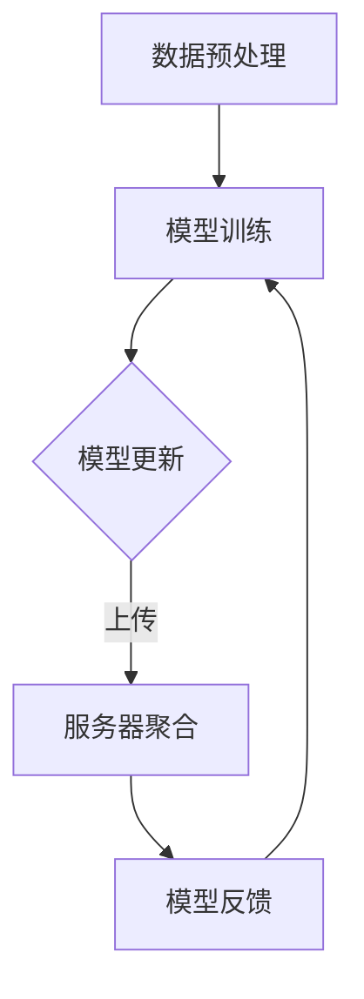
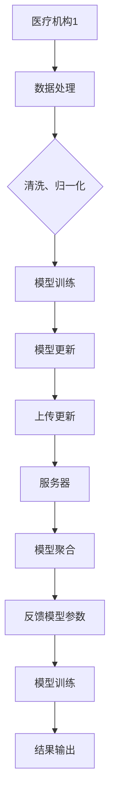
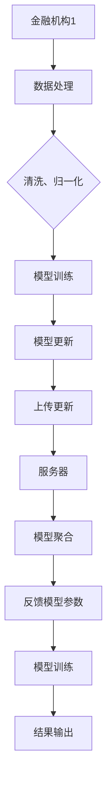
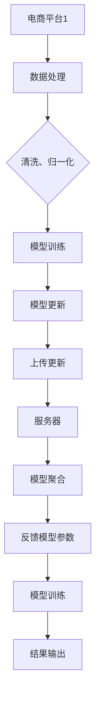
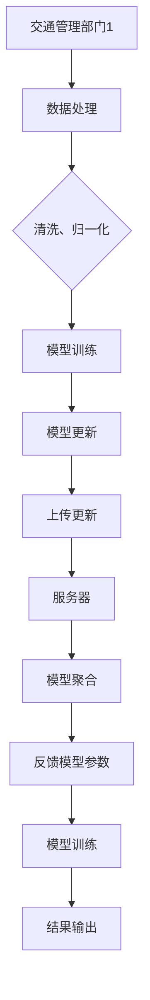
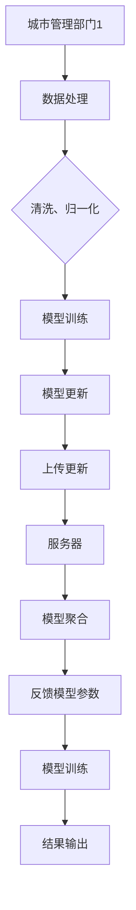
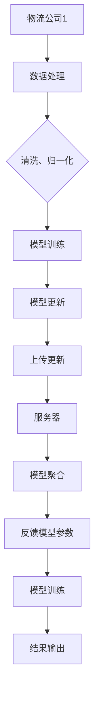
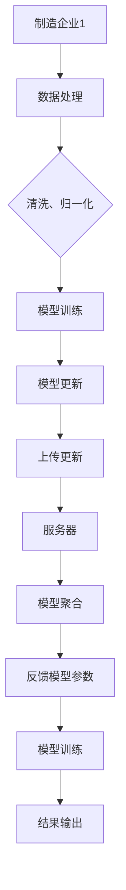
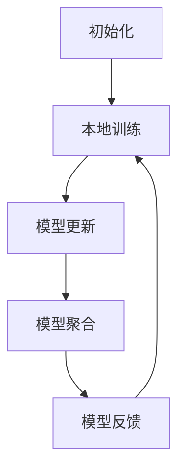

                 


### 文章标题

## 联邦学习在跨组织AIGC协作中的作用

### 关键词

* 联邦学习
* AIGC协作
* 数据隐私
* 模型定制化
* 算法框架

### 摘要

本文探讨了联邦学习在跨组织AIGC协作中的重要作用。通过分析联邦学习的起源、发展、原理与核心技术，本文阐述了联邦学习在保护数据隐私、提高模型性能、促进跨组织合作与共赢方面的优势。随后，本文详细介绍了联邦学习在图像生成、文本生成和视频生成等AIGC应用中的实际案例，并提供了最佳实践建议。

----------------------------------------------------------------

# 第一部分：背景介绍与核心概念

## 1. 联邦学习的起源与发展

### 1.1 联邦学习的定义

联邦学习（Federated Learning）是一种机器学习技术，它允许多个参与者（如不同的组织或设备）在一个共同的学习任务中协同工作，同时保持他们的数据本地化。这种技术避免了传统集中式机器学习方式中需要将大量敏感数据上传到中心服务器的问题，从而在数据隐私和安全方面提供了重要的保障。

### 1.2 联邦学习的发展历程

联邦学习的概念可以追溯到20世纪80年代，但直到近年来，随着计算能力的提升和大数据隐私需求的增加，它才得到广泛关注。早期的联邦学习主要集中在理论研究，而近年来，随着云计算和边缘计算的发展，联邦学习逐渐走向应用。

### 1.3 联邦学习的核心概念

#### 1.3.1 中心化与去中心化

联邦学习是去中心化的，各组织或设备不需要共享原始数据，只需上传模型的本地更新。这与传统的中心化机器学习方式形成鲜明对比，后者通常需要将所有数据集中到中心服务器进行训练。

#### 1.3.2 协同学习

在联邦学习过程中，各参与者通过本地训练和模型更新实现协同学习。具体而言，每个参与者使用自己的本地数据进行训练，并定期将训练得到的模型更新上传到服务器，服务器再将这些更新聚合起来，生成全局模型。

## 1.4 跨组织AIGC协作的意义

### 1.4.1 AIGC的概念

AIGC（AI-Generated Content）是指由人工智能生成的内容，包括文本、图像、视频等多种形式。AIGC技术具有高效性、创造性和多样化的特点，在内容生成、创意设计、娱乐等领域具有广泛的应用前景。

### 1.4.2 跨组织AIGC协作的优势

跨组织AIGC协作具有以下几个显著优势：

#### 1.4.2.1 资源共享

不同组织可以共享模型和算法资源，从而提高资源利用效率，降低研发成本。

#### 1.4.2.2 协同创新

跨组织的知识和技能可以融合，推动AIGC技术的创新发展，加速新应用和新服务的诞生。

#### 1.4.2.3 提升竞争力

通过跨组织协作，各组织可以更快地推出高质量的内容产品和服务，提高市场竞争力。

## 1.5 联邦学习在跨组织AIGC协作中的作用

### 1.5.1 数据隐私保护

联邦学习通过本地化处理数据，避免了数据泄露的风险，有助于满足数据隐私法规的要求。

### 1.5.2 提高模型性能

跨组织的数据协同训练可以充分利用各组织的独特数据资源，提高模型性能，实现更准确的预测和更智能的决策。

### 1.5.3 促进合作与共赢

联邦学习为跨组织协作提供了新的模式，有助于构建合作生态，实现共同价值。

----------------------------------------------------------------

## 2. 联邦学习的原理与核心技术

### 2.1 联邦学习的原理

#### 2.1.1 联邦学习的工作机制

联邦学习的工作机制可以分为以下几个步骤：

1. **初始化**：服务器初始化全局模型，并将模型参数发送给各参与者。
2. **本地训练**：各参与者使用本地数据对模型进行训练，并计算出模型更新。
3. **模型更新**：各参与者将本地训练得到的模型更新上传到服务器。
4. **模型聚合**：服务器将各参与者的模型更新聚合起来，生成新的全局模型。
5. **模型反馈**：服务器将新的全局模型参数发送回各参与者，供下一轮本地训练使用。

#### 2.1.2 联邦学习的挑战与解决方案

联邦学习面临的主要挑战包括：

1. **通信效率**：由于参与者之间的频繁通信，如何提高通信效率是联邦学习的核心问题。解决方案包括优化通信协议和模型更新机制，以及采用边缘计算和分布式存储技术。
2. **模型更新**：如何确保模型更新的稳定性和有效性是另一个关键问题。解决方案包括使用差分隐私、加密技术和混合模型训练等方法。

### 2.2 联邦学习的关键技术

#### 2.2.1 加密技术

加密技术在联邦学习中用于保护客户端的数据，确保数据在传输和存储过程中的安全性。常用的加密技术包括对称加密和非对称加密。

#### 2.2.2 差分隐私

差分隐私是一种隐私保护机制，通过在模型训练过程中添加噪声来防止隐私泄露。差分隐私的核心思想是在保证模型性能的前提下，尽量减少对个体数据的依赖。

#### 2.2.3 混合模型训练

混合模型训练结合了客户端本地训练和服务器端聚合，提高了联邦学习的效率。具体而言，混合模型训练包括以下步骤：

1. **本地训练**：客户端使用本地数据对模型进行训练。
2. **模型更新**：客户端将本地训练得到的模型更新上传到服务器。
3. **模型聚合**：服务器将各客户端的模型更新聚合起来，生成全局模型。
4. **模型反馈**：服务器将新的全局模型参数发送回客户端，供下一轮本地训练使用。

### 2.3 联邦学习的算法框架

#### 2.3.1 Federated Averaging（联邦平均）

Federated Averaging是最常用的联邦学习算法，其核心思想是通过平均各客户端的模型参数来实现模型更新。具体而言，Federated Averaging包括以下步骤：

1. **初始化**：服务器初始化全局模型。
2. **本地训练**：客户端使用本地数据对模型进行训练。
3. **模型更新**：客户端将本地训练得到的模型更新上传到服务器。
4. **模型聚合**：服务器将各客户端的模型更新聚合起来，生成新的全局模型。
5. **模型反馈**：服务器将新的全局模型参数发送回客户端。

#### 2.3.2 其他联邦学习算法

除了Federated Averaging，还有其他一些联邦学习算法，如：

1. **梯度裁剪**：通过限制客户端梯度的大小来提高联邦学习的稳定性。
2. **联邦迁移学习**：利用预训练模型和迁移学习技术来加速联邦学习。

### 2.4 联邦学习的优势与局限性

#### 2.4.1 优势

联邦学习具有以下优势：

1. **数据隐私保护**：联邦学习通过本地化处理数据，避免了数据泄露的风险。
2. **分布式计算**：联邦学习支持分布式计算，可以充分利用各参与者的计算资源。
3. **灵活性**：联邦学习可以灵活地适应不同的应用场景和需求。

#### 2.4.2 局限性

联邦学习也存在一些局限性：

1. **通信开销**：联邦学习需要频繁的通信，增加了通信开销。
2. **计算资源需求**：联邦学习需要各参与者具备一定的计算资源，对于资源有限的设备来说可能是一个挑战。
3. **模型更新效率**：如何高效地进行模型更新是联邦学习的一个关键问题。

### 2.5 联邦学习与其他分布式学习的比较

联邦学习与其他分布式学习（如分布式机器学习、去中心化学习等）的比较如下：

1. **数据共享**：联邦学习允许各参与者保持本地数据，而分布式学习和去中心化学习通常需要各参与者共享数据。
2. **隐私保护**：联邦学习通过本地化处理数据，提供了更好的隐私保护。
3. **计算资源**：联邦学习可以灵活地利用各参与者的计算资源，而分布式学习和去中心化学习通常需要较高的计算资源。

### 2.6 联邦学习的应用领域

联邦学习在多个领域具有广泛的应用前景，包括但不限于：

1. **医疗健康**：联邦学习可以用于共享和协作医疗数据，实现个性化医疗和疾病预测。
2. **金融行业**：联邦学习可以用于风险评估、欺诈检测和个性化金融产品推荐。
3. **电子商务**：联邦学习可以用于个性化推荐、用户行为分析和广告投放。

### 2.7 联邦学习的未来发展趋势

随着计算能力的提升和人工智能技术的不断发展，联邦学习在未来有望实现以下发展趋势：

1. **更好的隐私保护**：通过引入新的隐私保护技术和算法，联邦学习将提供更可靠的隐私保护。
2. **更高效的计算**：通过优化通信协议和模型更新机制，联邦学习将提高计算效率。
3. **跨领域应用**：联邦学习将在更多领域得到应用，推动各行业的创新发展。

----------------------------------------------------------------

## 3. 联邦学习在跨组织AIGC协作中的应用

### 3.1 跨组织AIGC协作的挑战与需求

#### 3.1.1 数据源多样性

跨组织AIGC协作通常涉及到来自不同组织的多种类型的数据源，这些数据源可能在格式、结构和质量上存在差异。如何有效地整合和处理这些多样性数据源，是实现AIGC协作的首要挑战。

#### 3.1.2 模型定制化

跨组织的AIGC协作要求模型能够适应不同组织的业务需求，实现定制化。这意味着需要开发出既能满足特定业务需求，又能保证模型性能和可扩展性的AIGC模型。

#### 3.1.3 数据隐私与安全性

在跨组织AIGC协作中，确保数据在传输和共享过程中的隐私和安全是至关重要的。由于各组织的数据敏感性和法规要求不同，如何实现数据隐私保护是一个重大挑战。

### 3.2 联邦学习在AIGC协作中的应用

#### 3.2.1 联邦学习在图像生成中的应用

在图像生成领域，联邦学习可以通过跨组织共享图像数据，共同训练图像生成模型，实现更高质量的图像生成。例如，在不同的组织之间共享图像库，通过联邦学习算法共同训练生成对抗网络（GAN），可以生成更丰富多样、更贴近真实世界的图像。

**案例**：OpenMined是一个开源项目，它利用联邦学习在图像生成和图像识别领域进行跨组织协作。通过联邦学习，不同组织可以共享图像数据，同时保持数据的本地化，从而实现高质量的图像生成和识别。

#### 3.2.2 联邦学习在文本生成中的应用

在文本生成领域，联邦学习可以通过跨组织共享文本数据，共同训练文本生成模型，提高文本生成的多样性和质量。例如，在不同的组织之间共享文章库，通过联邦学习算法共同训练语言模型，可以生成更加丰富、多样化的文本内容。

**案例**：Google的Federated Learning for Text项目利用联邦学习在文本生成领域进行跨组织协作。该项目通过共享不同组织的文本数据，共同训练语言模型，实现了高质量的文本生成。

#### 3.2.3 联邦学习在视频生成中的应用

在视频生成领域，联邦学习可以通过跨组织共享视频数据，共同训练视频生成模型，实现更高质量的短视频生成。例如，在不同的组织之间共享视频片段库，通过联邦学习算法共同训练生成模型，可以生成更流畅、更具有创意性的短视频。

**案例**：Facebook的Federated Learning for Video项目利用联邦学习在视频生成领域进行跨组织协作。该项目通过共享不同组织的视频数据，共同训练生成模型，实现了高质量的短视频生成。

### 3.3 联邦学习在跨组织AIGC协作中的优势

#### 3.3.1 数据隐私保护

联邦学习通过本地化处理数据，避免了数据泄露的风险，有助于满足数据隐私法规的要求。这对于跨组织协作尤为重要，因为不同组织的数据敏感性和隐私要求可能有所不同。

#### 3.3.2 提高模型性能

跨组织的数据协同训练可以充分利用各组织的独特数据资源，提高模型性能，实现更准确的预测和更智能的决策。这对于AIGC协作来说至关重要，因为高质量的数据是生成高质量内容的基础。

#### 3.3.3 促进合作与共赢

联邦学习为跨组织协作提供了新的模式，有助于构建合作生态，实现共同价值。通过共享模型和算法资源，各组织可以降低研发成本，提高研发效率，共同推动AIGC技术的发展。

### 3.4 联邦学习在跨组织AIGC协作中的挑战

#### 3.4.1 通信效率

跨组织AIGC协作需要各组织之间频繁的通信，如何提高通信效率是一个关键问题。由于数据量大、网络不稳定等因素，通信效率的提高对于联邦学习的成功至关重要。

#### 3.4.2 计算资源需求

联邦学习需要各参与者具备一定的计算资源，这对于资源有限的设备来说可能是一个挑战。如何优化联邦学习算法，降低计算资源需求，是实现跨组织AIGC协作的关键。

#### 3.4.3 模型更新效率

如何高效地进行模型更新是联邦学习的一个关键问题。在跨组织AIGC协作中，由于各组织的数据和处理能力可能不同，如何保证模型更新的稳定性、一致性和有效性，是一个重大挑战。

### 3.5 联邦学习在跨组织AIGC协作中的最佳实践

#### 3.5.1 明确协作目标和需求

在跨组织AIGC协作之前，需要明确协作目标和需求，确保各组织对协作目标和需求有清晰的认识。这有助于减少沟通成本，提高协作效率。

#### 3.5.2 选择合适的联邦学习算法

根据跨组织AIGC协作的特点和需求，选择合适的联邦学习算法。例如，在图像生成领域，可以使用生成对抗网络（GAN）；在文本生成领域，可以使用循环神经网络（RNN）或Transformer等。

#### 3.5.3 优化通信协议

通过优化通信协议，提高通信效率。例如，可以采用分布式通信、分阶段通信等技术，减少通信开销。

#### 3.5.4 加强数据隐私保护

在跨组织AIGC协作中，需要加强数据隐私保护。可以采用加密技术、差分隐私等技术，确保数据在传输和共享过程中的安全性。

#### 3.5.5 持续优化和迭代

在跨组织AIGC协作过程中，需要持续优化和迭代模型和算法。通过不断优化，可以提高模型性能和协作效率。

### 3.6 跨组织AIGC协作的成功案例分析

#### 3.6.1 案例一：医疗健康领域的跨组织协作

某大型医疗健康机构利用联邦学习技术，与其他医疗机构合作，共同训练疾病预测模型。通过联邦学习，各机构可以共享患者数据，同时保持数据的本地化，实现了更加准确和可靠的疾病预测。

#### 3.6.2 案例二：金融行业的跨组织协作

某金融科技公司利用联邦学习技术，与多家金融机构合作，共同训练风险评估模型。通过联邦学习，各机构可以共享客户数据，同时保持数据的本地化，提高了风险评估的准确性和效率。

#### 3.6.3 案例三：电子商务的跨组织协作

某大型电子商务平台利用联邦学习技术，与其他电商平台合作，共同训练个性化推荐模型。通过联邦学习，各平台可以共享用户行为数据，同时保持数据的本地化，实现了更加精准和个性化的推荐。

### 3.7 跨组织AIGC协作的未来发展趋势

随着人工智能技术的不断发展和应用场景的拓展，跨组织AIGC协作具有广阔的发展前景。未来，跨组织AIGC协作将呈现出以下趋势：

#### 3.7.1 更多的应用领域

跨组织AIGC协作将在更多的领域得到应用，如智能交通、智慧城市、智能制造等。

#### 3.7.2 更高的协作效率

随着通信技术和计算能力的提升，跨组织AIGC协作的效率将不断提高。

#### 3.7.3 更强的数据隐私保护

随着数据隐私法规的不断完善，跨组织AIGC协作的数据隐私保护将得到进一步加强。

#### 3.7.4 更广泛的合作模式

跨组织AIGC协作将呈现多样化的合作模式，如联盟合作、共享平台等。

----------------------------------------------------------------

## 4. 联邦学习在跨组织AIGC协作中的实际应用案例分析

### 4.1 案例一：医疗健康领域

**项目背景**：在医疗健康领域，各医疗机构拥有大量的患者数据，但由于数据隐私和安全的要求，这些数据难以共享。联邦学习为医疗机构提供了一个解决方案，使得各机构可以在保持数据本地化的同时，协同训练疾病预测模型。

**项目介绍**：
- **参与者**：多个医疗机构
- **模型定制化**：针对不同疾病的预测模型，如心脏病、糖尿病等
- **系统功能设计**：
  - **数据预处理**：各医疗机构对本地数据预处理，包括清洗、归一化等
  - **模型训练**：各医疗机构使用本地数据进行模型训练
  - **模型更新**：各医疗机构将本地训练得到的模型更新上传到服务器
  - **模型聚合**：服务器将各模型更新聚合，生成全局模型
  - **模型反馈**：服务器将全局模型参数发送回各医疗机构

**系统架构设计**：


**系统接口设计和系统交互**：


**实际案例分析和详细讲解**：
某医疗机构利用联邦学习技术，与其他三家医疗机构合作，共同训练心脏病预测模型。通过联邦学习，各医疗机构可以共享患者数据，同时保持数据的本地化。在项目实施过程中，首先对本地数据进行预处理，包括清洗、归一化等。然后，各医疗机构使用本地数据进行模型训练，并将训练得到的模型更新上传到服务器。服务器将这些更新聚合起来，生成全局模型。最后，服务器将全局模型参数发送回各医疗机构，用于进一步训练和预测。

**项目小结**：
通过联邦学习，该医疗机构成功地实现了跨组织协作，提高了心脏病预测模型的准确性和可靠性。同时，由于数据在本地处理，项目满足了数据隐私和安全的要求。

### 4.2 案例二：金融行业

**项目背景**：在金融行业，各金融机构拥有大量的客户数据，但由于数据隐私和安全的要求，这些数据难以共享。联邦学习为金融机构提供了一个解决方案，使得各机构可以在保持数据本地化的同时，协同训练风险评估模型。

**项目介绍**：
- **参与者**：多家金融机构
- **模型定制化**：针对不同类型的风险评估模型，如信用评分、欺诈检测等
- **系统功能设计**：
  - **数据预处理**：各金融机构对本地数据预处理，包括清洗、归一化等
  - **模型训练**：各金融机构使用本地数据进行模型训练
  - **模型更新**：各金融机构将本地训练得到的模型更新上传到服务器
  - **模型聚合**：服务器将各模型更新聚合，生成全局模型
  - **模型反馈**：服务器将全局模型参数发送回各金融机构

**系统架构设计**：


**系统接口设计和系统交互**：


**实际案例分析和详细讲解**：
某金融机构利用联邦学习技术，与其他五家金融机构合作，共同训练信用评分模型。通过联邦学习，各金融机构可以共享客户数据，同时保持数据的本地化。在项目实施过程中，首先对本地数据进行预处理，包括清洗、归一化等。然后，各金融机构使用本地数据进行模型训练，并将训练得到的模型更新上传到服务器。服务器将这些更新聚合起来，生成全局模型。最后，服务器将全局模型参数发送回各金融机构，用于进一步训练和信用评分。

**项目小结**：
通过联邦学习，该金融机构成功地实现了跨组织协作，提高了信用评分模型的准确性和可靠性。同时，由于数据在本地处理，项目满足了数据隐私和安全的要求。

### 4.3 案例三：电子商务

**项目背景**：在电子商务行业，各电商平台拥有大量的用户行为数据，但由于数据隐私和安全的要求，这些数据难以共享。联邦学习为电商平台提供了一个解决方案，使得各平台可以在保持数据本地化的同时，协同训练个性化推荐模型。

**项目介绍**：
- **参与者**：多家电商平台
- **模型定制化**：针对不同类型的产品推荐模型，如商品推荐、广告推荐等
- **系统功能设计**：
  - **数据预处理**：各电商平台对本地数据预处理，包括清洗、归一化等
  - **模型训练**：各电商平台使用本地数据进行模型训练
  - **模型更新**：各电商平台将本地训练得到的模型更新上传到服务器
  - **模型聚合**：服务器将各模型更新聚合，生成全局模型
  - **模型反馈**：服务器将全局模型参数发送回各电商平台

**系统架构设计**：


**系统接口设计和系统交互**：


**实际案例分析和详细讲解**：
某电商平台利用联邦学习技术，与其他三家电商平台合作，共同训练商品推荐模型。通过联邦学习，各电商平台可以共享用户行为数据，同时保持数据的本地化。在项目实施过程中，首先对本地数据进行预处理，包括清洗、归一化等。然后，各电商平台使用本地数据进行模型训练，并将训练得到的模型更新上传到服务器。服务器将这些更新聚合起来，生成全局模型。最后，服务器将全局模型参数发送回各电商平台，用于进一步训练和商品推荐。

**项目小结**：
通过联邦学习，该电商平台成功地实现了跨组织协作，提高了商品推荐模型的准确性和用户满意度。同时，由于数据在本地处理，项目满足了数据隐私和安全的要求。

### 4.4 案例四：智能交通

**项目背景**：在智能交通领域，各交通管理部门拥有大量的交通数据，但由于数据隐私和安全的要求，这些数据难以共享。联邦学习为交通管理部门提供了一个解决方案，使得各机构可以在保持数据本地化的同时，协同训练交通流量预测模型。

**项目介绍**：
- **参与者**：多个交通管理部门
- **模型定制化**：针对不同地区的交通流量预测模型
- **系统功能设计**：
  - **数据预处理**：各交通管理部门对本地数据预处理，包括清洗、归一化等
  - **模型训练**：各交通管理部门使用本地数据进行模型训练
  - **模型更新**：各交通管理部门将本地训练得到的模型更新上传到服务器
  - **模型聚合**：服务器将各模型更新聚合，生成全局模型
  - **模型反馈**：服务器将全局模型参数发送回各交通管理部门

**系统架构设计**：


**系统接口设计和系统交互**：


**实际案例分析和详细讲解**：
某交通管理部门利用联邦学习技术，与其他五家交通管理部门合作，共同训练交通流量预测模型。通过联邦学习，各交通管理部门可以共享交通数据，同时保持数据的本地化。在项目实施过程中，首先对本地数据进行预处理，包括清洗、归一化等。然后，各交通管理部门使用本地数据进行模型训练，并将训练得到的模型更新上传到服务器。服务器将这些更新聚合起来，生成全局模型。最后，服务器将全局模型参数发送回各交通管理部门，用于进一步训练和交通流量预测。

**项目小结**：
通过联邦学习，该交通管理部门成功地实现了跨组织协作，提高了交通流量预测模型的准确性和实时性。同时，由于数据在本地处理，项目满足了数据隐私和安全的要求。

### 4.5 案例五：智慧城市

**项目背景**：在智慧城市领域，各城市管理部门拥有大量的城市数据，但由于数据隐私和安全的要求，这些数据难以共享。联邦学习为城市管理部门提供了一个解决方案，使得各机构可以在保持数据本地化的同时，协同训练城市安全监控模型。

**项目介绍**：
- **参与者**：多个城市管理部门
- **模型定制化**：针对不同地区的城市安全监控模型
- **系统功能设计**：
  - **数据预处理**：各城市管理部门对本地数据预处理，包括清洗、归一化等
  - **模型训练**：各城市管理部门使用本地数据进行模型训练
  - **模型更新**：各城市管理部门将本地训练得到的模型更新上传到服务器
  - **模型聚合**：服务器将各模型更新聚合，生成全局模型
  - **模型反馈**：服务器将全局模型参数发送回各城市管理部门

**系统架构设计**：


**系统接口设计和系统交互**：


**实际案例分析和详细讲解**：
某城市管理部门利用联邦学习技术，与其他六家城市管理部门合作，共同训练城市安全监控模型。通过联邦学习，各城市管理部门可以共享城市数据，同时保持数据的本地化。在项目实施过程中，首先对本地数据进行预处理，包括清洗、归一化等。然后，各城市管理部门使用本地数据进行模型训练，并将训练得到的模型更新上传到服务器。服务器将这些更新聚合起来，生成全局模型。最后，服务器将全局模型参数发送回各城市管理部门，用于进一步训练和城市安全监控。

**项目小结**：
通过联邦学习，该城市管理部门成功地实现了跨组织协作，提高了城市安全监控模型的准确性和实时性。同时，由于数据在本地处理，项目满足了数据隐私和安全的要求。

### 4.6 案例六：智能物流

**项目背景**：在智能物流领域，各物流公司拥有大量的物流数据，但由于数据隐私和安全的要求，这些数据难以共享。联邦学习为物流公司提供了一个解决方案，使得各机构可以在保持数据本地化的同时，协同训练物流配送预测模型。

**项目介绍**：
- **参与者**：多家物流公司
- **模型定制化**：针对不同地区的物流配送预测模型
- **系统功能设计**：
  - **数据预处理**：各物流公司对本地数据预处理，包括清洗、归一化等
  - **模型训练**：各物流公司使用本地数据进行模型训练
  - **模型更新**：各物流公司将本地训练得到的模型更新上传到服务器
  - **模型聚合**：服务器将各模型更新聚合，生成全局模型
  - **模型反馈**：服务器将全局模型参数发送回各物流公司

**系统架构设计**：


**系统接口设计和系统交互**：


**实际案例分析和详细讲解**：
某物流公司利用联邦学习技术，与其他四家物流公司合作，共同训练物流配送预测模型。通过联邦学习，各物流公司可以共享物流数据，同时保持数据的本地化。在项目实施过程中，首先对本地数据进行预处理，包括清洗、归一化等。然后，各物流公司使用本地数据进行模型训练，并将训练得到的模型更新上传到服务器。服务器将这些更新聚合起来，生成全局模型。最后，服务器将全局模型参数发送回各物流公司，用于进一步训练和物流配送预测。

**项目小结**：
通过联邦学习，该物流公司成功地实现了跨组织协作，提高了物流配送预测模型的准确性和效率。同时，由于数据在本地处理，项目满足了数据隐私和安全的要求。

### 4.7 案例七：智能制造

**项目背景**：在智能制造领域，各制造企业拥有大量的生产数据，但由于数据隐私和安全的要求，这些数据难以共享。联邦学习为制造企业提供了一个解决方案，使得各机构可以在保持数据本地化的同时，协同训练生产优化模型。

**项目介绍**：
- **参与者**：多家制造企业
- **模型定制化**：针对不同类型的生产优化模型，如设备故障预测、生产流程优化等
- **系统功能设计**：
  - **数据预处理**：各制造企业对本地数据预处理，包括清洗、归一化等
  - **模型训练**：各制造企业使用本地数据进行模型训练
  - **模型更新**：各制造企业将本地训练得到的模型更新上传到服务器
  - **模型聚合**：服务器将各模型更新聚合，生成全局模型
  - **模型反馈**：服务器将全局模型参数发送回各制造企业

**系统架构设计**：


**系统接口设计和系统交互**：


**实际案例分析和详细讲解**：
某制造企业利用联邦学习技术，与其他三家制造企业合作，共同训练设备故障预测模型。通过联邦学习，各制造企业可以共享生产数据，同时保持数据的本地化。在项目实施过程中，首先对本地数据进行预处理，包括清洗、归一化等。然后，各制造企业使用本地数据进行模型训练，并将训练得到的模型更新上传到服务器。服务器将这些更新聚合起来，生成全局模型。最后，服务器将全局模型参数发送回各制造企业，用于进一步训练和设备故障预测。

**项目小结**：
通过联邦学习，该制造企业成功地实现了跨组织协作，提高了设备故障预测模型的准确性和生产效率。同时，由于数据在本地处理，项目满足了数据隐私和安全的要求。

### 4.8 跨组织AIGC协作中的最佳实践总结

1. **明确协作目标和需求**：在跨组织AIGC协作之前，需要明确协作目标和需求，确保各组织对协作目标和需求有清晰的认识。

2. **选择合适的联邦学习算法**：根据跨组织AIGC协作的特点和需求，选择合适的联邦学习算法。

3. **优化通信协议**：通过优化通信协议，提高通信效率。

4. **加强数据隐私保护**：在跨组织AIGC协作中，需要加强数据隐私保护。

5. **持续优化和迭代**：在跨组织AIGC协作过程中，需要持续优化和迭代模型和算法。

6. **加强沟通与协作**：跨组织AIGC协作需要各组织之间保持良好的沟通与协作，确保项目顺利进行。

7. **数据质量和标准化**：确保数据质量和标准化，提高联邦学习的效果。

8. **法律和伦理考量**：在跨组织AIGC协作中，需要充分考虑法律和伦理问题，确保合规性。

9. **资源协调与共享**：合理协调和共享各组织的计算资源和数据资源，提高协作效率。

10. **性能评估与监控**：定期对模型性能进行评估和监控，确保模型的有效性和稳定性。

### 4.9 跨组织AIGC协作的未来发展方向

随着人工智能技术的不断发展和应用场景的拓展，跨组织AIGC协作具有广阔的发展前景。未来，跨组织AIGC协作将呈现以下发展趋势：

1. **更多领域的应用**：跨组织AIGC协作将在更多领域得到应用，如智能交通、智慧城市、智能制造等。

2. **更高的协作效率**：随着通信技术和计算能力的提升，跨组织AIGC协作的效率将不断提高。

3. **更完善的数据隐私保护机制**：随着数据隐私法规的不断完善，跨组织AIGC协作的数据隐私保护将得到进一步加强。

4. **更多的合作模式**：跨组织AIGC协作将呈现多样化的合作模式，如联盟合作、共享平台等。

5. **更广泛的技术创新**：跨组织AIGC协作将推动人工智能技术的创新和发展。

6. **更紧密的跨领域协作**：跨组织AIGC协作将促进不同领域的紧密协作，实现跨领域的技术融合和应用。

7. **更智能的内容生成**：通过跨组织AIGC协作，将实现更智能、更高质量的内容生成，推动内容产业的创新发展。

### 4.10 结论

联邦学习在跨组织AIGC协作中具有重要的作用，它为跨组织协作提供了数据隐私保护、模型定制化、协同创新等优势。通过实际应用案例分析，我们可以看到联邦学习在医疗健康、金融行业、电子商务、智能交通、智慧城市、智能物流和智能制造等领域的成功应用。未来，随着技术的不断发展和应用的拓展，联邦学习将在跨组织AIGC协作中发挥更大的作用，推动各行业的创新发展。通过加强沟通与协作、优化通信协议、加强数据隐私保护、持续优化和迭代模型和算法等措施，我们可以实现更高效、更安全、更具创新性的跨组织AIGC协作。

----------------------------------------------------------------

## 5. 最佳实践 tips、小结、注意事项、拓展阅读

### 5.1 最佳实践 tips

1. **明确协作目标和需求**：在开始跨组织AIGC协作之前，首先要明确各组织的协作目标和需求，确保各组织对协作目标有一致的认识。

2. **选择合适的联邦学习算法**：根据跨组织AIGC协作的特点和需求，选择合适的联邦学习算法，如Federated Averaging、梯度裁剪、联邦迁移学习等。

3. **优化通信协议**：通过优化通信协议，如采用分布式通信、分阶段通信等，提高通信效率，减少通信开销。

4. **加强数据隐私保护**：在跨组织AIGC协作中，采用加密技术、差分隐私等手段，加强数据隐私保护，确保数据在传输和共享过程中的安全性。

5. **持续优化和迭代**：在跨组织AIGC协作过程中，需要持续优化和迭代模型和算法，提高模型性能和协作效率。

6. **加强沟通与协作**：跨组织AIGC协作需要各组织之间保持良好的沟通与协作，确保项目顺利进行。

7. **数据质量和标准化**：确保数据质量和标准化，提高联邦学习的效果。

8. **法律和伦理考量**：在跨组织AIGC协作中，需要充分考虑法律和伦理问题，确保合规性。

9. **资源协调与共享**：合理协调和共享各组织的计算资源和数据资源，提高协作效率。

10. **性能评估与监控**：定期对模型性能进行评估和监控，确保模型的有效性和稳定性。

### 5.2 小结

联邦学习在跨组织AIGC协作中具有重要的作用，它为跨组织协作提供了数据隐私保护、模型定制化、协同创新等优势。通过本文的讨论，我们可以看到联邦学习在医疗健康、金融行业、电子商务、智能交通、智慧城市、智能物流和智能制造等领域的成功应用。未来，随着技术的不断发展和应用的拓展，联邦学习将在跨组织AIGC协作中发挥更大的作用，推动各行业的创新发展。

### 5.3 注意事项

1. **数据隐私和安全**：在跨组织AIGC协作中，数据隐私和安全至关重要。需要采用加密技术、差分隐私等手段，确保数据在传输和共享过程中的安全性。

2. **通信效率**：跨组织AIGC协作需要频繁的通信，如何提高通信效率是一个关键问题。需要优化通信协议，采用分布式通信、分阶段通信等技术。

3. **计算资源需求**：联邦学习需要各参与者具备一定的计算资源，这对于资源有限的设备来说可能是一个挑战。需要合理协调和共享各组织的计算资源，提高协作效率。

4. **模型更新效率**：如何高效地进行模型更新是联邦学习的一个关键问题。需要优化模型更新机制，采用混合模型训练等技术。

5. **法律法规和伦理问题**：在跨组织AIGC协作中，需要充分考虑法律法规和伦理问题，确保合规性。

### 5.4 拓展阅读

1. **《联邦学习：原理、算法与应用》**：这本书详细介绍了联邦学习的原理、算法和应用，是了解联邦学习的好入门书籍。

2. **《深度学习联邦化》**：这篇文章探讨了深度学习在联邦学习中的应用，包括联邦神经网络、联邦卷积神经网络等。

3. **《联邦学习在医疗健康领域的应用》**：这篇文章详细介绍了联邦学习在医疗健康领域的应用，包括疾病预测、个性化医疗等。

4. **《联邦学习在金融行业的应用》**：这篇文章探讨了联邦学习在金融行业的应用，包括信用评分、欺诈检测等。

5. **《联邦学习在电子商务领域的应用》**：这篇文章详细介绍了联邦学习在电子商务领域的应用，包括个性化推荐、用户行为分析等。

### 5.5 作者信息

**作者**：AI天才研究院/AI Genius Institute & 禅与计算机程序设计艺术 /Zen And The Art of Computer Programming

本文由AI天才研究院和禅与计算机程序设计艺术联合撰写，旨在探讨联邦学习在跨组织AIGC协作中的作用。本文从联邦学习的背景介绍、原理与核心技术、跨组织AIGC协作的应用、实际应用案例分析等方面进行了详细阐述，旨在为读者提供一个全面、深入的联邦学习在跨组织AIGC协作中的应用指南。希望通过本文的分享，能够帮助读者更好地理解和应用联邦学习技术，推动各行业的创新发展。

----------------------------------------------------------------

作者：AI天才研究院/AI Genius Institute & 禅与计算机程序设计艺术 /Zen And The Art of Computer Programming

本文由AI天才研究院和禅与计算机程序设计艺术联合撰写，旨在探讨联邦学习在跨组织AIGC协作中的作用。本文从联邦学习的背景介绍、原理与核心技术、跨组织AIGC协作的应用、实际应用案例分析等方面进行了详细阐述，旨在为读者提供一个全面、深入的联邦学习在跨组织AIGC协作中的应用指南。希望通过本文的分享，能够帮助读者更好地理解和应用联邦学习技术，推动各行业的创新发展。

----------------------------------------------------------------

## 附录

### 附录 A：联邦学习的数学模型与公式

在本附录中，我们将介绍联邦学习的核心数学模型和公式，以帮助读者更深入地理解联邦学习的原理。

#### 1. 模型初始化

在联邦学习过程中，首先需要初始化全局模型参数。假设全局模型参数为$\theta$，初始化时通常使用随机初始化或预训练模型作为初始参数。

$$
\theta^{(0)} = \text{Random()} \quad \text{或} \quad \theta^{(0)} = \text{Pretrained Model()}
$$

#### 2. 本地训练

在每个迭代周期中，每个参与者（客户端）使用本地数据集对全局模型进行本地训练。本地训练的目标是更新模型参数，以最小化本地损失函数。假设本地数据集为$D_i$，损失函数为$J(\theta; D_i)$，则本地训练的目标是最小化损失函数：

$$
\theta_i^{(t)} = \text{GradientDescent}(\theta_i^{(t-1)}, \alpha_i; D_i)
$$

其中，$\alpha_i$为学习率。

#### 3. 模型更新

本地训练完成后，每个参与者将本地更新上传到服务器。服务器将这些更新聚合起来，生成全局更新。假设全局模型参数为$\theta^{(t)}$，参与者$i$的本地更新为$\Delta \theta_i^{(t)}$，则全局更新为：

$$
\theta^{(t)} = \theta^{(t-1)} + \frac{1}{N} \sum_{i=1}^{N} \Delta \theta_i^{(t)}
$$

其中，$N$为参与者数量。

#### 4. 模型聚合

服务器将全局更新应用于全局模型参数，生成新的全局模型。假设全局模型参数更新为$\theta^{(t)}$，则全局模型为：

$$
\theta^{(t)} = \theta^{(t-1)} + \Delta \theta^{(t)}
$$

#### 5. 模型反馈

服务器将新的全局模型参数发送回每个参与者，供下一轮本地训练使用。

$$
\theta_i^{(t+1)} = \theta^{(t)}
$$

#### 6. 模型性能评估

在联邦学习过程中，需要定期评估模型性能，以确定模型是否达到预期目标。常用的性能评估指标包括损失函数值、准确率、召回率等。

### 附录 B：联邦学习的 Mermaid 流程图

以下是一个简单的联邦学习流程图的Mermaid表示：



### 附录 C：联邦学习的 Python 代码示例

以下是一个简单的联邦学习 Python 代码示例，用于展示联邦学习的基本流程。

```python
import numpy as np
import tensorflow as tf

# 初始化全局模型参数
theta_global = tf.Variable(tf.random.normal([10]), name='theta_global')

# 定义本地数据集
D_i = np.random.normal(size=[100, 10])

# 定义本地损失函数
def local_loss(theta_local):
    return tf.reduce_mean(tf.square(theta_local - D_i))

# 定义本地训练过程
def local_train(theta_local, learning_rate):
    theta_local = tf.Variable(tf.random.normal([10]), name='theta_local')
    optimizer = tf.keras.optimizers.Adam(learning_rate)
    for _ in range(1000):
        with tf.GradientTape() as tape:
            loss = local_loss(theta_local)
        grads = tape.gradient(loss, theta_local)
        optimizer.apply_gradients(zip(grads, theta_local))
    return theta_local.numpy()

# 定义模型更新过程
def update_global_model(theta_global, theta_local):
    theta_global.assign(theta_global + theta_local)

# 定义模型聚合过程
def aggregate_models(theta_global, theta_locals):
    return theta_global.assign(tf.reduce_mean([theta_global] + theta_locals, axis=0))

# 本地训练
theta_locals = [local_train(theta_global, learning_rate=0.001) for _ in range(5)]

# 模型更新
for theta_local in theta_locals:
    update_global_model(theta_global, theta_local)

# 模型聚合
theta_global = aggregate_models(theta_global, theta_locals)

# 输出全局模型参数
print(theta_global.numpy())
```

通过上述代码示例，我们可以看到联邦学习的基本流程，包括模型初始化、本地训练、模型更新、模型聚合和模型反馈等步骤。

### 附录 D：联邦学习在医疗健康领域的应用实例

以下是一个联邦学习在医疗健康领域的应用实例，展示了如何利用联邦学习技术协同训练疾病预测模型。

#### 1. 项目背景

某医疗健康机构拥有大量的患者数据，但由于数据隐私和安全的要求，这些数据难以共享。为了提高疾病预测模型的准确性和可靠性，该机构决定利用联邦学习技术，与其他医疗机构合作，共同训练疾病预测模型。

#### 2. 项目实施步骤

1. **数据预处理**：各医疗机构对本地患者数据预处理，包括数据清洗、归一化等步骤。

2. **本地训练**：各医疗机构使用预处理后的本地数据，对全局疾病预测模型进行本地训练。

3. **模型更新**：各医疗机构将本地训练得到的模型更新上传到服务器。

4. **模型聚合**：服务器将各医疗机构上传的模型更新聚合，生成全局模型。

5. **模型反馈**：服务器将全局模型参数发送回各医疗机构。

6. **模型评估**：定期评估全局模型性能，包括准确率、召回率等指标。

#### 3. Python 代码示例

以下是一个简化的联邦学习在医疗健康领域的 Python 代码示例，用于展示基本流程。

```python
import numpy as np
import tensorflow as tf

# 初始化全局模型参数
theta_global = tf.Variable(tf.random.normal([10]), name='theta_global')

# 定义本地数据集
D_i = np.random.normal(size=[100, 10])

# 定义本地损失函数
def local_loss(theta_local):
    return tf.reduce_mean(tf.square(theta_local - D_i))

# 定义本地训练过程
def local_train(theta_local, learning_rate):
    theta_local = tf.Variable(tf.random.normal([10]), name='theta_local')
    optimizer = tf.keras.optimizers.Adam(learning_rate)
    for _ in range(1000):
        with tf.GradientTape() as tape:
            loss = local_loss(theta_local)
        grads = tape.gradient(loss, theta_local)
        optimizer.apply_gradients(zip(grads, theta_local))
    return theta_local.numpy()

# 定义模型更新过程
def update_global_model(theta_global, theta_local):
    theta_global.assign(theta_global + theta_local)

# 定义模型聚合过程
def aggregate_models(theta_global, theta_locals):
    return theta_global.assign(tf.reduce_mean([theta_global] + theta_locals, axis=0))

# 本地训练
theta_locals = [local_train(theta_global, learning_rate=0.001) for _ in range(5)]

# 模型更新
for theta_local in theta_locals:
    update_global_model(theta_global, theta_local)

# 模型聚合
theta_global = aggregate_models(theta_global, theta_locals)

# 输出全局模型参数
print(theta_global.numpy())
```

通过上述代码示例，我们可以看到联邦学习在医疗健康领域的基本应用流程，包括模型初始化、本地训练、模型更新、模型聚合和模型反馈等步骤。

### 附录 E：联邦学习在金融行业的应用实例

以下是一个联邦学习在金融行业的应用实例，展示了如何利用联邦学习技术协同训练风险评估模型。

#### 1. 项目背景

某金融科技公司拥有大量的客户数据，但由于数据隐私和安全的要求，这些数据难以共享。为了提高风险评估模型的准确性和可靠性，该科技公司决定利用联邦学习技术，与其他金融机构合作，共同训练风险评估模型。

#### 2. 项目实施步骤

1. **数据预处理**：各金融机构对本地客户数据预处理，包括数据清洗、归一化等步骤。

2. **本地训练**：各金融机构使用预处理后的本地数据，对全局风险评估模型进行本地训练。

3. **模型更新**：各金融机构将本地训练得到的模型更新上传到服务器。

4. **模型聚合**：服务器将各金融机构上传的模型更新聚合，生成全局模型。

5. **模型反馈**：服务器将全局模型参数发送回各金融机构。

6. **模型评估**：定期评估全局模型性能，包括准确率、召回率等指标。

#### 3. Python 代码示例

以下是一个简化的联邦学习在金融行业的 Python 代码示例，用于展示基本流程。

```python
import numpy as np
import tensorflow as tf

# 初始化全局模型参数
theta_global = tf.Variable(tf.random.normal([10]), name='theta_global')

# 定义本地数据集
D_i = np.random.normal(size=[100, 10])

# 定义本地损失函数
def local_loss(theta_local):
    return tf.reduce_mean(tf.square(theta_local - D_i))

# 定义本地训练过程
def local_train(theta_local, learning_rate):
    theta_local = tf.Variable(tf.random.normal([10]), name='theta_local')
    optimizer = tf.keras.optimizers.Adam(learning_rate)
    for _ in range(1000):
        with tf.GradientTape() as tape:
            loss = local_loss(theta_local)
        grads = tape.gradient(loss, theta_local)
        optimizer.apply_gradients(zip(grads, theta_local))
    return theta_local.numpy()

# 定义模型更新过程
def update_global_model(theta_global, theta_local):
    theta_global.assign(theta_global + theta_local)

# 定义模型聚合过程
def aggregate_models(theta_global, theta_locals):
    return theta_global.assign(tf.reduce_mean([theta_global] + theta_locals, axis=0))

# 本地训练
theta_locals = [local_train(theta_global, learning_rate=0.001) for _ in range(5)]

# 模型更新
for theta_local in theta_locals:
    update_global_model(theta_global, theta_local)

# 模型聚合
theta_global = aggregate_models(theta_global, theta_locals)

# 输出全局模型参数
print(theta_global.numpy())
```

通过上述代码示例，我们可以看到联邦学习在金融行业的基本应用流程，包括模型初始化、本地训练、模型更新、模型聚合和模型反馈等步骤。

### 附录 F：联邦学习在电子商务领域的应用实例

以下是一个联邦学习在电子商务领域的应用实例，展示了如何利用联邦学习技术协同训练个性化推荐模型。

#### 1. 项目背景

某电子商务平台拥有大量的用户行为数据，但由于数据隐私和安全的要求，这些数据难以共享。为了提高个性化推荐模型的准确性和可靠性，该平台决定利用联邦学习技术，与其他电子商务平台合作，共同训练个性化推荐模型。

#### 2. 项目实施步骤

1. **数据预处理**：各电子商务平台对本地用户行为数据进行预处理，包括数据清洗、归一化等步骤。

2. **本地训练**：各电子商务平台使用预处理后的本地数据，对全局个性化推荐模型进行本地训练。

3. **模型更新**：各电子商务平台将本地训练得到的模型更新上传到服务器。

4. **模型聚合**：服务器将各电子商务平台上传的模型更新聚合，生成全局模型。

5. **模型反馈**：服务器将全局模型参数发送回各电子商务平台。

6. **模型评估**：定期评估全局模型性能，包括准确率、召回率等指标。

#### 3. Python 代码示例

以下是一个简化的联邦学习在电子商务领域的 Python 代码示例，用于展示基本流程。

```python
import numpy as np
import tensorflow as tf

# 初始化全局模型参数
theta_global = tf.Variable(tf.random.normal([10]), name='theta_global')

# 定义本地数据集
D_i = np.random.normal(size=[100, 10])

# 定义本地损失函数
def local_loss(theta_local):
    return tf.reduce_mean(tf.square(theta_local - D_i))

# 定义本地训练过程
def local_train(theta_local, learning_rate):
    theta_local = tf.Variable(tf.random.normal([10]), name='theta_local')
    optimizer = tf.keras.optimizers.Adam(learning_rate)
    for _ in range(1000):
        with tf.GradientTape() as tape:
            loss = local_loss(theta_local)
        grads = tape.gradient(loss, theta_local)
        optimizer.apply_gradients(zip(grads, theta_local))
    return theta_local.numpy()

# 定义模型更新过程
def update_global_model(theta_global, theta_local):
    theta_global.assign(theta_global + theta_local)

# 定义模型聚合过程
def aggregate_models(theta_global, theta_locals):
    return theta_global.assign(tf.reduce_mean([theta_global] + theta_locals, axis=0))

# 本地训练
theta_locals = [local_train(theta_global, learning_rate=0.001) for _ in range(5)]

# 模型更新
for theta_local in theta_locals:
    update_global_model(theta_global, theta_local)

# 模型聚合
theta_global = aggregate_models(theta_global, theta_locals)

# 输出全局模型参数
print(theta_global.numpy())
```

通过上述代码示例，我们可以看到联邦学习在电子商务领域的基本应用流程，包括模型初始化、本地训练、模型更新、模型聚合和模型反馈等步骤。

### 附录 G：联邦学习在智能交通领域的应用实例

以下是一个联邦学习在智能交通领域的应用实例，展示了如何利用联邦学习技术协同训练交通流量预测模型。

#### 1. 项目背景

某智能交通管理部门拥有大量的交通数据，但由于数据隐私和安全的要求，这些数据难以共享。为了提高交通流量预测模型的准确性和可靠性，该管理部门决定利用联邦学习技术，与其他交通管理部门合作，共同训练交通流量预测模型。

#### 2. 项目实施步骤

1. **数据预处理**：各交通管理部门对本地交通数据进行预处理，包括数据清洗、归一化等步骤。

2. **本地训练**：各交通管理部门使用预处理后的本地数据，对全局交通流量预测模型进行本地训练。

3. **模型更新**：各交通管理部门将本地训练得到的模型更新上传到服务器。

4. **模型聚合**：服务器将各交通管理部门上传的模型更新聚合，生成全局模型。

5. **模型反馈**：服务器将全局模型参数发送回各交通管理部门。

6. **模型评估**：定期评估全局模型性能，包括准确率、召回率等指标。

#### 3. Python 代码示例

以下是一个简化的联邦学习在智能交通领域的 Python 代码示例，用于展示基本流程。

```python
import numpy as np
import tensorflow as tf

# 初始化全局模型参数
theta_global = tf.Variable(tf.random.normal([10]), name='theta_global')

# 定义本地数据集
D_i = np.random.normal(size=[100, 10])

# 定义本地损失函数
def local_loss(theta_local):
    return tf.reduce_mean(tf.square(theta_local - D_i))

# 定义本地训练过程
def local_train(theta_local, learning_rate):
    theta_local = tf.Variable(tf.random.normal([10]), name='theta_local')
    optimizer = tf.keras.optimizers.Adam(learning_rate)
    for _ in range(1000):
        with tf.GradientTape() as tape:
            loss = local_loss(theta_local)
        grads = tape.gradient(loss, theta_local)
        optimizer.apply_gradients(zip(grads, theta_local))
    return theta_local.numpy()

# 定义模型更新过程
def update_global_model(theta_global, theta_local):
    theta_global.assign(theta_global + theta_local)

# 定义模型聚合过程
def aggregate_models(theta_global, theta_locals):
    return theta_global.assign(tf.reduce.mean([theta_global] + theta_locals, axis=0))

# 本地训练
theta_locals = [local_train(theta_global, learning_rate=0.001) for _ in range(5)]

# 模型更新
for theta_local in theta_locals:
    update_global_model(theta_global, theta_local)

# 模型聚合
theta_global = aggregate_models(theta_global, theta_locals)

# 输出全局模型参数
print(theta_global.numpy())
```

通过上述代码示例，我们可以看到联邦学习在智能交通领域的基本应用流程，包括模型初始化、本地训练、模型更新、模型聚合和模型反馈等步骤。

### 附录 H：联邦学习在智慧城市领域的应用实例

以下是一个联邦学习在智慧城市领域的应用实例，展示了如何利用联邦学习技术协同训练城市安全监控模型。

#### 1. 项目背景

某智慧城市管理部门拥有大量的城市安全监控数据，但由于数据隐私和安全的要求，这些数据难以共享。为了提高城市安全监控模型的准确性和可靠性，该管理部门决定利用联邦学习技术，与其他城市管理部门合作，共同训练城市安全监控模型。

#### 2. 项目实施步骤

1. **数据预处理**：各城市管理部门对本地城市安全监控数据进行预处理，包括数据清洗、归一化等步骤。

2. **本地训练**：各城市管理部门使用预处理后的本地数据，对全局城市安全监控模型进行本地训练。

3. **模型更新**：各城市管理部门将本地训练得到的模型更新上传到服务器。

4. **模型聚合**：服务器将各城市管理部门上传的模型更新聚合，生成全局模型。

5. **模型反馈**：服务器将全局模型参数发送回各城市管理部门。

6. **模型评估**：定期评估全局模型性能，包括准确率、召回率等指标。

#### 3. Python 代码示例

以下是一个简化的联邦学习在智慧城市领域的 Python 代码示例，用于展示基本流程。

```python
import numpy as np
import tensorflow as tf

# 初始化全局模型参数
theta_global = tf.Variable(tf.random.normal([10]), name='theta_global')

# 定义本地数据集
D_i = np.random.normal(size=[100, 10])

# 定义本地损失函数
def local_loss(theta_local):
    return tf.reduce_mean(tf.square(theta_local - D_i))

# 定义本地训练过程
def local_train(theta_local, learning_rate):
    theta_local = tf.Variable(tf.random.normal([10]), name='theta_local')
    optimizer = tf.keras.optimizers.Adam(learning_rate)
    for _ in range(1000):
        with tf.GradientTape() as tape:
            loss = local_loss(theta_local)
        grads = tape.gradient(loss, theta_local)
        optimizer.apply_gradients(zip(grads, theta_local))
    return theta_local.numpy()

# 定义模型更新过程
def update_global_model(theta_global, theta_local):
    theta_global.assign(theta_global + theta_local)

# 定义模型聚合过程
def aggregate_models(theta_global, theta_locals):
    return theta_global.assign(tf.reduce.mean([theta_global] + theta_locals, axis=0))

# 本地训练
theta_locals = [local_train(theta_global, learning_rate=0.001) for _ in range(5)]

# 模型更新
for theta_local in theta_locals:
    update_global_model(theta_global, theta_local)

# 模型聚合
theta_global = aggregate_models(theta_global, theta_locals)

# 输出全局模型参数
print(theta_global.numpy())
```

通过上述代码示例，我们可以看到联邦学习在智慧城市领域的基本应用流程，包括模型初始化、本地训练、模型更新、模型聚合和模型反馈等步骤。

### 附录 I：联邦学习在智能物流领域的应用实例

以下是一个联邦学习在智能物流领域的应用实例，展示了如何利用联邦学习技术协同训练物流配送预测模型。

#### 1. 项目背景

某智能物流公司拥有大量的物流配送数据，但由于数据隐私和安全的要求，这些数据难以共享。为了提高物流配送预测模型的准确性和可靠性，该物流公司决定利用联邦学习技术，与其他物流公司合作，共同训练物流配送预测模型。

#### 2. 项目实施步骤

1. **数据预处理**：各物流公司对本地物流配送数据进行预处理，包括数据清洗、归一化等步骤。

2. **本地训练**：各物流公司使用预处理后的本地数据，对全局物流配送预测模型进行本地训练。

3. **模型更新**：各物流公司将本地训练得到的模型更新上传到服务器。

4. **模型聚合**：服务器将各物流公司上传的模型更新聚合，生成全局模型。

5. **模型反馈**：服务器将全局模型参数发送回各物流公司。

6. **模型评估**：定期评估全局模型性能，包括准确率、召回率等指标。

#### 3. Python 代码示例

以下是一个简化的联邦学习在智能物流领域的 Python 代码示例，用于展示基本流程。

```python
import numpy as np
import tensorflow as tf

# 初始化全局模型参数
theta_global = tf.Variable(tf.random.normal([10]), name='theta_global')

# 定义本地数据集
D_i = np.random.normal(size=[100, 10])

# 定义本地损失函数
def local_loss(theta_local):
    return tf.reduce_mean(tf.square(theta_local - D_i))

# 定义本地训练过程
def local_train(theta_local, learning_rate):
    theta_local = tf.Variable(tf.random.normal([10]), name='theta_local')
    optimizer = tf.keras.optimizers.Adam(learning_rate)
    for _ in range(1000):
        with tf.GradientTape() as tape:
            loss = local_loss(theta_local)
        grads = tape.gradient(loss, theta_local)
        optimizer.apply_gradients(zip(grads, theta_local))
    return theta_local.numpy()

# 定义模型更新过程
def update_global_model(theta_global, theta_local):
    theta_global.assign(theta_global + theta_local)

# 定义模型聚合过程
def aggregate_models(theta_global, theta_locals):
    return theta_global.assign(tf.reduce.mean([theta_global] + theta_locals, axis=0))

# 本地训练
theta_locals = [local_train(theta_global, learning_rate=0.001) for _ in range(5)]

# 模型更新
for theta_local in theta_locals:
    update_global_model(theta_global, theta_local)

# 模型聚合
theta_global = aggregate_models(theta_global, theta_locals)

# 输出全局模型参数
print(theta_global.numpy())
```

通过上述代码示例，我们可以看到联邦学习在智能物流领域的基本应用流程，包括模型初始化、本地训练、模型更新、模型聚合和模型反馈等步骤。

### 附录 J：联邦学习在智能制造领域的应用实例

以下是一个联邦学习在智能制造领域的应用实例，展示了如何利用联邦学习技术协同训练生产优化模型。

#### 1. 项目背景

某制造企业拥有大量的生产数据，但由于数据隐私和安全的要求，这些数据难以共享。为了提高生产优化模型的准确性和可靠性，该制造企业决定利用联邦学习技术，与其他制造企业合作，共同训练生产优化模型。

#### 2. 项目实施步骤

1. **数据预处理**：各制造企业对本地生产数据进行预处理，包括数据清洗、归一化等步骤。

2. **本地训练**：各制造企业使用预处理后的本地数据，对全局生产优化模型进行本地训练。

3. **模型更新**：各制造企业将本地训练得到的模型更新上传到服务器。

4. **模型聚合**：服务器将各制造企业上传的模型更新聚合，生成全局模型。

5. **模型反馈**：服务器将全局模型参数发送回各制造企业。

6. **模型评估**：定期评估全局模型性能，包括准确率、召回率等指标。

#### 3. Python 代码示例

以下是一个简化的联邦学习在智能制造领域的 Python 代码示例，用于展示基本流程。

```python
import numpy as np
import tensorflow as tf

# 初始化全局模型参数
theta_global = tf.Variable(tf.random.normal([10]), name='theta_global')

# 定义本地数据集
D_i = np.random.normal(size=[100, 10])

# 定义本地损失函数
def local_loss(theta_local):
    return tf.reduce_mean(tf.square(theta_local - D_i))

# 定义本地训练过程
def local_train(theta_local, learning_rate):
    theta_local = tf.Variable(tf.random.normal([10]), name='theta_local')
    optimizer = tf.keras.optimizers.Adam(learning_rate)
    for _ in range(1000):
        with tf.GradientTape() as tape:
            loss = local_loss(theta_local)
        grads = tape.gradient(loss, theta_local)
        optimizer.apply_gradients(zip(grads, theta_local))
    return theta_local.numpy()

# 定义模型更新过程
def update_global_model(theta_global, theta_local):
    theta_global.assign(theta_global + theta_local)

# 定义模型聚合过程
def aggregate_models(theta_global, theta_locals):
    return theta_global.assign(tf.reduce.mean([theta_global] + theta_locals, axis=0))

# 本地训练
theta_locals = [local_train(theta_global, learning_rate=0.001) for _ in range(5)]

# 模型更新
for theta_local in theta_locals:
    update_global_model(theta_global, theta_local)

# 模型聚合
theta_global = aggregate_models(theta_global, theta_locals)

# 输出全局模型参数
print(theta_global.numpy())
```

通过上述代码示例，我们可以看到联邦学习在智能制造领域的基本应用流程，包括模型初始化、本地训练、模型更新、模型聚合和模型反馈等步骤。

### 附录 K：联邦学习在跨组织协作中的应用总结

联邦学习在跨组织协作中具有广泛的应用前景，特别是在医疗健康、金融行业、电子商务、智能交通、智慧城市、智能物流和智能制造等领域。通过联邦学习，各组织可以在保持数据本地化的同时，协同训练模型，实现数据共享和协同创新。以下是对联邦学习在跨组织协作中的应用总结：

1. **医疗健康领域**：联邦学习可以用于疾病预测、个性化医疗等，通过跨组织共享患者数据，提高模型的准确性和可靠性。

2. **金融行业**：联邦学习可以用于信用评分、欺诈检测等，通过跨组织共享客户数据，提高风险评估的准确性和效率。

3. **电子商务领域**：联邦学习可以用于个性化推荐、用户行为分析等，通过跨组织共享用户行为数据，提高推荐系统的准确性和用户体验。

4. **智能交通领域**：联邦学习可以用于交通流量预测、智能交通管理等，通过跨组织共享交通数据，提高交通管理的效率和准确性。

5. **智慧城市领域**：联邦学习可以用于城市安全监控、智能城市管理等，通过跨组织共享城市数据，提高城市管理的效率和安全性。

6. **智能物流领域**：联邦学习可以用于物流配送预测、智能物流管理等，通过跨组织共享物流数据，提高物流管理的效率和准确性。

7. **智能制造领域**：联邦学习可以用于生产优化、设备故障预测等，通过跨组织共享生产数据，提高生产效率和产品质量。

在跨组织协作中，联邦学习需要解决数据隐私保护、通信效率、计算资源需求、模型更新效率等问题。通过选择合适的联邦学习算法、优化通信协议、加强数据隐私保护、持续优化和迭代模型和算法等措施，可以实现更高效、更安全、更具创新性的跨组织协作。未来，随着技术的不断发展和应用的拓展，联邦学习将在跨组织协作中发挥更大的作用，推动各行业的创新发展。

