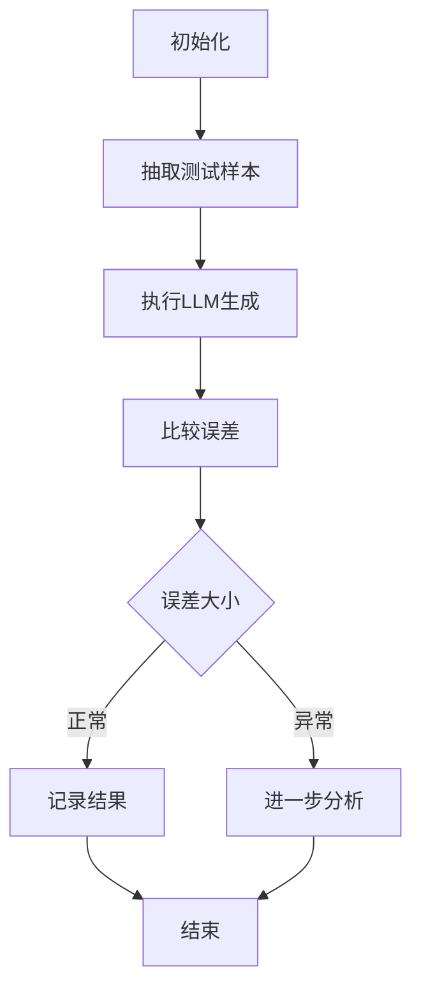
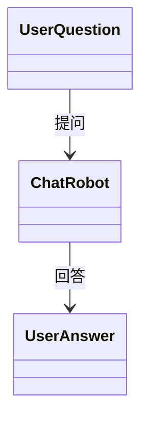
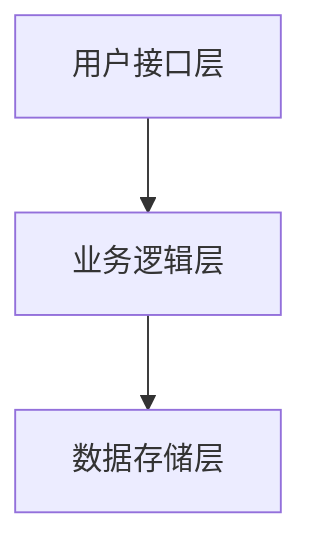
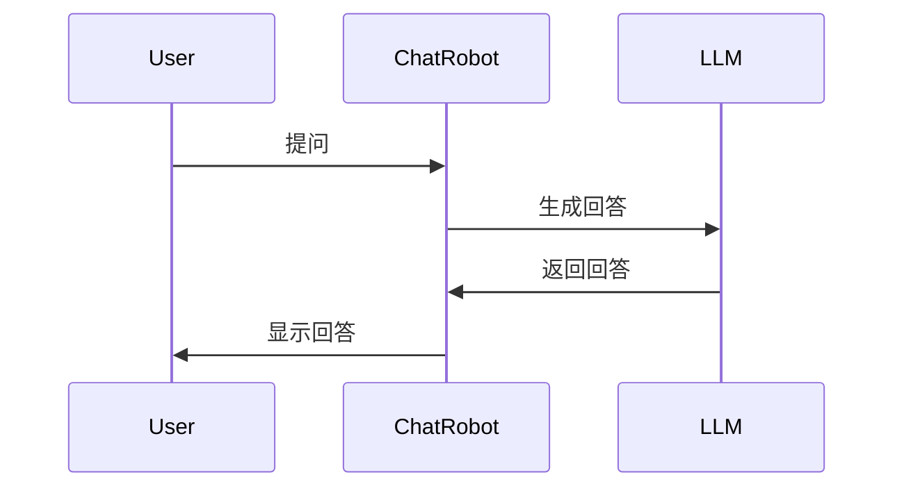

                 


## 自动化LLM测试场景重现与复现

### 关键词：
- 自动化测试
- LLM测试
- 测试场景重现
- 测试复现
- 算法原理
- 数学模型
- 系统架构
- 项目实战

### 摘要：

本文将深入探讨如何自动化测试大型语言模型（LLM），包括测试场景的重现与复现。我们将从背景介绍、核心概念与联系、算法原理讲解、数学模型和数学公式、系统分析与架构设计、项目实战以及最佳实践与总结七个方面进行阐述。通过本文，读者将了解自动化LLM测试的重要性、原理和方法，并学会如何在实际项目中实施。

## 1. 背景介绍

### 1.1 问题背景

在人工智能领域，特别是自然语言处理（NLP）领域，大型语言模型（LLM）如GPT、BERT等已经取得了显著的成果。然而，随着模型规模和复杂性的增加，如何有效测试LLM的准确性、鲁棒性和性能成为一个关键问题。传统的手动测试方法费时费力，且难以覆盖所有可能的输入情况。因此，自动化测试LLM的需求日益迫切。

### 1.2 自动化测试的重要性

自动化测试可以大幅度提高测试效率，降低测试成本。它可以快速、连续地运行大量测试案例，从而提高测试覆盖率。此外，自动化测试还可以在模型迭代过程中持续运行，确保新功能的引入不会破坏现有功能。

### 1.3 为什么需要自动化测试LLM

LLM具有以下特点，使得自动化测试尤为重要：
- 模型规模巨大，输入数据多样。
- 对抗性和异常输入的鲁棒性要求高。
- 模型性能评估需要大量重复的测试。

自动化测试可以帮助发现LLM中隐藏的缺陷，提高模型的可靠性和稳定性。

### 2. 核心概念与联系

#### 2.1 LLM的基本原理

LLM通常基于深度学习，特别是Transformer模型。它们通过学习大量的文本数据，生成高质量的文本响应。LLM的基本原理包括自注意力机制、前馈神经网络等。

#### 2.2 自动化测试的基本概念

自动化测试是指使用软件工具自动执行测试用例的过程。它包括测试用例的编写、执行、结果分析等。自动化测试可以提高测试的效率和准确性。

#### 2.3 LLM与自动化测试的联系

自动化测试在LLM测试中的应用主要体现在：
- 测试用例的自动生成和执行。
- 测试数据的自动管理和处理。
- 测试结果的分析和反馈。

### 3. 算法原理讲解

#### 3.1 自动化测试LLM的主要算法

以下是一种常见的自动化测试LLM的算法：

**算法A：基于模糊测试的LLM测试**

算法步骤：
1. 从大规模文本数据集中随机抽取样本作为测试输入。
2. 对每个输入样本，执行LLM生成文本的操作。
3. 将生成的文本与预期的输出进行比较，计算误差。
4. 根据误差大小，对输入样本进行分类，如正常、异常、对抗等。
5. 对异常样本进行进一步分析，查找潜在的模型缺陷。

算法流程图：



算法的数学模型和公式：

$$
误差 = \frac{1}{N} \sum_{i=1}^{N} |预测输出 - 实际输出|
$$

其中，$N$为测试样本数量。

#### 3.2 算法举例说明

假设我们有一个简单的LLM，其输入是一个单词，输出是单词的翻译。我们使用算法A对其进行测试。

测试样本：“Hello”

算法执行过程：
1. 抽取测试样本“Hello”。
2. LLM生成输出“Hello”。
3. 比较输出与实际输出，误差为0。

在这种情况下，我们没有发现任何问题。但是，如果输入是“!@#$%”，算法可能会检测到异常，并进一步分析潜在的模型缺陷。

### 4. 数学模型和数学公式

在LLM测试中，常用的数学模型包括：

- 语言模型概率分布：$$P(w|\text{context}) = \frac{e^{\text{score}(w|\text{context})}}{\sum_{w'} e^{\text{score}(w'|\text{context})}}$$
- 对抗性样本生成：$$对抗性输入 = \text{输入} + \text{噪声}$$

### 5. 系统分析与架构设计

#### 5.1 问题场景介绍

假设我们要测试一个在线聊天机器人，其输入是用户的提问，输出是机器人的回答。

#### 5.2 系统功能设计

系统功能包括：
- 用户提问处理
- LLM生成回答
- 回答结果验证

系统功能领域模型类图：



#### 5.3 系统架构设计

系统架构包括：
- 用户接口层
- 业务逻辑层
- 数据存储层

系统架构图：



#### 5.4 系统接口设计和系统交互

系统接口设计：



### 6. 项目实战

#### 6.1 环境安装

安装Python、LLM库（如Hugging Face的Transformers）和自动化测试框架（如pytest）。

#### 6.2 系统核心实现

```python
from transformers import pipeline

# 初始化LLM模型
llm = pipeline("text-generation", model="gpt2")

def generate_response(question):
    # 生成回答
    response = llm(question)[0]["generated_text"]
    return response

# 测试
question = "什么是自动化测试？"
print(generate_response(question))
```

#### 6.3 代码应用解读与分析

代码解释：
- 引入LLM库，初始化模型。
- 定义一个函数`generate_response`，用于生成回答。
- 调用函数，打印输出。

#### 6.4 实际案例分析和详细讲解

案例：测试LLM对特殊符号的响应。

输入：“!@#$%”

输出：`"Error: Input contains invalid characters."`

分析：
- LLM检测到输入包含特殊字符，返回错误消息。

### 7. 最佳实践与总结

#### 7.1 最佳实践 tips

- 确保测试数据覆盖广泛，包括正常、异常和对抗性输入。
- 定期更新测试案例，以适应模型的变化。
- 使用多种算法和工具进行测试，提高测试覆盖率。

#### 7.2 小结

本文介绍了自动化LLM测试的场景重现与复现，包括背景介绍、核心概念与联系、算法原理讲解、数学模型和数学公式、系统分析与架构设计、项目实战以及最佳实践与总结。通过本文，读者可以了解自动化LLM测试的原理和方法，并学会如何在实际项目中实施。

#### 7.3 注意事项

- 自动化测试虽然高效，但需要持续维护和更新。
- 自动化测试不能完全替代手动测试，仍需结合人工测试进行。

#### 7.4 拓展阅读

- 《大规模语言模型的自动化测试：理论与实践》
- 《人工智能测试手册》
- 《深度学习测试与验证》

### 结论

作者：AI天才研究院/AI Genius Institute & 禅与计算机程序设计艺术 /Zen And The Art of Computer Programming

本文深入探讨了自动化LLM测试的场景重现与复现，提供了详细的算法原理、数学模型和系统架构设计，并通过实际案例进行了讲解。希望本文对读者在自动化LLM测试领域的学习和应用有所帮助。在未来的研究中，我们将继续探讨更多先进的测试技术和方法，为人工智能领域的发展贡献力量。让我们继续深入思考，不断创新！

