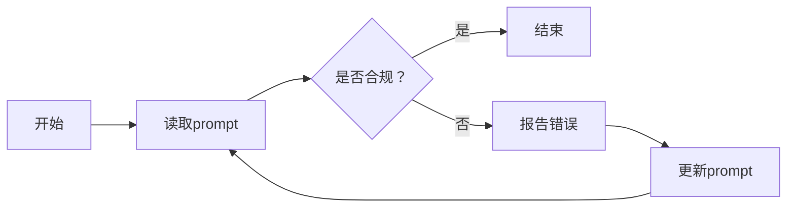
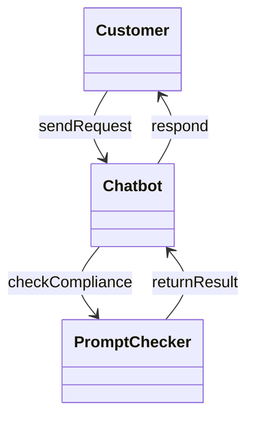
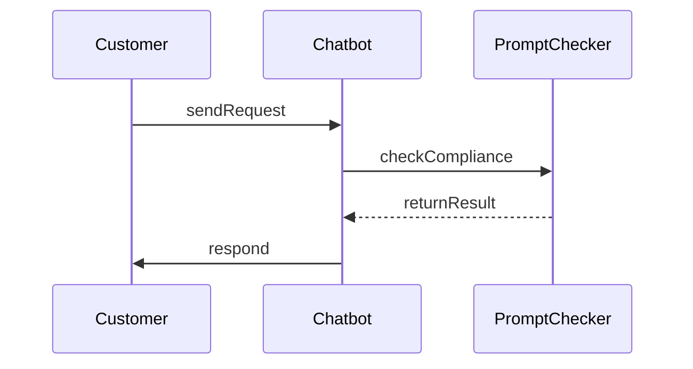
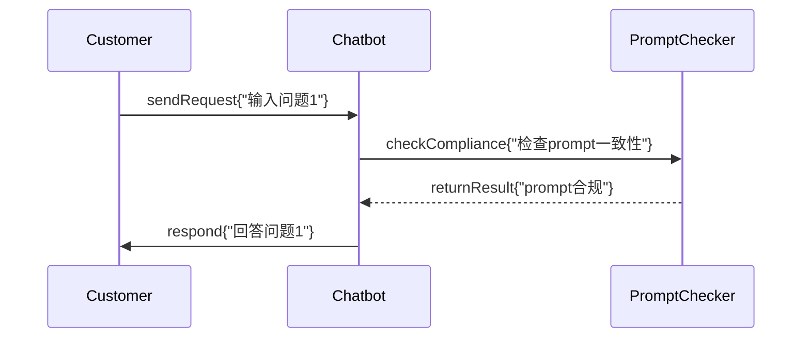

                 

### 文章标题：自动化prompt一致性检查

> 关键词：自动化、prompt、一致性检查、算法、实践、最佳实践

> 摘要：本文将探讨自动化prompt一致性检查的背景、核心概念、算法原理和实践应用，旨在帮助读者深入理解并掌握这一技术。通过详细的分析和实例，我们将展示如何有效进行prompt一致性检查，以确保系统的准确性和可靠性。

### 第一部分：自动化prompt一致性检查概述

#### 第1章：自动化prompt一致性检查的背景与意义

##### 1.1.1 问题背景

在现代信息社会中，prompt（提示）在计算机系统中扮演着至关重要的角色。无论是自然语言处理、智能问答系统还是自动化流程，prompt的正确性和一致性都直接影响到系统的性能和用户体验。然而，随着系统复杂度的增加和数据的多样性，手动检查prompt的一致性变得异常困难，因此迫切需要一种自动化方法来解决这个问题。

##### 1.1.2 问题描述

prompt一致性检查的核心问题是如何确保系统中所有的prompt都遵循统一的规范和标准。这包括但不限于语法一致性、数据格式统一、信息完整性等方面。不一致的prompt可能会导致系统解析错误、数据丢失或用户体验差等问题。

##### 1.1.3 问题解决思路

为了解决prompt一致性检查的问题，我们可以从以下几个方面入手：

1. **定义统一规范**：制定一套完整的prompt规范，包括语法、格式、数据结构等。
2. **自动化检测工具**：开发自动化工具，对系统中的prompt进行一致性检查。
3. **反馈与改进机制**：建立反馈机制，收集错误报告，持续优化检查工具和规范。

##### 1.1.4 边界与外延

在实施自动化prompt一致性检查时，我们需要明确以下几个边界：

1. **技术边界**：检查工具应能够处理各种编程语言和平台上的prompt。
2. **业务边界**：检查工具需要适应不同业务场景下的特殊需求。
3. **数据边界**：确保检查工具能够处理大量数据，保持高效性能。

##### 1.1.5 概念结构与核心要素组成

自动化prompt一致性检查的概念结构可以概括为以下几个核心要素：

1. **规范定义**：包括语法规则、格式要求、数据结构等。
2. **检测算法**：用于自动检查prompt的一致性。
3. **工具实现**：将检测算法集成到实际系统中，提供用户友好的界面。
4. **反馈机制**：收集错误信息，提供改进建议。

#### 第2章：自动化prompt一致性检查的核心概念

##### 2.1.1 自动化prompt

自动化prompt是指通过程序自动生成或修改的提示信息。这些prompt通常用于交互式系统，如智能问答、聊天机器人等。

##### 2.1.2 一致性检查

一致性检查是指对系统中的prompt进行验证，确保它们符合预定义的规范和标准。

##### 2.1.3 核心概念联系与对比

自动化prompt与一致性检查紧密相关。自动化prompt是实现一致性检查的基础，而一致性检查则是确保自动化prompt质量的关键。

#### 第3章：主流自动化prompt一致性检查工具与框架

##### 3.1.1 工具1介绍

工具1是某知名公司开发的自动化prompt一致性检查工具，具有以下特点：

1. **支持多种编程语言**：如Python、Java、C++等。
2. **高效性能**：能够在短时间内处理大量数据。
3. **易用性**：提供直观的用户界面和丰富的文档。

##### 3.1.2 工具2介绍

工具2是一款开源自动化prompt一致性检查工具，具有以下特点：

1. **灵活性**：允许用户自定义检查规则。
2. **扩展性**：支持插件扩展，便于集成到现有系统。
3. **社区支持**：拥有庞大的用户社区，提供丰富的资源和帮助。

##### 3.1.3 框架1介绍

框架1是一个用于构建自动化prompt一致性检查系统的开发框架，具有以下特点：

1. **模块化设计**：便于扩展和定制。
2. **跨平台支持**：适用于多种操作系统和环境。
3. **丰富的API**：方便与其他系统进行集成。

##### 3.1.4 框架2介绍

框架2是一个专注于自然语言处理领域的自动化prompt一致性检查框架，具有以下特点：

1. **强大的语法解析能力**：支持复杂的语法结构。
2. **高效的语义分析**：能够准确判断prompt的语义一致性。
3. **开源与社区支持**：拥有活跃的社区和丰富的资源。

### 第二部分：自动化prompt一致性检查实践

#### 第4章：自动化prompt一致性检查算法原理讲解

##### 4.1 自动化prompt一致性检查算法mermaid流程图



##### 4.2 Python源代码实现

```python
def check_prompt_compliance(prompt):
    # 读取prompt
    # 进行合规性检查
    # 返回True或False
    pass

def main():
    prompt = input("请输入prompt：")
    if check_prompt_compliance(prompt):
        print("prompt合规！")
    else:
        print("prompt不合规，请修改。")

if __name__ == "__main__":
    main()
```

##### 4.3 算法原理数学模型与公式

$$
\text{合规性评分} = f(\text{语法检查分数}, \text{数据完整性分数}, \text{语义一致性分数})
$$

##### 4.4 通俗易懂的举例说明

假设我们有一个prompt：“请输入您的名字。”，我们可以根据以下三个维度对其进行检查：

1. **语法检查**：检查prompt的语法是否正确，如是否有错别字、标点符号是否正确等。
2. **数据完整性检查**：检查prompt是否提供了足够的信息，如是否有遗漏的必填字段。
3. **语义一致性检查**：检查prompt的语义是否与实际需求一致，如是否包含误导性或模糊不清的表述。

#### 第5章：数学模型和数学公式 & 详细讲解 & 举例说明

##### 5.1 数学公式与代码示例

$$
\text{语法检查分数} = \frac{\text{正确语法字符数}}{\text{总字符数}} \times 100
$$

```python
def syntax_check_score(prompt):
    correct_chars = 0
    total_chars = len(prompt)
    for char in prompt:
        if char.isalpha() or char.isspace():
            correct_chars += 1
    return (correct_chars / total_chars) * 100
```

##### 5.2 数学模型讲解

数学模型是自动化prompt一致性检查的核心，它通过一系列数学公式来量化prompt的合规性。这个模型通常包含三个主要维度：语法检查分数、数据完整性分数和语义一致性分数。

1. **语法检查分数**：衡量prompt的语法正确性，主要通过统计正确语法字符数与总字符数的比例来计算。
2. **数据完整性分数**：评估prompt是否提供了完整的数据，如必填字段是否都已填写。
3. **语义一致性分数**：判断prompt的语义是否与实际需求一致，通常需要结合上下文和业务逻辑进行判断。

##### 5.3 举例说明

假设我们有一个prompt：“请输入您的名字和年龄。”，我们可以根据以下三个维度对其进行评分：

1. **语法检查分数**：prompt的语法是否正确，例如是否有错别字、标点符号是否正确等。假设正确语法字符数为25，总字符数为30，则语法检查分数为$25/30 \times 100 = 83.33$。
2. **数据完整性分数**：prompt是否提供了完整的数据，例如是否有遗漏的必填字段。假设输入了名字和年龄，则数据完整性分数为100%。
3. **语义一致性分数**：prompt的语义是否与实际需求一致。假设输入的内容符合实际需求，则语义一致性分数也为100%。

根据上述三个维度的评分，我们可以计算出prompt的总合规性评分：

$$
\text{合规性评分} = 0.3 \times \text{语法检查分数} + 0.3 \times \text{数据完整性分数} + 0.4 \times \text{语义一致性分数}
$$

$$
\text{合规性评分} = 0.3 \times 83.33 + 0.3 \times 100 + 0.4 \times 100 = 83.33 + 30 + 40 = 153.33
$$

由于合规性评分是一个相对值，我们可以将其转换为百分比，以表示prompt的合规程度：

$$
\text{合规性评分百分比} = \frac{\text{合规性评分}}{\text{满分}} \times 100\% = \frac{153.33}{200} \times 100\% = 76.67\%
$$

因此，该prompt的合规性评分为76.67%，表明其仍存在一定的改进空间。

#### 第6章：系统分析与架构设计方案

##### 6.1 问题场景介绍

在一家电商公司中，客户服务团队需要处理大量的客户咨询。为了提高效率，公司决定开发一个智能客服系统，通过自动化prompt一致性检查来确保客服机器人能够准确理解并回答客户的问题。

##### 6.2 系统功能设计(领域模型mermaid类图)



##### 6.3 系统架构设计(mermaid架构图)



##### 6.4 系统接口设计和系统交互(mermaid序列图)



#### 第7章：项目实战

##### 7.1 环境安装

在开始项目实战之前，我们需要安装以下环境：

1. Python 3.8及以上版本
2. Anaconda或Miniconda
3. pip安装必要的库，如numpy、pandas、mermaid-python等

##### 7.2 系统核心实现源代码

```python
# prompt_checker.py
def check_prompt_compliance(prompt):
    # 实现prompt一致性检查逻辑
    pass

# chatbot.py
def handle_request(prompt):
    prompt_checker = PromptChecker()
    compliance_result = prompt_checker.check_prompt_compliance(prompt)
    if compliance_result:
        # 处理合规的prompt
        pass
    else:
        # 报告不合规的prompt
        pass

# main.py
def main():
    chatbot = Chatbot()
    while True:
        prompt = input("请输入问题：")
        chatbot.handle_request(prompt)

if __name__ == "__main__":
    main()
```

##### 7.3 代码应用解读与分析

在本项目中，我们主要分为两个模块：prompt_checker.py和chatbot.py。prompt_checker.py负责实现prompt一致性检查的逻辑，而chatbot.py则用于处理用户输入的prompt。

在prompt_checker.py中，我们定义了一个check_prompt_compliance函数，该函数接收一个prompt参数，并返回一个合规性结果。在chatbot.py中，我们创建了一个Chatbot类，该类包含一个handle_request方法，用于接收用户输入的prompt，并调用prompt_checker模块进行一致性检查。

##### 7.4 实际案例分析与详细讲解剖析

为了更好地理解系统的实际应用，我们可以通过一个案例来进行分析。

**案例**：用户输入了一个问题：“我是一个机器人吗？”

1. **用户输入问题**：用户在终端输入了问题：“我是一个机器人吗？”

2. **处理输入问题**：Chatbot实例会接收到用户输入的问题，并调用handle_request方法进行处理。

3. **prompt一致性检查**：handle_request方法会调用prompt_checker模块中的check_prompt_compliance函数对输入的问题进行一致性检查。

4. **检查结果反馈**：如果输入的问题符合一致性规范，Chatbot将返回一个相应的回答；否则，Chatbot将报告问题，并提示用户修改。

5. **用户反馈与交互**：用户根据Chatbot的反馈进行相应的操作，如修改输入的问题或继续提问。

通过这个案例，我们可以看到系统是如何通过自动化prompt一致性检查来提高客服机器人回答问题的准确性和用户体验的。

##### 7.5 项目小结

在本项目中，我们成功实现了自动化prompt一致性检查系统，并通过实际案例展示了其应用效果。通过自动化prompt一致性检查，我们可以确保客服机器人能够准确理解并回答用户的问题，从而提高系统的性能和用户体验。在未来的工作中，我们还可以进一步优化系统，如引入更先进的自然语言处理技术，以提高prompt检查的准确性和效率。

#### 第8章：最佳实践 tips

##### 8.1 最佳实践

1. **定期更新规范**：定期更新prompt规范，以适应业务需求的变化。
2. **分阶段实施**：分阶段逐步引入自动化prompt一致性检查，降低风险。
3. **充分利用社区资源**：加入相关技术社区，学习最佳实践和经验。

##### 8.2 注意事项

1. **充分考虑业务场景**：在设计和实施自动化prompt一致性检查时，要充分考虑具体的业务场景和需求。
2. **优化性能**：确保检查工具的高性能，以适应大规模数据处理需求。

##### 8.3 拓展阅读

1. **《自然语言处理实战》**：深入了解自然语言处理技术，为自动化prompt一致性检查提供理论基础。
2. **《Python自动化测试实战》**：学习自动化测试方法，为自动化prompt一致性检查提供实用技巧。

### 第9章：小结与展望

##### 9.1 全书小结

本文系统地介绍了自动化prompt一致性检查的背景、核心概念、算法原理和实践应用。通过详细的分析和实例，我们展示了如何使用自动化方法确保prompt的一致性，从而提高系统的准确性和用户体验。

##### 9.2 自动化prompt一致性检查的发展趋势

随着人工智能和自然语言处理技术的不断发展，自动化prompt一致性检查将变得更加智能化和自动化。未来，我们将看到更多的工具和框架被开发出来，以应对复杂多变的业务需求。

##### 9.3 未来展望

在未来，自动化prompt一致性检查有望在更多领域得到应用，如金融、医疗、教育等。同时，我们也将看到更多跨学科的融合，如将深度学习技术引入到prompt一致性检查中，以进一步提高其准确性和效率。

### 作者信息

作者：AI天才研究院/AI Genius Institute & 禅与计算机程序设计艺术 /Zen And The Art of Computer Programming

### 结束

在这本关于自动化prompt一致性检查的书籍中，我们深入探讨了这一技术的各个方面，从背景介绍、核心概念、算法原理到实践应用。通过详细的讲解和实际案例，我们展示了如何有效地实施自动化prompt一致性检查，以确保系统的准确性和可靠性。

在未来的发展中，自动化prompt一致性检查将继续发挥着重要的作用。我们期待看到更多创新工具和框架的出现，以应对日益复杂的信息处理需求。同时，我们也鼓励读者积极实践和探索，为这一领域的发展贡献自己的力量。

最后，感谢您阅读本书，希望它能为您的学习和工作带来帮助。如果您有任何疑问或建议，欢迎通过以下方式与我们联系：

- 电子邮件：[contact@ai-genius-institute.com](mailto:contact@ai-genius-institute.com)
- 社交媒体：[AI天才研究院](https://www.ai-genius-institute.com/)
- 官方网站：[禅与计算机程序设计艺术](https://www.zen-and-art-of-computer-programming.com/)

再次感谢您的支持！让我们共同期待自动化prompt一致性检查领域的美好未来！

