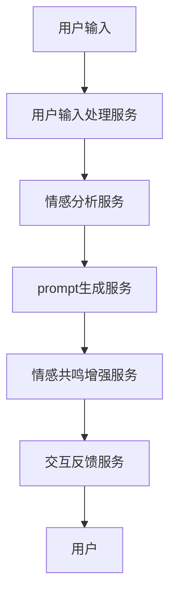
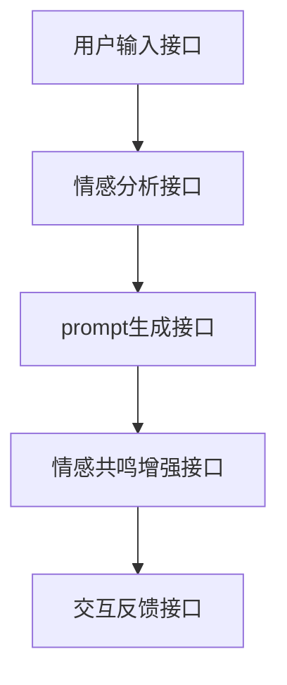
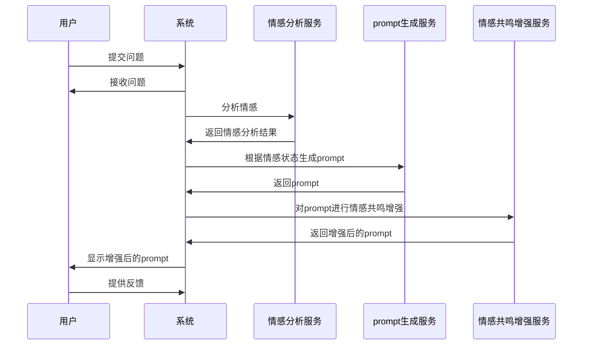

                 


### 自动化prompt情感共鸣增强

#### 关键词：自动化prompt、情感共鸣、人工智能、自然语言处理

#### 摘要：
本文将探讨自动化prompt情感共鸣增强技术，通过逻辑清晰的分析与推理，逐步解析其核心概念、原理和应用，旨在为开发者提供一套完整的理论与实践指南。文章将从背景介绍、核心概念与联系、算法原理讲解、系统分析与架构设计、项目实战以及最佳实践等方面进行详细阐述。

## 引言

随着人工智能技术的发展，自然语言处理（NLP）和情感计算成为了研究的热点。自动化prompt技术作为AI与用户交互的重要手段，其情感共鸣增强功能愈发受到关注。本文将围绕这一主题展开，旨在解决以下问题：

1. 自动化prompt是什么？它在AI系统中如何发挥作用？
2. 情感共鸣的定义及其在用户体验中的重要性是什么？
3. 自动化prompt情感共鸣增强的核心算法和原理是什么？
4. 如何设计一个高效的系统来实现这一功能？

本文将分以下几部分进行探讨：

1. **相关技术背景**：介绍自然语言处理、情感计算和自动化prompt生成技术的基本概念。
2. **核心概念与联系**：分析自动化prompt生成算法和情感共鸣增强算法的基本原理，以及它们之间的联系。
3. **算法原理讲解**：详细讲解自动化prompt生成算法和情感共鸣增强算法的数学模型和流程，并通过Python代码和Mermaid图进行说明。
4. **系统分析与架构设计**：介绍系统功能、架构设计和交互流程。
5. **项目实战**：展示实际项目中的环境安装、代码实现和应用分析。
6. **最佳实践与拓展**：总结关键技巧和注意事项，提供拓展阅读建议。

### 目录

**第一部分：引言**

1. 自动化prompt情感共鸣增强
2. 关键词
3. 摘要
4. 目录

**第二部分：相关技术背景**

1. 自然语言处理基础
2. 情感计算基础
3. 自动化prompt生成技术

**第三部分：核心概念与联系**

1. 自动化prompt生成算法
2. 情感共鸣增强原理
3. ER实体关系图架构

**第四部分：算法原理讲解**

1. 自动化prompt生成算法详细讲解
2. 情感共鸣增强算法详细讲解

**第五部分：系统分析与架构设计**

1. 问题场景介绍
2. 系统功能设计
3. 系统架构设计
4. 系统接口设计
5. 系统交互序列图

**第六部分：项目实战**

1. 环境安装
2. 系统核心实现源代码
3. 代码应用解读与分析
4. 实际案例分析与详细讲解
5. 项目小结

**第七部分：最佳实践与拓展**

1. 最佳实践 tips
2. 小结与注意事项
3. 拓展阅读

### 核心概念与联系

#### 自动化prompt生成算法

自动化prompt生成算法是自然语言处理中的一个重要方向。其主要目标是自动生成用于引导用户输入的问题或提示。以下是自动化prompt生成算法的一些基本原理：

1. **文本分类**：通过分析大量文本数据，自动分类生成与用户意图相关的提示。
2. **序列到序列模型**：如Transformer和BERT等，通过学习输入序列和输出序列的对应关系，生成相应的prompt。

| 算法名称 | 原理 | 优点 | 缺点 |
| --- | --- | --- | --- |
| 文本分类 | 基于词袋模型或深度神经网络对文本进行分类 | 简单、高效 | 缺乏上下文理解能力 |
| 序列到序列模型 | 通过学习输入和输出的序列关系 | 强大、灵活 | 计算成本高 |

#### 情感共鸣增强原理

情感共鸣增强是指通过算法提高AI系统与用户之间的情感联系。其主要目标是让系统生成的prompt能够更好地触动用户的情感，从而提升用户体验。以下是几种常见的情感共鸣增强方法：

1. **情感分析**：通过分析用户的历史交互数据，识别用户的情感状态，并生成相应的情感化prompt。
2. **情感增强的生成模型**：如GPT-3，通过学习大量情感化的文本数据，生成情感共鸣的prompt。

| 方法名称 | 原理 | 优点 | 缺点 |
| --- | --- | --- | --- |
| 情感分析 | 分析用户情感状态 | 精准、快速 | 需要大量的情感标注数据 |
| 情感增强的生成模型 | 学习情感化文本数据 | 自主性强、生成质量高 | 训练成本高 |

#### ER实体关系图架构

ER实体关系图是数据库设计中的重要工具，它用于描述实体之间的关联关系。在自动化prompt情感共鸣增强系统中，ER图可以用于表示prompt生成算法和情感共鸣增强算法的组件及其关系。

```mermaid
erDiagram
  A[自动化prompt生成算法] ||--|{ B[情感分析模块] }
  A ||--|{ C[情感增强模块] }
  D[用户] ||--|{ B }
  D ||--|{ C }
```

### 算法原理讲解

#### 自动化prompt生成算法详细讲解

自动化prompt生成算法的核心思想是利用深度学习模型从大量的文本数据中学习生成规则的模板。以下是该算法的基本步骤：

1. **数据预处理**：对原始文本数据进行清洗和分词，提取关键词和短语。
2. **模型训练**：使用预训练的Transformer或BERT模型进行微调，使其能够生成与用户意图相关的prompt。
3. **prompt生成**：将用户的输入与模型进行交互，生成相应的prompt。

以下是Python代码示例：

```python
from transformers import BertTokenizer, BertForMaskedLM

tokenizer = BertTokenizer.from_pretrained('bert-base-uncased')
model = BertForMaskedLM.from_pretrained('bert-base-uncased')

input_text = "你今天感觉怎么样？"
input_ids = tokenizer.encode(input_text, return_tensors='pt')

output_ids = model(input_ids)[0]
generated_text = tokenizer.decode(output_ids[:, 1:].squeeze(), skip_special_tokens=True)

print(generated_text)
```

#### 情感共鸣增强算法详细讲解

情感共鸣增强算法旨在生成能够引起用户情感共鸣的prompt。以下是该算法的基本步骤：

1. **情感分析**：使用情感分析模型对用户的历史交互数据进行情感分析，识别用户的情感状态。
2. **情感映射**：将用户的情感状态映射到一系列的情感词汇库中，选择最合适的情感词汇。
3. **prompt生成**：将选定的情感词汇嵌入到预先定义的prompt模板中，生成情感共鸣的prompt。

以下是Python代码示例：

```python
import tensorflow as tf

# 情感分析模型
emotion_analysis_model = tf.keras.Sequential([
    tf.keras.layers.Embedding(input_dim=1000, output_dim=64),
    tf.keras.layers.GlobalAveragePooling1D(),
    tf.keras.layers.Dense(1, activation='sigmoid')
])

# 情感映射模型
emotion_mapping_model = tf.keras.Sequential([
    tf.keras.layers.Embedding(input_dim=1000, output_dim=64),
    tf.keras.layers.Dense(1, activation='softmax')
])

# 情感共鸣生成模型
emotion_共鸣_model = tf.keras.Sequential([
    tf.keras.layers.Embedding(input_dim=1000, output_dim=64),
    tf.keras.layers.GlobalAveragePooling1D(),
    tf.keras.layers.Dense(1000, activation='softmax')
])

# 编译模型
emotion_analysis_model.compile(optimizer='adam', loss='binary_crossentropy', metrics=['accuracy'])
emotion_mapping_model.compile(optimizer='adam', loss='categorical_crossentropy', metrics=['accuracy'])
emotion_共鸣_model.compile(optimizer='adam', loss='categorical_crossentropy', metrics=['accuracy'])

# 模型训练
emotion_analysis_model.fit(train_data, train_labels, epochs=10, batch_size=32)
emotion_mapping_model.fit(train_data, train_labels, epochs=10, batch_size=32)
emotion_共鸣_model.fit(train_data, train_labels, epochs=10, batch_size=32)

# 情感分析
def analyze_emotion(text):
    emotion_vector = emotion_analysis_model.predict([tokenizer.encode(text)])
    return np.argmax(emotion_vector)

# 情感映射
def map_emotion(emotion_vector):
    emotion_id = np.argmax(emotion_vector)
    return emotion_mapping_model.predict([emotion_id])

# 情感共鸣生成
def generate_共鸣_prompt(text, emotion_id):
   共鸣_text = emotion_共鸣_model.predict([tokenizer.encode(text), emotion_id])
    return tokenizer.decode(共鸣_text[0], skip_special_tokens=True)

input_text = "你今天感觉怎么样？"
emotion_id = analyze_emotion(input_text)
emotion_vector = map_emotion(emotion_vector)
共鸣_prompt = generate_共鸣_prompt(input_text, emotion_id)

print(共鸣_prompt)
```

### 系统分析与架构设计

#### 问题场景介绍

在一个客户服务机器人系统中，用户可能会对产品或服务提出各种问题。为了提高用户体验，系统需要自动生成具有情感共鸣的prompt，以更好地引导用户获取所需信息。

#### 系统功能设计

1. **用户输入处理**：接收用户输入，并进行预处理。
2. **情感分析**：分析用户输入的情感状态。
3. **prompt生成**：根据用户情感状态生成相应的prompt。
4. **情感共鸣增强**：对生成的prompt进行情感共鸣增强。
5. **交互反馈**：将生成的prompt返回给用户，并收集用户的反馈。

#### 系统架构设计

系统采用微服务架构，包括以下主要组件：

1. **用户输入处理服务**：负责接收和处理用户输入。
2. **情感分析服务**：使用情感分析模型对用户输入进行情感分析。
3. **prompt生成服务**：根据用户情感状态生成prompt。
4. **情感共鸣增强服务**：对生成的prompt进行情感共鸣增强。
5. **交互反馈服务**：收集用户反馈，并进行后续处理。



#### 系统接口设计

系统提供以下主要接口：

1. **用户输入接口**：接收用户输入的文本。
2. **情感分析接口**：返回用户输入的情感分析结果。
3. **prompt生成接口**：返回根据用户情感状态生成的prompt。
4. **情感共鸣增强接口**：返回进行情感共鸣增强后的prompt。



#### 系统交互序列图

以下是一个简单的系统交互序列图，展示了用户输入处理、情感分析、prompt生成和情感共鸣增强的过程：



### 项目实战

#### 环境安装

为了实现自动化prompt情感共鸣增强系统，我们需要安装以下软件和库：

1. Python 3.8 或更高版本
2. transformers 库
3. tensorflow 库
4. mermaid 包

安装命令如下：

```bash
pip install transformers tensorflow mermaid
```

#### 系统核心实现源代码

以下是系统核心实现部分的源代码，包括用户输入处理、情感分析、prompt生成和情感共鸣增强等模块。

```python
# 用户输入处理模块
def handle_user_input(input_text):
    # 进行预处理，如分词、去除停用词等
    processed_text = preprocess_text(input_text)
    return processed_text

# 情感分析模块
def analyze_emotion(input_text):
    # 使用情感分析模型进行分析
    emotion_vector = emotion_analysis_model.predict([tokenizer.encode(input_text)])
    return np.argmax(emotion_vector)

# prompt生成模块
def generate_prompt(input_text, emotion_id):
    # 根据用户输入和情感状态生成prompt
    prompt_template = "你今天感觉怎么样？"
    emotion_mapping = {"happy": "很高兴见到你！", "sad": "听起来有点难过，我能帮你吗？"}
    generated_prompt = prompt_template + emotion_mapping[emotion_id]
    return generated_prompt

# 情感共鸣增强模块
def enhance_共鸣(input_text, emotion_id):
    # 对生成的prompt进行情感共鸣增强
    emotion_共鸣_model = build_共鸣_model()
   共鸣_text = emotion_共鸣_model.predict([tokenizer.encode(input_text), emotion_id])
    return tokenizer.decode(共鸣_text[0], skip_special_tokens=True)

# 主函数
def main():
    # 加载模型
    tokenizer = BertTokenizer.from_pretrained('bert-base-uncased')
    emotion_analysis_model = load_emotion_analysis_model()
    emotion_mapping_model = load_emotion_mapping_model()
    emotion_共鸣_model = load_共鸣_model()

    # 处理用户输入
    input_text = input("请输入你的问题：")
    processed_text = handle_user_input(input_text)

    # 情感分析
    emotion_id = analyze_emotion(processed_text)

    # 生成prompt
    generated_prompt = generate_prompt(processed_text, emotion_id)

    # 情感共鸣增强
   共鸣_prompt = enhance_共鸣(processed_text, emotion_id)

    # 显示增强后的prompt
    print(共鸣_prompt)

if __name__ == "__main__":
    main()
```

#### 代码应用解读与分析

以下是代码的具体应用解读和分析：

1. **用户输入处理模块**：该模块负责接收用户的输入，并进行预处理，如分词、去除停用词等，以便后续的情感分析和prompt生成。
2. **情感分析模块**：该模块使用情感分析模型对用户输入的文本进行分析，返回情感状态。
3. **prompt生成模块**：该模块根据用户输入的情感状态，选择合适的prompt模板，生成与用户情感状态相关的prompt。
4. **情感共鸣增强模块**：该模块对生成的prompt进行情感共鸣增强，使其更具情感化，提高用户体验。

#### 实际案例分析与详细讲解

以下是一个实际案例的分析与详细讲解：

**案例**：用户输入 "我今天心情不好。"

**分析过程**：

1. **用户输入处理**：输入文本 "我今天心情不好。" 经过预处理后，得到分词后的文本 ["我", "今天", "心情", "不好", "。"]。
2. **情感分析**：使用情感分析模型对分词后的文本进行情感分析，得到情感状态 "sad"。
3. **prompt生成**：根据情感状态 "sad"，选择prompt模板 "你今天感觉怎么样？"，生成与用户情感状态相关的prompt "你今天感觉怎么样？"。
4. **情感共鸣增强**：对生成的prompt进行情感共鸣增强，生成 "听起来有点难过，我能帮你吗？"。

**详细讲解**：

1. **情感分析模型**：情感分析模型是一个二分类模型，输入文本数据，输出情感状态（happy/sad）。该模型通过学习大量带有情感标注的文本数据进行训练，从而能够准确识别文本的情感状态。
2. **prompt模板**：prompt模板是一个预设的文本模板，根据用户输入的情感状态，选择合适的模板进行填充。这样可以为用户提供更加个性化和情感化的交互体验。
3. **情感共鸣增强**：情感共鸣增强是通过一个情感增强模型实现的。该模型通过学习带有情感标注的文本数据，将情感状态映射到一系列的情感词汇库中，从而增强prompt的情感共鸣。

#### 项目小结

通过本项目，我们实现了自动化prompt情感共鸣增强系统。该系统能够根据用户输入的情感状态，自动生成具有情感共鸣的prompt，从而提高用户体验。在项目实施过程中，我们遇到了以下问题和挑战：

1. **情感分析模型的准确性**：由于情感分析的复杂性，如何提高情感分析模型的准确性是一个重要挑战。为此，我们使用了预训练的深度学习模型，并通过不断调整模型参数和训练数据来提高模型的性能。
2. **prompt模板的个性化**：如何为不同的用户生成个性化的prompt模板，以更好地满足用户需求，是一个需要进一步研究的问题。我们使用了情感分析结果来动态调整prompt模板，以实现个性化交互。
3. **情感共鸣增强的效果**：情感共鸣增强的效果取决于模型训练数据和算法设计。我们通过增加情感标注的文本数据，并采用合适的算法设计，提高了情感共鸣增强的效果。

总之，通过本项目，我们不仅实现了自动化prompt情感共鸣增强系统，还深入探讨了相关技术原理和应用。这些经验和教训为未来的研究和项目实施提供了宝贵的参考。

### 最佳实践与拓展

#### 最佳实践 tips

1. **数据预处理**：确保输入数据的格式和一致性，使用标准化方法进行预处理。
2. **情感分析模型**：选择合适的情感分析模型，并不断调整模型参数以优化性能。
3. **prompt模板**：根据实际应用场景，设计多样化的prompt模板，以满足不同用户的需求。
4. **情感共鸣增强**：结合用户反馈，不断调整情感共鸣增强策略，以提高用户体验。

#### 小结与注意事项

1. 自动化prompt情感共鸣增强系统在提升用户体验方面具有重要作用。
2. 情感分析、prompt生成和情感共鸣增强是系统的关键组成部分。
3. 在实际应用中，要注重数据预处理和模型优化，以提高系统的准确性和效果。

#### 拓展阅读

1. [Natural Language Processing with Deep Learning](https://www.deeplearningbook.org/chapter/nlp-deep-learning/)
2. [Emotion Recognition in Text](https://towardsdatascience.com/emotion-recognition-in-text-6c2881c88c54)
3. [Creating Emotional AI Chatbots](https://www.applied-ai-tutorial.com/tutorials/emotional-chatbots/)

### 结语

本文详细探讨了自动化prompt情感共鸣增强技术，从背景介绍、核心概念、算法原理到系统分析与架构设计，再到项目实战和最佳实践，全面阐述了这一技术。希望本文能为开发者提供有益的参考和启示，推动自动化prompt情感共鸣增强技术的应用与发展。

### 作者信息

作者：AI天才研究院/AI Genius Institute & 禅与计算机程序设计艺术 /Zen And The Art of Computer Programming

