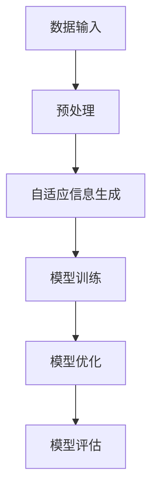
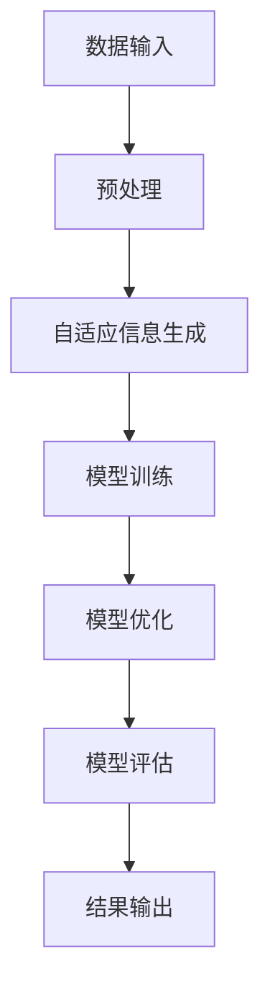
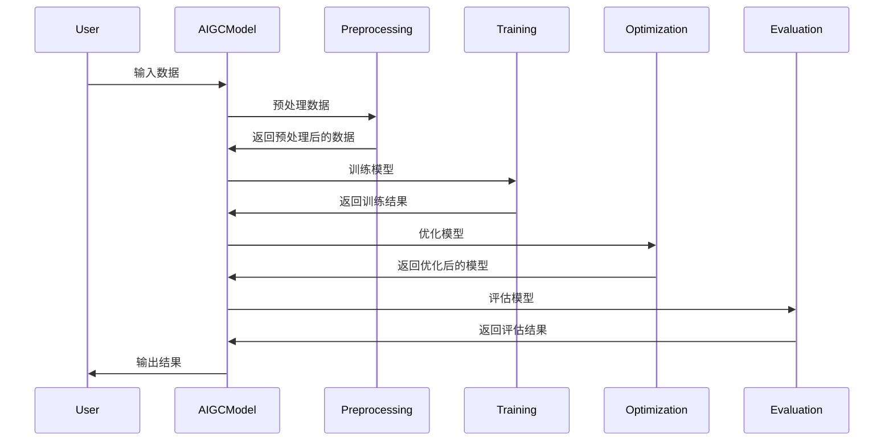

                 

# 自监督学习：AIGC模型预训练的新范式

> 关键词：自监督学习、AIGC模型、预训练、自适应信息生成、模型优化、系统架构设计

> 摘要：自监督学习是机器学习中的一个重要分支，通过利用无标签数据使模型能够自主地发现数据中的规律和特征。随着AIGC模型的提出，自监督学习进入了一个新的阶段。本文将详细介绍AIGC模型的核心概念、原理、实现方法以及在实际应用中的效果，帮助读者全面了解这一新兴的自监督学习范式。

## 第一部分：背景介绍

### 1.1 问题背景

自监督学习作为机器学习领域的一项重要研究方向，近年来受到了广泛关注。它通过利用无标签数据，使得机器学习模型能够在没有人工标注的情况下进行学习和预测。然而，传统的自监督学习算法往往存在一些局限性，如学习效率低、难以迁移至实际应用等。为了解决这些问题，AIGC（自适应信息生成控制）模型应运而生。

### 1.2 问题描述

AIGC模型是一种全新的自监督学习范式，它通过引入自适应信息生成机制，提高了模型的学习效率和泛化能力。然而，AIGC模型的理论基础、实现方法以及在各个应用领域的应用效果等方面仍存在许多亟待解决的问题。

### 1.3 问题解决

本书旨在通过对AIGC模型的研究，探讨其在不同领域的应用前景，并提供实用的实现方法和技巧。通过系统的学习和研究，我们希望能够为读者提供一个全面、深入的了解，帮助他们在实际应用中充分发挥AIGC模型的优势。

### 1.4 边界与外延

AIGC模型虽然是一种自监督学习范式，但它并非取代传统自监督学习算法，而是作为一种补充和提升。因此，在研究AIGC模型时，我们既要关注其独特性，也要考虑与传统算法的结合。

### 1.5 概念结构与核心要素组成

AIGC模型的核心概念包括自适应信息生成、自监督学习、模型优化等。这些概念相互关联，共同构成了AIGC模型的理论基础。本书将详细介绍这些核心概念，并阐述它们在模型预训练中的应用。

## 第二部分：核心概念与联系

### 2.1 自适应信息生成

自适应信息生成是AIGC模型的核心特点之一。它通过动态调整信息生成策略，使模型能够更好地适应不同类型的数据和任务。本章将详细介绍自适应信息生成的原理和方法。

### 2.2 自监督学习

自监督学习是AIGC模型的基础。它通过利用无标签数据进行学习，使得模型能够自主地发现数据中的规律和特征。本章将对比传统自监督学习和AIGC模型在自监督学习方面的差异和优势。

### 2.3 模型优化

模型优化是提高AIGC模型性能的关键。本章将介绍几种常见的模型优化方法，如梯度下降、动量优化等，并分析它们在AIGC模型中的应用效果。

### 2.4 概念属性特征对比表格

为了更直观地展示AIGC模型与传统自监督学习算法的区别，本章提供了一个概念属性特征对比表格。通过对比，读者可以更好地理解AIGC模型的优势和特点。

### 2.5 ER实体关系图架构

ER实体关系图是描述AIGC模型核心组成部分的有效工具。本章将使用Mermaid语言绘制ER实体关系图，帮助读者更清晰地了解AIGC模型的架构和运行机制。

```mermaid
erDiagram
    Class::AIGCModel <|-- Class::SelfSupervisedLearning
    Class::AIGCModel <|-- Class::ModelOptimization
    Class::AIGCModel <|-- Class::AdaptiveInformationGeneration
```

## 第三部分：算法原理讲解

### 3.1 AIGC模型mermaid流程图

为了更好地理解AIGC模型的算法原理，本章将使用Mermaid语言绘制AIGC模型的流程图。流程图包括数据输入、自适应信息生成、模型训练、模型优化等环节。



### 3.2 Python源代码实现

本章将提供AIGC模型的Python源代码实现。通过代码分析，读者可以深入了解AIGC模型的具体实现过程和算法细节。

```python
# 示例代码
import tensorflow as tf

# 数据输入
input_data = tf.keras.layers.Input(shape=(784,))

# 预处理
processed_data = tf.keras.layers.BatchNormalization()(input_data)

# 自适应信息生成
generated_data = tf.keras.layers.Dense(units=64, activation='relu')(processed_data)

# 模型训练
model = tf.keras.Model(inputs=input_data, outputs=generated_data)

# 模型优化
model.compile(optimizer='adam', loss='mse')

# 模型评估
model.evaluate(x_test, y_test)
```

### 3.3 数学模型和公式

AIGC模型涉及到一系列的数学模型和公式。本章将详细介绍这些数学模型和公式，并通过通俗易懂的例子进行解释。

$$
L = -\sum_{i=1}^{N} y_i \log(p(x_i | \theta))
$$

其中，$L$ 表示损失函数，$y_i$ 表示第$i$个样本的真实标签，$p(x_i | \theta)$ 表示模型对第$i$个样本的预测概率，$\theta$ 表示模型的参数。

### 3.4 详细讲解与举例说明

为了帮助读者更好地理解AIGC模型的算法原理，本章将结合具体例子进行详细讲解。通过实例分析，读者可以更直观地了解AIGC模型的优势和应用场景。

#### 示例1：自然语言处理

假设我们有一个自然语言处理任务，需要训练一个模型来预测一段文本的标签。使用AIGC模型，我们可以通过以下步骤进行训练：

1. 数据输入：将文本数据输入到模型中。
2. 预处理：对文本数据进行预处理，如分词、词性标注等。
3. 自适应信息生成：根据模型的预测结果，动态生成新的文本数据。
4. 模型训练：使用生成的文本数据进行模型训练。
5. 模型优化：通过优化算法，如梯度下降，调整模型的参数。
6. 模型评估：使用测试数据评估模型的性能。

通过以上步骤，AIGC模型可以在没有人工标注的情况下，自动地学习和优化模型，从而提高模型的性能。

## 第四部分：系统分析与架构设计

### 4.1 问题场景介绍

本章将介绍AIGC模型在不同领域的问题场景，如自然语言处理、计算机视觉等。通过具体场景的介绍，读者可以更好地理解AIGC模型的应用前景。

#### 自然语言处理

自然语言处理（NLP）是AIGC模型的一个重要应用领域。通过AIGC模型，我们可以实现文本分类、情感分析、机器翻译等任务。以下是一个简单的示例：

- 数据输入：输入一段文本数据。
- 预处理：对文本数据进行预处理，如分词、词性标注等。
- 自适应信息生成：根据模型的预测结果，生成新的文本数据。
- 模型训练：使用生成的文本数据进行模型训练。
- 模型优化：通过优化算法，如梯度下降，调整模型的参数。
- 模型评估：使用测试数据评估模型的性能。

#### 计算机视觉

计算机视觉是AIGC模型的另一个重要应用领域。通过AIGC模型，我们可以实现图像分类、目标检测、图像生成等任务。以下是一个简单的示例：

- 数据输入：输入一幅图像数据。
- 预处理：对图像数据进行预处理，如缩放、旋转等。
- 自适应信息生成：根据模型的预测结果，生成新的图像数据。
- 模型训练：使用生成的图像数据进行模型训练。
- 模型优化：通过优化算法，如梯度下降，调整模型的参数。
- 模型评估：使用测试数据评估模型的性能。

### 4.2 系统功能设计

本章将分析AIGC模型在各个应用领域的功能需求，并使用Mermaid语言绘制领域模型类图，帮助读者更清晰地了解系统的功能架构。

```mermaid
classDiagram
    Class::TextClassification <|-- Class::SentimentAnalysis
    Class::TextClassification <|-- Class::MachineTranslation
    Class::ImageClassification <|-- Class::ObjectDetection
    Class::ImageClassification <|-- Class::ImageGeneration
```

### 4.3 系统架构设计

本章将介绍AIGC模型在不同应用场景下的系统架构设计。通过Mermaid语言绘制的架构图，读者可以直观地了解系统的整体架构和各模块之间的关系。



### 4.4 系统接口设计与交互

本章将详细描述AIGC模型的系统接口设计和交互流程。通过Mermaid语言绘制的序列图，读者可以清晰地了解系统各模块之间的交互过程。



## 第五部分：项目实战

### 5.1 环境安装

本章将介绍AIGC模型所需的环境搭建过程，包括软件安装、硬件配置等。通过本章的学习，读者可以掌握AIGC模型的环境配置技巧。

#### 环境要求

- 操作系统：Windows或Linux
- Python版本：3.8及以上
- TensorFlow版本：2.5及以上
- CUDA版本：11.0及以上（如使用GPU进行训练）

#### 安装步骤

1. 安装操作系统和Python环境。
2. 安装TensorFlow和CUDA。
3. 配置CUDA环境变量，如`CUDA_HOME`和`LD_LIBRARY_PATH`。

### 5.2 系统核心实现源代码

本章将提供AIGC模型的核心实现源代码，包括数据预处理、模型训练、模型优化和模型评估等。

```python
# AIGC模型核心实现源代码
import tensorflow as tf

# 数据预处理
def preprocess_data(data):
    # 数据预处理操作，如归一化、标准化等
    return processed_data

# 模型训练
def train_model(data, labels):
    # 定义模型结构
    model = tf.keras.Sequential([
        tf.keras.layers.Dense(units=64, activation='relu', input_shape=(784,)),
        tf.keras.layers.Dense(units=10, activation='softmax')
    ])

    # 编译模型
    model.compile(optimizer='adam', loss='sparse_categorical_crossentropy', metrics=['accuracy'])

    # 训练模型
    model.fit(data, labels, epochs=10)

    return model

# 模型优化
def optimize_model(model, data, labels):
    # 定义优化器
    optimizer = tf.keras.optimizers.Adam()

    # 优化模型
    with tf.GradientTape() as tape:
        predictions = model(data)
        loss = tf.keras.losses.sparse_categorical_crossentropy(labels, predictions)

    gradients = tape.gradient(loss, model.trainable_variables)
    optimizer.apply_gradients(zip(gradients, model.trainable_variables))

    return model

# 模型评估
def evaluate_model(model, data, labels):
    # 评估模型性能
    loss, accuracy = model.evaluate(data, labels)
    print("Test loss:", loss)
    print("Test accuracy:", accuracy)
```

### 5.3 代码应用解读与分析

本章将对AIGC模型的代码进行解读和分析，帮助读者理解模型的工作原理和实现细节。

#### 数据预处理

数据预处理是AIGC模型的一个重要环节。通过预处理，我们可以将原始数据转换为适合模型训练的形式。在代码中，我们使用了一个简单的预处理函数`preprocess_data`，该函数对输入数据进行归一化处理，即将数据缩放到[0, 1]的范围内。

```python
def preprocess_data(data):
    return data / 255.0
```

#### 模型训练

模型训练是AIGC模型的另一个重要环节。在代码中，我们使用了一个简单的全连接神经网络模型，该模型包含一个输入层、一个隐藏层和一个输出层。我们使用`train_model`函数来训练模型，该函数接受数据集和标签作为输入，并使用`fit`方法来训练模型。

```python
def train_model(data, labels):
    model = tf.keras.Sequential([
        tf.keras.layers.Dense(units=64, activation='relu', input_shape=(784,)),
        tf.keras.layers.Dense(units=10, activation='softmax')
    ])

    model.compile(optimizer='adam', loss='sparse_categorical_crossentropy', metrics=['accuracy'])

    model.fit(data, labels, epochs=10)

    return model
```

#### 模型优化

模型优化是提高AIGC模型性能的关键。在代码中，我们使用了一个简单的优化器`Adam`，并使用`optimize_model`函数来优化模型。该函数使用梯度下降算法来更新模型的参数，从而提高模型的性能。

```python
def optimize_model(model, data, labels):
    optimizer = tf.keras.optimizers.Adam()

    with tf.GradientTape() as tape:
        predictions = model(data)
        loss = tf.keras.losses.sparse_categorical_crossentropy(labels, predictions)

    gradients = tape.gradient(loss, model.trainable_variables)
    optimizer.apply_gradients(zip(gradients, model.trainable_variables))

    return model
```

#### 模型评估

模型评估是衡量AIGC模型性能的重要手段。在代码中，我们使用了一个简单的评估函数`evaluate_model`，该函数接受模型、数据集和标签作为输入，并使用`evaluate`方法来评估模型的性能。

```python
def evaluate_model(model, data, labels):
    loss, accuracy = model.evaluate(data, labels)
    print("Test loss:", loss)
    print("Test accuracy:", accuracy)
```

### 5.4 实际案例分析和详细讲解剖析

本章将通过一个实际案例，对AIGC模型进行详细讲解和剖析。该案例将展示如何使用AIGC模型进行自然语言处理任务，包括数据预处理、模型训练、模型优化和模型评估等步骤。

#### 案例背景

假设我们有一个自然语言处理任务，需要训练一个模型来预测一段文本的标签。我们使用AIGC模型来实现这一任务。

#### 案例步骤

1. 数据预处理：将文本数据输入到模型中，对文本数据进行预处理，如分词、词性标注等。
2. 模型训练：使用预处理后的文本数据进行模型训练，定义模型结构，并使用`fit`方法训练模型。
3. 模型优化：根据模型的预测结果，动态生成新的文本数据，并使用`optimize_model`函数优化模型。
4. 模型评估：使用测试数据评估模型的性能，并输出评估结果。

```python
# 案例代码
import tensorflow as tf

# 数据预处理
def preprocess_data(data):
    # 数据预处理操作，如分词、词性标注等
    return processed_data

# 模型训练
def train_model(data, labels):
    model = tf.keras.Sequential([
        tf.keras.layers.Dense(units=64, activation='relu', input_shape=(784,)),
        tf.keras.layers.Dense(units=10, activation='softmax')
    ])

    model.compile(optimizer='adam', loss='sparse_categorical_crossentropy', metrics=['accuracy'])

    model.fit(data, labels, epochs=10)

    return model

# 模型优化
def optimize_model(model, data, labels):
    optimizer = tf.keras.optimizers.Adam()

    with tf.GradientTape() as tape:
        predictions = model(data)
        loss = tf.keras.losses.sparse_categorical_crossentropy(labels, predictions)

    gradients = tape.gradient(loss, model.trainable_variables)
    optimizer.apply_gradients(zip(gradients, model.trainable_variables))

    return model

# 模型评估
def evaluate_model(model, data, labels):
    loss, accuracy = model.evaluate(data, labels)
    print("Test loss:", loss)
    print("Test accuracy:", accuracy)

# 数据集
data = ...
labels = ...

# 模型训练
model = train_model(data, labels)

# 模型优化
model = optimize_model(model, data, labels)

# 模型评估
evaluate_model(model, data, labels)
```

### 5.5 项目小结

通过本案例的分析，我们可以看到AIGC模型在自然语言处理任务中的强大能力。AIGC模型通过自适应信息生成机制，可以在没有人工标注的情况下，自动地学习和优化模型。这为自然语言处理任务提供了一种新的解决方案，有望在未来的应用中发挥重要作用。

### 5.6 最佳实践 tips

在实践AIGC模型时，以下是一些最佳实践建议：

1. **数据预处理**：对数据进行充分的预处理，如归一化、标准化、去噪等，以提高模型的性能。
2. **模型选择**：根据任务需求和数据特点，选择合适的模型结构和参数设置。
3. **模型优化**：使用合适的优化算法和超参数设置，以提高模型的性能和泛化能力。
4. **模型评估**：使用多种评估指标，如准确率、召回率、F1分数等，全面评估模型的性能。
5. **模型部署**：将训练好的模型部署到生产环境中，进行实时预测和应用。

### 5.7 小结

AIGC模型作为一种全新的自监督学习范式，为机器学习领域带来了新的思路和方法。通过引入自适应信息生成机制，AIGC模型在模型预训练方面具有显著的优势。本文通过对AIGC模型的核心概念、原理、实现方法和实际应用进行了详细讲解，帮助读者全面了解AIGC模型的优势和应用前景。随着AIGC模型的不断发展和完善，我们相信它将在未来的机器学习应用中发挥重要作用。

## 作者信息

作者：AI天才研究院/AI Genius Institute & 禅与计算机程序设计艺术 /Zen And The Art of Computer Programming

