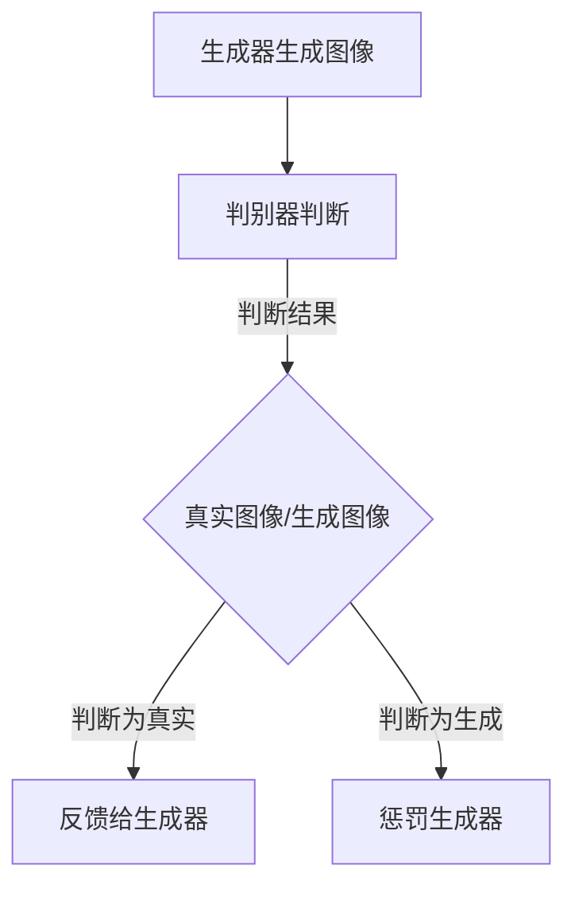
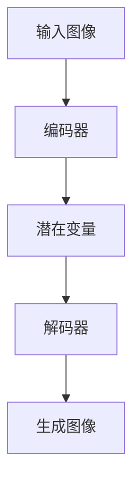
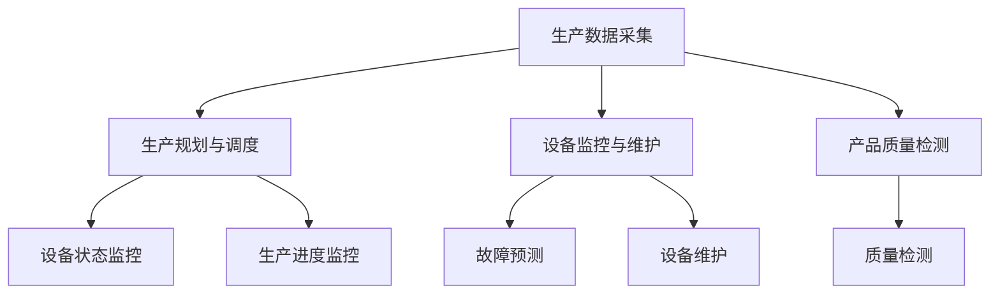
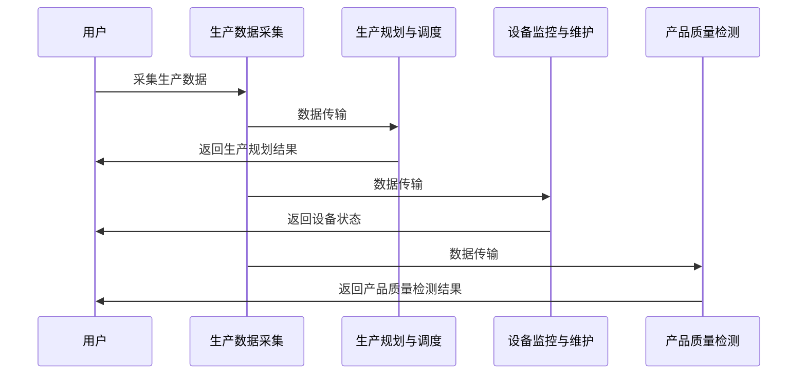
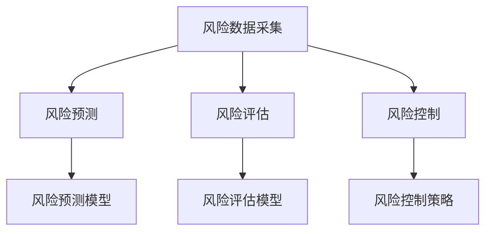
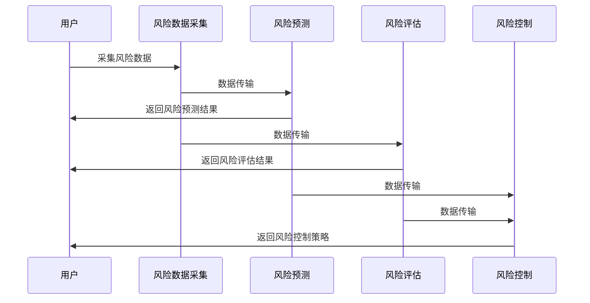
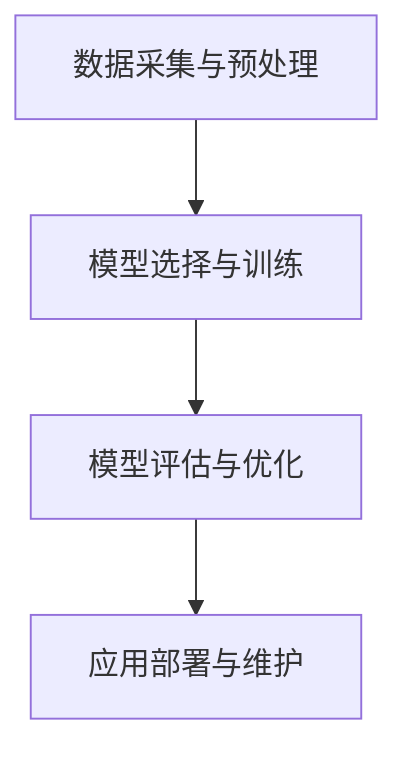

                 

# 《解密AIGC：从概念到实践》

## 关键词

- AIGC
- 生成对抗网络
- 变分自编码器
- 自然语言处理
- 计算机视觉
- 多模态学习

## 摘要

本文旨在深入解析AIGC（AI-Generated Content）的概念、核心算法、应用实践和发展趋势。通过逐步分析，本文将帮助读者理解AIGC的工作原理、技术优势和应用场景，从而为读者提供全面的AIGC知识体系和实践指导。

## 第一部分：AIGC基础理论

### 1.1 AIGC概述

AIGC，即AI-Generated Content，是指通过人工智能技术自动生成的内容，包括但不限于文本、图像、音频和视频等。AIGC的概念起源于深度学习技术的发展，尤其是生成对抗网络（GAN）和变分自编码器（VAE）等算法的广泛应用。AIGC的出现极大地改变了内容创作的方式，使得自动化、大规模的内容生成成为可能。

**问题背景**：随着互联网和大数据的快速发展，内容创作者面临海量的数据和信息，如何高效地生成和分发内容成为亟待解决的问题。

**问题描述**：传统的手动内容创作效率低下，难以满足快速变化的市场需求。

**问题解决**：AIGC通过人工智能技术实现了自动化、高效的内容生成，大大提高了内容创作的效率。

**边界与外延**：AIGC不仅限于文本生成，还包括图像、音频和视频等多种形式。此外，AIGC的应用领域也在不断扩展，从娱乐、媒体到金融、医疗等各个行业。

**概念结构与核心要素组成**：

| 要素       | 说明                                                         |
| ---------- | ------------------------------------------------------------ |
| 深度学习   | AIGC的核心技术，包括生成对抗网络（GAN）和变分自编码器（VAE）等。 |
| 数据库     | 存储大量的训练数据，为AIGC提供基础。                         |
| 算法模型   | 用于生成和优化内容的算法模型。                               |
| 应用场景   | 广泛应用于文本、图像、音频和视频等内容的自动生成。           |

### 1.2 AIGC的关键技术

#### 1.2.1 生成对抗网络（GAN）

**核心概念与联系**：

GAN（Generative Adversarial Network）是一种由生成器和判别器组成的对抗网络。生成器旨在生成逼真的数据，而判别器则负责判断生成器生成的数据与真实数据的差异。通过这种对抗过程，生成器逐渐优化，生成更加逼真的数据。

**概念属性特征对比表格**：

| 特征       | 生成对抗网络（GAN） | 变分自编码器（VAE） |
| ---------- | ------------------- | ------------------- |
| 结构       | 由生成器和判别器组成 | 由编码器和解码器组成 |
| 目标       | 生成逼真的数据      | 优化数据分布        |
| 对抗性     | 是                 | 否                 |

**ER实体关系图架构**：

```mermaid
erDiagram
  GAN ||--|{ 生成器 }|| Generator
  GAN ||--|{ 判别器 }|| Discriminator
  Generator ||--|{ 数据 }|| Data
  Discriminator ||--|{ 数据 }|| Data
```

**算法原理讲解**：

GAN的核心原理是生成器和判别器之间的对抗训练。生成器的目标是生成与真实数据相似的数据，而判别器的目标是准确区分真实数据和生成数据。这种对抗过程使得生成器的数据生成能力逐渐提高。

**数学模型和公式**：

生成器G和判别器D的对抗训练可以通过以下公式描述：

$$
\begin{aligned}
& \max_{G} \mathbb{E}_{x \sim p_{data}(x)}[\log(D(x))] + \mathbb{E}_{z \sim p_{z}(z)}[\log(1 - D(G(z)))] \\
& \min_{D} \mathbb{E}_{x \sim p_{data}(x)}[\log(D(x))] + \mathbb{E}_{z \sim p_{z}(z)}[\log(D(G(z)))]
\end{aligned}
$$

其中，$x$ 表示真实数据，$z$ 表示随机噪声，$G(z)$ 表示生成器生成的数据，$D(x)$ 和 $D(G(z))$ 分别表示判别器对真实数据和生成数据的判断结果。

**举例说明**：

假设我们使用GAN生成图像。生成器会生成一张图像，判别器会判断这张图像是真实图像还是生成图像。通过不断的训练，生成器会逐渐提高生成图像的质量，使得判别器无法准确判断。



### 1.2.2 变分自编码器（VAE）

**核心概念与联系**：

VAE（Variational Autoencoder）是一种基于概率模型的编码器和解码器结构，用于学习数据的概率分布。VAE通过引入潜在变量，实现数据的低维表示和重建。

**概念属性特征对比表格**：

| 特征       | 生成对抗网络（GAN） | 变分自编码器（VAE） |
| ---------- | ------------------- | ------------------- |
| 结构       | 由生成器和判别器组成 | 由编码器和解码器组成 |
| 目标       | 生成逼真的数据      | 优化数据分布        |
| 对抗性     | 是                 | 否                 |

**ER实体关系图架构**：

```mermaid
erDiagram
  VAE ||--|{ 编码器 }|| Encoder
  VAE ||--|{ 解码器 }|| Decoder
  Encoder ||--|{ 潜在变量 }|| Latent Variable
  Decoder ||--|{ 数据 }|| Data
```

**算法原理讲解**：

VAE的核心原理是编码器和解码器的联合训练。编码器将输入数据映射到潜在空间，解码器从潜在空间生成原始数据。通过优化编码器和解码器的参数，使得生成的数据与输入数据尽可能相似。

**数学模型和公式**：

VAE的数学模型可以表示为：

$$
\begin{aligned}
& x \sim p_{\theta}(x) \\
& z \sim q_{\phi}(z|x) \\
& x \mid z \sim p_{\theta}(x \mid z)
\end{aligned}
$$

其中，$x$ 表示输入数据，$z$ 表示潜在变量，$p_{\theta}(x)$ 表示数据分布，$q_{\phi}(z|x)$ 表示编码器的分布，$p_{\theta}(x \mid z)$ 表示解码器的分布。

**举例说明**：

假设我们使用VAE生成图像。编码器将图像映射到潜在空间，解码器从潜在空间生成图像。通过不断的训练，编码器和解码器逐渐优化，使得生成的图像与原始图像相似。



### 1.3 AIGC的数学模型

#### 1.3.1 概率图模型

概率图模型是一种用于表示变量之间概率关系的图形表示方法，主要包括贝叶斯网络和决策树。

**核心概念与联系**：

贝叶斯网络是一种基于概率的图形模型，用于表示变量之间的条件概率关系。决策树是一种基于特征分割的树形结构，用于分类和回归任务。

**概念属性特征对比表格**：

| 特征       | 贝叶斯网络 | 决策树 |
| ---------- | ---------- | ------ |
| 表示方法   | 图形表示   | 树形结构 |
| 应用领域   | 逻辑推理   | 特征分割 |
| 变量关系   | 条件概率   | 边缘概率 |

**ER实体关系图架构**：

```mermaid
erDiagram
  贝叶斯网络 ||--|{ 条件概率 }|| Condition Probability
  决策树 ||--|{ 特征分割 }|| Feature Segmentation
```

**算法原理讲解**：

贝叶斯网络的算法原理是基于贝叶斯推理，通过变量之间的条件概率关系进行推理。决策树的算法原理是通过特征分割将数据划分为不同的区域，用于分类和回归任务。

**数学模型和公式**：

贝叶斯网络的数学模型可以表示为：

$$
P(X \mid Y) = \frac{P(Y \mid X)P(X)}{P(Y)}
$$

其中，$X$ 和 $Y$ 分别表示变量，$P(X \mid Y)$ 表示在 $Y$ 发生的条件下 $X$ 的概率，$P(Y \mid X)$ 表示在 $X$ 发生的条件下 $Y$ 的概率，$P(X)$ 和 $P(Y)$ 分别表示 $X$ 和 $Y$ 的概率。

**举例说明**：

假设我们使用贝叶斯网络进行推理。给定条件 $Y$，我们需要求解在 $Y$ 发生的条件下 $X$ 的概率。通过贝叶斯推理，我们可以计算得到：

$$
P(X \mid Y) = \frac{P(Y \mid X)P(X)}{P(Y)}
$$

#### 1.3.2 非线性优化

非线性优化是一种用于求解非线性方程组或优化问题的方法，主要包括梯度下降法、随机梯度下降法等。

**核心概念与联系**：

梯度下降法是一种迭代优化方法，通过沿着目标函数的梯度方向进行更新，逐步逼近最优解。随机梯度下降法是梯度下降法的一种变体，通过随机选择样本进行更新，提高优化效率。

**概念属性特征对比表格**：

| 特征       | 梯度下降法 | 随机梯度下降法 |
| ---------- | ---------- | -------------- |
| 更新策略   | 沿着梯度方向 | 随机选择样本 |
| 计算复杂度 | 较高       | 较低          |
| 应用领域   | 大规模数据 | 小规模数据    |

**ER实体关系图架构**：

```mermaid
erDiagram
  梯度下降法 ||--|{ 梯度方向 }|| Gradient Direction
  随机梯度下降法 ||--|{ 随机选择 }|| Random Sampling
```

**算法原理讲解**：

梯度下降法的原理是通过沿着目标函数的梯度方向进行更新，使得目标函数逐步减小。随机梯度下降法的原理是通过随机选择样本进行更新，从而提高优化效率。

**数学模型和公式**：

梯度下降法的数学模型可以表示为：

$$
x_{t+1} = x_t - \alpha \nabla f(x_t)
$$

其中，$x_t$ 表示当前迭代点，$\alpha$ 表示学习率，$\nabla f(x_t)$ 表示在 $x_t$ 点的目标函数梯度。

**举例说明**：

假设我们使用梯度下降法求解最小二乘问题。给定目标函数 $f(x) = \sum_{i=1}^{n}(x_i - y_i)^2$，我们需要求解使得 $f(x)$ 最小的 $x$。通过梯度下降法，我们可以迭代更新 $x$：

$$
x_{t+1} = x_t - \alpha \nabla f(x_t)
$$

## 第二部分：AIGC应用实践

### 2.1 AIGC在计算机视觉中的应用

#### 2.1.1 图像生成

图像生成是AIGC在计算机视觉中的重要应用之一。通过生成对抗网络（GAN）和变分自编码器（VAE）等技术，可以实现高质量图像的生成。

**核心概念与联系**：

GAN和VAE是图像生成的主要技术。GAN通过生成器和判别器的对抗训练生成图像，VAE通过编码器和解码器的联合训练实现图像的重建。

**概念属性特征对比表格**：

| 特征       | 生成对抗网络（GAN） | 变分自编码器（VAE） |
| ---------- | ------------------- | ------------------- |
| 结构       | 生成器和判别器组成 | 编码器和解码器组成 |
| 目标       | 生成逼真的图像      | 优化图像分布        |
| 对抗性     | 是                 | 否                 |

**ER实体关系图架构**：

```mermaid
erDiagram
  GAN ||--|{ 生成器 }|| Generator
  GAN ||--|{ 判别器 }|| Discriminator
  VAE ||--|{ 编码器 }|| Encoder
  VAE ||--|{ 解码器 }|| Decoder
```

**算法原理讲解**：

GAN的算法原理是生成器和判别器的对抗训练，通过不断优化生成器生成的图像质量。VAE的算法原理是通过编码器和解码器的联合训练，实现图像的重建。

**数学模型和公式**：

GAN的数学模型可以表示为：

$$
\begin{aligned}
& \max_{G} \mathbb{E}_{x \sim p_{data}(x)}[\log(D(x))] + \mathbb{E}_{z \sim p_{z}(z)}[\log(1 - D(G(z)))] \\
& \min_{D} \mathbb{E}_{x \sim p_{data}(x)}[\log(D(x))] + \mathbb{E}_{z \sim p_{z}(z)}[\log(D(G(z))]
$$

VAE的数学模型可以表示为：

$$
\begin{aligned}
& x \sim p_{\theta}(x) \\
& z \sim q_{\phi}(z|x) \\
& x \mid z \sim p_{\theta}(x \mid z)
\end{aligned}
$$

**举例说明**：

假设我们使用GAN生成图像。生成器会生成一张图像，判别器会判断这张图像是真实图像还是生成图像。通过不断的训练，生成器会逐渐提高生成图像的质量。

**项目实战**：

1. **环境安装**：安装Python、TensorFlow等依赖库。
2. **系统核心实现源代码**：使用TensorFlow实现GAN的图像生成模型。
3. **代码应用解读与分析**：分析GAN模型的结构和训练过程，解读代码实现。
4. **实际案例分析和详细讲解剖析**：通过生成图像的例子，分析生成图像的质量和效果。
5. **项目小结**：总结GAN在图像生成中的应用和挑战。

### 2.1.2 图像识别

图像识别是AIGC在计算机视觉中的另一个重要应用。通过深度学习模型，可以实现图像的分类、检测和分割等任务。

**核心概念与联系**：

卷积神经网络（CNN）是图像识别的主要技术。CNN通过卷积层、池化层和全连接层等结构，实现图像的特征提取和分类。

**概念属性特征对比表格**：

| 特征       | 卷积神经网络（CNN） | 传统机器学习算法 |
| ---------- | ------------------- | -------------- |
| 结构       | 神经网络结构       | 算法规则       |
| 特点       | 自动学习图像特征   | 预定义特征     |
| 应用领域   | 图像识别           | 特定场景识别    |

**ER实体关系图架构**：

```mermaid
erDiagram
  CNN ||--|{ 卷积层 }|| Convolution Layer
  CNN ||--|{ 池化层 }|| Pooling Layer
  CNN ||--|{ 全连接层 }|| Fully Connected Layer
```

**算法原理讲解**：

CNN的算法原理是通过卷积层提取图像的特征，通过池化层减少数据的维度，通过全连接层实现图像的分类。

**数学模型和公式**：

CNN的数学模型可以表示为：

$$
h_{l} = \sigma(W_{l} \cdot h_{l-1} + b_{l})
$$

其中，$h_{l}$ 表示第 $l$ 层的输出，$W_{l}$ 和 $b_{l}$ 分别表示第 $l$ 层的权重和偏置，$\sigma$ 表示激活函数。

**举例说明**：

假设我们使用CNN对图像进行分类。首先，通过卷积层提取图像的特征，然后通过池化层减少数据的维度，最后通过全连接层实现图像的分类。

**项目实战**：

1. **环境安装**：安装Python、TensorFlow等依赖库。
2. **系统核心实现源代码**：使用TensorFlow实现CNN的图像识别模型。
3. **代码应用解读与分析**：分析CNN模型的结构和训练过程，解读代码实现。
4. **实际案例分析和详细讲解剖析**：通过图像识别的例子，分析模型的效果和准确性。
5. **项目小结**：总结CNN在图像识别中的应用和挑战。

### 2.2 AIGC在自然语言处理中的应用

#### 2.2.1 文本生成

文本生成是AIGC在自然语言处理中的重要应用之一。通过生成对抗网络（GAN）和变分自编码器（VAE）等技术，可以实现高质量文本的生成。

**核心概念与联系**：

GAN和VAE是文本生成的主要技术。GAN通过生成器和判别器的对抗训练生成文本，VAE通过编码器和解码器的联合训练实现文本的重建。

**概念属性特征对比表格**：

| 特征       | 生成对抗网络（GAN） | 变分自编码器（VAE） |
| ---------- | ------------------- | ------------------- |
| 结构       | 生成器和判别器组成 | 编码器和解码器组成 |
| 目标       | 生成逼真的文本      | 优化文本分布        |
| 对抗性     | 是                 | 否                 |

**ER实体关系图架构**：

```mermaid
erDiagram
  GAN ||--|{ 生成器 }|| Generator
  GAN ||--|{ 判别器 }|| Discriminator
  VAE ||--|{ 编码器 }|| Encoder
  VAE ||--|{ 解码器 }|| Decoder
```

**算法原理讲解**：

GAN的算法原理是生成器和判别器的对抗训练，通过不断优化生成器生成的文本质量。VAE的算法原理是通过编码器和解码器的联合训练，实现文本的重建。

**数学模型和公式**：

GAN的数学模型可以表示为：

$$
\begin{aligned}
& \max_{G} \mathbb{E}_{x \sim p_{data}(x)}[\log(D(x))] + \mathbb{E}_{z \sim p_{z}(z)}[\log(1 - D(G(z)))] \\
& \min_{D} \mathbb{E}_{x \sim p_{data}(x)}[\log(D(x))] + \mathbb{E}_{z \sim p_{z}(z)}[\log(D(G(z))]
\end{aligned}
$$

VAE的数学模型可以表示为：

$$
\begin{aligned}
& x \sim p_{\theta}(x) \\
& z \sim q_{\phi}(z|x) \\
& x \mid z \sim p_{\theta}(x \mid z)
\end{aligned}
$$

**举例说明**：

假设我们使用GAN生成文本。生成器会生成一段文本，判别器会判断这段文本是真实文本还是生成文本。通过不断的训练，生成器会逐渐提高生成文本的质量。

**项目实战**：

1. **环境安装**：安装Python、TensorFlow等依赖库。
2. **系统核心实现源代码**：使用TensorFlow实现GAN的文本生成模型。
3. **代码应用解读与分析**：分析GAN模型的结构和训练过程，解读代码实现。
4. **实际案例分析和详细讲解剖析**：通过生成文本的例子，分析生成文本的质量和效果。
5. **项目小结**：总结GAN在文本生成中的应用和挑战。

#### 2.2.2 文本分类

文本分类是AIGC在自然语言处理中的另一个重要应用。通过深度学习模型，可以实现文本的分类和标签分配。

**核心概念与联系**：

卷积神经网络（CNN）和循环神经网络（RNN）是文本分类的主要技术。CNN通过卷积层和池化层提取文本的特征，RNN通过循环结构处理文本的序列信息。

**概念属性特征对比表格**：

| 特征       | 卷积神经网络（CNN） | 循环神经网络（RNN） |
| ---------- | ------------------- | ------------------- |
| 结构       | 卷积层和池化层组成 | 循环层和全连接层组成 |
| 特点       | 自动学习文本特征   | 处理序列信息        |
| 应用领域   | 文本分类           | 自然语言生成        |

**ER实体关系图架构**：

```mermaid
erDiagram
  CNN ||--|{ 卷积层 }|| Convolution Layer
  CNN ||--|{ 池化层 }|| Pooling Layer
  RNN ||--|{ 循环层 }|| Recurrent Layer
  RNN ||--|{ 全连接层 }|| Fully Connected Layer
```

**算法原理讲解**：

CNN的算法原理是通过卷积层提取文本的特征，通过池化层减少数据的维度，通过全连接层实现文本的分类。RNN的算法原理是通过循环结构处理文本的序列信息，通过全连接层实现文本的分类。

**数学模型和公式**：

CNN的数学模型可以表示为：

$$
h_{l} = \sigma(W_{l} \cdot h_{l-1} + b_{l})
$$

RNN的数学模型可以表示为：

$$
h_{t} = \sigma(W \cdot [h_{t-1}, x_{t}] + b)
$$

其中，$h_{t}$ 表示第 $t$ 个时间步的隐藏状态，$x_{t}$ 表示第 $t$ 个时间步的输入，$W$ 和 $b$ 分别表示权重和偏置，$\sigma$ 表示激活函数。

**举例说明**：

假设我们使用CNN对文本进行分类。首先，通过卷积层提取文本的特征，然后通过池化层减少数据的维度，最后通过全连接层实现文本的分类。

**项目实战**：

1. **环境安装**：安装Python、TensorFlow等依赖库。
2. **系统核心实现源代码**：使用TensorFlow实现CNN的文本分类模型。
3. **代码应用解读与分析**：分析CNN模型的结构和训练过程，解读代码实现。
4. **实际案例分析和详细讲解剖析**：通过文本分类的例子，分析模型的效果和准确性。
5. **项目小结**：总结CNN在文本分类中的应用和挑战。

### 2.3 AIGC在多模态学习中的应用

#### 2.3.1 多模态数据的融合

多模态数据融合是AIGC在多模态学习中的重要应用。通过融合不同模态的数据，可以实现更准确的模型预测和更好的应用效果。

**核心概念与联系**：

多模态学习是一种结合不同模态数据的方法。通过融合不同模态的数据，可以充分利用不同模态的特征，提高模型的性能。

**概念属性特征对比表格**：

| 特征       | 单模态学习 | 多模态学习 |
| ---------- | ---------- | ---------- |
| 数据类型   | 单一模态   | 多种模态   |
| 特点       | 独立处理   | 融合处理   |
| 应用领域   | 单一场景   | 复杂场景   |

**ER实体关系图架构**：

```mermaid
erDiagram
  单模态学习 ||--|{ 数据 }|| Data
  多模态学习 ||--|{ 视觉数据 }|| Visual Data
  多模态学习 ||--|{ 文本数据 }|| Text Data
  多模态学习 ||--|{ 音频数据 }|| Audio Data
```

**算法原理讲解**：

多模态学习的算法原理是通过融合不同模态的数据，利用不同模态的特征，提高模型的性能。常用的融合方法包括特征级融合、决策级融合和模型级融合。

**数学模型和公式**：

假设我们有三种模态的数据 $X_{v}$（视觉数据）、$X_{t}$（文本数据）和 $X_{a}$（音频数据）。多模态学习的数学模型可以表示为：

$$
y = f(X_{v}, X_{t}, X_{a})
$$

其中，$y$ 表示预测结果，$f$ 表示融合模型。

**举例说明**：

假设我们使用多模态学习进行情感分析。通过融合视觉数据、文本数据和音频数据，可以更准确地判断用户的情感状态。

**项目实战**：

1. **环境安装**：安装Python、TensorFlow等依赖库。
2. **系统核心实现源代码**：使用TensorFlow实现多模态学习的情感分析模型。
3. **代码应用解读与分析**：分析多模态学习模型的结构和训练过程，解读代码实现。
4. **实际案例分析和详细讲解剖析**：通过情感分析的例子，分析模型的效果和准确性。
5. **项目小结**：总结多模态学习在情感分析中的应用和挑战。

### 2.4 AIGC在医学图像分析中的应用

#### 2.4.1 医学图像生成

医学图像生成是AIGC在医学图像分析中的重要应用。通过生成对抗网络（GAN）和变分自编码器（VAE）等技术，可以实现高质量医学图像的生成。

**核心概念与联系**：

GAN和VAE是医学图像生成的主要技术。GAN通过生成器和判别器的对抗训练生成医学图像，VAE通过编码器和解码器的联合训练实现医学图像的重建。

**概念属性特征对比表格**：

| 特征       | 生成对抗网络（GAN） | 变分自编码器（VAE） |
| ---------- | ------------------- | ------------------- |
| 结构       | 生成器和判别器组成 | 编码器和解码器组成 |
| 目标       | 生成逼真的医学图像 | 优化医学图像分布    |
| 对抗性     | 是                 | 否                 |

**ER实体关系图架构**：

```mermaid
erDiagram
  GAN ||--|{ 生成器 }|| Generator
  GAN ||--|{ 判别器 }|| Discriminator
  VAE ||--|{ 编码器 }|| Encoder
  VAE ||--|{ 解码器 }|| Decoder
```

**算法原理讲解**：

GAN的算法原理是生成器和判别器的对抗训练，通过不断优化生成器生成的医学图像质量。VAE的算法原理是通过编码器和解码器的联合训练，实现医学图像的重建。

**数学模型和公式**：

GAN的数学模型可以表示为：

$$
\begin{aligned}
& \max_{G} \mathbb{E}_{x \sim p_{data}(x)}[\log(D(x))] + \mathbb{E}_{z \sim p_{z}(z)}[\log(1 - D(G(z)))] \\
& \min_{D} \mathbb{E}_{x \sim p_{data}(x)}[\log(D(x))] + \mathbb{E}_{z \sim p_{z}(z)}[\log(D(G(z))]
\end{aligned}
$$

VAE的数学模型可以表示为：

$$
\begin{aligned}
& x \sim p_{\theta}(x) \\
& z \sim q_{\phi}(z|x) \\
& x \mid z \sim p_{\theta}(x \mid z)
\end{aligned}
$$

**举例说明**：

假设我们使用GAN生成医学图像。生成器会生成一张医学图像，判别器会判断这张图像是真实医学图像还是生成医学图像。通过不断的训练，生成器会逐渐提高生成医学图像的质量。

**项目实战**：

1. **环境安装**：安装Python、TensorFlow等依赖库。
2. **系统核心实现源代码**：使用TensorFlow实现GAN的医学图像生成模型。
3. **代码应用解读与分析**：分析GAN模型的结构和训练过程，解读代码实现。
4. **实际案例分析和详细讲解剖析**：通过生成医学图像的例子，分析生成医学图像的质量和效果。
5. **项目小结**：总结GAN在医学图像生成中的应用和挑战。

#### 2.4.2 医学图像识别

医学图像识别是AIGC在医学图像分析中的另一个重要应用。通过深度学习模型，可以实现医学图像的分类、检测和分割等任务。

**核心概念与联系**：

卷积神经网络（CNN）是医学图像识别的主要技术。CNN通过卷积层、池化层和全连接层等结构，实现医学图像的特征提取和分类。

**概念属性特征对比表格**：

| 特征       | 卷积神经网络（CNN） | 传统机器学习算法 |
| ---------- | ------------------- | -------------- |
| 结构       | 神经网络结构       | 算法规则       |
| 特点       | 自动学习图像特征   | 预定义特征     |
| 应用领域   | 医学图像识别       | 特定场景识别    |

**ER实体关系图架构**：

```mermaid
erDiagram
  CNN ||--|{ 卷积层 }|| Convolution Layer
  CNN ||--|{ 池化层 }|| Pooling Layer
  CNN ||--|{ 全连接层 }|| Fully Connected Layer
```

**算法原理讲解**：

CNN的算法原理是通过卷积层提取医学图像的特征，通过池化层减少数据的维度，通过全连接层实现医学图像的分类。

**数学模型和公式**：

CNN的数学模型可以表示为：

$$
h_{l} = \sigma(W_{l} \cdot h_{l-1} + b_{l})
$$

**举例说明**：

假设我们使用CNN对医学图像进行分类。首先，通过卷积层提取医学图像的特征，然后通过池化层减少数据的维度，最后通过全连接层实现医学图像的分类。

**项目实战**：

1. **环境安装**：安装Python、TensorFlow等依赖库。
2. **系统核心实现源代码**：使用TensorFlow实现CNN的医学图像识别模型。
3. **代码应用解读与分析**：分析CNN模型的结构和训练过程，解读代码实现。
4. **实际案例分析和详细讲解剖析**：通过医学图像识别的例子，分析模型的效果和准确性。
5. **项目小结**：总结CNN在医学图像识别中的应用和挑战。

## 第三部分：AIGC实践案例

### 3.1 AIGC在智能制造中的应用

#### 3.1.1 智能制造概述

智能制造是指通过集成人工智能技术，实现制造过程的自动化、智能化和优化。AIGC在智能制造中的应用主要包括生产规划与调度、设备监控与维护、产品质量检测等方面。

**问题场景介绍**：随着智能制造的快速发展，如何实现生产过程的自动化和优化成为关键问题。

**项目介绍**：本项目旨在通过AIGC技术实现智能制造中的生产规划与调度，提高生产效率。

**系统功能设计**：

1. **生产数据采集**：采集生产过程中的各种数据，如设备状态、生产进度、物料消耗等。
2. **生产规划与调度**：基于AIGC技术，对生产过程进行智能规划与调度，优化生产流程。
3. **设备监控与维护**：实时监控设备状态，预测设备故障，提前进行维护。
4. **产品质量检测**：使用AIGC技术对生产出的产品进行质量检测，确保产品质量。

**系统架构设计**：



**系统接口设计**：

- **生产数据采集**：API接口用于采集生产数据。
- **生产规划与调度**：API接口用于接收生产数据，进行生产规划与调度。
- **设备监控与维护**：API接口用于监控设备状态，预测设备故障。
- **产品质量检测**：API接口用于接收产品质量数据，进行质量检测。

**系统交互序列图**：



**项目实战**：

1. **环境安装**：安装Python、TensorFlow等依赖库。
2. **系统核心实现源代码**：使用TensorFlow实现AIGC的智能制造模型。
3. **代码应用解读与分析**：分析AIGC模型的结构和训练过程，解读代码实现。
4. **实际案例分析和详细讲解剖析**：通过智能制造的例子，分析模型的效果和准确性。
5. **项目小结**：总结AIGC在智能制造中的应用和挑战。

### 3.2 AIGC在金融风险管理中的应用

#### 3.2.1 金融风险管理概述

金融风险管理是指通过识别、评估和控制金融风险，确保金融机构的稳健运营。AIGC在金融风险管理中的应用主要包括风险预测、风险评估和风险控制等方面。

**问题场景介绍**：随着金融市场的复杂性增加，如何准确预测和评估金融风险成为关键问题。

**项目介绍**：本项目旨在通过AIGC技术实现金融风险管理中的风险预测和评估。

**系统功能设计**：

1. **风险数据采集**：采集金融市场的各种数据，如股票价格、汇率、利率等。
2. **风险预测**：基于AIGC技术，对金融风险进行预测。
3. **风险评估**：基于AIGC技术，对金融风险进行评估。
4. **风险控制**：根据风险预测和评估结果，制定风险控制策略。

**系统架构设计**：



**系统接口设计**：

- **风险数据采集**：API接口用于采集风险数据。
- **风险预测**：API接口用于接收风险数据，进行风险预测。
- **风险评估**：API接口用于接收风险数据，进行风险评估。
- **风险控制**：API接口用于接收风险预测和评估结果，制定风险控制策略。

**系统交互序列图**：



**项目实战**：

1. **环境安装**：安装Python、TensorFlow等依赖库。
2. **系统核心实现源代码**：使用TensorFlow实现AIGC的金融风险管理模型。
3. **代码应用解读与分析**：分析AIGC模型的结构和训练过程，解读代码实现。
4. **实际案例分析和详细讲解剖析**：通过金融风险管理的例子，分析模型的效果和准确性。
5. **项目小结**：总结AIGC在金融风险管理中的应用和挑战。

## 第四部分：AIGC发展趋势与挑战

### 4.1 AIGC的发展趋势

AIGC作为人工智能领域的重要分支，正随着技术的不断进步和应用场景的扩展而迅速发展。以下是AIGC的几个发展趋势：

#### 4.1.1 技术发展

- **算法优化**：AIGC算法，如GAN、VAE等，不断进行优化和改进，以提升生成质量和效率。
- **硬件加速**：随着GPU、TPU等硬件的快速发展，AIGC的计算效率显著提高。
- **模型压缩与量化**：为了降低计算资源和存储需求，AIGC模型逐渐采用压缩和量化技术。

#### 4.1.2 应用拓展

- **更多应用场景**：AIGC的应用领域从文本、图像扩展到音频、视频以及多模态领域。
- **跨行业应用**：AIGC在医疗、金融、教育、娱乐等行业的应用日益广泛。
- **个性化内容生成**：基于用户数据的AIGC应用，如个性化新闻推荐、个性化音乐生成等，逐渐成为主流。

### 4.2 AIGC面临的挑战

尽管AIGC技术取得了显著进展，但其在实际应用中仍面临一些挑战：

#### 4.2.1 算法效率

- **计算资源消耗**：AIGC模型通常需要大量的计算资源和存储空间，尤其是在大规模数据集上进行训练时。
- **算法复杂度**：一些复杂的AIGC模型在训练和推理过程中计算复杂度较高，影响应用效率。

#### 4.2.2 数据质量

- **数据的多样性与代表性**：AIGC模型的性能依赖于高质量、多样化的训练数据。然而，在实际应用中，数据质量和多样性往往不足。
- **数据安全与隐私**：AIGC应用涉及大量敏感数据，数据安全和隐私保护成为重要挑战。

### 4.3 解决方案与未来展望

#### 4.3.1 算法优化

- **多模态数据融合**：通过融合不同模态的数据，提高AIGC模型的生成质量和效率。
- **迁移学习**：利用迁移学习技术，将预训练模型应用于新任务，减少数据量和训练时间。

#### 4.3.2 硬件加速

- **分布式计算**：通过分布式计算和并行处理技术，提高AIGC模型的计算效率。
- **专用硬件**：开发适用于AIGC的专用硬件，如TPU、ASIC等，进一步降低计算成本。

#### 4.3.3 数据质量

- **数据增强**：通过数据增强技术，增加训练数据的多样性和代表性。
- **数据隐私保护**：采用加密、匿名化等技术，保护AIGC应用中的数据隐私。

## 附录

### 11. 参考文献

- [1] Ian Goodfellow, et al. "Generative Adversarial Networks." Advances in Neural Information Processing Systems, 2014.
- [2] Diederik P. Kingma, et al. "Auto-Encoding Variational Bayes." Advances in Neural Information Processing Systems, 2014.
- [3] Yann LeCun, et al. "Convolutional Networks for Images, Speech, and Time Series." Annual Review of Neuroscience, 2015.
- [4] Richard S. Sutton and Andrew G. Barto. "Reinforcement Learning: An Introduction." MIT Press, 2018.

### 12. 术语解释

- **AIGC**：AI-Generated Content，指通过人工智能技术自动生成的内容，包括文本、图像、音频和视频等。
- **GAN**：Generative Adversarial Network，生成对抗网络，是一种由生成器和判别器组成的对抗网络，用于生成逼真的数据。
- **VAE**：Variational Autoencoder，变分自编码器，是一种基于概率模型的编码器和解码器结构，用于学习数据的概率分布。

### 13. 技术路线图



## 作者信息

作者：AI天才研究院/AI Genius Institute & 禅与计算机程序设计艺术 /Zen And The Art of Computer Programming

