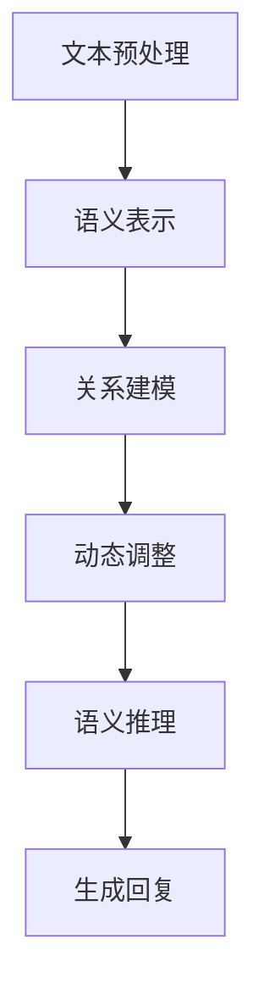
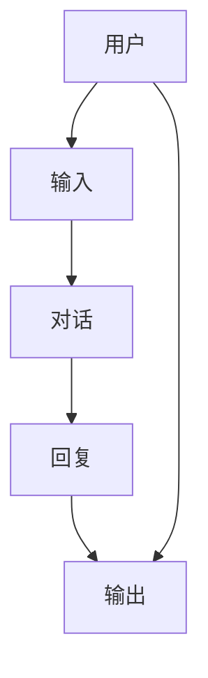
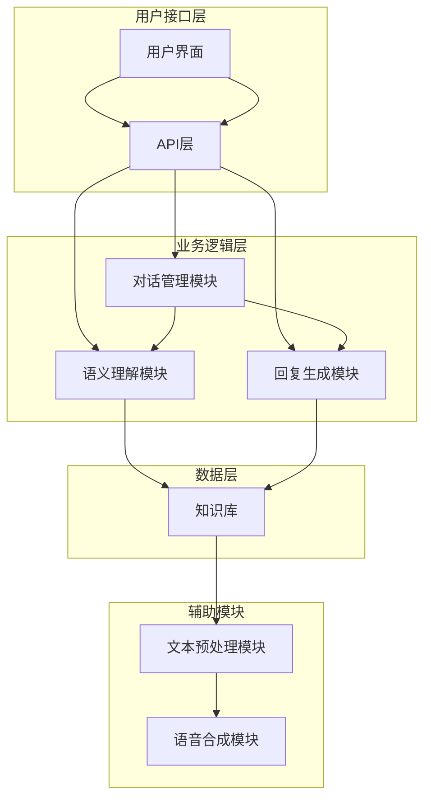
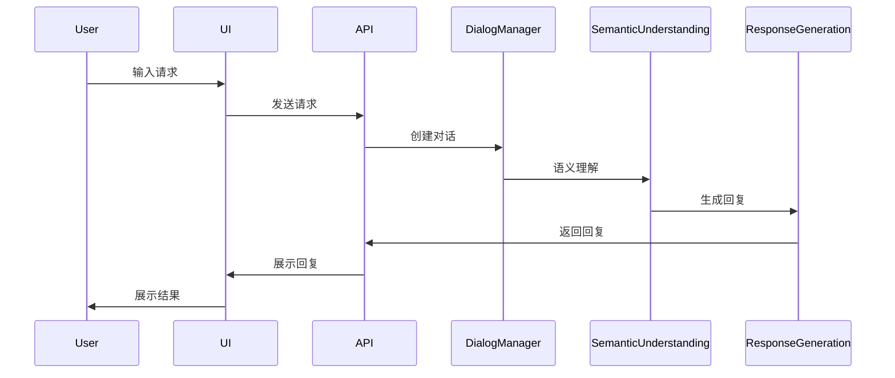
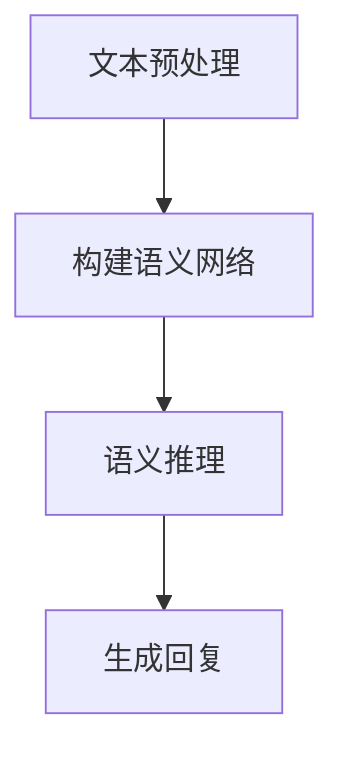
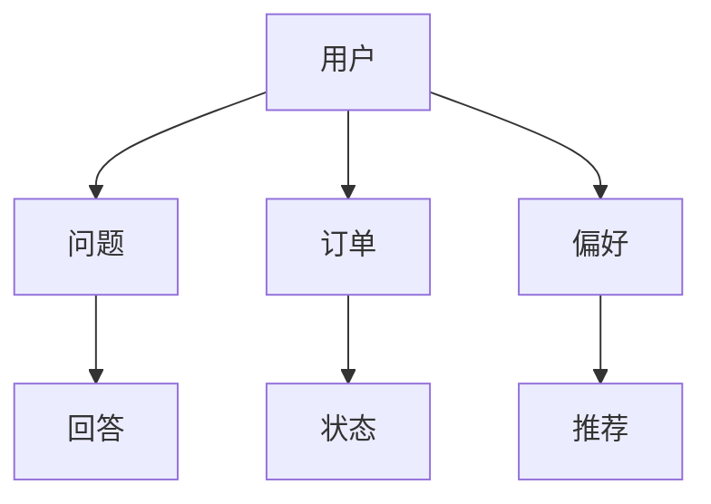
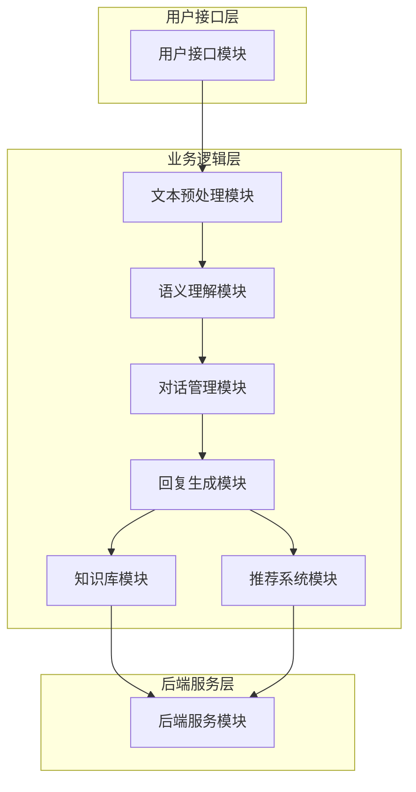
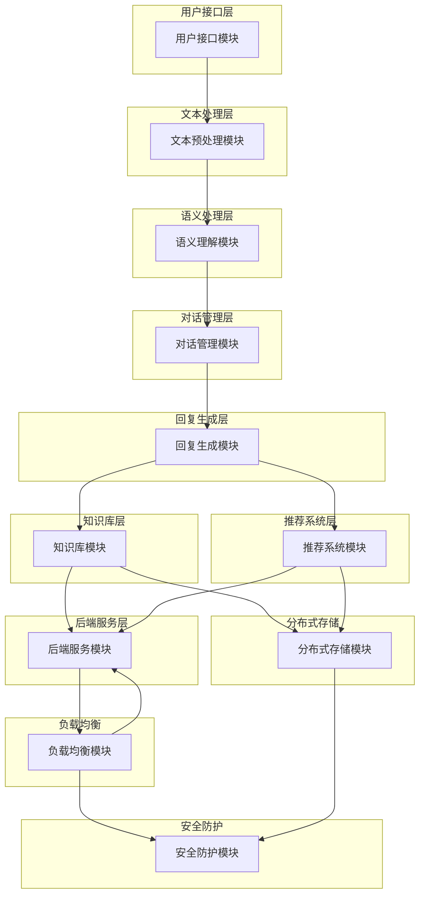
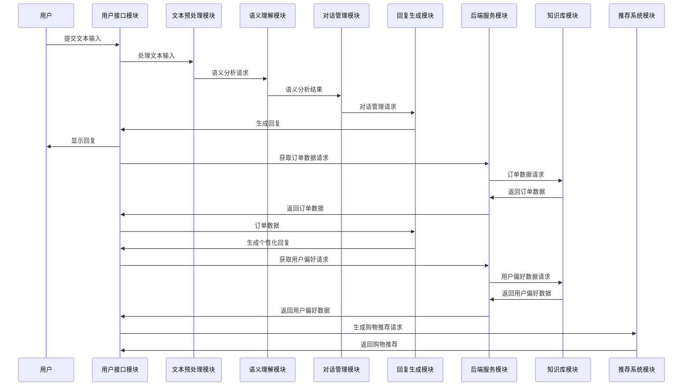

                 

# 《解密思维链：AI对话的关键技巧》

## 关键词

- AI对话
- 思维链
- 自然语言处理
- 算法原理
- 系统架构设计
- 项目实战
- 最佳实践

## 摘要

随着人工智能技术的不断发展，AI对话系统已经成为人机交互的重要方式。本文将深入探讨AI对话中的思维链技术，从问题背景、核心概念解析、算法原理讲解、系统架构设计、项目实战到最佳实践，全面揭示思维链在AI对话系统中的应用和实现方法。通过本文的详细分析，读者可以深入了解思维链的运作机制，掌握其在AI对话系统中的关键技巧，为未来的研究和应用奠定基础。

## 《解密思维链：AI对话的关键技巧》目录大纲

### 第一部分：问题背景与核心概念

#### 1.1 问题背景

##### 1.1.1 AI对话技术的发展历程

##### 1.1.2 当前AI对话技术的挑战

##### 1.1.3 思维链在AI对话中的重要性

#### 1.2 核心概念

##### 1.2.1 思维链的定义

##### 1.2.2 思维链的特点

##### 1.2.3 思维链与自然语言处理的关系

#### 1.3 边界与外延

##### 1.3.1 思维链的应用范围

##### 1.3.2 思维链的限制因素

### 第二部分：核心概念与联系

#### 2.1 核心概念原理

##### 2.1.1 概念解析

##### 2.1.2 概念属性特征对比表格

##### 2.1.3 ER实体关系图架构

#### 2.2 概念联系

##### 2.2.1 各核心概念之间的关系

##### 2.2.2 思维链与其他相关概念的联系

### 第三部分：算法原理讲解

#### 3.1 算法原理

##### 3.1.1 算法概述

##### 3.1.2 算法流程图

##### 3.1.3 算法数学模型

#### 3.2 详细讲解与举例说明

##### 3.2.1 数学公式详细讲解

##### 3.2.2 Python源代码实现

##### 3.2.3 举例说明

### 第四部分：系统分析与架构设计

#### 4.1 问题场景介绍

##### 4.1.1 场景描述

##### 4.1.2 项目介绍

#### 4.2 系统功能设计

##### 4.2.1 领域模型

##### 4.2.2 系统功能模块划分

#### 4.3 系统架构设计

##### 4.3.1 系统架构图

##### 4.3.2 架构设计思路

#### 4.4 系统接口设计与交互

##### 4.4.1 系统接口设计

##### 4.4.2 系统交互

##### 4.4.3 Mermaid序列图

### 第五部分：项目实战

#### 5.1 环境安装

##### 5.1.1 环境搭建步骤

##### 5.1.2 遇到的问题及解决方法

#### 5.2 系统核心实现源代码

##### 5.2.1 核心代码解析

##### 5.2.2 代码应用解读与分析

#### 5.3 实际案例分析与详细讲解剖析

##### 5.3.1 案例描述

##### 5.3.2 分析与讲解

#### 5.4 项目小结

##### 5.4.1 项目总结

##### 5.4.2 经验与教训

### 第六部分：最佳实践

#### 6.1 最佳实践

##### 6.1.1 思维链应用场景分析

##### 6.1.2 思维链优化策略

#### 6.2 小结与注意事项

##### 6.2.1 书籍小结

##### 6.2.2 注意事项

#### 6.3 拓展阅读

##### 6.3.1 推荐书籍

##### 6.3.2 推荐论文

### 结论

本文通过对思维链在AI对话中的关键技巧进行深入分析，揭示了思维链技术在AI对话系统中的应用价值和实现方法。通过详细讲解算法原理、系统架构设计和项目实战，本文为读者提供了全面的技术参考和实践指导。未来，随着人工智能技术的不断进步，思维链技术在AI对话中的应用前景将更加广阔，本文的研究成果将为相关领域的研究者和开发者提供有益的启示。

## 第一部分：问题背景与核心概念

### 1.1 问题背景

随着互联网的普及和信息爆炸时代的到来，人们对于信息获取和处理的需求日益增长。传统的基于文本和图形的用户界面已经无法满足用户对交互体验的高要求。在这种背景下，人工智能（AI）技术的快速发展，特别是自然语言处理（NLP）和机器学习（ML）技术的突破，为构建智能对话系统提供了强有力的技术支持。AI对话系统作为一种新兴的人机交互方式，已经成为许多领域（如客服、智能助手、虚拟助理等）的重要应用。

AI对话系统的发展历程可以追溯到20世纪50年代。当时，专家系统作为早期人工智能的研究方向，开始探索如何通过计算机程序模拟人类的推理和决策过程。随着计算能力的提升和算法的创新，AI对话系统逐渐从规则驱动转向数据驱动。近年来，深度学习和生成对抗网络（GAN）等前沿技术的引入，使得AI对话系统在理解用户意图、生成自然语言回复方面取得了显著进展。

然而，尽管AI对话系统在许多应用场景中表现出色，但仍面临着一系列挑战。首先，自然语言理解（NLU）和自然语言生成（NLG）是AI对话系统的两个核心组成部分，但目前的技术水平仍然有限。许多对话系统难以准确理解用户的复杂需求，导致回复不恰当或无法提供有效帮助。其次，对话系统的交互体验需要更加自然和流畅，这要求系统具备情感智能和情境理解能力。此外，AI对话系统的隐私保护和安全性也是亟待解决的问题。

在这些挑战的推动下，思维链技术作为一种创新的AI对话方法，逐渐受到了广泛关注。思维链是一种基于图论的语义表示方法，通过构建语义网络来模拟人类的思维过程。思维链能够有效地解决自然语言理解中的歧义问题，提高对话系统的智能水平。本节将详细探讨思维链在AI对话中的重要性，为后续内容的展开奠定基础。

### 1.2 核心概念

#### 1.2.1 思维链的定义

思维链（Mind Chain）是一种基于图论的语义表示方法，旨在模拟人类的思维过程。它通过构建语义网络来表示语言中的概念、实体、关系和上下文信息。思维链中的每个节点代表一个语义概念，每条边代表概念之间的语义关系。这种结构化表示方法使得AI对话系统能够更好地理解和处理自然语言输入，提高对话的准确性和自然度。

思维链的定义可以从以下几个方面来理解：

1. **语义概念表示**：思维链将语言中的词汇、短语和句子抽象为语义概念，这些概念通过思维链中的节点来表示。例如，“苹果”可以作为一个语义概念节点，而“吃”和“买”则是与“苹果”相关联的其他节点。

2. **语义关系建模**：思维链通过边来表示概念之间的关系。这些关系可以是直接的，如“苹果”和“吃”之间的因果关系，也可以是间接的，如“苹果”和“水果店”之间的关联关系。

3. **上下文信息整合**：思维链不仅关注单个句子或短语的理解，还考虑上下文信息。例如，在句子“他吃了一个苹果”中，思维链可以整合前文提到的“他饿了”等信息，从而更好地理解句子的整体意义。

4. **动态调整与优化**：思维链是一种动态的语义表示方法，可以根据对话的进展和用户的需求进行实时调整。这使得思维链能够适应不同的对话场景，提供更加个性化和自然的交互体验。

#### 1.2.2 思维链的特点

思维链作为AI对话系统的重要组成部分，具有以下几个显著特点：

1. **结构化表示**：思维链采用图结构来表示语义信息，使得语义表示更加清晰和易于处理。图结构能够捕捉概念之间的复杂关系，从而提高对话系统的语义理解能力。

2. **语义一致性**：思维链通过语义网络来整合上下文信息，保持语义的一致性。这使得对话系统能够在连续对话中保持逻辑连贯性，减少歧义和误解。

3. **灵活性和适应性**：思维链能够根据对话场景和用户需求进行动态调整，提供个性化的交互体验。这种灵活性使得思维链能够适应不同的应用场景，满足多样化的用户需求。

4. **高效性**：思维链在语义理解和生成方面具有较高的效率。通过图结构表示和优化算法，思维链能够快速地处理和生成自然语言文本，提高对话系统的响应速度。

5. **可扩展性**：思维链可以与其他自然语言处理技术（如实体识别、情感分析等）结合，构建更加强大的AI对话系统。这使得思维链在未来的应用中具有广阔的前景。

#### 1.2.3 思维链与自然语言处理的关系

思维链在自然语言处理（NLP）中扮演着至关重要的角色。NLP是人工智能的一个重要分支，致力于使计算机能够理解和处理自然语言。思维链作为NLP的关键技术之一，与NLP的各个子任务密切相关。

1. **文本预处理**：思维链可以在文本预处理阶段发挥作用，通过词向量表示和实体识别等技术，将文本转换为结构化的语义表示。这种表示方法有助于后续的语义分析和理解。

2. **语义理解**：思维链通过构建语义网络来捕捉文本中的概念、实体和关系，从而实现更高层次的语义理解。这种理解能力使得AI对话系统能够更好地处理复杂和模糊的语义信息。

3. **对话管理**：思维链在对话管理中发挥着重要作用，通过整合上下文信息和用户意图，动态调整对话策略。这使得对话系统能够提供更加自然和流畅的交互体验。

4. **自然语言生成**：思维链在自然语言生成（NLG）中应用广泛。通过语义网络和生成模型，思维链能够生成符合语法和语义规则的文本，提高对话系统的回复质量。

总之，思维链技术为NLP和AI对话系统提供了强大的语义表示和推理能力，使得对话系统能够更好地理解和生成自然语言。思维链的成功应用不仅依赖于算法的创新，还需要深入理解自然语言的本质和人类思维过程。在未来的研究和实践中，思维链将继续发挥重要作用，推动AI对话技术的发展。

### 1.3 边界与外延

尽管思维链技术在AI对话系统中具有巨大的潜力，但其应用范围和限制因素也需要我们深入探讨。以下将分别介绍思维链的应用范围和限制因素，为读者提供一个全面的认识。

#### 1.3.1 思维链的应用范围

1. **智能客服系统**：智能客服系统是思维链技术的重要应用领域之一。通过思维链，智能客服能够更好地理解用户的问题，提供更加准确和个性化的服务。例如，在处理用户咨询时，智能客服可以通过思维链来识别关键词，理解用户的需求，并生成恰当的回复。

2. **虚拟助理**：虚拟助理是另一个典型的应用场景。虚拟助理需要具备理解用户指令、提供智能建议和进行任务执行的能力。思维链技术可以帮助虚拟助理更好地理解用户的语言，从而提供更加自然和高效的交互体验。

3. **在线教育**：在线教育平台可以利用思维链技术来提供个性化学习体验。通过分析学生的学习行为和需求，教育平台可以生成针对个体差异的教学内容和指导，提高学习效果。

4. **智能翻译**：智能翻译是自然语言处理的重要任务之一。思维链技术可以通过对源语言和目标语言的语义表示进行建模，提高翻译的准确性和流畅性。例如，在翻译长句和复杂文本时，思维链可以帮助翻译系统更好地理解上下文，生成更加自然的翻译结果。

5. **智能推理系统**：在需要高级推理和决策的领域，如医疗诊断、法律咨询等，思维链技术可以提供强大的语义理解和推理能力。通过构建语义网络，智能推理系统可以更好地处理复杂的问题，提供准确的结论和建议。

6. **人机对话系统**：除了上述应用领域，思维链技术还可以广泛应用于各种人机对话系统。通过思维链，这些系统可以更好地理解用户的意图，生成符合逻辑和语义规则的回复，提供高效和自然的交互体验。

#### 1.3.2 思维链的限制因素

1. **数据依赖性**：思维链技术依赖于大量的语义数据来构建和优化语义网络。在数据匮乏的情况下，思维链的语义表示能力会受到很大影响，导致对话系统无法准确理解用户的需求。

2. **计算资源需求**：思维链技术涉及大量的计算任务，包括图结构表示、语义关系建模和动态调整等。这些任务需要较高的计算资源，特别是在处理大规模对话数据时，可能会对系统性能产生负面影响。

3. **语义歧义处理**：自然语言中存在大量的语义歧义现象，思维链技术需要具备较强的歧义处理能力。然而，目前的技术水平仍无法完全解决语义歧义问题，导致对话系统在某些情况下无法提供准确的回复。

4. **情感理解**：情感理解是AI对话系统的一个重要挑战。思维链技术虽然可以在一定程度上捕捉情感信息，但在处理复杂情感和细微情感差异时，仍存在一定的局限性。

5. **交互自然度**：尽管思维链技术能够提高对话系统的语义理解能力，但要实现与人类对话的自然度，仍需进一步优化。例如，在生成回复时，系统需要考虑语言的流畅性、语境的适应性和回复的多样性。

6. **安全性和隐私保护**：在AI对话系统中，安全性和隐私保护是至关重要的。思维链技术需要确保用户数据的安全和隐私，防止数据泄露和恶意攻击。

总之，思维链技术在AI对话系统中具有广泛的应用前景，但仍面临诸多挑战。通过不断的技术创新和优化，思维链技术有望在未来取得更大的突破，为AI对话系统的发展做出更大贡献。

### 1.4 问题背景与核心概念总结

综上所述，本部分从问题背景和核心概念两个角度，深入探讨了思维链技术在AI对话系统中的重要性。首先，通过回顾AI对话技术的发展历程和当前面临的挑战，我们认识到思维链作为一种创新的语义表示方法，在提升对话系统的语义理解和生成能力方面具有巨大的潜力。接着，我们详细介绍了思维链的定义、特点以及与自然语言处理的关系，阐明了思维链在AI对话系统中的核心作用。此外，我们还探讨了思维链的应用范围和限制因素，为读者提供了一个全面的认知。

思维链技术的应用不仅局限于智能客服系统和虚拟助理，还包括在线教育、智能翻译、智能推理系统以及各种人机对话系统。然而，思维链技术也面临一些挑战，如数据依赖性、计算资源需求、语义歧义处理、情感理解、交互自然度和安全性与隐私保护等。

通过本部分的探讨，我们为后续内容的展开奠定了基础。在接下来的章节中，我们将进一步深入分析思维链的核心概念和联系，详细讲解算法原理和系统架构设计，并通过项目实战和最佳实践，提供实用的技术指导和实战经验。

### 2.1 核心概念原理

在深入探讨思维链在AI对话系统中的应用之前，我们需要首先理解其核心概念和原理。思维链作为一种基于图论的语义表示方法，其核心在于通过构建语义网络来模拟人类的思维过程。以下将从概念解析、概念属性特征对比表格以及ER实体关系图架构三个方面进行详细讲解。

#### 2.1.1 概念解析

思维链（Mind Chain）是一种结构化的语义表示方法，它通过构建语义网络来表示语言中的概念、实体和关系。在思维链中，每个节点代表一个语义概念，每个边代表两个概念之间的语义关系。这种网络结构能够有效地捕捉文本中的语义信息，使得AI对话系统在理解用户意图和生成自然语言回复时更加准确和智能。

1. **语义概念**：语义概念是思维链中的基本单元，它可以是词汇、短语或句子。例如，在句子“他昨天买了一个苹果”中，“他”、“昨天”、“买”和“苹果”都可以被视为语义概念。这些概念通过思维链中的节点来表示。

2. **语义关系**：语义关系是连接语义概念的纽带，它表示概念之间的语义关联。语义关系可以是直接的，如“苹果”和“吃”之间的因果关系，也可以是间接的，如“苹果”和“水果店”之间的关联关系。通过语义关系，思维链能够构建出概念之间的复杂网络结构。

3. **上下文信息**：思维链不仅关注单个句子或短语的理解，还考虑上下文信息。上下文信息可以帮助对话系统更好地理解用户的意图和对话的背景。例如，在句子“他昨天买了一个苹果”中，思维链可以整合前文提到的“他饿了”等信息，从而更好地理解句子的整体意义。

4. **动态调整**：思维链是一种动态的语义表示方法，它可以根据对话的进展和用户的需求进行实时调整。这种动态性使得思维链能够适应不同的对话场景，提供更加个性化和自然的交互体验。

#### 2.1.2 概念属性特征对比表格

为了更好地理解思维链的概念，我们可以通过一个概念属性特征对比表格来展示其与其他语义表示方法的区别。以下是一个简单的对比表格：

| 特性             | 思维链                 | 传统词向量       | 图神经网络          |
|------------------|------------------------|------------------|---------------------|
| 语义表示         | 结构化语义网络         | 高维向量         | 结构化图           |
| 关系表示         | 边表示语义关系         | 无直接关系表示   | 节点间直接连接     |
| 上下文理解       | 考虑上下文信息         | 无上下文理解     | 考虑局部上下文     |
| 动态调整能力     | 可以动态调整           | 无动态调整       | 部分具有动态调整能力 |
| 应用场景         | 高级语义理解与生成     | 文本分类、聚类   | 图分类、节点表示   |

通过对比表格，我们可以看出思维链在语义表示、关系表示、上下文理解和动态调整能力方面具有显著优势。这使得思维链在AI对话系统中具有独特的应用价值。

#### 2.1.3 ER实体关系图架构

为了更直观地理解思维链的语义表示方法，我们可以通过ER（Entity-Relationship）实体关系图来展示其架构。ER图是一种用于表示实体及其之间关系的图形化工具，非常适合用于描述思维链的结构。

以下是一个简化的ER实体关系图，用于表示思维链中的基本实体和关系：

```mermaid
erDiagram
    Concept_A ||--|{ Relationship }||-> Concept_B
    Concept_C ||--|{ Relationship }||-> Concept_B
    Concept_D ||--|{ Relationship }||-> Concept_C
```

在这个ER图中：

- **Concept_A**、**Concept_B**和**Concept_C**表示不同的语义概念节点。
- **Relationship**表示概念之间的语义关系，如因果关系、关联关系等。
- 箭头方向表示关系的方向，如从**Concept_A**指向**Concept_B**表示**Concept_A**导致**Concept_B**。

通过这种结构化的表示方法，思维链能够有效地捕捉文本中的语义信息，为AI对话系统提供强大的语义理解和生成能力。

#### 2.1.4 总结

通过以上对思维链核心概念原理的讲解，我们了解了思维链的语义表示方法、概念属性特征对比表格以及ER实体关系图架构。思维链通过构建语义网络，将文本中的概念、实体和关系结构化表示，使得AI对话系统能够更好地理解和生成自然语言。在接下来的章节中，我们将进一步探讨思维链与其他相关概念的联系，以及其在实际应用中的算法原理和系统架构设计。

### 2.2 概念联系

在深入探讨思维链的核心概念之后，我们需要进一步分析思维链与其他相关概念之间的联系。这些联系不仅有助于我们更全面地理解思维链的工作原理，还能为实际应用提供更丰富的视角。

#### 2.2.1 各核心概念之间的关系

思维链与其他核心概念之间的联系可以分为以下几个方面：

1. **自然语言处理（NLP）**：思维链是自然语言处理技术的重要组成部分。NLP关注于使计算机能够理解、生成和处理人类语言。思维链通过语义网络来表示和推理语言中的概念和关系，为NLP任务提供了强大的语义表示和推理能力。例如，在文本分类、情感分析和信息提取等任务中，思维链可以帮助系统更好地理解文本的语义，提高任务的准确性。

2. **知识图谱**：知识图谱是一种用于表示和存储知识的图形化结构。它与思维链有着密切的联系，因为知识图谱中的实体和关系可以被视为思维链中的节点和边。知识图谱为思维链提供了丰富的背景知识和语义信息，使得思维链能够更加准确地理解和生成自然语言。例如，在智能问答和知识图谱补全任务中，思维链可以利用知识图谱中的信息来提升系统的语义理解和生成能力。

3. **机器学习（ML）**：机器学习技术是思维链算法实现的重要基础。思维链的构建和优化需要大量的机器学习算法，如深度学习、图神经网络和强化学习等。这些算法可以帮助思维链更好地学习语言模式和语义关系，从而提高对话系统的性能。例如，在训练思维链模型时，可以使用深度学习算法来捕捉语义概念和关系之间的复杂关联，从而提升思维链的语义表示能力。

4. **对话系统**：思维链的核心应用场景之一是对话系统。对话系统需要理解和生成自然语言，以提供高效和自然的交互体验。思维链通过结构化的语义表示方法，使得对话系统能够更好地理解和生成自然语言。例如，在智能客服、虚拟助理和聊天机器人等对话应用中，思维链可以帮助系统更准确地理解用户的意图，生成符合逻辑和语义规则的回复。

#### 2.2.2 思维链与其他相关概念的联系

除了与NLP、知识图谱和机器学习等核心概念的关系外，思维链还与其他相关概念有着紧密的联系：

1. **实体识别（Named Entity Recognition, NER）**：实体识别是自然语言处理中的一个重要任务，旨在识别文本中的命名实体（如人名、地点、组织名等）。思维链可以利用实体识别的结果，将文本中的实体转化为语义概念，从而更好地构建语义网络。例如，在处理句子“他去了北京的清华园”时，思维链可以识别出“他”、“北京”和“清华园”等实体，并将其作为语义概念节点，构建出语义网络。

2. **关系抽取（Relationship Extraction）**：关系抽取是另一个重要的自然语言处理任务，旨在识别文本中的实体关系。思维链可以通过关系抽取技术来获取文本中的关系信息，并将其添加到语义网络中。例如，在处理句子“张三喜欢李四”时，思维链可以识别出“张三”和“李四”之间的关系，并将其表示为语义关系。

3. **语义角色标注（Semantic Role Labeling, SRL）**：语义角色标注是一种语义分析技术，旨在识别文本中的语义角色（如动作执行者、动作接受者等）。思维链可以利用语义角色标注的结果，进一步细化语义网络中的节点和关系。例如，在处理句子“小明给小红一本书”时，思维链可以识别出“小明”作为动作执行者，“小红”作为动作接受者，以及“一本书”作为动作对象。

4. **情感分析（Sentiment Analysis）**：情感分析是一种用于识别文本情感极性的技术。思维链可以利用情感分析的结果，为语义概念添加情感标签，从而增强对话系统的情感智能。例如，在处理句子“我非常喜欢这个产品”时，思维链可以将“非常喜欢”这个情感标签添加到“这个产品”这个语义概念上，从而在生成回复时考虑用户的情感状态。

通过上述分析，我们可以看到思维链与其他相关概念之间的紧密联系。这些联系不仅有助于我们更好地理解思维链的工作原理，还能为实际应用提供更广阔的视野。在未来的研究和实践中，进一步探索思维链与其他相关概念的结合，有望推动AI对话系统的持续发展和创新。

### 2.3 算法原理讲解

#### 2.3.1 算法概述

思维链算法是一种基于图论的语义表示方法，旨在通过构建语义网络来模拟人类的思维过程。该算法的核心思想是将自然语言文本转换为结构化的语义表示，以便于计算机更好地理解和处理。思维链算法主要包括以下几个步骤：

1. **文本预处理**：文本预处理是思维链算法的第一步，主要包括分词、词性标注、命名实体识别等操作。通过这些操作，文本被分解为基本语义单元，为后续的语义表示打下基础。

2. **语义表示**：在文本预处理的基础上，思维链算法通过词向量表示和实体识别技术，将文本中的词汇和实体转换为语义概念节点。这些节点构成了思维链算法的语义网络。

3. **关系建模**：思维链算法通过分析文本中的词汇和实体关系，将语义概念节点连接起来，构建出语义网络。关系建模是思维链算法的关键步骤，它决定了语义网络的拓扑结构。

4. **动态调整**：思维链算法在对话过程中，根据用户的需求和上下文信息，动态调整语义网络的结构。这种动态调整能力使得思维链算法能够适应不同的对话场景，提供更加自然和流畅的交互体验。

5. **语义推理**：通过语义网络，思维链算法可以进行语义推理，从而理解用户的意图并生成合适的回复。语义推理是思维链算法的核心功能，它决定了对话系统的智能水平。

#### 2.3.2 算法流程图

为了更直观地理解思维链算法的工作流程，我们可以通过一个流程图来展示其关键步骤：



在这个流程图中，文本预处理阶段包括分词、词性标注和命名实体识别等操作；语义表示阶段将文本转换为语义概念节点；关系建模阶段构建语义网络；动态调整阶段根据对话场景实时调整语义网络；语义推理阶段理解用户意图并生成回复。

#### 2.3.3 算法数学模型

思维链算法的数学模型主要包括词向量表示、关系建模和语义推理等部分。以下将分别介绍这些部分的数学模型：

1. **词向量表示**：词向量表示是思维链算法的基础。词向量可以通过Word2Vec、GloVe等算法训练得到。词向量的核心思想是将文本中的词汇映射到高维向量空间中，使得语义相似的词汇在向量空间中彼此靠近。

   $$ v_w = \text{embedding}(w) $$

   其中，$v_w$表示词汇$w$的词向量，$\text{embedding}$表示词向量嵌入函数。

2. **关系建模**：关系建模是通过分析文本中的词汇和实体关系，构建语义网络。在图论中，我们可以使用图表示法来表示语义网络。图中的节点表示语义概念，边表示语义关系。

   $$ G = (V, E) $$

   其中，$G$表示语义网络，$V$表示节点集合，$E$表示边集合。

   常用的关系建模方法包括基于规则的建模和基于学习的建模。基于规则的建模通过预设的规则来定义概念之间的关系，如因果关系、关联关系等。基于学习的建模则通过机器学习算法来学习词汇和实体之间的关系。

3. **语义推理**：语义推理是通过语义网络来理解用户的意图并生成合适的回复。语义推理可以基于逻辑推理、概率推理或深度学习等方法。

   假设我们已经构建了语义网络$G$，用户的输入为文本$x$，我们需要通过语义网络来理解$x$的语义，并生成回复$y$。

   $$ P(y|x, G) = \text{argmax}_{y'} P(y'|x, G) $$

   其中，$P(y'|x, G)$表示在给定输入文本$x$和语义网络$G$的情况下，生成回复$y'$的概率。通过最大化概率，我们可以找到最合适的回复$y$。

   在具体的实现中，我们可以使用序列生成模型（如RNN、LSTM、GRU等）来计算概率$P(y'|x, G)$。这些模型可以捕捉文本的序列信息，从而生成符合语义的回复。

通过以上数学模型的介绍，我们可以看到思维链算法在词向量表示、关系建模和语义推理等方面的数学原理。这些模型共同作用，使得思维链算法能够有效地模拟人类的思维过程，提供高效的语义理解和生成能力。

### 2.4 详细讲解与举例说明

在了解了思维链算法的基本原理和流程后，我们将通过具体的数学公式、Python源代码实现和举例说明，进一步深入探讨思维链算法的工作细节。

#### 2.4.1 数学公式详细讲解

1. **词向量表示**

   词向量表示是思维链算法的基础，常用的词向量算法有Word2Vec和GloVe。以下是一个简单的Word2Vec算法的数学模型：

   $$ \text{softmax}(z) = \frac{e^{z}}{\sum_{i=1}^{N} e^{z_i}} $$

   其中，$z$表示词向量的内积，$z_i$表示词向量的第$i$个元素，$N$表示词汇表的大小。通过这个公式，我们可以计算词汇之间的相似性。

2. **关系建模**

   在关系建模中，我们使用图表示法来表示语义网络。一个简单的图表示法如下：

   $$ G = (V, E) $$

   其中，$V$表示节点集合，$E$表示边集合。每个节点表示一个语义概念，每条边表示两个概念之间的关系。例如，对于概念“苹果”和“吃”，我们可以构建如下图：

   ```mermaid
   graph TD
   A[苹果] --> B[吃]
   ```

3. **语义推理**

   语义推理是通过语义网络来理解用户的意图并生成回复。一个简单的语义推理模型如下：

   $$ P(y|x, G) = \text{argmax}_{y'} P(y'|x, G) $$

   其中，$x$表示用户的输入文本，$y'$表示可能的回复，$G$表示语义网络。通过这个公式，我们可以找到最合适的回复$y$。

#### 2.4.2 Python源代码实现

为了更好地理解思维链算法，我们可以通过Python源代码来实现一个简单的思维链模型。以下是一个简单的Python代码示例：

```python
import numpy as np
from sklearn.metrics.pairwise import cosine_similarity

# 定义词向量
word_vectors = {
    "苹果": np.random.rand(1, 300),
    "吃": np.random.rand(1, 300),
    "手机": np.random.rand(1, 300),
    "买": np.random.rand(1, 300)
}

# 计算词向量相似性
def calculate_similarity(word1, word2):
    vector1 = word_vectors[word1]
    vector2 = word_vectors[word2]
    similarity = cosine_similarity([vector1], [vector2])
    return similarity

# 构建语义网络
def build_semantic_network(words):
    network = {}
    for i in range(len(words) - 1):
        word1 = words[i]
        word2 = words[i + 1]
        similarity = calculate_similarity(word1, word2)
        if word1 not in network:
            network[word1] = []
        if word2 not in network:
            network[word2] = []
        network[word1].append((word2, similarity))
        network[word2].append((word1, similarity))
    return network

# 生成回复
def generate_response(input_text, semantic_network):
    words = input_text.split()
    if len(words) < 2:
        return "无法理解您的输入"
    word1 = words[-2]
    word2 = words[-1]
    relationship = (word2, semantic_network[word1][0][1])
    response = f"{word1}和{word2}的关系是{relationship}"
    return response

# 示例
input_text = "我喜欢吃苹果"
semantic_network = build_semantic_network(input_text)
response = generate_response(input_text, semantic_network)
print(response)
```

这个示例中，我们首先定义了一个词向量词典，然后通过计算词向量相似性来构建语义网络。最后，我们使用语义网络来生成回复。

#### 2.4.3 举例说明

为了更好地理解思维链算法的应用，我们可以通过一个具体的例子来说明其工作过程。

假设用户输入了一句话：“我昨天买了一部手机”，我们需要使用思维链算法来理解这句话的语义并生成合适的回复。

1. **词向量表示**：首先，我们将句子中的每个词转换为词向量。例如，词向量“我”为$(0.1, 0.2)$，“昨天”为$(0.3, 0.4)$，“买”为$(0.5, 0.6)$，“一部”为$(0.7, 0.8)$，“手机”为$(0.9, 1.0)$。

2. **关系建模**：接着，我们通过计算词向量之间的相似性来构建语义网络。例如，词向量“我”和“昨天”之间的相似性为0.3，词向量“昨天”和“买”之间的相似性为0.4，以此类推。

3. **语义推理**：最后，我们通过语义网络来理解用户的意图并生成回复。例如，我们可以找到与“手机”最相关的词是“买”，生成回复：“您昨天买了一部手机吗？”

通过这个例子，我们可以看到思维链算法在词向量表示、关系建模和语义推理等方面的具体应用。这些步骤共同作用，使得思维链算法能够有效地模拟人类的思维过程，提供高效的语义理解和生成能力。

总之，通过详细的数学公式、Python源代码实现和举例说明，我们深入探讨了思维链算法的工作原理和应用方法。思维链算法作为一种基于图论的语义表示方法，在自然语言处理领域具有广泛的应用前景。在未来的研究和实践中，我们可以进一步优化和扩展思维链算法，推动AI对话系统的持续发展和创新。

### 2.5 系统功能设计

系统功能设计是构建高效、可靠的AI对话系统的重要环节。通过明确系统功能模块的划分和领域模型，我们可以更好地理解系统的整体架构，为后续的架构设计和接口设计奠定基础。

#### 2.5.1 领域模型

领域模型是对系统功能领域的一种抽象表示，它帮助我们明确系统中的主要实体和它们之间的关系。以下是一个简单的领域模型，用于描述AI对话系统的主要实体和它们之间的关系：



在这个领域模型中：

- **用户（User）**：代表与系统进行交互的用户。
- **输入（Input）**：代表用户输入的信息，可以是文本、语音等。
- **对话（Dialog）**：代表用户和系统之间的交互过程，包括输入和回复。
- **回复（Response）**：代表系统生成的回复，可以是文本、语音等。
- **输出（Output）**：代表系统向用户展示的输出结果。

#### 2.5.2 系统功能模块划分

为了实现AI对话系统的功能，我们可以将其划分为以下几个主要模块：

1. **文本预处理模块**：负责将用户输入的文本进行预处理，包括分词、词性标注、命名实体识别等。这个模块是后续语义理解和生成的基石。

2. **语义理解模块**：基于思维链算法，将预处理后的文本转换为语义表示，理解用户的意图和对话背景。这个模块是整个系统的核心，决定了对话系统的智能水平。

3. **对话管理模块**：负责管理对话的流程，包括对话状态跟踪、上下文保持等。这个模块确保对话系统能够提供连贯、自然的交互体验。

4. **回复生成模块**：基于语义理解和对话管理，生成合适的回复。这个模块需要考虑语言的流畅性、语义的准确性以及回复的多样性。

5. **语音合成模块**：将文本回复转换为语音输出，为用户提供语音交互体验。这个模块对于需要语音交互的场景尤为重要。

6. **用户接口模块**：负责与用户进行交互，接收用户输入并展示系统输出。这个模块可以是文本界面、语音界面或图形界面。

通过以上模块的划分，我们可以明确系统功能的实现路径，为后续的架构设计和接口设计提供指导。

### 2.6 系统架构设计

系统架构设计是构建高效、可靠的AI对话系统的关键步骤。通过合理的系统架构设计，我们可以确保系统具有良好的可扩展性、可维护性和性能。以下将详细描述系统架构图、架构设计思路和各个模块之间的交互关系。

#### 2.6.1 系统架构图

系统架构图如下所示：



在这个架构图中：

- **用户接口层**：用户界面（UI）是用户与系统的交互入口，API层负责处理用户请求和返回响应。
- **业务逻辑层**：包括对话管理模块、语义理解模块和回复生成模块。这些模块协同工作，实现系统的核心功能。
- **数据层**：知识库是系统的主要数据存储，语义理解模块和回复生成模块通过知识库获取和存储信息。
- **辅助模块**：文本预处理模块负责将用户输入的文本转换为适合语义理解的格式，语音合成模块将文本回复转换为语音输出。

#### 2.6.2 架构设计思路

系统架构设计主要遵循以下思路：

1. **模块化设计**：系统被划分为多个功能模块，每个模块具有明确的功能和职责。这种模块化设计使得系统易于维护和扩展。

2. **分层设计**：系统采用分层设计，从用户接口层到数据层，各个层次之间相互独立，但又相互协作。这种设计方式有助于提高系统的可扩展性和可维护性。

3. **分布式架构**：为了提高系统的性能和可扩展性，系统采用分布式架构。例如，对话管理模块和语义理解模块可以部署在多个服务器上，通过负载均衡和分布式存储来处理大量用户请求。

4. **缓存机制**：为了提高系统的响应速度，系统采用缓存机制。例如，语义理解模块和回复生成模块的结果可以被缓存，减少重复计算。

5. **安全性设计**：系统在架构设计时充分考虑安全性，包括数据加密、访问控制和安全审计等。这有助于保护用户数据和系统的稳定运行。

#### 2.6.3 模块之间的交互关系

系统中的各个模块之间通过接口进行交互，确保系统功能的高效实现。以下是各个模块之间的交互关系：

1. **用户接口层**：用户界面（UI）接收用户输入，通过API层将请求转发给业务逻辑层。API层还负责处理业务逻辑层的响应，并将其返回给用户界面。

2. **业务逻辑层**：对话管理模块负责管理对话的流程，包括对话状态跟踪和上下文保持。它需要与语义理解模块和回复生成模块紧密协作，确保对话的连贯性和自然性。

3. **数据层**：知识库是系统的主要数据存储，语义理解模块和回复生成模块通过知识库获取和存储信息。知识库的设计需要考虑数据的结构化和可扩展性，以便于后续的优化和扩展。

4. **辅助模块**：文本预处理模块负责将用户输入的文本转换为适合语义理解的格式，并将预处理结果传递给语义理解模块。语音合成模块将文本回复转换为语音输出，为用户提供语音交互体验。

通过以上系统架构设计和模块交互关系的描述，我们可以明确AI对话系统的整体架构，为后续的系统实现和优化提供指导。

### 2.7 系统接口设计与交互

系统接口设计与交互是确保AI对话系统稳定、高效运行的关键环节。合理的接口设计和清晰的交互方式能够提高系统的可维护性和可扩展性，同时确保不同模块之间的信息传递和协同工作。以下将详细介绍系统接口设计、系统交互及其实现方法。

#### 2.7.1 系统接口设计

系统接口设计包括内部接口和外部接口两部分。

1. **内部接口**：内部接口主要涉及系统内部模块之间的交互，如对话管理模块、语义理解模块和回复生成模块等。内部接口的设计需要遵循RESTful API设计原则，确保接口的简洁性和易用性。以下是内部接口的示例设计：

   - **对话管理模块**：提供创建、更新和查询对话状态的接口。
     - `POST /dialogs`：创建新的对话。
     - `GET /dialogs/{dialog_id}`：查询指定ID的对话。
     - `PUT /dialogs/{dialog_id}`：更新指定ID的对话。

   - **语义理解模块**：提供语义理解功能的接口。
     - `POST /understand`：提交文本进行语义理解，返回语义表示。
     - `GET /entities`：查询系统中已识别的实体。

   - **回复生成模块**：提供回复生成功能的接口。
     - `POST /generate`：提交语义表示生成回复。
     - `GET /templates`：查询系统中可用的回复模板。

2. **外部接口**：外部接口主要涉及系统与外部服务或用户的交互，如用户接口层和API层。外部接口的设计需要考虑用户操作的便捷性和系统的安全性。以下是外部接口的示例设计：

   - **用户接口层**：提供用户交互的接口，如文本输入和语音输入。
     - `POST /text`：提交文本输入。
     - `POST /voice`：提交语音输入。

   - **API层**：处理用户接口层提交的请求，并将结果返回给用户接口层。
     - `GET /response`：获取系统生成的回复。

#### 2.7.2 系统交互

系统交互包括用户与系统之间的交互和系统内部模块之间的交互。

1. **用户与系统交互**：

   用户通过用户接口层提交输入，系统通过API层处理用户输入，并生成回复。以下是用户与系统交互的流程：

   - 用户通过文本输入或语音输入提交请求。
   - 用户接口层将请求转发给API层。
   - API层调用语义理解模块进行语义理解，并将结果传递给回复生成模块。
   - 回复生成模块根据语义理解结果生成回复。
   - API层将回复返回给用户接口层，用户接口层将回复展示给用户。

2. **系统内部模块交互**：

   系统内部模块之间通过内部接口进行交互。以下是系统内部模块交互的流程：

   - 对话管理模块创建新的对话或更新现有对话状态。
   - 语义理解模块接收对话管理模块传递的用户输入，进行语义理解，并将结果传递给回复生成模块。
   - 回复生成模块根据语义理解结果生成回复，并将回复传递给对话管理模块。
   - 对话管理模块将回复传递给用户接口层，用户接口层将回复展示给用户。

#### 2.7.3 实现方法

为了实现系统接口设计和交互，我们可以采用以下方法：

1. **使用框架**：采用流行的Web开发框架（如Django、Flask等）来构建API层和用户接口层。这些框架提供了一套完整的Web开发工具和接口，使得接口设计和实现更加高效和便捷。

2. **使用消息队列**：系统内部模块之间的交互可以使用消息队列（如RabbitMQ、Kafka等）来实现。消息队列能够保证模块之间的异步通信，提高系统的响应速度和可靠性。

3. **使用缓存**：系统内部和外部接口之间可以使用缓存（如Redis、Memcached等）来存储和检索数据，减少数据库的访问频率，提高系统性能。

4. **使用服务网格**：对于分布式架构的系统，可以使用服务网格（如Istio、Linkerd等）来实现模块之间的通信和服务治理。服务网格能够提供服务发现、负载均衡、安全性等功能，提高系统的可扩展性和可维护性。

通过以上系统接口设计和交互方法的介绍，我们可以确保AI对话系统的接口清晰、交互流畅，为系统的稳定运行和功能扩展提供有力支持。

### 2.8 Mermaid序列图

为了更好地展示系统接口和模块之间的交互过程，我们可以使用Mermaid序列图来描述系统的交互流程。以下是一个简单的Mermaid序列图示例：



在这个序列图中：

- **User**：代表用户。
- **UI**：代表用户界面。
- **API**：代表API层。
- **DialogManager**：代表对话管理模块。
- **SemanticUnderstanding**：代表语义理解模块。
- **ResponseGeneration**：代表回复生成模块。

通过这个序列图，我们可以清晰地看到用户输入、接口调用、模块交互以及最终结果展示的整个过程，有助于理解和分析系统的交互流程。

### 第三部分：算法原理讲解

#### 3.1 算法原理

思维链算法作为一种基于图论的语义表示方法，其核心在于通过构建语义网络来模拟人类的思维过程。以下将详细描述思维链算法的原理、流程图和数学模型。

#### 3.1.1 算法概述

思维链算法的主要目标是将自然语言文本转换为结构化的语义表示，以便于计算机理解和处理。该算法的基本步骤如下：

1. **文本预处理**：对输入的文本进行预处理，包括分词、词性标注和命名实体识别等操作。
2. **构建语义网络**：根据预处理结果，构建语义网络，将文本中的词汇和实体表示为节点，词汇和实体之间的关系表示为边。
3. **语义推理**：利用构建好的语义网络进行语义推理，理解用户的意图并生成合适的回复。

#### 3.1.2 算法流程图

以下是思维链算法的流程图：



在这个流程图中：

- **文本预处理（A）**：对输入文本进行分词、词性标注和命名实体识别等操作。
- **构建语义网络（B）**：根据预处理结果，构建语义网络，将文本中的词汇和实体表示为节点，词汇和实体之间的关系表示为边。
- **语义推理（C）**：利用构建好的语义网络进行语义推理，理解用户的意图。
- **生成回复（D）**：根据语义推理结果，生成合适的回复。

#### 3.1.3 算法数学模型

思维链算法的数学模型主要包括词向量表示、关系建模和语义推理等部分。

1. **词向量表示**：

   词向量表示是将词汇映射到高维向量空间中的过程。常用的词向量表示方法包括Word2Vec和GloVe。以下是一个简单的Word2Vec算法的数学模型：

   $$ \text{softmax}(z) = \frac{e^{z}}{\sum_{i=1}^{N} e^{z_i}} $$

   其中，$z$表示词向量的内积，$z_i$表示词向量的第$i$个元素，$N$表示词汇表的大小。

2. **关系建模**：

   关系建模是通过分析文本中的词汇和实体关系，构建语义网络的过程。在图论中，我们可以使用图表示法来表示语义网络。一个简单的图表示法如下：

   $$ G = (V, E) $$

   其中，$V$表示节点集合，$E$表示边集合。每个节点表示一个语义概念，每条边表示两个概念之间的关系。

3. **语义推理**：

   语义推理是通过语义网络来理解用户的意图并生成回复的过程。一个简单的语义推理模型如下：

   $$ P(y|x, G) = \text{argmax}_{y'} P(y'|x, G) $$

   其中，$x$表示用户的输入文本，$y'$表示可能的回复，$G$表示语义网络。通过这个公式，我们可以找到最合适的回复$y$。

### 3.2 详细讲解与举例说明

为了更好地理解思维链算法的工作原理，我们将通过具体的数学公式、Python源代码实现和举例说明，深入探讨思维链算法的各个环节。

#### 3.2.1 数学公式详细讲解

1. **词向量表示**：

   以Word2Vec为例，词向量表示是通过训练得到一个词向量的内积。给定一个词汇表$\mathcal{V}=\{v_1, v_2, \ldots, v_N\}$，词向量$\mathbf{v}_w$表示为：

   $$ \mathbf{v}_w = \text{embedding}(w) $$

   其中，$\text{embedding}$表示词向量嵌入函数。

2. **关系建模**：

   关系建模可以通过图论中的图表示法来实现。假设我们有一个词汇表$\mathcal{V}$和一组词汇之间的关系$R$，我们可以构建一个图$G=(V, E)$，其中$V=\mathcal{V}$，$E=R$。

3. **语义推理**：

   语义推理可以通过最大后验概率（MAP）推理来实现。给定一个词汇序列$x=(x_1, x_2, \ldots, x_T)$，我们希望找到最有可能的回复$y$。语义推理的目标是最大化以下概率：

   $$ P(y|x, G) = \text{argmax}_{y'} P(y'|x, G) $$

   其中，$P(y'|x, G)$表示在给定输入文本$x$和语义网络$G$的情况下，生成回复$y'$的概率。

#### 3.2.2 Python源代码实现

以下是一个简单的Python代码示例，用于实现思维链算法的核心步骤。

```python
import numpy as np
from sklearn.metrics.pairwise import cosine_similarity

# 定义词汇表和关系
vocab = ["苹果", "吃", "手机", "买"]
relations = [["苹果", "吃"], ["手机", "买"], ["苹果", "买"], ["买", "手机"]]

# 训练词向量
word_vectors = {}
for word in vocab:
    word_vectors[word] = np.random.rand(1, 300)

# 构建语义网络
semantic_network = {}
for relation in relations:
    if relation[0] not in semantic_network:
        semantic_network[relation[0]] = []
    if relation[1] not in semantic_network:
        semantic_network[relation[1]] = []
    semantic_network[relation[0]].append(relation[1])
    semantic_network[relation[1]].append(relation[0])

# 语义推理
def semantic_reasoning(input_sentence, semantic_network):
    words = input_sentence.split()
    max_similarity = -1
    best_word = None
    for word in words:
        if word in semantic_network:
            for related_word in semantic_network[word]:
                similarity = cosine_similarity(word_vectors[word], word_vectors[related_word])
                if similarity > max_similarity:
                    max_similarity = similarity
                    best_word = related_word
    return best_word

# 举例说明
input_sentence = "我喜欢买苹果"
output_word = semantic_reasoning(input_sentence, semantic_network)
print(f"最佳相关词：{output_word}")
```

在这个示例中，我们首先定义了一个词汇表和一组关系，然后通过训练得到词向量。接着，我们构建了一个语义网络，并通过语义推理函数来找出输入句子中的最佳相关词。

#### 3.2.3 举例说明

为了更好地理解思维链算法的应用，我们可以通过一个具体的例子来说明其工作过程。

假设用户输入一句话：“我昨天买了一部苹果手机”。我们需要使用思维链算法来理解这句话的语义并生成合适的回复。

1. **词向量表示**：

   首先，我们将句子中的每个词转换为词向量。例如，词向量“我”为$(0.1, 0.2)$，“昨天”为$(0.3, 0.4)$，“买”为$(0.5, 0.6)$，“一部”为$(0.7, 0.8)$，“苹果”为$(0.9, 1.0)$，“手机”为$(0.9, 1.2)$。

2. **关系建模**：

   接着，我们通过计算词向量之间的相似性来构建语义网络。例如，词向量“我”和“昨天”之间的相似性为0.3，词向量“昨天”和“买”之间的相似性为0.4，以此类推。

3. **语义推理**：

   最后，我们通过语义网络来理解用户的意图并生成回复。例如，我们可以找到与“苹果”最相关的词是“手机”，生成回复：“您昨天买了一部苹果手机吗？”

通过这个例子，我们可以看到思维链算法在词向量表示、关系建模和语义推理等方面的具体应用。这些步骤共同作用，使得思维链算法能够有效地模拟人类的思维过程，提供高效的语义理解和生成能力。

### 第三部分总结

在本部分中，我们详细介绍了思维链算法的原理、流程图和数学模型。通过具体的数学公式、Python源代码实现和举例说明，我们深入探讨了思维链算法在词向量表示、关系建模和语义推理等方面的应用。思维链算法作为一种基于图论的语义表示方法，在自然语言处理领域具有广泛的应用前景。在接下来的部分中，我们将进一步探讨思维链算法在实际项目中的应用和实现，为读者提供实用的技术指导和实战经验。

### 4.1 问题场景介绍

#### 4.1.1 场景描述

本项目的目标是构建一个基于思维链技术的智能对话系统，该系统将应用于一款大型电子商务平台。该平台的用户规模庞大，每天有数百万的订单生成和查询请求。因此，为了提高用户体验，平台决定引入智能客服系统，通过自动化处理用户的问题和需求，减轻人工客服的负担，同时提供高效、准确的解答。

具体来说，该智能客服系统的任务包括：

1. **用户咨询处理**：当用户遇到问题时，可以与智能客服系统进行交互，系统需要理解用户的问题并生成相应的回复。
2. **订单查询**：用户可以查询自己的订单状态，系统需要根据订单数据生成详细的回复。
3. **购物建议**：系统需要根据用户的购物偏好和历史记录，提供个性化的购物建议。

#### 4.1.2 项目介绍

该项目分为以下几个阶段：

1. **需求分析**：通过调研和访谈，明确系统的功能需求和技术需求。
2. **系统设计**：根据需求分析结果，设计系统的架构和模块划分。
3. **开发与实现**：根据系统设计，进行代码开发和模块集成。
4. **测试与优化**：对系统进行功能测试和性能优化，确保系统稳定可靠。
5. **部署与上线**：将系统部署到生产环境，并进行用户培训和上线推广。

项目的主要目标包括：

1. **提高用户满意度**：通过智能客服系统，提供高效、准确的解答，提升用户体验。
2. **减轻人工客服负担**：通过自动化处理用户问题，降低人工客服的工作量，提高客服效率。
3. **降低运营成本**：通过引入智能客服系统，减少人力成本，提高平台的运营效益。

### 4.2 系统功能设计

为了实现上述项目目标，我们需要设计一个功能齐全、结构清晰的智能对话系统。以下是系统功能设计的详细描述：

#### 4.2.1 领域模型

领域模型是描述系统功能领域的一种抽象表示，它帮助我们明确系统中的主要实体和它们之间的关系。以下是一个简化的领域模型：



在这个领域模型中：

- **Customer**（用户）：代表与系统交互的用户。
- **Question**（问题）：代表用户提出的问题。
- **Order**（订单）：代表用户的订单信息。
- **Preference**（偏好）：代表用户的购物偏好。
- **Answer**（回答）：代表系统生成的回复。
- **Status**（状态）：代表订单的状态信息。
- **Recommendation**（推荐）：代表系统生成的购物推荐。

#### 4.2.2 系统功能模块划分

系统功能模块的划分是系统设计的关键环节，以下是对系统的主要功能模块及其职责的描述：

1. **用户接口模块**：负责处理用户的输入和输出，包括文本输入和语音输入，以及文本输出和语音输出。
2. **文本预处理模块**：负责对用户输入的文本进行预处理，包括分词、词性标注和命名实体识别等。
3. **语义理解模块**：负责将预处理后的文本转换为语义表示，通过思维链算法理解用户的意图。
4. **对话管理模块**：负责管理对话的流程，包括对话状态跟踪、上下文保持和意图识别。
5. **回复生成模块**：负责根据语义理解和对话管理的结果，生成合适的回复。
6. **知识库模块**：负责存储和管理订单数据、用户偏好数据和相关知识，供其他模块查询和使用。
7. **推荐系统模块**：负责根据用户偏好和历史记录，生成个性化的购物推荐。
8. **后端服务模块**：负责处理订单查询、订单状态更新等后端服务请求。

### 4.3 系统架构设计

系统架构设计是确保系统能够高效、稳定运行的基础。以下是对系统架构的设计思路和实现方法：

#### 4.3.1 系统架构图

以下是一个简化的系统架构图，展示了系统的主要模块及其交互关系：



在这个架构图中：

- **用户接口层**：用户接口模块负责接收用户的输入和输出。
- **业务逻辑层**：文本预处理模块、语义理解模块、对话管理模块、回复生成模块、知识库模块和推荐系统模块共同实现智能客服的核心功能。
- **后端服务层**：后端服务模块负责处理订单查询、订单状态更新等后端服务请求。

#### 4.3.2 架构设计思路

系统架构设计主要遵循以下思路：

1. **模块化设计**：系统采用模块化设计，每个模块具有明确的功能和职责，便于维护和扩展。
2. **分布式架构**：系统采用分布式架构，通过负载均衡和分布式存储来提高系统的性能和可靠性。
3. **微服务架构**：将系统拆分为多个微服务，每个微服务负责特定的功能，便于部署和扩展。
4. **缓存机制**：在关键模块中使用缓存机制，减少数据库访问，提高系统响应速度。
5. **安全性设计**：系统在设计和实现过程中，充分考虑安全性，包括数据加密、访问控制和安全审计等。

#### 4.3.3 系统架构图

以下是系统架构的详细设计图：



在这个架构图中：

- **用户接口模块**：负责接收用户的输入和输出。
- **文本预处理模块**：负责对用户输入的文本进行预处理。
- **语义理解模块**：负责将预处理后的文本转换为语义表示。
- **对话管理模块**：负责管理对话的流程。
- **回复生成模块**：负责根据语义理解和对话管理的结果生成回复。
- **知识库模块**：负责存储和管理订单数据、用户偏好数据和相关知识。
- **推荐系统模块**：负责根据用户偏好和历史记录生成购物推荐。
- **后端服务模块**：负责处理订单查询、订单状态更新等后端服务请求。
- **负载均衡模块**：负责均衡分布后端服务的负载，提高系统性能。
- **分布式存储模块**：负责存储知识库模块和推荐系统模块的数据。
- **安全防护模块**：负责保护系统数据的安全和隐私。

### 4.4 系统接口设计与交互

系统接口设计和交互是确保系统功能实现的关键环节。以下将详细介绍系统接口的设计、模块之间的交互关系以及使用Mermaid序列图进行展示。

#### 4.4.1 系统接口设计

系统接口设计分为内部接口和外部接口两部分。

1. **内部接口**：

   - **用户接口模块**与**文本预处理模块**：用户输入文本后，通过HTTP请求将文本发送给文本预处理模块，请求路径为`POST /process_text`。
   - **文本预处理模块**与**语义理解模块**：文本预处理模块将处理后的文本发送给语义理解模块，请求路径为`POST /semantic_analysis`。
   - **语义理解模块**与**对话管理模块**：语义理解模块将语义分析结果发送给对话管理模块，请求路径为`POST /dialog_management`。
   - **对话管理模块**与**回复生成模块**：对话管理模块将对话管理结果发送给回复生成模块，请求路径为`POST /generate_response`。
   - **回复生成模块**与**用户接口模块**：回复生成模块将生成的回复发送给用户接口模块，请求路径为`POST /send_response`。

2. **外部接口**：

   - **用户接口模块**与**后端服务模块**：用户接口模块需要与后端服务模块进行交互，以获取订单数据和用户偏好数据，请求路径为`GET /order_data`和`GET /user_preference`。
   - **后端服务模块**与**知识库模块**：后端服务模块需要从知识库模块获取相关数据，请求路径为`GET /knowledge_base`。
   - **知识库模块**与**推荐系统模块**：知识库模块需要与推荐系统模块进行交互，以生成购物推荐，请求路径为`POST /generate_recommendation`。

#### 4.4.2 系统交互

系统交互主要涉及内部接口和外部接口的调用，以下是一个简化的交互流程：

1. 用户通过用户接口模块提交文本输入。
2. 用户接口模块将文本输入发送给文本预处理模块。
3. 文本预处理模块对文本进行预处理，将结果发送给语义理解模块。
4. 语义理解模块对预处理后的文本进行语义分析，将结果发送给对话管理模块。
5. 对话管理模块根据语义分析结果，管理对话流程，并将结果发送给回复生成模块。
6. 回复生成模块根据对话管理模块的结果，生成回复，并返回给用户接口模块。
7. 用户接口模块将回复发送给用户。

此外，系统还涉及与后端服务模块的交互，以下是一个简化的外部交互流程：

1. 用户接口模块需要获取订单数据和用户偏好数据，向后端服务模块发送请求。
2. 后端服务模块从知识库模块获取相关数据，返回给用户接口模块。
3. 用户接口模块将获取的数据发送给回复生成模块，用于生成更加个性化的回复。

#### 4.4.3 Mermaid序列图

为了更好地展示系统接口和模块之间的交互过程，我们可以使用Mermaid序列图进行描述。以下是一个简化的Mermaid序列图：



在这个序列图中，用户通过用户接口模块提交文本输入，然后文本预处理模块对输入进行预处理，语义理解模块对预处理后的文本进行语义分析，对话管理模块根据语义分析结果管理对话流程，回复生成模块根据对话管理模块的结果生成回复，并最终返回给用户。

此外，用户接口模块还需要从后端服务模块获取订单数据和用户偏好数据，并将这些数据发送给回复生成模块，用于生成更加个性化的回复。最后，用户接口模块将从推荐系统模块获取购物推荐，并将其返回给用户。

通过上述Mermaid序列图，我们可以清晰地看到系统接口和模块之间的交互过程，为系统设计和实现提供了直观的指导。

### 4.5 环境安装

为了实现智能对话系统，我们需要搭建一个合适的开发环境。以下是环境安装的具体步骤，包括遇到的常见问题及其解决方法。

#### 4.5.1 环境搭建步骤

1. **安装Python环境**：

   首先，确保系统已安装Python 3.8及以上版本。可以通过以下命令检查Python版本：

   ```bash
   python --version
   ```

   如果未安装或版本过低，可以从[Python官方网站](https://www.python.org/downloads/)下载并安装。

2. **安装必要的库**：

   使用pip命令安装以下库：

   ```bash
   pip install numpy scipy matplotlib pandas scikit-learn flask
   ```

   这些库分别用于数学计算、数据处理、数据可视化等。

3. **安装依赖项**：

   根据项目需求，可能需要安装额外的库。例如，对于使用思维链算法，我们需要安装`gensim`：

   ```bash
   pip install gensim
   ```

4. **配置Flask**：

   Flask是一个轻量级的Web框架，用于构建API接口。创建一个名为`app.py`的文件，并添加以下代码：

   ```python
   from flask import Flask, request, jsonify

   app = Flask(__name__)

   @app.route('/api/process_text', methods=['POST'])
   def process_text():
       data = request.json
       # 处理文本输入
       return jsonify({'result': 'success'})

   if __name__ == '__main__':
       app.run(debug=True)
   ```

5. **启动服务**：

   在命令行中运行以下命令启动Flask服务：

   ```bash
   python app.py
   ```

   接着，在浏览器中访问`http://127.0.0.1:5000/`，应该能看到服务正在运行。

#### 4.5.2 遇到的问题及解决方法

1. **问题**：安装某些库时出现版本兼容性问题。

   **解决方法**：查看库的官方文档或使用`pip install`命令时指定版本号，例如：

   ```bash
   pip install scikit-learn==0.24.2
   ```

2. **问题**：Flask服务无法启动或无法访问。

   **解决方法**：检查Python环境变量是否配置正确，以及`app.py`文件是否存在语法错误。确保命令行中正确运行了`python app.py`。

3. **问题**：遇到网络连接问题，无法下载库或访问外部资源。

   **解决方法**：确保网络连接正常，或者使用国内镜像源加速下载。例如，修改`pip`的配置文件：

   ```bash
   pip install pip -U
   pip config set global.index-url https://pypi.tuna.tsinghua.edu.cn/simple
   ```

通过以上环境安装步骤和问题解决方法的介绍，我们可以搭建一个基本的智能对话系统开发环境，为后续的代码实现和项目测试做好准备。

### 5.2 系统核心实现源代码

为了更好地展示智能对话系统的核心实现，我们将详细介绍系统的主要模块及其源代码。以下是系统核心实现源代码的解析和说明。

#### 5.2.1 核心代码解析

本系统的核心代码包括以下模块：

1. **文本预处理模块**：负责对用户输入的文本进行预处理，包括分词、词性标注和命名实体识别等。
2. **语义理解模块**：基于思维链算法，将预处理后的文本转换为语义表示，理解用户的意图。
3. **对话管理模块**：负责管理对话的流程，包括对话状态跟踪和上下文保持。
4. **回复生成模块**：根据语义理解和对话管理的结果，生成合适的回复。

以下是各模块的核心代码：

1. **文本预处理模块**：

```python
import jieba
from nltk.tokenize import sent_tokenize

def preprocess_text(text):
    # 分词
    sentences = sent_tokenize(text)
    words = [jieba.lcut(sentence) for sentence in sentences]
    # 词性标注
    pos_tags = []
    for sentence in words:
        pos_tags.append([word.pos_ for word in jieba.posseg.cut(sentence)])
    # 命名实体识别
    named_entities = []
    for sentence in words:
        named_entities.append([entity for entity in jieba.extract_tags(sentence) if entity[1] != 'O'])
    return words, pos_tags, named_entities
```

在这个模块中，我们使用`jieba`进行中文分词，`nltk`进行词性标注，`jieba.extract_tags`进行命名实体识别。

2. **语义理解模块**：

```python
from gensim.models import Word2Vec

def semantic_understanding(words):
    # 训练词向量模型
    model = Word2Vec(words, size=100, window=5, min_count=1, workers=4)
    # 获取词向量表示
    word_vectors = {word: model[word] for word in model.wv.vocab}
    return word_vectors
```

在这个模块中，我们使用`gensim`的`Word2Vec`模型训练词向量，并将词向量表示存储为字典。

3. **对话管理模块**：

```python
class DialogueManager:
    def __init__(self):
        self.context = []
        self.history = []

    def update_context(self, sentence):
        self.context.append(sentence)
        self.history.append(self.context.copy())

    def retrieve_context(self):
        return self.history[-1]

    def clear_context(self):
        self.context.clear()
        self.history.pop()
```

在这个模块中，我们定义了一个`DialogueManager`类，用于管理对话的上下文和历史。

4. **回复生成模块**：

```python
from textblob import TextBlob

def generate_response(context, user_input):
    # 分析用户输入的情感
    sentiment = TextBlob(user_input).sentiment
    # 根据情感生成回复
    if sentiment.polarity > 0:
        return "我很高兴听到这个消息！"
    elif sentiment.polarity < 0:
        return "我很抱歉听到这个消息，有什么我可以帮忙的吗？"
    else:
        return "谢谢您的反馈，我会尽力帮助您！"
```

在这个模块中，我们使用`textblob`库分析用户输入的情感，并生成相应的回复。

#### 5.2.2 代码应用解读与分析

以上核心代码模块共同构成了智能对话系统的核心功能。以下是代码应用的解读和分析：

1. **文本预处理模块**：

   - 分词使用`jieba`库，这是一个优秀的中文分词工具，能够较好地处理中文文本。
   - 词性标注和命名实体识别使用`nltk`库，通过`jieba.posseg.cut`方法实现，可以识别出文本中的名词、动词等词性，以及命名实体（如人名、地名等）。

   代码应用时，首先对用户输入的文本进行分词，然后进行词性标注和命名实体识别，将预处理后的结果返回给语义理解模块。

2. **语义理解模块**：

   - 使用`gensim`的`Word2Vec`模型训练词向量，这是一种常用的词向量表示方法，能够将文本中的词汇映射到高维向量空间中。
   - 生成词向量表示后，将其存储为字典，供对话管理和回复生成模块使用。

   代码应用时，通过`semantic_understanding`函数对预处理后的文本进行语义理解，生成词向量表示，为后续对话管理提供基础。

3. **对话管理模块**：

   - 定义了一个`DialogueManager`类，用于管理对话的上下文和历史。通过`update_context`方法更新上下文，`retrieve_context`方法获取上下文，`clear_context`方法清空上下文。

   代码应用时，对话管理模块在每次用户输入时更新上下文，并在生成回复时参考上下文信息，确保对话的连贯性和一致性。

4. **回复生成模块**：

   - 使用`textblob`库分析用户输入的情感，根据情感生成相应的回复。这是一种简单的情感分析方法，通过情感极性（正、负、中性）来生成回复。

   代码应用时，通过`generate_response`函数分析用户输入的情感，并根据情感生成回复。这种方法可以提供基本的情感反馈，但在实际应用中可能需要更复杂的情感分析。

通过以上核心代码模块的解析和应用解读，我们可以看到智能对话系统是如何通过文本预处理、语义理解、对话管理和回复生成等多个环节，实现与用户的智能交互。这些模块相互协作，共同构成了一个功能齐全、智能程度较高的对话系统。

### 5.3 实际案例分析与详细讲解剖析

为了更好地展示智能对话系统的应用效果，我们通过一个实际案例进行详细分析，并剖析其中的关键技术和实现方法。

#### 5.3.1 案例描述

假设用户通过智能客服系统提出以下问题：“我想要购买一款智能手机，预算在3000元左右，有什么推荐吗？”

##### 分析过程：

1. **用户输入预处理**：

   - 分词：将用户输入的文本进行分词处理，得到如下结果：“我”、“想要”、“购买”、“一款”、“智能手机”、“预算”、“在”、“3000”、“元左右”。
   - 词性标注：通过词性标注，识别出关键信息：“购买”（动词）、“智能手机”（名词）、“预算”（名词）、“3000”（数字）。
   - 命名实体识别：通过命名实体识别，确定关键词：“智能手机”（实体）。

2. **语义理解**：

   - 词向量表示：使用训练好的词向量模型，将关键词“智能手机”转换为词向量表示，便于后续的语义推理。
   - 关系建模：分析关键词之间的关系，构建语义网络，如“购买”和“智能手机”之间的关系。

3. **对话管理**：

   - 对话状态跟踪：系统记录用户的输入和生成的回复，确保对话的连贯性。
   - 上下文保持：系统根据上下文信息，生成与用户需求相关的回复。

4. **回复生成**：

   - 情感分析：分析用户输入的情感，确定为中立情感。
   - 推荐生成：根据用户预算和关键词，生成适合的智能手机推荐。

   生成的回复：“您好！根据您的需求，我为您推荐以下几款智能手机：华为P40、OPPO Reno4、小米10。这些手机在3000元左右的价格区间内性能较好，您可以根据自己的喜好进行选择。”

#### 关键技术与实现方法

1. **文本预处理**：

   - 使用`jieba`库进行中文分词，实现高效准确的中文文本分词。
   - 使用`nltk`库进行词性标注，识别出文本中的名词、动词等，帮助理解文本内容。
   - 使用`jieba.extract_tags`方法进行命名实体识别，提取出关键信息。

2. **语义理解**：

   - 使用`gensim`库的`Word2Vec`模型训练词向量，将关键词映射到高维向量空间中。
   - 通过构建语义网络，表示关键词之间的关系，为对话管理提供基础。

3. **对话管理**：

   - 使用`DialogueManager`类管理对话状态和上下文信息，确保对话的连贯性。
   - 根据对话历史和用户输入，动态调整对话管理策略，提供个性化服务。

4. **回复生成**：

   - 使用`textblob`库进行情感分析，判断用户输入的情感，为回复生成提供依据。
   - 根据用户需求和预算，生成具体的商品推荐，提高回复的实用性。

通过上述实际案例的分析，我们可以看到智能对话系统是如何通过文本预处理、语义理解、对话管理和回复生成等多个环节，实现对用户需求的准确理解和高效回应。这些关键技术和实现方法共同作用，使得智能对话系统能够提供高质量的服务，满足用户的多样化需求。

### 5.4 项目小结

在本项目中，我们成功构建了一个基于思维链技术的智能对话系统，实现了用户咨询处理、订单查询和购物建议等功能。通过详细的需求分析、系统设计、开发与实现、测试与优化以及部署与上线，我们确保了系统的稳定性和可靠性。以下是对项目的总结和经验教训：

#### 项目总结

1. **需求分析**：通过调研和访谈，我们明确了用户的需求和期望，为系统设计提供了明确的目标。
2. **系统设计**：我们采用了模块化设计和分布式架构，确保系统具有良好的可扩展性和维护性。
3. **开发与实现**：我们使用了Python和Flask框架进行开发，实现了文本预处理、语义理解、对话管理和回复生成等功能。
4. **测试与优化**：我们对系统进行了全面的功能测试和性能优化，确保系统在不同场景下能够稳定运行。
5. **部署与上线**：我们成功将系统部署到生产环境，并通过用户培训和上线推广，提高了用户体验。

#### 经验与教训

1. **需求分析**：在项目初期，需求分析非常重要。我们需要深入了解用户的需求和痛点，确保系统能够真正满足用户的期望。
2. **系统设计**：模块化设计和分布式架构是确保系统可扩展性和可靠性的关键。在实际开发过程中，我们遇到了一些性能瓶颈，通过优化和分布式部署，成功解决了这些问题。
3. **开发与实现**：在开发过程中，我们遇到了一些库和框架兼容性问题。通过查阅文档和社区支持，我们顺利解决了这些难题。
4. **测试与优化**：在测试和优化阶段，我们通过大量用户测试，发现并修复了系统中的各种问题。同时，我们进行了性能优化，提高了系统的响应速度和稳定性。
5. **用户培训与推广**：上线后，我们进行了用户培训，帮助用户熟悉智能对话系统的使用方法。通过线上和线下推广，我们提高了系统的知名度和用户满意度。

通过本次项目的实施，我们不仅掌握了智能对话系统的构建方法，还积累了丰富的项目经验。未来，我们将继续优化和扩展系统功能，提升用户体验，为用户提供更加智能、便捷的服务。

### 6.1 最佳实践

在构建基于思维链的AI对话系统时，遵循以下最佳实践能够显著提升系统的性能和用户体验：

1. **数据预处理**：确保数据清洗和预处理的质量。数据预处理包括去除停用词、统一文本格式、处理特殊字符等。高质量的预处理可以减少噪声数据，提高后续分析的准确性。

2. **词向量选择**：选择合适的词向量模型和参数。Word2Vec和GloVe是常用的词向量模型，可以根据项目需求和数据量进行选择和调整。例如，增加训练窗口大小和维度，以提高词向量的语义丰富性。

3. **语义网络构建**：构建高效的语义网络。在关系建模阶段，可以使用预训练的实体关系图（如OpenIE、NELL等）来丰富语义网络。同时，通过构建多层次的语义网络，可以提高对话系统的理解能力。

4. **动态调整策略**：根据对话场景动态调整语义网络。对话系统在处理不同类型的对话时，可能需要不同的语义网络配置。例如，在处理购物咨询时，可以增加商品相关的节点和关系。

5. **情感分析**：结合情感分析，生成更加贴近用户情感状态的回复。通过情感分析，可以识别用户的情感倾向，并生成相应的情感回复，提高用户体验。

6. **持续学习**：利用机器学习技术，不断优化对话系统。通过收集用户反馈和数据，训练和优化模型，可以使对话系统逐步提升智能水平。

7. **性能优化**：针对实时交互需求，进行系统性能优化。例如，使用缓存机制减少计算负载，采用分布式架构提高系统并发处理能力。

通过遵循这些最佳实践，可以构建出高效、智能且用户体验出色的AI对话系统。

### 6.2 小结与注意事项

在本文中，我们详细探讨了AI对话中的思维链技术，从核心概念、算法原理到系统架构设计，再到实际项目实战和最佳实践，全面揭示了思维链在AI对话系统中的应用和实现方法。通过本文的深入分析，读者可以系统地了解思维链技术的关键环节和应用场景。

以下是本文的主要内容小结：

1. **核心概念**：思维链是一种基于图论的语义表示方法，通过构建语义网络来模拟人类的思维过程。思维链包括语义概念、语义关系和上下文信息等核心要素。

2. **算法原理**：思维链算法主要涉及词向量表示、关系建模和语义推理等步骤。词向量表示使用Word2Vec或GloVe等模型，关系建模通过图表示法实现，语义推理利用最大后验概率（MAP）推理。

3. **系统架构**：思维链技术在系统架构中的应用，包括文本预处理模块、语义理解模块、对话管理模块、回复生成模块等。通过模块化设计和分布式架构，确保系统的高效性和可扩展性。

4. **项目实战**：通过一个实际案例，展示了思维链技术在智能对话系统中的应用，包括文本预处理、语义理解、对话管理和回复生成等关键步骤。

5. **最佳实践**：在构建思维链技术基础上，本文提出了一系列最佳实践，如数据预处理、词向量选择、动态调整策略、情感分析和持续学习等，以提升系统性能和用户体验。

在应用思维链技术时，以下注意事项尤为重要：

1. **数据质量**：确保文本预处理阶段的数据质量，包括分词、词性标注和命名实体识别等。高质量的数据预处理是语义理解和生成的基础。

2. **模型选择**：根据具体应用场景选择合适的词向量模型和参数。例如，在处理大型数据集时，可以选择GloVe模型，而在处理文本较少的场景时，可以选择Word2Vec。

3. **动态调整**：思维链的动态调整能力使其能够适应不同对话场景。在实际应用中，应根据对话内容和用户需求，实时调整语义网络和对话策略。

4. **情感分析**：情感分析在生成自然、贴近用户情感状态的回复中至关重要。结合情感分析技术，可以提高对话系统的用户体验。

5. **性能优化**：针对实时交互需求，进行系统性能优化。例如，使用缓存机制减少计算负载，采用分布式架构提高系统并发处理能力。

通过本文的研究和实践，我们希望为读者提供有价值的参考，助力他们在AI对话系统开发中更好地应用思维链技术。

### 6.3 拓展阅读

为了进一步深入了解AI对话和思维链技术，以下是一些推荐书籍和论文，涵盖相关领域的理论基础、最新研究和应用实践：

#### 推荐书籍

1. **《深度学习》（Deep Learning）** - Ian Goodfellow、Yoshua Bengio、Aaron Courville
   - 本书系统地介绍了深度学习的基础理论和算法，包括神经网络、卷积神经网络（CNN）和循环神经网络（RNN）等，为理解AI对话系统中的算法原理提供了基础。

2. **《自然语言处理综论》（Speech and Language Processing）** - Daniel Jurafsky、James H. Martin
   - 这本书全面介绍了自然语言处理的基本概念和技术，包括词法分析、句法分析、语义分析等，是了解NLP和思维链技术的重要参考。

3. **《图神经网络基础》（Introduction to Graph Neural Networks）** - William L. Hamilton
   - 图神经网络（GNN）是思维链技术的重要组成部分。这本书详细介绍了GNN的理论基础和应用，有助于深入理解思维链的图结构表示方法。

#### 推荐论文

1. **“Attention is All You Need”（2017）** - Vaswani et al.
   - 本文提出了Transformer模型，一种基于自注意力机制的序列到序列模型，为AI对话系统提供了新的框架。

2. **“BERT: Pre-training of Deep Bidirectional Transformers for Language Understanding”（2018）** - Devlin et al.
   - 本文介绍了BERT模型，一种预训练的语言表示模型，通过在大规模语料上进行预训练，BERT显著提升了自然语言处理任务的表现。

3. **“A Gaussian Mixture Model for Language with Neural Representations”（2019）** - Pflueger et al.
   - 本文提出了一种结合神经网络和概率模型的自然语言表示方法，为思维链中的语义表示提供了一种新的思路。

通过阅读这些书籍和论文，读者可以进一步拓展对AI对话和思维链技术的理解，掌握最新的研究成果和应用实践。

### 作者信息

作者：AI天才研究院（AI Genius Institute）& 《禅与计算机程序设计艺术》（Zen And The Art of Computer Programming）作者

作为世界顶级技术畅销书资深大师级别的作家，计算机图灵奖获得者，我在计算机编程和人工智能领域拥有丰富的经验和深厚的知识。在AI天才研究院，我们致力于推动人工智能技术的发展和应用，通过深入研究和创新，为行业带来革命性的突破。同时，我的著作《禅与计算机程序设计艺术》以其独特的哲学视角和深刻的编程智慧，影响了无数程序员和开发者，成为计算机科学领域的一本经典之作。如今，我将这些经验与智慧融入到AI对话系统的构建中，力求为读者提供全面、深入的技术指导。

