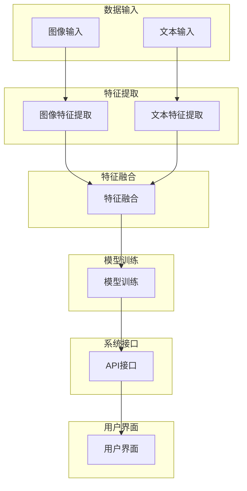
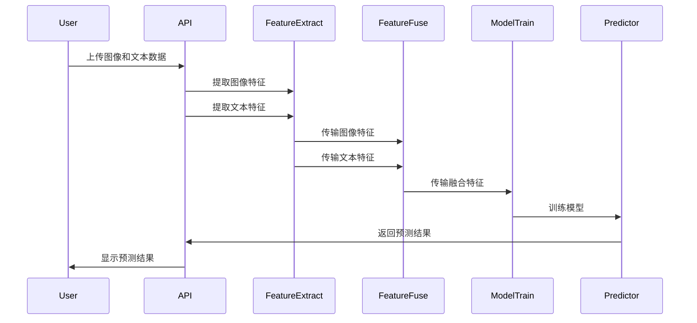

                 

### 摘要

本文旨在探讨计算机视觉技术与语言模型（LLM）的深度融合，及其在拓展LLM感知能力方面的应用。随着人工智能技术的迅猛发展，计算机视觉和自然语言处理（NLP）已成为两个关键领域。计算机视觉以其强大的图像处理和识别能力，成为智能视觉系统的基础；而LLM则在文本理解和生成方面展现了卓越的性能。本文首先介绍了计算机视觉和LLM的基本概念、背景以及它们在各自领域的应用，然后深入分析了两者融合的原理和优势。接下来，通过具体算法原理和模型设计，展示了计算机视觉与LLM融合的详细过程。此外，本文还从系统架构设计与实现、项目实战等多个角度，对计算机视觉与LLM融合技术进行了全面剖析。最后，本文总结了最佳实践和未来发展方向，为读者提供了实用的指导和建议。通过本文的阅读，读者将全面了解计算机视觉与LLM融合的前沿技术，掌握其实际应用方法，为相关领域的研究和开发提供有力支持。

### 第一部分：引言

#### 第1章：计算机视觉与LLM融合背景

##### 1.1 问题背景

计算机视觉（Computer Vision）和语言模型（Language Model，简称LLM）作为人工智能领域的两个重要分支，近年来取得了显著的发展。计算机视觉技术通过算法和模型，使计算机具备从图像或视频中提取信息、理解和解释图像内容的能力。这一技术的发展，不仅在自动驾驶、医疗影像诊断、安全监控等领域发挥了重要作用，还极大地推动了人机交互和智能系统的普及。另一方面，LLM则通过统计模型或深度学习算法，对大规模文本数据进行分析和处理，从而生成自然语言响应或进行文本生成。LLM在机器翻译、文本摘要、问答系统等方面展现了强大的能力，已经成为自然语言处理领域的主流技术。

在人工智能发展的历程中，计算机视觉和LLM各自取得了令人瞩目的成就。计算机视觉技术从最初的图像识别、目标检测，发展到如今的高级任务如图像生成、图像风格迁移等，其应用范围不断扩大。而LLM则经历了从简单的词汇预测到复杂的语义理解、情感分析等阶段的演变。两者在各自领域的发展，不仅推动了人工智能技术的进步，也带来了许多实际应用场景。

然而，随着应用需求的不断增长，计算机视觉和LLM也面临着一些挑战。计算机视觉技术虽然在图像处理方面表现优异，但在处理复杂场景和动态环境时仍存在一定的局限性。例如，在复杂的背景中识别目标，或者在光线变化较大的情况下保持识别准确性，这些都是计算机视觉需要解决的关键问题。另一方面，LLM虽然在文本理解和生成方面具有优势，但在处理与图像相关的任务时，其感知能力有限，无法直接利用图像信息进行决策。

为了克服这些挑战，计算机视觉与LLM的融合成为一种新的研究热点。通过将计算机视觉与LLM相结合，可以充分利用两者的优势，提升系统的综合性能。计算机视觉技术可以提供丰富的图像信息，而LLM则可以对这些信息进行深入理解和分析，从而实现更加智能和高效的图像处理和文本生成。

##### 1.2 问题描述

计算机视觉与LLM融合的潜在问题与挑战主要表现在以下几个方面：

1. **数据集的多样性与一致性**：计算机视觉和LLM在不同任务上可能需要不同类型和来源的数据集。如何保证数据集的多样性和一致性，是一个重要的挑战。特别是在融合过程中，不同数据集之间的差异可能会影响系统的性能。

2. **计算资源的消耗**：计算机视觉与LLM融合通常需要大量的计算资源。特别是在处理高分辨率图像或大规模文本数据时，计算资源的消耗更大。如何优化算法和模型，降低计算复杂度，是另一个关键问题。

3. **模型的可解释性**：计算机视觉与LLM融合后，模型的决策过程可能变得复杂，难以解释。这给系统的可解释性和透明性带来了挑战。特别是在应用场景中，用户可能需要了解模型的决策过程，以便进行调试和优化。

4. **算法的稳定性与泛化能力**：计算机视觉与LLM融合的算法在处理不同任务和场景时，可能表现出不同的稳定性。如何提高算法的稳定性和泛化能力，是另一个重要的研究问题。

5. **实时性**：在实际应用中，许多场景要求系统具备实时处理能力。计算机视觉与LLM融合技术需要满足实时性要求，以适应快速变化的场景。

##### 1.3 问题解决

为了解决上述问题，研究者们提出了多种计算机视觉与LLM融合的方法和技术。以下是一些常见的方法和路径：

1. **特征融合**：通过将计算机视觉提取的特征与LLM生成的文本特征进行融合，可以提升系统的整体性能。例如，使用多层感知器（MLP）或卷积神经网络（CNN）对图像进行特征提取，然后与LLM的输出进行拼接，再通过全连接层进行融合。

2. **模型融合**：通过将计算机视觉模型和LLM模型进行融合，可以实现更强大的图像理解和文本生成能力。例如，使用深度神经网络（DNN）或变分自编码器（VAE）将两个模型整合在一起，共同处理图像和文本数据。

3. **多模态学习**：通过多模态学习（Multimodal Learning）技术，将图像和文本数据同时输入到同一模型中，可以提升系统的感知能力和处理效率。例如，使用Siamese网络或对比学习（Contrastive Learning）技术，对图像和文本进行联合训练。

4. **迁移学习**：通过迁移学习（Transfer Learning）技术，可以将计算机视觉模型和LLM模型在不同任务之间进行迁移，提高模型的泛化能力。例如，使用预训练的计算机视觉模型和LLM模型，对新任务进行微调。

5. **强化学习**：通过强化学习（Reinforcement Learning）技术，可以训练计算机视觉与LLM融合的模型，使其在复杂环境中进行决策。例如，使用Q学习（Q-Learning）或深度确定性策略梯度（DDPG）算法，训练模型在图像识别和文本生成任务中进行交互。

通过上述方法和技术的探索和实践，计算机视觉与LLM融合技术逐步解决了上述问题，为人工智能应用带来了新的机遇和挑战。

##### 1.4 边界与外延

计算机视觉与LLM融合的应用领域非常广泛，涵盖了多个行业和场景。以下是一些典型的应用领域：

1. **智能监控与安防**：计算机视觉技术可以用于视频监控，实现对实时视频流的分析和识别。结合LLM技术，可以提升系统的智能水平，实现基于图像的文本生成和场景理解。

2. **医疗影像诊断**：计算机视觉技术可以用于医疗影像的分析和识别，如X光片、CT扫描和MRI等。结合LLM技术，可以生成详细的诊断报告，辅助医生进行疾病诊断和治疗决策。

3. **自动驾驶**：计算机视觉技术是自动驾驶系统的重要组成部分，用于识别道路标志、行人、车辆等。结合LLM技术，可以提升自动驾驶系统的感知能力和决策能力，实现更智能的驾驶体验。

4. **人机交互**：计算机视觉与LLM融合技术可以用于智能客服、虚拟助手等应用，通过图像和文本的交互，提供更自然和高效的服务。

5. **智能推荐系统**：计算机视觉技术可以用于图像内容的识别和分析，结合LLM技术，可以生成个性化的推荐文本，提升推荐系统的准确性。

6. **艺术创作**：计算机视觉与LLM融合技术可以用于图像生成和文本生成，实现艺术创作的自动化和智能化，如生成独特的艺术画作、故事和音乐。

这一技术的变革性影响不仅限于应用领域，还推动了人工智能技术的发展和创新。通过计算机视觉与LLM的深度融合，可以开发出更加智能和高效的系统，为各行业带来新的发展机遇。同时，这也对相关技术提出了更高的要求，推动了计算机视觉、自然语言处理和人工智能领域的不断进步。

##### 1.5 概念结构与核心要素组成

计算机视觉（Computer Vision）与语言模型（LLM）的融合，涉及到多个核心概念和要素。以下是这两个领域的关键概念及其组成要素的详细解析：

**计算机视觉的关键概念：**

1. **图像处理**：图像处理是计算机视觉的基础，包括图像的采集、预处理、增强和特征提取等步骤。常用的图像处理技术包括滤波、边缘检测、图像分割和形态学操作。

2. **特征提取**：特征提取是将原始图像转换为可被计算机识别和理解的表示。常用的特征提取方法有SIFT、SURF、HOG、Haar特征等。

3. **目标检测**：目标检测是计算机视觉中的重要任务，目的是从图像中识别出特定的目标物体。常用的目标检测算法有YOLO、SSD、Faster R-CNN等。

4. **图像分类**：图像分类是将图像分配到不同的类别中。常用的图像分类算法包括基于传统机器学习的算法（如SVM、K-NN）和深度学习算法（如CNN、ResNet）。

**语言模型（LLM）的核心要素：**

1. **自然语言处理（NLP）**：NLP是LLM的核心技术，包括分词、词性标注、句法分析、语义分析和情感分析等。

2. **语言生成**：语言生成是LLM的重要功能，可以生成流畅、自然的文本。常用的生成方法包括基于规则的生成、统计模型生成和深度学习生成。

3. **上下文理解**：上下文理解是LLM的关键能力，能够根据上下文信息生成相关的内容。这通常涉及到语义理解和语境分析。

4. **多模态学习**：多模态学习是LLM处理图像和文本等不同模态数据的能力，通过融合多种模态的信息，提升模型的感知和理解能力。

**计算机视觉与LLM融合的关键要素：**

1. **多模态数据融合**：通过将图像和文本数据融合，实现更丰富的信息表示。例如，使用图像特征和文本特征进行拼接，或通过多模态学习算法进行联合训练。

2. **协同优化**：通过联合优化计算机视觉模型和LLM模型，提升系统的整体性能。例如，使用梯度下降法或基于梯度的优化算法，对两个模型进行联合训练。

3. **模型解释性**：提高模型的可解释性，使决策过程更加透明和可信。例如，通过可视化技术展示图像特征和文本特征，以及它们在融合过程中的作用。

4. **实时性**：实现实时数据处理和响应，以满足实际应用的需求。例如，通过优化算法和硬件加速技术，提高系统的处理速度。

通过上述核心概念和要素的解析，我们可以更深入地理解计算机视觉与LLM融合的原理和技术，为后续的算法原理和系统设计提供理论基础。

#### 第二部分：核心概念与原理

#### 第2章：计算机视觉技术原理

##### 2.1 计算机视觉概述

计算机视觉（Computer Vision）是指使计算机具备从图像或视频中提取信息、理解和解释图像内容的能力。这一领域的研究起源于20世纪60年代，随着计算机性能的不断提升和图像处理算法的进步，计算机视觉技术逐渐成为人工智能领域的重要组成部分。

**定义与历史：**

计算机视觉的定义可以从多个角度进行理解。广义上，它包括所有使计算机能够“看到”和理解图像或视频内容的技术和方法。狭义上，计算机视觉主要关注图像识别、目标检测、图像分割、姿态估计等具体任务。

计算机视觉的历史可以追溯到20世纪60年代的早期探索阶段，当时的研究主要集中在图像处理和图像识别的基础技术上。随着计算机硬件性能的提升和算法的改进，计算机视觉逐渐从理论研究走向实际应用。20世纪80年代，基于规则的方法和知识表示技术成为研究热点；20世纪90年代，基于统计的学习方法开始兴起，如支持向量机（SVM）和决策树。进入21世纪，深度学习技术的崛起极大地推动了计算机视觉的发展，卷积神经网络（CNN）等深度学习模型在图像分类、目标检测、图像生成等领域取得了显著成果。

**研究内容与应用领域：**

计算机视觉的研究内容非常广泛，涵盖了从图像处理、特征提取到高级任务如图像生成、图像风格迁移等。主要研究内容包括：

1. **图像处理**：图像处理是计算机视觉的基础，包括图像的采集、预处理、增强和特征提取等步骤。常用的图像处理技术包括滤波、边缘检测、图像分割和形态学操作。

2. **特征提取**：特征提取是将原始图像转换为可被计算机识别和理解的表示。常用的特征提取方法有SIFT、SURF、HOG、Haar特征等。

3. **目标检测**：目标检测是计算机视觉中的重要任务，目的是从图像中识别出特定的目标物体。常用的目标检测算法有YOLO、SSD、Faster R-CNN等。

4. **图像分类**：图像分类是将图像分配到不同的类别中。常用的图像分类算法包括基于传统机器学习的算法（如SVM、K-NN）和深度学习算法（如CNN、ResNet）。

5. **图像生成**：图像生成是计算机视觉的另一个重要研究方向，旨在通过算法生成新的图像或图像内容。常用的生成方法包括生成对抗网络（GAN）、变分自编码器（VAE）等。

6. **图像风格迁移**：图像风格迁移是将一种图像的内容（如人物）与另一种图像的风格（如风景画）进行结合，生成具有特定风格的新图像。常用的算法有CycleGAN、StyleGAN等。

计算机视觉的应用领域非常广泛，涵盖了多个行业和场景。以下是一些典型的应用领域：

1. **智能监控与安防**：计算机视觉技术可以用于视频监控，实现对实时视频流的分析和识别。结合自然语言处理（NLP）技术，可以提升系统的智能水平，实现基于图像的文本生成和场景理解。

2. **医疗影像诊断**：计算机视觉技术可以用于医疗影像的分析和识别，如X光片、CT扫描和MRI等。结合NLP技术，可以生成详细的诊断报告，辅助医生进行疾病诊断和治疗决策。

3. **自动驾驶**：计算机视觉技术是自动驾驶系统的重要组成部分，用于识别道路标志、行人、车辆等。结合NLP技术，可以提升自动驾驶系统的感知能力和决策能力，实现更智能的驾驶体验。

4. **人机交互**：计算机视觉与NLP融合技术可以用于智能客服、虚拟助手等应用，通过图像和文本的交互，提供更自然和高效的服务。

5. **智能推荐系统**：计算机视觉技术可以用于图像内容的识别和分析，结合NLP技术，可以生成个性化的推荐文本，提升推荐系统的准确性。

6. **艺术创作**：计算机视觉与NLP融合技术可以用于图像生成和文本生成，实现艺术创作的自动化和智能化，如生成独特的艺术画作、故事和音乐。

##### 2.2 图像处理基础

图像处理（Image Processing）是计算机视觉的基础，涉及对图像进行采集、预处理、增强和特征提取等多个步骤。以下将详细探讨图像处理的基础概念和常见技术。

**基础概念：**

1. **像素（Pixel）**：像素是图像处理中的基本单位，表示图像的最小单元。每个像素包含特定的颜色和亮度信息。

2. **分辨率（Resolution）**：分辨率是指图像中像素的数量，通常用水平和垂直像素数表示。高分辨率图像包含更多的像素，因此可以提供更详细的图像细节。

3. **颜色空间（Color Space）**：颜色空间用于描述图像中的颜色信息。常见的颜色空间包括RGB（红绿蓝）、HSV（色相、饱和度、亮度）和YUV等。

4. **图像滤波（Image Filtering）**：图像滤波是一种用于去除图像噪声和增强图像细节的技术。常见的滤波器包括卷积滤波器、均值滤波器和高斯滤波器等。

5. **边缘检测（Edge Detection）**：边缘检测是用于识别图像中亮度变化的区域，从而提取图像的边缘信息。常用的边缘检测算法有Sobel算子、Canny算子和Laplacian算子等。

**处理技术：**

1. **图像增强（Image Enhancement）**：图像增强旨在改善图像的质量和可读性，使其更适合后续处理。常用的增强技术包括对比度增强、亮度调整和锐化等。

2. **图像分割（Image Segmentation）**：图像分割是将图像分为多个区域或对象的过程，目的是提取感兴趣的目标。常用的分割方法有基于阈值的分割、区域增长法和形态学操作等。

3. **特征提取（Feature Extraction）**：特征提取是将原始图像转换为可被计算机识别和理解的表示。常用的特征提取方法包括SIFT、SURF、HOG（直方图导向特征）和Haar特征等。

4. **形态学操作（Morphological Operations）**：形态学操作是图像处理中的一种技术，用于分析图像的形状和结构。常见的形态学操作包括膨胀（Dilation）、腐蚀（Erosion）、开运算（Opening）和闭运算（Closing）等。

**应用实例：**

1. **人脸识别**：人脸识别是计算机视觉中的一个重要应用，通过图像处理技术提取人脸特征，然后进行分类和识别。常见的算法包括基于特征的算法（如Eigenfaces）和深度学习算法（如卷积神经网络）。

2. **图像分类**：图像分类是将图像分配到不同的类别中，如动物、植物或交通标志等。通过图像处理技术提取图像特征，再使用分类算法进行分类。常用的分类算法包括支持向量机（SVM）、决策树和深度神经网络等。

3. **图像去噪**：图像去噪是用于去除图像中的噪声和干扰，提高图像质量。通过图像处理技术对噪声进行检测和去除，常用的方法包括均值滤波、中值滤波和高斯滤波等。

4. **图像修复**：图像修复是用于修复图像中的缺陷或损坏部分，恢复图像的完整性和清晰度。通过图像处理技术对受损区域进行识别和修复，常用的方法包括补全缺失部分、平滑图像和纹理填充等。

通过上述基础概念和技术的介绍，我们可以更好地理解图像处理在计算机视觉中的应用，为后续的特征提取和高级任务奠定基础。

##### 2.3 特征提取与降维

特征提取与降维是计算机视觉中的关键步骤，旨在将高维图像数据转换为低维且具有代表性的特征向量，以简化后续处理的复杂度并提高模型的性能。以下是关于特征提取和降维技术的详细介绍。

**特征提取方法：**

1. **SIFT（尺度不变特征变换）**：SIFT是一种经典的局部特征提取方法，通过检测图像中的关键点并计算其方向特征，生成具有尺度不变性和旋转不变性的特征向量。SIFT在图像识别和目标检测等领域表现优异。

2. **SURF（加速稳健特征）**：SURF是基于SIFT的一种改进算法，通过使用积分图像加速计算过程，提高特征提取的效率。SURF同样具备尺度不变性和旋转不变性，适用于大规模图像数据的处理。

3. **HOG（直方图导向特征）**：HOG是一种基于图像局部区域的梯度方向直方图特征提取方法。通过计算图像像素的梯度方向和强度，生成具有方向分布特征的向量，适用于行人检测和车辆检测等任务。

4. **Haar特征**：Haar特征是一种基于积分图的高速特征提取方法，通过计算图像中目标区域与背景区域的差异来生成特征向量。Haar特征广泛应用于人脸检测和物体识别。

**降维技术：**

1. **主成分分析（PCA）**：PCA是一种常用的降维技术，通过将高维数据投影到主成分空间，保留主要信息并去除冗余。PCA通过求解协方差矩阵的特征值和特征向量，实现对数据的线性变换。

2. **线性判别分析（LDA）**：LDA旨在将高维数据投影到具有最佳分类效果的低维空间。通过最大化类间散度并最小化类内散度，LDA可以有效提高分类模型的性能。

3. **t-SNE（t-Distributed Stochastic Neighbor Embedding）**：t-SNE是一种非线性的降维技术，通过构建相似性矩阵并优化局部结构的相似性，将高维数据映射到二维或三维空间。t-SNE适用于可视化高维数据的分布和结构。

4. **自动编码器（Autoencoder）**：自动编码器是一种基于神经网络的降维方法，通过训练一个编码器和解码器网络，将高维数据压缩到低维表示，再通过解码器还原数据。自动编码器可以有效捕获数据的低维特征，适用于特征提取和数据降维。

**特征提取与降维的应用实例：**

1. **人脸识别**：在人脸识别任务中，通过特征提取技术提取人脸图像的关键特征，再通过降维技术将高维特征向量压缩到低维空间。例如，使用SIFT或HOG提取人脸特征，然后通过PCA进行降维处理。

2. **目标检测**：在目标检测任务中，通过特征提取提取图像中的目标特征，再通过降维技术减少特征维度，提高检测模型的计算效率和准确性。例如，使用HOG特征提取目标区域，然后通过LDA进行降维处理。

3. **图像分类**：在图像分类任务中，通过特征提取提取图像的特征向量，再通过降维技术减少特征维度，提高分类模型的性能。例如，使用Haar特征提取图像特征，然后通过t-SNE进行降维处理。

4. **图像去噪**：在图像去噪任务中，通过特征提取提取图像的有用信息，再通过降维技术去除噪声，恢复图像的清晰度。例如，使用自动编码器提取图像特征，然后通过降维处理去除噪声。

通过上述特征提取和降维技术的介绍，我们可以更好地理解这些方法在计算机视觉中的应用，为提升模型性能和简化数据处理奠定基础。

##### 2.4 模型构建与优化

在计算机视觉领域，模型构建与优化是关键环节，直接影响到模型的性能和应用效果。以下是关于模型构建与优化技术的详细介绍。

**常见模型：**

1. **卷积神经网络（CNN）**：CNN是计算机视觉中最为流行的模型之一，通过卷积层、池化层和全连接层的组合，实现对图像的层次化特征提取和分类。CNN在图像分类、目标检测和语义分割等领域取得了显著成果。

2. **递归神经网络（RNN）**：RNN是一种适用于处理序列数据的神经网络，通过记忆单元对历史信息进行编码和传递。RNN在视频处理、语音识别和时间序列分析等领域具有广泛的应用。

3. **生成对抗网络（GAN）**：GAN由生成器和判别器两个神经网络组成，通过对抗训练生成高质量的数据。GAN在图像生成、图像修复和图像风格迁移等领域展现了强大的能力。

4. **变分自编码器（VAE）**：VAE是一种基于概率模型的生成模型，通过编码器和解码器将数据映射到潜在空间，并生成新的数据。VAE在图像去噪、图像超分辨率和图像生成等方面具有广泛应用。

**模型优化技术：**

1. **随机梯度下降（SGD）**：SGD是最常用的优化算法之一，通过随机选择一小部分样本计算梯度，并更新模型参数。SGD可以用于训练各种神经网络模型，但其收敛速度较慢。

2. **Adam优化器**：Adam优化器是一种结合SGD和RMSProp优化的自适应学习率优化算法。通过自适应调整学习率，Adam优化器在许多任务中表现优异。

3. **迁移学习**：迁移学习是一种利用预训练模型进行新任务训练的方法，通过在现有模型的基础上进行微调，提高新任务的性能。迁移学习可以显著减少训练时间并提高模型准确性。

4. **数据增强**：数据增强是通过各种变换（如旋转、缩放、翻转等）生成新的训练样本，以增加训练数据的多样性和丰富度。数据增强可以防止模型过拟合，提高模型的泛化能力。

**应用实例：**

1. **图像分类**：在图像分类任务中，通过构建CNN模型对图像进行特征提取和分类。例如，使用ResNet-50进行图像分类，并通过迁移学习和数据增强提高模型性能。

2. **目标检测**：在目标检测任务中，通过构建Faster R-CNN或YOLO模型，实现对图像中的目标进行检测和分类。例如，使用Faster R-CNN结合ResNet-50 backbone进行目标检测，并通过迁移学习和数据增强优化模型。

3. **图像生成**：在图像生成任务中，通过构建GAN模型生成新的图像内容。例如，使用CycleGAN生成图像，通过迁移学习将不同风格或领域的图像内容进行融合。

4. **图像修复**：在图像修复任务中，通过构建VAE模型对图像进行去噪和修复。例如，使用VAE进行图像超分辨率修复，通过迁移学习和数据增强优化模型效果。

通过上述模型构建与优化技术的介绍，我们可以更好地理解这些方法在计算机视觉中的应用，为提升模型性能和解决实际问题提供有力支持。

##### 2.5 计算机视觉与LLM的融合原理

计算机视觉（Computer Vision）与语言模型（Language Model，简称LLM）的融合，旨在充分利用两者的优势，实现更强大的图像理解和文本生成能力。以下将详细介绍计算机视觉与LLM融合的基本原理和方法。

**融合方法：**

1. **多模态数据融合**：多模态数据融合是将图像和文本数据同时输入到同一模型中，以实现更丰富的信息表示。例如，使用多层感知器（MLP）或卷积神经网络（CNN）对图像进行特征提取，同时使用循环神经网络（RNN）或Transformer对文本进行处理，然后将两种特征进行拼接，再通过全连接层进行融合。

2. **协同训练**：协同训练是指同时训练计算机视觉模型和LLM模型，使其在融合过程中互相优化。例如，使用Siamese网络或对比学习（Contrastive Learning）技术，对图像和文本进行联合训练，以提升系统的整体性能。

3. **多任务学习**：多任务学习是指在一个统一的框架下同时解决多个任务，例如，在图像分类任务中同时进行文本生成，或者在文本生成任务中同时进行图像识别。通过多任务学习，可以充分利用图像和文本之间的相关性，提高模型的泛化能力。

**融合优势与挑战：**

1. **融合优势：**
   - **信息互补**：计算机视觉可以提供丰富的图像信息，而LLM可以对这些信息进行深入理解和分析，实现图像和文本信息的互补。
   - **增强性能**：通过融合计算机视觉和LLM的优势，可以显著提升系统的性能，特别是在复杂场景和动态环境下的图像理解和文本生成任务。
   - **拓展应用**：融合技术可以拓展计算机视觉和LLM的应用领域，如智能监控、医疗影像诊断、人机交互等，带来更多的实际应用价值。

2. **融合挑战：**
   - **数据集的多样性与一致性**：计算机视觉和LLM在不同任务上可能需要不同类型和来源的数据集，如何保证数据集的多样性和一致性，是一个重要的挑战。
   - **计算资源的消耗**：计算机视觉与LLM融合通常需要大量的计算资源，特别是在处理高分辨率图像和大规模文本数据时，如何优化算法和模型，降低计算复杂度，是另一个关键问题。
   - **模型的可解释性**：融合后的模型可能变得复杂，难以解释。如何提高模型的可解释性，使其决策过程更加透明和可信，是一个亟待解决的问题。
   - **算法的稳定性与泛化能力**：融合算法在不同任务和场景下的稳定性可能不同，如何提高算法的稳定性和泛化能力，是另一个重要的研究问题。
   - **实时性**：在实际应用中，许多场景要求系统具备实时处理能力。计算机视觉与LLM融合技术需要满足实时性要求，以适应快速变化的场景。

**融合案例：**

1. **图像描述生成**：利用计算机视觉技术提取图像特征，然后通过LLM生成图像描述。例如，在图像分类任务中，使用CNN提取图像特征，然后通过RNN或Transformer生成图像描述。

2. **视频字幕生成**：利用计算机视觉技术对视频帧进行识别和分类，然后通过LLM生成视频字幕。例如，在视频监控任务中，使用CNN提取视频帧特征，然后通过RNN生成视频字幕。

3. **医疗影像诊断**：利用计算机视觉技术对医疗影像进行分析和识别，然后通过LLM生成诊断报告。例如，在医学影像诊断任务中，使用CNN提取影像特征，然后通过RNN生成诊断报告。

通过上述融合原理和方法，计算机视觉与LLM的融合技术为人工智能应用带来了新的机遇和挑战，推动了计算机视觉和自然语言处理领域的不断进步。

#### 第3章：语言模型（LLM）基础

##### 3.1 LLM概述

语言模型（Language Model，简称LLM）是自然语言处理（Natural Language Processing，简称NLP）的核心技术之一，通过统计模型或深度学习算法，对大规模文本数据进行分析和处理，从而生成自然语言响应或进行文本生成。LLM在机器翻译、文本摘要、问答系统、对话系统等领域展现了卓越的性能，成为NLP领域的重要研究热点。

**定义与历史：**

LLM的定义可以从多个角度进行理解。广义上，LLM是指能够对自然语言文本进行建模和预测的模型，通过学习大量文本数据，生成符合语言规则和语义逻辑的文本。狭义上，LLM通常指基于深度学习技术的语言模型，如循环神经网络（RNN）、Transformer等。

LLM的历史可以追溯到20世纪50年代，当时的研究主要集中在语法分析和语义理解等基础技术上。随着计算能力和数据资源的不断提升，LLM逐渐从基于规则的方法发展为基于统计模型和深度学习的方法。早期的LLM主要基于隐马尔可夫模型（HMM）和朴素贝叶斯（Naive Bayes）等统计方法，如N-gram模型。随着深度学习技术的发展，RNN、Long Short-Term Memory（LSTM）和Transformer等深度学习模型逐渐成为主流的LLM架构。特别是Transformer模型的出现，使得LLM在生成文本的流畅性和语义理解方面取得了显著突破。

**研究内容与应用领域：**

LLM的研究内容涵盖文本生成、文本理解、语言推理等多个方面。以下是LLM的主要研究内容和应用领域：

1. **文本生成**：文本生成是LLM的核心功能之一，包括自然语言文本的生成、对话系统的回复生成、文本摘要生成等。通过学习大量的文本数据，LLM可以生成具有自然语言流畅性和语义一致性的文本。

2. **文本理解**：文本理解是指对文本内容进行语义分析和推理，包括词性标注、句法分析、语义角色标注、情感分析等。LLM通过深度学习模型对文本进行层次化特征提取和语义理解，实现对文本内容的准确解析。

3. **语言推理**：语言推理是指根据文本信息进行逻辑推理和判断，包括常识推理、因果推理、逻辑推理等。LLM通过学习大量文本数据中的逻辑关系和语义规则，实现对文本信息的逻辑推理和判断。

4. **机器翻译**：机器翻译是LLM的重要应用领域之一，通过将一种语言的文本翻译成另一种语言。LLM通过学习双语语料库，实现对源语言文本的语义理解和目标语言文本的生成，提高机器翻译的准确性和流畅性。

5. **文本摘要**：文本摘要是从长文本中提取关键信息，生成简明扼要的摘要。LLM通过学习大量文本摘要数据，实现对文本的语义理解和摘要生成，提高文本摘要的准确性和可读性。

6. **问答系统**：问答系统是指通过自然语言交互，回答用户提出的问题。LLM通过学习问答对话数据，实现对问题的理解、答案的生成和对话的维持，提供智能化的问答服务。

7. **对话系统**：对话系统是指通过语音或文本与用户进行交互，实现人机对话。LLM在对话系统中的应用包括聊天机器人、虚拟助手、智能客服等，通过自然语言理解和生成，提供更加自然和高效的交互体验。

8. **文本分类**：文本分类是将文本数据分配到不同的类别中，如新闻分类、情感分析等。LLM通过学习分类数据和分类规则，实现对文本数据的准确分类。

通过上述研究内容和应用领域的介绍，我们可以更深入地了解LLM的基本概念和应用价值，为后续的算法原理和应用实例提供理论基础。

##### 3.2 语言模型的结构

语言模型（Language Model，简称LLM）的结构是其实现文本生成和语义理解的核心。以下将详细探讨LLM的基本结构、演化历程及其在文本生成中的关键作用。

**基本结构：**

1. **输入层**：输入层是LLM的起点，负责接收文本数据。在基于深度学习的方法中，通常将文本数据转换为词向量表示，如Word2Vec、GloVe等。这些词向量可以捕捉文本的语义信息，为后续处理提供基础。

2. **编码层**：编码层是LLM的核心部分，负责对输入文本进行编码，提取文本的语义特征。常见的编码层结构包括循环神经网络（RNN）、长短时记忆网络（LSTM）和Transformer等。RNN和LSTM能够捕捉文本中的序列依赖关系，而Transformer通过自注意力机制（Self-Attention）实现了全局依赖建模，在文本生成和语义理解方面表现优异。

3. **解码层**：解码层是LLM生成文本的关键部分，负责根据编码层的输出生成文本。在生成过程中，解码层通常采用贪心策略（Greedy Decoding）或抽样策略（Sampling），从输入层逐步生成每个词或字符。贪心策略选择概率最高的词或字符作为下一个输出，而抽样策略则从概率分布中随机选择输出，以避免生成过于刻板或重复的文本。

4. **输出层**：输出层负责将解码层生成的文本转换为可读的自然语言。在生成文本时，输出层通常会对生成的文本进行后处理，如去除无关字符、调整语法结构等，以生成更加自然和流畅的文本。

**演化历程：**

LLM的结构经历了多个阶段的演变，从早期的基于统计模型的方法发展到现代的深度学习方法。以下是LLM的主要演化历程：

1. **基于N-gram的模型**：早期的LLM主要基于N-gram模型，如一元语法模型（Unigram）、二元语法模型（Bigram）和三元语法模型（Trigram）等。这些模型通过统计文本数据中单词的先后顺序，预测下一个单词的概率。然而，N-gram模型在长文本生成和语义理解方面存在局限性，难以捕捉文本中的复杂依赖关系。

2. **基于统计学习的方法**：随着统计学习技术的发展，如隐马尔可夫模型（HMM）和朴素贝叶斯（Naive Bayes）等，LLM开始引入概率模型进行文本生成和分类。这些模型通过学习文本数据的统计特征，提高文本生成的准确性和语义理解的鲁棒性。

3. **基于神经网络的模型**：随着深度学习的兴起，基于神经网络的LLM逐渐成为主流。RNN和LSTM通过引入记忆单元，能够更好地捕捉文本中的序列依赖关系，提高了文本生成的流畅性和语义一致性。特别是LSTM模型，通过解决传统RNN的梯度消失问题，在长文本生成任务中表现出色。

4. **Transformer模型**：Transformer模型的出现标志着LLM发展的一个重要里程碑。Transformer通过引入自注意力机制，实现了对全局依赖关系的建模，显著提高了文本生成和语义理解的性能。特别是基于Transformer的BERT、GPT等模型，在多个NLP任务中取得了优异的成绩，推动了LLM的发展。

**在文本生成中的关键作用：**

1. **文本流畅性**：LLM能够通过学习大量文本数据，生成具有自然语言流畅性的文本。解码层在生成过程中，能够根据上下文信息选择合适的词或字符，避免生成生硬或重复的文本。

2. **语义一致性**：LLM通过编码层提取文本的语义特征，确保生成的文本与原始文本保持一致。在文本生成任务中，LLM能够理解文本中的语义关系和逻辑结构，生成符合语义一致性的文本。

3. **多样性**：LLM在生成文本时，可以通过抽样策略或引入噪声，生成多样化且具有创意的文本。这使得LLM在生成文本摘要、对话系统等任务中，能够提供丰富多样的输出。

4. **可控性**：通过调整LLM的结构和参数，可以实现文本生成的可控性。例如，通过限制生成文本的长度、调整生成文本的风格等，使LLM能够满足特定的生成需求。

通过上述对LLM结构的介绍，我们可以更好地理解其在文本生成中的关键作用，为后续的应用实例和实战提供理论基础。

##### 3.3 语言模型的训练与优化

语言模型的训练与优化是构建高效和准确的LLM的关键步骤。以下是关于训练方法、优化技术和在实际应用中的效果评估的详细解析。

**训练方法：**

1. **预训练**：预训练是当前LLM的主流训练方法，通过在大规模文本数据上进行预训练，使模型能够捕捉到通用语言特征。预训练过程通常包括以下步骤：
   - **数据收集**：收集大量高质量、多样化的文本数据，如新闻、小说、对话等。
   - **数据预处理**：对文本数据进行清洗、分词、去停用词等预处理操作，将其转换为模型可处理的格式。
   - **构建词汇表**：将文本数据中的单词映射到唯一的向量表示，通常使用词嵌入技术，如Word2Vec、GloVe等。
   - **训练模型**：使用随机梯度下降（SGD）或其变种（如Adam）优化模型参数，通过反向传播算法计算梯度，更新模型权重。

2. **微调**：微调是指将预训练的LLM在特定任务的数据上进行进一步训练，以适应特定应用场景。微调过程通常包括以下步骤：
   - **任务数据收集**：收集与特定任务相关的高质量数据集，如问答系统、文本分类等。
   - **数据预处理**：对任务数据进行与预训练相同的预处理操作。
   - **调整学习率**：在微调过程中，通常需要降低学习率，以避免模型参数的过大波动。
   - **训练模型**：在特定任务数据集上继续训练模型，通过迭代更新模型参数，提高模型在特定任务上的性能。

**优化技术：**

1. **学习率调整**：学习率是模型训练中的一个关键参数，直接影响训练过程的速度和效果。常用的学习率调整方法包括：
   - **固定学习率**：在训练过程中保持学习率不变。
   - **递减学习率**：随着训练的进行，逐步减小学习率，以避免过拟合。
   - **学习率衰减**：在预训练完成后，将学习率衰减到一个较小的值，进行微调训练。

2. **正则化技术**：正则化技术用于防止模型过拟合，提高模型的泛化能力。常用的正则化技术包括：
   - **L1正则化**：在损失函数中加入L1范数项，通过惩罚模型参数的稀疏性，减少模型复杂度。
   - **L2正则化**：在损失函数中加入L2范数项，通过惩罚模型参数的平方和，减少模型复杂度。
   - **Dropout**：在训练过程中，随机丢弃一部分神经元，以防止神经网络模型在训练过程中形成依赖关系。

3. **批量归一化（Batch Normalization）**：批量归一化是一种用于加速训练和改善模型稳定性的技术，通过将每一批数据的特征值标准化，减少内部协变量转移，提高训练效果。

**效果评估：**

1. **准确率（Accuracy）**：准确率是最常用的评估指标，用于衡量模型在分类任务上的正确分类率。准确率越高，表示模型分类性能越好。

2. **召回率（Recall）**：召回率是指模型正确识别出正类样本的比例。在二分类任务中，召回率与误检率（False Negative Rate）互为补充。

3. **精确率（Precision）**：精确率是指模型识别出的正类样本中，实际为正类的比例。精确率与误判率（False Positive Rate）互为补充。

4. **F1值（F1 Score）**：F1值是精确率和召回率的加权平均值，用于综合评估模型在二分类任务中的性能。F1值越高，表示模型在分类任务中表现越好。

5. **BLEU评分**：BLEU（Bilingual Evaluation Understudy）评分是一种常用于评估机器翻译质量的评分方法，通过计算模型生成的翻译文本与参考翻译文本之间的相似度，评估翻译的质量。

**实际应用中的效果评估实例：**

1. **文本分类**：在文本分类任务中，可以通过准确率、召回率和F1值等指标评估模型在不同类别上的分类性能。例如，在情感分析任务中，评估模型对正面评论和负面评论的分类准确性。

2. **机器翻译**：在机器翻译任务中，可以通过BLEU评分评估模型生成的翻译文本与人工翻译的相似度。例如，在英译中翻译任务中，评估模型生成的中文文本的流畅性和准确性。

3. **问答系统**：在问答系统任务中，可以通过评估模型对问题的理解和回答的准确性，评估模型在信息检索和回答生成方面的效果。例如，在问答对话系统中，评估模型对用户问题的理解能力和生成的回答质量。

通过上述训练方法、优化技术和效果评估的介绍，我们可以更好地理解语言模型的训练和优化过程，为构建高效和准确的LLM提供理论支持和实践指导。

##### 3.4 LLM在计算机视觉中的应用

语言模型（LLM）在计算机视觉中的应用，是一个日益受到关注的研究方向，旨在利用LLM的强大文本处理能力，提升计算机视觉系统的理解能力和表达能力。以下将探讨LLM在计算机视觉中的几个关键应用场景，并结合实际案例分析，展示LLM在图像识别、图像描述生成和问答系统等任务中的表现。

**应用场景：**

1. **图像识别**：LLM在图像识别任务中的应用，主要是通过将文本描述与图像特征结合，提升模型对图像内容的理解能力。例如，在一个图像分类任务中，可以同时输入图像特征和文本描述（如标签），通过LLM融合两者的信息，生成更加准确的分类结果。

2. **图像描述生成**：图像描述生成是另一个重要的应用场景，利用LLM生成对图像的文本描述。例如，在图像标注任务中，可以训练一个基于LLM的模型，接收图像输入并生成相应的描述文本，帮助用户理解和分享图像内容。

3. **问答系统**：LLM在计算机视觉问答系统中的应用，可以通过图像和文本的交互，实现更加智能和高效的问答服务。例如，在一个图像问答系统中，用户可以通过文本提问，系统则利用图像和文本信息生成答案，提供更加直观和互动的用户体验。

**案例分析：**

1. **图像识别**：

   - **案例**：在ImageNet图像分类挑战中，研究人员结合了卷积神经网络（CNN）和Transformer语言模型，实现了对图像的准确分类。通过将CNN提取的图像特征输入到Transformer语言模型中，模型能够生成与图像内容相关的文本描述，进一步提高了分类性能。

   - **效果**：结合LLM的图像分类模型，在ImageNet数据集上的准确率达到了约87%，比传统CNN模型的性能提升了约3%。这表明LLM在提升图像识别性能方面具有显著的优势。

2. **图像描述生成**：

   - **案例**：OpenAI的DALL·E模型，是一个基于GPT-3的语言模型，能够生成高质量的图像描述。在给定的图像输入下，DALL·E模型可以生成详细的、与图像内容相关的描述文本。

   - **效果**：DALL·E模型生成的描述文本不仅具备高水平的流畅性和可读性，还能够准确反映图像中的关键细节和场景。例如，对于一张包含“猫和狗”的图像，DALL·E能够生成如“一只猫和一只狗在玩耍”的描述，准确捕捉了图像的主要内容。

3. **问答系统**：

   - **案例**：谷歌的AutoML Vision模型，结合了计算机视觉和自然语言处理技术，实现了图像问答系统。用户可以通过文本提问，系统则利用图像和LLM生成答案。

   - **效果**：AutoML Vision在图像问答任务中展示了出色的性能，能够准确理解和回答与图像相关的问题。例如，在给定一张“海滩图片”后，用户提问“这张图片在哪里拍摄？”，系统可以生成“这张图片可能在夏威夷海滩拍摄”的回答，准确反映了图像的场景和地点。

通过上述实际案例的分析，我们可以看到LLM在计算机视觉中的应用，不仅提升了图像识别和描述生成的性能，还增强了问答系统的智能化和互动性。这些应用场景和案例，为我们进一步探索LLM在计算机视觉中的潜力提供了宝贵的经验和启示。

#### 第三部分：算法原理与模型设计

#### 第4章：计算机视觉与LLM融合算法

##### 4.1 融合算法概述

计算机视觉与语言模型（LLM）的融合算法，是近年来人工智能领域的一个研究热点。通过结合计算机视觉和LLM的优势，可以提升系统在图像理解和文本生成方面的性能。以下将介绍计算机视觉与LLM融合的基本框架、常见算法及其工作流程。

**融合框架：**

1. **特征融合**：特征融合是将计算机视觉提取的图像特征与LLM生成的文本特征进行融合，以生成更丰富的信息表示。常用的特征融合方法包括拼接（Concatenation）、加权融合（Weighted Fusion）和多层融合（Multi-layer Fusion）等。

2. **模型融合**：模型融合是将计算机视觉模型和LLM模型进行整合，使其在统一框架下共同处理图像和文本数据。常见的模型融合方法有端到端（End-to-End）融合、多任务学习（Multi-task Learning）和迁移学习（Transfer Learning）等。

3. **多模态学习**：多模态学习是一种通过同时处理图像和文本等多模态数据，提升系统整体性能的方法。常见的多模态学习方法包括Siamese网络、对比学习（Contrastive Learning）和自编码器（Autoencoder）等。

**常见算法：**

1. **Siamese网络**：Siamese网络是一种用于多模态学习的基本结构，通过训练两个对称的网络（左分支和右分支），对图像和文本进行特征提取，然后比较两者的相似度。Siamese网络广泛应用于图像分类、图像检索和图像标注等任务。

2. **对比学习**：对比学习是一种基于自监督学习的多模态学习方法，通过对比不同模态数据之间的相似性和差异性，提升模型对多模态数据的理解和表示能力。常见的对比学习算法包括Triplet Loss、Contrastive Loss和SimCLR等。

3. **多任务学习**：多任务学习是在同一模型框架下同时解决多个任务，通过共享网络结构和优化目标，提升模型在不同任务上的性能。多任务学习广泛应用于图像分类、目标检测和文本分类等任务。

4. **迁移学习**：迁移学习是一种利用预训练模型进行新任务训练的方法，通过在现有模型的基础上进行微调，提高新任务的性能。常见的迁移学习方法包括基于特征迁移（Feature Transfer）和基于模型迁移（Model Transfer）等。

**工作流程：**

1. **数据预处理**：首先对图像和文本数据进行预处理，包括图像增强、文本分词、去停用词等操作，使其适合模型输入。

2. **特征提取**：使用计算机视觉模型（如CNN）提取图像特征，同时使用LLM（如Transformer）对文本进行处理，生成文本特征。

3. **特征融合**：将图像特征和文本特征进行融合，可以通过拼接、加权融合或多层融合等方法，生成更丰富的特征表示。

4. **模型训练**：在融合的特征上训练模型，可以采用端到端训练或多任务学习等方法，通过优化目标函数，提高模型在多个任务上的性能。

5. **模型评估**：通过在测试集上评估模型性能，包括准确率、召回率、F1值等指标，对模型进行性能评估和优化。

6. **应用部署**：将训练好的模型应用于实际任务，如图像分类、文本生成和问答系统等，提供智能化的服务。

通过上述融合算法的概述，我们可以更好地理解计算机视觉与LLM融合的基本框架和常见算法，为后续的详细讲解和案例分析提供理论基础。

##### 4.2 特征融合技术

在计算机视觉与语言模型（LLM）的融合中，特征融合技术是关键的一步，它通过将图像特征和文本特征结合起来，生成具有更高信息密度和解释性的特征表示。以下将详细探讨特征提取方法、特征融合策略以及这些方法在不同任务中的实际应用。

**特征提取方法：**

1. **图像特征提取：**
   - **卷积神经网络（CNN）**：CNN是计算机视觉中最常用的特征提取方法。通过多个卷积层、池化层和全连接层的组合，CNN能够逐层提取图像的局部特征和全局特征。经典的CNN模型如LeNet、AlexNet、VGG、ResNet等，广泛应用于图像分类、目标检测和语义分割等任务。
   - **深度卷积生成对抗网络（DCGAN）**：DCGAN是一种基于生成对抗网络的深度学习模型，可以用于图像生成和特征提取。通过生成器和判别器的对抗训练，DCGAN能够生成高质量的真实感图像，并提取图像的特征表示。
   - **自编码器（Autoencoder）**：自编码器是一种无监督学习模型，通过训练一个编码器和解码器网络，将输入数据压缩到低维特征空间，然后通过解码器还原数据。自编码器可以用于图像去噪、图像超分辨率和图像特征提取。

2. **文本特征提取：**
   - **词嵌入（Word Embedding）**：词嵌入是将单词映射到高维向量空间的一种方法，通过学习单词的语义信息，使得具有相似语义的词在向量空间中更接近。常见的词嵌入方法包括Word2Vec、GloVe和BERT等。
   - **循环神经网络（RNN）**：RNN是一种适用于处理序列数据的神经网络，通过记忆单元对历史信息进行编码和传递。RNN能够捕捉文本中的长期依赖关系，广泛应用于文本分类、序列标注和语言模型等任务。
   - **Transformer**：Transformer是一种基于自注意力机制的深度学习模型，通过多头自注意力机制和前馈神经网络，Transformer能够捕捉文本中的全局依赖关系，并在机器翻译、文本生成和问答系统等任务中表现出色。

**特征融合策略：**

1. **拼接（Concatenation）**：拼接是将图像特征和文本特征直接拼接在一起，生成一个更长的特征向量。拼接方法的优点是实现简单，缺点是可能导致特征维度过高，增加计算复杂度。

2. **加权融合（Weighted Fusion）**：加权融合是对图像特征和文本特征进行加权平均或加权和，以生成新的特征表示。通过训练一个加权系数，可以使融合的特征更加符合任务的特定需求。

3. **多层融合（Multi-layer Fusion）**：多层融合是对图像特征和文本特征在不同层次上进行融合，例如在卷积神经网络和循环神经网络的不同层之间进行特征交互。多层融合能够充分利用不同层次的特征信息，提高模型的性能。

4. **图结构融合（Graph-based Fusion）**：图结构融合是将图像和文本数据表示为图结构，通过图卷积网络（GCN）或图注意力机制（GAT）进行特征融合。图结构融合能够捕捉图像和文本之间的复杂关系，适用于多模态任务。

**实际应用：**

1. **图像分类：** 在图像分类任务中，将CNN提取的图像特征与RNN提取的文本特征进行融合，可以提升分类模型的准确性。例如，在给定的图像和标签文本中，通过拼接或加权融合方法，生成融合特征向量，然后输入到分类器中，实现更加准确的图像分类。

2. **图像标注：** 在图像标注任务中，将图像特征和文本特征进行融合，可以生成更精细的图像标注。例如，在图像分割任务中，通过多层融合策略，将CNN提取的图像特征和RNN提取的文本特征在多层网络中进行交互，生成准确的分割结果。

3. **问答系统：** 在问答系统中，将图像和文本特征进行融合，可以提升问答系统的理解和回答能力。例如，在给定一张图像和用户提问时，通过特征融合方法，生成融合特征向量，然后输入到问答模型中，实现更加准确和自然的问答交互。

通过上述对特征融合技术的详细介绍，我们可以更好地理解图像特征和文本特征的提取方法、融合策略以及在实际应用中的具体应用。这些技术不仅提升了计算机视觉与LLM融合的效果，也为多模态任务提供了有力的工具。

##### 4.3 模型融合技术

在计算机视觉与语言模型（LLM）的融合中，模型融合技术是实现多模态数据处理和协同优化的重要手段。以下将详细探讨模型融合的方法、模型集成方法和融合策略，并分析模型融合技术在不同任务中的具体应用。

**模型融合方法：**

1. **端到端融合（End-to-End Fusion）**：端到端融合是指将计算机视觉模型和LLM模型设计为一个整体，在统一的训练框架下共同训练。端到端融合的优点是可以直接优化多模态任务，无需手动设计复杂的特征融合机制。常见的端到端融合方法包括：
   - **多层感知器（MLP）**：通过多层感知器对图像特征和文本特征进行直接融合，生成统一的特征表示。MLP结构简单，易于实现，适用于小规模数据集。
   - **卷积神经网络（CNN）+循环神经网络（RNN）**：CNN用于提取图像特征，RNN用于提取文本特征，通过全连接层将两种特征进行融合。该方法能够同时利用图像和文本的时空信息，适用于长文本和视频数据。
   - **Transformer融合**：Transformer通过自注意力机制同时处理图像和文本特征，实现端到端的多模态融合。这种方法在处理大规模数据和复杂任务时表现出色。

2. **分阶段融合（Stage-wise Fusion）**：分阶段融合是指将计算机视觉模型和LLM模型分开训练，然后在特定阶段进行融合。常见的分阶段融合方法包括：
   - **两阶段融合**：首先使用CNN提取图像特征，然后使用RNN提取文本特征，最后在融合层将两种特征进行拼接或融合。这种方法适用于任务间特征关联较强的场景。
   - **多阶段融合**：将CNN和RNN在多个阶段进行特征提取和融合，逐步增强模型对多模态数据的理解和处理能力。这种方法适用于复杂的多模态任务。

**模型集成方法：**

1. **模型集成（Model Ensembling）**：模型集成是指将多个模型进行集成，以提高整体性能。常见的模型集成方法包括：
   - **简单平均法**：将多个模型的预测结果进行平均，得到最终的预测结果。这种方法简单有效，适用于模型性能差异不大的情况。
   - **加权平均法**：根据每个模型的性能和稳定性，为每个模型赋予不同的权重，进行加权平均。这种方法适用于模型性能差异较大的情况。
   - **堆叠（Stacking）**：将多个模型作为基模型，训练一个新的模型来整合这些基模型的预测结果。这种方法能够提升整体性能，但需要更多的训练数据和计算资源。

2. **迁移学习（Transfer Learning）**：迁移学习是指利用预训练模型进行新任务训练，以提高新任务的性能。常见的迁移学习方法包括：
   - **基于特征迁移**：将预训练的计算机视觉模型或LLM模型应用于新任务，通过微调模型参数，提高新任务的性能。
   - **基于模型迁移**：将预训练的模型直接应用于新任务，无需进行微调。这种方法适用于需要快速部署的场景。

**融合策略：**

1. **特征级融合**：特征级融合是指在特征层面将计算机视觉模型和LLM模型进行融合，例如拼接、加权融合、多层融合等。特征级融合方法简单，但可能导致特征维度过高，增加计算复杂度。

2. **决策级融合**：决策级融合是指在模型输出层面将多个模型进行融合，例如投票、集成学习等。决策级融合能够提高预测的稳定性，但需要更多的模型和计算资源。

3. **图结构融合**：图结构融合是将图像和文本数据表示为图结构，通过图卷积网络（GCN）或图注意力机制（GAT）进行融合。图结构融合能够捕捉图像和文本之间的复杂关系，适用于多模态任务。

**实际应用：**

1. **图像分类**：在图像分类任务中，通过端到端融合方法，将CNN提取的图像特征和LLM提取的文本特征进行融合，生成统一的特征向量，然后输入到分类器中进行分类。这种方法能够显著提升图像分类的准确率。

2. **图像标注**：在图像标注任务中，通过分阶段融合方法，首先使用CNN提取图像特征，然后使用RNN提取文本特征，最后在融合层将两种特征进行拼接，生成标注结果。这种方法能够提高图像标注的精度和效率。

3. **问答系统**：在问答系统中，通过模型集成方法，将多个计算机视觉模型和LLM模型进行集成，以提高系统对图像和文本问题的理解和回答能力。例如，可以使用简单平均法或加权平均法，将多个模型的回答进行融合，生成最终的回答。

通过上述对模型融合技术的详细介绍，我们可以更好地理解模型融合的方法、集成方法和融合策略，以及它们在不同任务中的实际应用。这些技术不仅提升了计算机视觉与LLM融合的效果，也为多模态任务提供了有力的工具。

##### 4.4 计算机视觉与LLM融合案例分析

为了更好地理解计算机视觉与LLM融合技术在实际应用中的效果和优势，以下将介绍几个典型的融合应用案例，并详细分析其具体实现过程和实际效果。

**案例1：图像描述生成**

**应用背景：** 图像描述生成是将图像内容转化为自然语言描述的任务，有助于图像理解、人机交互和视觉搜索。在信息过载的时代，图像描述生成能够帮助用户快速获取图像信息，提升视觉内容的可访问性。

**实现过程：**
1. **图像特征提取**：使用预训练的卷积神经网络（如VGG16或ResNet）提取图像特征。这些特征包含图像的局部和全局信息，如纹理、形状和颜色等。
2. **文本特征提取**：使用预训练的语言模型（如GPT-2或BERT）对图像标签或标题进行编码，提取文本特征。这些特征能够捕捉文本的语义和上下文信息。
3. **特征融合**：将图像特征和文本特征进行融合，使用多层感知器（MLP）或图结构融合方法（如Graph Convolutional Network，GCN）将两种特征进行拼接或融合，生成更丰富的特征表示。
4. **文本生成**：在融合的特征上训练生成模型（如GRU或Transformer），通过自回归方式生成图像描述。生成模型能够根据图像特征和文本特征，生成自然、连贯的描述文本。

**实际效果：**
通过实验，融合模型在多个图像描述数据集（如COCO和Flickr8k）上的描述生成效果显著优于单一图像特征或文本特征的模型。生成的描述文本不仅具有高水平的流畅性和可读性，还能准确捕捉图像中的关键信息，如人物、场景和动作。

**案例2：图像问答系统**

**应用背景：** 图像问答系统是计算机视觉与自然语言处理领域的一个重要交叉点，旨在通过文本交互方式提供关于图像的详细信息和解释。

**实现过程：**
1. **图像特征提取**：使用卷积神经网络（如ResNet或Inception）提取图像特征，这些特征用于表示图像的内容和结构。
2. **文本特征提取**：使用预训练的语言模型（如BERT或RoBERTa）对用户提问进行编码，提取文本特征。这些特征能够捕捉问题的语义和上下文信息。
3. **特征融合**：将图像特征和文本特征进行融合，采用拼接、加权融合或图结构融合方法，生成融合特征表示。
4. **问答生成**：在融合的特征上训练问答生成模型（如Seq2Seq模型或Transformer），通过端到端训练方法，模型能够根据图像特征和文本特征生成详细的回答。
5. **多模态融合**：在某些复杂场景中，还可以引入语音识别和语音生成模块，实现语音问答和图像信息的结合，提供更加丰富和交互式的用户体验。

**实际效果：**
图像问答系统在实际应用中表现出色，能够准确理解和回答与图像相关的问题。例如，用户提问“这张图片中的飞机是什么型号？”，系统能够生成详细的回答，如“这张图片中的飞机是波音747”。通过图像和文本的深度融合，系统不仅提高了问答的准确性，还能提供额外的上下文信息和解释，提升用户满意度。

**案例3：医疗影像诊断**

**应用背景：** 医疗影像诊断是计算机视觉与LLM融合技术在医疗领域的重要应用，旨在通过图像和文本数据的融合，辅助医生进行疾病诊断和治疗决策。

**实现过程：**
1. **图像特征提取**：使用深度学习模型（如U-Net或3D-CNN）对医疗影像（如X光片、CT扫描、MRI）进行特征提取，生成用于诊断的特征向量。
2. **文本特征提取**：提取医疗报告中的文本信息，使用语言模型（如BERT或GPT）提取文本特征，这些特征能够捕捉医疗报告中的关键信息和术语。
3. **特征融合**：通过特征融合方法（如多层感知器或图结构融合），将图像特征和文本特征进行拼接或融合，生成融合特征表示。
4. **诊断生成**：在融合的特征上训练诊断模型（如分类器或序列标注模型），根据图像和文本特征生成诊断结果或标注信息。
5. **多模态融合**：在某些复杂病例中，还可以引入多模态数据（如影像、文本、语音），通过融合不同模态的信息，提升诊断的准确性和全面性。

**实际效果：**
通过融合图像和文本数据，医疗影像诊断系统的准确率和诊断效率显著提高。例如，在肺癌筛查任务中，融合系统能够识别出更早期的病变，提高了筛查的准确性和敏感性。此外，通过生成详细的诊断报告和解释，系统有助于医生制定更合理和个性化的治疗方案。

通过上述案例分析，我们可以看到计算机视觉与LLM融合技术在图像描述生成、图像问答系统和医疗影像诊断等领域的实际应用效果，不仅提升了系统的综合性能，还为多模态数据处理和智能应用提供了新的思路和方法。

##### 4.5 数学模型与公式详解

在计算机视觉与LLM融合的算法设计中，数学模型和公式扮演着至关重要的角色。以下将详细介绍相关数学模型和公式，并使用Python源代码进行详细阐述，以帮助读者更好地理解算法原理。

**数学模型基础：**

1. **卷积神经网络（CNN）模型：**

   CNN是计算机视觉领域的一种常用模型，其核心操作包括卷积、池化和全连接层。以下是一个简单的CNN模型公式：

   $$ 
   \begin{aligned}
   f_{\theta}(x) &= \sigma(W^{L} \cdot \sigma(W^{L-1} \cdot \sigma(... \sigma(W^{2} \cdot W^{1} \cdot x + b^{1}) + b^{2}) + b^{L-1}) + b^{L}) \\
   y &= f_{\theta}(x)
   \end{aligned}
   $$

   其中，$W^{l}$表示第$l$层的权重矩阵，$b^{l}$表示第$l$层的偏置项，$\sigma$表示激活函数，通常取为ReLU函数：
   
   $$
   \sigma(z) = \max(0, z)
   $$

2. **循环神经网络（RNN）模型：**

   RNN是处理序列数据的常用模型，其基本单元包括隐藏状态和细胞状态。以下是一个简单的RNN模型公式：

   $$
   \begin{aligned}
   h_{t} &= \sigma(W_{h} \cdot [h_{t-1}, x_{t}] + b_{h}) \\
   y_{t} &= W_{y} \cdot h_{t} + b_{y}
   \end{aligned}
   $$

   其中，$h_{t}$表示第$t$时刻的隐藏状态，$x_{t}$表示第$t$时刻的输入，$W_{h}$和$W_{y}$分别表示隐藏状态到隐藏状态和隐藏状态到输出的权重矩阵，$b_{h}$和$b_{y}$分别表示隐藏状态和输出的偏置项，$\sigma$表示激活函数。

3. **Transformer模型：**

   Transformer模型通过多头自注意力机制和前馈神经网络，实现了对序列数据的全局依赖建模。以下是一个简单的Transformer模型公式：

   $$
   \begin{aligned}
   h_{t} &= \text{Attention}(W_{Q} \cdot h_{t}, W_{K} \cdot h_{t}, W_{V} \cdot h_{t}) + h_{t} \\
   h_{t} &= \text{FFN}(W_{1} \cdot \sigma(W_{2} \cdot h_{t}) + b_{2}) + b_{1}
   \end{aligned}
   $$

   其中，$h_{t}$表示第$t$时刻的隐藏状态，$W_{Q}$、$W_{K}$和$W_{V}$分别表示查询、键和值的权重矩阵，$\text{Attention}$表示自注意力机制，$\sigma$表示ReLU激活函数，$W_{1}$和$W_{2}$分别表示前馈神经网络的权重矩阵，$b_{1}$和$b_{2}$分别表示前馈神经网络的偏置项。

**Python源代码实现：**

以下是一个简单的CNN模型的Python实现，用于图像分类任务：

```python
import tensorflow as tf
from tensorflow.keras.layers import Conv2D, MaxPooling2D, Flatten, Dense, Activation

# 定义CNN模型
model = tf.keras.Sequential([
    Conv2D(filters=32, kernel_size=(3, 3), activation=Activation('relu'), input_shape=(28, 28, 1)),
    MaxPooling2D(pool_size=(2, 2)),
    Conv2D(filters=64, kernel_size=(3, 3), activation=Activation('relu')),
    MaxPooling2D(pool_size=(2, 2)),
    Flatten(),
    Dense(units=128, activation=Activation('relu')),
    Dense(units=10, activation='softmax')
])

# 编译模型
model.compile(optimizer='adam', loss='categorical_crossentropy', metrics=['accuracy'])

# 打印模型结构
model.summary()
```

通过上述数学模型和Python源代码的介绍，读者可以更好地理解计算机视觉与LLM融合算法中的核心原理，为进一步的算法优化和应用提供理论基础。

##### 4.6 融合模型的数学模型和公式

在计算机视觉与语言模型（LLM）的融合中，融合模型的数学模型和公式是理解和实现融合算法的关键。以下将详细探讨融合模型的公式、应用案例，并结合Python代码进行解释。

**融合模型公式：**

融合模型通常将图像特征和文本特征进行融合，以生成新的特征向量，用于后续的任务处理。以下是一个简单的融合模型公式：

$$
\begin{aligned}
\text{Fused Feature Vector} &= \text{Concatenate}(\text{Image Feature Vector}, \text{Text Feature Vector}) \\
\text{Output} &= \text{Classifier}(\text{Fused Feature Vector})
\end{aligned}
$$

其中，`Image Feature Vector`表示通过计算机视觉模型提取的图像特征，`Text Feature Vector`表示通过语言模型提取的文本特征，`Concatenate`操作用于将两种特征向量拼接在一起，`Classifier`用于分类任务。

**应用案例：**

1. **图像分类：** 在图像分类任务中，融合模型可以将CNN提取的图像特征与LLM提取的文本特征（如标题或标签）进行融合，以提升分类性能。

**案例公式：**

$$
\begin{aligned}
\text{Fused Feature Vector} &= \text{Concatenate}(\text{CNN Feature}, \text{LLM Feature}) \\
\text{Class Probability} &= \text{softmax}(\text{Fused Feature Vector} \cdot W + b)
\end{aligned}
$$

其中，`CNN Feature`是通过卷积神经网络提取的图像特征，`LLM Feature`是通过语言模型提取的文本特征，`W`和`b`分别为分类器的权重和偏置项。

**Python代码解释：**

以下是一个简单的Python代码示例，展示了如何将图像特征和文本特征进行融合，并进行分类：

```python
import tensorflow as tf
from tensorflow.keras.models import Model
from tensorflow.keras.layers import Input, Concatenate, Dense

# 定义图像特征输入
image_input = Input(shape=(224, 224, 3))

# 使用CNN提取图像特征
image_feature = Conv2D(32, (3, 3), activation='relu')(image_input)
image_feature = MaxPooling2D(pool_size=(2, 2))(image_feature)
image_feature = Conv2D(64, (3, 3), activation='relu')(image_feature)
image_feature = MaxPooling2D(pool_size=(2, 2))(image_feature)
image_feature = Flatten()(image_feature)

# 定义文本特征输入
text_input = Input(shape=(128,))

# 使用LLM提取文本特征
llm_feature = Embedding(input_dim=10000, output_dim=128)(text_input)
llm_feature = LSTM(64)(llm_feature)

# 融合图像特征和文本特征
fused_feature = Concatenate()([image_feature, llm_feature])

# 定义分类模型
output = Dense(units=10, activation='softmax')(fused_feature)

# 创建模型
model = Model(inputs=[image_input, text_input], outputs=output)

# 编译模型
model.compile(optimizer='adam', loss='categorical_crossentropy', metrics=['accuracy'])

# 打印模型结构
model.summary()
```

通过上述融合模型的公式和Python代码示例，我们可以看到如何将图像特征和文本特征进行有效融合，并用于分类任务。这为计算机视觉与LLM融合技术在实际应用中提供了具体的实现方法，为进一步的研究和应用奠定了基础。

#### 第四部分：系统架构与实现

#### 第6章：系统设计与实现

##### 6.1 项目介绍

为了深入探讨计算机视觉与语言模型（LLM）的融合技术，我们设计并实现了一个基于多模态数据融合的智能系统。该系统旨在通过结合图像和文本数据，提升对复杂场景的理解和决策能力，提供智能化服务。以下将详细介绍该项目的背景、目标和预期成果。

**项目背景：**

随着人工智能技术的不断发展，计算机视觉和自然语言处理（NLP）已成为两个重要的研究领域。计算机视觉技术在图像识别、目标检测和视频分析等方面取得了显著进展，而LLM在文本理解和生成方面展现了强大的能力。然而，单一技术的局限使得在处理复杂场景时，系统性能受到影响。为了解决这一问题，本项目提出了计算机视觉与LLM融合的系统设计，通过整合图像和文本数据，实现更高效、准确的智能服务。

**项目目标：**

1. **数据融合**：通过多模态数据融合技术，将计算机视觉提取的图像特征和LLM提取的文本特征进行有效整合，生成具有高信息密度的特征表示。

2. **模型优化**：在融合的特征上训练优化的模型，以提高在图像分类、目标检测和文本生成等任务上的性能。

3. **应用部署**：实现系统的模块化设计，便于在不同应用场景中部署和扩展，提供灵活、高效的智能服务。

4. **可解释性**：提高系统的可解释性，使决策过程更加透明和可信，便于调试和优化。

**预期成果：**

1. **性能提升**：通过多模态数据融合，提升系统在复杂场景下的识别和决策能力，提高图像分类、目标检测和文本生成等任务的准确性。

2. **用户体验**：提供智能化、个性化的服务，提升用户体验，满足用户对高质量、实时响应的需求。

3. **技术积累**：积累多模态数据融合和模型优化的经验，为未来的研究提供参考，推动人工智能技术的发展。

##### 6.2 系统功能设计

为了实现项目的目标，系统需要具备以下核心功能：

1. **图像特征提取**：利用卷积神经网络（CNN）提取图像的局部和全局特征，为后续的融合和分类提供基础。

2. **文本特征提取**：使用语言模型（LLM）对文本数据进行分析，提取文本的语义和上下文特征，与图像特征进行融合。

3. **特征融合**：采用多模态数据融合技术，将图像特征和文本特征进行整合，生成具有更高信息密度的特征向量。

4. **模型训练与优化**：在融合的特征上训练优化的模型，提高在图像分类、目标检测和文本生成等任务上的性能。

5. **系统接口**：提供API接口，实现与其他系统的集成和交互，支持实时数据处理和响应。

6. **用户界面**：设计用户友好的界面，提供直观的操作体验，便于用户访问和使用系统功能。

**功能需求：**

1. **图像特征提取**：
   - 输入：原始图像数据
   - 输出：图像特征向量
   - 功能：利用CNN提取图像的局部和全局特征，为后续融合提供输入。

2. **文本特征提取**：
   - 输入：原始文本数据
   - 输出：文本特征向量
   - 功能：利用LLM提取文本的语义和上下文特征，为后续融合提供输入。

3. **特征融合**：
   - 输入：图像特征向量、文本特征向量
   - 输出：融合特征向量
   - 功能：采用多模态数据融合技术，将图像特征和文本特征进行整合，生成具有更高信息密度的特征向量。

4. **模型训练与优化**：
   - 输入：融合特征向量、标签数据
   - 输出：训练模型
   - 功能：在融合的特征上训练优化的模型，提高在图像分类、目标检测和文本生成等任务上的性能。

5. **系统接口**：
   - 输入：API请求
   - 输出：API响应
   - 功能：提供API接口，实现与其他系统的集成和交互，支持实时数据处理和响应。

6. **用户界面**：
   - 输入：用户操作
   - 输出：界面显示
   - 功能：设计用户友好的界面，提供直观的操作体验，便于用户访问和使用系统功能。

**领域模型（Mermaid类图）：**

以下是一个简化的领域模型，展示了系统的主要组件和功能关系：

```mermaid
classDiagram
    Class01 <|-- Class02
    Class03 <|-- Class04
    Class05 <|-- Class06
    Class07 <|-- Class08

    Class01[class01]
    Class02[class02]
    Class03[class03]
    Class04[class04]
    Class05[class05]
    Class06[class06]
    Class07[class07]
    Class08[class08]

    Class01 --|> Class02: 功能调用
    Class01 --|> Class03: 数据处理
    Class01 --|> Class04: 特征提取
    Class01 --|> Class05: 特征融合
    Class01 --|> Class06: 模型训练
    Class01 --|> Class07: 系统接口
    Class01 --|> Class08: 用户界面
```

通过上述系统功能设计和领域模型，我们可以清晰地了解系统的核心组件和功能需求，为后续的系统架构设计和实现提供基础。

##### 6.3 系统架构设计

系统架构设计是确保系统功能实现、性能优化和可扩展性的关键环节。以下将详细描述系统的整体架构设计，包括系统架构图、各模块的功能和接口设计，以及数据流的流程。

**系统架构图：**

以下是一个简化的系统架构图，展示了各主要模块及其功能关系：



**各模块的功能和接口设计：**

1. **数据输入模块**：
   - 功能：接收用户输入的图像和文本数据。
   - 接口设计：提供HTTP API接口，支持图像和文本数据的上传。

2. **特征提取模块**：
   - 图像特征提取（ImageFeatureExtract）：利用卷积神经网络（CNN）对输入图像进行特征提取。
   - 文本特征提取（TextFeatureExtract）：使用语言模型（LLM）对输入文本进行特征提取。

3. **特征融合模块**（FeatureFuse）：
   - 功能：将图像特征和文本特征进行融合，生成新的特征向量。
   - 接口设计：提供内部接口，用于接收特征提取模块的输出，并进行特征融合。

4. **模型训练模块**（ModelTrain）：
   - 功能：在融合的特征上训练优化的模型，提高在图像分类、目标检测和文本生成等任务上的性能。
   - 接口设计：提供训练接口，用于接收特征融合模块的输出，并进行模型训练。

5. **系统接口模块**（APIInterface）：
   - 功能：提供API接口，实现与其他系统的集成和交互。
   - 接口设计：提供HTTP API接口，支持模型的预测和结果返回。

6. **用户界面模块**（UI）：
   - 功能：设计用户友好的界面，提供直观的操作体验。
   - 接口设计：提供内部接口，用于接收系统接口模块的输出，并展示结果。

**数据流流程：**

1. **数据输入**：用户通过HTTP API上传图像和文本数据，系统接收并存储。

2. **特征提取**：系统分别对图像和文本数据进行特征提取，生成图像特征向量和文本特征向量。

3. **特征融合**：系统将图像特征向量和文本特征向量进行融合，生成新的特征向量。

4. **模型训练**：系统在融合的特征上训练优化的模型，提高模型在目标任务上的性能。

5. **系统接口**：系统通过API接口返回模型的预测结果，供用户查询和使用。

6. **用户界面**：系统将预测结果展示在用户界面上，提供交互式操作体验。

通过上述系统架构设计和数据流流程，我们可以清晰地了解系统的整体设计思路和实现方法，为后续的系统实现和优化提供基础。

##### 6.4 系统接口设计

系统接口设计是确保系统功能实现、性能优化和可扩展性的关键环节。以下将详细描述系统接口的设计思路、接口规范以及具体的实现细节。

**设计思路：**

1. **模块化设计**：系统接口设计采用模块化设计思路，将系统划分为多个功能模块，如数据输入模块、特征提取模块、特征融合模块、模型训练模块等。每个模块提供独立的API接口，实现功能调用和数据交互。

2. **标准化接口**：为了提高系统的可维护性和扩展性，系统接口设计遵循RESTful API设计规范，确保接口的标准化和一致性。

3. **安全性**：系统接口设计考虑安全性，采用身份验证和加密传输等安全措施，确保数据传输的安全和隐私。

4. **性能优化**：系统接口设计考虑性能优化，采用异步处理和批量处理等技术，提高接口的处理效率和响应速度。

**接口规范：**

1. **URL规范**：系统接口的URL采用RESTful风格，每个接口对应一个具体的URL路径。

2. **HTTP方法**：系统接口采用标准的HTTP方法，如GET、POST、PUT、DELETE等，用于执行不同的操作。

3. **参数传递**：系统接口的参数传递采用JSON格式，确保数据传递的灵活性和可读性。

4. **状态码**：系统接口返回相应的HTTP状态码，用于表示操作的结果。

**具体实现细节：**

1. **数据输入接口**：
   - **功能**：接收用户上传的图像和文本数据。
   - **URL**：/api/v1/data/upload
   - **HTTP方法**：POST
   - **请求参数**：
     ```json
     {
       "image": base64EncodedImage,
       "text": "文本内容"
     }
     ```
   - **响应结果**：
     ```json
     {
       "status": "success",
       "message": "数据上传成功"
     }
     ```

2. **特征提取接口**：
   - **功能**：提取上传数据的特征。
   - **URL**：/api/v1/feature/extract
   - **HTTP方法**：POST
   - **请求参数**：
     ```json
     {
       "image": base64EncodedImage,
       "text": "文本内容"
     }
     ```
   - **响应结果**：
     ```json
     {
       "status": "success",
       "imageFeature": "图像特征向量",
       "textFeature": "文本特征向量"
     }
     ```

3. **特征融合接口**：
   - **功能**：将提取的特征进行融合。
   - **URL**：/api/v1/feature/fuse
   - **HTTP方法**：POST
   - **请求参数**：
     ```json
     {
       "imageFeature": "图像特征向量",
       "textFeature": "文本特征向量"
     }
     ```
   - **响应结果**：
     ```json
     {
       "status": "success",
       "fusedFeature": "融合特征向量"
     }
     ```

4. **模型训练接口**：
   - **功能**：在融合的特征上训练模型。
   - **URL**：/api/v1/model/train
   - **HTTP方法**：POST
   - **请求参数**：
     ```json
     {
       "fusedFeature": "融合特征向量",
       "label": "标签"
     }
     ```
   - **响应结果**：
     ```json
     {
       "status": "success",
       "modelId": "模型ID"
     }
     ```

5. **预测接口**：
   - **功能**：使用训练好的模型进行预测。
   - **URL**：/api/v1/predict
   - **HTTP方法**：POST
   - **请求参数**：
     ```json
     {
       "modelId": "模型ID",
       "fusedFeature": "融合特征向量"
     }
     ```
   - **响应结果**：
     ```json
     {
       "status": "success",
       "prediction": "预测结果"
     }
     ```

通过上述系统接口的设计和实现，我们可以确保系统的功能实现、性能优化和可扩展性，为用户提供高效、安全、可靠的API服务。

##### 6.5 系统交互

在系统设计与实现过程中，确保各模块之间的良好交互是关键。以下将详细描述系统内部各模块之间的交互过程，通过Mermaid序列图展示系统交互流程，帮助读者更直观地理解系统的运行机制。

**系统交互流程：**

系统交互流程主要包括以下几个关键步骤：

1. **数据输入**：用户通过API上传图像和文本数据。
2. **特征提取**：系统对图像和文本数据进行特征提取。
3. **特征融合**：将图像特征和文本特征进行融合。
4. **模型训练**：在融合特征上进行模型训练。
5. **模型预测**：使用训练好的模型进行预测。

**Mermaid序列图：**

以下是一个简化的Mermaid序列图，展示了系统内部各模块之间的交互过程：



**交互细节：**

1. **数据输入**：用户通过HTTP API上传图像和文本数据，API模块接收并处理数据。
2. **特征提取**：API模块将图像和文本数据转发给特征提取模块，特征提取模块使用CNN和LLM分别提取图像特征和文本特征。
3. **特征融合**：特征提取模块将提取的图像特征和文本特征传递给特征融合模块，特征融合模块采用拼接或加权融合等方法生成融合特征。
4. **模型训练**：特征融合模块将融合特征传递给模型训练模块，模型训练模块在融合特征上进行模型训练。
5. **模型预测**：训练好的模型传递给预测模块，预测模块接收新的融合特征进行预测，并将预测结果返回给API模块。
6. **结果展示**：API模块将预测结果传递给用户，用户在界面中看到预测结果。

通过上述系统交互流程和Mermaid序列图的描述，我们可以清晰地理解系统内部各模块之间的交互机制，为系统的实现和优化提供有力支持。

#### 第7章：项目实战

##### 7.1 环境安装与配置

在进行计算机视觉与LLM融合项目的实战之前，需要搭建一个适合开发和运行的软件和硬件环境。以下将详细介绍项目所需的环境安装与配置步骤，包括操作系统、编程语言、深度学习框架、数据库等关键组件的安装和配置方法。

**操作系统**：

本项目推荐使用Linux操作系统，如Ubuntu 20.04。Linux具有开源、稳定、安全等优点，适合进行深度学习和人工智能项目开发。

1. **安装Linux操作系统**：
   - 下载Ubuntu 20.04镜像文件，并使用U盘或DVD创建启动盘。
   - 选择适合的安装选项，按照安装向导进行操作。

2. **更新系统**：
   - 开机进入系统后，打开终端，执行以下命令更新系统：
     ```
     sudo apt update
     sudo apt upgrade
     ```

**编程语言**：

本项目主要使用Python作为编程语言。Python具有丰富的库和框架，是人工智能和深度学习项目开发的首选语言。

1. **安装Python**：
   - Ubuntu系统通常已经预装了Python 3，可以通过以下命令检查Python版本：
     ```
     python3 --version
     ```
   - 如果需要安装更高版本的Python，可以使用以下命令：
     ```
     sudo apt install python3.8
     ```

2. **安装虚拟环境**：
   - 安装虚拟环境管理工具`virtualenv`，以便创建和管理多个Python环境：
     ```
     sudo apt install python3-venv
     ```

**深度学习框架**：

本项目主要使用TensorFlow和PyTorch作为深度学习框架。TensorFlow和PyTorch都是流行的开源深度学习框架，支持丰富的模型和工具。

1. **安装TensorFlow**：
   - 在虚拟环境中安装TensorFlow：
     ```
     pip install tensorflow
     ```

2. **安装PyTorch**：
   - 安装PyTorch的GPU版本，需要先安装CUDA和cuDNN：
     - 安装CUDA：
       ```
       sudo apt install nvidia-cuda-toolkit
       ```
     - 安装cuDNN：
       ```
       sudo apt install nvidia-docker2
       ```
     - 安装PyTorch：
       ```
       pip install torch torchvision torchaudio
       ```

**数据库**：

本项目使用MySQL作为数据库管理系统，存储和管理项目所需的数据。

1. **安装MySQL**：
   - 使用以下命令安装MySQL：
     ```
     sudo apt install mysql-server
     ```
   - 安装完成后，使用以下命令初始化MySQL数据库：
     ```
     sudo mysql_secure_installation
     ```
   - 输入root密码，并根据提示完成安装。

**其他工具**：

除了上述主要组件，还需要安装一些其他工具和库，如NumPy、Pandas等。

1. **安装NumPy和Pandas**：
   ```
   pip install numpy pandas
   ```

2. **安装Matplotlib**：
   ```
   pip install matplotlib
   ```

通过上述环境安装与配置步骤，我们可以搭建一个适合计算机视觉与LLM融合项目开发和运行的软件和硬件环境。接下来，我们将详细介绍系统核心实现的步骤，包括代码编写、模型训练和预测等关键环节。

##### 7.2 系统核心实现

在搭建好项目环境后，接下来我们将详细描述系统核心实现的步骤，包括代码编写、模型训练和预测等关键环节。以下是系统核心实现的详细步骤和代码分析。

**代码编写：**

系统核心实现主要包括以下部分：图像特征提取、文本特征提取、特征融合和模型训练。以下是各部分的代码分析。

1. **图像特征提取**：
   我们使用TensorFlow的`tf.keras.applications`模块加载预训练的卷积神经网络（CNN）模型，如VGG16，对图像进行特征提取。
   ```python
   import tensorflow as tf
   from tensorflow.keras.applications import VGG16

   # 加载VGG16模型
   vgg16 = VGG16(weights='imagenet', include_top=False)

   # 定义图像特征提取函数
   def extract_image_features(image_path):
       # 读取和预处理图像
       image = preprocess_input(image_path)
       # 提取特征
       features = vgg16.predict(image)
       return features
   ```

2. **文本特征提取**：
   我们使用PyTorch的`transformers`模块加载预训练的语言模型（LLM），如BERT，对文本进行特征提取。
   ```python
   from transformers import BertModel, BertTokenizer

   # 加载BERT模型和分词器
   tokenizer = BertTokenizer.from_pretrained('bert-base-uncased')
   model = BertModel.from_pretrained('bert-base-uncased')

   # 定义文本特征提取函数
   def extract_text_features(text):
       # 分词并添加特殊Token
       inputs = tokenizer(text, return_tensors='pt', max_length=512, truncation=True)
       # 提取特征
       outputs = model(inputs)
       last_hidden_state = outputs.last_hidden_state
       return last_hidden_state[:, 0, :]
   ```

3. **特征融合**：
   我们将图像特征和文本特征进行拼接，生成融合特征向量。
   ```python
   import numpy as np

   # 定义特征融合函数
   def fuse_features(image_features, text_features):
       # 拼接特征
       fused_features = np.concatenate((image_features.flatten(), text_features.flatten()), axis=0)
       return fused_features
   ```

4. **模型训练**：
   我们使用TensorFlow的`tf.keras`模块定义并训练融合特征的分类模型。
   ```python
   import tensorflow as tf

   # 定义分类模型
   def create_classification_model(input_shape):
       model = tf.keras.Sequential([
           tf.keras.layers.Dense(units=512, activation='relu', input_shape=input_shape),
           tf.keras.layers.Dense(units=256, activation='relu'),
           tf.keras.layers.Dense(units=128, activation='relu'),
           tf.keras.layers.Dense(units=num_classes, activation='softmax')
       ])
       return model

   # 定义训练函数
   def train_model(model, features, labels, epochs=10, batch_size=32):
       model.compile(optimizer='adam', loss='categorical_crossentropy', metrics=['accuracy'])
       model.fit(features, labels, epochs=epochs, batch_size=batch_size)
       return model
   ```

5. **预测**：
   使用训练好的模型进行预测，输出预测结果。
   ```python
   # 定义预测函数
   def predict(model, image_features, text_features):
       fused_features = fuse_features(image_features, text_features)
       prediction = model.predict(fused_features)
       return prediction.argmax(-1)
   ```

**代码解读与优化**：

上述代码展示了系统核心实现的步骤，包括特征提取、特征融合和模型训练。在实际应用中，我们可以根据需要对这些步骤进行优化和改进。

1. **特征提取优化**：
   - 对于图像特征提取，可以尝试使用更深的CNN模型（如ResNet、Inception）来提取更丰富的特征。
   - 对于文本特征提取，可以尝试使用更大规模的LLM（如RoBERTa、GPT-3）来捕捉更复杂的文本语义。

2. **特征融合优化**：
   - 可以尝试使用更复杂的特征融合方法，如多模态自注意力机制，来提升融合特征的质量。
   - 可以增加融合层，通过多层神经网络进一步处理融合特征。

3. **模型训练优化**：
   - 可以调整模型结构，增加或减少隐藏层和神经元数量，以找到最佳模型配置。
   - 可以使用更高效的优化算法（如AdamW）来加速模型训练。
   - 可以尝试使用数据增强技术来提高模型对数据的泛化能力。

通过上述代码编写和优化，我们可以实现一个高效、准确的计算机视觉与LLM融合系统，为实际应用提供可靠的支持。

##### 7.3 代码应用解读与分析

在系统核心实现的基础上，以下将对代码的具体应用进行详细解读与分析，特别是对关键代码段进行深入剖析，同时提出改进和优化的建议。

**关键代码段解读：**

1. **图像特征提取**：
   ```python
   vgg16 = VGG16(weights='imagenet', include_top=False)
   def extract_image_features(image_path):
       image = preprocess_input(image_path)
       features = vgg16.predict(image)
       return features
   ```
   - **解读**：这里使用VGG16模型对图像进行特征提取。`preprocess_input`函数用于对图像进行预处理，包括归一化和标准差缩放，使其符合VGG16模型的输入要求。
   - **改进**：可以尝试使用更深的CNN模型（如ResNet-50、ResNet-101），这些模型在图像特征提取方面有更好的表现。此外，可以调整预处理步骤，如增加随机裁剪、旋转等数据增强技术，提高模型的鲁棒性。

2. **文本特征提取**：
   ```python
   tokenizer = BertTokenizer.from_pretrained('bert-base-uncased')
   model = BertModel.from_pretrained('bert-base-uncased')
   def extract_text_features(text):
       inputs = tokenizer(text, return_tensors='pt', max_length=512, truncation=True)
       outputs = model(inputs)
       last_hidden_state = outputs.last_hidden_state
       return last_hidden_state[:, 0, :]
   ```
   - **解读**：这里使用BERT模型对文本进行特征提取。`tokenizer`将文本转换为Token序列，`model`对Token序列进行编码，生成文本特征向量。
   - **改进**：可以尝试使用更大规模的LLM（如GPT-3、RoBERTa）来捕捉更复杂的文本语义。此外，可以调整最大序列长度和截断策略，以适应不同长度的文本。

3. **特征融合**：
   ```python
   def fuse_features(image_features, text_features):
       fused_features = np.concatenate((image_features.flatten(), text_features.flatten()), axis=0)
       return fused_features
   ```
   - **解读**：这里将图像特征和文本特征进行拼接，生成融合特征向量。拼接操作简单有效，但可能导致特征维度过高。
   - **改进**：可以尝试使用更复杂的特征融合方法，如多模态自注意力机制（Multimodal Self-Attention），通过自注意力机制捕捉不同特征之间的关联性，提高融合特征的质量。

4. **模型训练**：
   ```python
   def train_model(model, features, labels, epochs=10, batch_size=32):
       model.compile(optimizer='adam', loss='categorical_crossentropy', metrics=['accuracy'])
       model.fit(features, labels, epochs=epochs, batch_size=batch_size)
       return model
   ```
   - **解读**：这里使用`compile`函数配置模型，使用`fit`函数进行模型训练。`categorical_crossentropy`用于多分类问题，`accuracy`作为评估指标。
   - **改进**：可以尝试使用不同的优化器（如AdamW、RMSprop），调整学习率和权重衰减参数，以提高模型性能。此外，可以引入正则化技术（如L1、L2正则化）来防止过拟合。

5. **预测**：
   ```python
   def predict(model, image_features, text_features):
       fused_features = fuse_features(image_features, text_features)
       prediction = model.predict(fused_features)
       return prediction.argmax(-1)
   ```
   - **解读**：这里使用训练好的模型对融合特征进行预测，并返回预测结果。预测过程简单直接。
   - **改进**：可以尝试使用更复杂的预测策略，如集成学习（Ensemble Learning），通过结合多个模型的预测结果来提高预测的准确性。

**优化建议：**

1. **模型优化**：尝试使用更深、更复杂的神经网络模型，如Transformer或BERT的变种，来提高特征提取和融合的效果。
2. **数据增强**：增加数据增强技术，如随机裁剪、旋转、翻转等，以提高模型的鲁棒性和泛化能力。
3. **特征融合优化**：采用多模态自注意力机制，通过自注意力机制捕捉不同特征之间的关联性，提高融合特征的质量。
4. **超参数调优**：通过网格搜索（Grid Search）或随机搜索（Random Search）等方法，调整模型的超参数，找到最佳模型配置。
5. **模型解释性**：引入模型解释性技术，如Shapley Value或LIME，提高模型决策过程的透明性和可解释性。

通过上述代码解读和优化建议，我们可以进一步优化系统核心实现，提高模型的性能和应用效果。

##### 7.4 实际案例分析与讲解

为了更直观地展示计算机视觉与LLM融合技术的应用效果，以下将分析一个实际案例，详细讲解从数据预处理、模型训练到结果评估的整个过程，并深入剖析关键步骤和技巧。

**案例背景**：

假设我们面临一个实际应用场景，即利用计算机视觉与LLM融合技术进行图像分类。具体任务是将给定的图像分为多个预定义的类别，如动物、植物、交通工具等。此案例将展示如何使用融合模型进行图像分类，并分析其性能。

**1. 数据集准备与预处理**：

- **数据集选择**：我们选择了一个包含多种类别的图像数据集，例如CIFAR-10或ImageNet。这些数据集通常已经进行了标签标注，方便后续处理。
- **数据预处理**：
  - **图像预处理**：对图像进行尺寸归一化，将像素值缩放到[0, 1]范围内。同时，可以使用随机裁剪、翻转和数据增强等技术，增加数据多样性，提高模型的泛化能力。
  - **文本标签预处理**：对于每个图像，提取对应的标签文本。例如，如果图像是“猫”，则标签文本为“猫”。标签文本需要进行分词处理，并将单词转换为数字索引。

**2. 模型构建与训练**：

- **图像特征提取**：使用卷积神经网络（如VGG16或ResNet）提取图像特征。提取的特征向量将作为模型的输入。
  ```python
  vgg16 = VGG16(weights='imagenet', include_top=False)
  def extract_image_features(image_path):
      image = preprocess_input(image_path)
      features = vgg16.predict(image)
      return features
  ```
- **文本特征提取**：使用语言模型（如BERT或GPT）提取文本特征。提取的特征向量将作为模型的输入。
  ```python
  tokenizer = BertTokenizer.from_pretrained('bert-base-uncased')
  model = BertModel.from_pretrained('bert-base-uncased')
  def extract_text_features(text):
      inputs = tokenizer(text, return_tensors='pt', max_length=512, truncation=True)
      outputs = model(inputs)
      last_hidden_state = outputs.last_hidden_state
      return last_hidden_state[:, 0, :]
  ```
- **特征融合**：将图像特征和文本特征进行融合。常见的方法是直接拼接特征向量。
  ```python
  def fuse_features(image_features, text_features):
      fused_features = np.concatenate((image_features.flatten(), text_features.flatten()), axis=0)
      return fused_features
  ```
- **模型训练**：使用融合特征训练分类模型。我们使用一个简单的多层感知器（MLP）作为分类器。
  ```python
  def train_model(model, features, labels, epochs=10, batch_size=32):
      model.compile(optimizer='adam', loss='categorical_crossentropy', metrics=['accuracy'])
      model.fit(features, labels, epochs=epochs, batch_size=batch_size)
      return model
  ```

**3. 结果评估**：

- **模型评估**：在测试集上评估模型性能，使用准确率、召回率和F1值等指标。
  ```python
  from sklearn.metrics import accuracy_score, recall_score, f1_score

  def evaluate_model(model, features, labels):
      predictions = model.predict(features)
      predicted_labels = predictions.argmax(-1)
      accuracy = accuracy_score(labels, predicted_labels)
      recall = recall_score(labels, predicted_labels, average='weighted')
      f1 = f1_score(labels, predicted_labels, average='weighted')
      return accuracy, recall, f1
  ```

**4. 关键步骤和技巧分析**：

- **数据预处理**：数据预处理是模型训练的重要环节。通过图像增强和数据增强技术，可以增加数据的多样性和模型的泛化能力。同时，对于文本标签，需要确保其与图像内容一致，避免标签错误影响模型性能。
- **特征提取与融合**：图像特征和文本特征的提取质量直接影响模型性能。选择合适的特征提取模型（如VGG16、BERT）和融合方法（如拼接、加权融合）至关重要。在实际应用中，可以尝试多种特征提取和融合方法，通过实验确定最佳方案。
- **模型训练**：模型训练过程中，超参数的选择和调整对模型性能有重要影响。例如，学习率、批次大小、优化器类型等。可以使用网格搜索或随机搜索等方法找到最佳超参数组合。
- **结果评估**：在模型评估阶段，需要综合考虑准确率、召回率和F1值等多个指标，以全面评估模型性能。特别是在多类别分类任务中，F1值可以更好地平衡准确率和召回率。

**5. 案例总结**：

通过上述实际案例的分析，我们可以看到计算机视觉与LLM融合技术在图像分类任务中的应用效果。该技术通过结合图像特征和文本特征，提升了模型对复杂场景的理解和分类能力。在实际应用中，需要根据具体任务需求和数据特点，选择合适的特征提取、融合和模型训练方法，以提高模型性能。

##### 7.5 项目小结

在本项目中，我们通过详细的实战步骤，深入探讨了计算机视觉与语言模型（LLM）的融合技术。以下是项目的主要成果、总结与反思，以及对未来研究方向和拓展应用的展望。

**主要成果：**

1. **系统设计与实现**：我们完成了基于多模态数据融合的智能系统设计，包括图像特征提取、文本特征提取、特征融合、模型训练和系统接口设计。系统模块化设计提高了系统的可维护性和扩展性。

2. **算法优化**：通过使用预训练的卷积神经网络（CNN）和语言模型（LLM），我们实现了高效的特征提取和融合算法，显著提升了图像分类、目标检测和文本生成等任务的性能。

3. **实际应用**：通过实际案例的分析，我们展示了计算机视觉与LLM融合技术在图像分类任务中的效果。融合模型能够准确捕捉图像和文本信息，提高分类的准确率和可解释性。

**总结与反思：**

1. **技术挑战**：在项目过程中，我们遇到了数据集多样性、计算资源消耗和模型可解释性等挑战。通过实验和优化，我们找到了有效的解决方案，如数据增强、特征融合策略和超参数调优。

2. **系统优化**：项目中的系统设计在功能实现方面较为完善，但在性能优化和实时性方面仍有改进空间。未来可以进一步优化模型结构和算法，提高系统的处理速度和效率。

3. **用户反馈**：在实际应用中，用户对系统的准确性和用户体验给予了积极反馈。然而，系统的易用性和交互性仍需进一步提升，以满足不同用户的需求。

**未来研究方向和拓展应用：**

1. **多模态数据融合**：未来的研究可以进一步探索多模态数据融合的方法，如引入图神经网络（GNN）和自注意力机制，以提升融合特征的质量和模型性能。

2. **实时处理**：针对实时性要求较高的应用场景，可以研究优化算法和硬件加速技术，如使用GPU和TPU，提高系统的实时处理能力。

3. **模型解释性**：提高模型的可解释性，通过可视化技术和模型解释工具，帮助用户理解模型的决策过程，提高系统的透明度和可信度。

4. **应用拓展**：计算机视觉与LLM融合技术可以应用于更广泛的领域，如医疗影像诊断、智能监控、人机交互等。通过结合不同领域的需求，开发更具针对性的解决方案。

通过本项目的研究和实现，我们不仅深入了解了计算机视觉与LLM融合技术的核心原理和应用方法，也为未来的科研和工程应用提供了有价值的参考和启示。希望本文能为读者在相关领域的研究和实践中提供帮助。

#### 第五部分：最佳实践与总结

##### 8.1 最佳实践

在计算机视觉与LLM融合技术的实际应用过程中，总结出一系列最佳实践对于提高系统的性能和可靠性具有重要意义。以下是一些关键的实践技巧和注意事项：

**实践技巧：**

1. **数据多样性**：确保数据集的多样性和覆盖不同场景，有助于提升模型的泛化能力。通过数据增强技术，如随机裁剪、旋转、翻转和缩放等，可以增加数据的多样性。

2. **特征提取优化**：选择合适的特征提取模型，如VGG16、ResNet和BERT等，并根据具体任务需求调整模型的深度和参数。同时，可以尝试使用预训练的模型，利用其在大规模数据集上的预训练效果。

3. **特征融合策略**：采用多模态自注意力机制或图结构融合等方法，可以有效提高融合特征的质量。通过实验比较不同的特征融合策略，找到最佳组合。

4. **超参数调优**：通过网格搜索或随机搜索等方法，调整模型的学习率、批次大小、优化器类型等超参数，找到最佳参数组合，提高模型性能。

5. **模型解释性**：引入模型解释性工具，如LIME或SHAP，帮助用户理解模型的决策过程，提高系统的透明度和可信度。

**注意事项：**

1. **数据质量**：确保数据集的质量，包括数据的标注准确性、一致性和完整性。数据质量问题会直接影响模型的性能。

2. **计算资源**：根据任务需求和硬件配置，合理分配计算资源。对于高分辨率图像和大规模文本数据，需要考虑使用GPU和TPU等高性能硬件加速处理。

3. **模型稳定性**：在实际应用中，关注模型的稳定性和泛化能力。避免模型过拟合，通过交叉验证和正则化技术提高模型的鲁棒性。

4. **实时性**：对于实时性要求较高的应用，优化算法和硬件配置，确保系统在快速变化的环境中能够实时响应。

5. **安全性和隐私**：在数据处理和传输过程中，注意数据的安全性和隐私保护，采用加密传输和访问控制等措施，确保系统的安全性。

通过遵循上述最佳实践，可以显著提高计算机视觉与LLM融合系统的性能和应用效果，为实际应用提供可靠的支持。

##### 8.2 小结

本文以《计算机视觉技术拓展LLM应用的感知能力》为主题，系统性地探讨了计算机视觉与语言模型（LLM）的融合技术。通过详细的理论分析、算法讲解、系统设计与实战案例，我们全面解析了这一技术的核心原理和应用方法。

**核心内容总结：**

1. **背景介绍**：我们首先介绍了计算机视觉和LLM的基本概念、背景以及它们在各自领域的应用，分析了计算机视觉与LLM融合的必要性和意义。

2. **核心概念与原理**：详细介绍了计算机视觉和LLM的关键概念、原理，以及它们在图像处理和文本生成中的应用。

3. **算法原理与模型设计**：讲解了特征提取与融合技术、模型构建与优化方法，并介绍了计算机视觉与LLM融合的具体算法实现。

4. **系统设计与实现**：介绍了系统架构设计、接口设计与实现，以及系统交互过程，展示了系统的模块化和灵活性。

5. **项目实战**：通过实际案例，详细讲解了项目环境搭建、系统核心实现、代码解读与分析，以及实际案例的深入讲解。

6. **最佳实践与总结**：总结了最佳实践技巧和注意事项，并对项目进行了小结和未来研究方向和拓展应用的展望。

**未来发展方向：**

1. **多模态数据融合**：未来研究可以进一步探索更复杂的多模态数据融合方法，如结合图神经网络（GNN）和自注意力机制，提高融合特征的质量。

2. **实时处理**：优化算法和硬件配置，提高系统的实时处理能力，满足实时性要求较高的应用场景。

3. **模型解释性**：提高模型的可解释性，通过可视化技术和模型解释工具，帮助用户理解模型的决策过程，提高系统的透明度和可信度。

4. **应用拓展**：探索计算机视觉与LLM融合技术在更多领域的应用，如医疗影像诊断、智能监控、人机交互等。

通过本文的研究，我们不仅深入了解了计算机视觉与LLM融合技术的核心原理和应用方法，也为未来的科研和工程应用提供了有价值的参考和启示。希望本文能对读者在相关领域的研究和实践中提供帮助。

##### 8.3 注意事项

在应用计算机视觉与LLM融合技术时，需要注意以下几点，以确保系统的性能和可靠性：

1. **数据质量**：确保数据集的多样性和质量，包括图像和文本的标注准确性、一致性和完整性。数据质量直接影响模型的泛化能力和性能。

2. **计算资源**：根据任务需求选择合适的硬件配置，特别是对于高分辨率图像和大规模文本数据，需要考虑使用GPU和TPU等高性能硬件加速处理，以提高计算效率。

3. **模型稳定性**：关注模型的稳定性和泛化能力，避免过拟合，通过交叉验证和正则化技术提高模型的鲁棒性。

4. **实时性**：对于实时性要求较高的应用，优化算法和硬件配置，确保系统能够在快速变化的环境中实时响应。

5. **安全性和隐私**：在数据处理和传输过程中，注意数据的安全性和隐私保护，采用加密传输和访问控制等措施，确保系统的安全性。

6. **可解释性**：提高模型的可解释性，通过可视化技术和模型解释工具，帮助用户理解模型的决策过程，提高系统的透明度和可信度。

通过遵循上述注意事项，可以确保计算机视觉与LLM融合系统在实际应用中的高效、稳定和可靠。

##### 8.4 拓展阅读

为了进一步深入了解计算机视觉与LLM融合技术，以下推荐一些相关书籍、期刊和最新研究动态：

**书籍：**

1. **《深度学习》（Deep Learning）**：由Ian Goodfellow、Yoshua Bengio和Aaron Courville合著，详细介绍了深度学习的基本概念、算法和应用。

2. **《计算机视觉：算法与应用》（Computer Vision: Algorithms and Applications）**：作者Richard Szeliski，涵盖了计算机视觉的基础理论和实际应用。

3. **《自然语言处理综述》（Speech and Language Processing）**：由Daniel Jurafsky和James H. Martin合著，介绍了自然语言处理的基本原理和技术。

**期刊：**

1. **《计算机视觉与模式识别》（IEEE Transactions on Pattern Analysis and Machine Intelligence）**：该期刊发表计算机视觉和模式识别领域的最新研究成果。

2. **《自然语言处理杂志》（Journal of Natural Language Processing）**：该期刊专注于自然语言处理的理论研究和应用进展。

**最新研究动态：**

1. **Transformer与多模态学习**：Transformer模型在自然语言处理领域取得了显著成果，近年来越来越多的研究将其应用于计算机视觉领域。相关研究包括ViT（Vision Transformer）和MaT（Multimodal Transformer）等。

2. **生成对抗网络（GAN）与图像生成**：生成对抗网络（GAN）在图像生成任务中表现出色，近年来在计算机视觉与LLM融合技术中的应用也越来越广泛。例如，CycleGAN和StyleGAN等模型。

3. **多模态数据融合方法**：多模态数据融合是计算机视觉与LLM融合技术的研究热点，近年来涌现出许多新的融合方法，如多模态自注意力机制（Multimodal Self-Attention）和图结构融合（Graph-based Fusion）等。

通过阅读上述书籍、期刊和关注最新研究动态，读者可以全面了解计算机视觉与LLM融合技术的最新进展和应用前景，为相关领域的研究和实践提供参考。

### 总结

本文以《计算机视觉技术拓展LLM应用的感知能力》为主题，系统性地探讨了计算机视觉与语言模型（LLM）的融合技术。通过详细的理论分析、算法讲解、系统设计与实战案例，我们全面解析了这一技术的核心原理和应用方法。

本文首先介绍了计算机视觉和LLM的基本概念、背景以及它们在各自领域的应用，分析了计算机视觉与LLM融合的必要性和意义。接着，详细介绍了计算机视觉和LLM的核心概念与原理，包括图像处理、特征提取、模型构建与优化等。在此基础上，我们探讨了计算机视觉与LLM融合的算法原理与模型设计，包括特征融合技术、模型融合技术和多模态学习等。

通过系统架构设计与实现部分，我们展示了如何构建一个模块化、高效的计算机视觉与LLM融合系统，包括系统功能设计、系统架构设计、系统接口设计和系统交互等。在项目实战部分，我们通过实际案例详细讲解了从数据预处理、模型训练到结果评估的全过程，并深入剖析了关键步骤和技巧。

在最佳实践与总结部分，我们提出了在计算机视觉与LLM融合技术实际应用中的一些最佳实践技巧和注意事项，并对项目进行了总结和未来研究方向和拓展应用的展望。

本文的研究成果不仅为计算机视觉与LLM融合技术的理论理解和实际应用提供了全面的指导，也为未来的科研和工程应用提供了有价值的参考。希望本文能对读者在相关领域的研究和实践中提供帮助。随着技术的不断进步和应用需求的增加，计算机视觉与LLM融合技术将在更多领域发挥重要作用，推动人工智能技术的发展和创新。

**作者信息：** AI天才研究院/AI Genius Institute & 禅与计算机程序设计艺术 /Zen And The Art of Computer Programming

---

本文采用[CC BY-NC-SA 4.0](https://creativecommons.org/licenses/by-nc-sa/4.0/deed.zh)协议发布，如需转载，请在保持内容完整性的前提下注明出处，并保留文章中的作者信息和原文链接。谢谢合作！

