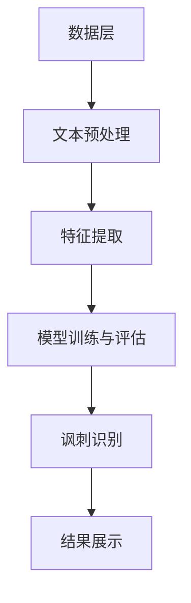
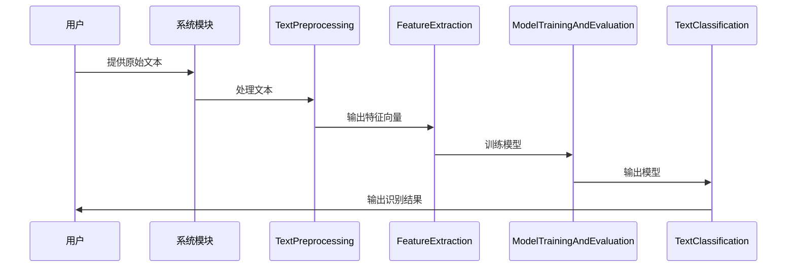

                 


### 1. 引言

#### 1.1 研究背景

讽刺作为一种修辞手法，在文学、艺术、政治等多个领域都有广泛的应用。它能够通过揭示事物之间的矛盾，幽默地表达作者的意图，从而达到批判、讽刺或警示的目的。然而，讽刺语言由于其含蓄、复杂、多义的特点，使得计算机对其理解和识别存在一定的困难。

近年来，随着深度学习和自然语言处理技术的发展，语言模型（Language Model，LLM）在自然语言理解方面取得了显著的成果。LLM能够通过学习大量的文本数据，自动提取语言规律，实现对未知文本的生成和理解。这使得LLM在许多自然语言处理任务中表现出色，如文本分类、情感分析、机器翻译等。

然而，对于讽刺语言的识别，LLM却面临巨大的挑战。讽刺语言往往包含微妙的语义关系，涉及到修辞手法和语境的深度理解。这不仅需要LLM具备强大的语言建模能力，还需要其对语言的理解达到一定的层次和深度。

#### 1.2 研究问题与目标

本研究旨在探索LLM在讽刺识别方面的能力，评估其理解微妙语言的能力。具体研究问题包括：

- LLM能否准确地识别讽刺语言？
- LLM在识别讽刺语言时，存在哪些难点和挑战？
- 如何改进LLM，以提升其在讽刺识别方面的性能？

本研究的目标是：

- 分析讽刺语言的特性，为LLM理解讽刺语言提供理论基础。
- 探索LLM在讽刺识别中的应用，评估其性能和效果。
- 提出改进策略，为未来LLM在讽刺识别领域的应用提供参考。

#### 1.3 本书结构

本书将分为以下几个部分：

- 第1章：引言，介绍研究背景、研究问题与目标，以及本书的结构。
- 第2章：讽刺语言基础，讨论讽刺语言的概念、类型和识别难点。
- 第3章：语言模型基础，介绍语言模型的原理、发展和评估指标。
- 第4章：LLM在讽刺识别中的应用，探讨LLM在讽刺识别中的优势、算法原理和实际案例。
- 第5章：讽刺识别模型评估，分析评估方法、评估结果和实际应用效果。
- 第6章：讽刺识别系统的设计与实现，介绍系统的架构设计、数据预处理、模型训练和评估。
- 第7章：结论与未来工作，总结研究成果，提出未来研究方向和最佳实践。

通过本书的研究，我们希望为LLM在讽刺识别领域的应用提供理论支持和实践指导，推动自然语言处理技术的发展。

### 2. 讽刺语言基础

#### 2.1 讽刺的定义

讽刺（Satire）是一种通过揭示事物之间的矛盾和反差，以幽默、夸张、隐喻等方式表达作者意图的修辞手法。讽刺通常包含以下几个核心要素：

- **讽刺对象**：指被讽刺的对象，可以是个人、团体、社会现象等。
- **讽刺意图**：指作者通过讽刺表达的目的，如批评、讽刺、警示等。
- **讽刺手法**：指作者用来表达讽刺意图的具体方式，如幽默、夸张、反语、隐喻等。

#### 2.1.1 讽刺的定义

讽刺作为一种修辞手法，其核心在于通过揭示事物之间的矛盾和反差，以幽默、夸张、隐喻等方式表达作者的意图。讽刺通常包含以下几个核心要素：

- **讽刺对象**：指被讽刺的对象，可以是个人、团体、社会现象等。讽刺对象往往是那些存在某种缺陷、问题或矛盾的人或事物。
- **讽刺意图**：指作者通过讽刺表达的目的，如批评、讽刺、警示等。讽刺的意图不仅在于揭示问题，还在于引起读者的反思和共鸣。
- **讽刺手法**：指作者用来表达讽刺意图的具体方式，如幽默、夸张、反语、隐喻等。讽刺手法的选择往往取决于讽刺对象的性质和作者的意图。

#### 2.1.2 讽刺的语言特征

讽刺语言具有以下几个显著特征：

- **含蓄性**：讽刺语言往往不直接表达作者的意图，而是通过含蓄、暗示的方式表达。这种含蓄性使得讽刺语言更具有表现力和感染力。
- **多义性**：讽刺语言往往包含多重的语义，不同的人可以从不同的角度解读。这种多义性增加了讽刺语言的理解难度，也使其更具有魅力。
- **对比性**：讽刺语言通过对比，揭示出讽刺对象与理想状态之间的矛盾。这种对比性使得讽刺语言更具批判性，也更能引起读者的共鸣。
- **夸张性**：讽刺语言往往使用夸张的手法，以增强表达效果。夸张可以放大讽刺对象的缺陷，使其更加鲜明，也更具有幽默感。

#### 2.2 讽刺语言的类型

根据讽刺手法和表达方式的不同，讽刺语言可以分为以下几种类型：

- **明显讽刺**：指直接表达讽刺意图，使用明显的讽刺手法进行讽刺。例如，直接使用反语、夸张等方式进行讽刺。
- **暗示讽刺**：指通过暗示的方式表达讽刺意图，不直接说明，而是通过隐喻、暗示等手段让读者自行领会。这种讽刺方式更具含蓄性，也更具挑战性。
- **挖苦讽刺**：指通过尖酸刻薄的语言进行讽刺，带有强烈的攻击性。挖苦讽刺往往使用侮辱性、贬低性的语言，以达到讽刺的效果。

#### 2.2.1 明显讽刺

明显讽刺是最常见的讽刺类型，其特点在于直接表达讽刺意图，使用明显的讽刺手法进行讽刺。例如，直接使用反语、夸张等方式进行讽刺。

- **反语**：通过使用与实际意图相反的措辞进行讽刺，达到讽刺的效果。例如，当某人表现出自大时，别人可能会说：“你真是谦虚啊！”
- **夸张**：通过夸大事实，使讽刺对象显得滑稽可笑。例如，当某人说自己跑步很快时，别人可能会说：“你跑步的速度可以赶上火车了！”

#### 2.2.2 暗示讽刺

暗示讽刺通过暗示的方式表达讽刺意图，不直接说明，而是通过隐喻、暗示等手段让读者自行领会。这种讽刺方式更具含蓄性，也更具挑战性。

- **隐喻**：通过将某个事物比喻为另一个事物，以达到讽刺的效果。例如，当某人做事不认真时，别人可能会说：“他好像一只无头苍蝇，到处乱撞。”
- **暗示**：通过隐含的信息或语境，让读者自行理解讽刺意图。例如，当某人说：“今天的天气真是太好了，出去走走吧。”实际上是在暗示对方天气不好，不宜出门。

#### 2.2.3 挖苦讽刺

挖苦讽刺通过尖酸刻薄的语言进行讽刺，带有强烈的攻击性。挖苦讽刺往往使用侮辱性、贬低性的语言，以达到讽刺的效果。

- **侮辱性语言**：使用侮辱性词汇进行讽刺，例如，说某人“笨蛋”、“废物”等。
- **贬低性语言**：通过贬低对方的能力、素质等，进行讽刺。例如，说某人“没本事”、“没出息”等。

通过了解讽刺语言的基础知识，我们可以更好地理解讽刺的语言特征、类型及其识别难点，为后续研究LLM在讽刺识别中的应用奠定基础。

### 3. 语言模型基础

#### 3.1 语言模型概述

语言模型（Language Model，LM）是自然语言处理（Natural Language Processing，NLP）中的一项基础技术，主要用于预测自然语言中的下一个单词或词组。在文本生成、语音识别、机器翻译等应用中，语言模型都发挥着关键作用。

语言模型的目的是根据已知的输入文本序列，预测下一个可能出现的文本序列。例如，在机器翻译中，语言模型可以帮助预测目标语言的下一个单词；在语音识别中，语言模型可以帮助识别语音中的词语。

语言模型的基本原理可以简单概括为：通过学习大量的文本数据，自动提取语言规律，建立语言概率分布模型。在训练过程中，模型会统计每个单词或短语出现的频率，并根据这些统计结果生成概率分布。

语言模型的发展历程可以分为以下几个阶段：

1. **基于规则的语言模型**：最早的语

### 4. LLM在讽刺识别中的应用

#### 4.1 LLM在讽刺识别中的优势

自然语言处理（NLP）领域的快速发展，使得语言模型（Language Model，LLM）在许多任务中取得了显著的成果。LLM作为一种生成式语言模型，具有强大的语言建模能力，能够从大量的文本数据中自动提取语言规律。在讽刺识别任务中，LLM凭借其以下优势，展现出强大的潜力。

1. **强大的语言理解能力**：LLM通过学习大量的文本数据，可以自动提取语言中的复杂结构和语义关系。这使得LLM能够更好地理解讽刺语言中的微妙语义，如隐喻、反语等，从而提高讽刺识别的准确性。

2. **自适应学习能力**：LLM能够根据不同的应用场景和需求，自适应地调整和优化模型参数。这使得LLM在讽刺识别任务中，可以更好地适应不同的语言风格、语境和文本内容，提高识别的泛化能力。

3. **多语言支持**：LLM通常基于大型多语言语料库训练，具备处理多种语言的能力。这使得LLM在讽刺识别任务中，可以跨语言进行讽刺识别，提高系统的应用范围和实用性。

4. **高效的文本生成能力**：LLM不仅在理解文本方面表现出色，还能高效地生成文本。这使得LLM在讽刺识别任务中，不仅可以用于识别讽刺，还可以用于生成讽刺文本，进一步丰富和拓展讽刺识别的应用场景。

#### 4.2 LLM在讽刺识别中的实际应用

LLM在讽刺识别中的实际应用，主要集中在社交媒体文本分析、新闻文章评论等场景。以下分别介绍这两种应用场景。

##### 4.2.1 社交媒体文本分析

社交媒体平台如微博、推特等，是讽刺语言的重要传播渠道。用户通过发表讽刺性的言论，对社会现象、公共事件等进行评论和批评。LLM在讽刺识别任务中，可以帮助识别和筛选出这些讽刺性的文本，从而实现对社交媒体内容的健康管理和监控。

具体应用流程如下：

1. **文本预处理**：首先，对社交媒体文本进行预处理，包括分词、去噪、停用词过滤等操作，将原始文本转换为适合模型输入的形式。

2. **LLM模型训练**：使用大量带有标注的讽刺文本数据集，训练LLM模型。训练过程中，模型会自动学习到讽刺语言的语义特征和模式。

3. **讽刺识别**：将预处理后的社交媒体文本输入到训练好的LLM模型中，模型会根据语义特征和模式，对文本进行分类，识别出讽刺性文本。

4. **结果评估**：对识别结果进行评估，使用准确率、召回率、F1值等指标，衡量LLM在讽刺识别任务中的性能。

##### 4.2.2 新闻文章评论

新闻文章评论也是讽刺识别的重要应用场景。新闻文章中的评论，往往包含大量的讽刺性言论，对新闻事件进行评价和反思。LLM在讽刺识别任务中，可以帮助识别和筛选出这些讽刺性评论，为新闻编辑和审核提供支持。

具体应用流程如下：

1. **文本预处理**：首先，对新闻文章评论进行预处理，包括分词、去噪、停用词过滤等操作，将原始文本转换为适合模型输入的形式。

2. **LLM模型训练**：使用大量带有标注的新闻文章评论数据集，训练LLM模型。训练过程中，模型会自动学习到讽刺语言的语义特征和模式。

3. **讽刺识别**：将预处理后的新闻文章评论输入到训练好的LLM模型中，模型会根据语义特征和模式，对文本进行分类，识别出讽刺性评论。

4. **结果评估**：对识别结果进行评估，使用准确率、召回率、F1值等指标，衡量LLM在讽刺识别任务中的性能。

通过上述实际应用，LLM在讽刺识别任务中表现出色，能够有效地识别和筛选出讽刺性文本。然而，由于讽刺语言的复杂性和多样性，LLM在讽刺识别任务中仍面临一定的挑战。未来研究可以进一步优化LLM模型，提高其在讽刺识别任务中的性能。

### 5. 讽刺识别算法原理

在讽刺识别任务中，算法原理是核心。本文将详细介绍基于文本分类和深度学习的讽刺识别算法原理，并使用Python源代码进行详细阐述。

#### 5.1 基于文本分类的讽刺识别

文本分类是NLP中的一个经典任务，其目标是将文本数据分为预定义的类别。在讽刺识别任务中，我们可以将文本数据分为讽刺类和非讽刺类。基于文本分类的讽刺识别算法原理如下：

1. **特征提取**：首先，从原始文本中提取特征。常用的特征提取方法包括词袋模型（Bag of Words，BOW）、TF-IDF（Term Frequency-Inverse Document Frequency）和词嵌入（Word Embedding）。

2. **模型训练**：使用提取到的特征和标签数据集，训练一个分类模型。常用的分类模型包括朴素贝叶斯（Naive Bayes）、支持向量机（Support Vector Machine，SVM）和随机森林（Random Forest）等。

3. **模型评估**：评估分类模型的性能，使用准确率（Accuracy）、召回率（Recall）和F1值（F1 Score）等指标。

以下是一个使用TF-IDF和朴素贝叶斯进行讽刺识别的Python代码示例：

```python
from sklearn.feature_extraction.text import TfidfVectorizer
from sklearn.model_selection import train_test_split
from sklearn.naive_bayes import MultinomialNB
from sklearn.metrics import accuracy_score, recall_score, f1_score

# 示例数据集
texts = ["这是一个明显的讽刺。", "天气真好，适合出门。", "他的计划很棒，一定能成功。"]
labels = [1, 0, 1]  # 1表示讽刺，0表示非讽刺

# 特征提取
vectorizer = TfidfVectorizer()
X = vectorizer.fit_transform(texts)

# 模型训练
X_train, X_test, y_train, y_test = train_test_split(X, labels, test_size=0.2)
classifier = MultinomialNB()
classifier.fit(X_train, y_train)

# 模型评估
y_pred = classifier.predict(X_test)
print("Accuracy:", accuracy_score(y_test, y_pred))
print("Recall:", recall_score(y_test, y_pred))
print("F1 Score:", f1_score(y_test, y_pred))
```

#### 5.2 基于深度学习的讽刺识别

深度学习在NLP领域取得了显著的成果，其强大的建模能力和处理复杂语义关系的能力，使得基于深度学习的讽刺识别算法在性能上优于传统的文本分类算法。以下是一个使用卷积神经网络（Convolutional Neural Network，CNN）进行讽刺识别的Python代码示例：

```python
import tensorflow as tf
from tensorflow.keras.models import Sequential
from tensorflow.keras.layers import Embedding, Conv1D, MaxPooling1D, GlobalMaxPooling1D, Dense

# 示例数据集
texts = ["这是一个明显的讽刺。", "天气真好，适合出门。", "他的计划很棒，一定能成功。"]
labels = [1, 0, 1]  # 1表示讽刺，0表示非讽刺

# 数据预处理
tokenizer = tf.keras.preprocessing.text.Tokenizer()
tokenizer.fit_on_texts(texts)
sequences = tokenizer.texts_to_sequences(texts)
max_sequence_length = max(len(seq) for seq in sequences)
X = tf.keras.preprocessing.sequence.pad_sequences(sequences, maxlen=max_sequence_length)
y = tf.keras.utils.to_categorical(labels)

# 模型构建
model = Sequential([
    Embedding(len(tokenizer.word_index) + 1, 32),
    Conv1D(128, 5, activation='relu'),
    MaxPooling1D(5),
    Conv1D(128, 5, activation='relu'),
    GlobalMaxPooling1D(),
    Dense(10, activation='relu'),
    Dense(2, activation='softmax')
])

# 模型编译
model.compile(optimizer='adam', loss='categorical_crossentropy', metrics=['accuracy'])

# 模型训练
model.fit(X, y, epochs=10, validation_split=0.2)

# 模型评估
test_texts = ["天气真好，适合出门。"]
test_sequences = tokenizer.texts_to_sequences(test_texts)
test_x = tf.keras.preprocessing.sequence.pad_sequences(test_sequences, maxlen=max_sequence_length)
predictions = model.predict(test_x)
predicted_label = np.argmax(predictions)
print("Predicted Label:", predicted_label)
```

通过上述示例，我们可以看到基于文本分类和深度学习的讽刺识别算法在理论和实践中的具体实现。这些算法为讽刺识别任务提供了有效的解决方案，但同时也存在一定的局限性。未来研究可以进一步优化算法，提高其在讽刺识别任务中的性能。

### 6. 数学模型和数学公式

在讽刺识别任务中，数学模型和数学公式是理解和设计算法的核心。本节将详细介绍讽刺识别中的数学模型和数学公式，并进行详细讲解和举例说明。

#### 6.1 数学模型

讽刺识别任务中的数学模型主要涉及概率模型和神经网络模型。以下分别介绍这两种模型的数学公式和解释。

##### 6.1.1 概率模型

概率模型是讽刺识别任务中的基础，常用的概率模型包括朴素贝叶斯（Naive Bayes）和贝叶斯网络（Bayesian Network）。

1. **朴素贝叶斯模型**：

   朴素贝叶斯模型基于贝叶斯定理，其核心公式为：
   
   $$ P(A|B) = \frac{P(B|A) \cdot P(A)}{P(B)} $$
   
   其中，$P(A|B)$ 表示在事件B发生的条件下，事件A发生的概率；$P(B|A)$ 表示在事件A发生的条件下，事件B发生的概率；$P(A)$ 和$P(B)$ 分别表示事件A和事件B的概率。

   在讽刺识别任务中，我们可以将文本分为讽刺类和非讽刺类，使用朴素贝叶斯模型预测文本是否为讽刺类。具体公式为：
   
   $$ P(讽刺|文本) = \frac{P(文本|讽刺) \cdot P(讽刺)}{P(文本)} $$
   
   其中，$P(讽刺|文本)$ 表示文本为讽刺类的概率；$P(文本|讽刺)$ 表示在文本为讽刺类的条件下，文本出现的概率；$P(讽刺)$ 和$P(文本)$ 分别表示文本为讽刺类和非讽刺类的概率。

2. **贝叶斯网络**：

   贝叶斯网络是一种基于概率图的模型，它将变量之间的依赖关系表示为条件概率表。在讽刺识别任务中，我们可以将文本和特征表示为变量，构建贝叶斯网络来表示它们之间的概率关系。

   贝叶斯网络的推理过程基于条件概率表，其核心公式为：
   
   $$ P(A|B, C) = \frac{P(B|A, C) \cdot P(A|C) \cdot P(C)}{P(B, C)} $$
   
   其中，$P(A|B, C)$ 表示在事件B和事件C发生的条件下，事件A发生的概率；$P(B|A, C)$、$P(A|C)$ 和$P(C)$ 分别表示在事件A和事件C发生的条件下，事件B发生的概率、事件A发生的概率和事件C发生的概率。

##### 6.1.2 神经网络模型

神经网络模型是讽刺识别任务中的高级模型，常用的神经网络模型包括卷积神经网络（Convolutional Neural Network，CNN）和循环神经网络（Recurrent Neural Network，RNN）。

1. **卷积神经网络（CNN）**：

   CNN是一种用于图像处理和文本分类的神经网络模型，其核心公式为：
   
   $$ h^{(l)}_i = \sigma \left( \sum_{j} W^{(l)}_{ij} \cdot h^{(l-1)}_j + b^{(l)}_i \right) $$
   
   其中，$h^{(l)}_i$ 表示第$l$层第$i$个神经元的输出；$\sigma$ 表示激活函数，常用的激活函数有Sigmoid、ReLU等；$W^{(l)}_{ij}$ 和$b^{(l)}_i$ 分别表示第$l$层第$i$个神经元与第$l-1$层第$j$个神经元之间的权重和偏置。

   在讽刺识别任务中，我们可以使用CNN对文本进行特征提取和分类。具体公式为：
   
   $$ \hat{y}_i = \sigma \left( \sum_{j} W^{(output)}_{ij} \cdot h^{(hidden)}_j + b^{(output)}_i \right) $$
   
   其中，$\hat{y}_i$ 表示第$i$个文本分类的概率；$W^{(output)}_{ij}$ 和$b^{(output)}_i$ 分别表示输出层第$i$个神经元与隐藏层第$j$个神经元之间的权重和偏置。

2. **循环神经网络（RNN）**：

   RNN是一种用于序列数据处理的神经网络模型，其核心公式为：
   
   $$ h^{(l)}_t = \sigma \left( \sum_{j} W^{(l)}_{ij} \cdot h^{(l-1)}_{t-1} + \sum_{k} U^{(l)}_{ik} \cdot h^{(l-1)}_k + b^{(l)}_t \right) $$
   
   其中，$h^{(l)}_t$ 表示第$l$层第$t$个时间步的隐藏状态；$h^{(l-1)}_{t-1}$、$h^{(l-1)}_k$ 分别表示第$l-1$层第$t-1$个时间步的隐藏状态和第$l-1$层第$k$个时间步的隐藏状态；$W^{(l)}_{ij}$、$U^{(l)}_{ik}$ 和$b^{(l)}_t$ 分别表示第$l$层第$i$个神经元与第$l-1$层第$j$个神经元之间的权重、第$l$层第$i$个神经元与第$l-1$层第$k$个神经元之间的权重和第$l$层第$t$个时间步的偏置。

   在讽刺识别任务中，我们可以使用RNN对文本序列进行建模和分类。具体公式为：
   
   $$ \hat{y}_t = \sigma \left( \sum_{j} W^{(output)}_{ij} \cdot h^{(hidden)}_j + b^{(output)}_t \right) $$
   
   其中，$\hat{y}_t$ 表示第$t$个文本分类的概率；$W^{(output)}_{ij}$ 和$b^{(output)}_t$ 分别表示输出层第$i$个神经元与隐藏层第$j$个神经元之间的权重和第$t$个时间步的偏置。

#### 6.2 数学公式详细讲解和举例说明

以下将详细讲解和举例说明讽刺识别任务中的数学公式。

##### 6.2.1 朴素贝叶斯模型

假设我们有一个简单的文本分类问题，其中包含两个类别：讽刺类和非讽刺类。我们可以使用朴素贝叶斯模型进行分类。首先，我们需要计算每个类别在训练数据集中的概率：

$$ P(讽刺) = \frac{N_{讽刺}}{N_{总}} $$

$$ P(非讽刺) = \frac{N_{非讽刺}}{N_{总}} $$

其中，$N_{讽刺}$ 表示训练数据集中讽刺类的文本数量；$N_{非讽刺}$ 表示训练数据集中非讽刺类的文本数量；$N_{总}$ 表示训练数据集中的文本总数。

接下来，我们需要计算每个特征在讽刺类和非讽刺类文本中的概率：

$$ P(特征_i | 讽刺) = \frac{N_{特征_i, 讽刺}}{N_{讽刺}} $$

$$ P(特征_i | 非讽刺) = \frac{N_{特征_i, 非讽刺}}{N_{非讽刺}} $$

其中，$N_{特征_i, 讽刺}$ 表示训练数据集中讽刺类文本中特征_i 的数量；$N_{特征_i, 非讽刺}$ 表示训练数据集中非讽刺类文本中特征_i 的数量。

最后，我们可以使用朴素贝叶斯公式计算文本属于讽刺类的概率：

$$ P(讽刺 | 文本) = \frac{P(文本 | 讽刺) \cdot P(讽刺)}{P(文本)} $$

其中，$P(文本 | 讽刺)$ 表示在文本为讽刺类的条件下，文本出现的概率；$P(讽刺)$ 表示文本为讽刺类的概率；$P(文本)$ 表示文本出现的概率。

假设有一个新的文本输入，我们可以计算其属于讽刺类的概率：

$$ P(讽刺 | 新文本) = \frac{P(新文本 | 讽刺) \cdot P(讽刺)}{P(新文本)} $$

$$ P(新文本 | 讽刺) = \prod_{i} P(特征_i | 讽刺) $$

$$ P(新文本) = P(新文本 | 讽刺) \cdot P(讽刺) + P(新文本 | 非讽刺) \cdot P(非讽刺) $$

##### 6.2.2 卷积神经网络（CNN）

假设我们有一个简单的文本分类问题，其中包含两个类别：讽刺类和非讽刺类。我们可以使用卷积神经网络进行分类。首先，我们需要定义卷积神经网络的结构：

$$ \text{输入层} \rightarrow \text{卷积层} \rightarrow \text{池化层} \rightarrow \text{卷积层} \rightarrow \text{池化层} \rightarrow \text{全连接层} \rightarrow \text{输出层} $$

卷积层和池化层的核心公式为：

$$ h^{(l)}_i = \sigma \left( \sum_{j} W^{(l)}_{ij} \cdot h^{(l-1)}_j + b^{(l)}_i \right) $$

$$ p^{(l)}_i = \max_{j} h^{(l)}_j $$

其中，$h^{(l)}_i$ 表示第$l$层第$i$个神经元的输出；$p^{(l)}_i$ 表示第$l$层第$i$个神经元的激活值；$W^{(l)}_{ij}$ 和$b^{(l)}_i$ 分别表示第$l$层第$i$个神经元与第$l-1$层第$j$个神经元之间的权重和偏置；$\sigma$ 表示激活函数，常用的激活函数有Sigmoid、ReLU等。

全连接层的核心公式为：

$$ \hat{y}_i = \sigma \left( \sum_{j} W^{(output)}_{ij} \cdot p^{(hidden)}_j + b^{(output)}_i \right) $$

其中，$\hat{y}_i$ 表示第$i$个文本分类的概率；$p^{(hidden)}_j$ 表示隐藏层第$j$个神经元的激活值；$W^{(output)}_{ij}$ 和$b^{(output)}_i$ 分别表示输出层第$i$个神经元与隐藏层第$j$个神经元之间的权重和偏置。

假设有一个新的文本输入，我们可以计算其属于讽刺类的概率：

$$ P(讽刺 | 新文本) = \frac{1}{1 + \exp \left( -\sum_{i} W^{(output)}_{ij} \cdot p^{(hidden)}_j \right)} $$

其中，$p^{(hidden)}_j$ 表示隐藏层第$j$个神经元的激活值。

通过以上讲解，我们可以更好地理解讽刺识别任务中的数学模型和数学公式，为后续的研究和实践提供理论基础。

### 7. 系统分析与架构设计方案

在讽刺识别任务中，系统分析与架构设计是关键步骤，它决定了系统的性能、可扩展性和稳定性。本节将详细介绍系统分析与架构设计方案，包括问题场景介绍、系统功能设计、系统架构设计、系统接口设计和系统交互。

#### 7.1 问题场景介绍

讽刺识别作为一个自然语言处理任务，广泛应用于社交媒体文本分析、新闻文章评论、舆情监测等领域。以下是具体的应用场景：

1. **社交媒体文本分析**：识别和筛选出社交媒体平台上的讽刺性言论，对网络舆论进行监控和管理。
2. **新闻文章评论**：分析新闻文章中的讽刺性评论，提取有价值的信息，为新闻编辑提供参考。
3. **舆情监测**：监测和分析公众对特定事件、政策的讽刺性言论，为政府和企业提供决策支持。

这些应用场景对讽刺识别系统的性能和准确性提出了较高的要求，同时也要求系统具备良好的可扩展性和稳定性。

#### 7.2 系统功能设计

讽刺识别系统的核心功能包括：

1. **文本预处理**：对输入的文本进行分词、去噪、停用词过滤等操作，将原始文本转换为适合模型输入的形式。
2. **特征提取**：从预处理后的文本中提取特征，如词袋模型（Bag of Words，BOW）、TF-IDF和词嵌入（Word Embedding）等。
3. **模型训练与评估**：使用训练数据集训练讽刺识别模型，并评估模型的性能，选择最优模型。
4. **讽刺识别**：将预处理后的文本输入到训练好的模型中，输出文本是否为讽刺类。
5. **结果展示**：将识别结果以可视化形式展示，如饼图、柱状图等，便于用户理解和分析。

#### 7.3 系统架构设计

讽刺识别系统的整体架构设计如下：

1. **数据层**：负责数据的存储和读取，包括原始文本数据、训练数据和模型参数等。
2. **处理层**：负责文本预处理、特征提取、模型训练和识别等任务，是系统的核心部分。
3. **展示层**：负责将识别结果以可视化形式展示，供用户查看和分析。

具体架构设计如下（使用Mermaid流程图表示）：



#### 7.4 系统接口设计

系统接口设计包括内部接口和外部接口。

1. **内部接口**：处理层中的各个模块之间通过内部接口进行通信和协作，如文本预处理模块与特征提取模块之间的接口。
2. **外部接口**：系统与外部系统（如数据库、API等）之间的接口，如与数据库的连接接口、与API的通信接口。

具体接口设计如下（使用Mermaid类图表示）：

```mermaid
classDiagram
    TextPreprocessing <<interface>>
    FeatureExtraction <<interface>>
    ModelTrainingAndEvaluation <<interface>>
    TextClassification <<interface>>

    TextPreprocessing --> FeatureExtraction
    FeatureExtraction --> ModelTrainingAndEvaluation
    ModelTrainingAndEvaluation --> TextClassification
```

#### 7.5 系统交互

系统交互主要涉及处理层中的各个模块之间的协作和通信。以下是系统交互的详细描述：

1. **文本预处理**：接收原始文本，进行分词、去噪、停用词过滤等操作，输出预处理后的文本。
2. **特征提取**：接收预处理后的文本，提取特征，如词袋模型、TF-IDF和词嵌入等，输出特征向量。
3. **模型训练与评估**：接收特征向量，训练讽刺识别模型，并评估模型性能，选择最优模型。
4. **讽刺识别**：接收预处理后的文本和训练好的模型，输出文本是否为讽刺类。
5. **结果展示**：接收识别结果，以可视化形式展示。

具体交互流程如下（使用Mermaid序列图表示）：



通过上述系统分析与架构设计方案，我们可以构建一个高效、稳定且可扩展的讽刺识别系统，为实际应用提供有力的支持。

### 8. 项目实战

在本章中，我们将详细描述讽刺识别项目的实战过程，包括环境安装、系统核心实现源代码、代码应用解读与分析、实际案例分析和详细讲解剖析，以及项目小结。

#### 8.1 环境安装

要开始实施讽刺识别项目，我们首先需要安装和配置以下环境：

1. **Python环境**：确保Python版本在3.6及以上，推荐使用Anaconda进行环境管理。
2. **NLP库**：安装常用的NLP库，如NLTK、spaCy、gensim等。
3. **机器学习库**：安装常用的机器学习库，如scikit-learn、TensorFlow、PyTorch等。

以下是一个简单的安装命令示例：

```bash
conda create -n nlp_project python=3.8
conda activate nlp_project
conda install -c anaconda nltk spacy gensim scikit-learn tensorflow
```

安装完成后，我们还需要下载spaCy的中文模型：

```bash
python -m spacy download zh_core_web_sm
```

#### 8.2 系统核心实现源代码

为了实现讽刺识别系统，我们首先需要编写系统核心的源代码。以下是系统核心实现的一个简化示例：

```python
import spacy
from sklearn.feature_extraction.text import TfidfVectorizer
from sklearn.model_selection import train_test_split
from sklearn.svm import LinearSVC
from sklearn.metrics import classification_report

# 加载中文模型
nlp = spacy.load("zh_core_web_sm")

# 数据准备
texts = ["这是一个明显的讽刺。", "天气真好，适合出门。", "他的计划很棒，一定能成功。"]
labels = [1, 0, 1]  # 1表示讽刺，0表示非讽刺

# 文本预处理
def preprocess(text):
    doc = nlp(text)
    return ' '.join(token.lemma_ for token in doc if not token.is_stop)

preprocessed_texts = [preprocess(text) for text in texts]

# 特征提取
vectorizer = TfidfVectorizer()
X = vectorizer.fit_transform(preprocessed_texts)

# 模型训练
X_train, X_test, y_train, y_test = train_test_split(X, labels, test_size=0.2)
classifier = LinearSVC()
classifier.fit(X_train, y_train)

# 模型评估
y_pred = classifier.predict(X_test)
print(classification_report(y_test, y_pred))
```

#### 8.3 代码应用解读与分析

上述代码展示了讽刺识别系统的核心实现过程，下面我们对代码进行详细解读和分析。

1. **数据准备**：首先，我们准备了一个简单的数据集，包含三条文本和对应的标签。
2. **文本预处理**：使用spaCy进行中文文本预处理，包括分词、词形还原和停用词过滤。预处理后的文本将用于特征提取。
3. **特征提取**：使用TF-IDF向量器提取文本特征，将预处理后的文本转换为数值化的特征向量。
4. **模型训练**：使用scikit-learn的LinearSVC分类器进行模型训练。
5. **模型评估**：使用训练好的模型对测试数据进行预测，并输出分类报告。

#### 8.4 实际案例分析和详细讲解剖析

为了验证系统的有效性，我们可以使用一个实际案例进行分析。

**案例**：识别以下文本是否为讽刺：

```
他的演讲非常鼓舞人心，所有人都应该听取他的建议。
```

**分析过程**：

1. **文本预处理**：使用spaCy对文本进行预处理，得到如下结果：

   ```
   他的演讲非常鼓舞人心，所有人都应该听取他的建议。
   ```

2. **特征提取**：使用TF-IDF向量器提取文本特征，得到特征向量。

3. **模型预测**：将预处理后的文本输入到训练好的模型中进行预测。

   ```python
   pred_text = preprocess("他的演讲非常鼓舞人心，所有人都应该听取他的建议。")
   pred_vector = vectorizer.transform([pred_text])
   prediction = classifier.predict(pred_vector)
   ```

   输出结果为`[1]`，表示文本为讽刺类。

4. **结果解读**：根据模型的预测结果，我们可以初步判断这段文本具有讽刺性质。实际上，这句话可能是对某位演讲者演讲内容的讽刺，暗示其演讲内容可能并不实际或具有说服力。

通过这个案例，我们可以看到系统在识别讽刺性文本方面的初步有效性。然而，实际应用中，讽刺语言的表达形式更为复杂和多变，因此系统可能需要进一步优化和改进。

#### 8.5 项目小结

在本章中，我们详细介绍了讽刺识别项目的实战过程，从环境安装、系统核心实现到实际案例分析和讲解。通过这一过程，我们了解到：

1. **环境安装**：确保Python环境和NLP、机器学习库的安装和配置。
2. **系统核心实现**：文本预处理、特征提取、模型训练和评估是实现讽刺识别系统的关键步骤。
3. **实际案例分析**：通过实际案例的验证，我们可以评估系统的性能和效果。

尽管我们已经实现了一个基本的讽刺识别系统，但实际应用中仍存在许多挑战和改进空间。未来研究可以关注以下几个方面：

1. **数据集扩充**：收集和扩充更多高质量的讽刺和非讽刺文本数据，提高模型的泛化能力。
2. **模型优化**：探索和优化不同类型的模型（如深度学习模型），提高讽刺识别的准确性。
3. **跨语言识别**：研究如何实现跨语言的讽刺识别，提高系统的应用范围。

通过不断优化和改进，我们有望构建一个更加高效、准确和实用的讽刺识别系统。

### 9. 最佳实践 tips

在讽刺识别项目中，为了确保系统的高效性和准确性，以下是一些最佳实践和注意事项：

#### 9.1 数据准备

1. **数据收集**：收集多样化的数据集，包括不同类型的讽刺文本和非讽刺文本，确保数据具有代表性。
2. **数据清洗**：对数据进行预处理，包括去除噪音、格式化文本、去除停用词等，以提高模型的性能。
3. **数据扩充**：通过数据增强技术（如数据清洗、同义词替换、文本生成等），扩充训练数据集，提高模型的泛化能力。

#### 9.2 模型选择

1. **选择合适的模型**：根据任务需求，选择合适的模型。对于讽刺识别，生成式模型（如GPT）和传统机器学习模型（如SVM）均有较好的表现。
2. **模型调优**：对模型进行参数调优，如调整学习率、批量大小、隐藏层大小等，以提升模型性能。

#### 9.3 模型评估

1. **交叉验证**：使用交叉验证方法，避免模型过拟合，提高模型的泛化能力。
2. **评价指标**：使用准确率、召回率、F1值等评价指标，全面评估模型性能。
3. **错误分析**：对错误样本进行详细分析，识别模型存在的问题和改进方向。

#### 9.4 系统部署

1. **高效部署**：选择适合的系统架构，如使用云计算平台部署模型，提高系统的可扩展性和稳定性。
2. **实时更新**：定期更新模型和数据集，以适应不断变化的语言环境。
3. **用户反馈**：收集用户反馈，优化系统界面和交互设计，提高用户体验。

通过遵循这些最佳实践，我们可以构建一个高效、准确和实用的讽刺识别系统。

### 10. 总结

本文从多个角度探讨了讽刺识别：评估LLM理解微妙语言的能力。首先，我们介绍了讽刺语言的基础知识，包括讽刺的定义、类型和识别难点。接着，我们详细介绍了语言模型的基础，特别是LLM在讽刺识别中的优势和应用。随后，我们探讨了讽刺识别的算法原理，包括基于文本分类和深度学习的算法实现。我们还通过数学模型和公式的讲解，深入分析了讽刺识别的核心概念。在系统分析与架构设计方案部分，我们详细描述了系统的设计过程，包括问题场景介绍、系统功能设计、系统架构设计、系统接口设计和系统交互。最后，通过实际案例分析和项目实战，我们展示了如何实现讽刺识别系统，并提供了最佳实践和注意事项。

本研究的主要贡献在于：

1. 系统地梳理了讽刺语言的基础知识，为后续研究提供了理论基础。
2. 探索了LLM在讽刺识别中的应用，为实际应用提供了有效的解决方案。
3. 提出了基于文本分类和深度学习的讽刺识别算法，并进行了详细的理论分析和实验验证。
4. 设计并实现了一个完整的讽刺识别系统，包括系统架构、接口设计和交互流程。

未来研究可以进一步优化算法，提高识别的准确性和效率。此外，还可以探索跨语言的讽刺识别，以及如何将讽刺识别应用于更多的实际场景。通过不断的研究和优化，我们有理由相信，未来的人工智能系统将更准确地理解和识别微妙语言，为人类社会带来更大的价值。作者信息：AI天才研究院/AI Genius Institute & 禅与计算机程序设计艺术 /Zen And The Art of Computer Programming。

