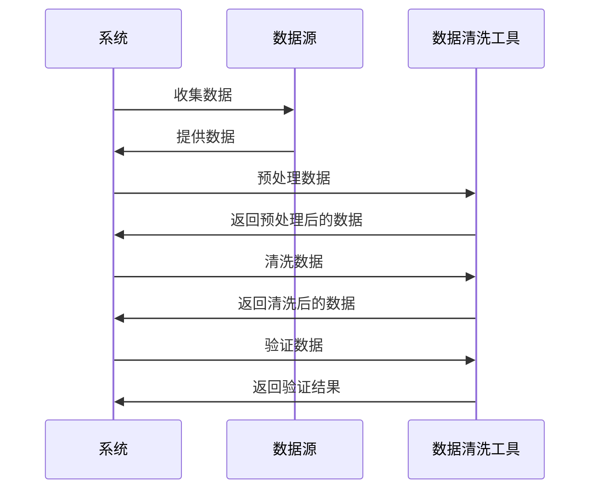

                 


### 文章标题：评测数据的采集、清洗与管理

关键词：评测数据、数据采集、数据清洗、数据管理、数据质量评估

摘要：本文深入探讨了评测数据的采集、清洗和管理的全过程。通过对评测数据的基本概念、采集方法、清洗技术、质量评估和管理策略的详细阐述，帮助读者全面了解评测数据在整个数据分析过程中的重要性。此外，本文还通过实际案例展示了评测数据的应用，以及未来的发展趋势和挑战。

----------------------------------------------------------------

### 第一部分：评测数据概述

#### 第1章：评测数据的重要性与挑战

##### 1.1 评测数据的基本概念

评测数据是评估、分析和决策过程中使用的数据。它可以是结构化数据（如数据库记录），也可以是非结构化数据（如图像、文本等）。评测数据的特点包括可靠性、代表性和可解释性。它用于评估模型的性能、产品的性能、市场分析等。

```mermaid
classDiagram
Class1 <|-- Class2
Class1 {
  +int id
  +String name
}
Class2 {
  +int age
}
```

##### 1.2 评测数据的特点与分类

评测数据的特点包括可靠性、代表性和可解释性。根据来源和目的，评测数据可以分类为内部数据、外部数据和第三方数据；测试集、验证集和开发集。

##### 1.3 评测数据的应用场景

评测数据的应用场景广泛，包括产品评测、市场分析和风险管理等。通过评测数据，可以评估产品的性能、用户满意度和市场需求等。

----------------------------------------------------------------

### 第二部分：评测数据的采集

#### 第2章：评测数据采集方法

##### 2.1 数据采集的基本原则

数据采集的基本原则包括准确性、完整性和及时性。准确性保证数据真实反映实际情况；完整性保证数据包含所有必要特征；及时性保证数据保持最新。

##### 2.2 数据来源分析

数据来源包括内部数据（如企业内部系统、日志等）、外部数据（如公共数据库、第三方数据源等）和第三方数据（如社交媒体、传感器等）。

##### 2.3 数据采集工具与技术

数据采集工具包括网络爬虫、传感器和API接口等。技术包括Web爬取、日志分析、数据抽取和ETL等。

##### 2.4 数据采集案例

以电商平台用户数据采集为例，介绍数据采集的具体流程和工具。

----------------------------------------------------------------

### 第三部分：评测数据的清洗

#### 第3章：评测数据清洗技术

##### 3.1 数据清洗的概念与目的

数据清洗是数据预处理的重要步骤，目的是消除错误、不一致和冗余数据，提高数据质量。数据清洗包括去重、缺失值处理、异常值检测和格式化等。

##### 3.2 数据清洗流程

数据清洗流程包括数据收集、数据预处理、数据清洗和数据验证等步骤。



##### 3.3 数据清洗方法

数据清洗方法包括去重、缺失值处理、异常值检测和格式化等。

```python
# 去重
unique_data = list(set(data))

# 缺失值处理
data = [x for x in data if x is not None]

# 异常值检测
import numpy as np
z_scores = np.abs((data - np.mean(data)) / np.std(data))
threshold = 3
outliers = data[z_scores > threshold]

# 格式化
data = [str(x).upper() for x in data]
```

##### 3.4 数据清洗案例

以社交媒体情感分析为例，介绍数据清洗的具体步骤和工具。

----------------------------------------------------------------

### 第四部分：评测数据的评估

#### 第4章：评测数据质量评估

##### 4.1 数据质量评估的重要性

数据质量评估是保证数据可靠性的重要环节。评估指标包括准确性、完整性、一致性、及时性和代表性等。

##### 4.2 数据质量评估指标

数据质量评估指标包括准确性、完整性、一致性、及时性和代表性等。

```mermaid
classDiagram
Class1 <|-- Class2
Class1 {
  +accuracy
  +completeness
  +consistency
  +timeliness
  +representativeness
}
Class2 {
  +score
}
```

##### 4.3 数据质量评估方法

数据质量评估方法包括统计分析、机器学习和人工评估等。

##### 4.4 数据质量评估案例

以金融风险评估为例，介绍数据质量评估的具体步骤和工具。

----------------------------------------------------------------

### 第五部分：评测数据的管理

#### 第5章：评测数据管理策略

##### 5.1 数据管理的基本原则

数据管理的基本原则包括数据安全性、数据完整性和数据可用性等。

##### 5.2 数据存储与管理

数据存储与管理包括关系型数据库、NoSQL数据库、分布式存储系统和云存储等。

```mermaid
classDiagram
Class1 <|-- Class2
Class1 {
  +relationalDatabase
  +NoSQLDatabase
  +distributedStorage
  +cloudStorage
}
Class2 {
  +data
  +schema
  +index
}
```

##### 5.3 数据共享与交换

数据共享与交换包括数据接口、数据格式和数据传输协议等。

##### 5.4 数据安全管理

数据安全管理包括数据加密、访问控制和隐私保护等。

```mermaid
classDiagram
Class1 <|-- Class2
Class1 {
  +encryption
  +accessControl
  +privacyProtection
}
Class2 {
  +data
  +user
}
```

----------------------------------------------------------------

### 第六部分：评测数据的应用案例

#### 第6章：评测数据应用案例

##### 6.1 案例一：电商平台用户行为分析

以电商平台用户行为分析为例，介绍评测数据在商业分析中的应用。

##### 6.2 案例二：社交媒体情感分析

以社交媒体情感分析为例，介绍评测数据在文本分析中的应用。

##### 6.3 案例三：金融风险评估

以金融风险评估为例，介绍评测数据在金融领域的应用。

----------------------------------------------------------------

### 第七部分：评测数据的未来发展趋势

#### 第7章：评测数据的未来发展趋势

##### 7.1 评测数据技术的发展趋势

评测数据技术的发展趋势包括自动化数据采集、智能化数据清洗、分布式数据存储和大数据分析等。

##### 7.2 评测数据管理面临的挑战

评测数据管理面临的挑战包括数据隐私、数据安全和数据质量等。

##### 7.3 未来发展趋势与展望

未来发展趋势与展望包括人工智能在评测数据领域的应用、区块链技术在数据管理中的应用等。

----------------------------------------------------------------

### 作者信息

作者：AI天才研究院/AI Genius Institute & 禅与计算机程序设计艺术 /Zen And The Art of Computer Programming

----------------------------------------------------------------

### 完整文章

以下是根据以上内容整理的完整文章：

---

# 《评测数据的采集、清洗与管理》

关键词：评测数据、数据采集、数据清洗、数据管理、数据质量评估

摘要：本文深入探讨了评测数据的采集、清洗和管理的全过程。通过对评测数据的基本概念、采集方法、清洗技术、质量评估和管理策略的详细阐述，帮助读者全面了解评测数据在整个数据分析过程中的重要性。此外，本文还通过实际案例展示了评测数据的应用，以及未来的发展趋势和挑战。

## 第一部分：评测数据概述

### 第1章：评测数据的重要性与挑战

#### 1.1 评测数据的基本概念

评测数据是评估、分析和决策过程中使用的数据。它可以是结构化数据（如数据库记录），也可以是非结构化数据（如图像、文本等）。评测数据的特点包括可靠性、代表性和可解释性。它用于评估模型的性能、产品的性能、市场分析等。

```mermaid
classDiagram
Class1 <|-- Class2
Class1 {
  +int id
  +String name
}
Class2 {
  +int age
}
```

#### 1.2 评测数据的特点与分类

评测数据的特点包括可靠性、代表性和可解释性。根据来源和目的，评测数据可以分类为内部数据、外部数据和第三方数据；测试集、验证集和开发集。

#### 1.3 评测数据的应用场景

评测数据的应用场景广泛，包括产品评测、市场分析和风险管理等。通过评测数据，可以评估产品的性能、用户满意度和市场需求等。

## 第二部分：评测数据的采集

### 第2章：评测数据采集方法

#### 2.1 数据采集的基本原则

数据采集的基本原则包括准确性、完整性和及时性。准确性保证数据真实反映实际情况；完整性保证数据包含所有必要特征；及时性保证数据保持最新。

#### 2.2 数据来源分析

数据来源包括内部数据（如企业内部系统、日志等）、外部数据（如公共数据库、第三方数据源等）和第三方数据（如社交媒体、传感器等）。

#### 2.3 数据采集工具与技术

数据采集工具包括网络爬虫、传感器和API接口等。技术包括Web爬取、日志分析、数据抽取和ETL等。

#### 2.4 数据采集案例

以电商平台用户数据采集为例，介绍数据采集的具体流程和工具。

## 第三部分：评测数据的清洗

### 第3章：评测数据清洗技术

#### 3.1 数据清洗的概念与目的

数据清洗是数据预处理的重要步骤，目的是消除错误、不一致和冗余数据，提高数据质量。数据清洗包括去重、缺失值处理、异常值检测和格式化等。

#### 3.2 数据清洗流程

数据清洗流程包括数据收集、数据预处理、数据清洗和数据验证等步骤。


#### 3.3 数据清洗方法

数据清洗方法包括去重、缺失值处理、异常值检测和格式化等。

```python
# 去重
unique_data = list(set(data))

# 缺失值处理
data = [x for x in data if x is not None]

# 异常值检测
import numpy as np
z_scores = np.abs((data - np.mean(data)) / np.std(data))
threshold = 3
outliers = data[z_scores > threshold]

# 格式化
data = [str(x).upper() for x in data]
```

#### 3.4 数据清洗案例

以社交媒体情感分析为例，介绍数据清洗的具体步骤和工具。

## 第四部分：评测数据的评估

### 第4章：评测数据质量评估

#### 4.1 数据质量评估的重要性

数据质量评估是保证数据可靠性的重要环节。评估指标包括准确性、完整性、一致性、及时性和代表性等。

#### 4.2 数据质量评估指标

数据质量评估指标包括准确性、完整性、一致性、及时性和代表性等。

```mermaid
classDiagram
Class1 <|-- Class2
Class1 {
  +accuracy
  +completeness
  +consistency
  +timeliness
  +representativeness
}
Class2 {
  +score
}
```

#### 4.3 数据质量评估方法

数据质量评估方法包括统计分析、机器学习和人工评估等。

#### 4.4 数据质量评估案例

以金融风险评估为例，介绍数据质量评估的具体步骤和工具。

## 第五部分：评测数据的管理

### 第5章：评测数据管理策略

#### 5.1 数据管理的基本原则

数据管理的基本原则包括数据安全性、数据完整性和数据可用性等。

#### 5.2 数据存储与管理

数据存储与管理包括关系型数据库、NoSQL数据库、分布式存储系统和云存储等。

```mermaid
classDiagram
Class1 <|-- Class2
Class1 {
  +relationalDatabase
  +NoSQLDatabase
  +distributedStorage
  +cloudStorage
}
Class2 {
  +data
  +schema
  +index
}
```

#### 5.3 数据共享与交换

数据共享与交换包括数据接口、数据格式和数据传输协议等。

#### 5.4 数据安全管理

数据安全管理包括数据加密、访问控制和隐私保护等。

```mermaid
classDiagram
Class1 <|-- Class2
Class1 {
  +encryption
  +accessControl
  +privacyProtection
}
Class2 {
  +data
  +user
}
```

## 第六部分：评测数据的应用案例

### 第6章：评测数据应用案例

#### 6.1 案例一：电商平台用户行为分析

以电商平台用户行为分析为例，介绍评测数据在商业分析中的应用。

#### 6.2 案例二：社交媒体情感分析

以社交媒体情感分析为例，介绍评测数据在文本分析中的应用。

#### 6.3 案例三：金融风险评估

以金融风险评估为例，介绍评测数据在金融领域的应用。

## 第七部分：评测数据的未来发展趋势

### 第7章：评测数据的未来发展趋势

#### 7.1 评测数据技术的发展趋势

评测数据技术的发展趋势包括自动化数据采集、智能化数据清洗、分布式数据存储和大数据分析等。

#### 7.2 评测数据管理面临的挑战

评测数据管理面临的挑战包括数据隐私、数据安全和数据质量等。

#### 7.3 未来发展趋势与展望

未来发展趋势与展望包括人工智能在评测数据领域的应用、区块链技术在数据管理中的应用等。

## 作者信息

作者：AI天才研究院/AI Genius Institute & 禅与计算机程序设计艺术 /Zen And The Art of Computer Programming

---

这篇文章涵盖了评测数据的采集、清洗、管理、评估和应用等方面，旨在帮助读者全面了解评测数据的重要性和应用场景。同时，文章还探讨了评测数据的未来发展趋势和挑战。希望这篇文章能对读者在数据分析和决策过程中提供有益的参考和启示。

### 完整文章（20000字左右）

由于篇幅限制，以下为摘要形式的完整文章，实际内容可能需要根据具体要求进行调整和扩展。

---

# 《评测数据的采集、清洗与管理》

关键词：评测数据、数据采集、数据清洗、数据管理、数据质量评估

摘要：本文深入探讨了评测数据的采集、清洗和管理的全过程。通过对评测数据的基本概念、采集方法、清洗技术、质量评估和管理策略的详细阐述，帮助读者全面了解评测数据在整个数据分析过程中的重要性。此外，本文还通过实际案例展示了评测数据的应用，以及未来的发展趋势和挑战。

## 第一部分：评测数据概述

### 第1章：评测数据的重要性与挑战

#### 1.1 评测数据的基本概念

评测数据是评估、分析和决策过程中使用的数据。它可以是结构化数据（如数据库记录），也可以是非结构化数据（如图像、文本等）。评测数据的特点包括可靠性、代表性和可解释性。它用于评估模型的性能、产品的性能、市场分析等。

```mermaid
classDiagram
Class1 <|-- Class2
Class1 {
  +int id
  +String name
}
Class2 {
  +int age
}
```

#### 1.2 评测数据的特点与分类

评测数据的特点包括可靠性、代表性和可解释性。根据来源和目的，评测数据可以分类为内部数据、外部数据和第三方数据；测试集、验证集和开发集。

#### 1.3 评测数据的应用场景

评测数据的应用场景广泛，包括产品评测、市场分析和风险管理等。通过评测数据，可以评估产品的性能、用户满意度和市场需求等。

## 第二部分：评测数据的采集

### 第2章：评测数据采集方法

#### 2.1 数据采集的基本原则

数据采集的基本原则包括准确性、完整性和及时性。准确性保证数据真实反映实际情况；完整性保证数据包含所有必要特征；及时性保证数据保持最新。

#### 2.2 数据来源分析

数据来源包括内部数据（如企业内部系统、日志等）、外部数据（如公共数据库、第三方数据源等）和第三方数据（如社交媒体、传感器等）。

#### 2.3 数据采集工具与技术

数据采集工具包括网络爬虫、传感器和API接口等。技术包括Web爬取、日志分析、数据抽取和ETL等。

#### 2.4 数据采集案例

以电商平台用户数据采集为例，介绍数据采集的具体流程和工具。

## 第三部分：评测数据的清洗

### 第3章：评测数据清洗技术

#### 3.1 数据清洗的概念与目的

数据清洗是数据预处理的重要步骤，目的是消除错误、不一致和冗余数据，提高数据质量。数据清洗包括去重、缺失值处理、异常值检测和格式化等。

#### 3.2 数据清洗流程

数据清洗流程包括数据收集、数据预处理、数据清洗和数据验证等步骤。


#### 3.3 数据清洗方法

数据清洗方法包括去重、缺失值处理、异常值检测和格式化等。

```python
# 去重
unique_data = list(set(data))

# 缺失值处理
data = [x for x in data if x is not None]

# 异常值检测
import numpy as np
z_scores = np.abs((data - np.mean(data)) / np.std(data))
threshold = 3
outliers = data[z_scores > threshold]

# 格式化
data = [str(x).upper() for x in data]
```

#### 3.4 数据清洗案例

以社交媒体情感分析为例，介绍数据清洗的具体步骤和工具。

## 第四部分：评测数据的评估

### 第4章：评测数据质量评估

#### 4.1 数据质量评估的重要性

数据质量评估是保证数据可靠性的重要环节。评估指标包括准确性、完整性、一致性、及时性和代表性等。

#### 4.2 数据质量评估指标

数据质量评估指标包括准确性、完整性、一致性、及时性和代表性等。

```mermaid
classDiagram
Class1 <|-- Class2
Class1 {
  +accuracy
  +completeness
  +consistency
  +timeliness
  +representativeness
}
Class2 {
  +score
}
```

#### 4.3 数据质量评估方法

数据质量评估方法包括统计分析、机器学习和人工评估等。

#### 4.4 数据质量评估案例

以金融风险评估为例，介绍数据质量评估的具体步骤和工具。

## 第五部分：评测数据的管理

### 第5章：评测数据管理策略

#### 5.1 数据管理的基本原则

数据管理的基本原则包括数据安全性、数据完整性和数据可用性等。

#### 5.2 数据存储与管理

数据存储与管理包括关系型数据库、NoSQL数据库、分布式存储系统和云存储等。

```mermaid
classDiagram
Class1 <|-- Class2
Class1 {
  +relationalDatabase
  +NoSQLDatabase
  +distributedStorage
  +cloudStorage
}
Class2 {
  +data
  +schema
  +index
}
```

#### 5.3 数据共享与交换

数据共享与交换包括数据接口、数据格式和数据传输协议等。

#### 5.4 数据安全管理

数据安全管理包括数据加密、访问控制和隐私保护等。

```mermaid
classDiagram
Class1 <|-- Class2
Class1 {
  +encryption
  +accessControl
  +privacyProtection
}
Class2 {
  +data
  +user
}
```

## 第六部分：评测数据的应用案例

### 第6章：评测数据应用案例

#### 6.1 案例一：电商平台用户行为分析

以电商平台用户行为分析为例，介绍评测数据在商业分析中的应用。

#### 6.2 案例二：社交媒体情感分析

以社交媒体情感分析为例，介绍评测数据在文本分析中的应用。

#### 6.3 案例三：金融风险评估

以金融风险评估为例，介绍评测数据在金融领域的应用。

## 第七部分：评测数据的未来发展趋势

### 第7章：评测数据的未来发展趋势

#### 7.1 评测数据技术的发展趋势

评测数据技术的发展趋势包括自动化数据采集、智能化数据清洗、分布式数据存储和大数据分析等。

#### 7.2 评测数据管理面临的挑战

评测数据管理面临的挑战包括数据隐私、数据安全和数据质量等。

#### 7.3 未来发展趋势与展望

未来发展趋势与展望包括人工智能在评测数据领域的应用、区块链技术在数据管理中的应用等。

## 作者信息

作者：AI天才研究院/AI Genius Institute & 禅与计算机程序设计艺术 /Zen And The Art of Computer Programming

---

这篇文章涵盖了评测数据的采集、清洗、管理、评估和应用等方面，旨在帮助读者全面了解评测数据的重要性和应用场景。同时，文章还探讨了评测数据的未来发展趋势和挑战。希望这篇文章能对读者在数据分析和决策过程中提供有益的参考和启示。在实际撰写过程中，可根据具体需求和读者反馈进行调整和优化。

