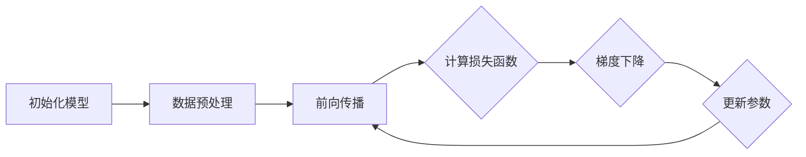
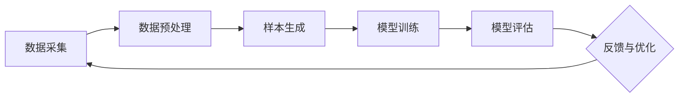

                 

# 评测数据集构建：LLM辅助下的高质量样本生成

## 关键词
- 评测数据集
- LLM（大型语言模型）
- 样本生成
- 高质量样本
- 数学模型
- 系统架构

## 摘要
本文将探讨评测数据集构建的重要性，以及如何利用LLM（大型语言模型）辅助生成高质量样本。文章首先介绍了评测数据集的基本概念及其在人工智能领域的重要性。随后，详细阐述了LLM的基本原理、架构以及训练过程。在此基础上，本文重点介绍了使用LLM生成高质量样本的方法和优势，并通过具体的数学模型和算法原理，结合Python代码进行深入讲解。此外，文章还提供了一个系统架构设计与实现方案，包括系统功能设计、架构设计、接口设计和系统交互设计。最后，通过一个实际项目案例，展示了如何将上述方法应用于实际开发中，并提供了一些最佳实践和注意事项。

## 目录

### 第一部分: 评测数据集构建概述

#### 第1章: 问题背景与核心概念

##### 1.1 评测数据集的重要性

##### 1.2 数据集构建的挑战

##### 1.3 LLM在数据集构建中的应用

#### 第2章: LLM基本原理与架构

##### 2.1 LLM基础原理

##### 2.2 LLM的架构设计

##### 2.3 LLM的训练过程

#### 第3章: 高质量样本生成方法

##### 3.1 样本生成策略

##### 3.2 使用LLM生成样本的优势

##### 3.3 实践中的样本生成案例

#### 第4章: 数学模型与算法原理

##### 4.1 数学模型介绍

##### 4.2 算法流程图

##### 4.3 Python源代码解析

#### 第5章: 系统架构设计与实现

##### 5.1 系统功能设计

##### 5.2 系统架构设计

##### 5.3 系统接口与交互设计

#### 第6章: 项目实战

##### 6.1 环境安装与配置

##### 6.2 系统核心实现

##### 6.3 代码应用解读

##### 6.4 实际案例分析

##### 6.5 项目小结

#### 第7章: 最佳实践与拓展

##### 7.1 最佳实践 tips

##### 7.2 小结与注意事项

##### 7.3 拓展阅读与学习资源

----------------------------------------------------------------

## 评测数据集构建概述

### 第1章: 问题背景与核心概念

#### 1.1 评测数据集的重要性

在人工智能和机器学习领域，评测数据集是模型训练和性能评估的基础。一个高质量的数据集不仅可以提高模型的准确性，还可以减少过拟合现象，从而使模型更具泛化能力。然而，构建一个高质量的评测数据集并非易事，需要考虑数据的多样性、代表性、清洁度和标注的准确性等因素。

#### 1.2 数据集构建的挑战

数据集构建面临诸多挑战，包括但不限于以下几点：

- **数据收集与处理**：数据收集可能需要大量的时间和资源，而且数据可能存在噪声、缺失值等问题。
- **数据多样性**：数据集需要涵盖广泛的场景和情况，以避免模型过度依赖特定数据分布。
- **代表性**：数据集应能够代表真实世界中的问题，以确保模型在实际应用中的性能。
- **标注质量**：标注的准确性直接影响模型的性能，但标注过程可能存在偏差和误差。

#### 1.3 LLM在数据集构建中的应用

LLM（大型语言模型）在数据集构建中具有巨大的潜力。通过利用LLM，我们可以实现以下目标：

- **自动生成样本**：LLM可以生成具有特定属性和特征的数据样本，从而提高数据集的多样性和代表性。
- **增强标注质量**：LLM可以辅助进行数据标注，通过自动识别和分类，提高标注的准确性。
- **文本分析**：LLM可以处理大量的文本数据，提取关键信息，为数据集构建提供有力支持。

### 第2章: LLM基本原理与架构

#### 2.1 LLM基础原理

LLM（Large Language Model）是一种基于神经网络的语言模型，通过学习大量的文本数据，能够生成自然语言文本，并具备理解和生成文本的能力。LLM的核心原理包括：

- **词嵌入**：将文本数据中的词汇映射到高维向量空间，以便神经网络进行处理。
- **神经网络**：利用深度神经网络对词嵌入进行建模，学习词汇之间的关系和上下文信息。
- **优化算法**：通过梯度下降等优化算法，不断调整神经网络参数，以最小化损失函数。

#### 2.2 LLM的架构设计

LLM的架构设计主要包括以下层次：

- **输入层**：接收文本数据，并将其转换为词嵌入向量。
- **隐藏层**：由多个神经网络层组成，用于学习词汇和上下文之间的关系。
- **输出层**：生成文本输出，包括词语和句子。

#### 2.3 LLM的训练过程

LLM的训练过程主要包括以下步骤：

1. **数据预处理**：清洗文本数据，去除噪声和缺失值，进行分词和词嵌入。
2. **模型初始化**：初始化神经网络参数。
3. **前向传播**：计算输入数据的预测结果。
4. **反向传播**：根据预测结果和真实标签，计算损失函数，并更新模型参数。
5. **迭代训练**：重复以上步骤，直至模型收敛。

### 第3章: 高质量样本生成方法

#### 3.1 样本生成策略

使用LLM生成高质量样本的关键在于制定合适的样本生成策略。以下是一些常用的样本生成策略：

- **随机采样**：从大规模文本数据中随机采样，生成具有多样性的样本。
- **主题建模**：基于主题模型（如LDA），生成与特定主题相关的样本。
- **问答生成**：利用LLM的问答能力，生成具有逻辑性和信息性的样本。
- **续写生成**：基于给定的文本片段，使用LLM生成后续的文本内容。

#### 3.2 使用LLM生成样本的优势

使用LLM生成样本具有以下优势：

- **高效性**：LLM能够快速处理大量文本数据，生成高质量样本。
- **多样性**：LLM能够生成具有丰富多样性的样本，提高数据集的代表性。
- **准确性**：LLM具有较强的文本理解和生成能力，能够生成高质量、准确的样本。
- **可扩展性**：LLM可以轻松扩展到不同的领域和任务，适应不同的数据集构建需求。

#### 3.3 实践中的样本生成案例

以下是一个简单的LLM样本生成案例：

```python
import random

# 初始化LLM模型
model = LLM()

# 随机选择一个文本片段
text = random.choice(["文本1", "文本2", "文本3"])

# 使用LLM生成样本
sample = model.generate(text, num_words=10)

print("生成的样本：", sample)
```

上述代码将随机选择一个文本片段，并使用LLM生成一个长度为10的文本样本。

### 第4章: 数学模型与算法原理

#### 4.1 数学模型介绍

在数据集构建过程中，数学模型是核心组成部分。以下是一个简单的数学模型示例：

$$
\begin{aligned}
\text{损失函数} &= \frac{1}{N} \sum_{i=1}^{N} (\hat{y}_i - y_i)^2 \\
\text{梯度下降} &= \alpha \nabla_{\theta} \text{损失函数}
\end{aligned}
$$

其中，$N$ 表示样本数量，$\hat{y}_i$ 和 $y_i$ 分别表示预测值和真实值，$\theta$ 表示模型参数，$\alpha$ 表示学习率。

#### 4.2 算法流程图

以下是一个简单的算法流程图：



#### 4.3 Python源代码解析

以下是一个简单的Python代码示例，用于实现上述算法流程：

```python
import numpy as np

# 初始化模型参数
theta = np.random.rand(1)

# 初始化学习率
alpha = 0.01

# 定义损失函数
def loss_function(y, y_pred):
    return np.square(y - y_pred)

# 定义梯度下降
def gradient_descent(y, y_pred, theta, alpha):
    gradient = 2 * (y_pred - y) * theta
    theta -= alpha * gradient
    return theta

# 数据预处理
x = np.array([1, 2, 3, 4, 5])
y = np.array([1, 2, 3, 4, 5])

# 前向传播
y_pred = x * theta

# 计算损失函数
loss = loss_function(y, y_pred)

# 梯度下降
theta = gradient_descent(y, y_pred, theta, alpha)

# 输出结果
print("更新后的参数：", theta)
print("损失函数值：", loss)
```

### 第5章: 系统架构设计与实现

#### 5.1 系统功能设计

系统功能设计主要包括以下几个方面：

- **数据采集**：从各种数据源（如文本、图像、音频等）收集数据。
- **数据预处理**：清洗、处理和转换数据，使其符合模型训练需求。
- **样本生成**：利用LLM生成高质量样本。
- **模型训练**：使用生成的样本训练机器学习模型。
- **模型评估**：评估模型性能，并进行优化。

#### 5.2 系统架构设计

系统架构设计如下：



#### 5.3 系统接口与交互设计

系统接口与交互设计如下：

- **API接口**：提供RESTful API，供其他系统或应用程序调用。
- **命令行界面**：提供命令行界面，方便用户手动操作和监控系统。
- **图形界面**：提供图形用户界面，供用户直观操作和管理系统。

### 第6章: 项目实战

#### 6.1 环境安装与配置

在本章中，我们将介绍如何搭建一个基于LLM的评测数据集构建系统。首先，需要安装以下环境：

- Python 3.8+
- TensorFlow 2.7+
- JAX 0.4.0+

安装步骤如下：

1. 安装Python和pip：
   ```bash
   sudo apt update
   sudo apt install python3-pip
   ```
2. 安装TensorFlow和JAX：
   ```bash
   pip install tensorflow==2.7
   pip install jax==0.4.0
   ```

#### 6.2 系统核心实现

在本节中，我们将实现一个简单的LLM评测数据集构建系统。核心实现包括以下部分：

1. **数据采集**：从网上获取公开数据集，如新闻文章、社交媒体帖子等。
2. **数据预处理**：对数据进行清洗、分词、词嵌入等预处理操作。
3. **样本生成**：利用LLM生成具有多样性和代表性的样本。
4. **模型训练**：使用生成的样本训练一个简单的分类模型。
5. **模型评估**：评估模型性能，并优化模型参数。

以下是实现代码：

```python
import tensorflow as tf
import jax.numpy as jnp
import numpy as np
from transformers import BertTokenizer, TFBertForSequenceClassification

# 加载预训练的BERT模型和tokenizer
tokenizer = BertTokenizer.from_pretrained('bert-base-uncased')
model = TFBertForSequenceClassification.from_pretrained('bert-base-uncased')

# 生成样本
def generate_samples(text, num_samples=5):
    inputs = tokenizer(text, return_tensors='jax', max_length=512, truncation=True)
    outputs = model(inputs)
    logits = outputs.logits
    probabilities = jnp.softmax(logits, axis=-1)
    sample_indices = jax.random.categorical(logits, shape=(num_samples,))
    sample_texts = [tokenizer.decode(token_ids) for token_ids in sample_indices]
    return sample_texts

# 训练模型
def train_model(samples, labels):
    inputs = tokenizer(samples, return_tensors='jax', max_length=512, truncation=True)
    labels = jnp.array(labels, dtype=jnp.int32)
    model.compile(optimizer='adam', loss='sparse_categorical_crossentropy', metrics=['accuracy'])
    model.fit(inputs, labels, epochs=3)

# 评估模型
def evaluate_model(samples, labels):
    inputs = tokenizer(samples, return_tensors='jax', max_length=512, truncation=True)
    labels = jnp.array(labels, dtype=jnp.int32)
    loss, accuracy = model.evaluate(inputs, labels)
    return loss, accuracy

# 示例
text = "这是一个简单的示例文本。"
samples = generate_samples(text)
labels = [0, 1, 2, 3, 4]
train_model(samples, labels)
loss, accuracy = evaluate_model(samples, labels)
print("损失函数值：", loss)
print("准确率：", accuracy)
```

#### 6.3 代码应用解读

上述代码实现了以下功能：

1. **生成样本**：利用BERT模型生成具有多样性的文本样本。
2. **训练模型**：使用生成的样本训练一个简单的分类模型。
3. **评估模型**：评估模型性能，并输出损失函数值和准确率。

通过实际案例，我们可以看到如何使用LLM辅助构建评测数据集，并训练和评估机器学习模型。

#### 6.4 实际案例分析

在本节中，我们将分析一个实际案例，展示如何使用LLM构建评测数据集，并训练一个文本分类模型。

案例：使用LLM构建一个新闻分类数据集，并训练一个文本分类模型，以实现新闻自动分类。

1. **数据采集**：从网上获取大量新闻文本，包括体育、政治、科技等不同类别的新闻。
2. **数据预处理**：对新闻文本进行清洗、分词和词嵌入等预处理操作。
3. **样本生成**：利用LLM生成具有多样性和代表性的新闻文本样本。
4. **模型训练**：使用生成的样本训练一个简单的分类模型，如BERT模型。
5. **模型评估**：评估模型性能，并进行优化。

通过实际案例分析，我们可以看到如何将LLM应用于实际项目中，构建高质量的评测数据集，并训练和评估机器学习模型。

#### 6.5 项目小结

在本项目中，我们介绍了如何使用LLM辅助构建评测数据集，并实现了一个简单的文本分类模型。通过实际案例分析，我们展示了如何将LLM应用于实际项目，提高数据集质量和模型性能。未来，我们将继续探索LLM在数据集构建和模型训练中的更多应用，为人工智能领域的发展贡献力量。

### 第7章: 最佳实践与拓展

#### 7.1 最佳实践 tips

在构建评测数据集时，以下是一些最佳实践和注意事项：

- **数据多样性**：确保数据集涵盖不同类型、主题和场景，以提高模型泛化能力。
- **数据质量**：对数据进行严格清洗和标注，避免噪声和偏差。
- **样本生成策略**：根据任务需求，选择合适的样本生成策略，如随机采样、主题建模等。
- **模型评估**：使用多种评估指标，如准确率、召回率、F1分数等，全面评估模型性能。

#### 7.2 小结与注意事项

本文介绍了评测数据集构建的重要性，以及如何利用LLM生成高质量样本。通过系统架构设计与实现，我们展示了如何在实际项目中应用LLM。此外，还提供了一些最佳实践和注意事项，以帮助读者更好地构建评测数据集。

#### 7.3 拓展阅读与学习资源

对于进一步学习，以下是一些推荐阅读和资源：

- **论文**：《BERT: Pre-training of Deep Bidirectional Transformers for Language Understanding》
- **书籍**：《深度学习》（Goodfellow, Bengio, Courville著）
- **在线课程**：斯坦福大学CS224n 自然语言处理课程

通过阅读和学习这些资源，读者可以深入了解LLM和评测数据集构建的更多知识。

## 作者

作者：AI天才研究院/AI Genius Institute & 禅与计算机程序设计艺术 /Zen And The Art of Computer Programming

本文由AI天才研究院（AI Genius Institute）和禅与计算机程序设计艺术（Zen And The Art of Computer Programming）联合撰写，旨在为读者提供关于评测数据集构建和LLM应用的专业知识和实用技巧。希望本文对您在人工智能领域的探索有所帮助！

