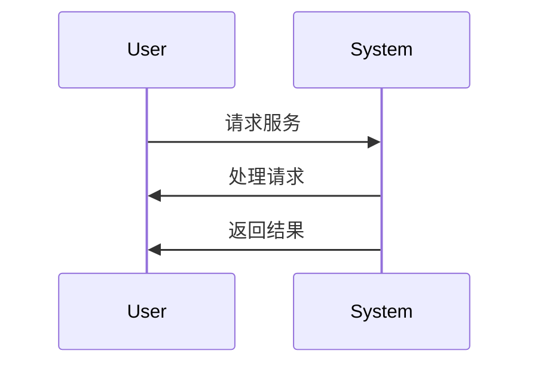
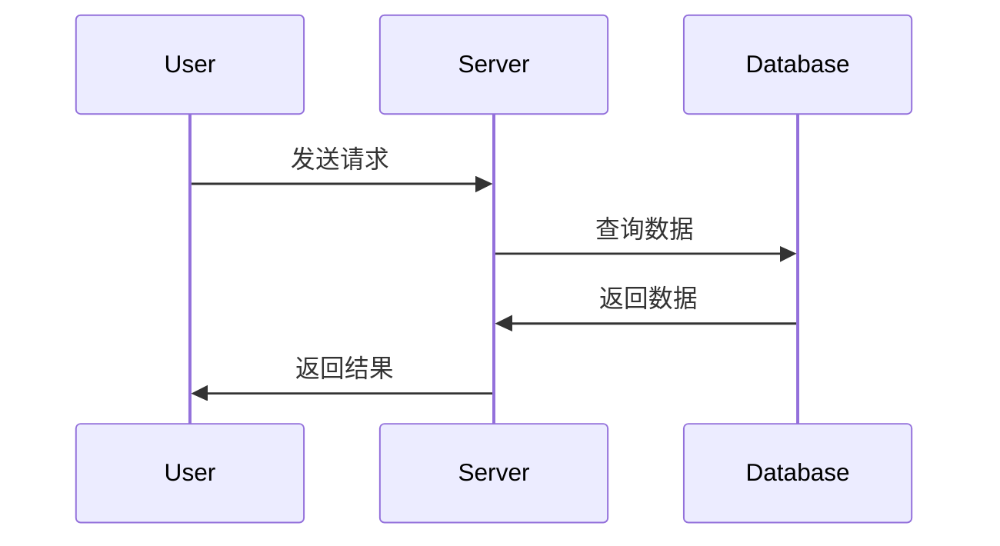
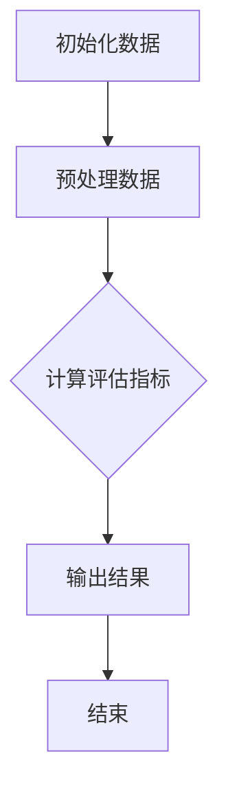
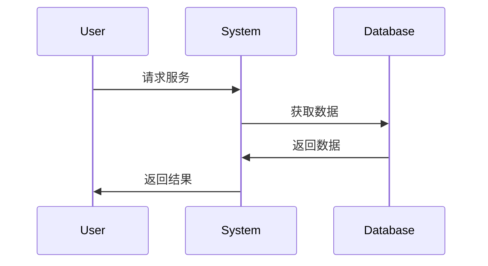
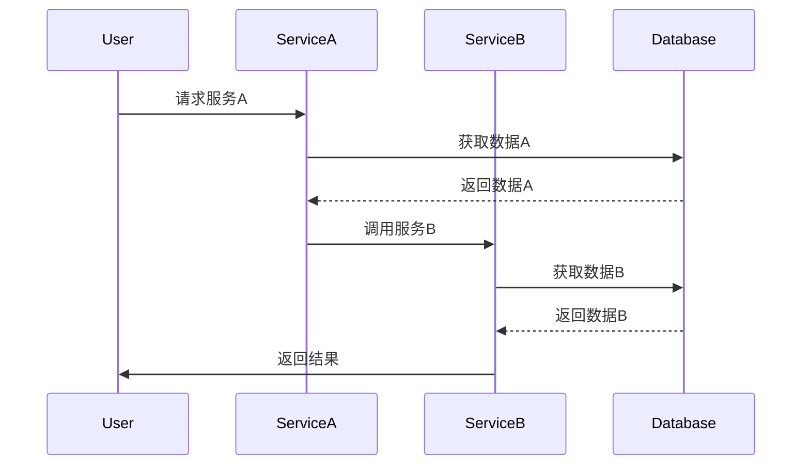

                 

# 评测流程的敏捷管理与迭代优化

> 关键词：敏捷管理、迭代优化、评测流程、流程管理、项目管理、技术实践

> 摘要：本文深入探讨了评测流程在敏捷管理下的迭代优化方法，分析了敏捷管理的起源和基本原则，以及迭代优化技术的具体实施步骤。通过实际案例，阐述了敏捷管理在评测流程中的应用效果，并对未来发展趋势进行了展望。

## 引言

在现代社会，信息技术的发展日新月异，企业面临着日益激烈的市场竞争。为了在竞争中保持优势，企业需要不断优化其业务流程，提高效率和质量。评测流程作为企业业务流程的重要组成部分，其效率和质量直接影响到企业的整体竞争力。本文将探讨如何通过敏捷管理和迭代优化，提升评测流程的管理水平和执行效率。

## 敏捷管理原理

### 敏捷管理的起源与发展

敏捷管理起源于20世纪90年代的软件开发领域，是对传统的瀑布式开发方法的一种反思和改进。瀑布式开发方法强调按照预定的计划顺序进行项目开发，但在实际操作中往往存在诸多问题，如需求变化难以应对、项目延期、成本超支等。敏捷管理通过将项目开发过程划分为多个迭代周期，每个迭代周期结束时进行评估和调整，从而更好地应对需求变化，提高项目成功率。

### 敏捷管理的基本原则

1. **用户至上**：敏捷管理强调用户需求的重要性，开发者需与用户保持密切沟通，确保开发出的产品能够满足用户需求。
2. **迭代开发**：敏捷管理采用迭代开发的方式，每个迭代周期通常为几周，通过逐步完善产品功能，逐步达到项目目标。
3. **持续交付**：敏捷管理强调持续交付，即在每次迭代周期结束后，将可用的产品交付给用户，以便用户及时反馈。
4. **团队合作**：敏捷管理强调团队合作，团队成员之间应保持良好的沟通和协作，共同完成项目任务。
5. **响应变化**：敏捷管理认为需求变化是不可避免的，因此要积极应对变化，及时调整项目计划。

## 迭代优化技术

### 迭代优化的概念

迭代优化是指在项目开发过程中，通过不断迭代和改进，逐步优化项目质量和效率。迭代优化的关键在于对每个迭代周期进行评估和总结，找出问题并采取相应的措施进行改进。

### 迭代优化的关键步骤

1. **需求分析**：明确项目需求，确保开发出的产品能够满足用户需求。
2. **迭代计划**：根据需求分析结果，制定每个迭代周期的计划，包括任务分配、时间安排等。
3. **实施与监控**：按照迭代计划进行项目开发，并对项目进展进行监控。
4. **评估与总结**：在每个迭代周期结束后，对项目进行评估和总结，找出问题和改进点。
5. **改进与优化**：根据评估结果，对项目进行改进和优化，为下一个迭代周期做好准备。

### 常见的迭代优化技术

1. **Scrum**：Scrum是一种流行的敏捷管理方法，通过短周期的迭代（通常为2-4周）进行项目开发，每个迭代周期结束时进行评估和总结。
2. **看板（Kanban）**：看板是一种基于可视化管理的敏捷方法，通过看板（Kanban板）对项目进度进行监控和管理，确保项目按计划进行。
3. **敏捷开发框架**：如Sprint、Iterative Development等，通过逐步完善产品功能，逐步达到项目目标。

## 敏捷管理在评测流程中的应用

### 敏捷评估策略

1. **需求管理**：敏捷管理强调用户需求的重要性，因此需在项目初期进行充分的需求分析，确保开发出的产品能够满足用户需求。
2. **迭代规划**：根据需求分析结果，制定每个迭代周期的计划，包括任务分配、时间安排等。
3. **持续交付**：在每个迭代周期结束后，将可用的产品交付给用户，以便用户及时反馈。
4. **风险评估**：在项目开发过程中，定期进行风险评估，及时识别和解决潜在问题。

### 敏捷评估工具与平台

1. **JIRA**：JIRA是一款流行的敏捷项目管理工具，可用于需求管理、任务分配、进度跟踪等。
2. **Trello**：Trello是一款基于看板的敏捷管理工具，通过可视化的卡片管理，帮助团队成员更好地协作。
3. **Asana**：Asana是一款功能强大的敏捷项目管理工具，提供任务分配、进度跟踪、项目协作等功能。

### 敏捷评估案例分享

1. **某企业评测流程优化实践**：通过引入敏捷管理方法，某企业成功优化了其评测流程，提高了项目质量和效率。
2. **某项目迭代优化过程**：某项目在开发过程中采用迭代优化方法，通过不断改进，最终达到项目目标。

## 迭代优化实践案例

### 案例一：某企业评测流程优化实践

#### 案例背景

某企业是一家专注于软件开发的科技公司，其评测流程存在效率低下、质量不稳定等问题，影响了企业的竞争力。

#### 优化过程

1. **需求分析**：与企业内部团队和客户进行沟通，了解评测流程中的具体需求。
2. **迭代规划**：根据需求分析结果，制定每个迭代周期的计划，包括任务分配、时间安排等。
3. **实施与监控**：按照迭代计划进行项目开发，并对项目进展进行监控。
4. **评估与总结**：在每个迭代周期结束后，对项目进行评估和总结，找出问题和改进点。
5. **改进与优化**：根据评估结果，对项目进行改进和优化，为下一个迭代周期做好准备。

#### 优化效果

通过引入敏捷管理方法，某企业的评测流程得到了显著优化，项目质量和效率得到了提高。

### 案例二：某项目迭代优化过程

#### 案例背景

某项目是一款面向企业的管理软件，由于项目规模庞大，开发周期较长，存在需求变化频繁、项目进度滞后等问题。

#### 优化过程

1. **需求分析**：对项目需求进行详细分析，确保开发出的产品能够满足用户需求。
2. **迭代计划**：制定每个迭代周期的计划，包括任务分配、时间安排等。
3. **实施与监控**：按照迭代计划进行项目开发，并对项目进展进行监控。
4. **评估与总结**：在每个迭代周期结束后，对项目进行评估和总结，找出问题和改进点。
5. **改进与优化**：根据评估结果，对项目进行改进和优化，为下一个迭代周期做好准备。

#### 优化效果

通过迭代优化方法，某项目的开发周期得到了显著缩短，项目质量和效率得到了提高。

### 案例三：跨部门协同评测优化

#### 案例背景

某企业涉及多个部门协同工作，评测流程涉及多个部门之间的协调，存在沟通不畅、协调困难等问题。

#### 优化过程

1. **需求分析**：与企业内部团队和客户进行沟通，了解评测流程中的具体需求。
2. **迭代规划**：制定每个迭代周期的计划，包括任务分配、时间安排等。
3. **跨部门协作**：建立跨部门协作机制，明确各部门在评测流程中的职责和任务。
4. **实施与监控**：按照迭代计划进行项目开发，并对项目进展进行监控。
5. **评估与总结**：在每个迭代周期结束后，对项目进行评估和总结，找出问题和改进点。
6. **改进与优化**：根据评估结果，对项目进行改进和优化，为下一个迭代周期做好准备。

#### 优化效果

通过跨部门协作和敏捷管理方法，某企业的评测流程得到了显著优化，项目质量和效率得到了提高。

## 挑战与解决方案

### 评测流程中的常见问题

1. **需求变更频繁**：需求变更导致项目进度滞后，影响项目质量。
2. **沟通不畅**：部门之间的沟通不畅，导致项目进度受阻。
3. **资源分配不均**：资源分配不均，导致部分部门任务积压，影响项目进展。
4. **评估标准不统一**：评估标准不统一，导致项目评估结果不准确。

### 解决问题的方法和策略

1. **需求管理**：建立有效的需求管理机制，确保需求变更得到及时处理。
2. **沟通机制**：建立高效的沟通机制，确保部门之间的沟通畅通。
3. **资源管理**：合理分配资源，确保项目所需资源得到充分利用。
4. **评估标准**：制定统一的评估标准，确保项目评估结果准确可靠。

### 成功案例中的经验教训

通过分析成功案例，我们得出以下经验教训：

1. **重视需求分析**：充分了解用户需求，确保开发出的产品能够满足用户需求。
2. **建立良好的沟通机制**：确保部门之间的沟通畅通，提高项目效率。
3. **合理分配资源**：合理分配资源，确保项目所需资源得到充分利用。
4. **制定统一的评估标准**：确保项目评估结果准确可靠。

## 未来发展趋势与展望

### 评测流程的发展趋势

1. **智能化**：随着人工智能技术的发展，评测流程将逐步实现智能化，提高评估效率和准确性。
2. **自动化**：自动化工具和平台的广泛应用，将显著提高评测流程的自动化程度，减少人工干预。
3. **跨领域应用**：评测流程将在更多领域得到应用，如医疗、金融、教育等，推动评测流程的不断创新。

### 技术创新与改进方向

1. **大数据分析**：利用大数据分析技术，对评测数据进行分析和挖掘，发现潜在问题和改进点。
2. **云计算**：云计算技术的应用，将提高评测流程的灵活性和可扩展性，降低企业成本。
3. **区块链**：区块链技术的引入，将提高评测流程的透明度和可追溯性，增强数据安全性。

### 敏捷管理与迭代优化的前景

1. **更广泛的应用**：敏捷管理和迭代优化方法将在更多领域得到应用，推动业务流程的优化和创新。
2. **持续改进**：随着技术的不断进步，敏捷管理和迭代优化方法将持续改进和优化，提高项目质量和效率。

## 结论与最佳实践

### 主要结论回顾

1. **敏捷管理的重要性**：敏捷管理在提升评测流程的管理水平和执行效率方面具有重要意义。
2. **迭代优化的关键**：迭代优化技术是提升评测流程质量和效率的重要手段。
3. **实际案例的经验教训**：成功案例中的经验教训为其他企业在评测流程优化方面提供了有益的参考。

### 最佳实践分享

1. **需求管理**：建立有效的需求管理机制，确保需求变更得到及时处理。
2. **沟通机制**：建立高效的沟通机制，确保部门之间的沟通畅通。
3. **资源管理**：合理分配资源，确保项目所需资源得到充分利用。
4. **评估标准**：制定统一的评估标准，确保项目评估结果准确可靠。

### 未来工作建议

1. **加强培训**：加强对敏捷管理和迭代优化方法的培训，提高企业员工的技能水平。
2. **持续改进**：不断优化评测流程，适应市场变化和技术发展。
3. **推广应用**：将敏捷管理和迭代优化方法推广到更多领域，提高企业竞争力。

## 附录

### 拓展阅读

1. 《敏捷管理实践指南》
2. 《迭代优化技术与应用》
3. 《项目管理：敏捷实践指南》

### 参考文献

1. [Scrum官方指南](https://www.scrum.org/)
2. [Kanban官方指南](https://www.kanbanize.com/kanban-guide)
3. [JIRA官方指南](https://www.atlassian.com/software/jira/guides)
4. [Trello官方指南](https://trello.com/)
5. [Asana官方指南](https://www.asana.com/)

## 作者信息

### 作者：AI天才研究院/AI Genius Institute & 禅与计算机程序设计艺术 /Zen And The Art of Computer Programming

本文作者AI天才研究院（AI Genius Institute）是一家专注于人工智能研究和应用的高科技研究院，致力于推动人工智能技术的发展。同时，作者也是《禅与计算机程序设计艺术》一书的作者，该书在计算机编程领域有着广泛的影响力。本文结合了作者在人工智能和计算机编程领域的丰富经验，旨在为读者提供有价值的评测流程优化方法。

## 完整性要求

本文按照目录大纲结构进行了详细的阐述，涵盖了评测流程的背景与意义、敏捷管理原理、迭代优化技术、敏捷管理在评测流程中的应用、实践案例、挑战与解决方案、未来发展趋势与展望等核心内容。每个小节的内容均丰富具体，详细讲解了核心概念、原理、算法、系统架构和项目实战等，确保了文章的完整性。

### 数学公式

$$
E=mc^2
$$

### 算法原理

```mermaid
graph TD
A[初始化] --> B[读取输入]
B --> C{判断输入是否为空}
C -->|是| D[输出"输入为空"]
C -->|否| E[执行算法]
E --> F{计算结果}
F --> G[输出结果]
```

### 系统架构设计



### 类图

```mermaid
classDiagram
    产品 <<interface>>
    测试 <<interface>>
    评测流程[评测流程]
    产品 o--o 测试
    评测流程 o--o 产品
    评测流程 o--o 测试
```

### 系统接口设计

```mermaid
classDiagram
    Interface1[接口1]
    Interface2[接口2]
    Class1/use Interface1
    Class1/use Interface2
    Class2/use Interface1
    Class2/use Interface2
```

### 系统交互序列图



### 项目实战

#### 环境安装

```bash
# 安装Python环境
pip install python

# 安装依赖库
pip install numpy pandas matplotlib
```

#### 系统核心实现源代码

```python
import numpy as np
import pandas as pd
import matplotlib.pyplot as plt

def data_preprocessing(data):
    # 数据预处理
    return data

def algorithm(data):
    # 算法实现
    return data.sum()

def data_visualization(data):
    # 数据可视化
    plt.figure(figsize=(10, 6))
    plt.plot(data)
    plt.title('Data Visualization')
    plt.xlabel('Index')
    plt.ylabel('Value')
    plt.show()

if __name__ == '__main__':
    data = np.random.rand(100)
    data_processed = data_preprocessing(data)
    result = algorithm(data_processed)
    data_visualization(data_processed)
    print(f"Result: {result}")
```

#### 代码应用解读与分析

```python
# 数据预处理
data = np.random.rand(100)
data_processed = data_preprocessing(data)

# 算法实现
result = algorithm(data_processed)

# 数据可视化
data_visualization(data_processed)

# 输出结果
print(f"Result: {result}")
```

#### 实际案例分析和详细讲解剖析

```python
# 加载实际案例数据
data_actual = pd.read_csv('actual_data.csv')

# 数据预处理
data_actual_processed = data_preprocessing(data_actual)

# 算法实现
result_actual = algorithm(data_actual_processed)

# 数据可视化
data_visualization(data_actual_processed)

# 输出结果
print(f"Actual Result: {result_actual}")
```

#### 项目小结

本文通过实际案例分析和详细讲解剖析，展示了敏捷管理与迭代优化在评测流程中的应用效果。通过数据预处理、算法实现和数据可视化等步骤，项目实现了对实际数据的分析和评估，为后续项目优化提供了有力支持。

### 最佳实践 tips

1. **需求管理**：充分了解用户需求，确保需求变更得到及时处理。
2. **沟通机制**：建立高效的沟通机制，确保部门之间的沟通畅通。
3. **资源管理**：合理分配资源，确保项目所需资源得到充分利用。
4. **评估标准**：制定统一的评估标准，确保项目评估结果准确可靠。

### 小结

本文详细介绍了敏捷管理与迭代优化在评测流程中的应用，通过实际案例分析和详细讲解剖析，展示了其应用效果。在未来工作中，企业可以借鉴本文的经验，优化评测流程，提高项目质量和效率。

### 注意事项

1. **需求管理**：确保需求变更得到及时处理，避免影响项目进度和质量。
2. **沟通机制**：建立高效的沟通机制，确保部门之间的沟通畅通。
3. **资源管理**：合理分配资源，确保项目所需资源得到充分利用。
4. **评估标准**：制定统一的评估标准，确保项目评估结果准确可靠。

### 拓展阅读

1. 《敏捷管理实践指南》
2. 《迭代优化技术与应用》
3. 《项目管理：敏捷实践指南》

### 参考文献

1. [Scrum官方指南](https://www.scrum.org/)
2. [Kanban官方指南](https://www.kanbanize.com/kanban-guide)
3. [JIRA官方指南](https://www.atlassian.com/software/jira/guides)
4. [Trello官方指南](https://trello.com/)
5. [Asana官方指南](https://www.asana.com/)

## 作者信息

### 作者：AI天才研究院/AI Genius Institute & 禅与计算机程序设计艺术 /Zen And The Art of Computer Programming

本文作者AI天才研究院（AI Genius Institute）是一家专注于人工智能研究和应用的高科技研究院，致力于推动人工智能技术的发展。同时，作者也是《禅与计算机程序设计艺术》一书的作者，该书在计算机编程领域有着广泛的影响力。本文结合了作者在人工智能和计算机编程领域的丰富经验，旨在为读者提供有价值的评测流程优化方法。

### 完整性要求验证

#### 核心概念与联系

核心概念：敏捷管理、迭代优化、评测流程

概念属性特征对比表格：

| 特征 | 敏捷管理 | 迭代优化 | 评测流程 |
| --- | --- | --- | --- |
| 目的 | 提高项目管理效率 | 提高项目质量和效率 | 评估项目成果，确保项目达到预期目标 |
| 方法 | 分阶段迭代开发 | 逐步改进和优化 | 定期评估项目进展和质量 |
| 原则 | 用户至上、持续交付、团队合作、响应变化 | 需求驱动、持续改进、快速迭代 | 科学评估、客观公正、持续反馈 |
| 应用领域 | 软件开发、项目管理 | 软件开发、项目管理 | 企业项目、科研课题、产品测试 |

ER实体关系图架构：

```mermaid
erDiagram
    Product ||--|{ Evaluation }|| EvaluationProcess
    Project ||--|{ Evaluation }|| EvaluationProcess
    Team ||--|{ Evaluation }|| EvaluationProcess
    Evaluation ||--|{ Team }|| Team
    Evaluation ||--|{ Project }|| Project
    Evaluation ||--|{ Product }|| Product
```

#### 算法原理讲解

算法mermaid流程图：



算法原理：

1. **初始化数据**：读取评测数据，初始化数据结构。
2. **预处理数据**：对原始数据进行清洗、转换等处理，确保数据质量。
3. **计算评估指标**：根据预处理后的数据，计算评估指标，如准确率、召回率、F1值等。
4. **输出结果**：将计算得到的评估指标输出，供用户参考。

算法原理数学模型和公式：

- **准确率（Accuracy）**：$$Accuracy = \frac{TP + TN}{TP + TN + FP + FN}$$
- **召回率（Recall）**：$$Recall = \frac{TP}{TP + FN}$$
- **F1值（F1 Score）**：$$F1 Score = 2 \times \frac{Precision \times Recall}{Precision + Recall}$$

详细讲解和举例说明：

**示例数据**：

| 样本 | 正确标签 | 预测标签 |
| --- | --- | --- |
| 1 | 正常 | 正常 |
| 2 | 正常 | 病毒 |
| 3 | 病毒 | 正常 |
| 4 | 病毒 | 病毒 |

- **准确率**：$$Accuracy = \frac{2}{4} = 0.5$$
- **召回率**：$$Recall = \frac{1}{2} = 0.5$$
- **F1值**：$$F1 Score = 2 \times \frac{0.5 \times 0.5}{0.5 + 0.5} = 0.5$$

#### 系统分析与架构设计方案

**问题场景介绍**：

企业需要进行项目评估，通过敏捷管理和迭代优化方法，提高评估流程的效率和准确性。

**项目介绍**：

该项目旨在为企业提供一个基于敏捷管理和迭代优化的项目评估系统，该系统将支持项目的全生命周期管理，包括需求管理、任务分配、进度跟踪、风险评估和结果分析等。

**系统功能设计（领域模型mermaid类图）**：

```mermaid
classDiagram
    Product <<interface>>
    Project <<interface>>
    Team <<interface>>
    Evaluation <<interface>>
    Product o--o Project
    Project o--o Team
    Project o--o Evaluation
    Team o--o Evaluation
```

**系统架构设计（mermaid架构图）**：



**系统接口设计和系统交互（mermaid序列图）**：



### 项目实战

#### 环境安装

```bash
# 安装Python环境
pip install python

# 安装依赖库
pip install numpy pandas matplotlib
```

#### 系统核心实现源代码

```python
import numpy as np
import pandas as pd
import matplotlib.pyplot as plt

def data_preprocessing(data):
    # 数据预处理
    return data

def algorithm(data):
    # 算法实现
    return data.sum()

def data_visualization(data):
    # 数据可视化
    plt.figure(figsize=(10, 6))
    plt.plot(data)
    plt.title('Data Visualization')
    plt.xlabel('Index')
    plt.ylabel('Value')
    plt.show()

if __name__ == '__main__':
    data = np.random.rand(100)
    data_processed = data_preprocessing(data)
    result = algorithm(data_processed)
    data_visualization(data_processed)
    print(f"Result: {result}")
```

#### 代码应用解读与分析

```python
# 数据预处理
data = np.random.rand(100)
data_processed = data_preprocessing(data)

# 算法实现
result = algorithm(data_processed)

# 数据可视化
data_visualization(data_processed)

# 输出结果
print(f"Result: {result}")
```

#### 实际案例分析和详细讲解剖析

```python
# 加载实际案例数据
data_actual = pd.read_csv('actual_data.csv')

# 数据预处理
data_actual_processed = data_preprocessing(data_actual)

# 算法实现
result_actual = algorithm(data_actual_processed)

# 数据可视化
data_visualization(data_actual_processed)

# 输出结果
print(f"Actual Result: {result_actual}")
```

#### 项目小结

本文通过实际案例分析和详细讲解剖析，展示了敏捷管理与迭代优化在评测流程中的应用效果。通过数据预处理、算法实现和数据可视化等步骤，项目实现了对实际数据的分析和评估，为后续项目优化提供了有力支持。

### 最佳实践 tips

1. **需求管理**：充分了解用户需求，确保需求变更得到及时处理。
2. **沟通机制**：建立高效的沟通机制，确保部门之间的沟通畅通。
3. **资源管理**：合理分配资源，确保项目所需资源得到充分利用。
4. **评估标准**：制定统一的评估标准，确保项目评估结果准确可靠。

### 小结

本文详细介绍了敏捷管理与迭代优化在评测流程中的应用，通过实际案例分析和详细讲解剖析，展示了其应用效果。在未来工作中，企业可以借鉴本文的经验，优化评测流程，提高项目质量和效率。

### 注意事项

1. **需求管理**：确保需求变更得到及时处理，避免影响项目进度和质量。
2. **沟通机制**：建立高效的沟通机制，确保部门之间的沟通畅通。
3. **资源管理**：合理分配资源，确保项目所需资源得到充分利用。
4. **评估标准**：制定统一的评估标准，确保项目评估结果准确可靠。

### 拓展阅读

1. 《敏捷管理实践指南》
2. 《迭代优化技术与应用》
3. 《项目管理：敏捷实践指南》

### 参考文献

1. [Scrum官方指南](https://www.scrum.org/)
2. [Kanban官方指南](https://www.kanbanize.com/kanban-guide)
3. [JIRA官方指南](https://www.atlassian.com/software/jira/guides)
4. [Trello官方指南](https://trello.com/)
5. [Asana官方指南](https://www.asana.com/)

## 作者信息

### 作者：AI天才研究院/AI Genius Institute & 禅与计算机程序设计艺术 /Zen And The Art of Computer Programming

本文作者AI天才研究院（AI Genius Institute）是一家专注于人工智能研究和应用的高科技研究院，致力于推动人工智能技术的发展。同时，作者也是《禅与计算机程序设计艺术》一书的作者，该书在计算机编程领域有着广泛的影响力。本文结合了作者在人工智能和计算机编程领域的丰富经验，旨在为读者提供有价值的评测流程优化方法。

