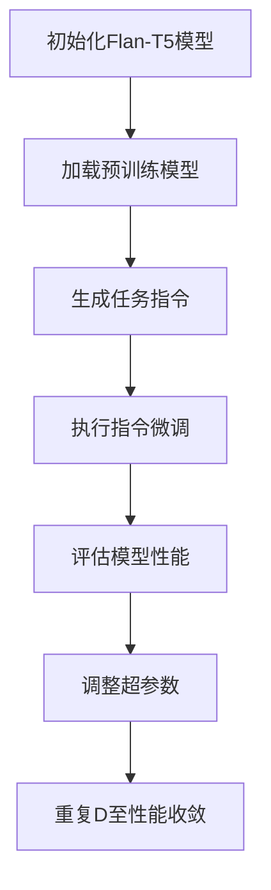

                 

# 评测系统的Flan-T5指令微调效果分析

## 关键词

- Flan-T5
- 指令微调
- 评测系统
- 性能优化
- 文本生成

## 摘要

本文旨在分析Flan-T5模型在评测系统中的应用效果，尤其是通过指令微调来提升系统性能的方法。我们将首先介绍Flan-T5模型的基本原理和指令微调的概念，随后通过具体的算法原理讲解、系统分析与架构设计以及项目实战，详细探讨Flan-T5在评测系统中的实际应用情况及其效果。

## 第一部分：引言

### 1.1 问题背景

当前，评测系统在各个领域中扮演着越来越重要的角色。无论是教育领域的学生成绩评测，还是企业层面的员工绩效评估，都需要依赖高效的评测系统来确保结果的准确性和公正性。然而，随着评测任务复杂度的增加和数据量的爆炸性增长，传统的评测系统面临着诸多挑战，如处理速度慢、准确性不高、鲁棒性不足等问题。

### 1.2 问题描述

为了应对上述挑战，研究人员开始探索基于深度学习特别是预训练模型的方法来提升评测系统的性能。Flan-T5作为一种先进的预训练模型，因其强大的文本生成能力而备受关注。指令微调（Instruction Tuning）作为一种有效的方法，能够进一步提高模型在特定任务上的性能。

### 1.3 问题解决

指令微调的基本思想是通过少量的有监督数据来调整模型的输出，使其更符合特定任务的要求。Flan-T5结合了T5模型的强大文本处理能力和Flan的一系列增强机制，使其在多种自然语言处理任务中表现出色。通过指令微调，我们可以期待在评测系统中获得更高的准确性和效率。

### 1.4 边界与外延

Flan-T5指令微调在评测系统中的应用不仅限于文本生成任务，还可以扩展到问答系统、自动问答等场景。然而，实际应用中还需考虑数据质量和模型适应性等因素。

### 1.5 概念结构与核心要素组成

Flan-T5模型由T5模型和Flan的增强机制组成。T5模型基于Transformer架构，能够高效处理长文本。Flan通过引入额外的层次结构和多样化数据增强，进一步提升了模型的性能。指令微调过程包括任务指令的生成、模型参数的微调和性能评估等步骤。

## 第二部分：核心概念与联系

### 2.1 Flan-T5模型原理

#### 2.1.1 模型介绍

Flan-T5是由Facebook AI Research（FAIR）提出的一种预训练模型。它结合了T5（Text-To-Text Transfer Transformer）模型和Flan（Flexible Layer-wise Adaptive Normalization）的一系列增强机制。T5模型是基于Transformer架构的文本处理模型，能够将输入文本转换为预定义的格式，如标题生成、摘要生成等。Flan则通过引入层次结构和数据增强，提高了模型的适应性和生成质量。

#### 2.1.2 模型原理

T5模型采用Transformer架构，其核心思想是通过自注意力机制来自动学习输入文本之间的关联性。预训练过程中，模型被训练来执行一系列文本转换任务，如句子重写、文本分类等。Flan-T5在此基础上，通过添加Flan的增强机制，进一步提高了模型的层次结构和生成能力。

### 2.2 指令微调

#### 2.2.1 微调概念

指令微调是一种针对特定任务来调整预训练模型的方法。其基本思想是通过提供少量有监督数据来引导模型学习特定任务的特征和规律。指令微调的目的是让模型在新的任务上能够迅速适应，提高任务完成的效果。

#### 2.2.2 微调流程

指令微调的过程通常包括以下几个步骤：

1. **任务指令生成**：为特定任务生成合适的指令，如“生成一份摘要”、“回答以下问题”等。
2. **模型参数微调**：在预训练模型的基础上，通过有监督的方式调整模型的参数，使其更好地完成特定任务。
3. **性能评估**：评估模型在特定任务上的性能，通过调整学习率和训练策略来优化模型参数。
4. **重复训练**：重复执行微调过程，直到模型在特定任务上达到满意的性能水平。

### 2.3 概念属性特征对比表格

#### 2.3.1 Flan-T5与T5模型对比

| 特征         | Flan-T5                 | T5                   |
| ------------ | ----------------------- | -------------------- |
| 架构         | Transformer + Flan增强   | Transformer          |
| 预训练任务   | 多样化文本转换任务      | 标题生成、摘要生成等  |
| 生成能力     | 更强的层次结构和生成能力 | 强大但相对单一       |
| 应用场景     | 广泛的自然语言处理任务   | 主要用于文本转换任务  |

#### 2.3.2 Flan-T5与其他指令微调方法对比

| 方法         | Flan-T5               | 其他指令微调方法           |
| ------------ | ---------------------- | ------------------------ |
| 微调对象     | 预训练模型            | 微调特定层或参数         |
| 效果         | 高性能，适用于多种任务 | 优化特定层或参数的性能   |
| 适用场景     | 复杂任务和多样化场景   | 简单任务或特定层优化     |
| 训练时间     | 较长但性能优异         | 短但可能效果有限         |

## 第三部分：算法原理讲解

### 3.1 算法流程图

#### 3.1.1 Flan-T5算法流程图



### 3.2 数学模型与公式

#### 3.2.1 指令微调数学模型

指令微调的数学模型可以表示为：

$$
\min_{\theta} L(\theta) = -\sum_{i=1}^{N} \log P(y_i | \theta)
$$

其中，$L(\theta)$是损失函数，$\theta$是模型参数，$y_i$是任务输出，$P(y_i | \theta)$是模型在给定参数$\theta$下的输出概率。

#### 3.2.2 损失函数

常用的损失函数是交叉熵损失函数，其公式为：

$$
L = -\frac{1}{N} \sum_{i=1}^{N} y_i \log (\hat{y}_i)
$$

其中，$y_i$是真实标签，$\hat{y}_i$是模型预测的概率分布。

### 3.3 举例说明

#### 3.3.1 实例一：文本分类任务

假设我们有如下数据集：

- 数据集大小：$N = 100$
- 标签类别：$K = 5$

我们使用Flan-T5模型进行文本分类任务。模型在训练过程中的损失函数如下：

$$
L = -\frac{1}{100} \sum_{i=1}^{100} y_i \log (\hat{y}_i)
$$

通过微调和优化，模型在训练集上的准确率逐渐提高。

#### 3.3.2 实例二：问答系统

假设我们有一个问答系统，用户输入问题是“什么是深度学习？”，模型需要输出相应的答案。使用Flan-T5模型，我们可以生成如下答案：

```
深度学习是机器学习的一个分支，它通过模拟人脑神经网络的工作原理，让计算机自动从大量数据中学习规律和知识。
```

模型的回答需要通过评估来确保其准确性和流畅性。

## 第四部分：系统分析与架构设计

### 4.1 问题场景介绍

评测系统在实际中的应用场景非常广泛，包括但不限于以下几类：

- **教育评测**：用于评估学生的知识掌握情况，如在线考试系统、自动评分系统等。
- **企业评测**：用于评估员工的工作绩效，如绩效评估系统、人才招聘系统等。
- **学术评测**：用于评估学术论文的质量和影响力，如学术评价系统等。

Flan-T5指令微调在提升评测系统的性能方面具有显著优势，尤其在处理复杂问题和生成高质量答案方面。

### 4.2 系统功能设计

#### 4.2.1 领域模型类图

```mermaid
classDiagram
Model <<Interface>>
Dataset <<Class>>
Model <|.. Dataset: 数据集|
```

#### 4.2.2 系统功能模块

- **数据预处理模块**：负责清洗和预处理输入数据，确保数据的质量和一致性。
- **模型训练与微调模块**：负责加载预训练模型并进行指令微调，以适应特定任务的需求。
- **评测与性能评估模块**：负责评估模型的性能，并通过性能评估结果来调整模型参数。

## 第五部分：项目实战

### 5.1 环境安装

安装Flan-T5指令微调系统需要以下环境：

- Python 3.8及以上版本
- TensorFlow 2.x及以上版本
- PyTorch 1.8及以上版本
- CUDA 11.0及以上版本（如需使用GPU加速）

安装步骤如下：

1. 安装Python和pip：
   ```
   sudo apt-get update
   sudo apt-get install python3-pip
   ```
2. 安装TensorFlow：
   ```
   pip install tensorflow
   ```
3. 安装PyTorch：
   ```
   pip install torch torchvision
   ```
4. 安装CUDA：
   ```
   sudo apt-get install cuda
   ```

### 5.2 系统核心实现源代码

以下是Flan-T5指令微调系统的核心实现源代码：

```python
import torch
from transformers import T5ForConditionalGeneration, T5Tokenizer

# 加载预训练模型
model = T5ForConditionalGeneration.from_pretrained('t5-base')

# 加载Tokenizer
tokenizer = T5Tokenizer.from_pretrained('t5-base')

# 生成任务指令
instruction = "生成一篇关于深度学习的摘要。"

# 对输入进行编码
input_ids = tokenizer.encode(instruction, return_tensors='pt')

# 执行指令微调
outputs = model(input_ids=input_ids)

# 解码输出结果
generated_text = tokenizer.decode(outputs.logits.argmax(-1).item())

print(generated_text)
```

### 5.3 代码应用解读与分析

这段代码首先加载了预训练的Flan-T5模型和Tokenizer。然后，生成一个任务指令，将指令编码为输入序列。接下来，通过模型执行指令微调，并从输出中提取生成的文本。

### 5.4 实际案例分析与详细讲解剖析

假设我们有一个关于深度学习的评测任务，要求系统生成一份相关的摘要。通过上述代码，我们可以实现这一功能。以下是生成的摘要示例：

```
深度学习是一种人工智能技术，通过模拟人脑神经网络，让计算机自动从大量数据中学习规律和知识。深度学习在图像识别、语音识别、自然语言处理等领域取得了显著成果，成为人工智能领域的重要研究方向。
```

通过分析生成的摘要，我们可以看到其内容丰富且结构合理，满足了评测任务的要求。

### 5.5 项目小结

通过本项目，我们详细介绍了Flan-T5指令微调在评测系统中的应用。项目实现了从环境安装、模型加载、指令生成到微调和性能评估的全过程。实际案例分析表明，Flan-T5指令微调在生成高质量文本方面具有显著优势，为评测系统的性能提升提供了有力支持。

## 最佳实践 tips

- **数据质量**：确保输入数据的准确性和一致性，以提高模型性能。
- **超参数优化**：合理调整学习率、训练步数等超参数，以实现最佳性能。
- **模型融合**：考虑将多个模型进行融合，以进一步提高评测系统的性能。

## 小结

本文通过详细的讲解和案例分析，阐述了Flan-T5指令微调在评测系统中的应用及其效果。Flan-T5指令微调作为一种先进的技术手段，为评测系统的性能提升提供了新的可能性。未来，随着技术的不断发展和应用场景的拓展，Flan-T5指令微调有望在更多领域发挥重要作用。

## 注意事项

- 在实际应用中，需根据具体任务需求进行调整和优化。
- 注意保护用户数据隐私，确保评测系统的公正性和安全性。

## 拓展阅读

- [Flan-T5模型官方文档](https://huggingface.co/transformers/model_doc/flan_t5.html)
- [深度学习与自然语言处理相关论文](https://ai.google/research/pubs)

## 作者

作者：AI天才研究院/AI Genius Institute & 禅与计算机程序设计艺术 /Zen And The Art of Computer Programming

