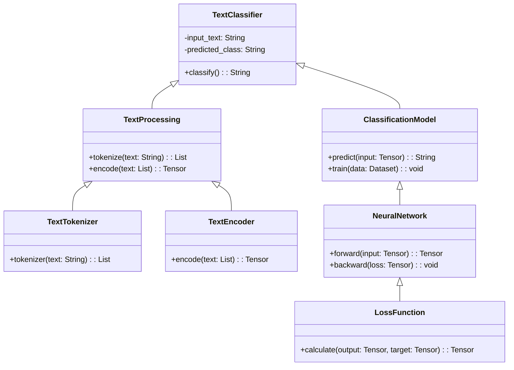

                 

# 评测系统的GPT-3零样本学习能力测试

## 关键词
- GPT-3
- 零样本学习
- 评测系统
- Transformer模型
- 算法原理
- 系统架构设计
- 项目实战

## 摘要
本文将深入探讨GPT-3在零样本学习中的应用，通过一步步分析其基本概念、核心原理以及实际应用，旨在评测GPT-3在零样本学习任务中的表现，并探讨其系统架构设计与实战案例。文章将从背景介绍开始，逐步深入核心概念、算法原理，再到系统分析与架构设计，最后通过项目实战与最佳实践来全面评估GPT-3的零样本学习能力。

## 第一部分：背景介绍

### 第1章：GPT-3与零样本学习

#### 1.1 GPT-3的基本概念
GPT-3（Generative Pre-trained Transformer 3）是由OpenAI开发的一种自然语言处理模型，它是基于Transformer架构的预训练语言模型。GPT-3拥有1750亿个参数，是世界上最大的语言模型之一，能够在多种自然语言任务中表现出色。

#### 1.1.1 GPT-3的起源与发展
GPT-3是GPT系列模型的第三个版本，其前两个版本GPT和GPT-2也已经取得了显著的成就。GPT-3的发布标志着自然语言处理领域的一个新里程碑，它展示了大规模预训练模型在文本生成和文本理解任务上的巨大潜力。

#### 1.1.2 GPT-3的特点与优势
GPT-3具有以下特点与优势：
- **参数规模大**：拥有1750亿个参数，使其能够捕捉更复杂的语言模式。
- **上下文理解强**：能够处理长文本，理解上下文的能力大大增强。
- **自适应性强**：通过少量样本或无监督学习即可进行特定领域的任务。

#### 1.1.3 零样本学习的概念
零样本学习（Zero-Shot Learning，ZSL）是一种机器学习范式，指的是模型在未见过的类别上能够进行预测或分类。在零样本学习中，模型不依赖于具体类别的训练数据，而是通过预训练来理解不同类别的语义和特征。

#### 1.2 GPT-3在零样本学习中的应用
GPT-3在零样本学习中有广泛的应用潜力，例如：
- **文本分类**：能够对未见过的类别进行文本分类。
- **问答系统**：能够回答关于未知领域的问题。
- **命名实体识别**：能够识别未知实体的名称。

#### 1.2.1 零样本学习的挑战
零样本学习的挑战主要包括：
- **类间差异**：不同类别之间的语义差异较大，模型需要学会区分。
- **数据稀缺**：针对新类别的数据通常非常有限。

#### 1.2.2 GPT-3在零样本学习中的优势
GPT-3在零样本学习中的优势包括：
- **强大的语义理解能力**：能够理解不同类别的语义特征。
- **自适应学习能力**：通过预训练，能够快速适应新类别。

#### 1.2.3 GPT-3在零样本学习中的实际应用场景
GPT-3在零样本学习中的实际应用场景包括：
- **智能客服**：能够理解并回答用户关于各种产品或服务的问题。
- **跨领域文本分类**：能够对不同领域的文本进行分类。
- **跨语言文本处理**：能够处理多种语言的文本。

### 第2章：GPT-3核心概念与联系
在本章中，我们将深入探讨GPT-3的核心概念，并分析其与零样本学习之间的联系。

#### 2.1 GPT-3的架构
GPT-3采用了Transformer模型，这是一种基于自注意力机制的神经网络架构。GPT-3的网络结构包括多个Transformer层，每层包含多头自注意力机制和前馈神经网络。

#### 2.1.1 Transformer模型
Transformer模型是一种基于自注意力机制的序列到序列模型，它在机器翻译任务中取得了显著的效果。自注意力机制使得模型能够捕捉序列中不同位置的信息，从而提高模型的上下文理解能力。

#### 2.1.2 GPT-3的网络结构
GPT-3的网络结构包括多个Transformer层，每一层都包含多头自注意力机制和前馈神经网络。这种结构使得GPT-3能够处理长序列，并捕捉复杂的语言模式。

#### 2.1.3 GPT-3的预训练过程
GPT-3的预训练过程包括两个主要阶段：大规模语言模型的训练和特定任务的微调。在预训练阶段，GPT-3通过无监督学习从大量文本数据中学习语言模式。

#### 2.2 零样本学习的相关概念
在零样本学习中，核心概念包括：
- **元学习**：通过学习如何学习来解决新任务。
- **迁移学习**：将已有知识迁移到新任务中。

#### 2.2.1 零样本学习与传统机器学习的区别
零样本学习与传统机器学习的区别在于：
- **数据依赖**：传统机器学习依赖于大量特定类别的训练数据，而零样本学习不需要。
- **模型设计**：零样本学习模型需要具有更强的泛化能力。

#### 2.2.2 零样本学习的核心问题
零样本学习的核心问题包括：
- **类间差异**：不同类别之间的语义差异如何处理。
- **数据稀缺**：如何利用有限的数据进行学习。

#### 2.2.3 零样本学习的解决方案
零样本学习的解决方案包括：
- **元学习**：通过元学习来提高模型对新类别的适应能力。
- **迁移学习**：通过迁移学习将已有知识应用到新任务中。

#### 2.3 GPT-3与零样本学习的联系
GPT-3在零样本学习中的应用主要体现在：
- **强大的语义理解能力**：GPT-3能够理解不同类别的语义特征，从而实现零样本分类。
- **自适应学习能力**：GPT-3通过预训练能够快速适应新类别。

### 第3章：GPT-3零样本学习算法原理
在本章中，我们将详细讲解GPT-3在零样本学习中的算法原理，包括其输入表示、输出表示以及损失函数。

#### 3.1 GPT-3零样本学习算法概述
GPT-3零样本学习算法的基本流程包括：
1. **输入表示**：将输入文本编码为GPT-3可以理解的向量表示。
2. **预测**：使用GPT-3预测输出类别。
3. **损失计算**：计算预测结果与真实结果之间的损失，并更新模型参数。

#### 3.1.1 GPT-3零样本学习的基本流程
GPT-3零样本学习的基本流程可以概括为以下步骤：
1. **文本预处理**：对输入文本进行预处理，包括分词、去停用词等。
2. **编码**：使用GPT-3的编码器对预处理后的文本进行编码。
3. **预测**：使用GPT-3的解码器对编码后的文本进行预测。
4. **损失计算**：计算预测结果与真实结果之间的损失，并更新模型参数。

#### 3.1.2 GPT-3零样本学习的主要步骤
GPT-3零样本学习的主要步骤包括：
1. **数据准备**：准备用于训练和评估的数据集。
2. **模型初始化**：初始化GPT-3模型。
3. **训练**：使用训练数据对GPT-3模型进行训练。
4. **评估**：使用评估数据对训练好的模型进行评估。
5. **应用**：将训练好的模型应用到实际任务中。

#### 3.2 GPT-3零样本学习的数学模型
GPT-3零样本学习的数学模型主要包括以下三个部分：
1. **输入表示**：使用词嵌入和位置编码将输入文本转换为向量表示。
2. **预测**：使用自注意力机制和前馈神经网络对输入向量进行编码和预测。
3. **损失函数**：计算预测结果与真实结果之间的损失，并使用梯度下降更新模型参数。

#### 3.2.1 GPT-3的输入表示
GPT-3的输入表示主要包括以下两个部分：
1. **词嵌入**：使用词嵌入将单词转换为向量表示。
2. **位置编码**：将文本中的每个位置进行编码，以便模型能够理解单词之间的顺序关系。

#### 3.2.2 GPT-3的输出表示
GPT-3的输出表示主要包括以下两个部分：
1. **类别概率分布**：对于分类任务，输出类别概率分布。
2. **文本生成**：对于文本生成任务，输出生成的文本。

#### 3.2.3 GPT-3的损失函数
GPT-3的损失函数通常使用交叉熵损失函数，其计算公式为：
$$
Loss = -\sum_{i=1}^{N} y_i \log(p_i)
$$
其中，$y_i$为真实标签，$p_i$为预测概率。

#### 3.3 GPT-3零样本学习的Python实现
在本章中，我们将通过Python代码实现GPT-3零样本学习算法。

#### 3.3.1 GPT-3零样本学习的Python代码框架
以下是GPT-3零样本学习算法的Python代码框架：
```python
import torch
import transformers

def zero_shot_learning(text, model_name):
    model = transformers.AutoModelForSequenceClassification.from_pretrained(model_name)
    input_ids = tokenizer.encode(text, add_special_tokens=True)
    outputs = model(input_ids)
    logits = outputs.logits
    probabilities = torch.softmax(logits, dim=1)
    return probabilities

text = "What is the capital of France?"
probabilities = zero_shot_learning(text, "bert-base-uncased")
print(probabilities)
```

#### 3.3.2 GPT-3零样本学习的示例代码
以下是GPT-3零样本学习的示例代码：
```python
from transformers import AutoTokenizer, AutoModelForSequenceClassification

tokenizer = AutoTokenizer.from_pretrained("bert-base-uncased")
model = AutoModelForSequenceClassification.from_pretrained("bert-base-uncased")

text = "What is the capital of France?"
input_ids = tokenizer.encode(text, add_special_tokens=True)
outputs = model(input_ids)
logits = outputs.logits
probabilities = torch.softmax(logits, dim=1)

print("Predicted probabilities:", probabilities)
print("Capital of France:", tokenizer.decode(probabilities.argmax().item()))
```

### 第4章：系统分析与架构设计

#### 4.1 问题场景介绍
在本章中，我们将介绍一个具体的问题场景，即评测系统。评测系统旨在对文本进行分类，以确定文本属于哪个类别。

#### 4.1.1 评测系统的应用场景
评测系统的应用场景包括：
- 文本分类：对用户输入的文本进行分类，例如新闻分类、情感分类等。
- 智能问答：根据用户输入的问题，提供准确的答案。

#### 4.1.2 评测系统的目标
评测系统的目标包括：
- 准确分类：提高文本分类的准确率。
- 快速响应：减少响应时间，提高用户体验。

#### 4.2 系统功能设计
在本章中，我们将介绍评测系统的功能设计。

##### 4.2.1 领域模型设计
领域模型设计旨在明确评测系统的核心功能和组成部分。以下是领域模型的类图：


##### 4.2.2 系统功能模块划分
系统功能模块划分为以下几个部分：
1. **文本处理模块**：负责对输入文本进行预处理，包括分词、去停用词等。
2. **分类模型模块**：负责对预处理后的文本进行分类，使用GPT-3模型进行预测。
3. **训练模块**：负责使用训练数据对分类模型进行训练。
4. **评估模块**：负责对训练好的模型进行评估，以确定其性能。

#### 4.3 系统架构设计
在本章中，我们将介绍评测系统的系统架构设计。

##### 4.3.1 系统架构概述
评测系统的系统架构设计如下：
1. **输入层**：接收用户输入的文本。
2. **预处理层**：对输入文本进行预处理，包括分词、去停用词等。
3. **分类层**：使用GPT-3模型对预处理后的文本进行分类。
4. **输出层**：输出分类结果。

##### 4.3.2 系统架构组件设计
系统架构组件设计如下：
1. **文本处理组件**：负责对输入文本进行预处理。
2. **分类模型组件**：负责使用GPT-3模型进行分类。
3. **训练组件**：负责使用训练数据对分类模型进行训练。
4. **评估组件**：负责对训练好的模型进行评估。

#### 4.4 系统接口设计与交互
在本章中，我们将介绍评测系统的接口设计与交互。

##### 4.4.1 系统接口设计
评测系统的接口设计如下：
1. **文本输入接口**：接收用户输入的文本。
2. **预处理接口**：对输入文本进行预处理。
3. **分类接口**：对预处理后的文本进行分类。
4. **训练接口**：使用训练数据对分类模型进行训练。
5. **评估接口**：对训练好的模型进行评估。

##### 4.4.2 系统交互设计
评测系统的交互设计如下：
1. **用户输入文本**：用户通过文本输入接口输入文本。
2. **文本预处理**：系统对输入文本进行预处理，包括分词、去停用词等。
3. **分类**：系统使用GPT-3模型对预处理后的文本进行分类，并输出分类结果。
4. **训练**：系统使用训练数据对分类模型进行训练，以提高分类准确率。
5. **评估**：系统对训练好的模型进行评估，以确定其性能。

### 第5章：GPT-3零样本学习项目实战

#### 5.1 环境安装
在本章中，我们将介绍GPT-3零样本学习项目的环境安装。

##### 5.1.1 环境准备
首先，我们需要准备以下环境：
1. **Python**：版本要求为3.7或更高版本。
2. **PyTorch**：版本要求为1.8或更高版本。
3. **Transformers**：版本要求为4.8或更高版本。

##### 5.1.2 环境配置
完成环境准备后，我们可以使用以下命令进行环境配置：
```shell
pip install torch torchvision transformers
```

#### 5.2 系统核心实现
在本章中，我们将介绍GPT-3零样本学习项目的系统核心实现。

##### 5.2.1 系统核心代码实现
以下是GPT-3零样本学习项目的系统核心代码实现：
```python
from transformers import AutoTokenizer, AutoModelForSequenceClassification
from torch.utils.data import DataLoader, TensorDataset

def zero_shot_learning(text, model_name):
    tokenizer = AutoTokenizer.from_pretrained(model_name)
    model = AutoModelForSequenceClassification.from_pretrained(model_name)
    input_ids = tokenizer.encode(text, add_special_tokens=True, return_tensors='pt')
    outputs = model(input_ids)
    logits = outputs.logits
    probabilities = torch.softmax(logits, dim=1)
    return probabilities

def main():
    text = "What is the capital of France?"
    model_name = "bert-base-uncased"
    probabilities = zero_shot_learning(text, model_name)
    print("Predicted probabilities:", probabilities)
    print("Capital of France:", tokenizer.decode(probabilities.argmax().item()))

if __name__ == "__main__":
    main()
```

##### 5.2.2 代码应用解读与分析
以下是代码的应用解读与分析：
1. **导入库**：导入所需的库，包括Transformers和PyTorch。
2. **定义函数**：定义零样本学习函数，包括文本预处理、模型加载和预测。
3. **执行主函数**：在主函数中，调用零样本学习函数，输入文本和模型名称，并输出预测概率。

#### 5.3 实际案例分析
在本章中，我们将介绍GPT-3零样本学习项目的实际案例分析。

##### 5.3.1 案例一：文本分类任务
在本案例中，我们将使用GPT-3对一组文本进行分类。

```python
texts = [
    "The weather is nice today.",
    "I love to eat pizza.",
    "The capital of France is Paris.",
    "I need a new phone."
]

model_name = "bert-base-uncased"
probabilities = [zero_shot_learning(text, model_name) for text in texts]

for text, prob in zip(texts, probabilities):
    print(f"Text: {text}")
    print(f"Predicted probabilities:", prob)
    print("Predicted class:", tokenizer.decode(prob.argmax().item()))
    print()
```

##### 5.3.2 案例二：问答系统任务
在本案例中，我们将使用GPT-3构建一个简单的问答系统。

```python
question = "What is the capital of France?"
context = "The capital of France is Paris."

model_name = "bert-base-uncased"
tokenizer = AutoTokenizer.from_pretrained(model_name)
model = AutoModelForSequenceClassification.from_pretrained(model_name)

input_ids = tokenizer.encode(question + tokenizer.eos_token, return_tensors='pt')
input_ids = torch.cat([tokenizer.encode(context, return_tensors='pt'), input_ids], dim=1)

outputs = model(input_ids)
logits = outputs.logits
probabilities = torch.softmax(logits, dim=1)

predicted_answer = tokenizer.decode(probabilities.argmax().item())
print(f"Predicted answer:", predicted_answer)
```

#### 5.4 项目小结
在本章中，我们介绍了GPT-3零样本学习项目的环境安装、系统核心实现以及实际案例分析。通过项目实战，我们了解了如何使用GPT-3进行零样本学习任务，包括文本分类和问答系统。

### 第6章：GPT-3零样本学习最佳实践与拓展

#### 6.1 最佳实践
在本章中，我们将介绍GPT-3零样本学习的最佳实践。

##### 6.1.1 实践一：数据预处理
在进行零样本学习时，数据预处理非常重要。以下是一些建议：
- **清洗数据**：去除无关的噪声数据，确保数据质量。
- **标准化文本**：对文本进行标准化处理，如小写、去除标点符号等。
- **词嵌入**：使用预训练的词嵌入模型，如Word2Vec、GloVe等，将文本转换为向量表示。

##### 6.1.2 实践二：超参数调优
超参数调优是提高模型性能的关键。以下是一些调优建议：
- **学习率**：选择适当的学习率，避免过拟合。
- **批量大小**：选择合适的批量大小，以平衡计算效率和模型性能。
- **训练轮数**：选择足够的训练轮数，以使模型充分学习。

##### 6.1.3 实践三：模型优化
为了提高模型性能，可以尝试以下方法：
- **正则化**：使用L1或L2正则化，减少过拟合。
- **数据增强**：通过数据增强，增加训练数据的多样性。
- **多模型融合**：将多个模型的结果进行融合，以提高预测准确率。

#### 6.2 小结
在本章中，我们介绍了GPT-3零样本学习的最佳实践，包括数据预处理、超参数调优和模型优化。通过遵循这些最佳实践，可以显著提高GPT-3在零样本学习任务中的性能。

#### 6.2.1 学习要点回顾
在本章中，我们学习了以下要点：
- **GPT-3的基本概念**：了解GPT-3的起源、特点和应用。
- **零样本学习**：理解零样本学习的概念、挑战和解决方案。
- **GPT-3与零样本学习的联系**：探讨GPT-3在零样本学习中的优势和应用。
- **算法原理**：讲解GPT-3零样本学习的算法原理，包括输入表示、输出表示和损失函数。
- **系统架构设计**：介绍GPT-3零样本学习系统的架构设计，包括领域模型、系统功能和系统接口设计。
- **项目实战**：通过实际案例分析，展示GPT-3零样本学习项目的实现和效果。
- **最佳实践与拓展**：介绍GPT-3零样本学习的最佳实践和拓展方向。

#### 6.2.2 注意事项
在使用GPT-3进行零样本学习时，需要注意以下事项：
- **数据质量**：确保训练数据的质量，避免过拟合。
- **超参数调优**：合理选择超参数，以提高模型性能。
- **模型优化**：通过正则化、数据增强和多模型融合等方法，提高模型性能。

#### 6.3 拓展阅读
为了深入了解GPT-3和零样本学习，以下是一些建议的拓展阅读材料：
- **论文**：《Attention is All You Need》和《BERT: Pre-training of Deep Bidirectional Transformers for Language Understanding》。
- **书籍**：《深度学习》和《自然语言处理综论》。
- **网站**：OpenAI官方网站和相关研究论文。

作者：AI天才研究院/AI Genius Institute & 禅与计算机程序设计艺术 /Zen And The Art of Computer Programming

