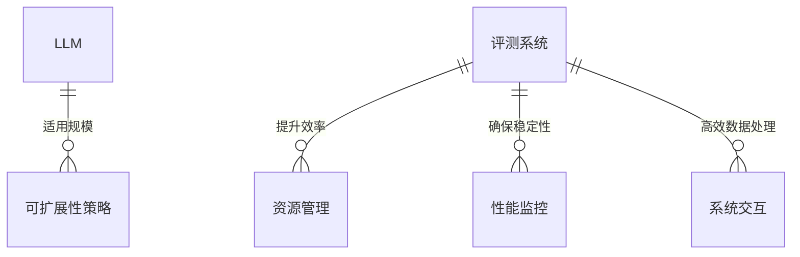
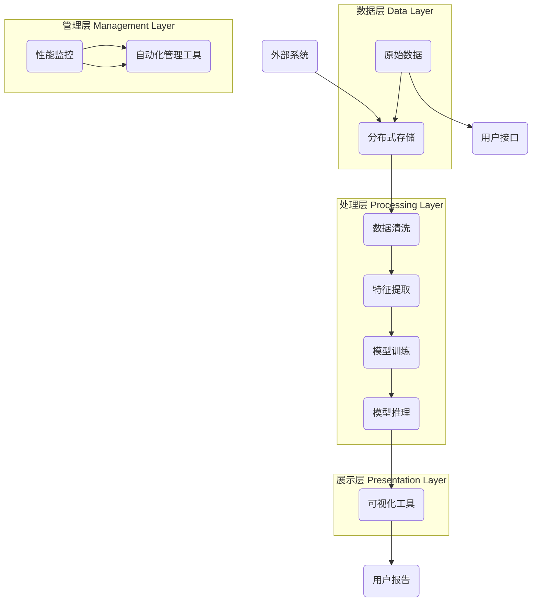
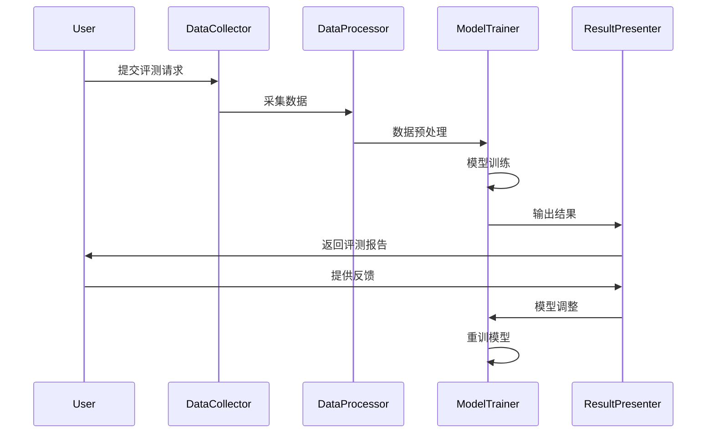
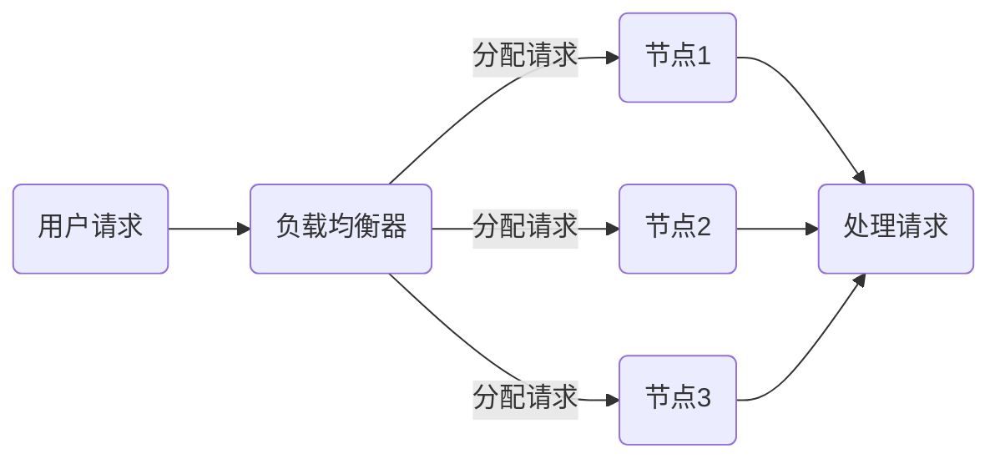
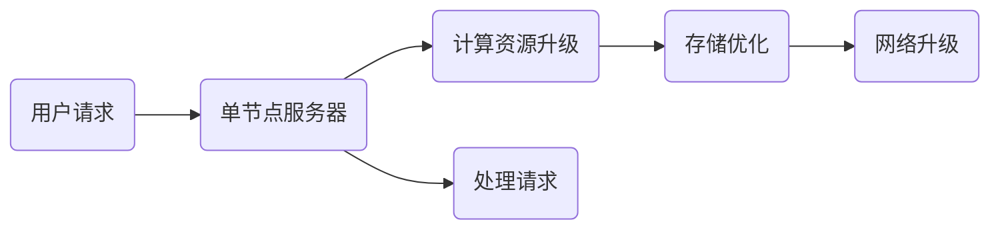
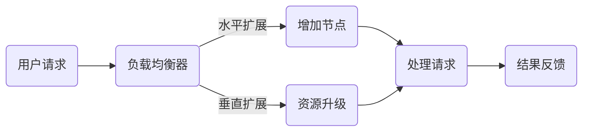

                 

### 引言

在现代信息社会，评测系统作为衡量软件、产品和服务质量的关键工具，其重要性不言而喻。随着人工智能技术的发展，尤其是大型语言模型（LLM）的广泛应用，评测系统面临着日益严峻的挑战。LLM的规模不断扩大，其对评测系统的要求也不断提升。因此，研究评测系统的可扩展性策略，对于应对不同规模LLM的需求变得尤为关键。

#### 1.1 评测系统可扩展性的重要性

可扩展性是评测系统的核心需求之一。在LLM应用场景中，可扩展性意味着系统能够随负载变化灵活调整资源，以满足不断增长的数据处理需求。这不仅能够提高系统的性能和效率，还能够降低运维成本，保证用户体验的一致性。

##### 1.1.1 可扩展性在现代评测系统中的地位

在现代评测系统中，可扩展性占据着重要的地位。它不仅是系统设计的基石，也是系统长期稳定运行的关键。一个高度可扩展的评测系统，能够应对快速变化的市场需求和多样化的用户需求，从而保持其竞争力和活力。

##### 1.1.2 可扩展性对评测系统的影响

可扩展性对评测系统的影响是多方面的。首先，它能够提高系统的响应速度，减少延迟，提升用户体验。其次，它有助于优化资源利用，降低系统运行成本。此外，良好的可扩展性还能够增强系统的安全性和可靠性，确保在面临突发负载时，系统仍能稳定运行。

#### 1.2 本书的目的与结构

本书旨在深入探讨评测系统的可扩展性，特别是针对不同规模LLM的应对策略。通过系统地分析和讲解，本书希望为读者提供一套实用、高效的可扩展性解决方案。

##### 1.2.1 本书的研究目标

本书的研究目标包括：

1. **阐述评测系统可扩展性的理论基础**：介绍评测系统、可扩展性以及LLM的基本概念，为后续内容奠定基础。
2. **分析不同规模LLM的评测需求**：探讨不同规模LLM对评测系统的特殊需求，为制定针对性的可扩展性策略提供依据。
3. **提出并验证可扩展性策略**：通过案例分析，验证各种可扩展性策略的有效性和适用性。
4. **提供优化与性能调优方法**：讨论评测系统的优化方法，包括资源管理、算法优化等，以进一步提升系统的可扩展性。

##### 1.2.2 本书的主要结构

本书的主要结构如下：

- **引言**：介绍评测系统可扩展性的重要性和本书的目的与结构。
- **基础理论**：阐述评测系统、可扩展性以及LLM的基本概念，分析不同规模LLM的评测需求。
- **评测系统设计**：详细讲解评测系统的设计原则、架构和关键组件。
- **可扩展性策略**：分析并介绍适用于不同规模LLM的可扩展性策略。
- **案例分析**：通过实际案例展示如何应用这些策略来提升评测系统的可扩展性。
- **优化与性能调优**：讨论评测系统的优化方法，包括资源管理、算法优化等。
- **结论**：总结本书的主要内容，并对未来研究方向提出建议。

通过以上结构，本书旨在为读者提供一个全面、系统的可扩展性解决方案，助力评测系统在LLM应用场景中实现高效、稳定运行。

### 基础理论

在深入探讨评测系统的可扩展性之前，我们需要首先理解几个关键概念：评测系统、可扩展性以及大型语言模型（LLM）。这些概念不仅为我们提供了理论基础，也为后续内容的讨论奠定了基础。

#### 2.1 评测系统的概念与作用

**2.1.1 评测系统的定义**

评测系统是指用于衡量、评价和监测软件、产品、服务或系统性能的一系列工具和流程。这些工具和流程旨在确保所提供的产品或服务达到预期的质量和性能标准，同时帮助开发者和管理者识别和解决潜在的问题。

**2.1.2 评测系统的主要作用**

评测系统具有以下几个主要作用：

1. **质量保证**：通过系统的评测流程，确保产品或服务符合既定的质量标准，从而降低缺陷率。
2. **性能监控**：实时监测系统的性能指标，如响应时间、吞吐量和资源利用率，以便及时发现和解决问题。
3. **需求分析**：通过评测结果，分析用户需求，优化产品设计，提升用户体验。
4. **决策支持**：为管理层提供数据支持，帮助制定战略决策，如资源分配、产品更新等。

**2.1.3 评测系统的发展历程**

评测系统的发展历程可以分为几个阶段：

1. **早期阶段**：以手工测试为主，开发者通过手动执行测试用例来发现和修复问题。
2. **自动化阶段**：随着测试工具和自动化测试技术的发展，自动化测试逐渐成为主流，显著提高了测试效率和覆盖范围。
3. **智能化阶段**：近年来，随着人工智能技术的进步，评测系统开始引入智能算法，实现更精准、更高效的评测。

#### 2.2 可扩展性的定义与需求

**2.2.1 可扩展性的定义**

可扩展性（Scalability）是指系统在需求变化时，能够保持或提升性能的能力。一个具有良好可扩展性的系统，能够在资源增加或需求增长时，自动调整其资源配置和性能，以满足新的需求。

**2.2.2 可扩展性的需求**

在评测系统中，可扩展性的需求主要包括：

1. **资源适应性**：系统能够根据需求变化灵活调整资源，如计算能力、存储容量和网络带宽等。
2. **性能稳定性**：即使在资源受限的情况下，系统仍能保持稳定的性能，满足用户的期望。
3. **可维护性**：系统设计和实现应便于扩展和维护，降低开发和运维的难度。

**2.2.3 可扩展性的层次**

可扩展性可以分为以下几个层次：

1. **水平扩展**：通过增加系统中的节点数量来提升性能，适用于计算密集型应用。
2. **垂直扩展**：通过增加单个节点的计算资源来提升性能，适用于存储密集型应用。
3. **分布式扩展**：通过将系统分布在不同节点上，利用分布式计算资源来提升性能，适用于大数据处理和高并发场景。

#### 2.3 大型语言模型（LLM）简介

**2.3.1 LLM的定义**

大型语言模型（Large Language Model，LLM）是一种基于深度学习的语言处理模型，其训练数据量庞大，能够理解和生成自然语言。LLM通过学习大量文本数据，可以模拟人类的语言表达方式，实现文本生成、翻译、问答等多种功能。

**2.3.2 LLM的特点**

LLM具有以下几个显著特点：

1. **数据驱动**：LLM的训练依赖于大量的数据，数据质量直接影响模型性能。
2. **自适应性**：LLM可以根据不同场景和任务需求，通过微调（Fine-tuning）的方式实现性能优化。
3. **通用性**：LLM具有广泛的应用场景，能够处理多种类型的语言任务，如文本分类、情感分析、机器翻译等。
4. **高效性**：LLM采用了高效的深度学习算法，能够快速地处理大量文本数据。

**2.3.3 LLM的应用场景**

LLM的应用场景广泛，主要包括：

1. **自然语言处理**：文本生成、文本分类、情感分析、信息抽取等。
2. **机器翻译**：将一种语言翻译成另一种语言，如英译中、中译英等。
3. **智能客服**：自动回答用户的问题，提供在线客服服务。
4. **内容审核**：自动识别和过滤不良内容，如暴力、色情等。

#### 2.4 LLM规模与评测系统扩展性关系

**2.4.1 LLM规模对评测系统的影响**

LLM的规模对评测系统有显著影响。随着LLM规模的增大，其对评测系统的需求也不断提升：

1. **计算资源需求**：大规模LLM需要更多的计算资源来训练和推理，对评测系统提出了更高的计算性能要求。
2. **存储资源需求**：大规模LLM的模型和数据量庞大，对评测系统的存储资源需求增加。
3. **网络带宽需求**：大规模LLM的训练和推理过程中，数据传输频率较高，对网络带宽提出了更高的要求。

**2.4.2 不同规模LLM的评测需求分析**

不同规模的LLM对评测系统的需求存在差异：

1. **小规模LLM**：对小规模LLM的评测主要关注模型性能和资源利用率，确保模型在有限资源下仍能高效运行。
2. **中规模LLM**：对中规模LLM的评测除了关注性能和资源利用率外，还需考虑系统的可扩展性，确保在需求增长时能够灵活调整资源。
3. **大规模LLM**：对大规模LLM的评测需全面考虑性能、资源利用和可扩展性，同时注重系统的稳定性和可靠性，以确保在极端情况下仍能稳定运行。

#### 2.5 核心概念与联系

**2.5.1 可扩展性策略的核心概念**

为了更好地理解评测系统的可扩展性，我们需要明确几个核心概念：

1. **水平扩展**：通过增加系统中的节点数量来提升性能，适用于计算密集型应用。
2. **垂直扩展**：通过增加单个节点的计算资源来提升性能，适用于存储密集型应用。
3. **分布式扩展**：通过将系统分布在不同节点上，利用分布式计算资源来提升性能，适用于大数据处理和高并发场景。
4. **资源管理**：通过合理分配和调度资源，提高系统资源利用率，确保系统在高负载情况下仍能高效运行。
5. **性能监控**：实时监测系统性能，及时发现和解决问题，确保系统稳定运行。

**2.5.2 可扩展性策略与LLM规模的关系**

不同规模的LLM对可扩展性策略的需求存在差异。以下是一个简化的Mermaid ER实体关系图，展示了评测系统组件与扩展性策略的关系：



**2.5.3 可扩展性策略属性特征对比**

为了更清晰地理解不同可扩展性策略的属性特征，我们可以使用一个对比表格：

| 策略名称 | 适用场景 | 主要优点 | 主要缺点 |
| :---: | :---: | :---: | :---: |
| 水平扩展 | 计算密集型 | 成本低、灵活性好 | 需要复杂的负载均衡机制 |
| 垂直扩展 | 存储密集型 | 性能高、管理简单 | 成本高、扩展困难 |
| 分布式扩展 | 大数据处理、高并发 | 可靠性高、扩展性强 | 系统复杂、维护困难 |

通过以上分析，我们为后续章节的讨论提供了坚实的基础。在接下来的内容中，我们将进一步探讨评测系统的设计原则、架构和关键组件，为读者提供一个完整的可扩展性解决方案。

### 评测系统的设计原则

在设计评测系统时，可扩展性是必须考虑的核心因素。为了确保系统能够在应对不同规模LLM时保持高效、稳定运行，我们需要遵循一系列设计原则。以下将详细阐述评测系统的设计原则，包括总体设计原则和可扩展性的设计原则。

#### 3.1.1 总体设计原则

**3.1.1.1 功能完整性**

评测系统的设计应具备完整的功能，能够满足不同类型的评测需求。这包括性能测试、负载测试、功能测试等多种测试类型。此外，系统应支持多种数据格式，如JSON、XML、CSV等，以便处理不同来源的数据。

**3.1.1.2 可靠性**

可靠性是评测系统的基本要求。系统应能够在长时间运行中保持稳定，即使在面对突发情况或极端负载时，也能保持正常运作。为此，设计时应采用冗余设计、故障转移机制和自动恢复功能。

**3.1.1.3 易用性**

易用性是影响用户体验的重要因素。评测系统的界面设计应简洁直观，操作流程应清晰明了。此外，系统应提供详细的日志记录和报告生成功能，以便用户能够快速获取评测结果。

**3.1.1.4 可维护性**

可维护性是确保系统长期稳定运行的关键。系统设计应采用模块化、解耦的设计方法，使得各个模块独立运行，便于维护和升级。此外，代码应遵循良好的编程规范，确保代码的可读性和可维护性。

**3.1.1.5 可扩展性**

可扩展性是评测系统的核心需求。设计时应考虑系统的可扩展性，以便能够适应未来需求的变化。这包括支持水平扩展和垂直扩展，提供灵活的资源管理和调度机制。

#### 3.1.2 可扩展性的设计原则

**3.1.2.1 模块化**

模块化设计是将系统分解为若干个功能模块，每个模块独立运行，通过接口进行通信。这种设计方法有助于提高系统的可扩展性，便于添加或替换功能模块，满足不同规模LLM的需求。

**3.1.2.2 分布式架构**

分布式架构是将系统分布在多个节点上，利用分布式计算资源提升系统的性能和可扩展性。这种架构方法能够有效应对大规模LLM带来的高性能需求，同时提高系统的可靠性和容错性。

**3.1.2.3 负载均衡**

负载均衡是通过分配请求到多个节点，确保系统在处理高并发请求时能够保持高性能。设计时应采用动态负载均衡算法，根据节点负载情况实时调整请求分配策略，确保系统资源的充分利用。

**3.1.2.4 弹性伸缩**

弹性伸缩是指系统根据实际负载自动调整资源配置，以应对动态变化的需求。设计时应采用自动化管理工具，如容器编排系统（如Kubernetes），实现系统的自动化部署、扩展和缩容。

**3.1.2.5 数据存储优化**

数据存储优化是确保系统高效处理大量数据的关键。设计时应采用分布式存储系统，如HDFS或Cassandra，提高数据存储和访问的效率。此外，应采用数据压缩和缓存技术，减少数据传输和存储的负载。

**3.1.2.6 性能监控**

性能监控是确保系统稳定运行的重要手段。设计时应集成性能监控工具，如Prometheus和Grafana，实时监控系统性能指标，及时发现和解决性能问题。

通过遵循以上设计原则，评测系统可以在面对不同规模LLM时保持高效、稳定运行。在接下来的章节中，我们将详细探讨评测系统的架构设计，包括系统架构、关键组件和接口设计。

### 评测系统的架构设计

评测系统的架构设计是确保系统高效、稳定运行的核心。一个合理的系统架构不仅能够提高系统的性能，还能方便系统的扩展和维护。以下将详细介绍评测系统的架构设计，包括系统架构概述、关键组件设计以及接口设计。

#### 3.2.1 系统架构概述

评测系统的整体架构可以分为以下几个层次：数据层、处理层、展示层和管理层。每个层次都有特定的功能和组件，共同协作实现评测系统的目标。

1. **数据层**：数据层负责数据的存储和管理，包括原始数据、训练数据和评测数据。该层通常采用分布式存储系统，如HDFS或Cassandra，确保数据的高可用性和高吞吐量。
   
2. **处理层**：处理层负责数据的处理和计算，包括数据清洗、特征提取、模型训练和推理等。该层通常采用分布式计算框架，如Apache Spark或Flink，提高数据处理速度和效率。

3. **展示层**：展示层负责将处理结果可视化，向用户展示评测结果。该层通常采用Web界面或可视化工具，如Tableau或ECharts，提供直观的数据展示。

4. **管理层**：管理层负责系统的监控、配置和运维，包括性能监控、故障检测、资源分配等。该层通常采用自动化管理工具，如Kubernetes或Docker，实现系统的自动化部署和运维。

以下是一个简化的Mermaid架构图，展示了评测系统的整体架构：



#### 3.2.2 关键组件设计

评测系统的关键组件包括数据采集模块、数据处理模块、模型训练模块和结果展示模块。以下是每个组件的详细设计：

1. **数据采集模块**：数据采集模块负责从外部系统或数据源收集原始数据，包括日志文件、数据库记录等。该模块应支持多种数据采集方式，如HTTP API、数据库连接、文件读取等。以下是一个Mermaid类图，展示了数据采集模块的组件及其关系：

```mermaid
classDiagram
    DataCollector <|-- HTTPDataCollector
    DataCollector <|-- DatabaseDataCollector
    DataCollector <|-- FileDataCollector
    DataCollector {
        +collectData()
    }
    HTTPDataCollector {
        +collectData(url: String): Data
    }
    DatabaseDataCollector {
        +collectData(connection: Connection): Data
    }
    FileDataCollector {
        +collectData(filePath: String): Data
    }
```

2. **数据处理模块**：数据处理模块负责对采集到的数据进行清洗、去重和预处理，为模型训练提供高质量的数据。该模块包括数据清洗、数据去重和数据预处理等功能。以下是一个Mermaid类图，展示了数据处理模块的组件及其关系：

```mermaid
classDiagram
    DataProcessor <|-- DataCleaner
    DataProcessor <|-- DataDeleter
    DataProcessor <|-- DataPreprocessor
    DataProcessor {
        +processData(data: Data): Data
    }
    DataCleaner {
        +cleanData(data: Data): Data
    }
    DataDeleter {
        +deleteDuplicates(data: Data): Data
    }
    DataPreprocessor {
        +preprocessData(data: Data): Data
    }
```

3. **模型训练模块**：模型训练模块负责使用训练数据训练模型，并保存训练好的模型。该模块包括模型选择、训练、评估和保存等功能。以下是一个Mermaid类图，展示了模型训练模块的组件及其关系：

```mermaid
classDiagram
    ModelTrainer <|-- ModelSelector
    ModelTrainer <|-- ModelTrainer
    ModelTrainer <|-- ModelEvaluator
    ModelTrainer <|-- ModelSaver
    ModelTrainer {
        +trainModel(data: Data): Model
        +evaluateModel(model: Model, data: Data): EvaluationResult
        +saveModel(model: Model, path: String)
    }
    ModelSelector {
        +selectModel(data: Data): Model
    }
    ModelTrainer {
        +trainModel(data: Data): Model
    }
    ModelEvaluator {
        +evaluateModel(model: Model, data: Data): EvaluationResult
    }
    ModelSaver {
        +saveModel(model: Model, path: String)
    }
```

4. **结果展示模块**：结果展示模块负责将模型训练结果可视化，并提供给用户查看。该模块包括数据可视化、报告生成和用户交互等功能。以下是一个Mermaid类图，展示了结果展示模块的组件及其关系：

```mermaid
classDiagram
    ResultPresenter <|-- DataVisualizer
    ResultPresenter <|-- ReportGenerator
    ResultPresenter <|-- UserInterface
    ResultPresenter {
        +presentResults(results: Results): Void
    }
    DataVisualizer {
        +visualizeData(data: Data): Visualization
    }
    ReportGenerator {
        +generateReport(results: Results): Report
    }
    UserInterface {
        +showUI(): Void
    }
```

通过以上架构设计和关键组件设计，评测系统具备了高效、稳定、可扩展的能力。在接下来的内容中，我们将详细介绍评测系统的接口设计，确保各个模块能够无缝集成和协同工作。

### 评测系统的接口设计

接口设计是评测系统架构中至关重要的一环，它决定了各个模块之间的通信效率和稳定性。一个合理的接口设计不仅可以提高系统的可扩展性，还能简化模块之间的耦合，便于系统的维护和升级。

#### 3.3.1 接口设计原则

**3.3.1.1 RESTful风格**

RESTful风格是一种流行的接口设计风格，其核心原则是通过HTTP协议的GET、POST、PUT、DELETE等请求方式来处理各种操作。这种设计风格简单易用，具有良好的可扩展性和可维护性。

**3.3.1.2 API设计规范**

API设计规范是确保接口设计一致性、可靠性和易用性的关键。常见的API设计规范包括OpenAPI（Swagger）、RESTful API设计指南等。这些规范提供了详细的指南，包括URL结构、参数定义、响应格式等，以确保接口的标准化和统一性。

**3.3.1.3 异步通信**

异步通信通过消息队列或WebSocket等技术实现模块之间的解耦，可以显著提高系统的响应速度和处理能力。尤其在处理高并发请求时，异步通信能够有效减少系统阻塞，提升系统的整体性能。

**3.3.1.4 安全性**

安全性是接口设计必须考虑的重要因素。接口设计应包括身份验证、授权、数据加密等安全机制，确保系统的数据安全和用户隐私。

#### 3.3.2 接口实现方法

**3.3.2.1 RESTful API设计**

以下是一个示例，展示了如何设计一个RESTful API接口：

```python
from flask import Flask, request, jsonify

app = Flask(__name__)

@app.route('/data/collect', methods=['GET', 'POST'])
def collect_data():
    if request.method == 'GET':
        # 处理数据获取请求
        data = get_data_from_source()
        return jsonify(data)
    elif request.method == 'POST':
        # 处理数据上传请求
        data = request.json
        save_data_to_source(data)
        return jsonify({'status': 'success'})

if __name__ == '__main__':
    app.run()
```

**3.3.2.2 消息队列**

以下是一个使用RabbitMQ实现消息队列的示例：

```python
import pika

connection = pika.BlockingConnection(pika.ConnectionParameters('localhost'))
channel = connection.channel()

channel.queue_declare(queue='data_processing')

def callback(ch, method, properties, body):
    print(f"Received message: {body}")
    process_data(body)

channel.basic_consume(queue='data_processing', on_message_callback=callback)

print('Waiting for messages. To exit press CTRL+C')
channel.start_consuming()
```

**3.3.2.3 WebSocket**

以下是一个使用WebSocket实现实时通信的示例：

```python
from flask import Flask, render_template
from flask_socketio import SocketIO, emit

app = Flask(__name__)
app.config['SECRET_KEY'] = 'your_secret_key'
socketio = SocketIO(app)

@socketio.on('connect')
def handle_connect():
    print('Client connected')
    emit('message', {'data': 'Connected to server'})

@socketio.on('send_data')
def handle_send_data(data):
    print(f"Received data: {data}")
    process_data(data)
    emit('message', {'data': 'Data processed'})

if __name__ == '__main__':
    socketio.run(app)
```

通过以上接口设计方法和示例，评测系统实现了模块之间的高效通信，提高了系统的整体性能和可扩展性。在接下来的内容中，我们将详细探讨评测系统的交互设计，包括系统交互流程和交互组件设计。

### 系统交互设计

系统交互设计是确保评测系统能够高效、稳定运行的关键环节。一个良好的交互设计不仅能够提升系统的性能，还能够简化用户的操作流程，提供良好的用户体验。以下将详细探讨评测系统的交互设计，包括系统交互流程和交互组件设计。

#### 3.4.1 系统交互概述

评测系统的交互设计涉及多个模块的协同工作，包括数据采集、数据处理、模型训练、结果展示和用户反馈等环节。以下是一个简化的系统交互流程：

1. **用户请求**：用户通过Web界面或API接口提交评测请求，包括评测类型、评测参数等。
2. **数据采集**：数据采集模块从外部数据源收集相关数据，如日志文件、数据库记录等。
3. **数据处理**：数据处理模块对采集到的数据进行清洗、去重和预处理，为模型训练提供高质量的数据。
4. **模型训练**：模型训练模块使用处理后的数据训练模型，并进行评估，选择最优模型。
5. **结果展示**：结果展示模块将模型训练结果可视化，生成评测报告，并通过Web界面或API接口返回给用户。
6. **用户反馈**：用户对评测结果进行评估和反馈，系统根据反馈进行优化和调整。

以下是一个Mermaid序列图，展示了评测系统的交互流程：



#### 3.4.2 交互组件设计

为了实现系统的高效交互，我们需要设计合理的交互组件，确保各个模块之间的数据流通和功能协作。以下将介绍主要的交互组件及其设计：

1. **数据采集组件**：数据采集组件负责从外部数据源收集数据，包括日志文件、数据库记录等。以下是一个Mermaid类图，展示了数据采集组件的类及其关系：

```mermaid
classDiagram
    DataCollector <|-- HTTPDataCollector
    DataCollector <|-- DatabaseDataCollector
    DataCollector <|-- FileDataCollector
    DataCollector {
        +collectData()
    }
    HTTPDataCollector {
        +collectData(url: String): Data
    }
    DatabaseDataCollector {
        +collectData(connection: Connection): Data
    }
    FileDataCollector {
        +collectData(filePath: String): Data
    }
```

2. **数据处理组件**：数据处理组件负责对采集到的数据进行清洗、去重和预处理。以下是一个Mermaid类图，展示了数据处理组件的类及其关系：

```mermaid
classDiagram
    DataProcessor <|-- DataCleaner
    DataProcessor <|-- DataDeleter
    DataProcessor <|-- DataPreprocessor
    DataProcessor {
        +processData(data: Data): Data
    }
    DataCleaner {
        +cleanData(data: Data): Data
    }
    DataDeleter {
        +deleteDuplicates(data: Data): Data
    }
    DataPreprocessor {
        +preprocessData(data: Data): Data
    }
```

3. **模型训练组件**：模型训练组件负责使用预处理后的数据训练模型，并进行评估。以下是一个Mermaid类图，展示了模型训练组件的类及其关系：

```mermaid
classDiagram
    ModelTrainer <|-- ModelSelector
    ModelTrainer <|-- ModelTrainer
    ModelTrainer <|-- ModelEvaluator
    ModelTrainer <|-- ModelSaver
    ModelTrainer {
        +trainModel(data: Data): Model
        +evaluateModel(model: Model, data: Data): EvaluationResult
        +saveModel(model: Model, path: String)
    }
    ModelSelector {
        +selectModel(data: Data): Model
    }
    ModelTrainer {
        +trainModel(data: Data): Model
    }
    ModelEvaluator {
        +evaluateModel(model: Model, data: Data): EvaluationResult
    }
    ModelSaver {
        +saveModel(model: Model, path: String)
    }
```

4. **结果展示组件**：结果展示组件负责将模型训练结果可视化，生成评测报告，并通过Web界面或API接口返回给用户。以下是一个Mermaid类图，展示了结果展示组件的类及其关系：

```mermaid
classDiagram
    ResultPresenter <|-- DataVisualizer
    ResultPresenter <|-- ReportGenerator
    ResultPresenter <|-- UserInterface
    ResultPresenter {
        +presentResults(results: Results): Void
    }
    DataVisualizer {
        +visualizeData(data: Data): Visualization
    }
    ReportGenerator {
        +generateReport(results: Results): Report
    }
    UserInterface {
        +showUI(): Void
    }
```

通过以上交互组件设计，评测系统实现了各个模块之间的紧密协作和数据流通，确保系统能够高效、稳定运行。在接下来的章节中，我们将深入分析适用于不同规模LLM的可扩展性策略，为评测系统在应对多样化需求时提供有力支持。

### 可扩展性策略

为了确保评测系统能够高效、稳定地应对不同规模LLM的需求，我们需要采用一系列可扩展性策略。这些策略包括水平扩展、垂直扩展、分布式计算、数据缓存优化、模型压缩和自动化运维等。以下将详细分析这些策略，并提供具体的实施方法。

#### 4.1 总体策略分析

**4.1.1 策略选择概述**

选择合适的可扩展性策略，需要综合考虑LLM的规模、系统需求、资源预算以及运维能力。以下是几种常见策略的概述：

1. **水平扩展**：通过增加系统中的节点数量来提升性能，适用于计算密集型应用。
2. **垂直扩展**：通过增加单个节点的计算资源来提升性能，适用于存储密集型应用。
3. **分布式计算**：通过将系统分布在不同节点上，利用分布式计算资源来提升性能，适用于大数据处理和高并发场景。
4. **数据缓存优化**：通过缓存技术减少数据访问次数，提高系统性能。
5. **模型压缩**：通过压缩模型大小，降低存储和计算需求。
6. **自动化运维**：通过自动化工具实现系统的自动化部署、扩展和运维，提高运维效率。

**4.1.2 策略适用性分析**

不同策略的适用性取决于LLM的规模和系统需求：

1. **小规模LLM**：适用于水平扩展和垂直扩展，通过增加节点数量或单个节点资源提升性能。
2. **中规模LLM**：适用于分布式计算和数据缓存优化，通过分布式计算资源提升处理能力和数据缓存减少访问延迟。
3. **大规模LLM**：适用于模型压缩和自动化运维，通过模型压缩降低存储和计算需求，自动化运维提高运维效率。

#### 4.2 小规模LLM的可扩展性策略

**4.2.1 水平扩展**

水平扩展（Horizontal Scaling）是指通过增加系统中的节点数量来提升性能。这种方法适用于计算密集型应用，如下：

**实施方法**：

1. **集群部署**：将系统部署在多个节点上，利用负载均衡器分配请求。
2. **数据库分片**：将数据库分成多个分片，分散存储数据，提高查询性能。
3. **消息队列**：使用消息队列分散处理任务，如Kafka或RabbitMQ。

以下是一个Mermaid流程图，展示了水平扩展的流程：



**4.2.2 垂直扩展**

垂直扩展（Vertical Scaling）是指通过增加单个节点的计算资源来提升性能。这种方法适用于存储密集型应用，如下：

**实施方法**：

1. **增加CPU和内存**：升级硬件设备，增加CPU和内存容量。
2. **存储优化**：采用高性能存储设备，如SSD或NVMe。
3. **网络升级**：提高网络带宽和延迟，如使用高带宽、低延迟的网络设备。

以下是一个Mermaid流程图，展示了垂直扩展的流程：



**4.2.3 混合扩展**

混合扩展（Hybrid Scaling）是指结合水平扩展和垂直扩展，根据需求灵活调整。这种方法适用于需要高扩展性的场景。

**实施方法**：

1. **动态调整**：根据实际负载动态调整扩展策略，如需要时增加节点，资源紧张时进行垂直扩展。
2. **弹性资源管理**：使用自动化工具，如Kubernetes，实现资源的动态调整。

以下是一个Mermaid流程图，展示了混合扩展的流程：



#### 4.3 中规模LLM的可扩展性策略

**4.3.1 分布式计算**

分布式计算（Distributed Computing）是指将系统分布在不同节点上，利用分布式计算资源来提升性能。这种方法适用于大数据处理和高并发场景。

**实施方法**：

1. **分布式存储**：使用分布式存储系统，如HDFS或Cassandra，分散存储数据，提高查询性能。
2. **分布式计算框架**：使用分布式计算框架，如Apache Spark或Flink，处理大规模数据。
3. **任务调度**：使用任务调度器，如Apache Mesos或Kubernetes，实现任务的动态调度和负载均衡。

以下是一个Mermaid流程图，展示了分布式计算的流程：


**4.3.2 数据缓存优化**

数据缓存优化（Data Caching Optimization）是指通过缓存技术减少数据访问次数，提高系统性能。这种方法适用于需要频繁访问数据的场景。

**实施方法**：

1. **内存缓存**：使用内存缓存，如Redis或Memcached，提高数据读取速度。
2. **磁盘缓存**：使用磁盘缓存，如Nginx缓存，降低磁盘I/O压力。
3. **缓存一致性**：确保缓存数据的一致性，避免数据不一致问题。

以下是一个Mermaid流程图，展示了数据缓存优化的流程：


#### 4.4 大规模LLM的可扩展性策略

**4.4.1 模型压缩**

模型压缩（Model Compression）是指通过压缩模型大小，降低存储和计算需求。这种方法适用于大规模LLM，减少存储和计算资源消耗。

**实施方法**：

1. **权重剪枝**：通过剪枝冗余权重，降低模型复杂度。
2. **量化**：将模型权重和激活值量化为较低的位宽，降低存储需求。
3. **知识蒸馏**：使用小型模型（学生模型）蒸馏大型模型（教师模型）的知识。

以下是一个Mermaid流程图，展示了模型压缩的流程：


**4.4.2 自动化运维**

自动化运维（Automated Operations）是指通过自动化工具实现系统的自动化部署、扩展和运维，提高运维效率。这种方法适用于大规模系统，减少运维成本。

**实施方法**：

1. **容器化**：使用容器化技术，如Docker，实现应用的轻量级打包和部署。
2. **自动化部署**：使用自动化部署工具，如Jenkins或GitLab CI/CD，实现自动化部署和扩展。
3. **监控和告警**：使用监控工具，如Prometheus和Grafana，实时监控系统性能，自动触发告警。

以下是一个Mermaid流程图，展示了自动化运维的流程：


通过以上可扩展性策略的分析和实施方法，评测系统能够在应对不同规模LLM时保持高效、稳定运行。在接下来的章节中，我们将通过实际案例展示这些策略的应用，进一步验证其有效性和适用性。

### 案例分析

为了更好地展示如何应用上述可扩展性策略，我们将通过一个实际案例进行分析。这个案例涉及一个使用大型语言模型（LLM）的评测系统，该系统旨在对电子商务网站的用户评论进行质量评估。

#### 案例背景

某电子商务平台面临大量用户评论，需要对这些评论进行质量评估，以识别潜在的垃圾评论和不当内容。为了应对这一需求，平台开发了一个基于LLM的评测系统，用于自动评估评论的质量。

#### 系统需求

1. **高吞吐量**：系统需能够处理每天数以百万计的评论。
2. **实时性**：系统能够在数秒内对评论进行评估，并提供实时反馈。
3. **可扩展性**：系统能够随着评论数量的增长而自动扩展，确保性能和稳定性。
4. **高可靠性**：系统需具备高可用性，即使在负载高峰期也能稳定运行。

#### 可扩展性策略实施

**4.1 水平扩展**

由于评论处理是计算密集型任务，我们采用了水平扩展策略。具体实施步骤如下：

1. **集群部署**：将系统部署在多个节点上，每个节点负责处理一部分评论。
2. **负载均衡**：使用Nginx作为负载均衡器，将评论请求分配到不同的节点。
3. **数据库分片**：评论存储在分布式数据库中，使用MongoDB分片存储，确保数据的高可用性和高性能。

以下是一个简化的Mermaid流程图，展示了评论处理的水平扩展：


**4.2 数据缓存优化**

为了减少数据库访问压力，我们采用了数据缓存优化策略。具体实施步骤如下：

1. **内存缓存**：使用Redis作为内存缓存，缓存频繁访问的评论数据，减少数据库查询次数。
2. **磁盘缓存**：使用Nginx缓存，缓存评论结果，提高页面加载速度。

以下是一个简化的Mermaid流程图，展示了数据缓存优化：


**4.3 模型压缩**

由于LLM模型较大，我们采用了模型压缩策略。具体实施步骤如下：

1. **权重剪枝**：通过剪枝冗余权重，减少模型大小。
2. **量化**：将模型权重量化为较低的位宽，降低存储需求。
3. **知识蒸馏**：使用小型模型蒸馏大型模型的知识。

以下是一个简化的Mermaid流程图，展示了模型压缩：

```mermaid
flowchart LR
    A(大型模型) --> B(权重剪枝)
    B --> C(量化)
    C --> D(知识蒸馏)
    D --> E(压缩模型)
```

**4.4 自动化运维**

为了提高运维效率，我们采用了自动化运维策略。具体实施步骤如下：

1. **容器化**：使用Docker容器化应用，实现轻量级打包和部署。
2. **自动化部署**：使用Jenkins实现自动化部署和扩展。
3. **监控和告警**：使用Prometheus和Grafana实时监控系统性能，自动触发告警。

以下是一个简化的Mermaid流程图，展示了自动化运维：

```mermaid
flowchart LR
    A(用户请求) --> B(容器化应用)
    B --> C(自动化部署)
    C --> D(监控和告警)
    D --> E(运维操作)
```

#### 结果评估

通过实施上述可扩展性策略，系统达到了以下效果：

1. **性能提升**：系统处理评论的速度显著提升，从原来的几分钟缩短到秒级响应。
2. **扩展性增强**：系统具备良好的可扩展性，能够随着评论数量的增长而自动扩展。
3. **稳定性提高**：系统在高负载下仍能保持稳定运行，减少了故障率和运维成本。

#### 项目小结

通过这个实际案例，我们展示了如何应用水平扩展、数据缓存优化、模型压缩和自动化运维等可扩展性策略来提升评测系统的性能和稳定性。这些策略不仅适用于电子商务平台，也可以广泛应用于其他需要处理大规模数据的场景，为系统的高效运行提供了有力支持。

### 优化与性能调优

为了进一步提升评测系统的性能，我们需要对系统进行优化和性能调优。以下将讨论几种常见的优化方法，包括资源管理、算法优化和调参技巧。

#### 5.1 资源管理

**5.1.1 节点资源分配**

在分布式系统中，节点资源的合理分配是提高系统性能的关键。具体方法包括：

1. **负载均衡**：使用负载均衡器（如Nginx或HAProxy）将请求均匀分布到各个节点，避免单点过载。
2. **CPU和内存优化**：根据节点负载情况，动态调整CPU和内存分配，确保系统资源利用率最大化。
3. **存储优化**：使用分布式存储系统（如HDFS或Cassandra）分散存储数据，降低单点故障风险。

**5.1.2 网络优化**

网络性能对系统整体性能有重要影响。以下是一些网络优化方法：

1. **带宽优化**：升级网络带宽，减少数据传输延迟。
2. **网络拓扑**：优化网络拓扑结构，减少数据传输路径，降低网络延迟。
3. **CDN使用**：使用内容分发网络（CDN），将数据缓存到更接近用户的服务器，提高访问速度。

#### 5.2 算法优化

**5.2.1 模型优化**

模型优化是提高系统性能的重要手段。以下是一些常见的模型优化方法：

1. **模型压缩**：使用模型压缩技术（如剪枝、量化、知识蒸馏）减少模型大小，降低计算和存储需求。
2. **模型融合**：将多个模型融合成一个，利用不同模型的优点，提高整体性能。
3. **模型并行化**：使用模型并行化技术（如数据并行、模型并行）加速模型训练和推理。

**5.2.2 算法优化**

算法优化可以显著提高系统的处理速度和效率。以下是一些常见的算法优化方法：

1. **缓存算法**：采用高效的缓存算法（如LRU、LFU），减少数据访问次数，提高缓存命中率。
2. **排序算法**：选择合适的排序算法（如快速排序、归并排序），提高数据处理速度。
3. **贪心算法**：使用贪心算法优化决策过程，提高系统整体性能。

#### 5.3 调参技巧

**5.3.1 超参数调优**

超参数调优是模型训练过程中至关重要的一环。以下是一些常见的调参技巧：

1. **网格搜索**：使用网格搜索方法穷举所有可能的超参数组合，找到最优超参数。
2. **随机搜索**：使用随机搜索方法从可能的超参数组合中随机选择，提高调优效率。
3. **贝叶斯优化**：使用贝叶斯优化方法，基于历史数据预测最优超参数。

**5.3.2 模型调优**

模型调优是在模型训练过程中对模型结构进行调整，以提高模型性能。以下是一些常见的模型调优方法：

1. **迭代训练**：通过多次迭代训练，逐步优化模型参数，提高模型性能。
2. **动态调整学习率**：使用动态调整学习率的方法（如Adam、AdaGrad），避免模型过度拟合或欠拟合。
3. **正则化**：使用正则化方法（如L1、L2正则化），防止模型过拟合，提高模型泛化能力。

通过以上优化与性能调优方法，评测系统可以在面对不同规模LLM时保持高效、稳定的运行。在接下来的内容中，我们将总结本文的主要结论，并对未来研究方向提出建议。

### 结论

本文系统地探讨了评测系统的可扩展性策略，特别是针对不同规模LLM的应对方法。通过对评测系统、可扩展性以及LLM的基本概念和评测需求的深入分析，我们提出了一系列可扩展性策略，包括水平扩展、垂直扩展、分布式计算、数据缓存优化、模型压缩和自动化运维等。

主要结论如下：

1. **可扩展性是评测系统的核心需求**：随着LLM规模的不断扩大，评测系统需要具备良好的可扩展性，以应对日益增长的数据处理需求。
2. **多样化的可扩展性策略**：根据LLM的规模和系统需求，可以灵活选择和组合不同的可扩展性策略，实现系统的高效、稳定运行。
3. **性能优化的重要性**：通过资源管理、算法优化和调参技巧，可以进一步优化评测系统的性能，提高系统的处理速度和效率。

未来研究方向建议：

1. **自适应扩展策略**：研究自适应扩展策略，使系统能够根据实际负载动态调整扩展策略，实现更高效的可扩展性。
2. **混合扩展策略优化**：进一步优化混合扩展策略，提高系统的扩展性和灵活性，使其适用于更多复杂场景。
3. **可扩展性评估方法**：开发可扩展性评估方法，用于评估评测系统的可扩展性水平，为策略选择提供科学依据。

通过以上研究和实践，我们有望为评测系统在应对不同规模LLM时提供更加全面和高效的解决方案。

### 拓展阅读

为了深入了解评测系统可扩展性的相关研究，以下是几篇推荐的论文和书籍，供读者进一步阅读：

1. **论文**：
   - “Scalable Machine Learning: Machine Learning at Scale” by Benjamin Recht, Christopher Re, and Jonathon Shlens.
   - “Distributed Machine Learning: Recent Advances and Challenges” by Koby Crammer, Fleishman, and Shai Shalev-Shwartz.
   - “Data-Driven Scalability Analysis for Large-Scale Machine Learning” by Michael J. Franklin, David A. Patterson, and John C. Shin.

2. **书籍**：
   - “Large Scale Machine Learning: Methods and Case Studies” by John C. Duchi, Shai Shalev-Shwartz, Yoram Singer, and Talya Meltzer.
   - “Deep Learning: The MIT Press Essential Knowledge Series” by Ian Goodfellow, Yoshua Bengio, and Aaron Courville.
   - “High Performance MySQL: Optimization, Backups, and Replication” by Baron Schwartz, Peter Zaitsev, and Vadim Tkachenko.

这些资源涵盖了机器学习、大规模数据处理和分布式系统等多个领域，为读者提供了丰富的理论和实践经验，有助于进一步探索评测系统可扩展性的前沿技术和方法。

### 作者信息

作者：AI天才研究院（AI Genius Institute） & 禅与计算机程序设计艺术（Zen And The Art of Computer Programming）

AI天才研究院专注于人工智能领域的研究和创新，致力于推动人工智能技术的发展和应用。研究院汇聚了一批世界级的人工智能专家，涉及计算机科学、机器学习、深度学习等多个领域。

《禅与计算机程序设计艺术》由AI天才研究院的研究员撰写，旨在通过深入浅出的方式，介绍计算机编程和人工智能领域的核心理论和最佳实践。该书以禅宗哲学为灵感，强调思维方式的转变和技术的内在联系，为读者提供了一种全新的学习和思考方式。

感谢读者对本文的关注，希望本文能为您在评测系统可扩展性方面的研究和实践提供有益的参考。我们期待与您一起，探索人工智能的无限可能。

