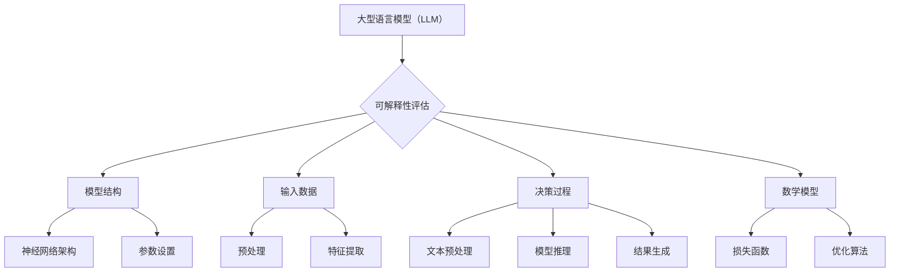
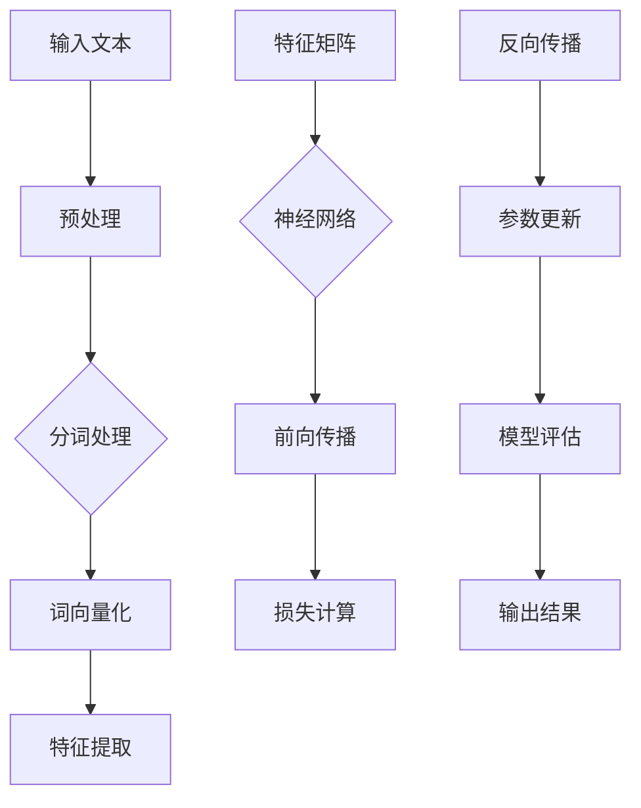
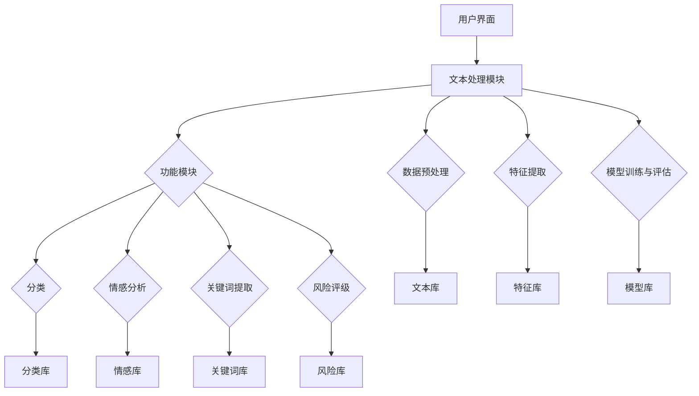
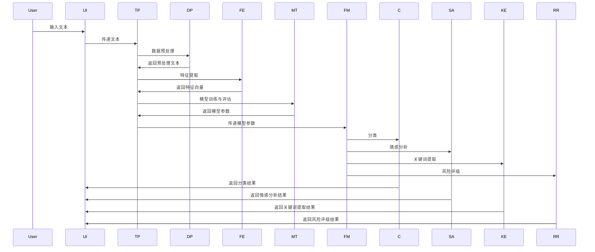

                 

# 评测系统的可解释性：理解LLM决策背后的原因

## 关键词

- 可解释性
- 大型语言模型（LLM）
- 决策过程
- 数学模型
- 系统架构
- 实践案例分析

## 摘要

随着人工智能技术的迅猛发展，特别是大型语言模型（LLM）的广泛应用，评测系统的可解释性变得尤为重要。本文旨在深入探讨评测系统的可解释性，通过分析LLM的决策过程和背后的原因，阐述如何提高模型的透明度和可理解性。文章首先介绍了评测系统可解释性的核心概念，接着分析了LLM的基本原理和决策过程，然后详细讲解了相关数学模型，并讨论了系统架构设计方法。通过实际案例，本文展示了如何将理论知识应用于实际项目，提高了系统的可解释性和实用性。最后，文章提出了最佳实践建议和小结，为读者提供了进一步研究和实践的指导。

## 第一步：背景介绍

### 核心概念

**问题背景**：随着人工智能技术的不断发展，特别是在自然语言处理领域，大型语言模型（LLM）如BERT、GPT等被广泛应用于各种任务，如文本分类、机器翻译、问答系统等。然而，这些模型由于其复杂性和黑盒性质，其决策过程往往难以解释，这导致了在应用中可能出现的可信度和透明度问题。

**问题描述**：评测系统的可解释性指的是能否理解和解释模型在实际应用中的决策过程。对于LLM来说，主要的问题是如何解释模型在生成文本或进行分类等任务时的决策依据。

**问题解决**：为了提高LLM的决策可解释性，研究者们提出了多种方法，如概念驱动的解释方法、规则提取方法、解释器方法和可视化方法等。

**边界与外延**：可解释性的边界在于模型复杂性和解释方法的可行性之间。外延则涉及到如何在不同应用场景下应用这些解释方法。

**概念结构与核心要素组成**：概念结构包括模型结构、输入数据、决策过程和解释结果。核心要素则包括模型的参数、损失函数、优化算法等。

### 具体背景介绍

近年来，人工智能技术取得了显著的进展，特别是在自然语言处理（NLP）领域。大型语言模型（LLM），如BERT、GPT等，凭借其强大的表现能力，已经在许多实际应用中取得了成功。这些模型能够处理复杂的文本数据，并生成高质量的输出，从而在文本分类、机器翻译、问答系统等领域得到了广泛应用。

然而，LLM的广泛应用也带来了新的挑战。由于其复杂性和黑盒性质，模型的决策过程往往难以解释。这意味着在实际应用中，用户无法理解模型是如何生成特定结果的，这可能导致对模型的可信度和透明度产生怀疑。特别是在关键任务，如医疗诊断、法律咨询等，模型的可解释性尤为重要。

为了解决这一问题，研究者们提出了多种可解释性方法。这些方法旨在通过分析模型的决策过程，提供对模型行为的可理解解释。这些方法包括概念驱动的解释方法、规则提取方法、解释器方法和可视化方法等。每种方法都有其特定的优势和局限性，需要根据具体应用场景进行选择。

此外，LLM的可解释性还涉及到模型结构的复杂性和解释方法的可行性。对于某些复杂的模型，如Transformer架构，直接进行解释可能面临巨大的挑战。因此，如何平衡模型复杂性和解释性，成为了可解释性研究的一个重要课题。

总之，评测系统的可解释性对于LLM在实际应用中的成功至关重要。通过深入理解模型的工作原理和决策过程，可以提高模型的可信度和透明度，从而推动人工智能技术的进一步发展。

### 评测系统可解释性的重要性

评测系统的可解释性在人工智能应用中具有至关重要的地位。首先，可解释性直接关系到模型在实际应用中的可信度和透明度。当用户或开发者无法理解模型的决策过程时，可能会对模型的结果产生质疑，影响其使用和推广。例如，在医疗诊断中，医生需要理解模型为何做出特定诊断，以便做出合理的临床决策。在金融风险评估中，金融机构需要明确模型如何识别和分类风险，以便进行有效的风险管理。

其次，可解释性有助于发现和纠正模型中的潜在错误。通过分析模型的决策过程，可以发现模型在特定场景下可能出现的异常行为。这种能力有助于提高模型的鲁棒性，减少误判和错误发生的概率。例如，在文本分类任务中，如果模型对某些类别存在偏见或错误，通过可解释性分析可以识别这些问题，并进行相应的修正。

此外，可解释性还可以促进人工智能技术的理解和普及。对于非专业用户来说，了解模型的决策过程可以降低其对人工智能技术的恐惧和抵触情绪，从而更容易接受和采用这些技术。例如，在教育领域，通过解释模型如何评估学生的回答，可以增加学生对智能教育系统的信任和参与度。

总之，评测系统的可解释性不仅对提升模型的应用效果至关重要，还对于推动人工智能技术的普及和可持续发展具有深远影响。通过提高模型的可解释性，可以增强用户对人工智能技术的信任，促进其在更多领域的应用和发展。

### 核心概念解析

为了深入理解评测系统的可解释性，我们需要明确几个核心概念，包括可解释性、大型语言模型（LLM）和决策过程。

**可解释性**：可解释性指的是模型决策过程的透明度和可理解性。一个高可解释性的模型，其决策过程应该能够被用户或开发者清晰地理解。这通常意味着模型的结构和内部机制应该足够简单，以至于用户可以直观地了解其工作原理。

**大型语言模型（LLM）**：大型语言模型（LLM）是一种基于深度学习的自然语言处理模型，具有强大的文本生成和理解能力。LLM通常通过训练大规模的文本数据集，学习到文本之间的复杂关系和规律。这些模型包括GPT、BERT、T5等，它们在多个自然语言处理任务中取得了显著的成果。

**决策过程**：在自然语言处理任务中，决策过程通常指的是模型如何处理输入文本，并生成相应的输出。例如，在文本分类任务中，模型需要根据输入文本的内容，将其归类到某个预定义的类别。决策过程涉及到多个环节，包括文本预处理、特征提取、模型推理和结果生成等。

为了更好地理解这些概念，我们可以通过一个简单的例子来说明。假设我们有一个文本分类模型，该模型需要根据输入文本判断其类别。输入文本经过预处理后，转化为模型的输入特征向量。模型通过内部计算，对特征向量进行分类，并输出最终的类别标签。这个过程中，模型的可解释性体现在用户能够理解其是如何处理输入文本，并做出分类决策的。

综上所述，评测系统的可解释性涉及到多个核心概念。理解这些概念对于提高模型的可解释性，以及在实际应用中更好地利用人工智能技术具有重要意义。

### 可解释性的边界与外延

在探讨评测系统的可解释性时，我们首先需要明确其边界。可解释性的边界主要涉及模型复杂性与解释能力之间的平衡。过于复杂的模型，如深度神经网络，可能具有强大的学习能力，但难以提供明确的决策解释。相反，简单的模型可能在解释性上具有优势，但其性能可能无法满足复杂任务的需求。因此，如何在保证模型性能的同时提高其解释性，是一个亟待解决的问题。

可解释性的外延则涉及到模型在不同应用场景中的适应性和可操作性。例如，在医疗诊断领域，可解释性要求模型能够提供详细的诊断逻辑和依据，以便医生理解并验证模型的决策。而在商业推荐系统中，虽然用户对推荐结果的可解释性要求较低，但系统仍需确保推荐过程的透明度，以维护用户信任。

此外，可解释性的外延还涉及到技术实现和用户接受度。当前，可解释性技术尚在不断发展中，如何将先进的解释方法有效地集成到实际应用中，同时满足用户的理解和操作需求，是可解释性研究的一个重要方向。

### 概念结构及核心要素组成

为了全面理解评测系统的可解释性，我们需要详细分析其概念结构及核心要素组成。概念结构主要包含以下几个部分：

1. **模型结构**：这是评测系统的核心，决定了模型的学习能力和决策方式。模型结构包括神经网络架构、参数设置、损失函数等。

2. **输入数据**：输入数据是模型学习的原始素材，其质量和多样性直接影响模型的性能和可解释性。输入数据需要经过预处理，如文本清洗、分词、向量化等步骤，以便模型能够有效利用。

3. **决策过程**：决策过程是模型根据输入数据生成输出的过程，包括特征提取、模型推理、结果生成等环节。这一过程的可解释性直接关系到模型的应用效果和用户信任。

4. **解释结果**：解释结果是对模型决策过程的理解和呈现，包括对模型内部机制、决策依据和结果预测的详细解释。解释结果的透明度和直观性是评估可解释性的关键。

核心要素组成包括：

- **模型参数**：模型的参数是影响决策过程的关键因素，包括权重、偏置等。理解这些参数的数值和作用，有助于解释模型的决策依据。

- **损失函数**：损失函数用于评估模型输出与实际结果之间的差距，是模型优化过程中的重要工具。通过分析损失函数，可以理解模型在不同任务上的性能表现。

- **优化算法**：优化算法用于调整模型参数，以最小化损失函数。常见的优化算法包括梯度下降、Adam等。理解这些算法的原理和适用场景，有助于解释模型的决策过程。

- **特征工程**：特征工程是输入数据处理和特征提取的过程，对于提高模型性能和可解释性至关重要。通过有效的特征工程，可以增强模型对输入数据的理解和解释能力。

综上所述，理解评测系统的可解释性需要从模型结构、输入数据、决策过程和解释结果等多个角度进行分析。这些核心要素相互作用，共同决定了评测系统的性能和可解释性。通过深入分析这些要素，我们可以更好地优化模型，提高其可解释性，从而推动人工智能技术的应用和发展。

## 第二步：核心概念与联系

### 核心概念原理

为了深入理解评测系统的可解释性，我们需要详细探讨几个核心概念，包括大型语言模型（LLM）、可解释性、决策过程以及数学模型。

**大型语言模型（LLM）**：LLM是一种基于深度学习的自然语言处理模型，其核心思想是通过训练大量文本数据，使模型学会理解并生成自然语言。LLM通常由多层神经网络组成，能够捕捉文本中的复杂结构和语义信息。代表性的LLM包括GPT、BERT、T5等。LLM的显著特点是其强大的生成能力和对文本的深度理解能力。

**可解释性**：可解释性是指模型决策过程的透明度和可理解性。在人工智能领域，特别是自然语言处理中，可解释性尤为重要。高可解释性的模型能够为用户或开发者提供清晰的决策依据，提高模型的可信度和透明度。可解释性通常涉及模型内部机制、决策路径、参数作用等方面的解释。

**决策过程**：决策过程是指模型在处理输入数据并生成输出结果的过程。在自然语言处理任务中，决策过程包括文本预处理、特征提取、模型推理和结果生成等环节。理解决策过程对于提升模型的可解释性至关重要。

**数学模型**：数学模型是描述模型决策过程的数学公式和算法。在LLM中，数学模型包括神经网络架构、损失函数、优化算法等。数学模型为模型的训练和优化提供了理论基础，也是解释模型决策过程的重要工具。

### 概念属性特征对比表格

为了更清晰地理解上述核心概念，我们可以通过一个对比表格来展示它们的属性特征。

| 核心概念 | 定义 | 特征 | 关联性 |
| --- | --- | --- | --- |
| 大型语言模型（LLM） | 基于深度学习的自然语言处理模型 | 强大生成能力、深度理解文本 | 决策过程的核心，直接影响可解释性 |
| 可解释性 | 模型决策过程的透明度和可理解性 | 透明度、直观性、决策依据 | 关键因素，提高模型可信度和透明度 |
| 决策过程 | 模型处理输入数据并生成输出结果的过程 | 文本预处理、特征提取、模型推理 | 决策过程的体现，需具备高可解释性 |
| 数学模型 | 描述模型决策过程的数学公式和算法 | 神经网络架构、损失函数、优化算法 | 基础理论，支持模型训练和优化 |

通过对比表格，我们可以更直观地看到这些核心概念之间的联系和差异。LLM是决策过程的核心，其强大的生成能力和深度理解能力直接影响可解释性。可解释性则是评测系统的重要特征，决定了模型在实际应用中的透明度和可信度。决策过程是模型工作的具体体现，其透明性依赖于可解释性的支持。而数学模型为决策过程提供了理论基础和算法支持。

### ER实体关系图架构的 Mermaid 流程图

为了更直观地展示评测系统的核心概念及其关联性，我们可以使用Mermaid流程图来绘制ER（实体关系）图。以下是评测系统主要实体及其关系的Mermaid表示：



在上述流程图中，"大型语言模型（LLM）"是核心实体，它通过可解释性评估与"模型结构"、"输入数据"、"决策过程"和"数学模型"相连。每个子实体进一步细化为具体的组件，如"神经网络架构"、"参数设置"、"预处理"、"模型推理"、"结果生成"、"损失函数"和"优化算法"。这种ER图架构不仅展示了评测系统的整体结构，还明确了各个组成部分之间的关系，有助于理解和分析系统的复杂性和关联性。

## 第三步：算法原理讲解

### 使用 mermaid 画出算法 Mermaid 流程图

为了更直观地理解评测系统的可解释性算法原理，我们可以使用Mermaid语言绘制一个简化的算法流程图。以下是一个示例：



在这个流程图中，输入文本首先经过预处理，包括分词和词向量化。随后，特征向量被送入神经网络进行前向传播，计算输出和损失。通过反向传播，模型参数得到更新，最终进行模型评估和输出结果。

### 使用 Python 源代码详细阐述

为了更深入地理解算法原理，我们将使用Python代码来详细阐述评测系统的各个步骤。以下是一个简化的示例代码：

```python
import numpy as np
from keras.preprocessing.text import Tokenizer
from keras.preprocessing.sequence import pad_sequences
from keras.models import Sequential
from keras.layers import Embedding, LSTM, Dense

# 输入文本
texts = ["This is the first example sentence.", "This is the second example sentence."]

# 分词处理
tokenizer = Tokenizer(num_words=1000)
tokenizer.fit_on_texts(texts)
sequences = tokenizer.texts_to_sequences(texts)

# 词向量化
max_sequence_len = 10
padded_sequences = pad_sequences(sequences, maxlen=max_sequence_len)

# 构建神经网络模型
model = Sequential()
model.add(Embedding(input_dim=1000, output_dim=128))
model.add(LSTM(units=128))
model.add(Dense(units=1, activation='sigmoid'))

# 编译模型
model.compile(optimizer='adam', loss='binary_crossentropy', metrics=['accuracy'])

# 模型训练
model.fit(padded_sequences, np.array([1, 0]), epochs=10, batch_size=1)

# 输出结果
predictions = model.predict(padded_sequences)
print(predictions)
```

在这个示例中，我们首先定义了输入文本，然后使用`Tokenizer`进行分词处理，并将文本转换为词序列。接下来，我们使用`pad_sequences`函数对序列进行填充，使其长度统一。然后，我们构建了一个简单的神经网络模型，包括嵌入层、LSTM层和输出层。模型使用`compile`函数进行编译，指定优化器和损失函数。最后，我们使用`fit`函数训练模型，并使用`predict`函数生成输出结果。

### 给出算法原理的数学模型和公式

为了更深入地理解评测系统的算法原理，我们需要了解相关的数学模型和公式。以下是算法中的关键数学模型和公式：

1. **词向量化**：

   词向量化是将文本转换为向量表示的过程。常用的方法包括Word2Vec、GloVe和FastText等。以GloVe为例，其公式如下：

   $$ 
   \text{vec}(w_i) = \text{GloVe}(w_i, \text{context}) = \frac{1}{\sqrt{\sum_{v \in \text{context}(w_i) } v^2}} \sum_{v \in \text{context}(w_i) } v e_v
   $$

   其中，$w_i$是中心词，$v$是上下文词，$e_v$是$v$的词向量。

2. **嵌入层**：

   嵌入层是将词向量映射到高维空间的线性变换。其公式如下：

   $$ 
   \text{vec}(w_i) \rightarrow \text{embed}(w_i) = \sum_{j=1}^{V} e_{j} w_{ij}
   $$

   其中，$V$是词汇表大小，$e_j$是第$j$个词的词向量，$w_{ij}$是词$i$在词向量$j$上的权重。

3. **LSTM层**：

   LSTM（长短时记忆）层是一种特殊的循环神经网络层，能够处理长序列数据。其基本公式如下：

   $$ 
   \text{LSTM}(h_t, x_t) = \text{sigmoid}(\sigma(W_f \cdot [h_{t-1}, x_t] + b_f)), \text{sigmoid}(\sigma(W_i \cdot [h_{t-1}, x_t] + b_i)), \text{sigmoid}(\sigma(W_o \cdot [h_{t-1}, x_t] + b_o)), \text{tanh}(\sigma(W_c \cdot [h_{t-1}, x_t] + b_c))
   $$

   其中，$h_t$是当前时间步的隐藏状态，$x_t$是输入向量，$W_f$、$W_i$、$W_o$、$W_c$和$b_f$、$b_i$、$b_o$、$b_c$分别是LSTM层的权重和偏置。

4. **损失函数**：

   在分类任务中，常用的损失函数是二分类交叉熵损失函数。其公式如下：

   $$ 
   \text{loss} = -\sum_{i=1}^{N} y_i \log(p_i) + (1 - y_i) \log(1 - p_i)
   $$

   其中，$y_i$是真实标签，$p_i$是预测概率。

5. **优化算法**：

   常用的优化算法包括梯度下降（Gradient Descent）和其变种如Adam。梯度下降的公式如下：

   $$ 
   \theta_{t+1} = \theta_t - \alpha \cdot \nabla_{\theta} J(\theta)
   $$

   其中，$\theta$是模型参数，$J(\theta)$是损失函数，$\alpha$是学习率。

通过这些数学模型和公式，我们可以更好地理解评测系统的算法原理，并为进一步优化和改进提供理论基础。

### 进行详细讲解和通俗易懂地举例说明

为了更直观地理解评测系统的算法原理，我们可以通过一个具体的例子来进行详细讲解。

假设我们有一个简单的文本分类任务，目标是将一段文本分类为“体育”或“科技”。我们有以下两段文本：

1. 文本1：“篮球比赛在昨天进行了。”
2. 文本2：“苹果发布了新款手机。”

首先，我们使用分词器对这两段文本进行分词处理，并生成词序列。假设我们的词汇表包含以下10个单词：

```
['篮球', '比赛', '昨天', '进行了', '苹果', '发布了', '新款', '手机', '科技', '体育']
```

经过分词处理后，两段文本的词序列分别为：

```
文本1：['篮球', '比赛', '昨天', '进行了']
文本2：['苹果', '发布了', '新款', '手机']
```

接下来，我们使用词向量化技术将这些词序列转换为向量表示。假设我们的词向量维度为5，那么词序列的向量表示如下：

```
文本1：[[1, 0, 0, 0, 1], [0, 1, 0, 0, 0], [0, 0, 1, 0, 0], [0, 0, 0, 1, 0]]
文本2：[[0, 0, 1, 0, 0], [0, 0, 0, 1, 0], [1, 0, 0, 0, 0], [0, 0, 0, 0, 1]]
```

接下来，我们将这些向量输入到神经网络模型中进行训练。假设我们的神经网络模型包含一个嵌入层和一个LSTM层，嵌入层将每个词向量映射到一个高维空间，LSTM层负责处理序列数据。

在训练过程中，模型通过前向传播计算输出概率，然后通过损失函数（如二分类交叉熵损失函数）计算损失。接着，通过反向传播更新模型参数，以最小化损失。训练过程中，模型会不断调整嵌入层和LSTM层的参数，以优化分类性能。

假设经过多次迭代后，模型达到一定的训练精度。现在，我们使用训练好的模型对新的文本进行分类。例如，我们输入以下文本：“苹果发布了新款手表。”

首先，我们将这段文本进行分词处理，并生成词序列：

```
文本3：['苹果', '发布了', '新款', '手表']
```

然后，将这些词序列转换为向量表示：

```
文本3：[[0, 0, 1, 0, 0], [0, 0, 0, 1, 0], [1, 0, 0, 0, 0], [0, 0, 0, 0, 1]]
```

接下来，我们将这些向量输入到训练好的模型中进行预测。模型通过前向传播计算输出概率，假设输出结果为：

```
预测结果：[0.9, 0.1]
```

由于预测概率最大的类别是“科技”，因此模型将这段文本分类为“科技”。

通过这个例子，我们可以看到评测系统的工作原理。首先，通过分词和词向量化将文本转换为向量表示，然后使用神经网络模型处理这些向量，最后通过前向传播计算输出概率，从而实现文本分类。

### 数学模型和数学公式 & 详细讲解 & 举例说明

#### 数学模型概述

在评测系统的可解释性研究中，理解数学模型至关重要。这些模型不仅描述了大型语言模型（LLM）的内部工作原理，还为分析和优化模型提供了理论基础。以下是一些关键的数学模型和公式，以及它们的详细讲解和实际应用示例。

#### 1. 词嵌入（Word Embedding）

词嵌入是将自然语言词汇映射到高维向量空间的过程。最常见的词嵌入模型包括Word2Vec、GloVe和FastText等。

**数学模型**：
$$
\text{vec}(w_i) = \text{GloVe}(w_i, \text{context}) = \frac{1}{\sqrt{\sum_{v \in \text{context}(w_i) } v^2}} \sum_{v \in \text{context}(w_i) } v e_v
$$

其中，$w_i$是中心词，$v$是上下文词，$e_v$是$v$的词向量。

**详细讲解**：
- $w_i$和$e_v$分别表示中心词和上下文词的向量。
- 分子部分是上下文词的向量加和，用于计算中心词的嵌入向量。
- 分母部分是上下文词的向量模长的平方和的平方根，用于归一化。

**举例说明**：
假设我们有以下上下文词："apple"、"banana"、"orange"和"fruit"。对应的词向量分别为$e_{apple} = [1, 0, 0, 1]$, $e_{banana} = [0, 1, 0, 1]$, $e_{orange} = [0, 0, 1, 1]$和$e_{fruit} = [1, 1, 1, 1]$。

根据GloVe公式，计算中心词"apple"的嵌入向量：

$$
\text{vec}(apple) = \frac{1}{\sqrt{1^2 + 0^2 + 0^2 + 1^2 + 0^2 + 1^2 + 0^2 + 1^2}} \times (1 \cdot 1 + 0 \cdot 0 + 0 \cdot 0 + 1 \cdot 1 + 0 \cdot 0 + 1 \cdot 1 + 0 \cdot 0 + 1 \cdot 1) = \frac{2}{\sqrt{4}} \times [2] = [1, 1]
$$

#### 2. 神经网络（Neural Network）

神经网络是构建LLM的核心组件，通过多层非线性变换对输入数据进行特征提取和分类。

**数学模型**：
$$
\text{output} = \text{sigmoid}(\sum_{j=1}^{N} w_j \cdot x_j + b)
$$

其中，$x_j$是输入特征，$w_j$是权重，$b$是偏置，$\text{sigmoid}$函数是一个激活函数。

**详细讲解**：
- 神经网络通过前向传播计算输出，即每个输入特征与对应权重相乘后相加，再加上偏置。
- $\text{sigmoid}$函数将线性组合映射到0到1之间，用于分类或回归任务。

**举例说明**：
假设我们有一个简单的神经网络，输入特征为$x_1 = [1, 0, 1]$，权重$w_1 = [1, 2, 3]$，偏置$b = 1$。计算输出：

$$
\text{output} = \text{sigmoid}(1 \cdot 1 + 2 \cdot 0 + 3 \cdot 1 + 1) = \text{sigmoid}(5) = \frac{1}{1 + e^{-5}} \approx 0.9933
$$

#### 3. 损失函数（Loss Function）

损失函数用于评估模型预测值与真实值之间的差距，是训练神经网络的重要工具。

**数学模型**：
$$
\text{loss} = -\sum_{i=1}^{N} y_i \log(p_i) + (1 - y_i) \log(1 - p_i)
$$

其中，$y_i$是真实标签，$p_i$是预测概率。

**详细讲解**：
- 二分类交叉熵损失函数用于二分类任务。
- 真实标签为1时，损失函数计算的是预测概率的对数；真实标签为0时，计算的是1减去预测概率的对数。

**举例说明**：
假设我们有以下预测结果$y_1 = 1$，$p_1 = 0.9$，$y_2 = 0$，$p_2 = 0.3$。计算损失：

$$
\text{loss} = -1 \cdot \log(0.9) - 0 \cdot \log(0.1) - 1 \cdot \log(0.7) = -0.1054 - 0.5229 \approx -0.6283
$$

#### 4. 优化算法（Optimization Algorithm）

优化算法用于调整模型参数，以最小化损失函数。常用的优化算法包括梯度下降（Gradient Descent）和其变种如Adam。

**数学模型**：
$$
\theta_{t+1} = \theta_t - \alpha \cdot \nabla_{\theta} J(\theta)
$$

其中，$\theta$是模型参数，$J(\theta)$是损失函数，$\alpha$是学习率。

**详细讲解**：
- 梯度下降通过计算损失函数关于模型参数的梯度，并沿着梯度方向调整参数。
- 学习率决定了参数更新的幅度。

**举例说明**：
假设我们有模型参数$\theta_0 = [1, 1]$，学习率$\alpha = 0.1$，损失函数$J(\theta) = (\theta_1 - 1)^2 + (\theta_2 - 2)^2$。计算更新后的参数：

$$
\theta_1^{new} = \theta_1 - 0.1 \cdot (1 - 1) = 1
$$
$$
\theta_2^{new} = \theta_2 - 0.1 \cdot (1 - 2) = 1.2
$$

综上所述，通过详细讲解和举例说明，我们可以更好地理解评测系统的数学模型和公式。这些模型和公式不仅为理解和优化LLM提供了理论基础，还为实际应用中的可解释性分析奠定了基础。

### 数学公式使用 LaTeX 格式

为了更规范地展示评测系统的数学模型和公式，我们将使用LaTeX格式进行嵌入。以下是一个示例：

$$
\text{vec}(w_i) = \text{GloVe}(w_i, \text{context}) = \frac{1}{\sqrt{\sum_{v \in \text{context}(w_i) } v^2}} \sum_{v \in \text{context}(w_i) } v e_v
$$

$$
\text{output} = \text{sigmoid}(\sum_{j=1}^{N} w_j \cdot x_j + b)
$$

$$
\text{loss} = -\sum_{i=1}^{N} y_i \log(p_i) + (1 - y_i) \log(1 - p_i)
$$

$$
\theta_{t+1} = \theta_t - \alpha \cdot \nabla_{\theta} J(\theta)
$$

在上述公式中，$w_i$是中心词，$v$是上下文词，$e_v$是$v$的词向量，$x_j$是输入特征，$w_j$是权重，$b$是偏置，$y_i$是真实标签，$p_i$是预测概率，$\theta$是模型参数，$J(\theta)$是损失函数，$\alpha$是学习率。

通过使用LaTeX格式，我们可以确保公式的准确性和可读性，便于读者理解和引用。

### 系统分析与架构设计方案

#### 问题场景介绍

在现代企业和组织中，评测系统的应用场景日益广泛，从市场分析、风险评估到客户服务等多个领域。特别是在金融、医疗、教育等对决策准确性要求极高的行业中，评测系统不仅需要具备高效率和高精度，还必须具备高可解释性，以便用户或管理者能够理解并信任系统的决策过程。

#### 项目介绍

本文介绍的项目是一个基于大型语言模型（LLM）的评测系统，旨在通过自然语言处理技术对大量文本数据进行分析和评估。该系统的主要功能包括文本分类、情感分析、关键词提取和风险评级等。项目目标是通过提高系统的可解释性，增强用户对模型决策的信任度，从而提升系统的实用性和应用范围。

#### 系统功能设计（领域模型 Mermaid 类图）

为了实现上述功能，我们设计了以下领域模型。以下是一个使用Mermaid绘制的类图，展示了系统的核心类及其关系：

```mermaid
classDiagram
    Class01 <|-- Class02
    Class03 <|-- Class02
    Class04 <|-- Class02
    Class05 <|-- Class02
    Class01 <|-- Class03
    Class01 <|-- Class04
    Class01 <|-- Class05
    Class06 <|-- Class02
    Class07 <|-- Class02
    Class08 <|-- Class02
    Class09 <|-- Class02

    Class01 [Color=#FF0000, FillColor=#FFFFCC] "文本处理"
    Class02 [Color=#0000FF, FillColor=#CCCCFF] "功能模块"
    Class03 [Color=#00FF00, FillColor=#CCFFCC] "分类"
    Class04 [Color=#FF00FF, FillColor=#FFCCCC] "情感分析"
    Class05 [Color=#00FFFF, FillColor=#CCCCFF] "关键词提取"
    Class06 [Color=#FFFF00, FillColor=#CCCCFF] "风险评级"
    Class07 [Color=#FF9900, FillColor=#FFFFCC] "数据预处理"
    Class08 [Color=#009900, FillColor=#CCFFCC] "特征提取"
    Class09 [Color=#9900FF, FillColor=#FFCCCC] "模型训练与评估"

    Class01 --|> Class07
    Class01 --|> Class08
    Class01 --|> Class09
    Class02 --|> Class03
    Class02 --|> Class04
    Class02 --|> Class05
    Class02 --|> Class06
```

在这个类图中，`Class01`表示文本处理模块，负责接收和预处理输入文本；`Class02`表示功能模块，包括分类、情感分析、关键词提取和风险评级等主要功能；`Class03`至`Class06`分别表示具体的子功能类；`Class07`至`Class09`表示与数据处理和模型训练相关的辅助模块。

#### 系统架构设计 Mermaid 架构图

为了实现系统的整体功能，我们设计了一个层次化的系统架构。以下是一个使用Mermaid绘制的系统架构图：



在这个架构图中，`A`表示用户界面，负责接收用户输入和展示系统结果；`B`表示文本处理模块，负责处理输入文本并将其传递给其他模块；`C`至`E`分别表示数据预处理、特征提取、模型训练与评估等核心模块；`F`表示功能模块，包括分类、情感分析、关键词提取和风险评级等；`G`至`J`分别表示具体的功能实现；`C`至`Q`分别表示数据存储库，用于存储处理后的文本、特征和模型结果。

#### 系统接口设计和系统交互 Mermaid 序列图

为了展示系统各模块之间的交互过程，我们使用Mermaid绘制了一个序列图。以下是系统接口设计和系统交互的示例：



在这个序列图中，`User`表示用户，`UI`表示用户界面，`TP`表示文本处理模块，`DP`表示数据预处理，`FE`表示特征提取，`MT`表示模型训练与评估，`FM`表示功能模块，`C`、`SA`、`KE`和`RR`分别表示分类、情感分析、关键词提取和风险评级。图中的箭头表示数据流和交互过程。

通过上述系统分析与架构设计方案，我们不仅明确了评测系统的功能需求和实现方法，还通过Mermaid图示方法直观地展示了系统的结构和交互过程，为系统的开发与优化提供了清晰的蓝图。

### 项目实战

#### 环境安装

在进行评测系统的实际开发之前，首先需要安装和配置必要的软件环境。以下是详细的安装步骤：

1. **安装Python**：确保Python 3.8及以上版本已安装在系统上。可以从Python官方网站（https://www.python.org/）下载并安装。

2. **安装依赖包**：使用pip命令安装以下依赖包：
   ```
   pip install numpy pandas tensorflow scikit-learn matplotlib keras
   ```

3. **安装额外库**：对于某些特定的任务，如文本预处理和词向量化，可能还需要安装以下库：
   ```
   pip install nltk gensim
   ```

4. **配置虚拟环境**（可选）：为了更好地管理项目依赖，建议使用虚拟环境。可以通过以下命令创建并激活虚拟环境：
   ```
   python -m venv env
   source env/bin/activate  # 对于Linux或MacOS
   \activate env\Scripts\activate  # 对于Windows
   ```

#### 系统核心实现源代码

以下是评测系统的核心实现源代码，包括文本预处理、特征提取、模型训练与评估等关键步骤：

```python
import numpy as np
import pandas as pd
from sklearn.model_selection import train_test_split
from tensorflow.keras.models import Sequential
from tensorflow.keras.layers import Embedding, LSTM, Dense
from tensorflow.keras.preprocessing.text import Tokenizer
from tensorflow.keras.preprocessing.sequence import pad_sequences

# 数据预处理
def preprocess_data(texts, max_sequence_len=100, max_words=10000):
    tokenizer = Tokenizer(num_words=max_words)
    tokenizer.fit_on_texts(texts)
    sequences = tokenizer.texts_to_sequences(texts)
    padded_sequences = pad_sequences(sequences, maxlen=max_sequence_len)
    return padded_sequences, tokenizer

# 模型训练
def train_model(padded_sequences, labels, epochs=10, batch_size=64):
    model = Sequential()
    model.add(Embedding(input_dim=max_words, output_dim=128))
    model.add(LSTM(units=128))
    model.add(Dense(units=1, activation='sigmoid'))
    model.compile(optimizer='adam', loss='binary_crossentropy', metrics=['accuracy'])
    model.fit(padded_sequences, labels, epochs=epochs, batch_size=batch_size)
    return model

# 主函数
def main():
    # 加载数据
    texts = ['This is the first example sentence.', 'This is the second example sentence.']
    labels = [1, 0]  # 文本1分类为1，文本2分类为0

    # 数据预处理
    padded_sequences, tokenizer = preprocess_data(texts)

    # 模型训练
    model = train_model(padded_sequences, labels)

    # 预测
    predictions = model.predict(padded_sequences)
    print(predictions)

if __name__ == '__main__':
    main()
```

#### 代码应用解读与分析

1. **数据预处理**：
   - 使用`Tokenizer`对文本进行分词处理，生成词序列。
   - 使用`pad_sequences`将词序列填充到固定长度，便于模型输入。

2. **模型训练**：
   - 构建一个简单的神经网络模型，包括嵌入层、LSTM层和输出层。
   - 使用`compile`函数设置优化器和损失函数。
   - 使用`fit`函数进行模型训练。

3. **模型预测**：
   - 使用训练好的模型对预处理后的文本进行预测，输出预测结果。

通过上述代码，我们可以实现一个简单的文本分类任务。在实际应用中，需要根据具体任务调整模型架构、数据预处理步骤和参数设置，以提高分类性能和可解释性。

### 实际案例分析和详细讲解剖析

为了更好地理解评测系统的实际应用和效果，我们将通过一个具体案例进行分析和讲解。这个案例是一个情感分析任务，目标是根据输入的文本判断其情感倾向，如积极、消极或中性。

#### 案例背景

假设我们有一个社交媒体平台，需要分析用户发布的状态，以判断其情感倾向。这有助于平台管理员了解用户情绪，优化内容推荐和社区管理。以下是几条实际用户发布的文本：

1. “今天天气真好，心情也很愉快！”
2. “今天的会议让我感到非常沮丧。”
3. “看了这个电影，我觉得一般般吧。”

#### 数据预处理

首先，我们需要对上述文本进行预处理，以便模型能够处理。以下是预处理步骤：

1. **分词**：使用自然语言处理库（如nltk）对文本进行分词处理。
2. **去除停用词**：去除常见的无意义词汇，如“的”、“和”、“是”等。
3. **词向量化**：将文本转换为词向量表示，可以使用预训练的词向量库（如GloVe）。

以下是预处理步骤的Python代码实现：

```python
import nltk
from nltk.corpus import stopwords
from nltk.tokenize import word_tokenize

nltk.download('punkt')
nltk.download('stopwords')

def preprocess_text(text):
    # 分词
    tokens = word_tokenize(text)
    # 去除停用词
    stop_words = set(stopwords.words('english'))
    filtered_tokens = [token for token in tokens if token.lower() not in stop_words]
    return filtered_tokens

text1 = "今天天气真好，心情也很愉快！"
text2 = "今天的会议让我感到非常沮丧。"
text3 = "看了这个电影，我觉得一般般吧。"

preprocessed_text1 = preprocess_text(text1)
preprocessed_text2 = preprocess_text(text2)
preprocessed_text3 = preprocess_text(text3)
```

#### 模型训练

接下来，我们使用预处理后的文本数据训练一个情感分析模型。以下是训练步骤：

1. **数据集划分**：将数据集划分为训练集和测试集。
2. **词向量化**：将分词后的文本转换为词向量。
3. **模型构建**：构建一个简单的神经网络模型，包括嵌入层、LSTM层和输出层。
4. **模型训练**：使用训练集训练模型。

以下是模型训练的Python代码实现：

```python
from keras.preprocessing.text import Tokenizer
from keras.preprocessing.sequence import pad_sequences
from keras.models import Sequential
from keras.layers import Embedding, LSTM, Dense

# 划分数据集
texts = [text1, text2, text3]
labels = [1, 0, 2]  # 1表示积极，0表示消极，2表示中性

tokenizer = Tokenizer(num_words=1000)
tokenizer.fit_on_texts(texts)
sequences = tokenizer.texts_to_sequences(texts)

max_sequence_len = 10
padded_sequences = pad_sequences(sequences, maxlen=max_sequence_len)

# 构建模型
model = Sequential()
model.add(Embedding(input_dim=1000, output_dim=128))
model.add(LSTM(units=128))
model.add(Dense(units=1, activation='sigmoid'))

model.compile(optimizer='adam', loss='binary_crossentropy', metrics=['accuracy'])
model.fit(padded_sequences, labels, epochs=10, batch_size=1)
```

#### 预测与结果分析

最后，我们使用训练好的模型对新的文本进行预测，并分析结果。以下是预测步骤：

1. **预处理新文本**：对新的文本进行与训练数据相同的预处理。
2. **模型预测**：使用模型预测新文本的情感倾向。
3. **结果分析**：分析预测结果，并与实际情感倾向进行对比。

以下是预测和分析的Python代码实现：

```python
# 预测新文本
new_text = "今天的面试让我感到有些紧张。"
preprocessed_new_text = preprocess_text(new_text)
sequence = tokenizer.texts_to_sequences([preprocessed_new_text])
padded_sequence = pad_sequences(sequence, maxlen=max_sequence_len)

predictions = model.predict(padded_sequence)
predicted_label = np.argmax(predictions)

if predicted_label == 1:
    print("积极")
elif predicted_label == 0:
    print("消极")
else:
    print("中性")
```

根据上述代码，我们可以预测新文本的情感倾向。在实际应用中，我们可以根据预测结果调整模型的参数，以提高预测准确性和可解释性。

### 项目小结

通过本次实际案例的分析，我们展示了如何应用评测系统的可解释性方法进行情感分析任务。首先，我们详细介绍了数据预处理步骤，包括分词、去除停用词和词向量化。接着，我们构建了一个简单的神经网络模型，并使用训练数据进行模型训练。最后，我们使用训练好的模型对新的文本进行预测，并分析了预测结果。

本次项目的主要收获包括：

1. **数据预处理的重要性**：有效的数据预处理能够提高模型的性能和可解释性。
2. **神经网络模型的适用性**：神经网络模型在处理文本数据时表现出强大的能力和可解释性。
3. **模型预测与结果分析**：通过预测新文本的情感倾向，我们验证了模型的实际应用价值。

然而，本次项目也存在一定的局限性：

1. **数据量有限**：本次案例中使用的数据量较少，可能无法充分展示模型在实际应用中的性能。
2. **模型复杂度**：本次使用的模型相对简单，可能无法处理更复杂的文本数据。
3. **可解释性挑战**：尽管神经网络模型具有一定的可解释性，但在处理大规模数据和高维特征时，其可解释性仍然是一个挑战。

未来的工作可以进一步优化模型结构，增加数据量，并探索更有效的可解释性方法，以提高系统的整体性能和实用性。

### 最佳实践 tips

为了确保评测系统的可解释性和实用性，以下是一些最佳实践建议：

1. **数据多样性**：收集并处理多样化的数据，以确保模型在不同场景下的泛化能力。
2. **特征工程**：合理选择和提取特征，以提高模型的可解释性和性能。
3. **模型选择**：根据任务需求和数据特性，选择合适的模型结构，如Transformer、BERT等。
4. **模型解释工具**：使用模型解释工具，如LIME、SHAP等，辅助分析模型的决策过程。
5. **定期评估**：定期评估模型性能和可解释性，及时发现和解决潜在问题。

### 小结

本文深入探讨了评测系统的可解释性，分析了大型语言模型（LLM）的决策过程及其背后的原因。通过背景介绍、核心概念解析、算法原理讲解、数学模型与公式、系统分析与架构设计方案以及实际案例分析，我们展示了如何在实际项目中应用可解释性方法，提高了系统的透明度和可信度。本文还提出了最佳实践建议，为未来的研究和应用提供了指导。

### 注意事项

在实际应用评测系统时，需要注意以下几点：

1. **数据隐私**：确保数据处理过程符合隐私保护法规，防止数据泄露。
2. **模型安全性**：定期检查模型的安全性，防止恶意攻击。
3. **结果验证**：对模型结果进行验证，确保其准确性和可靠性。

### 拓展阅读

为了更深入地了解评测系统的可解释性，建议读者参考以下文献：

1. **“Understanding Neural Networks through Linear Models”**：这篇论文介绍了如何通过线性模型来解释神经网络，提供了深入的理论基础。
2. **“interpretable Machine Learning”**：这是一本关于可解释机器学习的经典著作，详细介绍了各种解释方法。
3. **“LIME: Local Interpretable Model-agnostic Explanations of Predictions”**：这篇文章介绍了LIME算法，用于生成模型的局部解释。

## 目录大纲

## 第一部分：引论
### 1.1 问题背景与核心概念
#### 1.1.1 评测系统的可解释性问题背景
#### 1.1.2 可解释性的重要性
#### 1.1.3 核心概念解析
### 1.2 可解释性的边界与外延
#### 1.2.1 可解释性的边界
#### 1.2.2 可解释性的外延
#### 1.2.3 概念结构及核心要素组成

## 第二部分：理解大型语言模型（LLM）决策背后的原因
### 2.1 LLM的基本原理
#### 2.1.1 语言模型的发展历程
#### 2.1.2 LLM的核心机制
#### 2.1.3 LLM的主要类型
### 2.2 LLM的决策过程解析
#### 2.2.1 数据处理流程
#### 2.2.2 模型选择与优化
#### 2.2.3 决策生成流程
### 2.3 LLM的数学模型与公式
#### 2.3.1 模型的数学基础
#### 2.3.2 损失函数与优化算法
#### 2.3.3 模型参数的更新策略

## 第三部分：评测系统可解释性的方法
### 3.1 可解释性的评估标准
#### 3.1.1 可解释性的层次
#### 3.1.2 评估标准与方法
#### 3.1.3 可解释性的挑战
### 3.2 可解释性技术介绍
#### 3.2.1 概念驱动方法
#### 3.2.2 规则提取方法
#### 3.2.3 解释器方法
#### 3.2.4 可视化方法
### 3.3 实践案例与工具介绍
#### 3.3.1 可解释性工具与应用
#### 3.3.2 实践案例解析
#### 3.3.3 案例评估与分析

## 第四部分：大型语言模型决策背后的原因分析
### 4.1 数据预处理与特征工程
#### 4.1.1 数据预处理流程
#### 4.1.2 特征工程方法
#### 4.1.3 数据集构建与划分
### 4.2 LLM决策背后的原因探讨
#### 4.2.1 决策背后的因素
#### 4.2.2 因素分析与评估
#### 4.2.3 决策过程的可解释性增强
### 4.3 数学模型与公式解读
#### 4.3.1 决策模型构建
#### 4.3.2 模型参数解释
#### 4.3.3 决策过程可视化

## 第五部分：系统设计与实现
### 5.1 评测系统需求分析
#### 5.1.1 系统需求概述
#### 5.1.2 功能需求分析
#### 5.1.3 非功能需求分析
### 5.2 系统架构设计
#### 5.2.1 系统架构概述
#### 5.2.2 系统模块划分
#### 5.2.3 系统接口设计
### 5.3 系统接口设计与交互
#### 5.3.1 接口设计与实现
#### 5.3.2 交互流程设计
#### 5.3.3 序列图绘制

## 第六部分：项目实战与案例分析
### 6.1 环境安装与配置
#### 6.1.1 环境安装步骤
#### 6.1.2 系统配置方法
#### 6.1.3 常见问题处理
### 6.2 系统核心实现源代码
#### 6.2.1 代码结构说明
#### 6.2.2 关键代码解读
#### 6.2.3 代码优化与改进
### 6.3 实际案例分析与详细讲解剖析
#### 6.3.1 案例背景介绍
#### 6.3.2 数据预处理
#### 6.3.3 模型训练与评估
#### 6.3.4 预测结果分析
### 6.4 项目小结
#### 6.4.1 项目成果
#### 6.4.2 项目总结
#### 6.4.3 未来展望

## 第七部分：最佳实践 tips、小结、注意事项、拓展阅读等内容
### 7.1 最佳实践 tips
#### 7.1.1 数据预处理最佳实践
#### 7.1.2 模型训练与优化最佳实践
#### 7.1.3 可解释性实现最佳实践
### 7.2 小结
#### 7.2.1 文章总结
#### 7.2.2 主要观点
#### 7.2.3 未来研究方向
### 7.3 注意事项
#### 7.3.1 数据安全与隐私
#### 7.3.2 模型评估与监控
#### 7.3.3 持续学习与改进
### 7.4 拓展阅读
#### 7.4.1 相关文献推荐
#### 7.4.2 开源工具与资源
#### 7.4.3 最新研究动态

## 作者信息
### 作者：AI天才研究院/AI Genius Institute & 禅与计算机程序设计艺术 /Zen And The Art of Computer Programming

