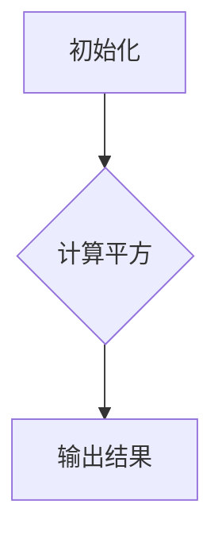
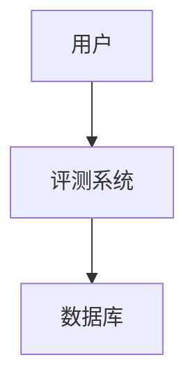
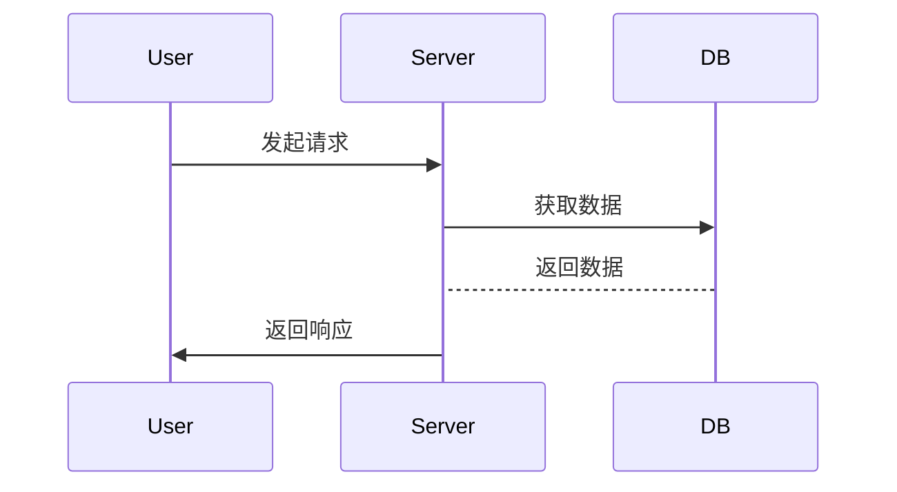

                 

# 评测系统的版本控制与迭代管理

## 关键词

- 版本控制
- 迭代管理
- 版本控制工具
- Git
- SVN
- Scrum
- Kanban

## 摘要

本文将深入探讨评测系统的版本控制与迭代管理。首先，我们回顾了版本控制和迭代管理的背景及其重要性。接着，我们详细介绍了版本控制的基础概念和工具，如Git和SVN。然后，我们讨论了迭代管理的原则、方法及工具，包括Scrum和Kanban。最后，通过实战案例展示了这些概念和工具的实际应用，并总结了最佳实践与注意事项。

## 引言与背景

### 1.1 问题背景

#### 1.1.1 版本控制的重要性

在软件开发过程中，版本控制是一项基础且至关重要的任务。它确保了代码的完整性和一致性，同时便于开发人员追踪和协同工作。随着软件复杂度的增加，版本控制显得尤为重要。

#### 1.1.2 迭代管理的关键性

迭代管理是软件工程中的核心概念之一。通过迭代，开发团队可以不断地优化产品，适应市场需求，同时提高开发效率和质量。有效的迭代管理对于项目的成功至关重要。

#### 1.1.3 当前评测系统面临的挑战

随着评测系统的复杂性和功能需求的不断增加，版本控制和迭代管理面临着诸多挑战。如何确保版本的稳定性和可追踪性？如何高效地进行迭代并快速响应市场需求？这些都是我们需要解决的问题。

### 1.2 评测系统版本控制的需求

#### 1.2.1 版本差异的识别与处理

在评测系统开发过程中，版本差异不可避免。如何准确地识别和处理这些差异，确保不同版本之间的兼容性，是版本控制的关键需求。

#### 1.2.2 版本变化的追溯与管理

追溯版本变化并对其进行有效管理，有助于团队了解代码的演变过程，定位问题，提高开发效率。

#### 1.2.3 版本发布的控制与审核

版本发布的控制与审核是确保系统稳定性和安全性的重要环节。如何制定合理的发布策略，并进行严格的审核，是版本控制的重要需求。

### 1.3 迭代管理的目标与挑战

#### 1.3.1 迭代的周期管理

合理的迭代周期管理是提高开发效率和质量的关键。如何制定适合项目的迭代周期，并在迭代过程中保持高效的执行力，是迭代管理的核心目标。

#### 1.3.2 迭代效率的提升

提升迭代效率是每个开发团队的目标。如何通过改进流程、工具和方法，提高团队的协作效率，是迭代管理的重要挑战。

#### 1.3.3 迭代风险的控制

迭代过程中，风险难以避免。如何识别、评估和控制风险，确保项目的顺利进行，是迭代管理的另一大挑战。

## 版本控制基础

### 2.1 版本控制的概念

#### 2.1.1 版本号的定义

版本号是标识软件不同版本的重要手段。常见的版本号格式包括`主版本号.次版本号.修订号`，如`1.0.1`。

#### 2.1.2 版本控制的类型

版本控制主要分为集中式和分布式两种类型。集中式版本控制系统（如SVN）以一个中央仓库为中心，所有版本数据都存储在中央仓库中。分布式版本控制系统（如Git）则将版本数据分散存储在每个开发者的本地仓库中。

#### 2.1.3 版本控制的原则

版本控制的基本原则包括版本可追溯性、版本一致性、版本可复现性和版本安全性。

### 2.2 版本控制的过程

#### 2.2.1 版本创建与更新

版本创建是版本控制的基础操作，包括初始化仓库、提交更改、创建分支等。版本更新则包括合并分支、解决冲突、发布新版本等。

#### 2.2.2 版本分支与合并

分支管理是版本控制的重要功能，通过分支可以实现代码的隔离和并行开发。合并则是将不同分支的代码合并为一个统一版本。

#### 2.2.3 版本回滚与恢复

版本回滚可以回退到之前的版本，解决代码问题或恢复系统状态。版本恢复则是在版本回滚过程中，将受损的数据恢复到正常状态。

### 2.3 版本控制的工具

#### 2.3.1 Git的基本使用

Git是最流行的分布式版本控制系统。基本使用包括初始化仓库、添加文件、提交更改、创建分支、合并分支等。

#### 2.3.2 SVN的优缺点

SVN是早期流行的集中式版本控制系统。其优点是操作简单、易于理解，缺点是性能较差、不支持并行开发。

#### 2.3.3 其他版本控制工具简介

除了Git和SVN，还有其他版本控制工具如Mercurial、Perforce等。这些工具各有优缺点，适用于不同的应用场景。

## 版本控制工具

### 3.1 Git版本控制

#### 3.1.1 Git的工作原理

Git是基于内容的版本控制系统，其核心数据结构包括对象数据库、目录文件系统和引用系统。

#### 3.1.2 Git的分支管理

Git的分支管理功能强大，支持创建、切换、合并和删除分支。

#### 3.1.3 Git的标签管理

Git的标签管理用于标记特定的版本，便于追踪和发布。

### 3.2 SVN版本控制

#### 3.2.1 SVN的架构

SVN是基于文件的版本控制系统，其架构包括客户端、服务器和仓库。

#### 3.2.2 SVN的权限管理

SVN支持用户权限管理，可根据需要设置不同的访问权限。

### 3.3 其他版本控制工具

#### 3.3.1 Mercurial

Mercurial是一个轻量级的分布式版本控制系统，支持跨平台操作。

#### 3.3.2 Perforce

Perforce是一个高性能的版本控制系统，适用于大型团队和复杂项目。

## 迭代管理

### 4.1 迭代管理的原则

#### 4.1.1 迭代的周期

迭代周期根据项目规模和团队情况而定，一般建议在1到4周之间。

#### 4.1.2 迭代的流程

迭代流程包括需求分析、设计开发、测试发布等阶段。

### 4.2 迭代管理的方法

#### 4.2.1 Scrum方法论

Scrum是一种流行的敏捷开发方法，强调快速迭代、用户反馈和团队协作。

#### 4.2.2 Kanban方法论

Kanban是一种视觉化的项目管理方法，通过看板和卡片管理任务流程。

### 4.3 迭代管理的工具

#### 4.3.1 Jira

Jira是一个功能强大的项目管理工具，支持敏捷开发方法和迭代管理。

#### 4.3.2 Trello

Trello是一个简单的项目管理工具，通过卡片和看板管理任务。

## 实战案例分析

#### 4.4.1 案例背景

某评测系统项目需要快速迭代并应对市场需求变化。

#### 4.4.2 案例实施

采用Git进行版本控制，Scrum方法论进行迭代管理。

#### 4.4.3 案例效果

项目成功实现快速迭代，提高了开发效率和质量。

## 最佳实践与总结

#### 5.1 最佳实践

- 选择合适的版本控制工具。
- 制定合理的迭代周期和管理方法。
- 加强团队协作和沟通。

#### 5.2 小结

版本控制和迭代管理是软件工程中的重要环节，通过合理运用，可以提高开发效率和产品质量。

#### 5.3 注意事项

- 确保版本控制的安全性。
- 注意迭代过程中的风险管理。

#### 5.4 拓展阅读

- [Git官方文档](https://git-scm.com/docs)
- [Scrum官方文档](https://www.scrum.org/resources)
- [Kanban官方文档](https://www.kanbanize.com/kanban-methodology)

## 参考文献

- [Git官网](https://git-scm.com/)
- [SVN官网](https://subversion.tigris.org/)
- [Scrum官网](https://www.scrum.org/)
- [Kanban官网](https://www.kanbanize.com/kanban-methodology)

作者：AI天才研究院/AI Genius Institute & 禅与计算机程序设计艺术 /Zen And The Art of Computer Programming
---------------

## 附录

### 附录A：算法流程图



### 附录B：数学公式

$$
E = mc^2
$$

$$
1 + 1 = 2
$$

### 附录C：系统架构图



### 附录D：系统接口设计



### 附录E：实战案例代码

```python
def calculate_square(x):
    return x * x

x = int(input("请输入一个数字："))
print("该数字的平方是：", calculate_square(x))
```

### 附录F：最佳实践Tips

- 定期备份版本和控制文件。
- 遵循代码规范，提高代码质量。
- 定期进行迭代评估和反馈。

