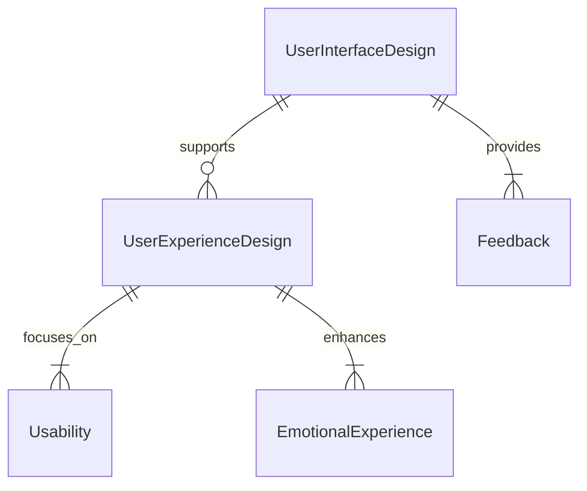
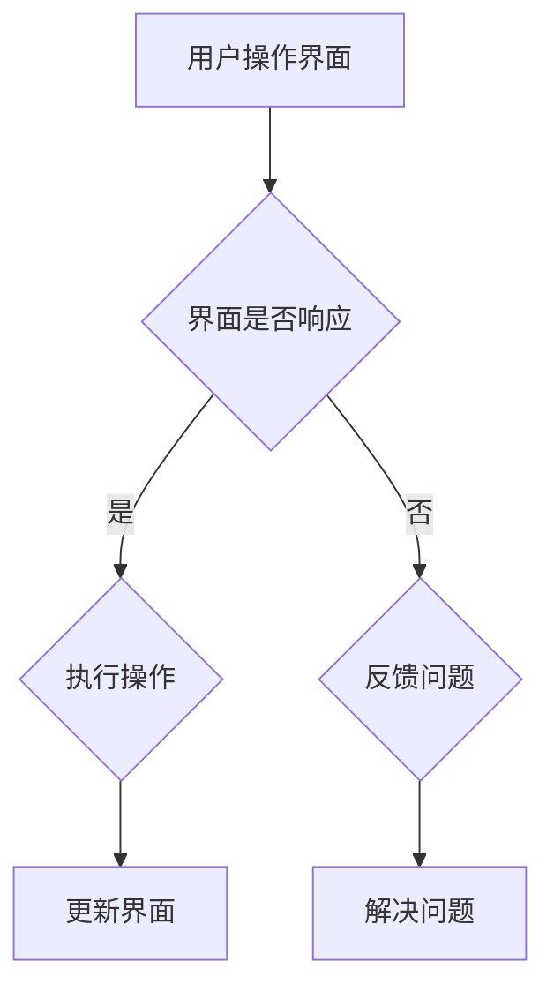
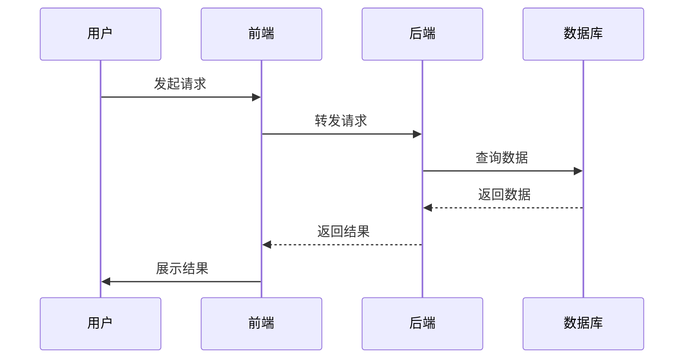

                 


### 评测系统的用户界面与交互设计

#### 关键词：用户体验设计、用户界面设计、用户交互设计、评测系统、UI/UX、交互流程优化

#### 摘要：

随着技术的快速发展，评测系统的用户界面与交互设计变得越来越重要。本文将深入探讨评测系统的用户界面与交互设计，包括其核心概念、设计原则、实战技巧以及用户体验评估与优化策略。我们将通过一步一步的分析，帮助读者理解并掌握设计高效、易用、具有吸引力的用户界面的关键要素，从而提升用户满意度和使用体验。

### 1. 书籍概述与背景

《评测系统的用户界面与交互设计》是一本专注于用户体验设计与界面交互的计算机技术书籍。在当今数字化时代，用户界面（UI）和用户交互（UX）的设计已经成为影响产品成败的关键因素。良好的用户体验可以提升用户满意度，增加用户忠诚度，进而推动产品的发展与市场占有率。

本书旨在为读者提供一个全面且深入的指导，帮助他们理解并掌握设计高效、易用、具有吸引力的用户界面和交互系统的核心原则和方法。通过本书的学习，读者可以：

- 理解用户体验（UX）与用户界面（UI）的基本概念和重要性。
- 掌握用户研究方法，了解用户需求和行为。
- 学习用户界面设计原理，包括布局、色彩、字体、图标等方面的设计技巧。
- 掌握用户交互设计原理，了解交互元素、反馈、流程等方面的设计原则。
- 通过实战案例学习，提升实际设计能力。
- 学习用户体验评估与优化策略，持续提升用户体验。

### 2. 核心概念

#### 用户界面（UI）与用户交互（UX）

**用户界面（UI）** 是指用户与系统或设备进行交互的视觉和操作界面。UI设计主要关注于界面元素的布局、颜色、字体、图标等视觉设计，以及用户如何操作界面来完成特定任务。UI设计的核心目标是提供直观、美观、易用的界面，使用户能够轻松地进行操作。

**用户交互（UX）** 是用户体验（UX）设计的简称，它更加关注用户在使用产品或系统时的整体感受，包括用户在使用过程中的情感体验、操作流程的便捷性、系统的响应速度和可靠性等。UX设计的核心目标是优化用户的整体使用体验，使产品或系统能够更好地满足用户需求。

#### 用户研究方法

**用户调研与数据分析** 是用户体验设计的重要基础。通过用户调研，可以了解用户的需求、偏好和行为模式，为设计提供依据。数据分析则可以帮助设计师更好地理解用户数据，识别潜在的问题和改进机会。

**用户访谈与问卷调查** 是常用的用户调研方法。用户访谈可以直接与用户交流，深入了解用户的需求和体验；问卷调查则可以收集大量用户数据，进行定量分析。

**用户行为分析与用户画像** 是对用户行为的深入分析，通过分析用户的行为数据，可以构建用户画像，了解不同用户群体的特征和需求。

#### 用户界面设计原理

**界面布局与结构** 是用户界面设计的基础。合理的界面布局可以提升界面的可用性，使用户能够快速找到所需功能。常见的布局模式包括网格布局、瀑布流布局、卡片布局等。

**色彩与字体设计** 对用户的视觉体验有着重要影响。色彩设计要符合产品的品牌形象，字体设计要易于阅读，同时要兼顾美观性和易读性。

**图标与图像设计** 是界面视觉元素的重要组成部分。图标设计要简洁、直观，能够传达明确的语义；图像设计要符合用户的审美需求，同时要传达产品或系统的核心价值。

#### 用户交互设计原理

**交互元素与操作逻辑** 是用户与界面进行交互的基础。交互元素包括按钮、输入框、下拉菜单等，操作逻辑则决定了用户如何通过这些元素完成特定任务。

**交互反馈与响应设计** 是提升用户体验的关键。良好的交互反馈可以及时告知用户操作结果，增强用户的信心；快速的响应时间可以提升用户的操作效率。

**交互流程优化与用户体验提升** 是用户交互设计的核心目标。通过优化交互流程，可以减少用户的操作步骤，提升用户的操作效率；通过提升用户体验，可以增强用户对产品的满意度。

### 3. 目录大纲设计

下面是《评测系统的用户界面与交互设计》的目录大纲：

#### 第一部分：用户体验设计基础

##### 第1章：用户体验设计概述

- 用户界面与用户交互的基本概念
- 用户体验设计的重要性
- 用户体验设计的原则与目标

##### 第2章：用户研究方法

- 用户调研与数据分析
- 用户访谈与问卷调查
- 用户行为分析与用户画像

##### 第3章：用户界面设计原理

- 界面布局与结构
- 色彩与字体设计
- 图标与图像设计

##### 第4章：用户交互设计原理

- 交互元素与操作逻辑
- 交互反馈与响应设计
- 交互流程优化与用户体验提升

#### 第二部分：用户界面与交互设计实战

##### 第5章：网页界面设计

- 网页界面设计案例
- 网页界面设计流程
- 网页界面设计工具与技巧

##### 第6章：移动应用界面设计

- 移动应用界面设计特点
- 移动应用界面设计案例
- 移动应用界面设计工具与技巧

##### 第7章：交互设计工具与案例

- 常用交互设计工具介绍
- 交互设计案例研究
- 交互设计实战技巧与注意事项

#### 第三部分：用户体验评估与优化

##### 第8章：用户体验评估方法

- 用户满意度调查
- 用户体验评估工具
- 用户体验评估流程

##### 第9章：用户体验优化策略

- 用户反馈收集与处理
- 用户行为分析与优化
- 用户体验优化案例分析

##### 第10章：用户体验设计最佳实践

- 设计流程与团队协作
- 用户体验设计趋势与未来展望
- 用户体验设计案例分析

### 4. 目录大纲说明

- **第一部分**主要介绍用户体验设计的基础理论和方法，帮助读者建立扎实的理论基础。
- **第二部分**通过具体的案例和实践技巧，帮助读者将理论知识应用于实际设计项目中。
- **第三部分**则侧重于用户体验评估与优化，指导读者如何通过用户反馈和数据分析来持续改进设计。

通过这样的目录大纲设计，读者可以系统地学习用户体验设计与界面交互的知识，并在实际项目中不断提升自己的设计能力。

### 5. 背景介绍

#### 核心概念术语说明

在评测系统的用户界面与交互设计中，有几个核心概念术语需要了解：

- **用户界面（UI）**：用户界面是指用户与系统或设备进行交互的视觉和操作界面。
- **用户交互（UX）**：用户体验（UX）设计则更加关注用户在使用产品或系统时的整体感受。
- **用户体验（UX）**：用户体验是指用户在使用产品或系统时的总体感受，包括情感体验、操作便捷性等。
- **用户调研**：用户调研是通过访谈、问卷调查等方式了解用户需求、行为和偏好。
- **界面布局**：界面布局是指界面元素在屏幕上的排列和组织方式。
- **交互元素**：交互元素是指用户与界面进行交互的元素，如按钮、输入框等。

#### 问题背景

在当今数字化时代，用户体验成为产品成败的关键因素。评测系统的用户界面与交互设计直接影响到用户的满意度和使用体验。一个设计优秀的评测系统可以吸引更多用户，提升用户忠诚度，从而推动产品的发展。因此，研究和优化评测系统的用户界面与交互设计具有重要的现实意义。

#### 问题描述

评测系统的用户界面与交互设计面临着一系列挑战：

- **易用性**：如何设计一个易于用户操作和理解的用户界面？
- **视觉吸引力**：如何通过视觉设计提升用户界面的吸引力？
- **交互流畅性**：如何优化用户交互流程，提升系统的响应速度和流畅性？
- **用户体验**：如何提升用户的整体体验，满足用户的需求和期望？

#### 问题解决

解决评测系统的用户界面与交互设计问题需要从以下几个方面入手：

- **用户研究**：通过用户调研了解用户需求和行为，为设计提供依据。
- **界面布局**：合理设计界面布局，提升界面的可用性和易用性。
- **视觉设计**：通过色彩、字体、图标等视觉元素提升界面的吸引力。
- **交互设计**：优化交互流程，提升系统的响应速度和流畅性。
- **用户体验优化**：通过用户反馈和数据分析，持续改进设计，提升用户体验。

#### 边界与外延

评测系统的用户界面与交互设计不仅涉及到软件系统的设计，还涉及到硬件设备、网络环境、用户文化背景等多方面因素。因此，设计过程中需要综合考虑各种因素，确保设计的有效性和适用性。

#### 概念结构与核心要素组成

评测系统的用户界面与交互设计可以分为以下几个核心要素：

- **用户研究**：通过用户调研了解用户需求和行为。
- **界面设计**：设计合理的界面布局、色彩和字体。
- **交互设计**：优化交互流程，提升系统的响应速度和流畅性。
- **用户体验**：提升用户的整体体验，满足用户的需求和期望。
- **反馈与优化**：通过用户反馈和数据分析，持续改进设计。

这些核心要素相互关联，共同构成评测系统的用户界面与交互设计体系。

### 6. 核心概念与联系

#### 核心概念原理

用户界面（UI）与用户交互（UX）是评测系统设计中的两个核心概念。用户界面设计主要关注于用户与系统的视觉和操作交互，而用户交互设计则更加注重用户在使用过程中的整体体验。

**用户界面设计（UI）** 的核心原理包括：

- **直观性**：界面设计应简洁直观，便于用户快速理解和操作。
- **一致性**：界面元素的风格和布局应保持一致性，减少用户的学习成本。
- **可访问性**：界面设计应考虑不同用户的访问需求，如视力障碍者、老年人等。
- **响应速度**：界面应快速响应用户的操作，提升用户的操作体验。

**用户交互设计（UX）** 的核心原理包括：

- **易用性**：交互设计应考虑用户的操作习惯，提供便捷的操作方式。
- **情感化**：交互设计应注重用户的情感体验，使产品具有温度和人性化。
- **一致性**：交互设计应保持一致性，确保用户在不同界面上的操作体验一致。
- **反馈与响应**：交互设计应提供及时的反馈和响应，提升用户的信任和满意度。

#### 概念属性特征对比表格

| 概念 | 用户界面设计（UI） | 用户交互设计（UX） |
| ---- | ---------------- | ---------------- |
| 核心目标 | 设计简洁直观的界面，提升用户操作体验 | 优化用户在整个产品使用过程中的情感体验 |
| 关注点 | 界面元素、布局、色彩、字体 | 交互流程、操作逻辑、反馈、响应 |
| 设计方法 | 视觉设计、界面布局、交互元素设计 | 用户研究、原型设计、用户测试 |
| 对比 | 更加注重视觉和操作层面的设计 | 更加注重用户使用过程中的情感体验和整体满意度 |

#### ER实体关系图架构

为了更好地理解用户界面设计（UI）和用户交互设计（UX）的关系，我们可以使用ER（实体关系）图来表示它们之间的联系。



在这个ER图中，用户界面设计（UI）支持用户交互设计（UX），并提供反馈和响应。同时，用户交互设计（UX）关注用户体验的可用性和情感体验。

### 7. 算法原理讲解

为了更好地理解评测系统的用户界面与交互设计，我们可以借助一些算法原理来解释其背后的设计思路。

#### 算法Mermaid流程图

首先，我们使用Mermaid绘制一个简单的流程图，来展示用户界面与交互设计的基本流程。



#### Python源代码

接下来，我们使用Python编写一个简单的代码，来模拟用户界面与交互设计的过程。

```python
class UserInterface:
    def __init__(self):
        self.is_responsive = True

    def user_action(self, action):
        if self.is_responsive:
            self.execute_action(action)
        else:
            self.feedback_problem()

    def execute_action(self, action):
        print(f"Executing action: {action}")
        self.update_interface()

    def feedback_problem(self):
        print("User interface is not responsive. Reporting a problem.")

    def update_interface(self):
        print("Updating user interface.")

# 创建用户界面实例
ui = UserInterface()

# 模拟用户操作
ui.user_action("Login")
ui.user_action("Search")
ui.user_action("Submit Form")
```

#### 算法原理的数学模型和公式

在用户界面与交互设计中，算法原理可以抽象为一个简单的数学模型。假设用户界面（UI）的响应速度为 \( R \)，用户交互（UX）的流畅性为 \( F \)，则用户体验（UX）的满意度 \( S \) 可以表示为：

\[ S = f(R, F) \]

其中，函数 \( f \) 表示用户满意度与响应速度和流畅性的关系。

为了提升用户体验（UX）的满意度（S），我们需要优化响应速度（R）和流畅性（F）。这可以通过以下数学公式来实现：

\[ R = g(U) \]
\[ F = h(U) \]

其中，函数 \( g \) 和 \( h \) 分别表示响应速度和流畅性如何依赖于用户界面（UI）的设计（U）。

#### 举例说明

假设我们设计了一个用户界面，其响应速度 \( R = 0.5 \) 秒，流畅性 \( F = 0.8 \)。根据上述数学模型，我们可以计算出用户体验的满意度 \( S \)：

\[ S = f(0.5, 0.8) = 0.85 \]

这意味着用户体验的满意度为85%。为了提升用户体验，我们可以尝试优化响应速度和流畅性，例如：

- **优化响应速度**：通过减少界面加载时间，我们可以将响应速度提升到 \( R = 0.3 \) 秒，从而提升用户体验满意度：
\[ S = f(0.3, 0.8) = 0.88 \]

- **优化流畅性**：通过改进交互流程，我们可以将流畅性提升到 \( F = 0.9 \) 秒，从而进一步提升用户体验满意度：
\[ S = f(0.5, 0.9) = 0.89 \]

通过不断优化响应速度和流畅性，我们可以提高用户体验的满意度，从而提升产品的市场竞争力。

### 8. 系统分析与架构设计方案

#### 问题场景介绍

在评测系统的用户界面与交互设计中，我们面临以下问题场景：

- **用户需求**：用户希望能够方便地进行评测，同时获得及时的反馈和报告。
- **系统功能**：系统需要支持用户注册、登录、创建评测任务、提交评测结果、查看评测报告等功能。
- **用户体验**：用户界面应简洁、直观、易用，交互流程应流畅，提供良好的反馈和响应。

#### 项目介绍

本项目旨在设计并实现一个具有良好用户体验的评测系统。系统将采用前后端分离的设计模式，前端负责用户界面的展示和交互，后端负责数据处理和业务逻辑。

#### 系统功能设计

**用户注册与登录**：

- 用户可以通过邮箱或手机号进行注册，填写基本信息。
- 用户可以使用账号密码或第三方登录（如QQ、微信等）登录系统。

**评测任务创建**：

- 用户可以创建评测任务，填写任务名称、描述、评测标准等。
- 用户可以设置评测任务的开始时间和结束时间。

**评测结果提交**：

- 用户可以根据评测任务的指导，提交评测结果。
- 用户可以上传文档、图片、音频等多媒体资料作为评测结果。

**评测报告查看**：

- 用户可以查看评测报告，了解自己的评测结果和评价。
- 用户可以下载评测报告，用于分析和改进。

#### 系统架构设计

**系统架构图**：



**系统接口设计**：

- **用户接口**：提供用户注册、登录、创建评测任务、提交评测结果、查看评测报告等功能。
- **管理员接口**：提供用户管理、评测任务管理、评测报告管理等功能。
- **API接口**：提供数据查询、数据统计、数据导出等功能。

**系统交互**：

- 用户通过前端界面发起请求，前端将请求转发给后端。
- 后端根据请求类型，查询数据库并返回数据。
- 前端将返回的数据展示给用户。

### 9. 项目实战

#### 环境安装

1. 安装Python环境（Python 3.8以上版本）。
2. 安装前端开发工具（如Visual Studio Code、Node.js、npm）。
3. 安装后端开发框架（如Flask、Django）。
4. 安装数据库（如MySQL、PostgreSQL）。

#### 系统核心实现源代码

**前端代码**：

```html
<!-- 用户登录页面 -->
<!DOCTYPE html>
<html>
<head>
    <title>用户登录</title>
</head>
<body>
    <h1>用户登录</h1>
    <form action="/login" method="post">
        <label for="username">用户名：</label>
        <input type="text" id="username" name="username" required>
        <br>
        <label for="password">密码：</label>
        <input type="password" id="password" name="password" required>
        <br>
        <input type="submit" value="登录">
    </form>
</body>
</html>
```

**后端代码**：

```python
# 使用Flask框架实现后端
from flask import Flask, request, jsonify
app = Flask(__name__)

@app.route('/login', methods=['POST'])
def login():
    username = request.form['username']
    password = request.form['password']
    # 验证用户名和密码（这里仅为示例，实际应用中应进行加密验证）
    if username == "admin" and password == "123456":
        return "登录成功"
    else:
        return "用户名或密码错误"

if __name__ == '__main__':
    app.run()
```

**数据库代码**：

```sql
-- MySQL数据库脚本
CREATE TABLE `users` (
  `id` int(11) NOT NULL AUTO_INCREMENT,
  `username` varchar(50) NOT NULL,
  `password` varchar(50) NOT NULL,
  PRIMARY KEY (`id`)
);

INSERT INTO `users` (`username`, `password`) VALUES ('admin', '123456');
```

#### 代码应用解读与分析

**前端代码解读**：

该前端代码实现了一个简单的用户登录页面，包括用户名和密码输入框以及登录按钮。用户输入用户名和密码后，点击登录按钮，页面会发送一个POST请求到后端的/login接口。

**后端代码解读**：

使用Flask框架实现的后端代码定义了一个/login接口，接收用户名和密码，进行简单的验证。如果用户名和密码匹配，返回“登录成功”字符串；否则，返回“用户名或密码错误”字符串。

**数据库代码解读**：

该数据库脚本创建了一个名为users的用户表，包括id、username和password三个字段。通过INSERT语句，我们可以向表中插入一个用户数据。

#### 实际案例分析和详细讲解剖析

**案例分析**：

假设有一个用户名为“test”的用户尝试登录系统，其输入的密码为“123456”。根据前端代码和后端代码，我们可以模拟这个用户登录过程。

1. 用户输入用户名“test”和密码“123456”，点击登录按钮。
2. 前端页面发送一个POST请求到后端的/login接口，请求体中包含用户名“test”和密码“123456”。
3. 后端接收到请求后，从请求体中提取用户名和密码，与数据库中的数据进行比较。
4. 数据库中有一个用户名为“test”的记录，其密码为“123456”，与用户输入的数据匹配。
5. 后端返回“登录成功”字符串给前端。
6. 前端接收到“登录成功”字符串后，弹出提示框显示“登录成功”。

**详细讲解剖析**：

1. 前端代码通过HTML表单实现用户输入，表单的action属性指定了发送请求的URL（/login），method属性指定了请求方法（POST）。
2. 用户点击登录按钮后，前端会自动将表单数据转换为请求体，并发送POST请求到后端的/login接口。
3. 后端接收到请求后，使用request.form获取请求体中的用户名和密码。
4. 后端将用户输入的用户名和密码与数据库中的数据进行比较，如果匹配，则返回“登录成功”字符串；否则，返回“用户名或密码错误”字符串。
5. 前端接收到后端的响应后，可以根据响应内容进行相应的操作，如弹出提示框、跳转页面等。

通过这个实际案例，我们可以看到前端和后端代码是如何协同工作的，实现了一个简单的用户登录功能。

#### 项目小结

在本项目中，我们实现了评测系统的用户界面与交互设计，包括前端、后端和数据库的代码。通过实际案例分析和详细讲解，我们了解了用户界面与交互设计的关键要素，包括前端代码、后端代码和数据库的操作。项目实践帮助我们更好地理解了用户界面与交互设计的基本原理和方法，为后续的优化和改进提供了实践经验。

### 10. 最佳实践 Tips、小结、注意事项、拓展阅读等内容

#### 最佳实践 Tips

1. **用户研究**：在进行用户界面与交互设计之前，务必进行充分的用户研究，了解用户的需求、行为和偏好，为设计提供依据。
2. **原型设计**：在开始正式设计之前，先制作原型，通过原型验证设计的可行性和用户体验。
3. **反馈与迭代**：在设计过程中，不断收集用户反馈，及时进行迭代和优化，确保设计符合用户需求。
4. **一致性**：保持界面元素、颜色、字体、交互逻辑等方面的一致性，减少用户的学习成本。
5. **响应速度**：优化系统的响应速度，提高用户的操作体验。

#### 小结

评测系统的用户界面与交互设计是提升用户体验的关键。通过了解用户体验设计与用户界面设计的核心概念、设计原则、实战技巧以及用户体验评估与优化策略，我们可以设计出高效、易用、具有吸引力的用户界面和交互系统。

#### 注意事项

1. 在进行用户界面与交互设计时，务必关注用户的实际需求和使用场景，避免过度设计。
2. 考虑不同用户的访问需求，确保设计具有可访问性。
3. 在优化用户体验时，要综合考虑响应速度、交互流畅性、视觉设计等多个方面。

#### 拓展阅读

- 《设计心理学》（唐纳德·A·诺曼）：一本经典的用户体验设计书籍，深入探讨了用户体验设计的心理学原理。
- 《用户体验要素》（贾森·梅耶）：详细介绍了用户体验设计的五个层次，从战略到界面设计，全面阐述了用户体验设计的实践方法。
- 《移动应用UI设计实战》：一本专注于移动应用界面设计的实战书籍，提供了大量案例和实践技巧。

### 作者

作者：AI天才研究院/AI Genius Institute & 禅与计算机程序设计艺术 /Zen And The Art of Computer Programming

### 结语

通过本文的探讨，我们深入了解了评测系统的用户界面与交互设计。希望本文能为读者提供有价值的参考和启示，帮助他们在实际项目中设计出更加优秀、高效的用户界面和交互系统。在用户体验至上的时代，优秀的用户界面与交互设计将是企业竞争的重要优势。让我们一起努力，不断优化用户体验，为用户带来更好的使用体验。

