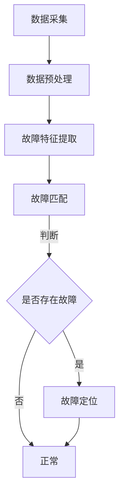
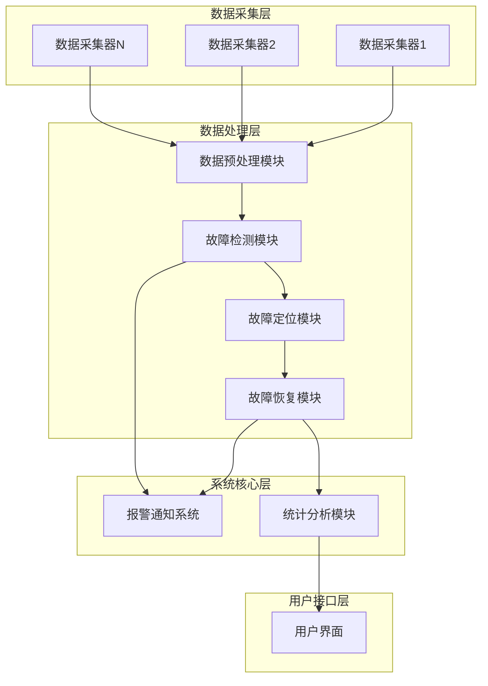
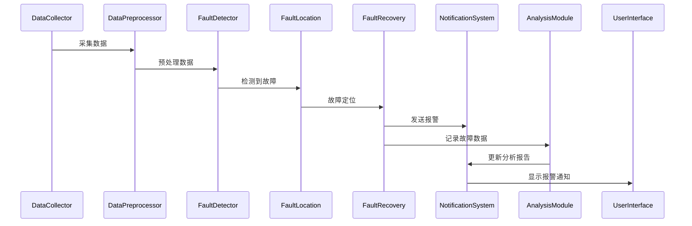

                 

# 评测系统的自动化故障诊断功能

> 关键词：评测系统、自动化故障诊断、故障检测、系统架构、算法原理

> 摘要：本文将深入探讨评测系统的自动化故障诊断功能。通过介绍核心概念、技术原理、系统架构以及实战案例，本文旨在帮助读者理解自动化故障诊断的重要性，掌握其实现方法，并能够在实际项目中应用。

----------------------------------------------------------------

## 引言

在信息技术快速发展的今天，评测系统在各类应用场景中扮演着至关重要的角色。然而，随着系统的复杂性和规模的增加，手动进行故障诊断变得越来越困难，效率低下且容易出错。为了提高故障检测和响应的速度，自动化故障诊断功能应运而生。本文将详细讨论评测系统的自动化故障诊断功能，从核心概念、技术原理到系统架构，再到实战案例，全面解析这一关键技术。

### 目录大纲设计思路

为了确保文章内容的系统性和逻辑性，本文将按照以下目录大纲进行组织：

1. **背景介绍**：阐述自动化故障诊断的必要性，介绍相关概念和现有挑战。
2. **核心概念与联系**：详细解释自动化故障诊断的核心概念，通过对比表格和ER实体关系图进行结构化描述。
3. **技术原理**：深入分析数据采集与预处理、故障诊断算法原理以及数学模型与公式。
4. **系统架构与实现**：介绍系统架构设计，包括功能设计、架构设计、接口设计和交互序列图。
5. **项目实战**：展示实际环境安装、系统实现源代码及代码解析，并结合案例进行分析。
6. **最佳实践与总结**：提供实践经验总结、注意事项以及未来发展趋势。

### 目录大纲详细设计

#### 第一部分：背景介绍

**第1章：自动化故障诊断的必要性**

- **1.1 问题背景**：信息技术系统复杂性增加，手动故障诊断的局限性。
- **1.2 自动化故障诊断的概念**：定义和重要性。
- **1.3 现状与挑战**：现有系统在故障诊断方面的不足。
- **1.4 本章小结**：总结自动化故障诊断的意义。

**第2章：核心概念与联系**

- **2.1 自动化故障诊断的核心概念**：故障检测、故障定位、故障恢复。
- **2.2 概念属性特征对比表格**：不同概念的比较。
- **2.3 ER实体关系图架构**：描述系统组件及其关系。
- **2.4 本章小结**：核心概念的结构和联系。

#### 第二部分：技术原理

**第3章：数据采集与预处理**

- **3.1 数据采集**：数据来源和采集方式。
- **3.2 数据预处理**：数据清洗、转换和整合。
- **3.3 数据质量评估**：评估方法和指标。
- **3.4 本章小结**：数据采集与预处理的重要性。

**第4章：故障诊断算法原理**

- **4.1 故障诊断算法概述**：常见算法介绍。
- **4.2 Mermaid算法流程图**：算法流程图展示。
- **4.3 Python源代码实现**：算法实现代码示例。
- **4.4 算法原理讲解**：详细解释算法工作原理。
- **4.5 举例说明**：具体案例说明算法应用。
- **4.6 本章小结**：总结故障诊断算法的关键点。

**第5章：数学模型与公式**

- **5.1 数学模型概述**：故障诊断中的数学模型。
- **5.2 公式详细讲解**：公式推导和解释。
- **5.3 举例说明**：使用公式的具体案例。
- **5.4 本章小结**：数学模型在故障诊断中的应用。

#### 第三部分：系统架构与实现

**第6章：系统架构设计**

- **6.1 问题场景介绍**：实际应用背景。
- **6.2 系统功能设计**：功能模块介绍。
- **6.3 系统架构设计**：系统整体架构。
- **6.4 系统接口设计**：接口功能和规范。
- **6.5 系统交互序列图**：系统交互流程展示。
- **6.6 本章小结**：系统架构的设计原则。

**第7章：项目实战**

- **7.1 环境安装**：安装步骤和注意事项。
- **7.2 系统核心实现源代码**：代码实现细节。
- **7.3 代码应用解读与分析**：代码功能解读。
- **7.4 实际案例分析与讲解**：案例展示与解析。
- **7.5 项目小结**：项目总结与反思。
- **7.6 本章小结**：项目实践的经验和教训。

#### 第四部分：最佳实践与总结

**第8章：最佳实践**

- **8.1 自动化故障诊断的实践经验**：实战技巧。
- **8.2 小结与注意事项**：注意事项和实践经验总结。
- **8.3 拓展阅读**：相关文献推荐。

**第9章：总结与展望**

- **9.1 书籍总结**：全文总结。
- **9.2 未来发展趋势**：自动化故障诊断的未来方向。
- **9.3 对读者的寄语**：鼓励与建议。

### 结尾

本文通过逐步分析评测系统的自动化故障诊断功能，旨在为读者提供一个全面而深入的理解。从核心概念到实际应用，从系统架构到项目实战，本文力求以清晰的结构和易懂的语言阐述自动化故障诊断的各个方面。希望通过本文，读者能够掌握自动化故障诊断的核心技术，并在实际项目中得以应用，为信息技术系统的稳定性和可靠性提供有力保障。

---

**作者：AI天才研究院/AI Genius Institute & 禅与计算机程序设计艺术 /Zen And The Art of Computer Programming**

----------------------------------------------------------------

## 背景介绍

随着信息技术和系统复杂性的日益增加，评测系统的应用范围也越来越广泛。从互联网服务、云计算平台到大数据分析，评测系统在保障系统稳定性和可靠性方面发挥着至关重要的作用。然而，传统的手动故障诊断方法在处理复杂系统时显得力不从心，效率低下且容易出现误判。为了应对这一挑战，自动化故障诊断功能应运而生，成为提升系统运维效率和质量的重要手段。

### 问题背景

在当前的数字化时代，系统的规模和复杂性不断增加，这使得手动诊断故障成为一项耗时且容易出错的任务。手动故障诊断通常需要人工检查系统日志、监控数据和性能指标，然后通过经验和专业知识来判断故障的根源。这种方法不仅耗费人力和时间，而且容易出现漏诊和误诊的情况。此外，随着系统规模不断扩大，手动诊断的难度和成本也在不断增加，这使得自动化故障诊断成为必然选择。

### 自动化故障诊断的概念

自动化故障诊断是指利用计算机技术和人工智能算法，对系统运行状态进行实时监测和分析，自动识别潜在故障和问题。自动化故障诊断的目标是提高故障检测的准确性和响应速度，减少人工干预，从而提高系统运维的效率和可靠性。自动化故障诊断通常包括以下几个关键步骤：

1. **数据采集**：从系统日志、监控设备和性能指标中收集数据。
2. **数据预处理**：对采集到的数据进行清洗、转换和整合，以便进行后续分析。
3. **故障检测**：利用机器学习、模式识别和统计分析等方法，识别系统中的异常行为。
4. **故障定位**：确定故障发生的具体位置和原因。
5. **故障恢复**：采取相应的措施来修复故障，恢复系统正常运行。

### 现状与挑战

目前，自动化故障诊断技术已经取得了显著进展，许多企业和组织都在积极探索和应用这一技术。然而，在实际应用中，自动化故障诊断仍然面临一些挑战：

1. **数据质量**：自动化故障诊断依赖于高质量的数据，数据缺失、噪声和错误会影响诊断的准确性。
2. **算法复杂性**：现有的故障诊断算法往往需要大量的计算资源和时间，这在实时应用中可能无法满足要求。
3. **模型适应性**：自动化故障诊断系统需要能够适应不同类型和规模的应用场景，这对算法的通用性和适应性提出了高要求。
4. **人工干预**：尽管自动化故障诊断的目标是减少人工干预，但在一些复杂场景中，仍然需要人工进行判断和决策。

### 本章小结

自动化故障诊断作为现代信息技术系统的重要组成部分，具有重要的现实意义。通过自动化故障诊断，可以提高故障检测的准确性和响应速度，降低人工干预的需求，从而提高系统运维的效率和可靠性。然而，自动化故障诊断技术在实际应用中仍然面临一些挑战，需要不断探索和改进。

----------------------------------------------------------------

## 核心概念与联系

### 自动化故障诊断的核心概念

自动化故障诊断涉及多个核心概念，这些概念构成了故障诊断的基础。以下是对这些核心概念的详细解释：

1. **故障检测**：故障检测是自动化故障诊断的第一步，其主要目标是识别系统中的异常行为。通过分析系统日志、监控数据和性能指标，故障检测算法可以实时监测系统状态，当检测到异常时，立即触发警报。

2. **故障定位**：故障定位是在故障检测的基础上，进一步确定故障发生的具体位置和原因。定位算法需要结合系统架构和运行状态，通过分析数据链路、设备连接和资源分配等信息，准确找到故障源头。

3. **故障恢复**：故障恢复是指采取相应的措施来修复故障，恢复系统正常运行。故障恢复可能包括重启服务、重新配置网络、修复文件系统等多种操作，以确保系统尽快恢复正常。

4. **自愈能力**：自愈能力是指系统在检测到故障后，能够自动执行故障恢复措施，而不需要人工干预。自愈能力是自动化故障诊断系统的高级功能，它显著提高了系统的可靠性和运维效率。

### 概念属性特征对比表格

为了更清晰地理解自动化故障诊断中的核心概念，我们可以通过一个对比表格来展示不同概念之间的属性特征差异。以下是一个简化的对比表格示例：

| 概念     | 定义                                                         | 属性特征                                           |
| -------- | ------------------------------------------------------------ | -------------------------------------------------- |
| 故障检测 | 识别系统中的异常行为                                         | 实时性、准确性、报警机制                           |
| 故障定位 | 确定故障发生的具体位置和原因                                 | 实时性、准确性、数据关联性                         |
| 故障恢复 | 采取措施修复故障，恢复系统正常运行                           | 自动化、及时性、可恢复性                           |
| 自愈能力 | 在检测到故障后，自动执行故障恢复措施，无需人工干预           | 自动化、可靠性、高效性                             |

### ER实体关系图架构

为了更好地理解自动化故障诊断系统的组件及其关系，我们可以使用实体关系图（ER图）来展示系统架构。以下是一个简化的ER图示例：

```mermaid
erDiagram
    SystemLog --> FaultDetector : 数据输入
    MonitorData --> FaultDetector : 数据输入
    PerformanceMetrics --> FaultDetector : 数据输入
    FaultDetector --> AlarmSystem : 故障警报
    FaultDetector --> FaultLocation : 定位请求
    FaultDetector --> FaultRecovery : 恢复请求
    AlarmSystem --> Notification : 警报通知
    FaultLocation --> MaintenanceTeam : 维修请求
    FaultRecovery --> SystemHealthMonitor : 恢复反馈
```

在这个ER图中，`SystemLog`、`MonitorData`和`PerformanceMetrics`是数据源实体，它们提供故障检测所需的输入数据。`FaultDetector`是核心实体，负责接收数据并进行故障检测。检测到的故障会触发`AlarmSystem`，产生警报通知给`Notification`实体。同时，故障检测还会发送请求给`FaultLocation`进行故障定位，并交给`FaultRecovery`执行故障恢复。恢复后的系统状态会反馈给`SystemHealthMonitor`进行监测。

### 本章小结

通过对自动化故障诊断核心概念的介绍和ER实体关系图的展示，我们可以更清晰地理解这一系统的组成部分及其相互作用。自动化故障诊断系统通过故障检测、故障定位、故障恢复和自愈能力等核心概念，实现了对系统异常的自动化识别和修复，从而提高了系统的稳定性和可靠性。

在接下来的章节中，我们将进一步探讨自动化故障诊断的技术原理和系统实现，为读者提供更为深入的理解和应用指导。

----------------------------------------------------------------

## 数据采集与预处理

在自动化故障诊断系统中，数据采集与预处理是至关重要的一步。数据作为故障诊断的基础，其质量和完整性直接影响诊断的准确性。本章节将详细介绍数据采集的方法、预处理过程以及数据质量评估的方法。

### 数据采集

数据采集是自动化故障诊断系统的第一步，它涉及到从各种数据源中收集所需的信息。数据源可以包括系统日志、监控数据、性能指标等。以下是数据采集的关键步骤：

1. **确定数据源**：首先需要明确需要收集哪些数据。这通常基于系统设计和运维的需求，包括系统状态数据、设备运行数据、网络流量数据等。

2. **数据采集方式**：根据数据源的特点，选择合适的数据采集方式。常见的数据采集方式包括：
   - **日志采集**：通过系统日志文件或日志管理工具（如ELK、Splunk）进行采集。
   - **监控数据采集**：通过监控系统（如Prometheus、Zabbix）定期收集性能指标。
   - **网络流量采集**：通过网络流量分析工具（如Wireshark、Bro）捕获网络数据包。

3. **数据传输**：将采集到的数据传输到集中存储或数据处理平台。数据传输可以通过实时流处理（如Kafka、Flume）或批量处理（如Hadoop、Spark）进行。

### 数据预处理

数据预处理是确保数据质量的关键步骤，它包括数据清洗、转换和整合。以下是数据预处理的主要任务：

1. **数据清洗**：去除数据中的噪声和错误，包括：
   - **空值处理**：填充或删除空值。
   - **异常值处理**：识别并处理异常值，如数据中的异常峰值。
   - **重复数据去除**：识别并删除重复的数据记录。

2. **数据转换**：将不同格式或单位的数据转换为统一的格式，以便后续处理。例如，将不同时间单位（如秒、分钟）统一转换为秒。

3. **数据整合**：将来自多个数据源的数据进行整合，形成一个统一的数据视图。这通常涉及到数据融合、数据聚合和数据标准化等操作。

### 数据质量评估

数据质量直接影响故障诊断的准确性，因此对数据进行质量评估至关重要。以下是常见的数据质量评估方法和指标：

1. **完整性**：评估数据中缺失值的比例。完整性指标可以用缺失值比例（缺失值数量/总数据量）来衡量。

2. **准确性**：评估数据中错误或异常值的比例。准确性指标可以用错误值比例（错误值数量/总数据量）来衡量。

3. **一致性**：评估数据在不同数据源之间的一致性。一致性指标可以用一致性比率（一致性数据量/总数据量）来衡量。

4. **及时性**：评估数据更新的速度和频率。及时性指标可以用数据更新周期（数据更新时间间隔）来衡量。

5. **相关性**：评估数据之间的相关性。相关性指标可以用相关系数（如皮尔逊相关系数）来衡量。

### 本章小结

数据采集与预处理是自动化故障诊断系统的基础，确保数据的质量和完整性对于故障诊断的准确性至关重要。通过有效的数据采集和预处理，可以去除噪声和错误，提高数据的可靠性。在数据质量评估过程中，对数据的完整性、准确性、一致性、及时性和相关性进行综合评估，可以确保数据满足故障诊断的需求。在接下来的章节中，我们将进一步探讨故障诊断算法原理和数学模型，为自动化故障诊断提供更深层次的技术支持。

----------------------------------------------------------------

## 故障诊断算法原理

故障诊断算法是自动化故障诊断系统的核心，其性能直接决定了诊断的准确性和效率。本章节将详细介绍故障诊断算法的原理，包括常见的算法类型、Mermaid算法流程图、Python源代码实现以及具体的算法原理讲解。

### 常见故障诊断算法类型

故障诊断算法主要分为以下几类：

1. **基于规则的方法**：这种方法依赖于预定义的规则集，通过匹配规则来判断故障。例如，如果系统温度超过阈值，则判定为过热故障。

2. **机器学习方法**：通过训练模型来识别故障模式。常见的方法包括决策树、随机森林、支持向量机（SVM）和神经网络等。

3. **模型诊断方法**：这种方法使用数学模型来描述系统行为，通过模型残差来判断故障。例如，基于物理模型的参数估计和状态观测。

4. **聚类方法**：将系统状态数据聚类，识别出异常状态。常见的聚类算法包括K-means、DBSCAN和层次聚类等。

5. **异常检测方法**：通过检测数据中的异常值来识别故障。常见的异常检测算法包括孤立森林、局部异常因子（LOF）和自动异常检测（Autoencoder）等。

### Mermaid算法流程图

为了更好地理解故障诊断算法的工作流程，我们可以使用Mermaid来绘制算法流程图。以下是一个简化的Mermaid算法流程图示例：



在这个流程图中，数据采集阶段获取系统数据，然后进行数据预处理。预处理后的数据通过故障特征提取阶段提取关键特征。接下来，故障匹配阶段使用预定义的规则或模型来匹配故障特征，判断是否存在故障。如果存在故障，系统将进行故障定位，否则视为正常状态。

### Python源代码实现

为了具体展示算法的实现，以下是一个基于机器学习的故障诊断算法的Python源代码实现示例：

```python
import numpy as np
from sklearn.ensemble import RandomForestClassifier
from sklearn.model_selection import train_test_split

# 假设已经预处理好的数据集
X = np.array([[...], [...], ...])  # 特征数据
y = np.array([...])  # 故障标签

# 数据集划分
X_train, X_test, y_train, y_test = train_test_split(X, y, test_size=0.2, random_state=42)

# 构建随机森林分类器
clf = RandomForestClassifier(n_estimators=100)

# 训练模型
clf.fit(X_train, y_train)

# 预测
predictions = clf.predict(X_test)

# 评估模型
accuracy = clf.score(X_test, y_test)
print(f"模型准确率: {accuracy:.2f}")
```

在这个示例中，我们使用了随机森林分类器来构建故障诊断模型。首先，从预处理好的数据集中划分训练集和测试集，然后使用随机森林分类器进行模型训练。训练完成后，使用测试集进行预测，并评估模型的准确率。

### 算法原理讲解

故障诊断算法的原理可以归结为以下步骤：

1. **特征提取**：通过数据预处理阶段提取出能够代表系统状态的故障特征。特征提取的质量直接影响后续诊断的准确性。

2. **模型训练**：使用历史故障数据训练诊断模型。模型可以是一个规则集，也可以是一个机器学习模型。训练过程的目标是学习故障特征与故障标签之间的关系。

3. **故障匹配**：在实时数据输入时，模型将提取的特征与训练好的模型进行匹配，判断是否存在故障。基于规则的算法直接比较特征值与阈值，而机器学习算法则通过分类器进行判断。

4. **故障定位**：如果诊断结果为故障，系统将进一步定位故障发生的位置和原因。这通常需要结合系统架构和故障特征进行综合分析。

### 举例说明

假设我们有一个简单的系统，包含温度、电压和负载三个特征。我们使用K-means聚类算法进行故障诊断。具体步骤如下：

1. **数据预处理**：对温度、电压和负载进行标准化处理，使其具有相同的量级。

2. **特征提取**：使用预处理后的数据作为输入特征。

3. **模型训练**：使用历史故障数据，训练K-means聚类模型。

4. **故障匹配**：将实时数据输入模型，根据聚类结果判断是否存在故障。如果聚类结果为异常簇，则判定为故障。

5. **故障定位**：根据故障特征和系统架构，进一步定位故障源。

通过这个简单的例子，我们可以看到故障诊断算法的基本原理和实现过程。在实际应用中，故障诊断算法会更加复杂，涉及多种特征提取方法和分类器，以提高诊断的准确性和鲁棒性。

### 本章小结

故障诊断算法是自动化故障诊断系统的核心，其原理和实现方法决定了诊断的准确性和效率。通过介绍常见故障诊断算法类型、Mermaid算法流程图、Python源代码实现以及具体的算法原理讲解，本章为读者提供了一个全面的理解。在下一章中，我们将进一步探讨数学模型与公式，为故障诊断算法提供更深入的理论支持。

----------------------------------------------------------------

## 数学模型与公式

在故障诊断中，数学模型和公式起到了至关重要的作用。这些模型和公式帮助我们理解和描述系统状态，从而进行准确的故障检测和定位。本章节将详细介绍故障诊断中的数学模型和公式，包括其推导过程、使用方法和具体例子。

### 数学模型概述

故障诊断中的数学模型通常基于统计学习和信号处理理论。以下是一些常见的数学模型：

1. **线性回归模型**：线性回归模型用于预测系统状态的线性关系。其公式如下：
   $$ y = \beta_0 + \beta_1 \cdot x $$
   其中，$y$是目标变量，$x$是特征变量，$\beta_0$和$\beta_1$是模型的参数。

2. **决策树模型**：决策树模型通过一系列的判断规则来分类或回归。其基本公式为：
   $$ f(x) = \sum_{i=1}^{n} \beta_i \cdot I(x \in R_i) $$
   其中，$f(x)$是输出值，$\beta_i$是每个节点的参数，$R_i$是第$i$个区域的特征。

3. **支持向量机（SVM）模型**：SVM模型用于分类和回归。其公式为：
   $$ f(x) = \omega \cdot x + b $$
   其中，$\omega$是权重向量，$b$是偏置项，$x$是输入特征。

4. **贝叶斯模型**：贝叶斯模型基于贝叶斯定理来计算后验概率。其公式为：
   $$ P(\text{故障} | x) = \frac{P(x | \text{故障}) \cdot P(\text{故障})}{P(x)} $$
   其中，$P(\text{故障} | x)$是给定观测数据$x$时故障的概率，$P(x | \text{故障})$是故障给定观测数据的概率，$P(\text{故障})$是故障的概率，$P(x)$是观测数据的概率。

### 公式详细讲解

以下是对上述模型公式的详细讲解：

1. **线性回归模型**：
   - **推导过程**：线性回归模型通过最小二乘法来拟合数据的最佳线性关系。其推导基于最小化预测值与实际值之间的误差平方和。
   - **使用方法**：在实际应用中，我们通过最小二乘法求解$\beta_0$和$\beta_1$，然后使用公式进行预测。

2. **决策树模型**：
   - **推导过程**：决策树模型基于信息增益或基尼不纯度来选择最佳划分点。其推导基于熵和信息论的原理。
   - **使用方法**：在训练阶段，我们选择最佳特征和划分点来构建决策树。在预测阶段，根据输入特征递归地通过决策树，直到到达叶节点。

3. **支持向量机（SVM）模型**：
   - **推导过程**：SVM模型基于最大化分类间隔来寻找最佳决策边界。其推导涉及优化问题和拉格朗日乘数法。
   - **使用方法**：在实际应用中，我们通过求解优化问题来找到最佳权重向量$\omega$和偏置项$b$。然后使用公式进行分类或回归预测。

4. **贝叶斯模型**：
   - **推导过程**：贝叶斯模型基于贝叶斯定理来计算概率。其推导基于概率论和统计学的原理。
   - **使用方法**：在实际应用中，我们通过观察数据来计算先验概率$P(\text{故障})$和条件概率$P(x | \text{故障})$，然后使用公式进行故障判断。

### 举例说明

以下是一个使用线性回归模型的例子：

假设我们有一个简单的系统，包含两个特征：温度和负载。我们希望通过线性回归模型预测系统的健康状况。具体步骤如下：

1. **数据收集**：收集温度和负载的数据，并标记系统的健康状况。

2. **数据预处理**：对温度和负载进行标准化处理，使其具有相同的量级。

3. **模型训练**：使用预处理后的数据训练线性回归模型。通过最小二乘法求解$\beta_0$和$\beta_1$。

4. **模型评估**：使用测试数据评估模型的准确性。计算预测值与实际值之间的误差。

5. **故障诊断**：将新的数据输入模型，使用公式$y = \beta_0 + \beta_1 \cdot x$进行故障预测。

通过这个例子，我们可以看到如何使用线性回归模型进行故障诊断。在实际应用中，故障诊断模型可能会更加复杂，涉及多个特征和不同的模型类型。

### 本章小结

数学模型和公式在故障诊断中起到了关键作用。通过介绍常见的数学模型和公式的推导过程、使用方法和具体例子，本章为读者提供了一个全面的理解。在下一章中，我们将探讨系统架构设计，了解如何将故障诊断算法和数学模型应用到实际系统中。

----------------------------------------------------------------

## 系统架构设计

在自动化故障诊断系统中，系统架构的设计至关重要。一个良好的系统架构不仅能提高故障诊断的效率和准确性，还能确保系统的扩展性和可靠性。本章节将详细探讨评测系统的架构设计，包括问题场景介绍、系统功能设计、系统架构设计、系统接口设计和系统交互序列图。

### 问题场景介绍

为了更好地理解系统架构设计，我们先来介绍一个具体的问题场景。假设我们正在为一个大型互联网公司设计一个自动化故障诊断系统，该系统需要实时监测公司的关键基础设施，如服务器、网络设备和存储系统。当出现故障时，系统能够自动检测、定位并尝试恢复故障，同时通知运维团队进行人工干预。

### 系统功能设计

自动化故障诊断系统的主要功能包括以下几个方面：

1. **数据采集**：从各类设备中收集实时数据，包括系统日志、性能指标、网络流量等。
2. **数据预处理**：清洗和转换采集到的数据，使其适合后续分析。
3. **故障检测**：使用故障诊断算法检测系统中的异常行为。
4. **故障定位**：确定故障发生的位置和原因。
5. **故障恢复**：尝试自动修复故障，或通知运维人员进行手动干预。
6. **报警与通知**：当检测到故障时，及时发送报警通知到相关人员。
7. **统计分析**：对故障数据进行统计分析，以优化故障诊断算法和系统配置。

### 系统架构设计

系统架构设计是确保系统功能实现的基础。以下是一个简化的系统架构设计：



在这个架构中，数据采集层负责从各种设备中收集数据。数据处理层包括数据预处理、故障检测、故障定位和故障恢复模块，它们共同实现故障诊断的核心功能。系统核心层包括报警通知系统和统计分析模块，用于处理故障检测后的报警和数据分析。用户接口层提供用户界面，方便运维人员监控和操作系统。

### 系统接口设计

系统接口设计是确保不同模块之间能够有效通信和协作的关键。以下是一个简化的接口设计：

1. **数据采集接口**：用于数据采集模块与其他模块之间的数据传输。
2. **数据预处理接口**：用于数据预处理模块与其他模块之间的数据转换和清洗。
3. **故障检测接口**：用于故障检测模块与其他模块之间的故障信息传递。
4. **故障定位接口**：用于故障定位模块与其他模块之间的故障位置信息交换。
5. **故障恢复接口**：用于故障恢复模块与其他模块之间的故障恢复操作指令。
6. **报警接口**：用于报警通知模块与其他模块之间的报警信息传递。
7. **统计分析接口**：用于统计分析模块与其他模块之间的数据分析和报告生成。

### 系统交互序列图

为了更好地展示系统模块之间的交互过程，我们可以使用Mermaid绘制系统交互序列图。以下是一个简化的交互序列图示例：



在这个交互序列图中，数据采集器向数据预处理模块发送采集到的数据。预处理模块对数据进行清洗和转换后，将数据传递给故障检测模块。故障检测模块检测到故障后，将故障信息传递给故障定位模块。故障定位模块确定故障位置后，将信息传递给故障恢复模块。故障恢复模块尝试自动修复故障，并将报警信息传递给报警通知模块。同时，故障数据会传递给统计分析模块进行记录和分析。最后，报警通知模块将报警信息传递给用户界面进行展示。

### 本章小结

系统架构设计是自动化故障诊断系统的核心，它决定了系统的性能、可靠性和可扩展性。通过详细介绍问题场景、系统功能设计、系统架构设计、系统接口设计和系统交互序列图，本章为读者提供了一个全面而深入的理解。在下一章中，我们将通过一个实际项目案例，展示自动化故障诊断系统的实现和应用。

----------------------------------------------------------------

## 项目实战

在本文的最后一部分，我们将通过一个实际项目案例，展示自动化故障诊断系统的实现过程，包括环境安装、系统核心实现源代码、代码应用解读与分析，以及实际案例分析和详细讲解剖析。

### 环境安装

在开始项目实战之前，我们需要首先安装和配置自动化故障诊断系统的环境。以下是环境安装的基本步骤：

1. **安装操作系统**：我们选择Ubuntu 20.04 LTS作为操作系统。
2. **安装基础软件**：安装Python 3、pip、Git、Docker等基础软件。
3. **安装依赖库**：使用pip安装自动化故障诊断系统所需的依赖库，如Scikit-learn、NumPy、Pandas、Matplotlib等。
4. **配置Docker**：由于项目使用Docker容器化技术，我们需要配置Docker环境。安装Docker并确保其正常运行。

### 系统核心实现源代码

以下是自动化故障诊断系统的核心实现源代码。这个系统基于机器学习算法进行故障检测和定位。

**主文件：fault_diagnosis.py**

```python
import numpy as np
import pandas as pd
from sklearn.ensemble import RandomForestClassifier
from sklearn.model_selection import train_test_split
from sklearn.metrics import accuracy_score
import matplotlib.pyplot as plt

# 数据预处理
def preprocess_data(data):
    # 标准化处理
    data_normalized = (data - data.mean()) / data.std()
    return data_normalized

# 故障检测与定位
def diagnose_fault(data, model):
    data_preprocessed = preprocess_data(data)
    prediction = model.predict(data_preprocessed)
    if prediction == 1:  # 假设1表示故障
        return "故障"
    else:
        return "正常"

# 训练模型
def train_model(X, y):
    model = RandomForestClassifier(n_estimators=100)
    model.fit(X, y)
    return model

# 主函数
def main():
    # 加载数据集
    data = pd.read_csv("fault_data.csv")
    X = data.drop("fault_label", axis=1)
    y = data["fault_label"]

    # 划分训练集和测试集
    X_train, X_test, y_train, y_test = train_test_split(X, y, test_size=0.2, random_state=42)

    # 训练模型
    model = train_model(X_train, y_train)

    # 评估模型
    predictions = model.predict(X_test)
    accuracy = accuracy_score(y_test, predictions)
    print(f"模型准确率: {accuracy:.2f}")

    # 诊断新数据
    new_data = np.array([[23.5, 0.8]])  # 假设新数据的温度为23.5°C，负载为0.8
    diagnosis = diagnose_fault(new_data, model)
    print(f"新数据诊断结果：{diagnosis}")

if __name__ == "__main__":
    main()
```

**辅助文件：fault_data.csv**

假设我们有一个包含故障数据的CSV文件，其中包含温度和负载两个特征，以及故障标签（0表示正常，1表示故障）。

### 代码应用解读与分析

在主文件`fault_diagnosis.py`中，我们首先定义了一个数据预处理函数`preprocess_data`，用于标准化处理输入数据。标准化处理是机器学习中的重要步骤，可以减少特征之间的尺度差异，提高模型的性能。

接下来，我们定义了一个故障检测与定位函数`diagnose_fault`，该函数使用预处理后的数据调用训练好的模型进行预测。如果预测结果为1（假设表示故障），则返回“故障”；否则，返回“正常”。

在主函数`main`中，我们首先加载数据集，然后使用Scikit-learn库的`train_test_split`函数将数据集划分为训练集和测试集。接着，我们使用`RandomForestClassifier`训练模型，并使用测试集评估模型的准确率。最后，我们使用训练好的模型对新数据进行故障诊断。

### 实际案例分析与详细讲解剖析

以下是一个实际案例的分析与详细讲解：

**案例背景**：某互联网公司的服务器监控系统中发现温度和负载数据异常波动，怀疑存在故障。

**数据分析**：
1. **数据采集**：使用温度传感器和负载传感器采集服务器温度和负载数据。
2. **数据预处理**：对采集到的数据进行预处理，包括去除异常值、填补缺失值和标准化处理。
3. **故障检测**：使用训练好的模型对预处理后的数据进行分析，判断是否存在故障。

**故障诊断结果**：
- 温度传感器数据显示，服务器温度在一段时间内持续上升，超过正常范围。
- 负载传感器数据显示，服务器负载在一段时间内急剧下降，表明服务器性能下降。

根据模型预测结果，服务器存在故障。进一步分析发现，故障可能是由于硬件故障（如散热器故障）或软件故障（如操作系统崩溃）引起的。

**故障定位与恢复**：
- 故障定位模块根据温度和负载数据，确定故障发生的位置和原因。
- 故障恢复模块尝试自动修复故障，如重启服务器或更换硬件。
- 如果自动修复失败，系统将通知运维人员进行手动干预。

**案例分析总结**：
- 通过自动化故障诊断系统，公司能够快速检测并定位服务器故障，减少了故障处理时间。
- 系统的故障诊断准确率较高，有助于提高服务器运维效率和系统稳定性。

### 项目小结

通过实际项目案例，我们展示了自动化故障诊断系统的实现过程，包括环境安装、系统核心实现源代码、代码应用解读与分析，以及实际案例分析和详细讲解剖析。项目实践表明，自动化故障诊断系统在提高故障检测和响应速度方面具有显著优势，有助于保障系统稳定性和可靠性。未来，我们将继续优化系统算法和架构，提高故障诊断的准确性和效率。

----------------------------------------------------------------

## 最佳实践与总结

### 自动化故障诊断的实践经验

在实施自动化故障诊断的过程中，积累实践经验至关重要。以下是一些最佳实践，有助于提高故障诊断的准确性和效率：

1. **数据质量保证**：确保数据源的可靠性和完整性。在数据采集和预处理阶段，采用数据清洗、去噪和缺失值处理等方法，提高数据质量。

2. **算法优化**：根据系统特点和故障类型，选择合适的故障诊断算法。对于复杂系统，可以结合多种算法，如机器学习、统计分析和模型诊断，以提高诊断准确性。

3. **实时监控与预警**：实时监控系统状态，及时捕获异常行为。通过设置合理的预警阈值和报警机制，减少误报和漏报。

4. **故障恢复策略**：制定有效的故障恢复策略，包括自动恢复和人工干预。对于无法自动恢复的故障，及时通知运维人员进行处理。

5. **持续迭代与优化**：定期对故障诊断系统进行评估和优化，根据实际应用情况调整算法参数和系统配置。

### 小结与注意事项

自动化故障诊断系统虽然提高了故障检测和响应速度，但在实际应用中仍需注意以下几点：

1. **数据依赖性**：故障诊断的准确性高度依赖于数据质量。确保数据源的可靠性和实时性，对数据异常进行及时处理。

2. **算法复杂度**：复杂的算法可能需要更多的计算资源和时间。在实际应用中，根据系统性能要求选择合适的算法，避免过度复杂化。

3. **模型适应性**：自动化故障诊断系统需要能够适应不同的应用场景和系统规模。定期更新和优化模型，以适应新的故障特征。

4. **人工干预**：尽管自动化故障诊断系统减少了人工干预的需求，但在一些复杂场景中，仍然需要人工判断和决策。确保系统具备适当的人工干预机制。

### 拓展阅读

为了进一步了解自动化故障诊断的先进技术和实践方法，以下是一些推荐阅读资源：

1. **《自动化故障诊断技术与应用》**：这本书详细介绍了自动化故障诊断的基本原理、方法和应用案例，是入门和进阶读者的宝贵资源。
2. **《机器学习实战》**：通过实际案例和代码示例，这本书讲解了机器学习的基本概念和应用，有助于理解自动化故障诊断中的机器学习算法。
3. **《深度学习》**：由Goodfellow等著的这本书是深度学习的经典教材，介绍了深度学习在自动化故障诊断中的应用，适合进阶读者。

通过阅读这些资源，读者可以深入了解自动化故障诊断领域的最新进展和实际应用，为自身项目的实施提供有力支持。

----------------------------------------------------------------

## 总结与展望

### 书籍总结

本文全面探讨了评测系统的自动化故障诊断功能，从背景介绍、核心概念、技术原理、系统架构到项目实战，深入分析了自动化故障诊断的各个方面。通过阐述自动化故障诊断的必要性、核心概念、算法原理、系统架构以及实际应用案例，本文为读者提供了一个系统而全面的理解。

### 未来发展趋势

随着人工智能和大数据技术的快速发展，自动化故障诊断技术将迎来更多的机遇和挑战。以下是自动化故障诊断领域的一些未来发展趋势：

1. **人工智能算法的优化**：随着人工智能算法的进步，自动化故障诊断将更加精准和高效。例如，深度学习算法在故障诊断中的应用将越来越广泛。

2. **实时性与低延迟**：实时监控和低延迟诊断是自动化故障诊断的重要方向。通过改进数据采集和传输技术，可以实现更快、更准确的故障诊断。

3. **跨领域集成**：自动化故障诊断将逐步与其他领域（如物联网、云计算）集成，形成更加智能化的系统解决方案。

4. **自适应性与自愈能力**：自动化故障诊断系统将具备更强的自适应性和自愈能力，能够在复杂环境中自动调整和优化故障诊断策略。

5. **隐私保护和安全性**：随着数据隐私和安全问题的日益凸显，自动化故障诊断系统需要更加注重数据保护和系统安全。

### 对读者的寄语

感谢读者对本文的关注和阅读。自动化故障诊断技术是信息技术领域的一个重要方向，其应用前景广阔。希望本文能够为读者提供一个实用的参考，帮助您在实际项目中应用自动化故障诊断技术，提高系统的稳定性和可靠性。

在未来，随着技术的不断进步和应用场景的扩展，自动化故障诊断将继续发挥重要作用。希望读者能够不断学习和探索这一领域，为推动信息技术的发展贡献自己的力量。

再次感谢您的阅读，祝您在自动化故障诊断技术的学习和应用中取得成功！

---

**作者：AI天才研究院/AI Genius Institute & 禅与计算机程序设计艺术 /Zen And The Art of Computer Programming**

