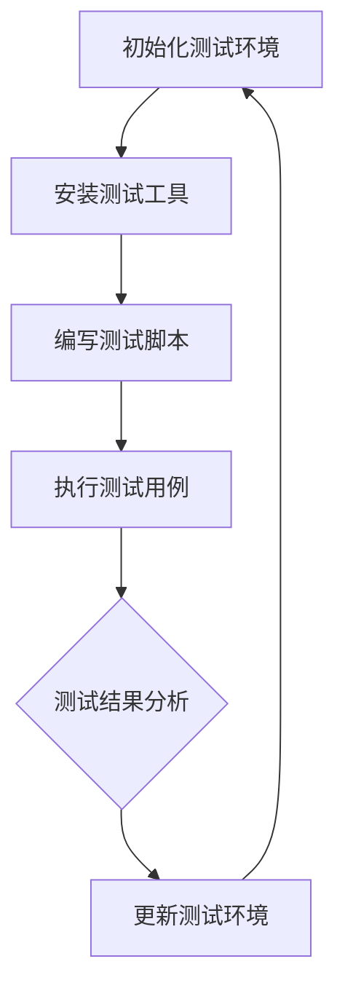
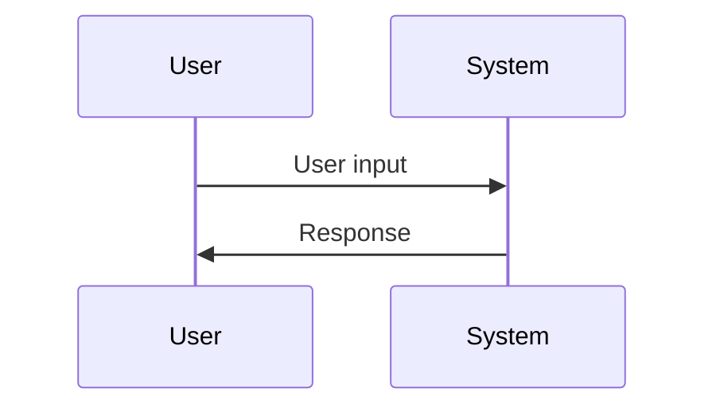
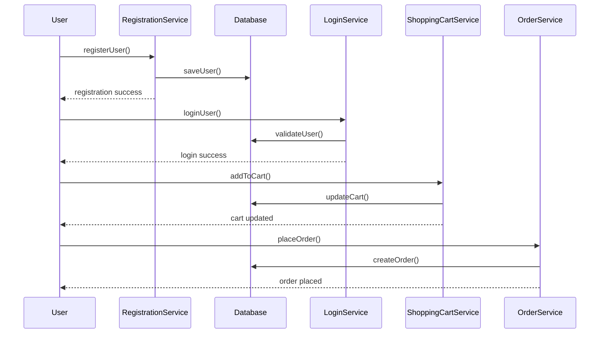

                 


### 评测系统的自动化测试环境配置

#### 关键词

- 自动化测试
- 测试环境
- 配置管理
- 操作系统兼容性
- 硬件配置
- 软件版本管理
- 测试工具选择
- 测试脚本开发

#### 摘要

本文旨在深入探讨评测系统的自动化测试环境配置，详细解析其核心概念、关键步骤和最佳实践。通过系统化的分析与实际案例剖析，本文将为读者提供全面的指导，助力构建稳定、高效的自动化测试环境，从而提升软件质量和开发效率。

#### 1. 背景介绍

##### 问题背景

随着软件行业的发展，自动化测试已经成为提升软件质量和效率的关键手段。自动化测试不仅能提高测试效率，减少人为错误，还能确保在软件迭代过程中及时发现问题。评测系统的自动化测试环境配置是自动化测试顺利进行的基石。

##### 问题描述

评测系统的自动化测试环境配置涉及多个方面，包括测试环境的搭建、配置和管理。具体问题包括：

- **操作系统兼容性**：不同操作系统（如Windows、Linux、macOS）的配置要求不同，需要确保测试环境的兼容性。
- **硬件配置**：测试环境的硬件配置需要满足测试需求，包括CPU、内存、存储等。
- **软件版本管理**：软件版本的兼容性是确保测试环境稳定的关键，需要合理管理不同软件的版本。
- **测试工具选择**：选择适合的自动化测试工具，如Selenium、JMeter、Appium等，以满足不同的测试需求。
- **测试脚本开发**：开发高效的测试脚本，实现自动化测试流程。

##### 问题解决

为了解决上述问题，需要采取以下措施：

- **规划与设计**：在开始自动化测试环境配置之前，进行详细的规划与设计，明确测试目标和测试策略。
- **测试工具选择**：根据测试需求选择合适的自动化测试工具，并进行配置。
- **测试脚本开发**：编写高效、可维护的测试脚本，确保测试流程的自动化。
- **测试数据准备**：准备充足、准确的测试数据，确保测试的全面性和准确性。
- **环境管理**：建立完善的环境管理机制，监控和更新测试环境，确保其稳定性和可靠性。

##### 边界与外延

环境配置的边界包括操作系统、硬件、软件等底层环境。其外延涉及测试策略、测试流程、测试数据管理等更高层次的测试活动。

#### 2. 核心概念与联系

##### 核心概念原理

- **自动化测试**：自动化测试是通过编写测试脚本，自动化执行测试用例的过程，以提高测试效率和准确性。
- **测试环境**：测试环境是进行自动化测试的基础设施，包括操作系统、硬件配置、软件安装等。
- **配置管理**：配置管理是对测试环境中的软件、硬件、网络等进行管理和配置的过程。
- **操作系统兼容性**：操作系统兼容性是指测试环境中的操作系统需要与被测试软件兼容，确保测试结果准确。
- **硬件配置**：硬件配置是指测试环境所需的硬件资源，如CPU、内存、存储等。
- **软件版本管理**：软件版本管理是指对测试环境中使用的软件进行版本控制和更新管理。
- **测试工具选择**：测试工具选择是根据测试需求选择合适的自动化测试工具，如Selenium、JMeter、Appium等。
- **测试脚本开发**：测试脚本开发是编写自动化测试脚本，实现自动化测试流程的过程。

##### 概念属性特征对比表格

| 概念           | 属性特征                                                         |
|----------------|----------------------------------------------------------------|
| 自动化测试     | 提高测试效率、准确性，减少人为错误                                  |
| 测试环境       | 操作系统、硬件配置、软件安装                                       |
| 配置管理       | 软件更新、硬件配置、网络配置                                       |
| 操作系统兼容性 | 操作系统与被测试软件的兼容性                                       |
| 硬件配置       | CPU、内存、存储等硬件资源                                         |
| 软件版本管理   | 版本控制、更新管理                                               |
| 测试工具选择   | 根据测试需求选择合适的自动化测试工具                                 |
| 测试脚本开发   | 编写自动化测试脚本，实现自动化测试流程                               |

##### ER实体关系图架构

```mermaid
erDiagram
    OS ||--|{ TestEnvironment }|--| ConfigurationManagement
    Hardware ||--|{ TestEnvironment }|--| ConfigurationManagement
    Software ||--|{ TestEnvironment }|--| ConfigurationManagement
    TestTool ||--|{ ConfigurationManagement }|--| TestScriptDevelopment
    TestScript ||--|{ TestScriptDevelopment }|--| TestEnvironment
```

#### 3. 算法原理讲解

##### 自动化测试流程图



##### Python源代码

```python
# 测试脚本示例：用户登录测试
import unittest
from selenium import webdriver

class LoginTest(unittest.TestCase):
    def setUp(self):
        self.driver = webdriver.Chrome()

    def test_login(self):
        driver = self.driver
        driver.get("http://www.example.com/login")
        driver.find_element_by_name("username").send_keys("testuser")
        driver.find_element_by_name("password").send_keys("testpass")
        driver.find_element_by_name("login").click()
        assert "Dashboard" in driver.title

    def tearDown(self):
        self.driver.quit()

if __name__ == "__main__":
    unittest.main()
```

##### 算法原理

- **初始化测试环境**：启动测试工具，准备测试环境。
- **安装测试工具**：安装所需的自动化测试工具，如Selenium。
- **编写测试脚本**：根据测试需求编写测试脚本，如用户登录测试。
- **执行测试用例**：运行测试脚本，执行测试用例。
- **测试结果分析**：分析测试结果，确保测试通过。
- **更新测试环境**：根据测试结果更新测试环境，如修复测试失败的用例。

##### 数学模型和公式

```latex
\begin{equation}
\text{测试覆盖率} = \frac{\text{已执行的测试用例数}}{\text{所有测试用例数}} \times 100\%
\end{equation}
```

##### 举例说明

假设一个评测系统有100个测试用例，其中已经执行了80个测试用例，那么测试覆盖率为：

```latex
\text{测试覆盖率} = \frac{80}{100} \times 100\% = 80\%
```

#### 4. 系统分析与架构设计方案

##### 问题场景介绍

以一个电商平台为例，需要对其用户注册、登录、购物车、订单处理等模块进行自动化测试。

##### 系统功能设计

```mermaid
classDiagram
    UserRegistration <<interface>>
    Login <<interface>>
    ShoppingCart <<interface>>
    OrderProcessing <<interface>>

    UserRegistration : +registerUser()
    Login : +loginUser()
    ShoppingCart : +addToCart()
    OrderProcessing : +placeOrder()
```

##### 系统架构设计



##### 系统接口设计

- **用户注册接口**：注册用户信息。
- **登录接口**：验证用户登录信息。
- **购物车接口**：添加商品、删除商品、修改数量等。
- **订单处理接口**：创建订单、取消订单、查询订单状态等。

##### 系统交互



#### 5. 项目实战

##### 环境安装

1. 安装操作系统（如Windows 10）。
2. 安装Java开发工具包（JDK）。
3. 安装Chrome浏览器和ChromeDriver。
4. 安装Selenium WebDriver。

##### 系统核心实现源代码

```java
import org.openqa.selenium.By;
import org.openqa.selenium.WebDriver;
import org.openqa.selenium.WebElement;
import org.openqa.selenium.chrome.ChromeDriver;

public class LoginTest {
    public static void main(String[] args) {
        System.setProperty("webdriver.chrome.driver", "path/to/chromedriver");
        WebDriver driver = new ChromeDriver();
        driver.get("http://www.example.com/login");
        WebElement username = driver.findElement(By.name("username"));
        WebElement password = driver.findElement(By.name("password"));
        WebElement loginButton = driver.findElement(By.name("login"));
        username.sendKeys("testuser");
        password.sendKeys("testpass");
        loginButton.click();
        String title = driver.getTitle();
        System.out.println("Title of the page: " + title);
        driver.quit();
    }
}
```

##### 代码应用解读与分析

该代码示例演示了如何使用Selenium WebDriver进行用户登录测试。关键步骤包括：

1. 设置ChromeDriver的路径。
2. 创建ChromeDriver实例。
3. 打开登录页面。
4. 找到用户名和密码输入框，并输入相应的用户名和密码。
5. 找到登录按钮，并点击。
6. 获取登录后的页面标题，并打印。
7. 关闭浏览器。

代码的优化建议：

- 使用try-catch块来处理可能的异常情况。
- 使用页面元素定位的更多方法，以提高测试的灵活性和可维护性。
- 考虑使用页面对象模式，将页面元素封装为对象，提高代码的可读性和可维护性。

##### 实际案例分析和详细讲解剖析

以用户登录测试为例，详细讲解自动化测试的实现过程。

1. **测试目标**：验证用户登录功能是否正常工作。
2. **测试条件**：用户已注册，且拥有有效的用户名和密码。
3. **测试步骤**：
   - 启动浏览器。
   - 打开登录页面。
   - 输入用户名和密码。
   - 点击登录按钮。
   - 验证登录结果。
4. **测试脚本**：使用Selenium WebDriver实现用户登录测试脚本。
5. **测试结果**：成功登录并跳转到用户首页。

##### 项目小结

通过本次项目实战，我们成功实现了用户登录测试，并分析了代码的优劣，提出了优化建议。这为后续的自动化测试工作奠定了基础。接下来，我们将继续探讨自动化测试环境的配置和优化，以确保测试的全面性和准确性。

#### 6. 最佳实践 tips、小结、注意事项、拓展阅读

##### 最佳实践 tips

1. **环境配置**：在配置测试环境时，确保操作系统、浏览器和测试工具的版本兼容性。
2. **测试脚本**：编写测试脚本时，遵循代码规范，确保脚本的可读性和可维护性。
3. **数据管理**：合理管理测试数据，确保测试数据的准确性和完整性。
4. **自动化测试工具**：根据测试需求选择合适的自动化测试工具，如Selenium、JMeter、Appium等。
5. **持续集成**：将自动化测试集成到持续集成（CI）流程中，实现自动化测试的持续执行。

##### 小结

本文深入探讨了评测系统的自动化测试环境配置，从背景介绍、核心概念与联系、算法原理讲解、系统分析与架构设计方案、项目实战等方面进行了详细解析。通过本文的学习，读者应能够理解自动化测试环境配置的重要性，掌握核心概念和关键步骤，并能够独立搭建和优化自动化测试环境。

##### 注意事项

1. **兼容性**：确保测试环境的操作系统、浏览器和测试工具版本兼容。
2. **脚本编写**：编写测试脚本时，遵循代码规范，确保脚本的可读性和可维护性。
3. **测试数据**：合理管理测试数据，确保测试数据的准确性和完整性。
4. **持续优化**：定期评估和优化测试环境，提高测试效率和准确性。

##### 拓展阅读

1. 《Selenium WebDriver自动化测试实战》 - 张亚宁
2. 《JMeter性能测试实战》 - 魏清
3. 《Appium自动化测试实战》 - 刘立达
4. 《持续集成与自动化测试》 - 李宁

作者：AI天才研究院/AI Genius Institute & 禅与计算机程序设计艺术 /Zen And The Art of Computer Programming

