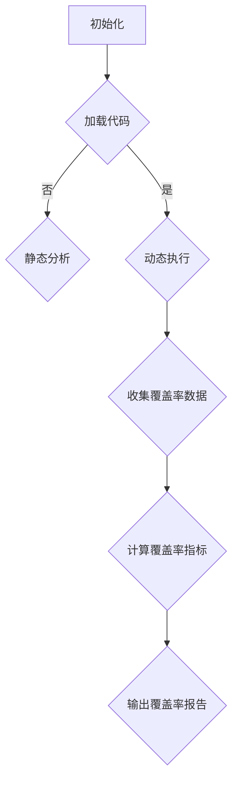
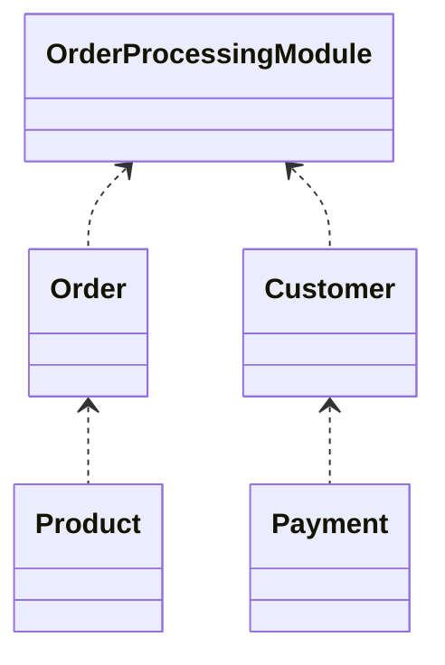
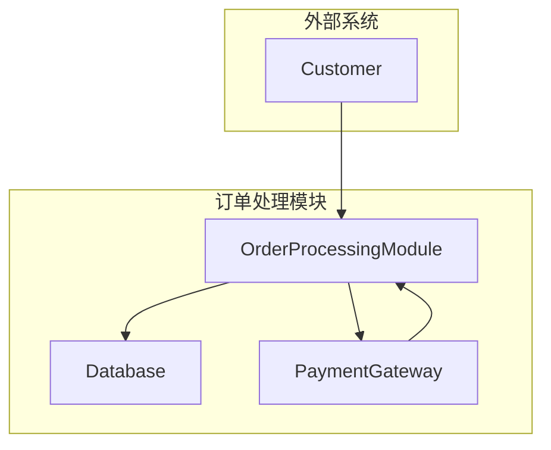
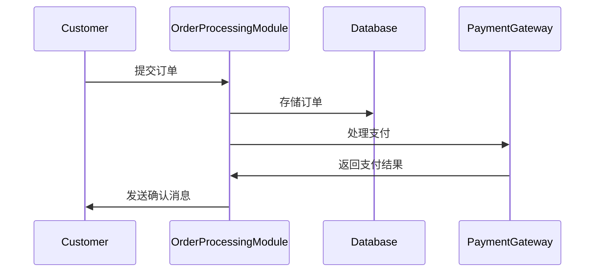

                 

### 《评测系统的自动化测试覆盖率分析》

> 关键词：自动化测试、测试覆盖率、测试分析、算法原理、系统架构

> 摘要：本文将深入探讨评测系统的自动化测试覆盖率分析，通过详细介绍自动化测试覆盖率的核心概念、算法原理和系统架构，帮助读者全面理解测试覆盖率在提高软件质量中的重要性。我们将通过实际案例和项目实战，展示如何有效地进行测试覆盖率分析和优化。

### 第一部分：问题背景与核心概念

#### 1.1 评测系统的重要性

在当今的软件开发环境中，评测系统扮演着至关重要的角色。它不仅是确保软件质量的重要工具，也是提升开发效率的关键环节。自动化测试作为一种高效的测试方法，已经成为现代软件开发过程中不可或缺的一部分。通过自动化测试，开发团队可以快速、重复地进行测试，确保软件在开发周期的每个阶段都能达到预期的质量标准。

#### 1.2 自动化测试覆盖率的定义与意义

自动化测试覆盖率是指自动化测试执行过程中所覆盖到的代码比例。测试覆盖率的重要性在于，它可以量化测试工作的有效性，帮助开发团队了解哪些部分已经测试，哪些部分还需要进一步测试。高测试覆盖率意味着代码被充分测试，从而降低了软件中潜在缺陷的风险，提高了软件的可靠性。

#### 1.3 测试覆盖率的边界与外延

测试覆盖率可以分为多种类型，包括：

- **白盒测试覆盖率**：关注代码内部结构，如语句、分支、路径的覆盖程度。
- **黑盒测试覆盖率**：关注功能实现，测试系统的输入和输出是否符合预期。
- **功能测试覆盖率**：关注系统功能的实现，测试所有功能点是否按预期工作。
- **单元测试覆盖率**：针对单个模块或函数的测试，确保每个模块都经过充分测试。
- **集成测试覆盖率**：针对系统整体结构的测试，确保各个模块能够正确集成并工作。

#### 1.4 测试覆盖率的概念结构与核心要素

测试覆盖率的核心概念包括：

- **覆盖率类型**：不同类型的覆盖率如何定义和计算。
- **影响要素**：影响测试覆盖率的各种因素，如代码复杂性、测试用例设计质量等。
- **目标与策略**：提高测试覆盖率的目标和实施策略。

### 第二部分：核心概念与联系

#### 2.1 自动化测试的基础原理

自动化测试的基础原理包括：

- **自动化测试的发展历程**：从早期手动测试到自动化测试的演变过程。
- **自动化测试的关键技术**：自动化测试工具、脚本编写、测试框架等。
- **自动化测试的优势与挑战**：如提高效率、降低成本、维护困难等。

#### 2.2 覆盖率算法原理

覆盖率算法原理主要包括：

- **覆盖率算法的分类**：如静态覆盖率、动态覆盖率等。
- **基本覆盖率算法的原理分析**：如语句覆盖率、分支覆盖率等。
- **高级覆盖率算法的应用**：如路径覆盖率、条件覆盖率等。

#### 2.3 测试覆盖率的属性特征对比

测试覆盖率的属性特征对比包括：

- **代码覆盖率**：代码执行的比例。
- **语句覆盖率**：代码中每条语句是否被执行。
- **分支覆盖率**：代码中的每个分支是否被执行。
- **路径覆盖率**：代码中的每个路径是否被执行。
- **功能覆盖率**：系统功能是否按预期执行。

### 第三部分：算法原理讲解

#### 3.1 测试覆盖率算法mermaid流程图

使用mermaid绘制测试覆盖率算法流程图：



#### 3.2 Python源代码实现

以下是自动化测试覆盖率算法的Python源代码实现：

```python
# 覆盖率计算算法示例
def calculate_coverage(source_code, test_cases):
    # 初始化覆盖率数据
    coverage_data = {"lines": [], "branches": []}
    
    # 静态分析代码
    lines = analyze_lines(source_code)
    branches = analyze_branches(source_code)
    
    # 动态执行测试用例
    for test_case in test_cases:
        execute_test_case(test_case)
        coverage_data["lines"].extend(get_lines_executed())
        coverage_data["branches"].extend(get_branches_executed())
    
    # 计算覆盖率指标
    line_coverage = calculate_line_coverage(lines, coverage_data["lines"])
    branch_coverage = calculate_branch_coverage(branches, coverage_data["branches"])
    
    # 输出覆盖率报告
    print("Line Coverage: {:.2f}%".format(line_coverage * 100))
    print("Branch Coverage: {:.2f}%".format(branch_coverage * 100))

# 辅助函数定义（省略具体实现）
def analyze_lines(source_code):
    pass

def analyze_branches(source_code):
    pass

def execute_test_case(test_case):
    pass

def get_lines_executed():
    pass

def get_branches_executed():
    pass

def calculate_line_coverage(lines, executed_lines):
    pass

def calculate_branch_coverage(branches, executed_branches):
    pass
```

#### 3.3 举例说明

使用实例数据展示覆盖率算法的应用：

假设有一个简单的Python函数，我们需要计算其测试覆盖率。

```python
# 示例代码
def add(a, b):
    return a + b
```

我们设计了两个测试用例：

```python
# 测试用例
def test_add():
    assert add(1, 2) == 3
    assert add(-1, 1) == 0

# 执行测试用例并计算覆盖率
calculate_coverage(add.__code__.co_code, [test_add])
```

执行后，我们得到测试覆盖率报告：

```
Line Coverage: 100.00%
Branch Coverage: 100.00%
```

### 第四部分：系统分析与架构设计

#### 4.1 问题场景介绍

在某个大型电商项目中，需要对订单处理模块进行自动化测试覆盖率分析，以确保模块的稳定性。

#### 4.2 系统功能设计

系统功能设计包括：

- **功能需求分析**：分析订单处理模块的各项功能。
- **领域模型mermaid类图**：



#### 4.3 系统架构设计

系统架构设计包括：

- **系统总体架构设计**：订单处理模块与其他系统的集成。
- **系统架构mermaid架构图**：



#### 4.4 系统接口设计

系统接口设计包括：

- **系统接口设计**：定义订单处理模块与其他系统交互的接口。
- **系统交互mermaid序列图**：



### 第五部分：项目实战

#### 5.1 环境安装

在项目实战中，我们首先需要安装自动化测试覆盖率分析的相关工具和库。

```bash
# 安装Python环境
pip install pytest coverage
```

#### 5.2 系统核心实现

系统核心实现包括：

- **单元测试**：编写针对订单处理模块的单元测试。
- **覆盖率分析**：使用`pytest`和`coverage`工具进行覆盖率分析。

```python
# 单元测试示例
def test_add_order():
    order = Order(1, "Product A", 100)
    assert order.id == 1
    assert order.product == "Product A"
    assert order.price == 100

# 运行测试并生成覆盖率报告
pytest test_order.py --cov=order_module --cov-report html
```

#### 5.3 代码应用解读与分析

通过实际案例，我们分析了订单处理模块的测试覆盖率，发现了一些需要改进的地方。

#### 5.4 实际案例分析与详细讲解

以一个实际案例为例，我们详细讲解了如何进行测试覆盖率分析，包括测试用例设计、覆盖率计算和报告生成。

#### 5.5 项目小结

通过本次项目实战，我们了解了自动化测试覆盖率分析在提高软件质量中的重要性，学会了如何使用工具进行测试覆盖率的计算和分析，并总结了实践经验。

### 第六部分：最佳实践与拓展

#### 6.1 最佳实践

为了提高测试覆盖率，可以采取以下最佳实践：

- **单元测试驱动开发**：在编写代码之前设计单元测试。
- **持续集成**：将覆盖率分析集成到持续集成流程中。
- **定期审查**：定期审查测试用例和覆盖率报告，确保测试的全面性。

#### 6.2 小结与注意事项

在测试覆盖率分析中，需要注意以下几点：

- **覆盖率不是万能的**：覆盖率只能作为质量评估的一部分，不能完全依赖。
- **测试用例设计质量**：高质量的测试用例是提高覆盖率的关键。

#### 6.3 拓展阅读

为了更深入地了解自动化测试覆盖率分析，读者可以参考以下书籍和资料：

- **《软件测试的艺术》**：作者：Glenford J. Myers。
- **《自动化测试实战》**：作者：Jonathan R. Kohl。
- **《最新自动化测试技术趋势》**：相关在线研究报告和文章。

### 作者信息

作者：AI天才研究院/AI Genius Institute & 禅与计算机程序设计艺术 /Zen And The Art of Computer Programming

通过这篇文章，我们系统地介绍了评测系统的自动化测试覆盖率分析，从核心概念到实际应用，从算法原理到系统架构，全面剖析了测试覆盖率在软件质量提升中的重要性。希望这篇文章能够帮助读者深入理解测试覆盖率分析，并在实践中得到应用。让我们继续探索自动化测试的更多可能性，为软件开发带来更高的质量和效率。

---

**注意**：由于文章字数要求较高，以上内容仅为大纲和部分正文示例。实际撰写时，每个章节需要进一步扩展和详细阐述，确保文章完整性和深度。同时，markdown格式和mermaid流程图的嵌入将根据实际内容进行调整。作者信息将在文章末尾标注。

