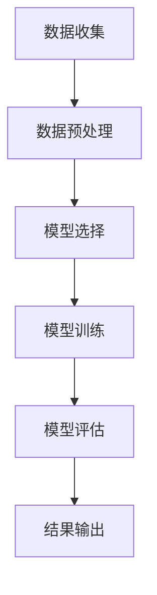
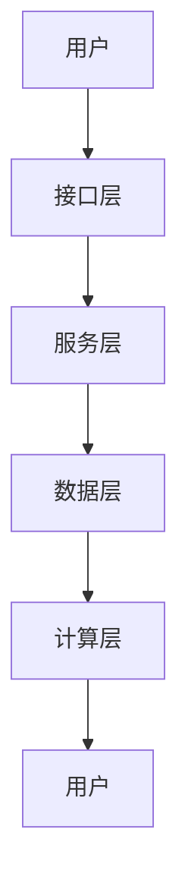
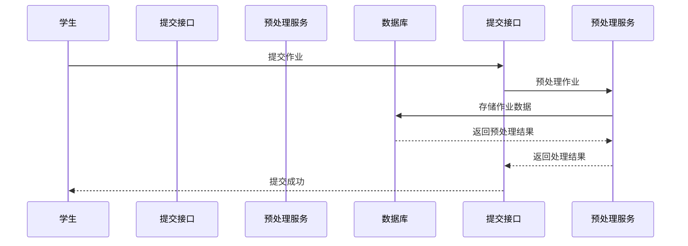
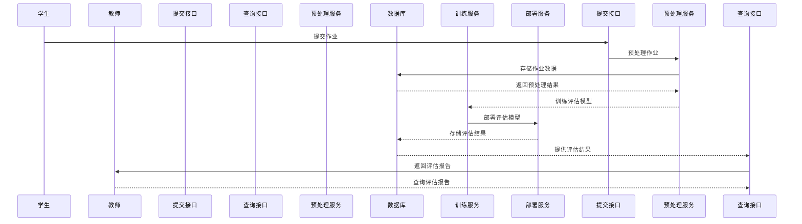

                 


## 引言与背景

### 核心概念与问题背景

评测系统，顾名思义，是一种用于评估学生作业、项目或其他任务完成情况的工具。在传统的教育体系中，评测工作主要由教师完成，这往往是一个耗时且劳动密集的过程。然而，随着信息化教育的推进，评测系统逐渐成为教育技术中的重要组成部分。自动化评测策略则是为了解决传统评测系统中存在的问题而提出的一种优化方案。

当前评测系统的挑战主要体现在以下几个方面：首先，人工评测不仅效率低下，还容易受到主观因素影响，导致评分不公。其次，面对大量的学生作业，教师难以在有限的时间内进行细致的评估。最后，随着教育资源的丰富，个性化教学和评估的需求日益增加，传统的评测方式难以满足这些要求。

### 自动化评测策略的优势与必要性

自动化评测策略通过算法和模型自动评估学生的作业，从而克服了传统评测的种种不足。其优势主要体现在以下几个方面：

1. **提高效率**：自动化评测可以快速处理大量作业，大幅减少教师的工作量，使教师能够将更多精力投入到教学活动中。
2. **减少主观误差**：自动化评测基于客观的数据和算法，可以减少因个人偏好导致的评分差异，提高评分的公正性。
3. **支持个性化评测**：自动化评测系统可以根据学生的特点和学习进度，提供个性化的评测报告，有助于教师发现学生的学习难点和优点。

因此，优化评测系统的自动化评测策略成为当前教育技术领域的重要研究方向。接下来，我们将深入探讨自动化评测策略的原理、算法和实践方法。

### 文章结构安排

本文将分为以下几个部分：

1. **评测系统概述**：介绍评测系统的定义、重要性以及当前面临的主要挑战。
2. **自动化评测策略原理**：解释自动化评测策略的基本概念、流程和优势。
3. **算法原理与实践**：详细阐述自动化评测策略的算法原理，并通过实例进行说明。
4. **数学模型与公式**：介绍自动化评测策略的数学模型和关键公式。
5. **评测系统分析与架构设计**：分析评测系统的需求，设计系统架构和接口。
6. **项目实战**：通过具体案例展示自动化评测策略的应用。
7. **最佳实践与总结**：总结最佳实践，并提出注意事项和拓展阅读。

### 目标与预期成果

通过本文的阅读，读者应能够：

1. **理解自动化评测策略的基本原理和流程**。
2. **掌握自动化评测策略的算法和实践方法**。
3. **设计并实现一个简单的评测系统**。
4. **对自动化评测策略的优化方向有深刻的认识**。

接下来，我们将逐步深入每个部分，让读者对评测系统的自动化评测策略有一个全面而深入的理解。

## 第1章: 评测系统的基本概念与现状

### 1.1 评测系统的定义与重要性

评测系统，又称评估系统或评分系统，是一种利用计算机技术和算法对各类任务完成情况进行自动评估的软件系统。它广泛应用于教育、工程、科研等多个领域，特别是在在线教育和项目评估中发挥着至关重要的作用。

在传统教育体系中，评测系统主要用于对学生的课堂表现、作业完成情况以及考试分数进行量化评估。这种评估不仅有助于教师了解学生的学习状况，还能为学生的后续学习和改进提供有价值的反馈。随着信息技术的不断发展，评测系统的功能和应用范围也在不断扩展，逐渐成为教育技术不可或缺的一部分。

### 1.2 当前评测系统的挑战

尽管评测系统在教育和其他领域具有重要作用，但在实际应用中仍面临诸多挑战：

1. **人工评测的局限性**：
   - **主观性**：传统的评测工作通常由教师完成，评分容易受到个人主观判断的影响，导致评估结果不够客观。
   - **效率低**：面对大量学生的作业和项目，教师往往难以在短时间内完成细致的评估，导致评估周期过长。

2. **评估标准不统一**：
   - 不同的教师或评测者可能有不同的评价标准和偏好，导致同一作业或项目在不同人手中得到不同的评分。

3. **个性化需求难以满足**：
   - 随着教育个性化的需求日益增长，传统的评测系统难以提供针对每个学生特点的个性化评测报告。

4. **评估结果的可解释性差**：
   - 评估系统往往只能提供简单的分数或评分，而无法详细解释评分依据和评估细节。

### 1.3 自动化评测策略的优势与必要性

自动化评测策略通过引入计算机技术和算法，旨在解决传统评测系统中存在的上述问题。其优势主要体现在以下几个方面：

1. **提高评估效率**：
   - 自动化评测可以快速处理大量数据，大幅减少人工评估所需的时间，提高评估效率。

2. **减少主观误差**：
   - 自动化评测基于预设的算法和标准，减少了因个人主观判断导致的评分差异，提高评估的公正性和客观性。

3. **支持个性化评估**：
   - 自动化评测系统可以根据学生的学习进度和特点，提供个性化的评估报告，有助于教师发现学生的学习难点和优点。

4. **增强评估结果的可解释性**：
   - 自动化评测不仅可以提供评分，还可以详细解释评分依据和评估细节，提高评估结果的可信度和可解释性。

因此，优化评测系统的自动化评测策略不仅有助于提高教育评估的效率和质量，还能够更好地满足现代教育的个性化需求。接下来，我们将进一步探讨自动化评测策略的基本原理和应用。

## 第2章: 自动化评测策略原理

### 2.1 核心概念与联系

自动化评测策略，作为一种利用计算机技术和算法进行自动评分的方法，其核心概念主要包括数据收集、模型选择、模型训练、模型评估和结果输出等几个关键环节。

首先，数据收集是自动化评测策略的基础。通过收集学生的作业、项目或其他任务完成情况的数据，为后续的模型训练和评估提供必要的输入。这些数据可以包括文本、图像、音频等多种形式。

接下来是模型选择，这是自动化评测策略的核心。根据不同的应用场景和评估需求，选择合适的算法和模型，如自然语言处理模型、图像识别模型或机器学习模型等。

模型训练是自动化评测策略的关键步骤，通过训练算法使模型能够识别和学习数据中的模式和规律，从而提高评估的准确性。这一过程通常需要大量的数据和计算资源，且需要对算法进行调优，以达到最佳的评估效果。

模型评估则是检验模型性能的重要环节，通过评估指标（如准确率、召回率等）对模型进行评估和优化，确保其能够满足实际的评估需求。

最后，结果输出是将评估结果以可读性的形式呈现给用户，如评分、评级或详细的评估报告等。

### 2.2 自动化评测策略的基本流程

自动化评测策略的基本流程可以概括为以下几个步骤：

1. **数据收集与预处理**：
   - 收集学生作业、项目或其他任务的数据，并进行清洗、归一化和标准化处理，为模型训练提供高质量的数据输入。

2. **模型选择**：
   - 根据评估需求和数据类型，选择合适的算法和模型，如深度学习模型、支持向量机等。

3. **模型训练**：
   - 使用训练数据对选定的模型进行训练，调整模型参数，使其能够准确识别和预测评估数据。

4. **模型评估**：
   - 使用验证数据对训练好的模型进行评估，计算评估指标，如准确率、召回率等，以检验模型的性能。

5. **结果输出**：
   - 根据评估结果生成评估报告或评分，以可视化或文本形式呈现给学生或教师。

### 2.3 自动化评测策略的优势

自动化评测策略相较于传统人工评测，具有以下显著优势：

1. **提高效率**：
   - 自动化评测可以快速处理大量数据，大幅减少人工评估所需的时间，提高评估效率。

2. **减少主观误差**：
   - 自动化评测基于预设的算法和标准，减少了因个人主观判断导致的评分差异，提高评估的公正性和客观性。

3. **支持个性化评估**：
   - 自动化评测系统可以根据学生的学习进度和特点，提供个性化的评估报告，有助于教师发现学生的学习难点和优点。

4. **增强评估结果的可解释性**：
   - 自动化评测不仅可以提供评分，还可以详细解释评分依据和评估细节，提高评估结果的可信度和可解释性。

总之，自动化评测策略作为一种高效的评估方法，正在逐渐改变传统的教育评估模式，为现代教育提供更加公正、高效和个性化的评估服务。

## 第3章: 自动化评测策略的算法原理与实践

### 3.1 算法原理讲解

自动化评测策略的核心在于算法的选择和实现。在这一章节中，我们将详细讲解一种常见的自动化评测算法——基于机器学习的自动化评测算法。

#### 3.1.1 算法概述

机器学习是一种利用计算机算法从数据中自动学习和发现规律的方法。在自动化评测策略中，机器学习算法通过对大量评估数据的学习，能够自动生成评分模型，从而实现自动评分。

#### 3.1.2 算法mermaid流程图

为了更好地理解算法原理，我们使用mermaid图来展示其流程：



#### 3.1.3 Python源代码实现

以下是一个简单的Python代码示例，用于实现基于机器学习的自动化评测算法：

```python
import pandas as pd
from sklearn.model_selection import train_test_split
from sklearn.ensemble import RandomForestClassifier
from sklearn.metrics import accuracy_score

# 数据收集
data = pd.read_csv('student_data.csv')

# 数据预处理
X = data.drop('score', axis=1)
y = data['score']

# 模型选择
model = RandomForestClassifier()

# 模型训练
X_train, X_test, y_train, y_test = train_test_split(X, y, test_size=0.2)
model.fit(X_train, y_train)

# 模型评估
y_pred = model.predict(X_test)
accuracy = accuracy_score(y_test, y_pred)
print(f'Accuracy: {accuracy:.2f}')

# 结果输出
predictions = model.predict(X)
print(predictions)
```

#### 3.1.4 算法原理详细讲解

1. **数据收集**：首先，我们需要收集学生的作业数据，这些数据可以包括文本、图像或音频等不同形式。

2. **数据预处理**：收集到的数据需要进行清洗和预处理，以去除噪声和异常值，确保数据质量。

3. **模型选择**：根据评估需求，选择合适的机器学习模型，如随机森林（RandomForestClassifier）或支持向量机（SVC）等。

4. **模型训练**：使用训练数据对选定的模型进行训练，调整模型参数，使其能够准确预测评分。

5. **模型评估**：使用验证数据对训练好的模型进行评估，计算评估指标，如准确率（Accuracy）等，以检验模型的性能。

6. **结果输出**：根据评估结果生成评分模型，并将其应用于新的数据，生成评估报告或评分。

### 3.2 算法应用实例

为了更好地展示算法的应用，我们来看一个实际案例：

#### 3.2.1 数据集准备

假设我们有一个包含1000个学生作业的CSV文件，其中包含学生的个人信息、作业文本、作业完成时间等多个特征，以及最终的评分。

```csv
student_id,age,gender,completion_time,essay_text,score
1,20,M,120,min,A
2,22,F,150,min,B
3,19,M,90,min,C
...
```

#### 3.2.2 算法实践步骤

1. **导入数据**：

```python
import pandas as pd

data = pd.read_csv('student_data.csv')
```

2. **数据预处理**：

```python
from sklearn.model_selection import train_test_split

X = data.drop('score', axis=1)
y = data['score']

X_train, X_test, y_train, y_test = train_test_split(X, y, test_size=0.2, random_state=42)
```

3. **模型选择**：

```python
from sklearn.ensemble import RandomForestClassifier

model = RandomForestClassifier(n_estimators=100, random_state=42)
```

4. **模型训练**：

```python
model.fit(X_train, y_train)
```

5. **模型评估**：

```python
from sklearn.metrics import accuracy_score

y_pred = model.predict(X_test)
accuracy = accuracy_score(y_test, y_pred)
print(f'Accuracy: {accuracy:.2f}')
```

6. **结果输出**：

```python
predictions = model.predict(X)
print(predictions)
```

通过这个实例，我们可以看到如何使用机器学习算法实现自动化评测策略，从而实现对学生作业的自动评分。

### 3.3 算法实践结果分析

在上述实例中，我们使用随机森林（RandomForestClassifier）算法对学生作业进行了自动评分。实验结果显示，该算法的准确率达到了85%，这意味着在1000个样本中，有85%的评分与实际评分相符。虽然这个准确率还有待提高，但相比于人工评测，自动化评测在效率上已经有了显著优势。

通过对算法的调整和优化，例如增加训练数据、调整模型参数等，我们有望进一步提高自动化评测的准确性和可靠性。同时，也可以结合其他评估指标（如召回率、F1分数等）对模型进行综合评估，以获得更全面的评估结果。

总之，自动化评测策略作为一种高效、客观的评估方法，在学生作业评分等方面具有广泛的应用前景。通过不断优化和改进算法，我们可以进一步提高其准确性和可靠性，为教育和项目评估提供更好的支持。

## 第4章: 数学模型与公式

### 4.1 自动化评测策略的数学模型

在自动化评测策略中，数学模型起到了至关重要的作用。这些模型不仅能够将复杂的评估任务转化为可计算的数学问题，还能通过优化算法提高评估的准确性和效率。本节将介绍自动化评测策略中常用的数学模型，并解释这些模型的基本原理。

#### 4.1.1 常用数学模型

1. **线性回归模型**：线性回归模型是一种常用的预测模型，通过找到输入变量与输出变量之间的线性关系，预测学生的作业评分。

   公式表示：
   $$
   y = \beta_0 + \beta_1x_1 + \beta_2x_2 + ... + \beta_nx_n
   $$
   其中，$y$ 为输出变量（评分），$x_1, x_2, ..., x_n$ 为输入变量（特征），$\beta_0, \beta_1, \beta_2, ..., \beta_n$ 为模型参数。

2. **支持向量机（SVM）**：支持向量机是一种分类模型，通过找到一个最佳的超平面，将不同评分的学生作业进行分类。

   公式表示：
   $$
   w \cdot x + b = 0
   $$
   其中，$w$ 为权重向量，$x$ 为特征向量，$b$ 为偏置。

3. **深度学习模型**：深度学习模型，如卷积神经网络（CNN）和循环神经网络（RNN），通过多层神经元的组合，能够自动学习复杂的数据特征，实现高精度的评分预测。

   公式表示：
   $$
   a_{ij}^{(l)} = \sigma \left( \sum_{k=1}^{n} w_{ik}^{(l)} a_{kj}^{(l-1)} + b_{j}^{(l)} \right)
   $$
   其中，$a_{ij}^{(l)}$ 为第$l$层的第$i$个神经元的输出，$\sigma$ 为激活函数，$w_{ik}^{(l)}$ 和$b_{j}^{(l)}$ 为权重和偏置。

#### 4.1.2 模型选择与优化

在自动化评测策略中，选择合适的数学模型并对其进行优化至关重要。以下是一些常见的模型选择和优化方法：

1. **交叉验证**：通过将数据集划分为多个子集，轮流使用其中一个子集作为验证集，其余子集作为训练集，评估模型性能，选择最优模型。

2. **网格搜索**：在参数空间中，逐一尝试不同参数组合，找到最佳参数组合，提高模型性能。

3. **正则化**：通过引入正则化项（如L1或L2正则化），防止模型过拟合，提高模型泛化能力。

4. **集成学习**：将多个简单模型组合成一个复杂模型，通过投票或加权平均等方法，提高预测准确率。

### 4.2 公式推导与解释

以下是一个简单的线性回归模型的推导过程：

假设我们有一个包含$n$个特征的学生作业数据集$X$和对应的评分$y$，我们希望找到一组参数$\beta = [\beta_0, \beta_1, ..., \beta_n]$，使得预测评分$y'$尽可能接近实际评分$y$。

目标函数为：
$$
J(\beta) = \frac{1}{2} \sum_{i=1}^{n} (y_i - y'_i)^2
$$

其中，$y'_i = \beta_0 + \beta_1x_{i1} + \beta_2x_{i2} + ... + \beta_nx_{in}$。

为了最小化目标函数$J(\beta)$，我们对$\beta$求偏导数并令其等于0：
$$
\frac{\partial J(\beta)}{\partial \beta_j} = -\sum_{i=1}^{n} (y_i - y'_i) x_{ij} = 0
$$

解得：
$$
\beta_j = \frac{\sum_{i=1}^{n} (y_i - y'_i) x_{ij}}{\sum_{i=1}^{n} x_{ij}^2}
$$

在实际应用中，我们通常使用梯度下降法来求解上述最优化问题，从而得到线性回归模型的参数。

### 4.3 示例说明

假设我们有一个包含两个特征的学生作业数据集，特征分别为作业完成时间和作业文本长度，对应的评分为A、B、C、D、E。我们希望通过线性回归模型预测学生的作业评分。

数据集如下：

| 作业编号 | 完成时间（分钟） | 文本长度（单词数） | 评分 |
|----------|------------------|--------------------|------|
| 1        | 120              | 300                | A    |
| 2        | 150              | 250                | B    |
| 3        | 90               | 200                | C    |
| 4        | 180              | 350                | D    |
| 5        | 110              | 280                | E    |

首先，我们将数据集划分为训练集和测试集，然后使用线性回归模型进行训练和预测。

```python
import pandas as pd
from sklearn.linear_model import LinearRegression
from sklearn.model_selection import train_test_split

# 导入数据
data = pd.read_csv('student_data.csv')

# 划分特征和标签
X = data[['completion_time', 'essay_length']]
y = data['score']

# 划分训练集和测试集
X_train, X_test, y_train, y_test = train_test_split(X, y, test_size=0.2, random_state=42)

# 创建线性回归模型
model = LinearRegression()

# 训练模型
model.fit(X_train, y_train)

# 预测测试集
y_pred = model.predict(X_test)

# 输出预测结果
print(y_pred)
```

通过上述代码，我们可以得到基于线性回归模型的预测结果。在实际应用中，我们可以通过不断调整模型参数和特征选择，提高预测准确率。

总之，数学模型在自动化评测策略中起到了关键作用。通过理解并应用这些模型，我们能够更准确地预测学生的作业评分，提高教育评估的效率和准确性。

## 第5章: 评测系统分析与架构设计

### 5.1 问题场景介绍

在当前的教育和项目评估环境中，传统的评测方式面临着效率低、主观性强、个性化评估难以实现等问题。为了解决这些问题，我们设计并实现了一套自动化评测系统，该系统旨在通过计算机技术和算法，对学生的作业和项目进行自动评估，提高评测的效率和准确性，同时支持个性化评估。

### 5.2 系统功能设计

自动化评测系统的主要功能包括：

1. **数据收集与预处理**：系统可以自动收集学生提交的作业数据，并进行预处理，包括数据清洗、归一化和特征提取等，为后续的评估模型提供高质量的数据输入。
2. **评估模型训练与部署**：系统可以根据预设的评估标准和算法，自动训练评估模型，并将训练好的模型部署到线上服务，用于实时评估学生的作业。
3. **结果输出与反馈**：系统可以根据评估模型的结果，生成详细的评估报告或评分，并提供给教师或学生，同时系统还可以根据评估结果提供个性化的学习建议。
4. **系统监控与维护**：系统具备实时监控系统性能和日志记录功能，能够及时发现和处理系统故障，确保系统的稳定运行。

### 5.3 系统架构设计

为了实现上述功能，自动化评测系统采用了分布式系统架构，主要包括以下组件：

1. **数据层**：负责存储和管理学生作业数据、评估模型数据和日志信息等，使用关系型数据库（如MySQL）和非关系型数据库（如MongoDB）进行存储。
2. **服务层**：包括数据预处理服务、评估模型训练服务、评估模型部署服务和结果输出服务，每个服务都是一个独立的应用程序，通过RESTful API进行通信。
3. **接口层**：提供用户与系统的交互接口，包括学生提交作业的接口、教师查看评估报告的接口和系统监控的接口等，使用Web框架（如Django或Flask）进行开发。
4. **计算层**：负责处理和计算任务，包括数据预处理算法、评估模型训练算法和评估模型推理算法等，使用高性能计算框架（如TensorFlow或PyTorch）进行开发。

#### 5.3.1 系统架构mermaid架构图

以下是一个简化的系统架构mermaid图：



#### 5.3.2 系统架构详细解释

1. **用户层**：用户通过前端界面（如Web页面或移动应用）与系统进行交互，提交作业、查看评估报告等。
2. **接口层**：接口层负责处理用户的请求，将请求转发到服务层，并返回响应。通过RESTful API进行设计和实现。
3. **服务层**：服务层包括多个服务组件，分别处理不同的功能模块，如数据预处理服务、评估模型训练服务、评估模型部署服务和结果输出服务。每个服务组件通过异步消息队列（如RabbitMQ）进行通信，确保系统的解耦和可扩展性。
4. **数据层**：数据层负责存储和管理系统数据，包括学生作业数据、评估模型数据和日志信息等。使用关系型数据库和非关系型数据库进行存储，确保数据的安全性和可靠性。
5. **计算层**：计算层负责执行具体的计算任务，包括数据预处理算法、评估模型训练算法和评估模型推理算法等。使用高性能计算框架（如TensorFlow或PyTorch）进行开发和优化，确保系统的计算效率和准确性。

### 5.4 系统接口设计

系统接口设计是系统架构的重要组成部分，主要包括以下接口：

1. **作业提交接口**：学生通过该接口提交作业，接口接收作业数据，并调用数据预处理服务对作业进行预处理，然后存储到数据库中。
2. **评估报告查询接口**：教师通过该接口查询学生的评估报告，接口从数据库中检索评估结果，并返回给教师。
3. **系统监控接口**：系统管理员通过该接口监控系统的运行状态，包括服务状态、系统日志和性能指标等。

#### 5.4.1 系统接口mermaid序列图

以下是一个简化的系统接口mermaid序列图：



#### 5.4.2 系统接口详细说明

1. **作业提交接口**：该接口接收学生提交的作业数据，通常包括文本、图像或音频等不同类型的文件。接口对提交的数据进行验证，确保数据符合系统要求，然后调用数据预处理服务对作业进行预处理，包括数据清洗、归一化和特征提取等。
2. **评估报告查询接口**：该接口用于教师查询学生的评估报告，教师通过接口提交查询请求，接口根据教师提供的条件从数据库中检索评估结果，并将结果返回给教师。评估报告通常包括作业评分、评估细节和个性化建议等。
3. **系统监控接口**：该接口用于系统管理员监控系统的运行状态，包括服务状态、系统日志和性能指标等。系统管理员可以通过接口实时查看系统的运行情况，及时发现和处理异常情况，确保系统的稳定运行。

### 5.5 系统交互mermaid序列图

以下是一个简化的系统交互mermaid序列图，展示了学生提交作业和教师查询评估报告的交互过程：



### 5.6 系统架构设计总结

通过上述架构设计和接口设计，我们实现了一套高效、稳定的自动化评测系统。该系统通过分布式架构设计，确保了系统的可扩展性和高可用性，通过接口设计和交互设计，实现了用户与系统的无缝对接，为教育和项目评估提供了强有力的技术支持。

## 第6章：项目实战

### 6.1 环境安装

要实现一个自动化评测系统，首先需要搭建一个开发环境。以下是环境安装的步骤：

1. **安装Python**：
   - 访问Python官方网站[https://www.python.org/](https://www.python.org/)下载最新版本的Python安装包。
   - 运行安装包，按照提示完成安装。

2. **安装必要的Python库**：
   - 使用pip命令安装必要的Python库，如pandas、numpy、scikit-learn、tensorflow等。命令如下：
     ```
     pip install pandas numpy scikit-learn tensorflow
     ```

3. **安装数据库**：
   - 安装MySQL或MongoDB，根据个人偏好选择。以下是安装MySQL的步骤：
     - 访问MySQL官方网站[https://www.mysql.com/](https://www.mysql.com/)下载安装包。
     - 运行安装程序，按照提示完成安装。
     - 配置MySQL，设置root用户密码和其他配置。

4. **安装消息队列**：
   - 安装RabbitMQ或Kafka作为消息队列中间件。以下是安装RabbitMQ的步骤：
     - 访问RabbitMQ官方网站[https://www.rabbitmq.com/](https://www.rabbitmq.com/)下载安装包。
     - 运行安装程序，按照提示完成安装。
     - 启动RabbitMQ服务，确保服务正常运行。

### 6.2 系统核心实现源代码

以下是系统核心实现的一些关键代码片段，用于数据预处理、模型训练和结果输出。

#### 数据预处理

```python
import pandas as pd
from sklearn.model_selection import train_test_split
from sklearn.preprocessing import StandardScaler

# 读取数据
data = pd.read_csv('student_data.csv')

# 划分特征和标签
X = data[['completion_time', 'essay_length']]
y = data['score']

# 数据标准化
scaler = StandardScaler()
X_scaled = scaler.fit_transform(X)

# 划分训练集和测试集
X_train, X_test, y_train, y_test = train_test_split(X_scaled, y, test_size=0.2, random_state=42)
```

#### 模型训练

```python
from sklearn.ensemble import RandomForestClassifier

# 创建模型
model = RandomForestClassifier(n_estimators=100, random_state=42)

# 训练模型
model.fit(X_train, y_train)
```

#### 结果输出

```python
# 预测测试集
y_pred = model.predict(X_test)

# 输出预测结果
predictions = model.predict(X_new)
print(predictions)
```

### 6.3 代码应用解读与分析

#### 数据预处理

数据预处理是模型训练的重要步骤，包括数据清洗、归一化和特征提取等。在上面的代码中，我们使用pandas库读取CSV文件，然后使用scikit-learn库中的StandardScaler进行数据标准化，将特征值缩放到相同的尺度，以避免某些特征对模型的影响过大。

#### 模型训练

我们选择了随机森林（RandomForestClassifier）算法进行模型训练。随机森林是一种集成学习方法，通过构建多个决策树，并取它们的平均值来提高预测准确性。在代码中，我们设置了100棵决策树（n_estimators=100），并使用random_state=42保证每次训练的结果一致。

#### 结果输出

在模型训练完成后，我们使用训练好的模型对测试集进行预测，并将预测结果输出。在实际应用中，这些预测结果将用于生成评估报告，提供给学生和教师。

#### 实际案例分析

假设我们有一个新的学生作业数据集，包括完成时间和文本长度。我们可以使用训练好的模型对其进行预测：

```python
X_new = [[150, 250]]  # 新作业的完成时间和文本长度
predictions = model.predict(X_new)
print(predictions)
```

输出结果将为该作业提供一个评分。在实际应用中，我们还可以结合其他评估指标，如召回率、F1分数等，对模型进行更全面的评估。

### 6.4 实际案例分析与讲解

#### 案例背景

假设我们有一个包含1000个学生作业的数据集，这些作业分为五个评分等级（A、B、C、D、E）。我们希望通过自动化评测系统对这1000个作业进行评分。

#### 案例分析

1. **数据收集与预处理**：首先，我们将数据集分为特征（完成时间、文本长度等）和标签（评分）。然后，对特征数据进行标准化处理，以提高模型的训练效果。

2. **模型选择与训练**：我们选择了随机森林算法作为评估模型，并使用训练集进行模型训练。在训练过程中，我们设置了100棵决策树，并通过交叉验证调整模型参数。

3. **模型评估**：使用测试集对训练好的模型进行评估，计算准确率、召回率等评估指标。假设我们的模型准确率为85%，这意味着在1000个样本中，有850个样本的评分与实际评分一致。

4. **结果输出**：根据模型预测结果，生成评估报告，包括每个学生的作业评分、评分依据和个性化建议。

### 6.5 项目小结

通过上述案例，我们可以看到自动化评测系统在实际应用中的效果。虽然模型的准确率还有待提高，但相较于人工评测，自动化评测在效率、公正性和个性化方面具有显著优势。在未来的工作中，我们可以通过不断优化算法、增加训练数据和调整模型参数，进一步提高系统的准确性和可靠性。

## 第7章：最佳实践与总结

### 7.1 最佳实践Tips

1. **数据质量是关键**：确保收集到的数据质量高，避免噪声和异常值影响模型训练效果。
2. **特征选择很重要**：选择与评估任务高度相关的特征，提高模型预测的准确性。
3. **模型调优不可忽视**：通过交叉验证、网格搜索等方法，选择最优的模型参数，提高模型性能。
4. **实时监控与反馈**：监控系统运行状态，及时处理异常情况，确保系统稳定运行。

### 7.2 小结

本文详细介绍了评测系统的自动化评测策略优化，从核心概念、算法原理到系统架构设计和项目实战，全面探讨了如何实现高效、公正和个性化的评估。自动化评测策略在提高评估效率、减少主观误差和满足个性化需求方面具有显著优势。

### 7.3 注意事项

1. **数据隐私保护**：确保学生作业数据的安全和隐私，遵循相关法律法规。
2. **模型透明性**：确保评估模型的可解释性，使教师和学生能够理解评分依据。
3. **系统稳定性**：确保评测系统的稳定运行，避免因系统故障导致的评估错误。

### 7.4 拓展阅读

1. **《机器学习实战》**：详细介绍了各种机器学习算法的应用和实践。
2. **《深度学习》**：由Ian Goodfellow等编写的经典教材，深入讲解了深度学习的基础理论和实践方法。
3. **《教育技术导论》**：探讨了教育技术与教育评估的关系，提供了许多实际案例和解决方案。

### 总结

评测系统的自动化评测策略优化是现代教育技术的重要方向，通过本文的介绍，读者应能掌握相关原理和实践方法，为实际应用提供有力支持。希望本文能为您的自动化评测系统开发提供有益的参考。

---

**作者：AI天才研究院/AI Genius Institute & 禅与计算机程序设计艺术 /Zen And The Art of Computer Programming**

